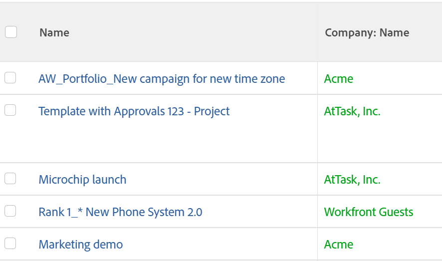

# Bedingte Formatierung im Textmodus verwenden

<!--Audited: 01/2024-->

<!--
(NOTE: Alina: this article might need to be split in its sections. Tony asked that numbers and dates should be in separate articles (??))
-->

Der standardmäßige Interface Builder bietet eine große Flexibilität bei der Erstellung von Berichterstellungselementen, die den Anforderungen Ihres Unternehmens gerecht werden.

Mithilfe der Standardoberfläche können Sie bedingte Formatierungen in einer Ansicht anwenden.\
Weitere Informationen zum Anwenden der bedingten Formatierung auf eine Ansicht finden Sie unter [Bedingte Formatierung in Ansichten verwenden](../../../reports-and-dashboards/reports/reporting-elements/use-conditional-formatting-views.md).

## Zugriffsanforderungen

+++ Erweitern Sie , um die Zugriffsanforderungen für die Funktionalität in diesem Artikel anzuzeigen.

Sie müssen über folgenden Zugriff verfügen, um die Schritte in diesem Artikel ausführen zu können:

<table style="table-layout:auto"> 
 <col> 
 <col> 
 <tbody> 
  <tr> 
   <td role="rowheader">Adobe Workfront-Abo</td> 
   <td> <p>Alle</p> </td> 
  </tr> 
  <tr> 
   <td role="rowheader">Adobe Workfront-Lizenz</td> 
   <td> <p>Neu: Standard </p> 
   <p>Oder</p>
   <p>Aktuell: Plan</p> 
   </td> 
  </tr> 
  <tr> 
   <td role="rowheader">Konfigurationen auf Zugriffsebene*</td> 
   <td> <p>Zugriff auf Filter, Ansichten, Gruppierungen bearbeiten</p> <p>Zugriff auf Berichte, Dashboards und Kalender bearbeiten, um Ansichten in einem Bericht zu bearbeiten</p> </td> 
  </tr> 
  <tr> 
   <td role="rowheader">Objektberechtigungen</td> 
   <td> <p>Berechtigungen für einen Bericht zum Bearbeiten von Ansichten in einem Bericht verwalten</p> <p>Berechtigungen für eine Ansicht verwalten</p> </td> 
  </tr> 
 </tbody> 
</table>

Weitere Informationen zu den Informationen in dieser Tabelle finden Sie unter [Zugriffsanforderungen in der Dokumentation zu Workfront](/help/quicksilver/administration-and-setup/add-users/access-levels-and-object-permissions/access-level-requirements-in-documentation.md).

+++


## Bedingte Formatierung im Textmodus

Im Textmodus können Sie komplexere Ansichten, Filter, Gruppierungen und Eingabeaufforderungen erstellen, indem Sie Felder verwenden, die in der Standardoberfläche nicht verfügbar sind.

Eine vollständige Liste aller unserer berichtspflichtigen Felder finden Sie im Abschnitt  [API-Explorer](../../../wf-api/general/api-explorer.md).

Weitere Informationen zur Verwendung der Textmodussyntax finden Sie unter [Übersicht über die Syntax der Textmodi](../../../reports-and-dashboards/reports/text-mode/text-mode-syntax-overview.md).

Sie können auch den Textmodus verwenden, um Ansichten in Berichten und Listen zu formatieren. Mithilfe der bedingten Formatierung können Sie die Ansichten Ihrer Berichte ändern, indem Sie den Schrifttyp und den Hintergrund der Ergebnisse im Bericht sowie Symbole und Flags ändern. Es wird empfohlen, dass Sie Ihre Ansichten immer zuerst über die Standardschnittstelle erstellen und nur dann zur Textmodus-Oberfläche wechseln, wenn dies unbedingt erforderlich ist.

>[!NOTE]
>
> Die Verwendung von CSS-Stilen zum Anpassen der bedingten Formatierung wird nicht unterstützt. Stattdessen müssen Sie die vordefinierten Formatierungsoptionen verwenden, die in Adobe Workfront verfügbar sind.

## Bedingte Formatierung zu Ansichten hinzufügen

Weitere Informationen zum Anwenden der bedingten Formatierung auf eine Ansicht in der Standard-Builder-Oberfläche finden Sie unter [Bedingte Formatierung in Ansichten verwenden](../../../reports-and-dashboards/reports/reporting-elements/use-conditional-formatting-views.md).

So fügen Sie einer Ansicht in der Textmodus-Oberfläche bedingte Formatierungen hinzu:

1. Navigieren Sie zu einer Liste von Objekten.
1. Erweitern Sie das Dropdown-Menü einer Ansicht, der Sie bedingte Formatierung hinzufügen möchten.
1. Klicks **Ansicht anpassen**.
1. Klicken Sie auf die Spalte in der Ansicht, auf die Sie die bedingte Formatierung anwenden möchten.
1. Klicks **In den Textmodus wechseln**.
1. Im **In dieser Spalte anzeigen:** Bereich, klicken Sie **Klicken, um Text zu bearbeiten**.
1. Codebeispiele hinzufügen, die in [Ansichten im Textmodus formatieren](#format-views-using-text-mode) am unteren Rand des Textes in der ausgewählten Spalte.
1. Klicks **Speichern** Klicken Sie auf **Ansicht speichern**.

## Ansichten im Textmodus formatieren {#format-views-using-text-mode}

Sie können die folgenden Komponenten zu einer Spalte hinzufügen, um sie im Textmodus bedingt zu formatieren:

* [Spalteneinstellungen](#column-settings)
* [Spaltenregeln](#column-rules)
* [Bedingtes Formatieren eines Werteausdrucks](#conditionally-format-a-valueexpression)

### Spalteneinstellungen {#column-settings}

Sie müssen mit der Benutzeroberfläche des Textmodus vertraut sein, bevor Sie Ihren Ansichten bedingte Formatierungen hinzufügen können.

Sie können die folgenden Elemente einer Spalte anpassen, wenn Sie die bedingte Formatierung in einer Ansicht verwenden:

* [Spaltenüberschriften](#column-headers)
* [Datumsangaben formatieren](#format-dates)
* [Formatnummern](#format-numbers)

#### Spaltenüberschriften {#column-headers}

Fügen Sie Ihrer Spalte den folgenden Code hinzu, um die angezeigte Spaltenüberschrift zu ändern: `displayname= [Name of column]`. Um beispielsweise eine Spalte &quot;Projekteigentümer&quot;zu benennen, würde der Textcode wie folgt aussehen:

`displayname=Project Owner`

#### Datumsangaben formatieren {#format-dates}

Daten können so konfiguriert werden, dass sie in verschiedenen Formaten angezeigt werden.

Weitere Informationen finden Sie unter [Datumsangaben in Textmodusberichten formatieren](../../../reports-and-dashboards/reports/text-mode/format-dates-in-text-mode-reports.md).

<!--
<div data-mc-conditions="QuicksilverOrClassic.Draft mode"> 
<p data-mc-conditions="QuicksilverOrClassic.Draft mode">(NOTE: this is drafted and replaced by the article linked above)</p>
<p>To establish a date format, you must modify the <code>valueformat</code> line of the text mode code in the column.</p>
<pre>valueformat= [new date format]</pre>
<p>For example, if you wanted the Projected Completion Date to be displayed as MM/DD/YY the code would look like:</p>
<pre>valueformat=atDate<br>valuefield=projectedCompletionDate </pre>
<p>If you wanted to show the Planned Completion Date as <em>Mth, DD, Year</em>, the code would look like:</p>
<pre>valueformat=mediumAtdate<br>valuefield=plannedCompletionDate</pre>
<p>You can format dates using the following <code>valueformat</code> text mode values:</p>
<table style="table-layout:auto">
<col>
<col>
<col>
<thead>
<tr>
<th scope="col"><strong>Format</strong> </th>
<th scope="col">Example </th>
<th scope="col"><em><strong>valueformat=</strong></em> </th>
</tr>
</thead>
<tbody>
<tr>
<td>MM/DD/YY</td>
<td>10/11/18</td>
<td><pre>atDate</pre> </td>
</tr>
<tr>
<td>MM/DD/YY Time</td>
<td>10/11/18 12:00pm</td>
<td><pre>longAtDate</pre> </td>
</tr>
<tr>
<td>MM/DD/YY</td>
<td>10/11/18</td>
<td><pre>shortAtDate</pre> </td>
</tr>
<tr>
<td>Mth, DD, YR</td>
<td>Oct, 11, 2018</td>
<td><pre>mediumAtDate</pre> </td>
</tr>
<tr>
<td>DW, Mth, Day, YR</td>
<td>Mon, Oct, 11, 2018</td>
<td><pre>partialAtDate</pre> </td>
</tr>
<tr>
<td>DW, Mth, Day, YR Time</td>
<td>Mon, Oct, 11, 2018 12:00 pm</td>
<td><pre>fullAtDate</pre> </td>
</tr>
</tbody>
</table>
</div>
-->

#### Formatnummern {#format-numbers}

Sie können numerische Werte formatieren, um Informationen anzuzeigen, die Ihren Berichtsanforderungen am besten entsprechen.

Weitere Informationen finden Sie unter [Formatnummern, Währungs- und Prozentwerte in Textmodusberichten](../../../reports-and-dashboards/reports/text-mode/format-numbers-in-text-mode-reports.md).

<!--
<div data-mc-conditions="QuicksilverOrClassic.Draft mode">
<p>To modify the format of a numeric value, you must edit the <strong>valueformat</strong> line of your column.</p> 
<p data-mc-conditions="QuicksilverOrClassic.Draft mode">(NOTE: this is drafted and replaced by the article linked above) </p>
<p>For example, if you wanted to display the Budget column as $1000, the value format line would look like:</p>
<pre>valueformat=currencyStringCurrencyRounded<br>valuefield=budget</pre>
<p>You can format numbers using the following values for the <code>valueformat</code> line of your column:</p>
<table border="2" cellspacing="15" cellpadding="1">
<col>
<col>
<thead>
<tr>
<th scope="col"><strong>Example</strong> </th>
<th scope="col"><em><code>valueformat=</code></em> </th>
</tr>
</thead>
<tbody>
<tr>
<td>1234</td>
<td><pre>doubleAsString</pre> or <pre>int</pre></td>
</tr>
<tr>
<td>1,234</td>
<td><pre>doubleAsInt</pre> </td>
</tr>
<tr>
<td>$1,234</td>
<td><pre>currencyStringCurrencyRounded</pre> </td>
</tr>
<tr>
<td>1234.56</td>
<td><pre>doubleAsDouble</pre> </td>
</tr>
<tr>
<td>$1,234.56</td>
<td><pre>currencyStringCurrency</pre> </td>
</tr>
<tr>
<td>12%</td>
<td><pre>doubleAsPercentRounded</pre> </td>
</tr>
<tr>
<td>12.34%</td>
<td><pre>doubleAsPercent</pre> </td>
</tr>
<tr>
<td>(1,234.56)</td>
<td><pre>doubleAsFinancial</pre> </td>
</tr>
<tr>
<td>(1,234)</td>
<td><pre>doubleAsFiancialRounded</pre> </td>
</tr>
</tbody>
</table>
</div>
-->

### Spaltenregeln {#column-rules}

Mithilfe von Spaltenregeln können Bilder, Farben, Formatierungen und Textüberschreibungen in einer Ansicht hinzugefügt werden. Spaltenregeln können unabhängig erstellt werden oder mehrere Bedingungen für eine Spalte enthalten.

* [Bedingte Formatierung](#conditional-formatting)
* [Mehrere bedingte Formate](#multiple-conditional-formats)
* [Text anwenden](#apply-text)
* [Anwenden von Zeilenformaten](#apply-row-formats)
* [Bilder anwenden](#apply-images)

#### Bedingte Formatierung {#conditional-formatting}

Beim Einbinden von Farbe oder Formatierungstext muss eine bestimmte Textmodusanweisung angewendet werden.

>[!NOTE]
>
>Die bedingte Formatierung wird in zusammengeführten Spalten möglicherweise nicht unterstützt.\
>Weitere Informationen zum Zusammenführen von Spalten mit dem Textmodus finden Sie unter [Ansicht: Zusammenführen von Informationen aus mehreren Spalten in einer gemeinsamen Spalte](../../../reports-and-dashboards/reports/custom-view-filter-grouping-samples/view-merge-columns.md).

Fügen Sie den folgenden Code in jede Spalte ein, der Sie bedingte Formatierungen hinzufügen möchten:

```
styledef.case.0.comparison.leftmethod= [field name]
styledef.case.0.comparison.lefttext= [field name]
styledef.case.0.comparison.righttext= [field value]
styledef.case.0.comparison.operator= [qualifier]
styledef.case.0.comparison.operatortype= [data type]
styledef.case.0.comparison.icon=false
styledef.case.0.comparison.truetext= 
styledef.case.0.comparison.trueproperty.0.name= [format option]
styledef.case.0.comparison.trueproperty.0.value= [format style]
```

>[!NOTE]
>
>Die `styledef.case.0.comparison.icon` ist immer &quot;false&quot;, es sei denn, Sie arbeiten mit Symbolen.
>
>Die `styledef.case.0.comparison.truetext` bleibt immer leer, bis die Arbeit mit überschreibtem Text abgeschlossen ist.
>
>Die `styledef.case.0.comparison.righttext` leer ist, wenn der Qualifizierer nicht leer ist.

Wenn Sie beispielsweise den Unternehmensnamen in grünem Text in einem Projektbericht anzeigen möchten, können Sie den folgenden Code verwenden:

```
styledef.case.0.comparison.leftmethod=company:name
styledef.case.0.comparison.lefttext=company:name ;
styledef.case.0.comparison.righttext= 
styledef.case.0.comparison.operator=notblank
styledef.case.0.comparison.operatortype=string
styledef.case.0.comparison.icon=false
styledef.case.0.comparison.truetext=
styledef.case.0.comparison.trueproperty.0.name=textcolor
styledef.case.0.comparison.trueproperty.0.value=03a219
```

>[!NOTE]
>
>* Diese Anweisung kann zwar auf eine Spalte mit dem Unternehmensnamen angewendet werden, kann aber auch auf jede andere Spalte im Bericht angewendet werden. Grüner Text wird nur angezeigt, wenn dem Projekt ein Unternehmen zugeordnet ist. Speichern Sie die `[field name]`, `[value]`, und `[qualifier]` steuern, ob die Bedingung letztendlich in der Spalte angezeigt wird oder nicht.
>* Beim Arbeiten mit Qualifikatoren wird empfohlen, `cicontains` anstelle von `equal`. Standardmäßig ist `equal` sucht nach ID-Nummern. Verwenden der `cicontains` qualifiziert, können Sie auf Elemente nach ihrem Namen zugreifen.




Unabhängig davon, ob Textfarbe, Ausrichtung, Schriftstil oder Hintergrundfarbe auf einen Textmodus angewendet werden, wird dieselbe Anweisung (wie oben gezeigt) verwendet.

Die folgenden Zeilen müssen entsprechend der für die Spalte benötigten Formatierung geändert werden:

```
styledef.case.0.comparison.trueproperty.0.name= [format option]
styledef.case.0.comparison.trueproperty.0.value= [format style]
```

Verwenden Sie die folgenden Tabellen, um zu bestimmen, welche Zeilen geändert werden müssen und welche Werte Sie angeben müssen, um den Formatstil Ihrer Spalte zu definieren:

| **Textfarbe** | **Zeile: textcolor=** |
|---|---|
| Schwarz | `000000` |
| Dunkelblau | `0c6aca` |
| Tee | `1b878c` |
| Grün | `03a219` |
| Lila | `6408c4` |
| Grau | `767676` |
| Rot | `d30519` |
| Gelb | `e19503` |

{style="table-layout:auto"}

| **Ausrichtung** | **Linie: align=** |
|---|---|
| Linksausrichtung | `left` |
| Rechtsausrichtung | `right` |
| Ausrichtung zentrieren | `center` |

{style="table-layout:auto"}

| Schriftart | Zeile: ***fontstyle=*** |
|---|---|
| Fett | `bold` |
| Kursiv | `italic` |

{style="table-layout:auto"}

| **Hintergrundfarbe** | **Zeile: bgcolor=** |
|---|---|
| Tee | `dcf6f7` |
| Grün | `def6e2` |
| Grau | `e8e8e8` |
| Blau | `e8f1ff` |
| Lila | `e9def4` |
| Rot | `eac6c9` |
| Gelb | `feecc8` |
| Weiß | `ffffff` |

{style="table-layout:auto"}

#### Mehrere bedingte Formate {#multiple-conditional-formats}

Sie können mehrere Formatierungsstile auf eine Anweisung anwenden. Die Core-Anweisung bleibt unverändert und alle zusätzlichen Formatierungsausdrücke werden zur -Anweisung hinzugefügt.

Verwenden Sie beispielsweise die frühere Anweisung, um den Firmennamen in grün gefalteten Text einzuschließen. Die Anweisung würde mit dem folgenden Code geschrieben:

```
styledef.case.0.comparison.leftmethod=company:name
styledef.case.0.comparison.lefttext=company:name
styledef.case.0.comparison.righttext=
styledef.case.0.comparison.operator=notblank
styledef.case.0.comparison.operatortype=string
styledef.case.0.comparison.icon=false
styledef.case.0.comparison.truetext= 
styledef.case.0.comparison.trueproperty.0.name=textcolor
styledef.case.0.comparison.trueproperty.0.value=03a219
styledef.case.0.comparison.trueproperty.1.name=fontstyle
styledef.case.0.comparison.trueproperty.1.value=bold
```

>[!NOTE]
>
>Wenn Sie mehr als einen bedingten Formatierungsausdruck einschließen, müssen Sie jeden Ausdruck in der Anweisung numerisch identifizieren. Beachten Sie, dass Ausdruck 0 und Ausdruck 1 identifiziert wurden.

#### Text anwenden {#apply-text}

Wenn Sie die Standardwerte, die in einer Spalte enthalten sind, durch einen Wert Ihrer Wahl ersetzen möchten, ist es möglich, Text auf die Spalte anzuwenden.

Legen Sie beispielsweise in einem Projektbericht den Wert für die Spalte &quot;Geplantes Startdatum&quot;fest, um nicht das geplante Startdatum für das Projekt anzuzeigen, sondern den Text &quot;Nicht heute&quot;. Verwenden Sie den folgenden Code für die Spalte &quot;Geplantes Startdatum&quot;:

```
case.0.comparison.leftmethod=plannedStartDate
case.0.comparison.lefttext=plannedStartDate
case.0.comparison.righttext=2013-04-10T10:45:00:000
case.0.comparison.operator=ne
case.0.comparison.operatortype=date
case.0.comparison.icon=false
case.0.comparison.truetext=not today
styledef.case.0.comparison.leftmethod=plannedStartDate
styledef.case.0.comparison.lefttext=plannedStartDate
styledef.case.0.comparison.righttext=2013-04-10T10:45:00:000 
styledef.case.0.comparison.operator=ne
styledef.case.0.comparison.operatortype=date&
styledef.case.0.comparison.icon=false
styledef.case.0.comparison.truetext=not today
```

>[!NOTE]
>
>Die Zeilen, die mit `case.0.` Fallvergleiche zur Identifizierung der Verwendung von Text. Die Zeilen, die mit `styledef.case.0.` sind frühzeitige bedingte Formatierungsanweisungen, bei denen wir die Verwendung von Text über die `truetext` Ausdruck. Stellen Sie sicher, dass `truetext` auf einen Wert setzen, anstatt ihn leer zu lassen.


#### Anwenden von Zeilenformaten {#apply-row-formats}

Wenn Sie eine Bedingung auf die gesamte Zeile anwenden möchten, verwenden Sie den folgenden Code mit Ihrem Spaltencode:


```
styledef.case.0.comparison.icon=false
styledef.case.0.comparison.isrowcase=true
styledef.case.0.comparison.leftmethod= [field name]
styledef.case.0.comparison.lefttext= [field name]
styledef.case.0.comparison.operator= [qualifier]
styledef.case.0.comparison.operatortype= [data type]
styledef.case.0.comparison.righttext= [field value]
styledef.case.0.comparison.trueproperty.0.name= [format option]
styledef.case.0.comparison.trueproperty.0.value= [format style]
styledef.case.0.comparison.truetext=
row.0.styledef.applyallcases=true
row.0.styledef.case.0.comparison.icon=false
row.0.styledef.case.0.comparison.isrowcase=true
row.0.styledef.case.0.comparison.leftmethod= [field name]
row.0.styledef.case.0.comparison.lefttext= [field name]
row.0.styledef.case.0.comparison.operator= [qualifier]
row.0.styledef.case.0.comparison.operatortype= [data type]
row.0.styledef.case.0.comparison.righttext= [field value]
row.0.styledef.case.0.comparison.trueproperty.0.name= [format option]
row.0.styledef.case.0.comparison.trueproperty.0.value= [format style]
row.0.styledef.case.0.comparison.truetext=
```


#### Bilder anwenden {#apply-images}

Ähnlich wie bei der Textformatierung können auch Bilder verwendet werden, um Informationen in Berichten anzuzeigen. Workfront verfügt über eine Reihe integrierter Bilder, die visuelle Informationen in einer Berichtseinstellung vermitteln. Um Bilder in der Einstellung für die bedingte Formatierung zu verwenden, ist die folgende Anweisung erforderlich:

```
image.case.0.comparison.leftmethod= [field name]
image.case.0.comparison.lefttext= [field name]
image.case.0.comparison.righttext= [field value]
image.case.0.comparison.operator= [qualifier]
image.case.0.comparison.operatortype= [data type]
image.case.0.comparison.icon=true
image.case.0.comparison.truetext=
```

Beispielsweise möchten Sie in einem Projektbericht eine Spalte erstellen, in der Sie für jedes geplante Abschlussdatum, das nicht dem heutigen Datum entspricht, ein ungefärbtes Gesicht anzeigen. Verwenden Sie den folgenden Textmoduscode, um das Symbol zu Ihrer Spalte hinzuzufügen:


```
image.case.0.comparison.leftmethod=plannedCompletionDate
image.case.0.comparison.lefttext=plannedCompletionDate
image.case.0.comparison.righttext=2013-04-10T13:00:00:000 
image.case.0.comparison.operator=ne 
image.case.0.comparison.operatortype=date
image.case.0.comparison.icon=true
image.case.0.comparison.truetext=/interface/images/v4_redux/icons/casebuilder/emoticon_frown.gif
```

>[!NOTE]
>
>Beachten Sie, dass die -Anweisung die `icon=true` Ausdruck. Diese Anweisung unterscheidet sich auch von anderen Anweisungen zur bedingten Formatierung insofern, als sie die `style.def` -Format, sondern ein einzigartiges Bildformat.


Um die verfügbaren Bilder zu verwenden, wenden Sie den folgenden Code und die folgenden Werte an:

| **Symbol** | **Zeile: image.case.0.compare.truetext=** |
|---|---|
| Frostes Gesicht  | =`/interface/images/v4_redux/icons/casebuilder/emoticon_frown.gif` |
| Happy Face  | =`/interface/images/v4_redux/icons/casebuilder/emoticon_smile.gif` |
| Blaue Markierung   | =`/interface/images/v4_redux/icons/casebuilder/flag_blue.gif` |
| Grüne Flagge   | =`/interface/images/v4_redux/icons/casebuilder/flag_green.gif` |
| Rote Markierung   | =`/interface/images/v4_redux/icons/casebuilder/flag_red.gif` |
| Gelbe Markierung   | =`/interface/images/v4_redux/icons/casebuilder/flag_yellow.gif` |
| Schwarzer Kreis   | =`/interface/images/v4_redux/icons/casebuilder/light_black.gif` |
| Blauer Kreis  | =`/interface/images/v4_redux/icons/casebuilder/light_blue.gif` |
| Grauer Kreis  | =`/interface/images/v4_redux/icons/casebuilder/light_grey.gif` |
| Grüner Kreis  | =`/interface/images/v4_redux/icons/casebuilder/light_green.gif` |
| orangefarbener Kreis  | =`/interface/images/v4_redux/icons/casebuilder/light_orange.gif` |
| Rosa Kreis  | =`/interface/images/v4_redux/icons/casebuilder/light_pink.gif` |
| Purple Circle  | =`/interface/images/v4_redux/icons/casebuilder/light_purple.gif` |
| Roter Kreis  | =`/interface/images/v4_redux/icons/casebuilder/light_red.gif` |
| Weißer Kreis  | =`/interface/images/v4_redux/icons/casebuilder/light_white.gif` |
| Gelber Kreis  | =`/interface/images/v4_redux/icons/casebuilder/light_yellow.gif` |

{style="table-layout:auto"}

### Bedingtes Formatieren eines `valueexpression` {#conditionally-format-a-valueexpression}

Um einen berechneten Wert in einer Spalte anzuzeigen, können Sie die Variable `valuefield` Codezeile in der Spalte mit einer `valueexpression`. Mit einem berechneten Wert können Sie einen neuen Wert für ein Objekt anzeigen, der auf der Berechnung zwischen zwei vorhandenen Feldern desselben Objekts basiert.

Weitere Informationen zum Formatieren der `valueexpression line`, siehe [Übersicht über die Syntax der Textmodi](../../../reports-and-dashboards/reports/text-mode/text-mode-syntax-overview.md).

Eine Spalte, die eine `valueexpression` Codezeile. Stattdessen können Sie einem benutzerdefinierten Formular ein berechnetes benutzerdefiniertes Feld hinzufügen und es mit den Objekten verknüpfen, die Sie im Bericht anzeigen. Anschließend können Sie die Spalten, in denen dieses Feld angezeigt wird, bedingt formatieren.

Weitere Informationen zu berechneten benutzerdefinierten Feldern finden Sie unter [Hinzufügen errechneter Daten zu einem benutzerdefinierten Formular](../../../administration-and-setup/customize-workfront/create-manage-custom-forms/add-calculated-data-to-custom-form.md).

## Aggregatorwert in einer Spalte vom Typ Textmodus hinzufügen

Es wird empfohlen, zuerst die Spalte in der Erstellungsoberfläche zu erstellen, dort den Aggregatorwert hinzuzufügen und dann die Spalte im Textmodus zu bearbeiten.

Beachten Sie beim Hinzufügen von Aggregatoren zu einer Spalte im Textmodus Folgendes:

* Die Werte in der Spalte müssen ein Format aufweisen, das zusammengefasst werden kann. Sie müssen beispielsweise eines der folgenden Formate aufweisen:

   * Zahl
   * Datum
   * Währung

* Sie können einer Spalte, die eine Berechnung anzeigt, einen Aggregator hinzufügen. Der aggregierte Wert wird in der Gruppierung der Ansicht oder des Berichts angezeigt. Weitere Informationen finden Sie unter [Gruppierung: Anzeige des Ergebnisses der Aggregation mehrerer berechneter Werte in einer Gruppierung](../../../reports-and-dashboards/reports/custom-view-filter-grouping-samples/grouping-calculation-between-two-fields-aggregated-in-grouping.md).
* Die Codezeilen für die Spaltendefinition müssen mit den Codezeilen übereinstimmen, die den Aggregator einführen, und dem &quot;Aggregator&quot;vorangehen. Wenn Sie beispielsweise eine Spalte haben, in der Sie geplante Stunden für ein Projekt anzeigen, lautet der Textmodus der Hauptzeilen der Spalte:

```
  valuefield=workRequired
  valueformat=compound
```

Wenn Sie die Werte aller Zeilen in der Gruppierung der Ansicht aggregieren möchten, können wir den folgenden Code hinzufügen, um die Aggregatorwerte hinzuzufügen:

`aggregator.valuefield=workRequired` (der `aggregator.valuefield` -Zeile muss mit dem `valuefield` beschreibt die Spalte)

`aggregator.valueformat=compound` (der `aggregator.valueformat` muss denselben Wert wie die `valueformat` beschreibt die Spalte)

`aggregator.function=SUM` (Dies ist eine obligatorische Zeile, die anzeigt, wie Sie die Spalte aggregieren möchten. In diesem Fall möchten Sie alle geplanten Stunden in einer Zahl in der Gruppierungszeile hinzufügen.)

`aggregator.displayformat=minutesAsHoursString` (Da Stunden in Workfront in Minuten gespeichert werden, soll die `displayformat` für Stunden, in denen sie in Minuten gespeichert werden)
