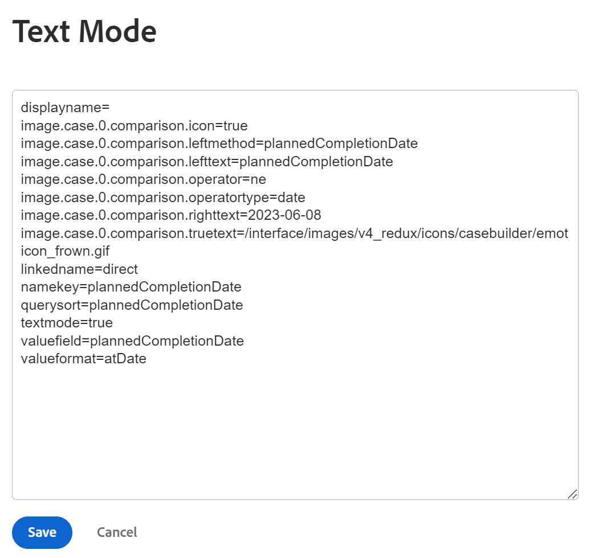

# Bedingte Formatierung im Textmodus verwenden

<!--Audited: 01/2025-->

Der standardmäßige Interface Builder bietet eine große Flexibilität bei der Erstellung von Berichterstellungselementen, um die Anforderungen in Ihrer Organisation zu erfüllen.

Mithilfe der Standardschnittstelle können Sie eine bedingte Formatierung in einer Ansicht anwenden.\
Weitere Informationen zum Anwenden der bedingten Formatierung auf eine Ansicht finden Sie unter [Verwenden der bedingten Formatierung in Ansichten](../../../reports-and-dashboards/reports/reporting-elements/use-conditional-formatting-views.md).

## Zugriffsanforderungen

+++ Erweitern Sie , um die Zugriffsanforderungen für die -Funktion in diesem Artikel anzuzeigen.

<table style="table-layout:auto"> 
 <col> 
 <col> 
 <tbody> 
  <tr> 
   <td role="rowheader">Adobe Workfront-Paket</td> 
   <td> <p>Beliebig</p> </td> 
  </tr> 
  <tr> 
   <td role="rowheader">Adobe Workfront-Lizenz</td> 
   <td> 
     <p>Standard</p>
     <p>Plan</p>
   </td> 
  </tr> 
  <tr> 
   <td role="rowheader">Konfigurationen der Zugriffsebene</td> 
   <td> <p>Zugriff auf Filter, Ansichten, Gruppierungen bearbeiten</p> <p>Zugriff auf Berichte, Dashboards und Kalender bearbeiten, um Ansichten in einem Bericht zu bearbeiten</p> </td> 
  </tr> 
  <tr> 
   <td role="rowheader">Objektberechtigungen</td> 
   <td> <p>Verwalten der Berechtigungen für einen Bericht zum Bearbeiten von Ansichten in einem Bericht</p> <p>Verwalten von Berechtigungen für eine Ansicht, um sie zu bearbeiten</p> </td> 
  </tr>
 </tbody> 
</table>

Weitere Informationen zu den Informationen in dieser Tabelle finden Sie unter [Zugriffsanforderungen in der Dokumentation zu Workfront](/help/quicksilver/administration-and-setup/add-users/access-levels-and-object-permissions/access-level-requirements-in-documentation.md).

+++

## Bedingte Formatierung im Textmodus

Im Textmodus können Sie komplexere Ansichten, Filter, Gruppierungen und Eingabeaufforderungen erstellen, indem Sie Felder verwenden können, die in der Standardbenutzeroberfläche nicht verfügbar sind.

Eine vollständige Liste aller unserer berichtspflichtigen Felder finden Sie im [API Explorer](../../../wf-api/general/api-explorer.md).

Weitere Informationen zur Verwendung der Textmodussyntax finden Sie unter [Übersicht über die Textmodussyntax](../../../reports-and-dashboards/reports/text-mode/text-mode-syntax-overview.md).

Sie können auch den Textmodus verwenden, um Ansichten in Berichten und Listen zu formatieren. Mithilfe der bedingten Formatierung können Sie die Ansichten Ihrer Berichte ändern, indem Sie die Schriftart und den Hintergrund der Ergebnisse im Bericht sowie Symbole und Markierungen ändern. Es wird empfohlen, Ansichten immer zuerst über die Standardschnittstelle zu erstellen und nur dann in den Textmodus zu wechseln, wenn dies unbedingt erforderlich ist.

>[!NOTE]
>
> Die Verwendung von CSS-Stilen zum Anpassen der bedingten Formatierung wird nicht unterstützt. Stattdessen müssen Sie die vordefinierten Formatierungsoptionen verwenden, die in Adobe Workfront verfügbar sind.

## Hinzufügen bedingter Formatierung zu Ansichten

Weitere Informationen zum Anwenden der bedingten Formatierung auf eine Ansicht in der Standard Builder-Benutzeroberfläche finden Sie unter [Verwenden der bedingten Formatierung in Ansichten](../../../reports-and-dashboards/reports/reporting-elements/use-conditional-formatting-views.md).

So fügen Sie einer Ansicht in der Textmodus-Benutzeroberfläche bedingte Formatierung hinzu:

1. Navigieren Sie zu einer Liste von Objekten.
1. Erweitern Sie das Dropdown-Menü einer Ansicht, der Sie bedingte Formatierung hinzufügen möchten.
1. Klicken Sie **Ansicht anpassen**.
1. Klicken Sie auf die Spalte in der Ansicht, auf die Sie eine bedingte Formatierung anwenden möchten.
1. Klicken Sie **In Textmodus wechseln**.
1. Klicken Sie im Bereich **In dieser Spalte anzeigen:** auf **Klicken, um Text zu bearbeiten**.
1. Fügen Sie die Code-Beispiele [ „Formatansichten im Textmodus](#format-views-using-text-mode) am unteren Rand des Texts in der ausgewählten Spalte hinzu.
1. Klicken Sie **Speichern** und dann auf **Ansicht speichern**.

## Ansichten im Textmodus formatieren {#format-views-using-text-mode}

Sie können die folgenden Komponenten zu einer Spalte in einer Ansicht hinzufügen, um sie im Textmodus bedingt zu formatieren:

* [Spalteneinstellungen](#column-settings)
* [Spaltenregeln](#column-rules)
* [Bedingtes Formatieren eines Ausdruckswerts](#conditionally-format-a-valueexpression)

### Spalteneinstellungen {#column-settings}

Sie müssen mit der Oberfläche des Textmodus vertraut sein, bevor Sie Ihren Ansichten bedingte Formatierung hinzufügen können.

Sie können die folgenden Elemente einer Spalte anpassen, wenn Sie bedingte Formatierung in einer Ansicht verwenden:

* [Spaltenüberschriften](#column-headers)
* [Daten formatieren](#format-dates)
* [Zahlen formatieren](#format-numbers)

#### Spaltenüberschriften {#column-headers}

Um die angezeigte Spaltenüberschrift zu ändern, fügen Sie der Spalte den folgenden Code hinzu: `displayname= [Name of column]`. Um beispielsweise eine Spalte als Projektbesitzerin bzw. -besitzer zu benennen, würde der Text-Code wie folgt aussehen:

`displayname=Project Owner`

#### Datum formatieren {#format-dates}

Datumsangaben können so konfiguriert werden, dass sie in verschiedenen Formaten angezeigt werden.

Weitere Informationen finden Sie unter [Formatieren von Datumsangaben in Textmodusberichten](../../../reports-and-dashboards/reports/text-mode/format-dates-in-text-mode-reports.md).

#### Zahlen formatieren {#format-numbers}

Sie können numerische Werte formatieren, um Informationen anzuzeigen, die Ihren Reporting-Anforderungen am besten entsprechen.

Weitere Informationen finden Sie unter [Zahlen, Währungen und Prozentwerte formatieren in Textmodusberichten](../../../reports-and-dashboards/reports/text-mode/format-numbers-in-text-mode-reports.md).

### Spaltenregeln {#column-rules}

Spaltenregeln ermöglichen das Hinzufügen von Bildern, Farben, Formatierungen und Textüberschreibungen innerhalb einer Ansicht. Spaltenregeln können unabhängig voneinander festgelegt werden oder mehrere Bedingungen für eine Spalte enthalten.

* [Bedingte Formatierung](#conditional-formatting)
* [Mehrere bedingte Formate](#multiple-conditional-formats)
* [Text anwenden](#apply-text)
* [Anwenden von Zeilenformaten](#apply-row-formats)
* [Bilder anwenden](#apply-images)

#### Bedingte Formatierung {#conditional-formatting}

Beim Einbinden von Farb- oder Formatierungstext muss eine bestimmte Textmodusanweisung angewendet werden.

>[!NOTE]
>
>Bedingte Formatierung wird in zusammengeführten Spalten möglicherweise nicht unterstützt.\
>Weitere Informationen zum Zusammenführen von Spalten mit dem Textmodus finden Sie unter [Ansicht: Zusammenführungsinformationen aus mehreren Spalten in einer gemeinsamen Spalte](../../../reports-and-dashboards/reports/custom-view-filter-grouping-samples/view-merge-columns.md).

Fügen Sie den folgenden Code in eine Spalte ein, der Sie eine bedingte Formatierung hinzufügen möchten:

```
styledef.case.0.comparison.leftmethod= [field name]
styledef.case.0.comparison.lefttext= [field name]
styledef.case.0.comparison.righttext= [field value]
styledef.case.0.comparison.operator= [qualifier]
styledef.case.0.comparison.operatortype= [data type]
styledef.case.0.comparison.icon=false
styledef.case.0.comparison.truetext= 
styledef.case.0.comparison.trueproperty.0.name= [format option]
styledef.case.0.comparison.trueproperty.0.value= [format style]
```

>[!NOTE]
>
>Die `styledef.case.0.comparison.icon` ist immer falsch, es sei denn, Sie arbeiten mit Symbolen.
>
>Die `styledef.case.0.comparison.truetext` bleibt immer leer, bis Sie Text überschreiben.
>
>Die `styledef.case.0.comparison.righttext` ist leer, wenn der Qualifizierer nicht leer ist.

Wenn wir beispielsweise den Firmennamen in einem Projektbericht im grünen Text anzeigen möchten, können Sie den folgenden Code verwenden:

```
styledef.case.0.comparison.leftmethod=company:name
styledef.case.0.comparison.lefttext=company:name ;
styledef.case.0.comparison.righttext= 
styledef.case.0.comparison.operator=notblank
styledef.case.0.comparison.operatortype=string
styledef.case.0.comparison.icon=false
styledef.case.0.comparison.truetext=
styledef.case.0.comparison.trueproperty.0.name=textcolor
styledef.case.0.comparison.trueproperty.0.value=03a219
```

>[!NOTE]
>
>* Diese Anweisung kann zwar auf eine Spalte mit dem Firmennamen angewendet werden, aber auch auf jede andere Spalte im Bericht. Grüner Text wird nur angezeigt, wenn dem Projekt eine Firma zugeordnet ist. Denken Sie an die `[field name]`, `[value]` und `[qualifier]`, unabhängig davon, ob die Konditionierung letztendlich in der Spalte angezeigt wird oder nicht.
>* Bei der Arbeit mit Kriterien empfehlen wir die Verwendung von `cicontains` anstelle von `equal`. Standardmäßig sucht `equal` nach ID-Nummern. Mithilfe des `cicontains` können Sie auf Elemente anhand ihres Namens zugreifen.

{width="500"}


{width="400"}

Unabhängig davon, ob Textfarbe, Ausrichtung, Schriftstil oder Hintergrundfarbe auf einen Textmodus angewendet werden, wird dieselbe Anweisung (siehe oben) verwendet.

Die folgenden Zeilen müssen geändert werden, um die entsprechende Formatierung widerzuspiegeln, die für die Spalte erforderlich ist:

```
styledef.case.0.comparison.trueproperty.0.name= [format option]
styledef.case.0.comparison.trueproperty.0.value= [format style]
```

Verwenden Sie die folgenden Tabellen, um zu bestimmen, welche Zeilen geändert werden müssen und welche Werte Sie angeben müssen, um den Formatstil Ihrer Spalte zu definieren:

| **Textfarbe** | **Zeile: textcolor=** |
|---|---|
| Schwarz | `000000` |
| Dunkelblau | `0c6aca` |
| Knäkente | `1b878c` |
| Grün | `03a219` |
| Lila | `6408c4` |
| Grau | `767676` |
| Rot | `d30519` |
| Gelb | `e19503` |

{style="table-layout:auto"}

| **Ausrichtung** | **Zeile: align=** |
|---|---|
| Linksbündig | `left` |
| Rechtsbündig | `right` |
| Zentriert | `center` |

{style="table-layout:auto"}

| Schriftart | Zeile: ***fontstyle=*** |
|---|---|
| Fett | `bold` |
| Kursiv | `italic` |

{style="table-layout:auto"}

| **Hintergrundfarbe** | **Zeile: bgcolor=** |
|---|---|
| Knäkente | `dcf6f7` |
| Grün | `def6e2` |
| Grau | `e8e8e8` |
| Blau | `e8f1ff` |
| Lila | `e9def4` |
| Rot | `eac6c9` |
| Gelb | `feecc8` |
| Weiß | `ffffff` |

{style="table-layout:auto"}

#### Mehrere bedingte Formate {#multiple-conditional-formats}

Sie können mehrere Formatierungsstile auf eine Anweisung anwenden. Die Kernanweisung bleibt unverändert und alle zusätzlichen Formatierungsausdrücke werden der Anweisung hinzugefügt.

Verwenden Sie beispielsweise die frühere Anweisung, um den Firmennamen in einen fett gedruckten grünen Text einzuschließen. Die Anweisung wird mit dem folgenden Code geschrieben:

```
styledef.case.0.comparison.leftmethod=company:name
styledef.case.0.comparison.lefttext=company:name
styledef.case.0.comparison.righttext=
styledef.case.0.comparison.operator=notblank
styledef.case.0.comparison.operatortype=string
styledef.case.0.comparison.icon=false
styledef.case.0.comparison.truetext= 
styledef.case.0.comparison.trueproperty.0.name=textcolor
styledef.case.0.comparison.trueproperty.0.value=03a219
styledef.case.0.comparison.trueproperty.1.name=fontstyle
styledef.case.0.comparison.trueproperty.1.value=bold
```

>[!NOTE]
>
>Wenn mehrere bedingte Formatierungsausdrücke einbezogen werden, ist es erforderlich, jeden Ausdruck in der Anweisung numerisch zu identifizieren. Beachten Sie, dass Ausdruck 0 und Ausdruck 1 identifiziert wurden.

#### Text anwenden {#apply-text}

Wenn Sie die Standardwerte, die in eine Spalte eingefügt werden, durch einen Wert Ihrer Wahl ersetzen möchten, ist es möglich, Text auf die Spalte anzuwenden.

Stellen Sie beispielsweise in einem Projektbericht den Wert der Spalte Geplantes Startdatum so ein, dass nicht das geplante Startdatum für das Projekt, sondern der Text „Heute nicht“ angezeigt wird. Verwenden Sie den folgenden Code für die Spalte „Geplantes Startdatum“:

```
case.0.comparison.leftmethod=plannedStartDate
case.0.comparison.lefttext=plannedStartDate
case.0.comparison.righttext=2013-04-10T10:45:00:000
case.0.comparison.operator=ne
case.0.comparison.operatortype=date
case.0.comparison.icon=false
case.0.comparison.truetext=not today
styledef.case.0.comparison.leftmethod=plannedStartDate
styledef.case.0.comparison.lefttext=plannedStartDate
styledef.case.0.comparison.righttext=2013-04-10T10:45:00:000 
styledef.case.0.comparison.operator=ne
styledef.case.0.comparison.operatortype=date&
styledef.case.0.comparison.icon=false
styledef.case.0.comparison.truetext=not today
```

>[!NOTE]
>
>Die Zeilen, die mit `case.0.` Anwendungsfall beginnen, vergleichen zur Identifizierung der Verwendung von Text. Die Zeilen, die mit `styledef.case.0.` beginnen, sind frühzeitige Anweisungen zur bedingten Formatierung, bei denen wir die Verwendung von Text durch den `truetext`-Ausdruck identifizieren. Stellen Sie sicher, dass Sie `truetext` auf einen Wert setzen, anstatt ihn leer zu lassen.

{width="500"}

{width="400"}

#### Anwenden von Zeilenformaten {#apply-row-formats}

Wenn Sie eine Bedingung auf die gesamte Zeile anwenden möchten, verwenden Sie den folgenden Code mit Ihrem Spaltencode:

```
styledef.case.0.comparison.icon=false
styledef.case.0.comparison.isrowcase=true
styledef.case.0.comparison.leftmethod= [field name]
styledef.case.0.comparison.lefttext= [field name]
styledef.case.0.comparison.operator= [qualifier]
styledef.case.0.comparison.operatortype= [data type]
styledef.case.0.comparison.righttext= [field value]
styledef.case.0.comparison.trueproperty.0.name= [format option]
styledef.case.0.comparison.trueproperty.0.value= [format style]
styledef.case.0.comparison.truetext=
row.0.styledef.applyallcases=true
row.0.styledef.case.0.comparison.icon=false
row.0.styledef.case.0.comparison.isrowcase=true
row.0.styledef.case.0.comparison.leftmethod= [field name]
row.0.styledef.case.0.comparison.lefttext= [field name]
row.0.styledef.case.0.comparison.operator= [qualifier]
row.0.styledef.case.0.comparison.operatortype= [data type]
row.0.styledef.case.0.comparison.righttext= [field value]
row.0.styledef.case.0.comparison.trueproperty.0.name= [format option]
row.0.styledef.case.0.comparison.trueproperty.0.value= [format style]
row.0.styledef.case.0.comparison.truetext=
```

#### Bilder anwenden {#apply-images}

Ähnlich wie bei der Formatierung mit Text können auch Bilder verwendet werden, um Informationen in Berichten anzuzeigen. Workfront verfügt über eine Reihe integrierter Bilder, um visuelle Informationen in einer Berichteinstellung zu vermitteln. Um Bilder in der Einstellung „Bedingte Formatierung“ zu verwenden, ist die folgende Anweisung erforderlich:

```
image.case.0.comparison.leftmethod= [field name]
image.case.0.comparison.lefttext= [field name]
image.case.0.comparison.righttext= [field value]
image.case.0.comparison.operator= [qualifier]
image.case.0.comparison.operatortype= [data type]
image.case.0.comparison.icon=true
image.case.0.comparison.truetext=
```

Angenommen, Sie möchten in einem Projektbericht eine Spalte erstellen, in der für jedes geplante Abschlussdatum, das nicht dem heutigen Datum entspricht, eine Stirnseite angezeigt wird. Verwenden Sie den folgenden Textmodus-Code, um das Symbol zu Ihrer Spalte hinzuzufügen:

```
image.case.0.comparison.leftmethod=plannedCompletionDate
image.case.0.comparison.lefttext=plannedCompletionDate
image.case.0.comparison.righttext=2013-04-10T13:00:00:000 
image.case.0.comparison.operator=ne 
image.case.0.comparison.operatortype=date
image.case.0.comparison.icon=true
image.case.0.comparison.truetext=/interface/images/v4_redux/icons/casebuilder/emoticon_frown.gif
```

>[!NOTE]
>
>Beachten Sie, dass die Anweisung den `icon=true`-Ausdruck verwendet. Diese Anweisung unterscheidet sich auch insofern von anderen bedingten Formatierungsanweisungen, als sie nicht das `style.def` Format, sondern ein eindeutiges Bildformat verwendet.

{width="500"}

{width="400"}

Um die verfügbaren Bilder zu verwenden, wenden Sie den folgenden Code und die folgenden Werte an:

| **Symbol** | **Line: image.case.0.compare.trueText=** |
|---|---|
| Stirnseite  | =`/interface/images/v4_redux/icons/casebuilder/emoticon_frown.gif` |
| Happy Face  | =`/interface/images/v4_redux/icons/casebuilder/emoticon_smile.gif` |
| Blaue Flagge  | =`/interface/images/v4_redux/icons/casebuilder/flag_blue.gif` |
| Grüne Markierung  | =`/interface/images/v4_redux/icons/casebuilder/flag_green.gif` |
| Red Flag  | =`/interface/images/v4_redux/icons/casebuilder/flag_red.gif` |
| Gelbe Flagge  | =`/interface/images/v4_redux/icons/casebuilder/flag_yellow.gif` |
| Schwarzer Kreis  | =`/interface/images/v4_redux/icons/casebuilder/light_black.gif` |
| Blauer Kreis  | =`/interface/images/v4_redux/icons/casebuilder/light_blue.gif` |
| Grauer Kreis  | =`/interface/images/v4_redux/icons/casebuilder/light_grey.gif` |
| Grüner Kreis  | =`/interface/images/v4_redux/icons/casebuilder/light_green.gif` |
| Orangefarbener Kreis  | =`/interface/images/v4_redux/icons/casebuilder/light_orange.gif` |
| Rosa Kreis  | =`/interface/images/v4_redux/icons/casebuilder/light_pink.gif` |
| Violetter Kreis  | =`/interface/images/v4_redux/icons/casebuilder/light_purple.gif` |
| Roter Kreis  | =`/interface/images/v4_redux/icons/casebuilder/light_red.gif` |
| Weißer Kreis  | =`/interface/images/v4_redux/icons/casebuilder/light_white.gif` |
| Gelber Kreis  | =`/interface/images/v4_redux/icons/casebuilder/light_yellow.gif` |

{style="table-layout:auto"}

### Bedingtes Formatieren einer `valueexpression` {#conditionally-format-a-valueexpression}

Um einen berechneten Wert in einer Spalte anzuzeigen, können Sie die `valuefield` Codezeile in der Spalte durch eine `valueexpression` ersetzen. Mit einem berechneten Wert können Sie einen neuen Wert für ein Objekt anzeigen, der auf der Berechnung zwischen zwei vorhandenen Feldern für dasselbe Objekt basiert.

Weitere Informationen zum Formatieren der `valueexpression line` finden Sie unter [Übersicht über die Textmodussyntax](../../../reports-and-dashboards/reports/text-mode/text-mode-syntax-overview.md).

Eine Spalte, die eine `valueexpression` Codezeile enthält, kann nicht mit Bedingungen formatiert werden. Stattdessen können Sie ein berechnetes benutzerdefiniertes Feld zu einem benutzerdefinierten Formular hinzufügen und es mit den Objekten verknüpfen, die Sie im Bericht anzeigen. Anschließend können Sie die Spalten, die dieses Feld anzeigen, mit Bedingungen formatieren.

Weitere Informationen zu berechneten benutzerdefinierten Feldern finden Sie unter [Hinzufügen berechneter Felder zu einem Formular](/help/quicksilver/administration-and-setup/customize-workfront/create-manage-custom-forms/form-designer/design-a-form/add-a-calculated-field.md).

## Hinzufügen eines Aggregatorwerts in einer Textmodusspalte

Es wird empfohlen, die Spalte zuerst in der Builder-Benutzeroberfläche zu erstellen, dort den Aggregatorwert hinzuzufügen und dann die Spalte im Textmodus zu bearbeiten.

Beachten Sie beim Hinzufügen von Aggregatoren zu einer Spalte im Textmodus Folgendes:

* Die Werte in der Spalte müssen ein Format aufweisen, das zusammengefasst werden kann. Sie müssen beispielsweise eines der folgenden Formate aufweisen:

   * Zahl
   * Datum
   * Währung

* Sie können einer Spalte, die eine Berechnung anzeigt, einen Aggregator hinzufügen. Der aggregierte Wert wird in der Gruppierung der Ansicht oder des Berichts angezeigt. Weitere Informationen finden Sie unter [Gruppierung: Anzeigen des Ergebnisses zum Aggregieren mehrerer berechneter Werte in einer Gruppierung](../../../reports-and-dashboards/reports/custom-view-filter-grouping-samples/grouping-calculation-between-two-fields-aggregated-in-grouping.md).
* Die Codezeilen für die Definition der Spalte müssen mit den Codezeilen identisch sein, die den Aggregator einführen und denen „Aggregator“ vorangestellt ist. Wenn Sie beispielsweise eine Spalte haben, in der die geplanten Stunden für ein Projekt angezeigt werden, lautet der Textmodus der Hauptzeilen der Spalte:

```
  valuefield=workRequired
  valueformat=compound
```

Wenn Sie die Werte aller Zeilen in der Gruppierung der Ansicht aggregieren möchten, können Sie den folgenden Code hinzufügen, um die Aggregatorwerte hinzuzufügen:

`aggregator.valuefield=workRequired` (Die `aggregator.valuefield` muss mit der `valuefield` übereinstimmen, die die Spalte beschreibt)

`aggregator.valueformat=compound` (Die `aggregator.valueformat` muss denselben Wert aufweisen wie der `valueformat`, der die Spalte beschreibt.)

`aggregator.function=SUM` (Dies ist eine obligatorische Zeile, die angibt, wie die Spalte aggregiert werden soll. In diesem Fall sollen alle einzelnen geplanten Stunden in der Gruppierungsposition zu einer Zahl hinzugefügt werden.)

`aggregator.displayformat=minutesAsHoursString` (Da Stunden in Workfront in Minuten gespeichert werden, sollten Sie die `displayformat` für Stunden angeben, wenn sie in Minuten gespeichert werden.)
