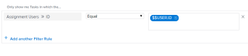

# Häufig gestellte Fragen zu Berichten

<!--

(NOTE: Alina: ***This is the ONE anchor article for all FAQs about Reporting. Add a new FAQ in the TOC at the top first, then add the answer as a section at the bottom.)

-->

Im Folgenden finden Sie häufig gestellte Fragen zu Berichten.

## Zugriffsanforderungen

Sie müssen über folgenden Zugriff verfügen, um die Schritte in diesem Artikel ausführen zu können:

<table style="table-layout:auto"> 
 <col> 
 </col> 
 <col> 
 </col> 
 <tbody> 
  <tr> 
   <td role="rowheader">Adobe Workfront-Plan*</td> 
   <td> 
Alle
 </td> 
  </tr> 
  <tr> 
   <td role="rowheader">Adobe Workfront-Lizenz*</td> 
   <td> 
Plan, Arbeit
 </td> 
  </tr> 
  <tr> 
   <td role="rowheader">Konfigurationen auf Zugriffsebene*</td> 
   <td> 
Zugriff auf Berichte, Dashboards und Kalender bearbeiten
 
Hinweis: Wenn Sie immer noch keinen Zugriff haben, fragen Sie Ihren Workfront-Administrator, ob er zusätzliche Zugriffsbeschränkungen für Ihre Zugriffsebene festlegt. Informationen dazu, wie ein Workfront-Administrator Ihre Zugriffsebene ändern kann, finden Sie unter <a href="../../../administration-and-setup/add-users/configure-and-grant-access/create-modify-access-levels.md" class="MCXref xref">Benutzerdefinierte Zugriffsebenen erstellen oder ändern</a>.
 </td> 
  </tr> 
  <tr> 
   <td role="rowheader">Objektberechtigungen</td> 
   <td> 
Berechtigungen für einen Bericht verwalten
 
Weitere Informationen zum Anfordern von zusätzlichem Zugriff finden Sie unter <a href="../../../workfront-basics/grant-and-request-access-to-objects/request-access.md" class="MCXref xref">Anfordern des Zugriffs auf Objekte </a>.
 </td> 
  </tr> 
 </tbody> 
</table>

&#42;Wenden Sie sich an Ihren Workfront-Administrator, um zu erfahren, welchen Plan, welchen Lizenztyp oder welchen Zugriff Sie haben.

## Warum zeigt meine benutzerdefinierte Berechnung für eine Stundendifferenz nicht das richtige Ergebnis in einer Spalte an?

In einem Projektbericht habe ich eine Berechnung, die die tatsächlichen Stunden (2) von geplanten Stunden (4) subtrahiert. Das Ergebnis, das ich bekomme, ist 120, wenn es 2 sein sollte.\
Meine Berechnung lautet:
<pre>valueExpression=SUB(workRequired,ISTWorkRequired)</pre>

### Antwort

Felder, die Stunden in Workfront verwenden, werden in Minuten gespeichert. Wenn Sie das Feld in einer Berechnung verwenden, wird das Ergebnis in Minuten angegeben. Um das Ergebnis in Stunden zu erhalten, müssen Sie das Ergebnis der Berechnung durch 60 dividieren.

Die richtige Berechnung lautet:

<pre>valueExpression=SUB(workRequired,ISTWorkRequired)/60</pre>

## Warum wird der Wert der einzelnen Diagrammelemente in einem Bericht nicht im Diagramm angezeigt?

### Antwort

Wenn ein Berichtdiagramm mehr als 50 Diagrammelemente enthält, wird der Wert der einzelnen Elemente nicht in der Grafik angezeigt.

Wenn ein Diagramm weniger als 50 Elemente enthält, wird der Wert jedes Elements im Diagramm angezeigt. Ziehen Sie in Erwägung, einen Filter hinzuzufügen oder die Gruppierungen im Bericht zu ändern, um die Anzahl der in den einzelnen Elementen des Diagramms angezeigten Elemente zu begrenzen.

## Warum gibt mein Bericht zu viele Ergebnisse zurück, um die Grafik anzuzeigen?

Wenn ich einen Bericht mit einer Grafik ausführe, sehe ich die Fehlermeldung &quot;Wen da... Dieser Bericht gab eine Vielzahl von Daten zurück, was die Grafik unlesbar macht. Erwägen Sie, Ihre Ergebnisse einzuschränken, indem Sie einen Filter hinzufügen oder die Gruppierungen in Ihrem Diagramm ändern.&quot;

### Antwort

Dieser Fehler bedeutet, dass Ihr Diagramm bis zu 618 eindeutige Ergebnisse enthält, z. B. mehr als 618 Balken in einem Balkendiagramm. Um das Anzeigeproblem zu beheben, müssen Sie die Ergebnisse verfeinern, indem Sie den aktuellen Filter ändern und Auswahlen gruppieren.

Informationen zum Ändern von Filtern und Gruppierungen finden Sie in den Artikeln [Filterübersicht](../../../reports-and-dashboards/reports/reporting-elements/filters-overview.md) und [Gruppierungsübersicht in Adobe Workfront](../../../reports-and-dashboards/reports/reporting-elements/groupings-overview.md).

## Warum werden meine Aufgaben (oder Probleme) angezeigt, wenn ich auf denselben Bericht (oder Kalender) wie mein Mitarbeiter zugreife und stattdessen dessen Aufgaben sehe?

### Antwort

Der Bericht oder Kalender verfügt möglicherweise über eine Filtervariable mit Platzhaltern, die auf den angemeldeten Benutzer verweist. In diesem Fall zeigt der Bericht Informationen basierend auf dem Benutzer an, der angemeldet ist. Passen Sie den Filter an, um den Platzhalter zu entfernen, der auf den angemeldeten Benutzer verweist.\

Eine vollständige Liste der nutzerbasierten Wildcard-Filtervariablen finden Sie unter [Übersicht über Wildcard-Filtervariablen](../../../reports-and-dashboards/reports/reporting-elements/understand-wildcard-filter-variables.md).

## Warum erscheinen die Daten in meinem Bericht unvollständig?

### Antwort

Dies kann in den meisten Fällen passieren, wenn Sie nur über eingeschränkten Zugriff verfügen, sodass Sie keine Elemente im System sehen können. Darüber hinaus werden die Elemente, die Sie sehen möchten, nicht für Sie freigegeben.

Der Ersteller des Berichts kann den Bericht so bearbeiten, dass er mit den Zugriffsrechten eines Systemadministrators oder eines beliebigen Planbenutzers, der Zugriff auf die Daten hat, ausgeführt wird.

Weitere Informationen finden Sie unter [Ausführen und Bereitstellen eines Berichts mit den Zugriffsrechten eines anderen Benutzers](../../../reports-and-dashboards/reports/creating-and-managing-reports/run-deliver-report-access-rights-another-user.md).

## Wie melde ich über Aufgaben (oder Probleme), denen ich zugewiesen bin, unabhängig davon, ob ich der Eigentümer bin oder nicht?

### Antwort

Um alle Ihnen zugewiesenen Aufgaben oder Probleme anzuzeigen, unabhängig davon, ob Sie der Eigentümer (oder Primärer Verantwortlicher) sind oder nicht, verwenden Sie den folgenden Filter in einem Aufgaben- oder Problembericht:

1. Zugriff auf einen Aufgaben- oder Problembericht.
1. Klicken Sie auf der Registerkarte **Filter** auf **Filterregel hinzufügen**.

1. Geben Sie im Feld **Feldname eingeben...** den Wert **Name der Zuweisungsbenutzer** ein und wählen Sie ihn aus, wenn er in der Liste angezeigt wird.

   >[!NOTE]
   >
   >Verwenden Sie nicht das Feld **Zugeordneter Name** , da dies nur für die Aufgaben und Probleme filtert, für die Sie der Primäre Verantwortliche oder Inhaber sind.

1. Wählen Sie den Modifikator **Equal** aus.
1. Beginnen Sie mit der Eingabe von *$$USER.ID* in das Textfeld und wählen Sie sie aus der angezeigten Dropdownliste aus.\
   Dadurch wird sichergestellt, dass Sie alle Aufgaben und Probleme sehen, die dem angemeldeten Benutzer zugewiesen sind. Sie können den Platzhalter durch einen bestimmten Benutzernamen ersetzen.\
   

1. Klicken Sie auf **Speichern + schließen**.

## Warum werden die Links &quot;Probleme hinzufügen/Aufgaben hinzufügen&quot;nicht unten in den Listen &quot;Probleme und Aufgaben&quot;eines Projekts angezeigt?

### Antwort

Vergewissern Sie sich zunächst, dass Sie über den richtigen Zugriff und die richtigen Berechtigungen zum Hinzufügen von Problemen und Aufgaben zu einem Projekt verfügen. In diesem Fall sollten Sie die Links **Probleme hinzufügen** und **Aufgaben hinzufügen** unten in den Listen **Probleme** und **Aufgaben** sehen.

Es gibt jedoch einige Dinge, die die Anzeige dieser Links verhindern können:

* Wenn der Schnellfilter auf diese Listen angewendet wird, werden die Links nicht angezeigt. Entfernen Sie den Schnellfilter, und die Links sollten angezeigt werden, damit Sie Ihren Projekten Probleme und Aufgaben hinzufügen können.\
  Informationen zum Schnellfilter finden Sie unter [Erste Schritte mit Listen in Adobe Workfront](../../../workfront-basics/navigate-workfront/use-lists/view-items-in-a-list.md).

* Wenn Sie eine **Gruppierung** auf diese Listen angewendet haben, werden die Links nicht angezeigt. Entfernen Sie die **Gruppierung** und die Links sollten angezeigt werden, damit Sie Ihren Projekten Probleme und Aufgaben hinzufügen können.\
  Informationen zum Erstellen von Gruppierungen finden Sie unter [Gruppierungen - Übersicht in Adobe Workfront](../../../reports-and-dashboards/reports/reporting-elements/groupings-overview.md).

* Wenn Sie eine **Ansicht** auf diese Listen anwenden, für die eine andere Währung als die Standardwährung für das Projekt ausgewählt ist, werden die Links nicht angezeigt. Ändern Sie die **Ansicht** in die Originalwährung des Projekts **, und die Links sollten angezeigt werden, damit Sie Ihren Projekten Probleme und Aufgaben hinzufügen können.**\
  Weitere Informationen zum Ändern der Währung in Ihrer Ansicht finden Sie unter [Erstellen von Finanzdatenberichten mit eindeutigen Wechselkursen](../../../reports-and-dashboards/reports/creating-and-managing-reports/create-financial-data-reports-unique-exchange-rates.md).

## Werden die Informationen in meinem Bericht oder Dashboard automatisch aktualisiert?

### Antwort

Informationen in Berichten oder Dashboards werden nicht automatisch aktualisiert.

Informationen können in einem zwischengespeicherten Bericht manuell aktualisiert werden.\
Weitere Informationen zum Aktualisieren eines zwischengespeicherten Berichts finden Sie unter [Bericht ausführen](../../../reports-and-dashboards/reports/creating-and-managing-reports/run-report.md).

Informationen können in einem zwischengespeicherten Dashboard manuell aktualisiert werden.\
Weitere Informationen zum Aktualisieren eines zwischengespeicherten Dashboards finden Sie im Abschnitt [Dashboards anzeigen](../../../reports-and-dashboards/dashboards/understanding-dashboards/get-started-dashboards.md#running-dashboards) im Artikel [Erste Schritte mit Dashboards](../../../reports-and-dashboards/dashboards/understanding-dashboards/get-started-dashboards.md) .

## Kann ich den Eigentümer eines Berichts ändern?

### Antwort

Sie können den Eigentümer eines Berichts nicht ändern. Der Benutzer, der den Bericht erstellt hat, kann es anderen Benutzern jedoch ermöglichen, den Bericht zu bearbeiten. Wie Sie Benutzern die Bearbeitung eines Berichts ermöglichen, hängt vom Benutzertyp ab.

* Systemadministratoren können Benutzern mit einer Planungslizenz erlauben, Berichte zu bearbeiten, indem sie die Option Bearbeiten in der Zeile Berichte so konfigurieren, dass sie Zugriff auf Bericht erstellen erhalten.\
  Weitere Informationen finden Sie unter [Zugriff auf Berichte, Dashboards und Kalender gewähren](../../../administration-and-setup/add-users/configure-and-grant-access/grant-access-reports-dashboards-calendars.md).

* Endbenutzer mit Zugriff auf die Erstellung und Freigabe von Berichten können anderen erlauben, einzelne Berichte zu bearbeiten, indem sie sie freigeben und anderen Benutzern die Berechtigung zum Verwalten zuweisen.\
  Weitere Informationen finden Sie unter [Berichtfreigabe in Adobe Workfront](../../../reports-and-dashboards/reports/creating-and-managing-reports/share-report.md).

Wenn Sie berechtigt sind, einen Bericht anzuzeigen oder zu verwalten, können Sie auch eine Kopie des Berichts erstellen, dessen Inhaber Sie dann standardmäßig sind. Weitere Informationen zum Kopieren eines Berichts finden Sie unter [Erstellen einer Kopie eines Berichts](../../../reports-and-dashboards/reports/creating-and-managing-reports/create-copy-report.md).

## Warum kann ich nicht auf einen Bericht zugreifen, der einem deaktivierten Benutzer gehört?

### Antwort

Manchmal ist der Eigentümer des Berichts auch der Benutzer, der im Feld **Diesen Bericht ausführen mit den Zugriffsrechten von:** im Bericht angegeben ist. Wenn der Benutzer **Diesen Bericht mit Zugriffsrechten ausführen von:** deaktiviert ist, wird der Bericht nicht mehr für Benutzer angezeigt, für die der Bericht freigegeben ist. In diesem Fall können Sie den Bericht erneut zugänglich machen, indem Sie das Feld **Diesen Bericht ausführen mit den Zugriffsrechten von:** leer lassen oder einen aktiven Benutzer in das Feld eingeben.

Weitere Informationen zum Feld **Diesen Bericht mit Zugriffsrechten ausführen von:** finden Sie unter [Ausführen und Bereitstellen eines Berichts mit den Zugriffsrechten eines anderen Benutzers](../../../reports-and-dashboards/reports/creating-and-managing-reports/run-deliver-report-access-rights-another-user.md). Informationen zur Identifizierung aller Berichte, die im Besitz deaktivierter Benutzer sind, finden Sie unter [Erstellen eines Berichts über Berichterstellungsaktivitäten](../../../reports-and-dashboards/reports/report-usage/create-report-reporting-activities.md).

## Wie greife ich auf ein Dashboard zu, das einen Bericht eines gelöschten Benutzers enthält?

### Antwort

Wenn Sie einen Benutzer löschen, können Sie dennoch auf alle Berichte zugreifen, die er erstellt hat. Alle Dashboards, die den Bericht enthalten, werden jedoch ebenfalls gelöscht. Das bedeutet, dass Sie nicht mehr auf Folgendes zugreifen können:

* Ein Dashboard mit dem Bericht
* Ein benutzerdefinierter Abschnitt mit einem Dashboard des Berichts

Weitere Informationen zu den Auswirkungen des Löschens eines Benutzers finden Sie unter [Benutzer löschen](../../../administration-and-setup/add-users/create-and-manage-users/delete-a-user.md).

Wenn Sie Zugriff auf den Bericht &quot;Ansicht&quot;haben, können Sie Folgendes tun:

1. Erstellen Sie eine Kopie des Berichts.\
   Informationen zum Erstellen einer Kopie eines Berichts finden Sie unter [Erstellen einer Kopie eines Berichts](../../../reports-and-dashboards/reports/creating-and-managing-reports/create-copy-report.md).

1. Aktualisieren Sie das Dashboard, um den kopierten Bericht einzuschließen.\
   Informationen zum Bearbeiten eines Dashboards finden Sie unter [Bearbeiten eines Dashboards](../../../reports-and-dashboards/dashboards/creating-and-managing-dashboards/edit-dashboard.md).
