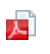
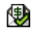

# Integrierte Statussymbole in Ansichten

<!--

(NOTE: ALina: ***Link this from the Understanding Fields in Lists and Reports.) 

-->

Sie können das integrierte Feld für Statussymbole in Ihren Ansichten als Spalte hinzufügen, um die Sichtbarkeit in wichtigen Punkten zu Ihren Objekten zu verbessern. Mithilfe von Statussymbolen können Sie auf einen Blick sehen, wenn die folgenden Bedingungen erfüllt sind:

* Ein Objekt hat angehängte Dokumente
* Ein Objekt ist einem Genehmigungsprozess zugeordnet
* Ein Objekt hat zusätzliche Notizen zugeordnet
* Eine Ausgabe ist abrechenbar oder rückzahlbar
* Eine Aufgabe befindet sich auf einem kritischen Pfad
* Ein Benutzer gehört zu einem Unternehmen, einem Team oder befindet sich in einer anderen Zeitzone.

Beachten Sie Folgendes:

* Die meisten Indikatoren im Feld Statussymbole sind schnelle Links zum tatsächlichen Objekt oder Bereich des Objekts, das bzw. den sie darstellen.

* Wenn eines der durch die Symbole dargestellten Elemente im Objekt fehlt, wird das Symbol für das fehlende Element in der Spalte Statussymbole anstelle eines farbigen Bildes abgeblendet angezeigt.

  

  Weitere Informationen finden Sie im Abschnitt [Übersicht der Statussymbole und -flags](#overview-of-status-icons-and-flags) in diesem Artikel.

* In einigen Ansichten trägt das Feld **Statussymbole** den Namen **Flags** oder **Anzeigesymbole**.\
  Sie können das Erscheinungsbild der Symbole, die im Feld Statussymbole enthalten sind, nicht anpassen.

* Sie können die Anzahl der Symbole im Feld Statussymbole nicht bearbeiten.

## Zugriffsanforderungen

Sie müssen über folgenden Zugriff verfügen, um die Schritte in diesem Artikel ausführen zu können:

<table style="table-layout:auto"> 
 <col> 
 <col> 
 <tbody> 
  <tr> 
   <td role="rowheader">Adobe Workfront-Plan*</td> 
   <td> 
Alle
 </td> 
  </tr> 
  <tr> 
   <td role="rowheader">Adobe Workfront-Lizenz*</td> 
   <td> 
Anforderung oder höher
 </td> 
  </tr> 
  <tr> 
   <td role="rowheader"> </td> 
   <td> </td> 
  </tr> 
  <tr> 
   <td role="rowheader">Konfigurationen auf Zugriffsebene*</td> 
   <td> 
Zugriff auf Filter, Ansichten, Gruppierungen bearbeiten
 
Zugriff auf Berichte, Dashboards und Kalender bearbeiten, um Spalten zu einem Bericht hinzuzufügen
 
Hinweis: Wenn Sie immer noch keinen Zugriff haben, fragen Sie Ihren Workfront-Administrator, ob er zusätzliche Zugriffsbeschränkungen für Ihre Zugriffsebene festlegt. Informationen dazu, wie ein Workfront-Administrator Ihre Zugriffsebene ändern kann, finden Sie unter <a href="../../../administration-and-setup/add-users/configure-and-grant-access/create-modify-access-levels.md" class="MCXref xref">Benutzerdefinierte Zugriffsebenen erstellen oder ändern</a>.
 </td> 
  </tr> 
  <tr> 
   <td role="rowheader">Objektberechtigungen</td> 
   <td> 
Berechtigungen für eine vorhandene Ansicht verwalten
 
Berechtigung zum Hinzufügen von Spalten zu einem Bericht verwalten
 
Weitere Informationen zum Anfordern von zusätzlichem Zugriff finden Sie unter <a href="../../../workfront-basics/grant-and-request-access-to-objects/request-access.md" class="MCXref xref">Anfordern des Zugriffs auf Objekte </a>.
 </td> 
  </tr> 
 </tbody> 
</table>

&#42;Wenden Sie sich an Ihren Workfront-Administrator, um zu erfahren, welchen Plan, welchen Lizenztyp oder welchen Zugriff Sie haben.

## Hinzufügen des Felds Statussymbole zu einer Ansicht

Für einige integrierte Ansichten und Berichte ist bereits das Feld Statussymbole enthalten.

Sie können nicht allen Ansichten das Feld Statussymbole hinzufügen.

So fügen Sie das Feld Statussymbole zu einer benutzerdefinierten Ansicht hinzu, die Sie von Grund auf neu erstellen:

1. Markieren Sie eine Liste der folgenden Objekte:

   * Aufgaben
   * Probleme
   * Projekte
   * Vorlagenaufgaben
   * Vorlagen
   * Ausgaben
   * Dokumente
   * Benutzende\
     Nur für diese Objekte ist das Feld **Statussymbole** verfügbar.\
     Informationen zu Objektlisten finden Sie unter [Erste Schritte mit Listen in Adobe Workfront](../../../workfront-basics/navigate-workfront/use-lists/view-items-in-a-list.md).

1. Wählen Sie aus dem Dropdownmenü **Ansicht** die Option **Neue Ansicht** aus.

1. Klicken Sie auf **Spalte hinzufügen**.
1. Geben Sie im Feld **In dieser Spalte anzeigen** einen der folgenden Feldnamen ein und wählen Sie ihn aus, wenn er in der Liste angezeigt wird:

   * *Status-Symbole*
   * *Flags*
   * *Symbole anzeigen * (nur in Dokumentansichten).

   Die integrierten Symbole werden unter einem dieser Namen aufgeführt.\
   Eine Vorlagenansicht enthält sowohl die Felder **Statussymbole** als auch **Flags** . In diesem Fall enthalten die beiden Spalten identische Symbole.\
   Dokumentansichten enthalten das Feld **Symbol anzeigen** .

1. Klicken Sie auf **Ansicht speichern**.
1. (Optional) Geben Sie einen neuen Namen für Ihre Ansicht an und klicken Sie dann auf **Ansicht speichern**.\
   Dadurch wird die Spalte **Statussymbole** zur Ansicht hinzugefügt.
1. (Optional) Bewegen Sie den Mauszeiger über ein Symbol, um zu verstehen, was es darstellt.
1. (Optional) Klicken Sie auf ein Symbol, um zum Bereich des Objekts zu gelangen, das durch das Symbol dargestellt wird.\
   Nicht alle Symbole sind Links zu Objekten.\
   Eine vollständige Liste der Attribute für jedes Symbol finden Sie im Abschnitt [Übersicht der Statussymbole und -flags](#overview-of-status-icons-and-flags) .

## Übersicht über Statussymbole und -flags {#overview-of-status-icons-and-flags}

In der folgenden Tabelle sind alle in Workfront verfügbaren Statussymbole, der Typ der Objekte, die mit ihnen verknüpft werden können, sowie die Vorgänge aufgeführt, die auftreten, wenn Sie darauf klicken.

Sie müssen über die Berechtigungen zum Anzeigen der Objekte verfügen, damit Sie auf einige der folgenden Symbole klicken und auf diese Objekte zugreifen können.

<table style="table-layout:auto"> 
 <col> 
 <col> 
 <col> 
 <col> 
 <col> 
 <thead> 
  <tr> 
   <th><strong>Statussymbol oder Flag</strong> </th> 
   <th><strong>Beschreibung</strong> </th> 
   <th><strong>Objekt</strong> </th> 
   <th>Bei Klick</th> 
   <th> </th> 
  </tr> 
 </thead> 
 <tbody> 
  <tr> 
   <td> oder   oder   oder </td> 
   <td>Gibt an, dass die Bedingung des Projekts "On Target"(grün), "In Trouble"(rot) oder "At Risk"(gelb) lautet. Weitere Informationen zur Projektbedingung finden Sie unter <a href="../../../manage-work/projects/manage-projects/project-condition-and-condition-type.md" class="MCXref xref">Überblick über Projektbedingungen und Bedingungstyp</a>.</td> 
   <td>Projekte</td> 
   <td>Klicken Sie auf , um die Aufgabenliste des Projekts zu öffnen. </td> 
   <td> </td> 
  </tr> 
  <tr> 
   <td>  </td> 
   <td>Gibt an, dass das Objekt auf der Registerkarte Updates Anmerkungen (Aktualisierungen) enthält.</td> 
   <td> 
Projekte Aufgaben Probleme Vorlagen Vorlagenaufgaben
 </td> 
   <td> 
Klicken Sie auf , um die Registerkarte Updates des Objekts zu öffnen. 
 </td> 
   <td> </td> 
  </tr> 
  <tr> 
   <td> oder </td> 
   <td>Gibt an, dass an das Objekt Dokumente angehängt sind. </td> 
   <td> Projekte Aufgaben Probleme Vorlagen Vorlagenaufgaben </td> 
   <td>Klicken Sie auf , um die Registerkarte Dokumente des Objekts zu öffnen. </td> 
   <td> </td> 
  </tr> 
  <tr> 
   <td> oder </td> 
   <td>Gibt an, dass das Projekt oder die Aufgabe offene Probleme aufweist.</td> 
   <td> Projekte Aufgaben </td> 
   <td>Klicken Sie auf , um das Objekt zu öffnen. </td> 
   <td> </td> 
  </tr> 
  <tr> 
   <td>  oder </td> 
   <td>Gibt an, dass eine Genehmigung für das Objekt vorhanden ist.</td> 
   <td> Projekte Aufgaben Probleme Vorlagen Vorlagenaufgaben </td> 
   <td>Klicken Sie auf , um das Objekt zu öffnen. </td> 
   <td> </td> 
  </tr> 
  <tr> 
   <td>  </td> 
   <td> 
Sie können Ihrer Ansicht eine Spalte mit dem Ausgabensymbol hinzufügen, um dieses Symbol anzuzeigen. Dies bedeutet, dass dem Projekt oder der Aufgabe Ausgaben zugeordnet sind.
 </td> 
   <td> 
Projekte
 
Aufgaben
 </td> 
   <td>Klicken Sie auf , um die Registerkarte Ausgaben des Projekts oder der Aufgabe zu öffnen. </td> 
   <td> </td> 
  </tr> 
  <tr> 
   <td>           </td> 
   <td> 
Gibt an, dass der Fortschrittsstatus einer Aufgabe einer der folgenden ist:
 
    <ul> 
     <li>Einschaltzeit (grünes Quadrat)</li> 
     <li>Verspätet (roter Kreis)</li> 
     <li>Risiko (blauer Diamant)</li> 
     <li>Hinter (gelbes Dreieck)</li> 
    </ul> 
Informationen zum Fortschrittsstatus von Aufgaben finden Sie unter <a href="../../../manage-work/tasks/task-information/task-progress-status.md" class="MCXref xref">Übersicht über den Aufgabenfortschritt</a>.
 </td> 
   <td>Aufgaben</td> 
   <td>Klicken Sie auf , um die Aufgabe zu öffnen. </td> 
   <td> </td> 
  </tr> 
  <tr> 
   <td>  oder </td> 
   <td>Gibt an, dass sich die Aufgabe derzeit auf dem kritischen Pfad befindet.  Weitere Informationen zu Aufgaben auf einem kritischen Pfad des Projekts finden Sie unter <a href="../../../manage-work/tasks/manage-tasks/critical-path.md" class="MCXref xref">Überblick über den kritischen Pfad des Projekts</a>.</td> 
   <td>Aufgaben</td> 
   <td>Klicken Sie auf , um die Aufgabe zu öffnen.</td> 
   <td> </td> 
  </tr> 
  <tr> 
   <td>  </td> 
   <td>Gibt an, dass die Aufgabe mit einem Meilenstein verknüpft ist. Ihr Systemadministrator kann die Farbe des Diamanten in Ihrer Umgebung anpassen. Weitere Informationen zu Meilensteinen finden Sie unter <a href="../../../administration-and-setup/customize-workfront/configure-approval-milestone-processes/create-milestone-path.md" class="MCXref xref">Meilensteinpfad erstellen</a>.</td> 
   <td>Aufgaben</td> 
   <td>Klicken Sie auf , um die Aufgabe zu öffnen. </td> 
   <td> </td> 
  </tr> 
  <tr> 
   <td>  </td> 
   <td>Link zum Quellobjekt eines Problems. Das Quellobjekt eines Problems ist das Objekt, in dem das Problem protokolliert wurde. Eine Aufgabe oder ein Projekt kann Quellobjekte für Probleme sein. </td> 
   <td>Probleme</td> 
   <td>Klicken Sie auf , um das Quellobjekt (Aufgabe oder Projekt) eines Problems zu öffnen. </td> 
   <td> </td> 
  </tr> 
  <tr> 
   <td>  </td> 
   <td>Gibt an, dass es ein auflösendes Objekt gibt, das das Problem letztendlich löst. In diesem Fall können Sie das Problem nicht abschließen. Sie wird abgeschlossen, wenn das aufgelöste Objekt abgeschlossen ist.  Informationen zum Auflösen von Objekten finden Sie unter <a href="../../../manage-work/issues/convert-issues/resolving-and-resolvable-objects.md" class="MCXref xref">Übersicht über das Auflösen und Auflösen von Objekten </a>.</td> 
   <td>Probleme</td> 
   <td>Klicken Sie auf , um das aufgelöste Objekt des Problems zu öffnen. </td> 
   <td> </td> 
  </tr> 
  <tr> 
   <td>  </td> 
   <td>Ein Dokument anzeigen.</td> 
   <td>Dokumente</td> 
   <td>Klicken Sie auf , um das Dokument herunterzuladen.</td> 
   <td> </td> 
  </tr> 
  <tr> 
   <td>  </td> 
   <td>Laden Sie ein Dokument herunter.</td> 
   <td>Dokumente</td> 
   <td>Klicken Sie auf , um das Dokument herunterzuladen.</td> 
   <td> </td> 
  </tr> 
  <tr> 
   <td>  </td> 
   <td>Gibt den Dokumenttyp an.</td> 
   <td>Dokumente</td> 
   <td>Klicken Sie auf , um das Dokument herunterzuladen.</td> 
   <td> </td> 
  </tr> 
  <tr> 
   <td>  </td> 
   <td>Gibt an, dass der Benutzer mit einem Unternehmen verknüpft ist. </td> 
   <td>Benutzende</td> 
   <td>Nicht verfügbar</td> 
   <td> </td> 
  </tr> 
  <tr> 
   <td>  </td> 
   <td>Gibt an, dass der Benutzer mit einem Team verknüpft ist.</td> 
   <td>Benutzende</td> 
   <td>Klicken Sie auf , um das Benutzerprofil zu öffnen.</td> 
   <td> </td> 
  </tr> 
  <tr> 
   <td>  </td> 
   <td>Klicken Sie auf die Registerkarte Zuordnung des Benutzers. </td> 
   <td>Benutzende</td> 
   <td>Klicken Sie auf , um die Registerkarte Zuordnung des Benutzers zu öffnen und zu erfahren, welchen Arbeitselementen der Benutzer zugewiesen ist.</td> 
   <td> </td> 
  </tr> 
  <tr> 
   <td>  </td> 
   <td>Gibt an, dass sich der Benutzer in einer anderen Zeitzone befindet als das System.</td> 
   <td>Benutzende</td> 
   <td>Nicht verfügbar</td> 
   <td> </td> 
  </tr> 
  <tr> 
   <td>  </td> 
   <td>Gibt an, dass eine Ausgabe in Rechnung gestellt werden kann. Weitere Informationen zu Ausgaben finden Sie unter <a href="../../../manage-work/projects/project-finances/manage-project-expenses.md" class="MCXref xref">Verwalten von Projektausgaben </a>.</td> 
   <td>Ausgaben</td> 
   <td>Nicht verfügbar</td> 
   <td> </td> 
  </tr> 
  <tr> 
   <td>  </td> 
   <td> Gibt an, dass eine Ausgabe rückzahlbar ist. Weitere Informationen zu Ausgaben finden Sie unter <a href="../../../manage-work/projects/project-finances/manage-project-expenses.md" class="MCXref xref">Verwalten von Projektausgaben </a>.</td> 
   <td>Ausgaben</td> 
   <td>Nicht verfügbar</td> 
   <td> </td> 
  </tr> 
  <tr> 
   <td> </td> 
   <td> Gibt an, dass eine Ausgabe erstattet wurde. Weitere Informationen zu Ausgaben finden Sie unter <a href="../../../manage-work/projects/project-finances/manage-project-expenses.md" class="MCXref xref">Verwalten von Projektausgaben </a>.</td> 
   <td>Ausgaben</td> 
   <td>Nicht verfügbar</td> 
   <td> </td> 
  </tr> 
 </tbody> 
</table>
