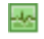
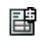

# Integrierte Statussymbole in Ansichten

<!-- Audited: 11/2024 -->

<!--(NOTE: ALina: ***Link this from the Understanding Fields in Lists and Reports.)-->

Sie können das integrierte Feld Statussymbole als Spalte in Ihren Ansichten hinzufügen, um die Sichtbarkeit wichtiger Punkte zu Ihren Objekten zu verbessern. Mit Statussymbolen können Sie auf einen Blick sehen, wenn die folgenden Bedingungen vorliegen:

* An ein Objekt sind Dokumente angehängt
* Ein Objekt ist mit einem Genehmigungsprozess verknüpft
* Einem Objekt sind zusätzliche Notizen zugeordnet
* Kosten sind fakturierbar oder erstattungsfähig
* Eine Aufgabe befindet sich auf einem kritischen Weg
* Ein Benutzer gehört zu einem Unternehmen, einem Team oder befindet sich persönlich in einer anderen Zeitzone

Beachten Sie Folgendes:

* Die meisten Indikatoren im Feld Statussymbole sind Schnellverknüpfungen zum tatsächlichen Objekt oder Bereich des Objekts, das sie darstellen.

* Wenn eines der durch die Symbole dargestellten Elemente im Objekt fehlt, wird das Symbol, das das fehlende Element darstellt, in der Spalte Statussymbole abgeblendet anstelle eines farbigen Bildes angezeigt.

  

  Weitere Informationen finden Sie im Abschnitt [Übersicht über Statussymbole und ](#overview-of-status-icons-and-flags)&quot; in diesem Artikel.

* In einigen Ansichten **das Feld** Statussymbole“ **Flags** oder **Ansichtssymbole**.\
  Sie können das Erscheinungsbild der Symbole, die im Feld Statussymbole enthalten sind, nicht anpassen.

* Die Anzahl der Symbole im Feld Statussymbole kann nicht bearbeitet werden.

## Zugriffsanforderungen

+++ Erweitern Sie , um die Zugriffsanforderungen für die -Funktion in diesem Artikel anzuzeigen. 

<table style="table-layout:auto"> 
 <col> 
 <col> 
 <tbody> 
  <tr> 
   <td role="rowheader">Adobe Workfront-Paket</td> 
   <td> 
Beliebig
 </td> 
  </tr> 
  <tr> 
   <td role="rowheader">Adobe Workfront-Lizenz</td> 
   <td> 
      
Mitwirkender oder höher

      
Anfrage oder höher

   </td>
  </tr>
  <tr> 
   <td role="rowheader">Konfigurationen der Zugriffsebene</td> 
   <td> 
Zugriff auf Filter, Ansichten, Gruppierungen bearbeiten
 
Zugriff auf Berichte, Dashboards und Kalender bearbeiten, um Spalten zu einem Bericht hinzuzufügen
</td> 
  </tr> 
  <tr> 
   <td role="rowheader">Objektberechtigungen</td> 
   <td> 
Verwalten von Berechtigungen für eine vorhandene Ansicht
 
Verwalten von Berechtigungen für einen Bericht, um ihm Spalten hinzuzufügen
</td> 
  </tr> 
 </tbody> 
</table>

Weitere Informationen zu den Informationen in dieser Tabelle finden Sie unter [Zugriffsanforderungen in der Dokumentation zu Workfront](/help/quicksilver/administration-and-setup/add-users/access-levels-and-object-permissions/access-level-requirements-in-documentation.md).

+++

## Hinzufügen des Felds Statussymbole zu einer Ansicht

Bei einigen integrierten Ansichten und Berichten ist das Feld Statussymbole bereits enthalten.

Das Feld Statussymbole kann nicht allen Ansichten hinzugefügt werden.

So fügen Sie das Feld Statussymbole zu einer benutzerdefinierten Ansicht hinzu, die Sie von Grund auf neu erstellen:

1. Navigieren Sie zu einer Liste mit einem der folgenden Objekte:

   * Aufgaben
   * Probleme
   * Projekte
   * Vorlagenaufgaben
   * Vorlagen
   * Ausgaben
   * Dokumente
   * Benutzende\
     Nur für diese Objekte ist das Feld **Statussymbole** verfügbar.\
     Informationen zu Objektlisten finden Sie unter [Erste Schritte mit Listen in Adobe Workfront](../../../workfront-basics/navigate-workfront/use-lists/view-items-in-a-list.md).

1. Wählen Sie **Dropdown** Menü „Ansicht“ die Option **Neue Ansicht**.

1. Klicken Sie auf **Spalte hinzufügen**.
1. Beginnen Sie im Feld **In dieser Spalte anzeigen** mit der Eingabe eines der folgenden Feldnamen und wählen Sie diesen aus, wenn er in der Liste angezeigt wird:

   * *Status-Symbole*
   * *Flags*
   * *Symbole anzeigen *(nur in Dokumentansichten).

   Die integrierten Symbole werden unter einem dieser Namen aufgeführt.\
   Eine Vorlagenansicht enthält sowohl die Felder **Statussymbole** als auch **Flags**. In diesem Fall enthalten die beiden Spalten identische Symbole.\
   Dokumentansichten enthalten ein Feld **Ansichtssymbole**.

1. Klicken Sie auf **Ansicht speichern**.
1. (Optional) Geben Sie einen neuen Namen für Ihre Ansicht ein und klicken Sie dann auf **Ansicht speichern**.\
   Dadurch wird Ihrer Ansicht **Spalte** Statussymbole“ hinzugefügt.
1. (Optional) Bewegen Sie den Mauszeiger über ein Symbol, um zu verstehen, was es darstellt.
1. (Optional) Klicken Sie auf ein Symbol, um den Bereich des Objekts aufzurufen, das von ihm repräsentiert wird.\
   Nicht alle Symbole sind Links zu Objekten.\
   Eine vollständige Liste der Attribute für jedes Symbol finden Sie im Abschnitt [Übersicht über Statussymbole und Flags](#overview-of-status-icons-and-flags).

## Übersicht über Statussymbole und -flags {#overview-of-status-icons-and-flags}

In der folgenden Tabelle sind alle in Workfront verfügbaren Statussymbole, der Typ der Objekte, die mit ihnen verknüpft werden können, sowie das, was passiert, wenn Sie darauf klicken, aufgeführt.

Sie müssen über Berechtigungen zum Anzeigen der Objekte verfügen, damit Sie auf die folgenden Symbole klicken und auf diese Objekte zugreifen können.

<table style="table-layout:auto"> 
 <col> 
 <col> 
 <col> 
 <col> 
 <col> 
 <thead> 
  <tr> 
   <th><strong>Statussymbol oder -Markierung</strong> </th> 
   <th><strong>Beschreibung</strong> </th> 
   <th><strong>Objekt</strong> </th> 
   <th>Bei Klick</th> 
   <th> </th> 
  </tr> 
 </thead> 
 <tbody> 
  <tr> 
   <td> oder   oder   oder </td> 
   <td>Gibt an, dass der Zustand des Projekts „An Target“ (grün), „In Schwierigkeiten“ (rot) oder „Gefährdet“ (gelb) ist. Informationen zur Projektbedingung finden Sie unter <a href="../../../manage-work/projects/manage-projects/project-condition-and-condition-type.md" class="MCXref xref">Übersicht über Projektbedingung und Bedingungstyp</a>.</td> 
   <td>Projekte</td> 
   <td>Klicken, um die Aufgabenliste des Projekts zu öffnen. </td> 
   <td> </td> 
  </tr> 
  <tr> 
   <td>  </td> 
   <td>Gibt an, dass das Objekt über Notizen (Aktualisierungen) auf der Registerkarte Aktualisierungen verfügt.</td> 
   <td> 
projects tasks issues templates template tasks
 </td> 
   <td> 
Klicken Sie, um die Registerkarte Aktualisierungen des Objekts zu öffnen. 
 </td> 
   <td> </td> 
  </tr> 
  <tr> 
   <td> oder </td> 
   <td>Gibt an, dass an das Objekt Dokumente angehängt sind. </td> 
   <td> projects tasks issues templates template tasks </td> 
   <td>Klicken Sie, um die Registerkarte Dokumente des Objekts zu öffnen. </td> 
   <td> </td> 
  </tr> 
  <tr> 
   <td> oder </td> 
   <td>Gibt an, dass es offene Probleme im Projekt oder in der Aufgabe gibt.</td> 
   <td> projects tasks </td> 
   <td>Klicken, um das Objekt zu öffnen. </td> 
   <td> </td> 
  </tr> 
  <tr> 
   <td>  oder </td> 
   <td>Gibt an, dass für das Objekt eine Genehmigung vorliegt.</td> 
   <td> projects tasks issues templates template tasks </td> 
   <td>Klicken, um das Objekt zu öffnen. </td> 
   <td> </td> 
  </tr> 
  <tr> 
   <td>  </td> 
   <td> 
Sie können Ihrer Ansicht eine Spalte mit dem Ausgabensymbol hinzufügen, um dieses Symbol anzuzeigen. Dies bedeutet, dass mit dem Projekt oder der Aufgabe Ausgaben verbunden sind.
 </td> 
   <td> 
Projekte
 
Aufgaben
 </td> 
   <td>Klicken Sie, um die Registerkarte „Ausgaben“ des Projekts oder der Aufgabe zu öffnen. </td> 
   <td> </td> 
  </tr> 
  <tr> 
   <td>           </td> 
   <td> 
Gibt an, dass der Fortschrittsstatus einer Aufgabe eine der folgenden ist:
 
    <ul> 
     <li>Pünktlich (grünes Quadrat)</li> 
     <li>Spät (roter Kreis)</li> 
     <li>Gefährdet (blauer Diamant)</li> 
     <li>Hinten (gelbes Dreieck)</li> 
    </ul> 
Informationen zum Fortschrittsstatus von Aufgaben finden Sie unter <a href="../../../manage-work/tasks/task-information/task-progress-status.md" class="MCXref xref">Übersicht über den </a>.
 </td> 
   <td>Aufgaben</td> 
   <td>Klicken, um die Aufgabe zu öffnen. </td> 
   <td> </td> 
  </tr> 
  <tr> 
   <td>  oder </td> 
   <td>Zeigt an, dass sich die Aufgabe derzeit auf dem kritischen Pfad befindet.  Informationen zu Aufgaben auf einem kritischen Pfad des Projekts finden Sie unter <a href="../../../manage-work/tasks/manage-tasks/critical-path.md" class="MCXref xref">Übersicht über den kritischen Pfad des Projekts</a>.</td> 
   <td>Aufgaben</td> 
   <td>Klicken, um die Aufgabe zu öffnen.</td> 
   <td> </td> 
  </tr> 
  <tr> 
   <td>  </td> 
   <td>Gibt an, dass die Aufgabe mit einem Meilenstein verknüpft ist. Ihr Systemadministrator kann die Farbe des Diamanten in Ihrer Umgebung anpassen. Informationen zu Meilensteinen finden Sie unter <a href="../../../administration-and-setup/customize-workfront/configure-approval-milestone-processes/create-milestone-path.md" class="MCXref xref">Erstellen eines Meilensteinpfads</a>.</td> 
   <td>Aufgaben</td> 
   <td>Klicken, um die Aufgabe zu öffnen. </td> 
   <td> </td> 
  </tr> 
  <tr> 
   <td>  </td> 
   <td>Relation zum Quellobjekt einer Anfrage Das Quellobjekt eines Problems ist das Objekt, in dem das Problem protokolliert wurde. Eine Aufgabe oder ein Projekt kann Quellobjekte für Probleme sein. </td> 
   <td>Probleme</td> 
   <td>Klicken Sie, um das Quellobjekt (Aufgabe oder Projekt) einer Anfrage zu öffnen. </td> 
   <td> </td> 
  </tr> 
  <tr> 
   <td>  </td> 
   <td>Gibt an, dass es ein Lösungsobjekt gibt, das das Problem letztendlich behebt. In diesem Fall können Sie das Problem nicht abschließen. Sie ist abgeschlossen, wenn das anfragelösende Objekt abgeschlossen ist.  Informationen zum Auflösen von Objekten finden Sie unter <a href="../../../manage-work/issues/convert-issues/resolving-and-resolvable-objects.md" class="MCXref xref">Übersicht über das Auflösen und Auflösbare Objekte </a>.</td> 
   <td>Probleme</td> 
   <td>Klicken Sie, um das Lösungsobjekt des Problems zu öffnen. </td> 
   <td> </td> 
  </tr> 
  <tr> 
   <td>  </td> 
   <td>Ein Dokument anzeigen.</td> 
   <td>Dokumente</td> 
   <td>Klicken, um das Dokument herunterzuladen.</td> 
   <td> </td> 
  </tr> 
  <tr> 
   <td>  </td> 
   <td>Dokument herunterladen.</td> 
   <td>Dokumente</td> 
   <td>Klicken, um das Dokument herunterzuladen.</td> 
   <td> </td> 
  </tr> 
  <tr> 
   <td>  </td> 
   <td>Gibt den Typ des Dokuments an.</td> 
   <td>Dokumente</td> 
   <td>Klicken, um das Dokument herunterzuladen.</td> 
   <td> </td> 
  </tr> 
  <tr> 
   <td>  </td> 
   <td>Gibt an, dass der Benutzer mit einer Firma verknüpft ist. </td> 
   <td>Benutzende</td> 
   <td>Nicht verfügbar</td> 
   <td> </td> 
  </tr> 
  <tr> 
   <td>  </td> 
   <td>Gibt an, dass der Benutzer einem Team zugeordnet ist.</td> 
   <td>Benutzende</td> 
   <td>Klicken, um das Benutzerprofil zu öffnen.</td> 
   <td> </td> 
  </tr> 
  <tr> 
   <td>  </td> 
   <td>Verknüpfung zur Registerkarte Zuordnung des Benutzers </td> 
   <td>Benutzende</td> 
   <td>Klicken Sie, um die Registerkarte Zuordnung des Benutzers zu öffnen und zu erfahren, welche Arbeitselemente dem Benutzer zugewiesen sind.</td> 
   <td> </td> 
  </tr> 
  <tr> 
   <td>  </td> 
   <td>Gibt an, dass sich der Benutzer in einer anderen Zeitzone als der des Systems befindet.</td> 
   <td>Benutzende</td> 
   <td>Nicht verfügbar</td> 
   <td> </td> 
  </tr> 
  <tr> 
   <td>  </td> 
   <td>Gibt an, dass eine Ausgabe fakturierbar ist. Informationen zu Ausgaben finden Sie unter <a href="../../../manage-work/projects/project-finances/manage-project-expenses.md" class="MCXref xref">Projektausgaben verwalten </a>.</td> 
   <td>Ausgaben</td> 
   <td>Nicht verfügbar</td> 
   <td> </td> 
  </tr> 
  <tr> 
   <td>  </td> 
   <td> Gibt an, dass eine Ausgabe erstattungsfähig ist. Informationen zu Ausgaben finden Sie unter <a href="../../../manage-work/projects/project-finances/manage-project-expenses.md" class="MCXref xref">Projektausgaben verwalten </a>.</td> 
   <td>Ausgaben</td> 
   <td>Nicht verfügbar</td> 
   <td> </td> 
  </tr> 
  <tr> 
   <td> </td> 
   <td> Zeigt an, dass eine Ausgabe erstattet wurde. Informationen zu Ausgaben finden Sie unter <a href="../../../manage-work/projects/project-finances/manage-project-expenses.md" class="MCXref xref">Projektausgaben verwalten </a>.</td> 
   <td>Ausgaben</td> 
   <td>Nicht verfügbar</td> 
   <td> </td> 
  </tr> 
 </tbody> 
</table>
