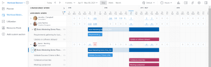

# Veraltete Tools für die Ressourcenplanung in Adobe Workfront

>[!IMPORTANT]
>  
>Die in diesem Artikel beschriebene Planungsfunktion wird seit der Version 23.1 im Januar 2023 nicht mehr unterstützt und aus Adobe Workfront entfernt.   
>  
>  Dieser Artikel wird auch kurz nach der Version 23.1 (Anfang 2023) entfernt. Zu diesem Zeitpunkt empfehlen wir, alle Lesezeichen entsprechend zu aktualisieren. 
> 
> Sie können jetzt den Lastenausgleich verwenden, um die Arbeit für Ihre Ressourcen zu planen. 
>  
> Informationen zum Planen von Ressourcen mit dem Lastenausgleich finden Sie im Abschnitt [Der Lastenausgleich](../../resource-mgmt/workload-balancer/workload-balancer.md). 

<!--
We are currently in the process of removing all Scheduling tools from Adobe Workfront and replacing them with the Workload Balancer.

>[!IMPORTANT]
>
>We are no longer implementing new feature functionality for the current Scheduling solution and we no longer consider nor prioritize defects for a fix in this area of Adobe Workfront.

This article describes the timeline for this deprecation and it compares the functionality of the Scheduling tools and that of the Workload Balancer to indicate which Scheduling capabilities are already supported in the Workload Balancer. 

We have been announcing a more exact timeline through the Announcement Center at key milestones during the deprecation process and this article has been updated as this process continues.

>[!NOTE]
>
>The changes described in this article do not affect any other resource management tools. For example, they do not affect the [!UICONTROL Resource Planner] or the [!UICONTROL Utilization] report.
-->

## Vorbereitung

Detaillierte Informationen dazu, wie Sie sich auf den Übergang zwischen der Planung und dem Lastenausgleich vorbereiten sollten, finden Sie unter [Migration von der Ressourcenplanung zum Lastenausgleich](../../resource-mgmt/resource-mgmt-overview/migrate-resource-scheduling-to-workload-balancer.md).

Wenn Sie derzeit Planungswerkzeuge verwenden, empfehlen wir Ihnen, diese einzustellen und mit der Verwendung des Workload-Balancers zu beginnen.

Nahezu alle bereits in den Planungsbereichen verfügbaren Funktionen sind jetzt im Arbeitslastausgleich verfügbar. Weitere Informationen finden Sie im Abschnitt . [Funktionsverfügbarkeit](#feature-availability) in diesem Artikel. Sie können die Planung Ihrer Ressourcen für die Arbeit ausschließlich im Arbeitslastausgleich fortsetzen.

## Informationen, die nicht an den Lastenausgleich übertragen werden

Die folgenden Informationen werden nicht von den Planungs-Tools an den Arbeitslastausgleich übertragen:

* **Tägliche Zuordnungen für Benutzer**: Sie sollten nicht sowohl die Planung als auch den Lastenausgleich verwenden, um dieselben Benutzerzuordnungen anzupassen. Wenn Sie Benutzerzuordnungen in den Planungswerkzeugen verwaltet haben, werden die angepassten täglichen Zuweisungen nicht an den Arbeitslastausgleich übertragen. Wenn Sie die Benutzerzuordnungen im Arbeitslastausgleich angepasst haben, werden sie nicht in die Planungswerkzeuge übertragen. Wir empfehlen dringend, dass Sie sicherstellen, dass die täglichen Zuweisungen im Arbeitslastausgleich korrekt sind, um sich auf diese Umstellung vorzubereiten. Weitere Informationen finden Sie unter [Verwalten von Benutzerzuordnungen im Lastenausgleich](../workload-balancer/manage-user-allocations-workload-balancer.md).
* **Filter**: Wenn Sie Filter in den Planungsbereichen gespeichert haben, werden diese nicht an den Arbeitslastausgleich übertragen. Sie müssen die Filter im Arbeitslastausgleich neu erstellen. Weitere Informationen finden Sie unter [Filtern von Informationen im Arbeitslastausgleich](../workload-balancer/filter-information-workload-balancer.md).

## Highlights der veralteten Timeline

>[!IMPORTANT]
>
>Verwenden Sie diesen Artikel, um die aktuelle Zeitleiste für die Einstellung der Planungswerkzeuge zu verstehen. Alle Aktualisierungen dieser Zeitleiste werden in diesem Artikel und in Mitteilungen des Ankündigungs-Centers mitgeteilt.

Im Folgenden finden Sie eine Zeitleiste für die Einstellung der Ressourcen-Planungs-Tools:

* [Version 2020.4 (November 2020)](#2020-4-release-november-2020)
* [Version 2021.4 (Oktober 2021)](#2021-4-release-october-2021)
* [Versionen 2022.4 - 2023.1 (Oktober 2022 - Januar 2023)](#2022-4-2023-1-releases)

### Version 2020.4 (November 2020) {#2020-4-release-november-2020}

* Für die Planungslösung ist die Funktion neuer Funktionen nicht mehr implementiert.
* Nur schwerwiegende und kritische Schweregrade werden für eine Korrektur priorisiert
* Workfront wurden neue Funktionen für den Lastenausgleich hinzugefügt

### Version 2021.4 (Oktober 2021) {#2021-4-release-october-2021}

* Der Lastenausgleich ist für alle erstmaligen Benutzer von Workfront als Standard festgelegt.
* Erweiterte Filter, die freigegeben werden können und zusätzliche Felder enthalten können

### Versionen 2022.4 - 2023.1 (Oktober 2022 - Januar 2023) {#2022-4-2023-1-releases}

* Während und nach den Versionen 2022.4 oder 2023.1 werden keine Fehler für eine Fehlerbehebung priorisiert
* Alle Planungsbereiche werden aus der Vorschauumgebung entfernt (**20. Oktober 2022**)
* Alle Planungsbereiche werden aus der Produktionsumgebung entfernt (**Januar 2023**)
* Der Lastenausgleich ist das einzige Tool zur Ressourcenplanung, das in Workfront verfügbar ist (nach **Januar 2023**)

## Funktionsverfügbarkeit {#feature-availability}

Sofern nicht anders angegeben, wurden bzw. werden alle Funktionen zur Ressourcenplanung im Arbeitslastausgleich verfügbar sein. Weitere Informationen zum Lastenausgleich finden Sie unter [Übersicht über den Lastenausgleich](../../resource-mgmt/workload-balancer/overview-workload-balancer.md).

Zusätzlich zu den vorhandenen Funktionen verfügt der Lastenausgleich über neue Funktionen, die in den Tools für die Ressourcenplanung nicht vorhanden waren, wie in der folgenden Tabelle dargestellt:

<table style="table-layout:auto"> 
 <col> 
 <col> 
 <col> 
 <col> 
 <col> 
 <tbody> 
  <tr> 
   <td rowspan="2"><b>Funktionen</b> </td> 
   <td rowspan="2"> <b>Verfügbarkeit der Tools für die Ressourcenplanung</b></td> 
   <td colspan="3"><b>Verfügbarkeit der Funktion für den Lastenausgleich</b></td> 
  </tr> 
  <tr> 
   <td><b>Jetzt verfügbar</b></td> 
   <td><b>In Kürze verfügbar</b></td> 
   <td><b>Nicht geplant</b></td> 
  </tr> 
  <tr> 
   <td> 
Tool für den Zugriff über den Bereich Ressourcen
 </td> 
   <td>✓</td> 
   <td>✓</td> 
   <td> </td> 
   <td> </td> 
  </tr> 
  <tr> 
   <td>Separate Bereiche für nicht zugewiesene und zugewiesene Arbeit</td> 
   <td>✓</td> 
   <td>✓</td> 
   <td> </td> 
   <td> </td> 
  </tr> 
  <tr> 
   <td>Anwenden und Erstellen von Filtern für nicht zugewiesene und zugewiesene Arbeit</td> 
   <td>✓</td> 
   <td>✓</td> 
   <td> </td> 
   <td> </td> 
  </tr> 
  <tr> 
   <td>Direkter Zugriff auf Arbeitselemente über das Tool</td> 
   <td>✓</td> 
   <td>✓</td> 
   <td> </td> 
   <td> </td> 
  </tr> 
  <tr> 
   <td>Manuelles Zuweisen oder Aufheben der Zuweisung von Aufgaben und Problemen</td> 
   <td>✓</td> 
   <td>✓</td> 
   <td> </td> 
   <td> </td> 
  </tr> 
  <tr> 
   <td>Anpassen einzelner Zuordnungen</td> 
   <td>✓</td> 
   <td>✓</td> 
   <td> </td> 
   <td> </td> 
  </tr> 
  <tr> 
   <td>Verwendungszeit einschließen</td> 
   <td>✓</td> 
   <td>✓</td> 
   <td> </td> 
   <td> </td> 
  </tr> 
  <tr> 
   <td>Prognosedaten anzeigen </td> 
   <td>✓</td> 
   <td>✓</td> 
   <td> </td> 
   <td> </td> 
  </tr> 
  <tr> 
   <td>Anzeige abgeschlossener Arbeiten</td> 
   <td>✓</td> 
   <td>✓</td> 
   <td> </td> 
   <td> </td> 
  </tr> 
  <tr> 
   <td>Ausnahmen für Benutzerzeiten, Wochenenden und Zeitplan anzeigen</td> 
   <td>✓</td> 
   <td>✓</td> 
   <td> </td> 
   <td> </td> 
  </tr> 
  <tr data-mc-conditions=""> 
   <td>Schnelles Zuweisen von Benutzern basierend auf Rollen* </td> 
   <td>✓</td> 
   <td>✓ </td> 
   <td> </td> 
   <td> </td> 
  </tr> 
  <tr data-mc-conditions=""> 
   <td>Schnelles Ersetzen von Benutzern* </td> 
   <td>✓</td> 
   <td>✓ </td> 
   <td> </td> 
   <td> </td> 
  </tr> 
  <tr data-mc-conditions=""> 
   <td>Schnelles Aufheben der Zuweisung von Benutzern* </td> 
   <td>✓</td> 
   <td>✓ </td> 
   <td> </td> 
   <td> </td> 
  </tr> 
  <tr> 
   <td>Zugriff auf Tools aus einem Team </td> 
   <td>✓</td> 
   <td>✓ </td> 
   <td> </td> 
   <td> </td> 
  </tr> 
  <tr> 
   <td>Zugriffstool aus einem Projekt </td> 
   <td>✓</td> 
   <td>✓ </td> 
   <td> </td> 
   <td> </td> 
  </tr> 
  <tr>
   <td>Benutzer von Arbeits-Lizenzen können die Benutzerzuordnungen anpassen, wenn sie von einem Projekt aus auf den Arbeitslade-Balancer zugreifen </td> 
   <td>✓</td> 
   <td>✓</td> 
   <td></td> 
   <td></td> 
  </tr> 
  <tr> 
   <td>Anzeigen von Problemen im nicht zugewiesenen Arbeitsbereich</td> 
   <td>✓</td> 
   <td>✓</td> 
   <td></td> 
   <td></td> 
  </tr> 
  <tr> 
   <td>Zuweisen und Aufheben der Zuweisung von Aufgaben und Problemen durch Ziehen und Ablegen* </td> 
   <td>✓</td> 
   <td>✓ </td> 
   <td> </td> 
   <td> </td> 
  </tr> 
  <tr> 
   <td>Für alle Planbenutzer sichtbar, ohne für das Projekt als Ressourcen-Manager benannt zu sein.</td> 
   <td> </td> 
   <td>✓</td> 
   <td> </td> 
   <td> </td> 
  </tr> 
  <tr> 
   <td>Gruppeninformationen nach Projekt</td> 
   <td> </td> 
   <td>✓</td> 
   <td> </td> 
   <td> </td> 
  </tr> 
  <tr> 
   <td>Geben Sie den Lastenausgleich für Benutzer ohne Zugriff auf den Bereich "Ressourcen"frei</td> 
   <td> </td> 
   <td>✓</td> 
   <td> </td> 
   <td> </td> 
  </tr> 
  <tr> 
   <td>Anzeigen und Anpassen der Zuordnungen nach Woche</td> 
   <td> </td> 
   <td>✓</td> 
   <td> </td> 
   <td> </td> 
  </tr> 
  <tr> 
   <td>Benutzer direkt über das Tool aufrufen</td> 
   <td> </td> 
   <td>✓</td> 
   <td> </td> 
   <td> </td> 
  </tr> 
  <tr data-mc-conditions=""> 
   <td>Greifen Sie über das Bedienfeld "Zusammenfassung"auf weitere Informationen zu Arbeitselementen zu, ohne wegzunavigieren*</td> 
   <td> </td> 
   <td>✓</td> 
   <td> </td> 
   <td> </td> 
  </tr> 
  <tr> 
   <td>Anzeigen und Anpassen der Zuordnung als Prozentwert </td> 
   <td> </td> 
   <td>✓</td> 
   <td> </td> 
   <td> </td> 
  </tr> 
  <tr> 
   <td>Differenz zwischen verfügbarer und zugewiesener Zeit anzeigen</td> 
   <td> </td> 
   <td>✓</td> 
   <td> </td> 
   <td> </td> 
  </tr> 
  <tr> 
   <td>Anzeigen der Benutzerverfügbarkeit in einer Grafik</td> 
   <td> </td> 
   <td>✓</td> 
   <td> </td> 
   <td> </td> 
  </tr> 
  <tr> 
   <td>Arbeitselemente und Projekte mit Farbcode nach Projektstatus</td> 
   <td> </td> 
   <td>✓</td> 
   <td> </td> 
   <td> </td> 
  </tr> 
  <tr> 
   <td>Automatische Aktualisierung geplanter Stunden bei der Anpassung der Benutzerzuordnung (für Aufgaben mit dem Typ Einfache Dauer)</td> 
   <td> </td> 
   <td>✓</td> 
   <td> </td> 
   <td> </td> 
  </tr> 
  <tr> 
   <td>Vorschlagen von Zuweisungen basierend auf dem Zuweisungsmuster des Benutzers, vorhandenen Rollen- oder Team-Zuweisungen </td> 
   <td> </td> 
   <td>✓ </td> 
   <td> </td> 
   <td> </td> 
  </tr> 
  <tr> 
   <td>Erweiterte Filter, die freigegeben werden können und zusätzliche Felder enthalten können</td> 
   <td> </td> 
   <td>✓</td> 
   <td> </td> 
   <td> </td> 
  </tr> 
  <tr> 
   <td>Erweiterte Zuweisungen vornehmen </td> 
   <td> </td> 
   <td>✓ </td> 
   <td> </td> 
   <td> </td> 
  </tr>

<tr> 
   <td>Farbcode-Arbeitselemente nach Projekten und Projektstatus </td> 
   <td> </td> 
   <td>✓ </td> 
   <td> </td> 
   <td> </td>

<tr> 
   <td>Fügen Sie Benutzer zum Projektteam hinzu (wechseln Sie zum <b>Personen</b> Registerkarte des Projekts) </td> 
   <td>✓</td> 
   <td>✓</td> 
   <td></td> 
   <td> </td>

</tr>
   <tr> 
   <td>Aufgaben und Probleme automatisch zuweisen</td> 
   <td>✓</td> 
   <td> </td> 
   <td> </td> 
   <td>✓</td> 
  </tr>

</tbody> 
</table>

*Diese Funktionen sind nur im neuen Adobe Workfront-Erlebnis verfügbar.
