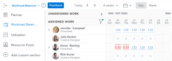

# Aus Ressource migrieren [!UICONTROL Planung] der [!UICONTROL Lastenausgleich]

Die hervorgehobenen Informationen auf dieser Seite beziehen sich auf Funktionen, die noch nicht allgemein verfügbar sind. Sie ist nur in der Vorschau -Umgebung verfügbar.

<!-- drafted for res scheduling deprecation blurb for PREVIEW release - Oct 2022 - CHANGE THIS BLURB TO SOMETHING ELSE AT PRODUCTION:-->

>[!CAUTION]
>  
>  
> Die Planungsbereiche wurden aus der Vorschau-Umgebung entfernt und werden aus der Produktionsumgebung in **Januar 2023**. \
>  Nach Januar 2023 müssen Sie Ihre Ressourcen im Workload Balancer planen. 
>  
> Informationen zum Planen von Ressourcen mit dem Lastenausgleich finden Sie im Abschnitt [Der Lastenausgleich](../../resource-mgmt/workload-balancer/workload-balancer.md).

Die Informationen in diesem Artikel gelten nur für Sie, wenn Sie die Planung Ihrer Ressourcen in der Ressource verwaltet haben [!UICONTROL Planung] Gebiete von Adobe Workfront. Workfront startete die Einstellung der [!UICONTROL Planung] -Tools im November 2020 und ersetzt sie durch die [!UICONTROL Lastenausgleich].

Informationen zum Veraltungsplan für die [!UICONTROL Ressourcenplanung] Tools und die Zeitleiste für ihre Ersetzung durch die [!UICONTROL Lastenausgleich], siehe [Veraltete Tools für die Ressourcenplanung in Adobe Workfront](../../resource-mgmt/resource-mgmt-overview/deprecate-resource-scheduling.md).

Wir möchten, dass Sie so wenig Arbeitsunterbrechung wie möglich erleben, indem Sie einen Migrationsplan entwerfen. Die folgenden Schritte helfen Ihnen dabei, Ihr Team zu schulen und die beste Zeit zu bestimmen, zu der Sie zum [!UICONTROL Lastenausgleich].

## Suchen Sie die Tools für die Ressourcenplanung .

Möglicherweise verwenden Sie und Ihre Teams einige der Ressourcen [!UICONTROL Planung] Tools in den folgenden Bereichen von Workfront:

* Die [!UICONTROL Planung] im Abschnitt [!UICONTROL Ressourcen] area
* Die [!UICONTROL Planung] Abschnitt eines Projekts
* Die [!UICONTROL Zeitplan] Abschnitt eines Teams

Mit dieser Einstellung wird die [!UICONTROL Lastenausgleich] ersetzt alle  [!UICONTROL Ressourcenplanung] Tools in allen oben aufgeführten Bereichen.

## Schritt 1: Trainieren von Teams

Schulung absolvieren [Ressourcenverwaltungsprogramm für das neue Adobe Workfront-Erlebnis](https://one.workfront.com/s/resource-management-program-nwe) (75 Minuten) auf Workfront One.

Wenn Sie Schwierigkeiten haben, sich anzumelden oder den Kurs zu öffnen, wenden Sie sich an den Support. Weitere Informationen finden Sie unter [Support kontaktieren](../../workfront-basics/tips-tricks-and-troubleshooting/contact-customer-support.md).

## Schritt 2: Bestimmen der besten Migrationszeit {#step-2-determine-the-best-time-to-migrate}

Führen Sie die folgenden Schritte aus, um zu bestimmen, wann die beste Zeit für die Migration für Sie ist:

1. Bestimmen der Funktionen in der Ressource [!UICONTROL Planung] Tools, die Ihr Team am häufigsten verwendet, und stellen Sie sicher, dass diese Funktionen im [!UICONTROL Lastenausgleich]. Informationen darüber, welche Funktionen derzeit im Abschnitt [!UICONTROL Lastenausgleich]finden Sie im Abschnitt &quot;Funktionsverfügbarkeit&quot;des Artikels [Veraltete Tools für die Ressourcenplanung in Adobe Workfront](../../resource-mgmt/resource-mgmt-overview/deprecate-resource-scheduling.md).

   >[!IMPORTANT]
   >
   >Fast alle Funktionen der Planungswerkzeuge befinden sich jetzt im Arbeitslade-Balancer.

1. Bestimmen Sie, ob Ihr Team Benutzerzuweisungen für Zuweisungen verwaltet. Das Anpassen oder Ändern der Benutzerzuweisungen bedeutet, die geplanten Stunden pro Tag für jeden Benutzer über die Dauer eines Arbeitselements hinweg zu ändern.

   Die in den Planungswerkzeugen bearbeiteten Zuordnungen werden nicht an den Arbeitslastausgleich übertragen. Standardmäßig verteilt das System die Gesamtdauer der geplanten Stunden eines Arbeitselements gleichmäßig auf die gesamte Dauer des Artikels.

   Sie müssen die Zuordnungen im Arbeitslast-Balancer manuell verwalten, um sicherzustellen, dass die Zuordnungen mit denen in den Planungs-Tools übereinstimmen. Weitere Informationen finden Sie unter [Verwalten von Benutzerzuordnungen im Lastenausgleich](../workload-balancer/manage-user-allocations-workload-balancer.md).

1. Gespeicherte Filter im Bereich Planung werden nicht automatisch an den Arbeitslastausgleich übertragen. Machen Sie sich mit der Erstellung von Filtern vertraut, die Sie möglicherweise im Arbeitslastausgleich benötigen. Informationen zum Erstellen von Filtern im Arbeitslade-Balancer finden Sie unter [Filtern von Informationen im Arbeitslastausgleich](../workload-balancer/filter-information-workload-balancer.md).

<!--
1. Using the information gathered from Steps 1 and Step 2, decide which version of Step 3 you should continue with based on the needs of your organization.
-->

## Schritt 3: Migrieren Sie zum [!UICONTROL Lastenausgleich]{#step-3-migrate-to-the-workload-balancer}

Je nach Ihren Ergebnissen in Schritt 2 haben wir die folgenden Versionen für diesen Schritt identifiziert:

* [Schritt 3a: Sie oder Ihre Teams verwenden [!UICONTROL Planung] Tools, aber die Benutzerzuordnung nicht ändern](#step-3a-you-or-your-teams-use-the-scheudling-tools-but-do-not-modify-user-allocation)
* [Schritt 3b: Sie oder Ihre Teams verwalten die Benutzerzuordnungen in [!UICONTROL Planung] tools](#step-3b-you-or-your-teams-manage-user-allocations-in-the-scheduling-tools)

### Schritt 3a: Sie oder Ihre Teams verwenden [!UICONTROL Planung] Tools, aber die Benutzerzuordnung nicht ändern

Wenn Sie oder Ihre Teams die täglichen Stundenzuweisungen für Arbeitsaufgaben nicht ändern, können Sie die Planungsressourcen auf die [!UICONTROL Lastenausgleich].

Gehen Sie wie folgt vor:

* Wählen Sie ein Übergangsdatum aus.

   >[!TIP]
   >
   >Geben Sie Ihrem Team vor dem Übergangstermin Zeit, sich durch die Schulung zur Verwendung des Workload Balancer zu informieren. Weitere Informationen zu Schulungen finden Sie im Abschnitt . [Migration von der Ressourcenplanung zum Lastenausgleich](#migrate-from-resource-uicontrol-scheduling-to-the-uicontrol-workload-balancer) in diesem Artikel.

* Befolgen Sie diese Richtlinien, um Ihre Teams zu unterstützen:

   * Ermutigen Sie Ihre Teams, die [Übersicht über die [!UICONTROL Lastenausgleich]](../../resource-mgmt/workload-balancer/overview-workload-balancer.md) und alle von dort verlinkten Seiten, um sich eingehender mit der [!UICONTROL Lastenausgleich] funktioniert.
   * Organisation von FAQ-Sitzungen für Ihre Teams, um Fragen in der Woche vor der Umstellung zu beantworten, den Wechsel vorzunehmen und dann ein weiteres FAQ-Meeting abzuhalten, um Folgefragen zu beantworten.
   * Senden Sie Feedback über die Schaltfläche Feedback in der oberen Symbolleiste an Workfront. Unsere Produktentwickler sind immer daran interessiert, Ihre Anwendungsfälle zu erfahren, wie wir die [!UICONTROL Lastenausgleich] mehr Wert bereitstellen.

### Schritt 3b: Sie oder Ihre Teams verwalten die Benutzerzuordnungen in [!UICONTROL Planung] tools

Wenn Ihr Workflow diesem Szenario entspricht, sollten Sie in Ihrem Übergangsplan strategischer vorgehen. Die täglichen Zuordnungen, die in der Variablen [!UICONTROL Planung] -Tools in einer anderen Datenbank gespeichert werden als die täglichen Zuordnungen, die in [!UICONTROL Lastenausgleich]. Das bedeutet, dass die Anpassungen der täglichen Zuweisungen, die Sie in der Ressource vornehmen [!UICONTROL Planung] Tools werden nicht auf die täglichen Zuweisungen in der [!UICONTROL Lastenausgleich].

>[!CAUTION]
>
>Sie haben bis **Januar 2023** , um sicherzustellen, dass die Benutzerzuordnung aus den Planungsbereichen mit der im Arbeitslastausgleich in Ihrer Produktionsumgebung übereinstimmt. Zu diesem Zeitpunkt entfernen wir die Planungswerkzeuge aus der Produktionsumgebung. Sie müssen die Zuordnungen im Arbeitslastausgleich manuell so anpassen, dass sie denen in den Planungs-Tools entsprechen. Die Planungswerkzeuge wurden bereits aus der Umgebung &quot;Vorschau&quot;entfernt.

Beachten Sie beim Übergang zum [!UICONTROL Lastenausgleich] wenn Sie diese [!UICONTROL Planung] Funktion:

* Die Verwaltung der Zuteilungen im [!UICONTROL Planung] Tools, da Ihre Ressourcen-Manager den Wechsel vornehmen. Gehen Sie dazu folgendermaßen vor:

   * Finden Sie die durchschnittliche Dauer von Aufgaben in Ihren aktuellen Projekten heraus und berücksichtigen Sie dies bei der Festlegung, wie lange Sie die Verwaltung der Benutzerzuweisungen beibehalten müssen.

      >[!TIP]
      >
      >Sie müssen nur Ihre aktuellen oder geplanten Projekte betrachten, bei denen Ihre Teams aktiv Aufgaben durchführen und die täglichen Zuweisungen verwalten.

   * Erstellen Sie einen Aufgabenbericht, fügen Sie das Feld Aufgabendauer in der Ansicht hinzu und gruppieren Sie ihn nach Projektname. Fasst die Spalte Dauer in der Ansicht nach dem Durchschnitt zusammen und speichert dann Ihren Bericht.

      Informationen zum Erstellen eines Berichts finden Sie unter [Benutzerdefinierten Bericht erstellen](../../reports-and-dashboards/reports/creating-and-managing-reports/create-custom-report.md) .

   * Analysieren Sie Ihren Aufgabenbericht. Wenn Ihre durchschnittliche Aufgabendauer beispielsweise 3 Tage beträgt, ist möglicherweise eine einwöchige Transition am besten. Lassen Sie das Team die Verwaltung der Benutzerzuweisungen für eine Woche aufheben. Übersetzen Sie das Team in der folgenden Woche in die [!UICONTROL Lastenausgleich] und beginnen mit der Verwaltung von Benutzerzuweisungen in der Folgewoche.
   >[!NOTE]
   >
   >Dieser Vorschlag funktioniert möglicherweise nicht, wenn die durchschnittliche Aufgabendauer länger als die verbleibende Zeit bis zum Entfernen der Planungswerkzeuge ist.

   

   >[!TIP]
   >
   >Sie können während der Übergangszeit weiterhin Aufgaben- und Problemzuweisungen vornehmen. Zuweisungen werden sowohl im Ressourcen-Planer als auch in [!UICONTROL Lastenausgleich].

* Wenn Sie eine größere Organisation sind, deren Teams Ressourcen für Hunderte von Projekten verwalten, sollten Sie die Umstellung von der [!UICONTROL Planung] -Tools [!UICONTROL Lastenausgleich] jeweils ein Portfolio. Ziehen Sie eine schrittweise Einführung in Betracht, indem Sie benutzerdefinierte Filter in der [!UICONTROL Lastenausgleich] um jeweils ein bestimmtes Portfolio zu betrachten.

* Ressourcen-Manager können Teams zusammenstellen: eine Person für die in der  [!UICONTROL Ressourcenplanung] Instrumente und eine geeignete Anpassung in [!UICONTROL Lastenausgleich]. Sobald das Team von zwei Tools beide abgestimmt hat, lassen Sie sie ihre Workflows auf die [!UICONTROL Lastenausgleich].

## Mehr Unterstützung erforderlich

Wenn Sie weitere Informationen zu dieser Migration benötigen, wenden Sie sich an den benutzerdefinierten Support. Informationen zur Kontaktaufnahme mit dem Support finden Sie unter [Support kontaktieren](../../workfront-basics/tips-tricks-and-troubleshooting/contact-customer-support.md).
