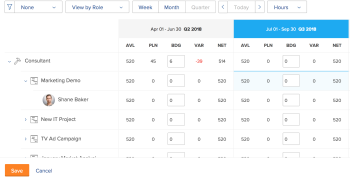

# Budgetressourcen im Ressourcenplaner mithilfe der Projekt- und Rollenansichten

<!--

(NOTE: broken off of another larger article (Planning in the RP); reformat, restructure, relink)

-->

Die Hauptfunktion des Ressourcenplaners besteht darin, Ihre Ressourcen für die Arbeit zu veranschlagen, die für Projekte durchgeführt werden muss.

>[!IMPORTANT]
>
>Sie können Ihre Ressourcen nur dann als Budget festlegen, wenn Sie die Ansichten **Nach Projekt anzeigen** oder **Nach Rolle anzeigen** auf den Ressourcenplaner anwenden.

Bevor Sie mit Budgetinformationen im Ressourcenplaner beginnen, lesen Sie die folgenden Artikel:

* [Ressourcenplaner - Übersicht](../../resource-mgmt/resource-planning/get-started-resource-planner.md)
* [Zugriff erforderlich für Budgetressourcen in Adobe Workfront](../../resource-mgmt/resource-planning/access-needed-to-budget-resources.md)
* [Übersicht über Stunden, FTE und Kosteninformationen in den Projekt- und Rollenansichten des Ressourcenplaners](../../resource-mgmt/resource-planning/overview-of-planner-hour-fte-cost-information-in-role-project-views.md)

## Zugriffsanforderungen

+++ Erweitern Sie , um die Zugriffsanforderungen für die Funktionalität in diesem Artikel anzuzeigen.

Sie müssen über folgenden Zugriff verfügen, um die Schritte in diesem Artikel ausführen zu können:

<table style="table-layout:auto"> 
 <col> 
 <col> 
 <tbody> 
  <tr> 
   <td role="rowheader">Adobe Workfront-Abo</td> 
    <td>
Neu: Beliebig

       
oder

       
Aktuell: Pro oder höher
 </td> 
  </tr> 
  <tr> 
   <td role="rowheader">Adobe Workfront-Lizenz</td> 
   <td>
Neu: Standard

       
oder

       
Aktuell: Plan
</td> 
  </tr> 
  <tr> 
   <td role="rowheader">Konfigurationen auf Zugriffsebene</td> 
   <td> 
Bearbeiten Sie den Zugriff auf das Ressourcen-Management, das Zugriff auf die Option "Prioritäten bearbeiten"und die Budgetzeiten im Ressourcenplaner enthält.
 
Zugriff auf Finanzdaten anhand von Budgetressourcen nach Kosten bearbeiten
 
Zugriff auf Projekte und Benutzer bearbeiten
</td> 
  </tr> 
  <tr> 
   <td role="rowheader">Objektberechtigungen</td> 
   <td> 
Verwalten von Berechtigungen für die Projekte, für die Sie Informationen zum Budget benötigen
</td> 
  </tr> 
 </tbody> 
</table>

Weitere Informationen zu den Informationen in dieser Tabelle finden Sie unter [Zugriffsanforderungen in der Workfront-Dokumentation](/help/quicksilver/administration-and-setup/add-users/access-levels-and-object-permissions/access-level-requirements-in-documentation.md).

+++

## Budgetressourcen im Ressourcenplaner

* [Budget-Ressourcen in der Projektansicht](#budget-resources-in-the-project-view)
* [Budgetressourcen in der Rollenansicht](#budget-resources-in-the-role-view)
* [Massenbasierte Budgetmittel](#budget-resources-in-bulk)

### Budgetressourcen in der Projektansicht {#budget-resources-in-the-project-view}

<!--

(NOTE: this section is linked to the Budgeting Project Resources in the Business Case article)

-->

{{step1-to-resourcing}}

1. Der **Planer** wird standardmäßig angezeigt.
1. (Bedingt) Wählen Sie die Ansicht **Nach Projekt anzeigen** aus.
1. Erweitern Sie die Projekte und die Auftragsrollen, um die Zuordnung für das Projekt, die Rollen oder Benutzer zu verwalten.
1. Führen Sie einen der folgenden Schritte aus, um die Budgetzuweisung für Benutzer vorzunehmen:

   * Geben Sie in der Spalte **BDG** manuell eine Anzahl von geplanten Stunden, FTE oder Kosten für die Benutzer an.

   * Klicken Sie auf das Menü **Mehr** für die Auftragrolle des Benutzers und klicken Sie dann auf **Planete Stunden des Benutzers als budgetiert festlegen**.\
     Die budgetierten Stunden eines jeden Benutzers werden anhand der folgenden Formel berechnet:

     `User Budgeted Hours = User Planned Hours`

1. Führen Sie einen der folgenden Schritte aus, um die Budgetzuweisung für Stellenrollen vorzunehmen:

   * Geben Sie in der Spalte **BDG** manuell eine Anzahl von geplanten Stunden, FTE-Kosten oder Kosten für die Rolle &quot;Job&quot;an.

     >[!NOTE]
     >
     >Die Role Budgeted Hours werden zu den Projekt Budgeted Hours hinzugefügt.

   * (Bedingt) Wenn Sie Stunden für Benutzer in einem Budget festgelegt haben, klicken Sie auf das Menü **Mehr** für die Auftragsrolle und dann auf **Gesamtdauer der von den Benutzern für die Rolle &quot;Rolle&quot;festgelegten Stunden**.\
     Die für die einzelnen Rollen veranschlagten Stunden werden anhand der folgenden Formel berechnet:

     `Role Budgeted Hours = SUM(User Budgeted Hours)`

   * Klicken Sie auf das Menü **Mehr** für das Projekt und klicken Sie dann auf **Geplante Stunden für Rollen festlegen** .\
     Die für die einzelnen Rollen veranschlagten Stunden werden anhand der folgenden Formel berechnet:\
     *

     `Role Budgeted Hours = Role Planned Hours`

     >[!NOTE]
     >   
     >* Die Role Budgeted Hours werden zu den Projekt Budgeted Hours hinzugefügt.
     >* Benutzer können sowohl für Primäre als auch für andere (oder sekundäre) Rollen in den Budgets eingebunden werden.
     >* Der **Prozentsatz der FTE-Verfügbarkeit** für die Benutzerrollen muss eine Zahl sein, die von 0 % abweicht, damit die verfügbaren Stunden im Ressourcenplaner einen Wert für eine Auftragsrolle anzeigen. Wenn einem Benutzer eine Rolle mit einem Prozentsatz von 0 % **Prozent der FTE-Verfügbarkeit** zugeordnet ist, ist der Wert Verfügbare Stunden für diese Auftragsrolle null. In diesem Fall zeigt die Rolle möglicherweise einen negativen **Nettowert** an.\
     >Weitere Informationen zum **Prozentsatz der FTE-Verfügbarkeit** für Auftrags-Rollen finden Sie im Artikel [Profil eines Benutzers bearbeiten](../../administration-and-setup/add-users/create-and-manage-users/edit-a-users-profile.md) .

   * Geben Sie in der Spalte **BDG** manuell eine Anzahl von geplanten Stunden, FTE oder Kosten für das Projekt an. Dadurch wird die Anzahl der geplanten Stunden an jede Rolle im Rahmen des Projekts verteilt. Die folgenden Szenarien existieren:

      * Entspricht die Anzahl der für Ihr Projekt vorgesehenen Stunden der Anzahl der geplanten Projektstunden, entsprechen die für die Rolle vorgesehenen Stunden den für die geplanten Stunden.
      * Wenn die Anzahl der von Ihnen angegebenen projektbudgetierten Stunden nicht mit den geplanten Stunden des Projekts übereinstimmt, werden die Rollenbudgetierungsstunden entsprechend dem Prozentsatz der geplanten Stunden verteilt, der für jede Rolle benötigt wird.\
        Wenn beispielsweise ein Projekt 20 geplante Stunden hat und diese auf zwei Positionen verteilt sind (ein Berater benötigt 12 geplante Stunden und ein Ingenieur 8 geplante Stunden) und Sie 30 Stunden für das Projekt einplanen, werden die Stunden wie folgt verteilt: Die Beraterrolle erhält 18 geplante Stunden und die Ingenieurrolle erhält 12 Stunden.

1. Führen Sie einen der folgenden Schritte aus, um die Budgetzuweisung für das Projekt vorzunehmen:

   * Budget der Rollen im Rahmen des Projekts, wie in Schritt 7 beschrieben.\
     Die im Projekt veranschlagten Stunden werden nach folgender Formel berechnet:

     `Project Budgeted Hours = SUM(Role Budgeted Hours)`

   * Geben Sie in der Spalte **BDG** manuell eine Anzahl von geplanten Stunden, FTE oder Kosten für das Projekt an.\
     Dadurch wird die Rolle der budgetierten Stunden aktualisiert, wie in Schritt 7 beschrieben.\
     

1. Klicken Sie auf **Speichern**.\
   Nachdem Sie Ihre Ressourcen im Ressourcen-Planer zusammengefasst haben, werden die budgetierten Stunden für Ihre Ressourcen und alle damit verbundenen Kosten im Business Case jedes Projekts aufgelistet.\
   Weitere Informationen zum Verständnis des Ressourcenbudgeting-Bereichs des Geschäftsfalls finden Sie im Abschnitt &quot;Ressourcenbudgeting&quot;im Artikel [Überblick über die Bereiche des Geschäftsfalls](../../manage-work/projects/define-a-business-case/areas-of-business-case.md).

1. (Optional) Wählen Sie die Ansicht &quot;User&quot;aus, um festzustellen, ob die Benutzer für jeden Benutzer über die verfügbare und die geplante Stunde hinausreichen oder nicht genügend ausgelastet sind. Budgetierte Stunden sind in der Benutzeransicht nicht sichtbar.

   Informationen dazu, wie Workfront die Verfügbarkeit eines Benutzers berechnet, finden Sie unter [Voreinstellungen für die Ressourcenverwaltung konfigurieren](../../administration-and-setup/set-up-workfront/configure-system-defaults/configure-resource-mgmt-preferences.md).

### Budgetressourcen in der Rollenansicht {#budget-resources-in-the-role-view}

<!--

(NOTE: THIS IS WRONG - I LOGGED A BUG TO FIX THIS LINK - IT SHOULD GO TO"ACCESS NEEDED TO BUDGET IN THE RP":

Planning in the resource planner has links to the UI - ensure Flare notes are there for this: https://workfront.zendesk.com/hc/en-us/articles/115006356928 - the "Budgeting resources in the role view" is linked to this tooltip: ***This is linked to the product in the RP when the user does not have Manage rights on one of the projects under the role. This tool tip is linked here: "You don't have Manage permissions for all projects. Budget hours by individual project instead. Learn more...")

-->

Sie müssen Zugriff auf Ressourcen-Management und Finanzdaten bearbeiten und Finanzberechtigungen für die Projekte verwalten haben, um Ressourcen im Ressourcenplaner zu verwalten. Wenn Sie nur Zugriff auf Anzeigen für mindestens ein Projekt haben, das unter einer Auftrags-Rolle aufgeführt ist, können Sie keine Zuweisung von Budgets für die Rolle in der Rollenansicht vornehmen. Sie können weiterhin die Budgetzuweisung für die Projekte vornehmen, für die Sie über Verwaltungsberechtigungen verfügen.

Weitere Informationen zum Zugriff für Budgetierungsressourcen finden Sie im Artikel [Für Budgetressourcen in Adobe Workfront benötigter Zugriff](../../resource-mgmt/resource-planning/access-needed-to-budget-resources.md).

So weisen Sie Budgetzuweisungen im Ressourcenplaner in der Ansicht &quot;Rolle&quot;zu:

1. Klicken Sie oben rechts in Adobe Workfront auf das Symbol **Hauptmenü** .

1. Klicken Sie auf **Ressourcen**.
1. Der **Planer** wird standardmäßig angezeigt.
1. (Bedingt) Wählen Sie die Ansicht **Nach Rolle anzeigen** aus.
1. Erweitern Sie die Auftragsrollen und die Projekte, um die Zuordnung für das Projekt, die Jobrollen oder Benutzer zu verwalten.
1. Führen Sie einen der folgenden Schritte aus, um die Budgetzuweisung für Benutzer vorzunehmen:

   * Geben Sie in der Spalte **BDG** manuell eine Anzahl von geplanten Stunden, FTE oder Kosten für die Benutzer an.
   * Klicken Sie auf das Menü **Mehr** für das Projekt und dann auf **Planen Sie die Stunden der Benutzer auf den Haushaltsplan setzen**.\
     Die budgetierten Stunden eines jeden Benutzers werden anhand der folgenden Formel berechnet:

     `User Budgeted Hours = User Planned Hours`

1. Führen Sie einen der folgenden Schritte aus, um die Budgetzuweisung für Stellenrollen vorzunehmen:

   * Geben Sie in der Spalte **BDG** manuell eine Anzahl von geplanten Stunden, FTE-Kosten oder Kosten für die Jobrollen an.\
     Dadurch werden die &quot;Role Budgeted Hours&quot;für die Projekte, auf die Sie Zugriff haben, auf die &quot;Project Budgeted Hours&quot;verteilt.

   * Klicken Sie auf das Menü **Mehr** für die Auftragsrolle und klicken Sie dann auf &quot;Planete Stunden von Projekten als Budget festlegen&quot;.**Die Rollenbudgetierungsstunden werden anhand der folgenden Formel berechnet:\
     *

     `Role Budgeted Hours = SUM(Project Budgeted Hours)`

     *Die budgetierten Projektstunden werden mit der folgenden Formel berechnet:

     `Project Budgeted Hours = Project Planned Hours`

   * Geben Sie in der Spalte **BDG** manuell eine Anzahl von geplanten Stunden, VZÄ oder Kosten für die Projekte an, die unter der Auftragsrolle aufgeführt sind.\
     Dadurch wird die Anzahl der geplanten Stunden zur Rolle hinzugefügt.

   >[!NOTE]
   >
   >Benutzer können sowohl für Primäre als auch für andere (oder sekundäre) Rollen in den Budgets eingebunden werden. Der **Prozentsatz der FTE-Verfügbarkeit** für die Benutzerrollen muss eine Zahl sein, die von 0 % abweicht, damit die verfügbaren Stunden im Ressourcenplaner einen Wert für eine Auftragsrolle anzeigen. Wenn einem Benutzer eine Rolle mit einem Prozentsatz von 0 % **Prozent der FTE-Verfügbarkeit** zugeordnet ist, ist der Wert Verfügbare Stunden für diese Auftragsrolle null. In diesem Fall zeigt die Rolle möglicherweise einen negativen **Nettowert** an.\
   >Weitere Informationen zum **Prozentsatz der FTE-Verfügbarkeit** für Auftrags-Rollen finden Sie im Artikel [Profil eines Benutzers bearbeiten](../../administration-and-setup/add-users/create-and-manage-users/edit-a-users-profile.md) .

1. Führen Sie einen der folgenden Schritte aus, um die Budgetzuweisung für das Projekt vorzunehmen:

   * Geben Sie in der Spalte **BDG** manuell eine Anzahl von geplanten Stunden, VZÄ oder Kosten für die Projekte an.\
     Dadurch werden auch die budgetierten Stunden für die Rollen aktualisiert, unter denen das Projekt aufgeführt ist.

   * Klicken Sie auf das Menü **Mehr** für die Auftragsrolle und dann auf **Planen Sie die Projektstunden als budgetiert festlegen**.\
     Die im Projekt veranschlagten Stunden werden nach folgender Formel berechnet:

     `Project Budgeted Hours = Project Planned Hours`

     Das Projekt Budgeted Hours wird den Role Budgeted Hours hinzugefügt.

   * (Bedingt) Wenn Sie die Stunden für die Benutzer eingeplant haben, klicken Sie auf das Menü **Mehr** für das Projekt und klicken Sie dann auf **Gesamtbesuchszeit für das Projekt**.\
     Die im Projekt veranschlagten Stunden werden anhand der folgenden Formel berechnet:

     `Project Budgeted Hours = SUM(User Budgeted Hours)`

     

1. Klicken Sie auf **Speichern**.\
   Nachdem Sie Ihre Ressourcen im Ressourcen-Planer zusammengefasst haben, werden die budgetierten Stunden für Ihre Ressourcen und alle damit verbundenen Kosten im Business Case jedes Projekts aufgelistet.
Weitere Informationen zum Verständnis des Ressourcenbudgeting-Bereichs des Geschäftsfalls finden Sie im Artikel [Budgetressourcen im Geschäftsfall](../../manage-work/projects/define-a-business-case/budget-resources-in-business-case.md).

1. (Optional) Wählen Sie die Ansicht **Nach Benutzer anzeigen** aus, um festzustellen, ob die Benutzer für jeden Benutzer über eine verfügbare und die geplante Stunde verfügen oder nicht genügend ausgelastet sind. Budgetierte Stunden sind in der Ansicht &quot;View by User&quot;nicht sichtbar.

### Massenbasierte Budgetmittel {#budget-resources-in-bulk}

Bei Verwendung von Schnelllinks können Sie die Zuweisung von Ressourcen in großen Mengen vornehmen. Die Schnelllinks sind nur für Projekt- und Rollenansichten verfügbar.

>[!NOTE]
>
>Bei Verwendung der Quick Links zu Budgetzuweisungen für Ressourcen wird die Budgetierung automatisch nur auf die auf dem Bildschirm angezeigten Zeiträume angewendet. Wenn sich die Timeline eines Projekts über einen längeren Zeitraum als den auf Ihrem Bildschirm angezeigten Zeitraum erstreckt, müssen Sie von links nach rechts blättern und dann die Quick Links verwenden, um Ihre Ressourcen automatisch zu budgetieren.

So planen Sie Ihre Ressourcen in großen Mengen:

1. Navigieren Sie zu .\
   Weitere Informationen zum Zugriff auf den Ressourcen-Planer finden Sie im Abschnitt &quot;Zugriff auf den Ressourcen-Planer&quot;im Artikel [Überblick über den Ressourcen-Planer](../../resource-mgmt/resource-planning/get-started-resource-planner.md).\
   Eine Liste der Projekte, die Sie verwalten können, wird in der Liste angezeigt.

1. (Optional) Erweitern Sie jedes Projekt, um eine Liste der ihm zugeordneten Auftragsrollen anzuzeigen.\
   Oder
1. (Optional) Wählen Sie **Nach Rolle anzeigen** aus und erweitern Sie dann jede Rolle, um eine Liste der ihr zugeordneten Projekte anzuzeigen.
1. Bewegen Sie den Mauszeiger über den Namen eines Projekts oder einer Rolle im Arbeitsbereich.
1. Klicken Sie auf das Symbol **Mehr**  , das rechts neben dem Projekt- oder Rollennamen angezeigt wird.

1. Klicken Sie auf eine der verfügbaren Optionen, um automatisch den Betrag der budgetierten Stunden (BDG) für andere Objekte anzugeben.

   Je nachdem, ob Sie in einem Projekt oder in einer Rolle auf das Symbol Mehr geklickt haben, unterscheiden sich die Optionen für das stapelweise Budgetieren. Die folgende Tabelle zeigt die für Projekte und Rollen verfügbaren Optionen:

   <table style="table-layout:auto"> 
    <col> 
    <col> 
    <col> 
    <tbody> 
     <tr> 
      <td> </td> 
      <td><strong>Projektansicht</strong> </td> 
      <td><strong>Rollenansicht</strong> </td> 
     </tr> 
     <tr> 
      <td>Projektoptionen</td> 
      <td> 
       <ul> 
        <li><strong>Geplante Stunden für Rollen als budgetiert festlegen</strong>: Wählen Sie diese Option aus, damit die geplanten Stunden der Rolle mit den geplanten Stunden identisch werden. Die Gesamtdauer der geplanten Stunden für die Rollen wird für die geplanten Stunden angezeigt. </li> 
        <li><strong>Budgetierungsdaten anpassen</strong> : Wählen Sie diese Option, um die budgetierten Stunden in einen anderen Zeitrahmen zu verschieben. Weitere Informationen zur Anpassung der Budgetierungsdaten finden Sie unter <a href="../../resource-mgmt/resource-planning/adjust-budgeting-dates.md" class="MCXref xref">Anpassen der Budgetierungsdaten im Ressourcenplaner</a>.</li> 
       </ul> </td> 
      <td> 
       <ul> 
        <li><strong>Planen Sie die Stunden der Benutzer auf den Haushaltsplan ein</strong>: Wählen Sie diese Option aus, damit die Budgetzeit des Benutzers mit den geplanten Stunden identisch wird. </li> 
        <li><strong>Gesamtbesuchszeit für Projekt</strong>: Wählen Sie diese Option aus, um alle durch den Benutzer zugewiesenen Stunden hinzuzufügen und die Gesamtsumme als budgetierte Stunden für das Projekt und für die Rolle anzuzeigen. Es wird empfohlen, diese Option zu verwenden, nachdem Sie entweder Ihre Benutzer manuell in den Haushalt eingebunden haben oder zuvor die vorherige Option verwendet haben. </li> 
       </ul> </td> 
     </tr> 
     <tr> 
      <td>Rollenoptionen</td> 
      <td> 
       <ul> 
        <li><strong>Planen Sie die Stunden der Benutzer auf den Haushaltsplan ein</strong>: Wählen Sie diese Option aus, damit die Budgetzeit des Benutzers mit den geplanten Stunden identisch wird. </li> 
        <li><strong>Gesamtbesuchszeit für Rolle </strong>: Wählen Sie diese Option, um alle geplanten Stunden des Benutzers hinzuzufügen und die Gesamtsumme als die geplanten Stunden für Rolle und Projekt anzuzeigen. Es wird empfohlen, diese Option zu verwenden, nachdem Sie entweder Ihre Benutzer manuell in den Haushalt eingebunden haben oder zuvor die vorherige Option verwendet haben. </li> 
       </ul> </td> 
      <td> 
       <ul> 
        <li><strong>Planen Sie die Stunden der Projekte auf den Haushalt ein</strong>: Wählen Sie diese Option, um die budgetierten Stunden des Projekts mit den geplanten Stunden zu identisch zu machen. </li> 
       </ul> </td> 
     </tr> 
    </tbody> 
   </table>

   >[!NOTE]
   >
   >Einige der Optionen werden möglicherweise nicht angezeigt, wenn einige der Voraussetzungen für die Arbeit im Ressourcenplaner fehlen.
   >
   >
   >Weitere Informationen zu den Voraussetzungen, die für eine genaue Budgetierung im Ressourcen-Planer erfüllt sein müssen, finden Sie im Abschnitt &quot;Voraussetzungen für die Arbeit im Ressourcen-Planer&quot;im Artikel [Ressourcenplanerübersicht](../../resource-mgmt/resource-planning/get-started-resource-planner.md) .\
   >Einige der Optionen werden beispielsweise in den folgenden Szenarien möglicherweise nicht angezeigt:
   >
   >   
   >   
   >   * Wenn Projekte nicht mit Resource Pool verknüpft sind
   >   * Wenn Ressourcenpools, die mit Projekten verknüpft sind, keine Benutzer enthalten
   >   * Wenn Ressourcen-Pools, die mit Projekten verknüpft sind, Benutzer enthalten, denen keine Auftragsrolle zugeordnet ist.
   >   
   >
