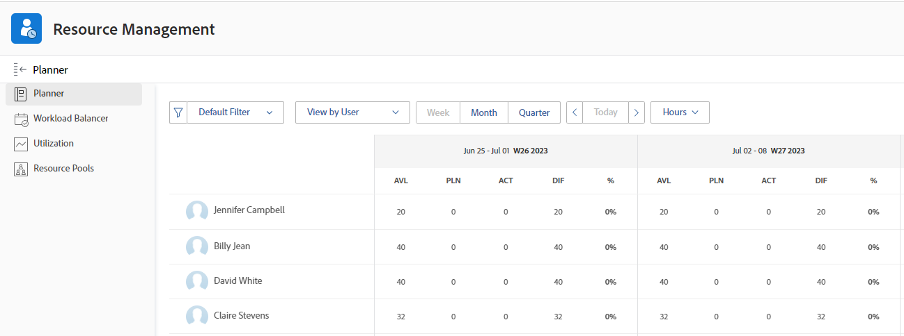

# Übersicht über die Berechnung von Stunden und VZÄ für Benutzer und Funktionen im Ressourcenplaner

<!-- Audited: 5/2025 -->

<!--

(NOTE: Alina:KEEP THIS:***Linked to: Configuring My Settings, Editing User Accounts, Planning in the Resource Planner -- *** Some of this documentation is also duplicated in this article (Scheduling): https://support.workfront.com/hc/en-us/articles/360000557174)

-->

Sie können die Zuordnung und Verfügbarkeit Ihrer Ressourcen im Ressourcenplaner nach Stunden, FTE oder Kosten anzeigen.\
Weitere Informationen zur Kostenberechnung im Ressourcenplaner finden Sie unter [Kosten im Ressourcenplaner berechnen](../../resource-mgmt/resource-planning/calculate-costs-resource-planner.md).

Ein Vollzeitäquivalent (VZÄ) ist ein Maß für die Zeit, die der Anzahl der Stunden entspricht, die einem Benutzer oder einem Aufgabengebiet während eines Tages oder einer Woche für die reale Arbeit aufgewendet werden.

Die folgenden Ressourceninformationen werden im Ressourcenplaner anders berechnet:

* Die verfügbaren Stunden- oder VZÄ-Werte werden auf Grundlage der Art und Weise berechnet, wie Ihr Systemadministrator die Ressourcenverwaltungseinstellungen in Ihrem System konfiguriert.\
  Weitere Informationen zur Berechnung der verfügbaren Stunden und FTE-Werte finden Sie unter [Verfügbare Stunden oder FTE für Benutzer und Aufgabengebiete berechnen im Ressourcenplaner](#calculate-available-hours-or-fte-for-users-and-job-roles-in-the-resource-planner).\
  Weitere Informationen zum Definieren der Ressourcenverwaltungseinstellungen für das Adobe Workfront-System finden Sie unter [Ressourcenverwaltungseinstellungen konfigurieren](../../administration-and-setup/set-up-workfront/configure-system-defaults/configure-resource-mgmt-preferences.md).

* Alle anderen FTE-Werte werden auf Grundlage des Systemstandardzeitplans berechnet.\
  Weitere Informationen dazu, wie alle anderen Werte im Ressourcenplaner angezeigt werden, wenn VZÄ verwendet werden, finden Sie im Abschnitt [Berechnen aller anderen Stunden- und VZÄ-Werte für Benutzer und Aufgabengebiete im ](#calculate-all-other-hour-and-fte-values-for-users-and-job-roles-in-the-resource-planner)) in diesem Artikel.

Es ist wichtig zu verstehen, was das FTE für jede Ihrer Benutzerinnen und Benutzer und deren Aufgabengebiete ist, um Ihre Ressourcen genau zu verwalten, während Sie sie der Arbeit zuweisen.

## Verfügbare Stunden oder VZÄ für Benutzer und Aufgabengebiete im Ressourcenplaner berechnen {#calculate-available-hours-or-fte-for-users-and-job-roles-in-the-resource-planner}

### Berechnen der verfügbaren Stunden und FTE für einen Benutzer im Ressourcenplaner {#calculate-the-available-hours-and-fte-for-a-user-in-the-resource-planner}

Der Workfront-Administrator bestimmt, wie die verfügbare Zeit für einen Benutzer berechnet wird, indem er eine der folgenden Optionen im Bereich Ressourcenverwaltung im Setup auswählt:

* Der Standardzeitplan des Systems und das FTE des Benutzers.
* Der Zeitplan des Benutzers.

>[!NOTE]
>
>Dies bestimmt, wie die Ressourcenverfügbarkeit auf Systemebene berechnet wird. Weitere Informationen zum Definieren der Ressourcenverwaltungseinstellungen für das System finden Sie unter [Ressourcenverwaltungseinstellungen konfigurieren](/help/quicksilver/administration-and-setup/set-up-workfront/configure-system-defaults/configure-resource-mgmt-preferences.md).

Je nachdem, wie diese Einstellung konfiguriert ist, wird die Verfügbarkeit der Benutzer im Ressourcenplaner (Stunden sowie FTE-Verfügbarkeit) anhand der folgenden Methoden berechnet:

* **Standardzeitplan**: Der Standardzeitplan des Systems und das Vollzeitäquivalent (FTE) des Benutzers werden verwendet, um die verfügbaren Stunden und den FTE-Wert für den Benutzer im Ressourcenplaner zu bestimmen. Der Zeitplan des Benutzers wird ignoriert. In diesem Fall:

   * Die verfügbaren Stunden im Ressourcenplaner werden anhand der folgenden Formel berechnet:

     `User Available Hours = Default Schedule Hours * User FTE value`

     Wenn beispielsweise der Standardzeitplan 40 Stunden pro Woche für Arbeit zur Verfügung hat und der FTE-Wert des Benutzers 0,5 ist, kann der Benutzer 20 Stunden pro Woche im Ressourcenplaner arbeiten.

     Weitere Informationen zu Zeitplänen, einschließlich des Standardzeitplans, finden Sie unter [Erstellen eines Zeitplans](/help/quicksilver/administration-and-setup/set-up-workfront/configure-timesheets-schedules/create-schedules.md).

   * Der verfügbare VZÄ für den Benutzer im Ressourcenplaner ist derselbe wie der in den Benutzereinstellungen angegebene VZÄ für den Benutzer.

     Wenn beispielsweise der Benutzer-FTE in den Benutzereinstellungen 0,5 beträgt, ist der verfügbare FTE des Benutzers im Ressourcenplaner 0,5. Weitere Informationen zum FTE-Wert des Benutzers, wie er in den Benutzereinstellungen angezeigt wird, [ Sie unter „Bearbeiten des Benutzerprofils](/help/quicksilver/administration-and-setup/add-users/create-and-manage-users/edit-a-users-profile.md).

* **Zeitplan des Benutzers**: Der Zeitplan des Benutzers wird verwendet, um die Verfügbarkeit des Benutzers im Ressourcenplaner zu bestimmen. Der Wert des Vollzeitäquivalents (FTE) des Benutzers wird ignoriert. In diesem Fall:

   * Die verfügbaren Stunden im Ressourcenplaner sind mit den Stunden im Zeitplan des Benutzers identisch.

     Wenn beispielsweise im Zeitplan des Benutzers 40 Stunden pro Woche für Arbeit verfügbar sind, kann der Benutzer 40 Stunden pro Woche im Ressourcenplaner arbeiten.

   * Das verfügbare FTE im Ressourcenplaner wird anhand der folgenden Formel berechnet:

     `User Available FTE = Hours from the Schedule of the User/ Default Schedule Hours`

     Wenn beispielsweise der Zeitplan des Benutzers 20 Stunden für die Arbeit zur Verfügung hat und der Standardzeitplan in Workfront 40 Stunden für die Arbeit zur Verfügung hat, beträgt der FTE-Wert des Benutzers 0,5.

     Weitere Informationen zu Zeitplänen, einschließlich des Standardzeitplans, finden Sie unter [Erstellen eines Zeitplans](/help/quicksilver/administration-and-setup/set-up-workfront/configure-timesheets-schedules/create-schedules.md).

>[!NOTE]
>
>Wenn der/die Benutzende keinem Zeitplan zugeordnet ist, werden die verfügbaren Stunden für den/die Benutzende(n) anhand des Standardzeitplans berechnet.

### Berechnen der verfügbaren Stunden und VZÄ für ein Aufgabengebiet im Ressourcenplaner {#calculate-the-available-hours-and-fte-for-a-job-role-in-the-resource-planner}

Zuerst müssen Sie die Benutzerverfügbarkeit berechnen, und dann können Sie die Verfügbarkeit der einzelnen Aufgabengebiete berechnen.

Die Verfügbarkeit von Aufgabengebieten im Ressourcenplaner berücksichtigt die Gesamtverfügbarkeit des Benutzers und den Prozentsatz der FTE-Verfügbarkeit, der mit jeder Funktion des Benutzers verknüpft ist.\

Weitere Informationen zum Verknüpfen eines Prozentsatzes der FTE-Verfügbarkeit mit einem Aufgabengebiet für einen Benutzer finden Sie unter [Bearbeiten des Benutzerprofils](../../administration-and-setup/add-users/create-and-manage-users/edit-a-users-profile.md).

Wenn beispielsweise der Wert von Verfügbare Stunden für eine Benutzerin oder einen Benutzer 40 beträgt und sie bzw. er für 75 % dieser Zeit eine Primäre Funktion und für 25 % dieser Zeit eine andere Funktion erfüllen kann, zeigt der Ressourcenplaner an, dass der Wert Verfügbare Stunden für die Primäre Funktion für eine Woche 30 Stunden beträgt und dass der Wert Verfügbare Stunden für die andere Funktion 10 Stunden beträgt. In diesem Fall beträgt der VZÄ für die Primäre Funktion 0,75 und der VZÄ für die andere Funktion 0,25.

>[!NOTE]
>
>Die gesamte verfügbare Zeit für den Benutzer wird anhand einer der beiden Methoden berechnet, die im Abschnitt [Berechnen der verfügbaren Stunden und VZÄ für einen Benutzer im ](#calculate-the-available-hours-and-fte-for-a-user-in-the-resource-planner) dieses Artikels beschrieben sind.

Wenn Sie den Ressourcenplaner in der Rollenansicht anzeigen, entspricht die Verfügbarkeit eines einzigen Aufgabengebiets der Gesamtverfügbarkeit aller Benutzer, die dieses Aufgabengebiet erfüllen können.

Weitere Informationen zur Verfügbarkeit von Ressourcen im Ressourcenplaner finden Sie in der [Ressourcenplaner - Übersicht](../../resource-mgmt/resource-planning/get-started-resource-planner.md).

### Berechnen der verfügbaren Stunden und FTE für einen Benutzer im Ressourcenplaner (Beispiel) {#calculate-the-available-hours-and-fte-for-a-user-in-the-resource-planner-example}

Die folgende Tabelle zeigt, wie die verfügbaren Stunden und das verfügbare FTE für den Benutzer im Ressourcenplaner berechnet werden, je nachdem, welche Methode vom Systemadministrator für die FTE-Berechnung in den Ressourcenverwaltungseinstellungen verwendet wird.

Für dieses Beispiel verwenden wir die folgenden Zahlen:

* Ein Standardzeitplan des Systems von 40 Stunden
* Ein Benutzerzeitplan von 20 Stunden
* Ein Benutzer-FTE von 0,8

| Verfahren zur FTE-Berechnung (Systemeinstellung) | **Stunden ab Zeitplan des Benutzers** | **Stunden ab Standardzeitplan** | **FTE-Feld des Benutzers** | **Verfügbare Stunden im Ressourcenplaner** | **Verfügbare FTE im Ressourcenplaner** |
|---|---|---|---|---|---|
| **Der Standardzeitplan** | Ignoriert | 40 | 0,8 | **32** (berechnet) | **,8** |
| **Der Zeitplan des Benutzers** | 20 | 40 | Ignoriert | **20** | **0,5** (berechnet) |

Zeitplanausnahmen und Ausfallzeiten können sich auf die Anzahl der geplanten Stunden oder VZÄ auswirken. Weitere Informationen finden Sie unter [Voreinstellungen für die Ressourcenverwaltung konfigurieren](../../administration-and-setup/set-up-workfront/configure-system-defaults/configure-resource-mgmt-preferences.md).

Beispiel für eine Ressourcenplaner-Ansicht nach Benutzer und Stunden:

Beispiel einer Ressourcenplaner-Ansicht nach Benutzer und FTE:

## Alle anderen Stunden- und FTE-Werte für Benutzer und Aufgabengebiete im Ressourcenplaner berechnen {#calculate-all-other-hour-and-fte-values-for-users-and-job-roles-in-the-resource-planner}

Zusätzlich zu den verfügbaren Stunden oder FTE werden im Ressourcenplaner auch die folgenden Zeitinformationen angezeigt:

* Geplante Stunden
* Budgetierte Stunden
* Stundenabweichung
* Nettostunden\
  Weitere Informationen finden Sie [Übersicht über Stunden, FTE und Kosten in den Projekt- und Rollenansichten des Ressourcenplaners](../../resource-mgmt/resource-planning/overview-of-planner-hour-fte-cost-information-in-role-project-views.md).

* Stundenunterschied\
  Weitere Informationen finden Sie [Übersicht über Stunden, FTE und Kosten in den Projekt- und Rollenansichten des Ressourcenplaners](../../resource-mgmt/resource-planning/overview-of-planner-hour-fte-cost-information-in-role-project-views.md).

Sie können im Ressourcenplaner dieselben Informationen anzeigen wie FTE oder Stunden.

Workfront verwendet die folgende Formel, um alle anderen Werte als FTE im Ressourcenplaner anzuzeigen:

`FTE = Resource Planner Hours/ Default Schedule Hours`

>[!NOTE]
>
>Der Zeitplan des Benutzers wird bei der Berechnung des VZÄ für alle Werte mit Ausnahme der verfügbaren VZÄ (AVL) im Ressourcenplaner ignoriert. Bei der Berechnung wird nur der Standardzeitplan berücksichtigt.

Diese Berechnung gilt für die folgenden Werte:

* Geplanter FTE (PLN)
* Budgetierter VZÄ (BDG)
* FTE-Abweichung (VAR)
* NETTO-VZÄ
* FTE-Differenz (DIF)
