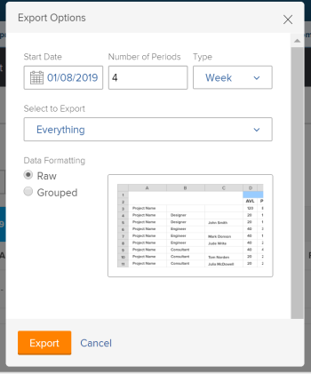

# Exportieren von Informationen aus dem Ressourcenplaner

Sie können Informationen aus jeder Ansicht des Ressourcenplaners in eine Excel-Datei (.xlsx) exportieren, die auf Ihrem Computer gespeichert wird.

>[!IMPORTANT]
>
>Es gibt Einschränkungen hinsichtlich der angezeigten Informationen und der Informationen, die Sie aus dem Ressourcenplaner exportieren können. Weitere Informationen zu diesen Einschränkungen finden Sie unter [Anzeigebeschränkungen für den Ressourcenplaner](../../resource-mgmt/resource-planning/resource-planner-display-limitations.md)

## Zugriffsanforderungen

+++ Erweitern Sie , um die Zugriffsanforderungen für die -Funktion in diesem Artikel anzuzeigen.

Sie müssen über folgenden Zugriff verfügen, um die Schritte in diesem Artikel ausführen zu können:

<table style="table-layout:auto"> 
 <col> 
 <col> 
 <tbody> 
  <tr> 
   <td role="rowheader">Adobe Workfront-Plan</td> 
   <td>
Neu: Beliebig

       
oder

       
Aktuell: Pro oder höher
 </td> 
  </tr> 
  <tr> 
   <td role="rowheader">Adobe Workfront-Lizenz</td> 
   <td>
Neu: Licht oder höher

       
oder

       
Aktuell: Überprüfung oder höher
</td>
  </tr> 
  <tr> 
   <td role="rowheader">Konfigurationen der Zugriffsebene</td> 
   <td> 
Anzeigen des Zugriffs auf oder höher für Projekte, Benutzer und Ressourcenmanagement
 </td> 
  </tr> 
  <tr> 
   <td role="rowheader">Objektberechtigungen</td> 
   <td> 
Anzeigen von Berechtigungen oder höher für Projekte
 </td> 
  </tr> 
 </tbody> 
</table>

Weitere Informationen zu den Informationen in dieser Tabelle finden Sie unter [Zugriffsanforderungen in der Dokumentation zu Workfront](/help/quicksilver/administration-and-setup/add-users/access-levels-and-object-permissions/access-level-requirements-in-documentation.md).

+++

## Exportieren von Informationen aus dem Ressourcenplaner

{{step1-to-resourcing}}

Der **Planer** wird standardmäßig angezeigt.

1. Wählen Sie die Ansicht für den Planer. Sie können eine der folgenden Optionen auswählen:

   * Nach Benutzer/Benutzerin anzeigen
   * Nach Projekt anzeigen
   * Nach Funktion anzeigen

1. Klicken Sie **Exportieren**.

   Das Dialogfeld Exportoptionen wird angezeigt.

   

1. Geben Sie die folgenden Informationen an:\
   **Startdatum**: Das Startdatum Ihres Exports. Die exportierte Datei enthält Informationen zu Zuordnung und Verfügbarkeit ab dem ersten Wochentag, der den hier angegebenen Tag enthält.\
   **Anzahl der Zeiträume**: Die Anzahl der Zeiträume, die Sie in Ihre Datei aufnehmen möchten. Der Standardwert ist 4 Punkte.\
   **Type**: Der Typ der Zeiträume, in denen die Informationen in der exportierten Datei angezeigt werden sollen (Wochen, Monate oder Quartale).\
   Im Folgenden finden Sie die maximalen Zeiträume, die Sie exportieren können:

   * 52 Wochen
   * 36 Monaten
   * 12 Quartale

   **Zu exportieren auswählen**: Je nach ausgewählter Ansicht können Sie auswählen, ob Sie die Verfügbarkeits- und Budgetierungsinformationen für alle auf dem Bildschirm aufgeführten Objekte oder für bestimmte Objekte exportieren möchten.
Sie können auswählen, ob die folgenden Informationen exportiert werden sollen:

   * Wählen Sie in der Projektansicht zum Exportieren aus:

      * Projekte
      * Projekte und Aufgabengebiete
      * Alles (dies ist die Standardoption)

   * Wählen Sie in der Benutzeransicht zum Exportieren Folgendes aus:

      * Benutzende
      * Benutzende und Projekte
      * Alles (dies ist die Standardoption)

   * Wählen Sie in der Rollenansicht die zu exportierende Option aus:

      * Funktionen
      * Aufgabengebiete und Projekte
      * Alles (dies ist die Standardoption)

   **Datenformatierung**: Wählen Sie je nach gewünschter Anzeige Ihrer Excel-Datei die folgenden Optionen aus:

   * **Roh**: Wählen Sie diese Option, um die Verfügbarkeits- und Zuordnungsinformationen anzuzeigen, die nicht nach den Objekten in der Excel-Datei gruppiert sind, zu denen sie gehört. (dies ist die Standardoption)
   * **Gruppiert**: Wählen Sie diese Option aus, um die Verfügbarkeits- und Zuordnungsinformationen gruppiert nach den Objekten anzuzeigen, zu denen sie gehört. Dadurch werden die exportierten Informationen so angezeigt, wie sie auf dem Bildschirm erscheinen.

   Ein Beispiel dafür, wie die Informationen in der exportierten Datei aussehen, finden Sie im Dialogfeld Exportoptionen .

1. Klicken Sie **Exportieren**, um die Informationen aus dem Ressourcenplaner zu exportieren.\
   Nur die von Ihnen gespeicherten Informationen werden exportiert.

1. (Bedingt) Wenn Sie in der Funktions- oder Projektansicht nicht gespeicherte budgetierte Stunden haben, klicken Sie auf **Speichern und fortfahren.**
Eine Excel-Datei (.xlsx) wird auf Ihren Computer heruntergeladen.\
   Der Export aus dem Ressourcenplaner ist nicht verfügbar, während die Datei für den Download vorbereitet wird.\
   (Bedingt) Wenn Sie eine große Datenmenge exportieren, erhalten Sie eine E-Mail mit einem Link, über den Sie die Datei herunterladen können.\
   

1. (Bedingt) Wenn Sie die E-Mail mit der exportierten Datei erhalten, klicken Sie auf **Herunterladen**, um die Datei herunterzuladen.\
   Dadurch gelangen Sie zurück zu Workfront, wo Sie die Datei herunterladen können.\
   Sie müssen bei Workfront angemeldet sein, damit der Download abgeschlossen werden kann.\
   Wenn Sie die Datei zum Zeitpunkt der Bereitstellung nicht herunterladen, bleibt der Download-Link 7 Tage nach dem Initiieren des Exports aktiv.
