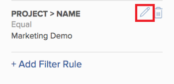

# Filtern von Informationen im Ressourcenplaner

<!--

(AL:*Iterate on this article: filtering by custom data. Other enhancements? Special characters caveat might change - follow the story to know when. It originally came in Beta 3 17.3.)

-->

Mithilfe von Filtern können Sie festlegen, welche Informationen im Ressourcenplaner angezeigt werden, und zwar anhand aller im System gespeicherten Informationen.

## Zugriffsanforderungen

+++ Erweitern Sie , um die Zugriffsanforderungen für die -Funktion in diesem Artikel anzuzeigen.

Sie müssen über folgenden Zugriff verfügen, um die Schritte in diesem Artikel ausführen zu können:

<table style="table-layout:auto"> 
 <col> 
 <col> 
 <tbody> 
  <tr> 
   <td role="rowheader">Adobe Workfront-Plan</td> 
   <td>
Neu: Beliebig

       
oder

       
Aktuell: Pro oder höher
 </td> 
  </tr> 
  <tr> 
   <td role="rowheader">Adobe Workfront-Lizenz</td> 
   <td>
Neu: Licht oder höher

       
oder

       
Aktuell: Überprüfung oder höher
</td>
  </tr> 
  <tr> 
   <td role="rowheader">Konfigurationen der Zugriffsebene</td> 
   <td> 
Anzeigen des Zugriffs auf oder höher für Projekte, Benutzer und Ressourcenmanagement
 </td> 
  </tr> 
  <tr> 
   <td role="rowheader">Objektberechtigungen</td> 
   <td> 
Anzeigen von Berechtigungen oder höher für Projekte
 </td> 
  </tr> 
 </tbody> 
</table>

Weitere Informationen zu den Informationen in dieser Tabelle finden Sie unter [Zugriffsanforderungen in der Dokumentation zu Workfront](/help/quicksilver/administration-and-setup/add-users/access-levels-and-object-permissions/access-level-requirements-in-documentation.md).

+++

## Übersicht über Ressourcenplaner-Filter

Um die Menge der im Ressourcenplaner angezeigten Informationen zu minimieren, bietet Adobe Workfront einen Standardfilter mit vorkonfigurierten Kriterien. Informationen zum Standardfilter finden Sie im Abschnitt [Übersicht über den Standardfilter im Ressourcenplaner](#overview-of-the-default-filter-in-the-resource-planner) in diesem Artikel.

Sie können auch benutzerdefinierte Filter erstellen. Informationen zum Anpassen von Filtern im Ressourcenplaner finden Sie im Abschnitt [Erstellen von Ressourcenplaner-Filtern](#create-resource-planner-filters) in diesem Artikel.

Beachten Sie bei der Verwendung von Filtern im Ressourcenplaner Folgendes:

* Die von Ihnen erstellten Filter sind nur für Sie sichtbar. Sie können Filter freigeben, um sie für andere Benutzer verfügbar zu machen.
* Als Workfront-Administrator können Sie nur Filter sehen, die Sie erstellen oder die für Sie freigegeben sind.
* Die gefilterten Ergebnisse ändern sich nicht, wenn Sie eine andere Ansicht für den Ressourcenplaner auswählen.\
  Weitere Informationen zum Ändern der Ansicht im Ressourcenplaner finden Sie im Auswahlabschnitt „Projekt/Rolle/Benutzeransicht“ in [Übersicht zum Ressourcenplaner](../../resource-mgmt/resource-planning/resource-planner-navigation.md).

* Durch das Anwenden eines Filters ändern sich die Zuordnungs- und Verfügbarkeitsdaten im Ressourcenplaner für Projekte, Rollen oder Benutzende nicht. Ein Filter ändert nur die Anzahl der Objekte, die Sie im Ressourcenplaner sehen.
* Die Filterung gilt für alle Objekte, die gleichzeitig im Ressourcenplaner angezeigt werden. Wenn Sie beispielsweise nach einem bestimmten Benutzer filtern, zeigt der Ressourcenplaner nur die folgenden Ergebnisse an:

   * Projekte, bei denen dieser Benutzer Teil des Ressourcenpools ist (für die Projekt- und Rollenansichten) oder eine Zuweisung im Projekt hat (für die Benutzeransicht)
   * Mit dem Benutzer in diesen Projekten verknüpfte Rollen\
     Andere Rollen oder Benutzer in den Projekten, denen der Benutzer zugeordnet ist, werden nicht angezeigt.

## Übersicht über den Standardfilter im Ressourcenplaner {#overview-of-the-default-filter-in-the-resource-planner}

Wenn Sie den Ressourcenplaner zum ersten Mal öffnen, wendet Workfront den Standardfilter an. Sie können den Standardfilter bearbeiten, um nur nach den Elementen zu filtern, die angezeigt werden sollen. Informationen zum Ändern eines Filters finden Sie im Abschnitt [Bearbeiten eines Filters im Ressourcenplaner](#edit-a-filter-in-the-resource-planner) in diesem Artikel.

Beachten Sie bei Verwendung des Standardfilters Folgendes:

* Der Standardfilter ruft nur Informationen aus Projekten mit den folgenden Eigenschaften ab:

   * Ein geplantes Abschlussdatum, das nach dem ersten Datum des aktuellen Monats liegt
   * Ein geplantes Startdatum, das vor dem letzten Tag des vierten Monats ab dem aktuellen Datum liegt.
   * Status „Aktuell“ oder „Planung“

  >[!IMPORTANT]
  >
  >Der Standardfilter ruft Informationen zu Projekten ab, die immer innerhalb von vier Monaten ab dem ersten Tag des aktuellen Monats auftreten, unabhängig vom ausgewählten Zeitrahmen, der im Ressourcenplaner angezeigt werden soll.

* In der Benutzeransicht werden alle Benutzer im System angezeigt, aber nur die Benutzer, die mit den gefilterten Projekten verknüpft sind, zeigen Stundeninformationen an.
* Sie können die Informationen im Standardfilter bearbeiten, ohne den Filter zu speichern.
* Sie können eine Kopie des Standardfilters duplizieren und bearbeiten, die gewünschten Kriterien darin ändern und sie dann als neuen Filter speichern.
* Sie können den Standardfilter weder löschen noch freigeben.

  

## Ressourcenplaner-Filter erstellen {#create-resource-planner-filters}

<!--

(Alina: **^ This section is somewhat duplicated (format more than content) from the "Filtering Utilization Information" section in "Viewing Utilization Information for Projects, Programs, and Portfolios.")

-->

Das Erstellen eines Filters im Ressourcenplaner ist für alle Ansichten identisch.

Stellen Sie sicher, dass die Voraussetzungen für die Anzeige der richtigen Informationen im Ressourcenplaner erfüllt sind, bevor Sie einen Filter erstellen.\
Informationen dazu, wie Sie die erforderlichen Voraussetzungen für die Arbeit mit dem Ressourcenplaner erfüllen, finden Sie im Abschnitt „Voraussetzungen für die Arbeit im Ressourcenplaner“ im Artikel [Ressourcenplaner - Übersicht](../../resource-mgmt/resource-planning/get-started-resource-planner.md).

Beachten Sie beim Erstellen eines Filters Folgendes:

* Die Anzahl der Objekte, nach denen Sie gleichzeitig filtern können, ist unbegrenzt.
* Die verfügbaren Felder, die Sie einem Filter hinzufügen können, ändern sich entsprechend dem Objekt der Ansicht, die Sie auf den Ressourcenplaner anwenden. Beispielsweise können Sie nur in der Benutzeransicht nach Problem- oder Aufgabenfeldern filtern, da diese Objekte nur in der Benutzeransicht angezeigt werden. Wenn Sie in der Benutzeransicht einen Filter für Probleme oder Aufgaben erstellen und ihn dann auf die Projekt- oder Rollenansichten anwenden, wird er ignoriert, da die Felder in der Projekt- oder Rollenansicht nicht vorhanden sind. In diesem Fall erscheint der Filter nicht verfügbar.

So erstellen Sie einen Filter im Ressourcenplaner:

{{step1-to-resourcing}}

Der **Planer** wird standardmäßig angezeigt.

Standardmäßig wird beim ersten Zugriff auf den Ressourcenplaner der <strong>Standardfilter</strong> angewendet. Weitere Informationen zum Standardfilter finden Sie im Abschnitt <a href="#overview-of-the-default-filter-in-the-resource-planner" class="MCXref xref">Übersicht über den Standardfilter im </a>) in diesem Artikel.

1. Klicken Sie oben links im auf das Symbol **Filter**.
   
oder
Erweitern Sie das **Filter**-Dropdown-Menü und klicken Sie auf **Neuen Filter hinzufügen**.
   

1. Um einen Filter mit den integrierten Kriterien zu erstellen, geben Sie eines der folgenden Felder an:

   * **Portfolio**: Geben Sie den Namen des Portfolios ein, das die Informationen enthält, die Sie in den Ressourcenplaner aufnehmen möchten, und klicken Sie dann auf den Namen, wenn er in der Liste angezeigt wird.\
     Wiederholen Sie diesen Vorgang, um Informationen aus mehreren Portfolios einzuschließen.

   * **Projektstatus**: Erweitern Sie das Dropdown-Menü Projektstatus und wählen Sie einen oder mehrere in der Liste verfügbare Projektstatus aus.
   * **Team**: Geben Sie den Namen eines oder mehrerer Teams ein, die mit den Benutzern verknüpft sind, denen Aufgaben in den Projekten zugewiesen sind, die Sie anzeigen möchten.
   * **Aufgabengebiet**: Geben Sie den Namen einer oder mehrerer Aufgabengebiete ein, die den Benutzenden zugeordnet sind, die Aufgaben in den Projekten zugewiesen wurden, die Sie anzeigen möchten.
   * **Pools**: Geben Sie den Namen eines oder mehrerer Ressourcenpools ein, die mit den Projekten (für die Projektansicht), den Benutzern (für die Benutzeransicht) oder sowohl mit den Projekten als auch mit den Benutzern (für die Rollenansicht) verknüpft sind, die Sie anzeigen möchten.
   * **Gruppe**: Geben Sie den Namen einer oder mehrerer Gruppen ein, die mit den Benutzern (in der Benutzeransicht) oder Projekten (in der Projekt- und Rollenansicht) verknüpft sind, die Sie anzeigen möchten.

1. Klicken Sie **Filterregel hinzufügen** und geben Sie dann den Feldnamen, nach dem Sie filtern möchten, in das Feld **Zum Filtern von Elementen eingeben** ein. Wenn das Feld verfügbar ist, wird es für jedes Objekt ausgefüllt, mit dem es verknüpft werden kann.

   >[!IMPORTANT]
   >
   >Beim Verweisen auf benutzerdefinierte Felder müssen Sie den Feldnamen und nicht die Feldbezeichnung eingeben. Die Feldbezeichnung wird in einem benutzerdefinierten Formular angezeigt, das an ein Objekt angehängt ist. Informationen zum Unterschied zwischen der Bezeichnung und dem Namen eines benutzerdefinierten Felds finden Sie unter [Erstellen eines benutzerdefinierten Formulars](/help/quicksilver/administration-and-setup/customize-workfront/create-manage-custom-forms/form-designer/design-a-form/design-a-form.md).

1. Klicken Sie auf den Namen des Felds, um es dem Filter hinzuzufügen, wenn es in der Liste angezeigt wird.\
   Weitere Informationen zu den Feldern, die Sie in der Liste sehen, finden Sie unter [Glossar der Adobe Workfront-Terminologie](../../workfront-basics/navigate-workfront/workfront-navigation/workfront-terminology-glossary.md).

1. (Optional) Wählen Sie die Filter- und Bedingungsmodifikatoren für den Filter aus. Die verfügbaren Modifikatoren werden unter [Filter- und Bedingungsmodifikatoren](../../reports-and-dashboards/reports/reporting-elements/filter-condition-modifiers.md) beschrieben.

   Sie können benutzerbasierte oder datumsbasierte Platzhalter verwenden, um nach Informationen zu filtern, die mit dem angemeldeten Benutzer verbunden sind.\
   Informationen zu unterstützten Platzhaltern in Filtern finden Sie unter [Übersicht über Platzhalterfiltervariablen](../../reports-and-dashboards/reports/reporting-elements/understand-wildcard-filter-variables.md).

1. Klicken Sie **Speichern**, um die Filterregel zu speichern.
1. (Optional) Klicken Sie auf **Filterregel hinzufügen**, um eine neue Regel für ein anderes Objekt oder Feld hinzuzufügen.
1. Klicken Sie **Anwenden**, um den Filter anzuwenden, ohne ihn zu speichern.

   Oder

   Klicken Sie **Filter speichern**, um den Filter zu speichern.\
   

1. (Bedingt) Nachdem Sie auf **Speichern** geklickt haben, geben Sie einen Namen für den Filter in das Feld **Filtername** innerhalb des Dialogfelds **Filter speichern** ein. Dies ist ein Pflichtfeld.\
   

   >[!NOTE]
   >
   >Wenn Ihr Filtername Sonderzeichen enthält, verwenden Sie nur die folgenden Zeichen:
   >
   >* Komma
   >* Schrägstrich
   >* Bindestrich
   >* Unterstreichen

1. Klicken Sie auf **Speichern**.

   Die Ergebnisse im Ressourcenplaner werden jetzt nach den Informationen gefiltert, die Sie in den Filterregeln enthalten haben.

## Vorhandenen Filter anwenden

Wenn Sie oder eine Person mit Zugriff auf den Ressourcenplaner einen Filter speichern, wird er für alle Benutzer des Ressourcenplaners verfügbar.

So wenden Sie einen vorhandenen Filter an:

1. Wechseln Sie zum Ressourcenplaner.
1. Erweitern Sie in der oberen linken Ecke das Dropdown **Menü** Filter“.

   Sie können in diesem Menü Filter sehen, die Sie oder andere erstellt und für Sie freigegeben haben.\
   

1. Wählen Sie im Dropdown-Menü einen Filter aus. In diesem Menü werden Filter angezeigt, die von Ihnen oder anderen Benutzern erstellt wurden.\
   Wenn Sie einen Filter auswählen, wird automatisch die Menge an Informationen reduziert, die im Ressourcenplaner angezeigt wird.

## Bearbeiten eines Filters im Ressourcenplaner {#edit-a-filter-in-the-resource-planner}

Sie können einen Filter im Ressourcenplaner bearbeiten, indem Sie einen der folgenden Schritte ausführen:

* [Filter umbenennen](#rename-a-filter)
* [Bearbeiten der Informationen in einem Filter](#edit-the-information-in-a-filter)
* [Duplizieren von Filtern](#duplicate-a-filter)

Wenn Sie einen Filter bearbeiten, wird er für alle Benutzenden im System aktualisiert, die Zugriff auf den Ressourcenplaner haben.

### Umbenennen von Filtern {#rename-a-filter}

Sie können den Namen eines Filters ändern, ohne seine Kriterien zu ändern. Es wird empfohlen, den anderen Benutzern im System diese Änderung mitzuteilen, da Filter für andere Benutzer sichtbar sind. Diese Änderung wirkt sich auf die Filterlisten für alle aus, die den Ressourcenplaner sehen können.

1. Gehen Sie zum Ressourcenplaner und erweitern Sie das Dropdown **Menü** Filter), um einen gespeicherten Filter auszuwählen.
1. Erweitern Sie das **Filter**-Dropdown-Menü. Suchen Sie den Filter, den Sie umbenennen möchten, und bewegen Sie den Mauszeiger über den Namen.
1. Klicken Sie auf **Symbol** Filter umbenennen) neben dem Namen des Filters.

   

1. Geben Sie im Feld „Filtername“ einen **Namen für** Filter an.
1. Klicken Sie auf **Speichern**.\
   Die im Filter enthaltenen Informationen sind identisch, und der Name wird aktualisiert.

### Bearbeiten der Informationen in einem Filter {#edit-the-information-in-a-filter}

Sie können die Informationen ändern, die Sie in einen Filter einbeziehen, ohne dessen Namen zu ändern. Es wird empfohlen, den anderen Benutzern im System diese Änderung mitzuteilen, da für sie Filter sichtbar sind. Diese Änderung wirkt sich auf die Filterlisten für alle aus, die den Ressourcenplaner sehen können.

1. Gehen Sie zum Ressourcenplaner und erweitern Sie **Dropdown** Menü „Filter“ in der linken oberen Ecke.
1. Wählen Sie einen vorhandenen Filter aus, den Sie bearbeiten möchten.
1. Klicken Sie auf **Filter**-Symbol.\
   

1. Fügen Sie dem Filter neue Felder hinzu.\
   Weitere Informationen zum Erstellen von Filtern finden Sie unter [Erstellen von Ressourcenplaner-Filtern](#create-resource-planner-filters).

1. Bewegen Sie den Mauszeiger über die für den Filter ausgewählten vorhandenen Felder und klicken Sie auf das Symbol **Bearbeiten**, um ein anderes Feld auszuwählen, oder auf das Symbol **Löschen**, um das Feld zu löschen.\
   

1. (Optional) Klicken Sie auf **Filterregel hinzufügen**, um dem Filter neue Felder hinzuzufügen.\
   Weitere Informationen zum Definieren von Filterkriterien finden Sie unter [Erstellen von Ressourcenplaner-Filtern](#create-resource-planner-filters).

1. Klicken Sie **Anwenden**, um den Filter anzuwenden, ohne ihn zu speichern.

   Oder

   Klicken Sie **Speichern**, um den Filter zu speichern.\
   Der Filter wird unter demselben Namen, aber mit neuen Filterkriterien gespeichert.

### Duplizieren von Filtern {#duplicate-a-filter}

Sie können einen vorhandenen Filter duplizieren. Die ursprünglichen Filterkriterien bleiben im duplizierten Filter gleich und Sie können den neuen Filter unter einem neuen Namen speichern.

1. Gehen Sie zum Ressourcenplaner und erweitern Sie **Dropdown** Menü „Filter“ in der linken oberen Ecke.
1. Bewegen Sie den Mauszeiger über den Namen eines gespeicherten Filters, den Sie duplizieren möchten.
1. Klicken Sie auf **Symbol** Duplizieren“.

   \
   Das Feld Filter duplizieren wird angezeigt.

1. Geben **im Feld** Filtername“ einen neuen Namen für den doppelten Filter an.\
   Der Standardname für den neuen Filter lautet *`<Original Filter Name>`(copy)*.

1. Klicken Sie auf **Speichern**. Ein neuer Filter wird mit denselben Kriterien wie der ursprüngliche Filter und mit einem neuen Namen erstellt.

   >[!NOTE]
   >
   >Obwohl Sie zwei Filter nach demselben Namen und mit identischen Kriterien verwenden können, empfehlen wir, Filter mit eindeutigen Filterkriterien und Namen in Ihrem Ressourcenplaner zu speichern, um Verwirrungen zu vermeiden.

## Filter löschen

Sie können einen Filter löschen, wenn er nicht mehr benötigt wird. Der Standardfilter kann nicht gelöscht werden.

Informationen zum Standardfilter finden Sie im Abschnitt [Übersicht über den Standardfilter im Ressourcenplaner](#overview-of-the-default-filter-in-the-resource-planner) in diesem Artikel.

Wenn Sie einen Filter löschen, wird der Filter für alle Workfront-Benutzenden gelöscht, die Zugriff auf den Ressourcenplaner haben. Stellen Sie vor dem Entfernen sicher, dass der zu entfernende Filter nicht mehr von anderen Benutzern verwendet wird, die im Ressourcenplaner arbeiten. Ein gelöschter Filter kann nicht wiederhergestellt werden.

So entfernen Sie einen Filter:

1. Wechseln Sie zum Ressourcenplaner.
1. Erweitern Sie das **Filter**-Dropdown-Menü.
1. Suchen Sie den Filter, den Sie entfernen möchten, und bewegen Sie den Mauszeiger über den Namen.
1. Klicken Sie auf **Symbol** Filter löschen“ neben dem Namen des Filters.

   

1. Klicken **** im Dialogfeld **Filter löschen** auf Löschen.

1. Der Filter wird gelöscht und aus dem Ressourcenplaner entfernt.

## Filter freigeben

Sie können einen Filter, den Sie erstellt haben oder auf den Sie Zugriff haben, für andere Benutzer freigeben. Sie können den Standardfilter nicht freigeben, aber Sie können ihn duplizieren und die Kopie freigeben.

>[!NOTE]
>
>Alle Benutzenden, einschließlich Workfront-Administratoren, können nur auf Filter zugreifen, die sie erstellt haben oder die für sie freigegeben wurden. Sie können einen Filter für bestimmte Benutzer freigeben, um ihn für alle Ressourcenplaner-Benutzer verfügbar zu machen.

Informationen zum Standardfilter finden Sie im Abschnitt [Übersicht über den Standardfilter im Ressourcenplaner](#overview-of-the-default-filter-in-the-resource-planner) in diesem Artikel.

Informationen zum Duplizieren von Filtern finden Sie [ Abschnitt „Duplizieren ](#duplicate-a-filter) Filters“ in diesem Artikel.

1. Wechseln Sie zum Ressourcenplaner.
1. Erweitern Sie das **Filter**-Dropdown-Menü.
1. Suchen Sie den Filter, den Sie freigeben möchten, und bewegen Sie den Mauszeiger über seinen Namen.
1. Klicken Sie auf **Filter freigeben** neben dem Namen des Filters.

   

   Das Dialogfeld Zugriff auf Filter wird angezeigt.

1. (Optional) Um den Filter für alle Ressourcenplaner-Benutzer verfügbar zu machen, klicken Sie auf das Symbol **Einstellungen** und wählen Sie dann **Systemweit sichtbar machen**.

   

1. Geben **in das Feld „Ressourcenplaner-Filterzugriff erteilen an** die Namen von Benutzern, Teams, Rollen, Gruppen oder Unternehmen ein, für die Sie den Filter freigeben möchten.
1. Wählen Sie aus den folgenden Berechtigungsebenen aus:

   * Anzeigen
   * Verwalten

     Informationen zu Berechtigungen in Workfront finden Sie unter [Übersicht über Freigabeberechtigungen für Objekte](../../workfront-basics/grant-and-request-access-to-objects/sharing-permissions-on-objects-overview.md)

1. (Optional) Klicken Sie auf **Erweiterte Einstellungen**, um Berechtigungen für jede Ebene hinzuzufügen, indem Sie sie auswählen, oder entfernen Sie Berechtigungen für jede Ebene, indem Sie die Auswahl aufheben.

   

1. Klicken Sie auf **Speichern**.

   Der Filter wird für die von Ihnen ausgewählten Entitäten freigegeben und im Bereich **Für mich freigegeben** angezeigt.

   
