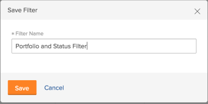

# Filtern von Informationen im Ressourcenplaner

<!--

(AL:*Iterate on this article: filtering by custom data. Other enhancements? Special characters caveat might change - follow the story to know when. It originally came in Beta 3 17.3.)

-->

Mithilfe von Filtern können Sie ändern, welche Informationen im Ressourcenplaner aus allen im System gespeicherten Informationen angezeigt werden.

## Zugriffsanforderungen

Sie müssen über Folgendes verfügen:

<table style="table-layout:auto"> 
 <col> 
 <col> 
 <tbody> 
  <tr> 
   <td role="rowheader">Adobe Workfront-Plan*</td> 
   <td> 
Pro und höher
 </td> 
  </tr> 
  <tr> 
   <td role="rowheader">Adobe Workfront-Lizenz*</td> 
   <td> 
Überprüfen oder höher<!--
      <MadCap:conditionalText data-mc-conditions="QuicksilverOrClassic.Draft mode">
        (this seems to be the case in NWE only, not classic. Waiting on Vazgen's response for this)
      </MadCap:conditionalText>
     -->
 </td> 
  </tr> 
  <tr> 
   <td role="rowheader">Konfigurationen auf Zugriffsebene*</td> 
   <td> 
Zugriff auf Projekte, Benutzer und Ressourcenverwaltung anzeigen oder höher 
 
<b>NOTIZ</b>

Wenn Sie immer noch keinen Zugriff haben, fragen Sie Ihren Workfront-Administrator, ob er zusätzliche Zugriffsbeschränkungen für Ihre Zugriffsebene festlegt. Informationen dazu, wie ein Workfront-Administrator Ihre Zugriffsstufe ändern kann, finden Sie unter <a href="../../administration-and-setup/add-users/configure-and-grant-access/create-modify-access-levels.md" class="MCXref xref">Benutzerdefinierte Zugriffsebenen erstellen oder ändern</a>.
 </td>
</tr> 
  <tr> 
   <td role="rowheader">Objektberechtigungen</td> 
   <td> 
Berechtigungen für Projekte anzeigen
 
Informationen zum Anfordern von zusätzlichem Zugriff finden Sie unter <a href="../../workfront-basics/grant-and-request-access-to-objects/request-access.md" class="MCXref xref">Zugriff auf Objekte anfordern </a>.
 </td> 
  </tr> 
 </tbody> 
</table>

*Wenden Sie sich an Ihren Workfront-Administrator, um zu erfahren, welchen Plan, welchen Lizenztyp oder welchen Zugriff Sie haben.

## Übersicht über die Filter für Ressourcenplaner

Um die im Ressourcenplaner angezeigte Datenmenge zu minimieren, stellt Adobe Workfront einen Standardfilter mit vorkonfigurierten Kriterien bereit. Informationen zum Standardfilter finden Sie im Abschnitt . [Übersicht über den Standardfilter im Ressourcenplaner](#overview-of-the-default-filter-in-the-resource-planner) in diesem Artikel.

Sie können auch benutzerdefinierte Filter erstellen. Informationen zum Anpassen von Filtern im Ressourcenplaner finden Sie im Abschnitt . [Filter für Ressourcenplaner erstellen](#create-resource-planner-filters) in diesem Artikel.

Beachten Sie bei der Verwendung von Filtern im Ressourcenplaner Folgendes:

* Die von Ihnen erstellten Filter sind nur für Sie sichtbar. Sie können Filter freigeben, um sie für andere Benutzer verfügbar zu machen.
* Als Workfront-Administrator können Sie nur Filter sehen, die Sie erstellen oder die für Sie freigegeben sind.
* Die gefilterten Ergebnisse ändern sich nicht, wenn Sie eine andere Ansicht für den Ressourcenplaner auswählen.\
  Weitere Informationen zum Ändern der Ansicht im Ressourcenplaner finden Sie im Auswahlabschnitt &quot;Projekt-/Rolle-/Benutzeransicht&quot;unter [Navigationsübersicht über den Ressourcenplaner](../../resource-mgmt/resource-planning/resource-planner-navigation.md).

* Beim Anwenden eines Filters werden die Zuordnungs- und Verfügbarkeitsdaten im Ressourcenplaner für Projekte, Rollen oder Benutzer nicht geändert. Ein Filter ändert nur die Anzahl der Objekte, die im Ressourcenplaner angezeigt werden.
* Die Filterung gilt für alle Objekte, die gleichzeitig im Ressourcenplaner angezeigt werden. Wenn Sie beispielsweise nach einem bestimmten Benutzer filtern, zeigt der Ressourcenplaner nur die folgenden Ergebnisse an:

   * Projekte, bei denen dieser Benutzer Teil des Ressourcen-Pools ist (für die Projekt- und Rollenansicht) oder eine Zuweisung für das Projekt hat (für die Benutzeransicht)
   * Mit dem Benutzer verknüpfte Rollen für diese Projekte\
     Andere Rollen oder Benutzer in den Projekten, mit denen der Benutzer verknüpft ist, werden nicht angezeigt.

## Übersicht über den Standardfilter im Ressourcenplaner {#overview-of-the-default-filter-in-the-resource-planner}

Wenn Sie den Ressourcenplaner zum ersten Mal öffnen, wendet Workfront den Standardfilter an. Sie können den Standardfilter bearbeiten, um nur nach den Elementen zu filtern, die angezeigt werden sollen. Informationen zum Ändern von Filtern finden Sie im Abschnitt . [Filter im Ressourcenplaner bearbeiten](#edit-a-filter-in-the-resource-planner) in diesem Artikel.

Beachten Sie bei Verwendung des Standardfilters Folgendes:

* Der Standardfilter ruft Informationen nur aus Projekten mit folgenden Eigenschaften ab:

   * Ein geplantes Abschlussdatum, das nach dem ersten Datum des aktuellen Monats eintritt
   * Ein geplantes Startdatum, das vor dem letzten Tag des vierten Monats ab dem aktuellen Datum eintritt
   * Status &quot;Aktuell&quot;oder &quot;Planung&quot;

  >[!IMPORTANT]
  >
  >Der Filter Standard ruft Informationen aus den Projekten ab, die immer innerhalb von vier Monaten ab dem ersten Tag des aktuellen Monats auftreten, unabhängig vom Zeitrahmen, den Sie für die Anzeige im Ressourcenplaner auswählen.

* In der Benutzeransicht werden alle Benutzer im System angezeigt, aber nur die mit den gefilterten Projekten verknüpften Benutzer zeigen Stundeninformationen an.
* Sie können die Informationen im Standardfilter bearbeiten, ohne den Filter zu speichern.
* Sie können eine Kopie des Standardfilters duplizieren und bearbeiten, die gewünschten Kriterien darin ändern und sie dann als neuen Filter speichern.
* Der Standardfilter kann nicht gelöscht oder freigegeben werden.

  

## Filter für Ressourcenplaner erstellen {#create-resource-planner-filters}

<!--

(Alina: **^ This section is somewhat duplicated (format more than content) from the "Filtering Utilization Information" section in "Viewing Utilization Information for Projects, Programs, and Portfolios.")

-->

Das Erstellen eines Filters im Ressourcenplaner ist für alle Ansichten identisch.

Stellen Sie sicher, dass die Voraussetzungen für die Anzeige der richtigen Informationen im Ressourcenplaner vorhanden sind, bevor Sie einen Filter erstellen.\
Informationen dazu, wie Sie die erforderlichen Voraussetzungen für die Arbeit mit dem Ressourcenplaner erfüllen, finden Sie im Abschnitt &quot;Voraussetzungen für die Arbeit mit dem Ressourcenplaner&quot;im Abschnitt [Übersicht über den Ressourcenplaner](../../resource-mgmt/resource-planning/get-started-resource-planner.md) Artikel.

Beachten Sie beim Erstellen eines Filters Folgendes:

* Die Anzahl der Objekte, nach denen Sie filtern können, ist nicht begrenzt.
* Die verfügbaren Felder, die Sie zu einem Filter hinzufügen können, ändern sich entsprechend dem Objekt der Ansicht, die Sie auf den Ressourcenplaner anwenden. Beispielsweise können Sie nur in der Benutzeransicht nach den Feldern &quot;Problem&quot;oder &quot;Aufgabe&quot;filtern, da diese Objekte nur in der Benutzeransicht angezeigt werden. Wenn Sie einen Filter für Probleme oder Aufgaben in der Ansicht &quot;Benutzer&quot;erstellen und ihn dann auf die Projekt- oder Rollenansichten anwenden, wird er ignoriert, da die Felder nicht in den Projekt- oder Rollenansichten vorhanden sind. In diesem Fall ist der Filter nicht verfügbar.

So erstellen Sie einen Filter im Ressourcenplaner:

1. Klicken Sie auf **Hauptmenü** icon  in der oberen rechten Ecke von Adobe Workfront.

1. Klicks **Ressourcen**.

   Die **Planen** wird standardmäßig angezeigt.

   Wenn Sie den Ressourcen-Planer zum ersten Mal aufrufen, wird standardmäßig die <strong>Standardfilter</strong> angewendet wird. Weitere Informationen zum Standardfilter finden Sie im Abschnitt <a href="#overview-of-the-default-filter-in-the-resource-planner" class="MCXref xref">Übersicht über den Standardfilter im Ressourcenplaner</a> in diesem Artikel beschrieben.

1. Klicken Sie in der linken oberen Ecke der auf die **Filter** Symbol.\
   \
   Oder\
   Erweitern Sie die **Filter** Dropdown-Menü und klicken Sie auf **Neuen Filter hinzufügen**.\
   

1. Um einen Filter mithilfe der integrierten Kriterien zu erstellen, geben Sie eines der folgenden Felder an:

   * **Portfolio**: Beginnen Sie mit der Eingabe des Namens des Portfolios, das die Informationen enthält, die Sie in den Ressourcenplaner aufnehmen möchten, und klicken Sie dann auf den Namen, wenn er in der Liste angezeigt wird.\
     Wiederholen Sie diesen Vorgang, um Informationen aus mehreren Portfolios einzuschließen.

   * **Projektstatus**: Erweitern Sie das Dropdown-Menü Projektstatus und wählen Sie einen oder mehrere Projektstatus aus, die in der Liste verfügbar sind.
   * **Team**: Beginnen Sie mit der Eingabe des Namens eines oder mehrerer Teams, die mit den Benutzern verknüpft sind, die Aufgaben in den Projekten zugewiesen sind, die Sie anzeigen möchten.
   * **Auftragsrolle**: Beginnen Sie mit der Eingabe des Namens einer oder mehrerer Vorgangsrollen, die mit den Benutzern verknüpft sind, die Aufgaben in den Projekten zugewiesen sind, die Sie anzeigen möchten.
   * **Pools**: Beginnen Sie mit der Eingabe des Namens eines oder mehrerer Ressourcen-Pools, die mit den Projekten (für die Projektansicht) verknüpft sind, der Benutzer (für die Benutzeransicht) oder mit den Projekten und den Benutzern (für die Rollenansicht), die Sie anzeigen möchten.
   * **Gruppe**: Beginnen Sie mit der Eingabe des Namens einer oder mehrerer Gruppen, die mit den Benutzern (in der Benutzeransicht) oder Projekten (in der Projekt- und Rollenansicht) verknüpft sind, die Sie anzeigen möchten.

1. Klicks **Filterregel hinzufügen** und geben Sie dann den Feldnamen ein, nach dem Sie filtern möchten, im **Typ zum Filtern von Elementen** ankreuzen. Wenn das Feld verfügbar ist, wird es für jedes Objekt gefüllt, mit dem es verknüpft werden kann.

   >[!IMPORTANT]
   >
   >Beim Referenzieren von benutzerdefinierten Feldern müssen Sie den Feldnamen und nicht die Feldbezeichnung eingeben. Die Feldbeschriftung wird in einem benutzerdefinierten Formular angezeigt, das an ein Objekt angehängt ist. Informationen zum Unterschied zwischen der Beschriftung und dem Namen eines benutzerdefinierten Felds finden Sie unter  [Benutzerdefiniertes Formular erstellen oder bearbeiten](../../administration-and-setup/customize-workfront/create-manage-custom-forms/create-or-edit-a-custom-form.md) .

1. Klicken Sie auf den Namen des Felds, um es dem Filter hinzuzufügen, wenn es in der Liste angezeigt wird.\
   Weitere Informationen zu den in der Liste angezeigten Feldern finden Sie unter [Glossar der Adobe Workfront-Terminologie](../../workfront-basics/navigate-workfront/workfront-navigation/workfront-terminology-glossary.md).

1. (Optional) Wählen Sie den Filter und die Bedingungsmodifikatoren für den Filter aus. Die verfügbaren Modifikatoren werden unter [Filter- und Bedingungs-Modifikatoren](../../reports-and-dashboards/reports/reporting-elements/filter-condition-modifiers.md).

   Sie können benutzerbasierte oder datumsbasierte Platzhalter verwenden, um nach Informationen zu filtern, die dem angemeldeten Benutzer zugeordnet sind.\
   Informationen zu unterstützten Platzhaltern in Filtern finden Sie unter [Übersicht über Wildcard-Filtervariablen](../../reports-and-dashboards/reports/reporting-elements/understand-wildcard-filter-variables.md).

1. Klicks **Speichern**, um die Filterregel zu speichern.
1. (Optional) Klicken Sie auf **Filterregel hinzufügen** , um eine neue Regel für ein anderes Objekt oder Feld hinzuzufügen.
1. Klicks **Anwenden** , um den Filter anzuwenden, ohne ihn zu speichern.

   Oder

   Klicks **Filter speichern** , um den Filter zu speichern.\
   

1. (Bedingt) Nachdem Sie auf **Speichern**, geben Sie einen Namen für den Filter in der **Filtername** in der **Filter speichern** Dialogfeld. Dies ist ein Pflichtfeld.\
   

   >[!NOTE]
   >
   >Wenn Ihr Filtername Sonderzeichen enthält, verwenden Sie nur die folgenden Zeichen:
   >
   >* Komma
   >* Schrägstrich
   >* Bindestrich
   >* Unterstrich

1. Klicken Sie auf **Speichern**.

   Die Ergebnisse im Ressourcenplaner werden nun nach den Informationen gefiltert, die Sie in die Filterregeln aufgenommen haben.

## Vorhandenen Filter anwenden

Wenn Sie oder ein Benutzer mit Zugriff auf den Ressourcen-Planer einen Filter speichern, wird dieser für alle Benutzer verfügbar, die den Ressourcen-Planer verwenden.

So wenden Sie einen vorhandenen Filter an:

1. Wechseln Sie zum Ressourcen-Planer.
1. Erweitern Sie links oben die **Filter** Dropdown-Menü.

   In diesem Menü können Sie von Ihnen erstellte oder für Sie freigegebene Filter anzeigen.\
   

1. Wählen Sie im Dropdown-Menü einen Filter aus. In diesem Menü werden Filter angezeigt, die Sie oder andere Benutzer erstellt haben.\
   Wenn Sie einen Filter auswählen, wird dadurch automatisch die Anzahl der im Ressourcenplaner angezeigten Informationen verringert.

## Filter im Ressourcenplaner bearbeiten {#edit-a-filter-in-the-resource-planner}

Sie können einen Filter im Ressourcenplaner bearbeiten, indem Sie einen der folgenden Schritte ausführen:

* [Filter umbenennen](#rename-a-filter)
* [Informationen in einem Filter bearbeiten](#edit-the-information-in-a-filter)
* [Filter duplizieren](#duplicate-a-filter)

Wenn Sie einen Filter bearbeiten, wird er für alle Benutzer im System aktualisiert, die Zugriff auf den Ressourcenplaner haben.

### Filter umbenennen {#rename-a-filter}

Sie können den Namen eines Filters ändern, ohne dessen Kriterien zu ändern. Es wird empfohlen, andere Benutzer im System über diese Änderung zu informieren, da Filter für andere Benutzer sichtbar sind. Diese Änderung betrifft die Filterlisten für alle, die den Ressourcenplaner sehen können.

1. Navigieren Sie zum Ressourcenplaner und erweitern Sie den **Filter** Dropdown-Menü, um einen gespeicherten Filter auszuwählen.
1. Erweitern Sie die **Filter** Dropdown-Menü. Suchen Sie den Filter, den Sie umbenennen möchten, und bewegen Sie den Mauszeiger über den Namen.
1. Wählen Sie die **Filter umbenennen** neben dem Namen des Filters.

   

1. Geben Sie im **Filtername** ankreuzen.
1. Klicken Sie auf **Speichern**.\
   Die im Filter enthaltenen Informationen sind identisch und der Name wird aktualisiert.

### Informationen in einem Filter bearbeiten {#edit-the-information-in-a-filter}

Sie können die Informationen, die Sie in einen Filter einschließen, ändern, ohne dessen Namen zu ändern. Es wird empfohlen, andere Benutzer im System über diese Änderung zu informieren, da Filter für sie sichtbar sind. Diese Änderung betrifft die Filterlisten für alle, die den Ressourcenplaner sehen können.

1. Navigieren Sie zum Ressourcenplaner und erweitern Sie den **Filter** Dropdown-Menü in der oberen linken Ecke.
1. Wählen Sie einen vorhandenen Filter aus, den Sie bearbeiten möchten.
1. Klicken Sie auf **Filter** Symbol.\
   

1. Fügen Sie dem Filter neue Felder hinzu.\
   Informationen zum Erstellen von Filtern finden Sie unter [Filter für Ressourcenplaner erstellen](#create-resource-planner-filters).

1. Bewegen Sie den Mauszeiger über die für den Filter ausgewählten Felder und klicken Sie auf **Bearbeiten** Symbol, um ein anderes Feld auszuwählen, oder **Löschen** zum Löschen des Felds.\
   

1. (Optional) Klicken Sie auf **Filterregel hinzufügen** , um dem Filter neue Felder hinzuzufügen.\
   Weitere Informationen zum Definieren von Filterkriterien finden Sie unter [Filter für Ressourcenplaner erstellen](#create-resource-planner-filters).

1. Klicks **Anwenden** , um den Filter anzuwenden, ohne ihn zu speichern.

   Oder

   Klicks **Speichern** , um den Filter zu speichern.\
   Der Filter wird mit demselben Namen, aber mit neuen Filterkriterien gespeichert.

### Filter duplizieren {#duplicate-a-filter}

Sie können einen vorhandenen Filter duplizieren. Die ursprünglichen Filterkriterien bleiben im duplizierten Filter gleich und Sie können den neuen Filter unter einem neuen Namen speichern.

1. Navigieren Sie zum Ressourcenplaner und erweitern Sie den **Filter** Dropdown-Menü in der oberen linken Ecke.
1. Bewegen Sie den Mauszeiger über den Namen eines gespeicherten Filters, den Sie duplizieren möchten.
1. Klicken Sie auf **Duplizieren** Symbol.

   \
   Das Feld Filter duplizieren wird angezeigt.

1. Im **Filtername** einen neuen Namen für den duplizierten Filter angeben.\
   Der Standardname für den neuen Filter lautet *`<Original Filter Name>`(Kopie)*.

1. Klicks **Speichern**. Ein neuer Filter wird mit denselben Kriterien wie der ursprüngliche Filter und einem neuen Namen erstellt.

   >[!NOTE]
   >
   >Obwohl Sie zwei Filter mit demselben Namen und identischen Kriterien haben können, empfehlen wir, Filter mit eindeutigen Filterkriterien und Namen in Ihrem Ressourcenplaner zu speichern, um Verwirrung zu vermeiden.

## Filter löschen

Sie können Filter löschen, wenn sie nicht mehr benötigt werden. Der Standardfilter kann nicht gelöscht werden.

Weitere Informationen zum Standardfilter finden Sie unter [Übersicht über den Standardfilter im Ressourcenplaner](#overview-of-the-default-filter-in-the-resource-planner) in diesem Artikel beschrieben.

Wenn Sie einen Filter löschen, wird der Filter für alle Workfront-Benutzer gelöscht, die Zugriff auf den Ressourcenplaner haben. Stellen Sie vor dem Entfernen sicher, dass der Filter, den Sie entfernen möchten, von niemandem mehr verwendet wird, der im Ressourcenplaner arbeitet. Ein gelöschter Filter kann nicht wiederhergestellt werden.

So entfernen Sie einen Filter:

1. Wechseln Sie zum Ressourcen-Planer.
1. Erweitern Sie die **Filter** Dropdown-Menü.
1. Suchen Sie den Filter, den Sie entfernen möchten, und bewegen Sie den Mauszeiger über den Namen.
1. Wählen Sie die **Filter löschen** neben dem Namen des Filters.

   

1. Klicks **Löschen** im **Filter löschen** Dialogfeld.

1. Der Filter wird gelöscht und aus dem Ressourcenplaner entfernt.

## Filter freigeben

Sie können einen von Ihnen erstellten Filter oder einen Filter freigeben, den Sie für andere Benutzer freigeben können. Sie können den Standardfilter nicht freigeben, aber Sie können ihn duplizieren und die Kopie freigeben.

>[!NOTE]
>
>Alle Benutzer, einschließlich Workfront-Administratoren, können nur auf Filter zugreifen, die sie erstellt haben oder die für sie freigegeben wurden. Sie können einen Filter für bestimmte Benutzer freigeben, um einen Filter für alle Ressourcen-Planer-Benutzer verfügbar zu machen.

Weitere Informationen zum Standardfilter finden Sie unter [Übersicht über den Standardfilter im Ressourcenplaner](#overview-of-the-default-filter-in-the-resource-planner) in diesem Artikel beschrieben.

Informationen zum Duplizieren von Filtern finden Sie im Abschnitt [Filter duplizieren](#duplicate-a-filter) in diesem Artikel beschrieben.

1. Wechseln Sie zum Ressourcen-Planer.
1. Erweitern Sie die **Filter** Dropdown-Menü.
1. Suchen Sie den Filter, den Sie freigeben möchten, und bewegen Sie den Mauszeiger über den Namen.
1. Wählen Sie die **Filter freigeben** neben dem Namen des Filters.

   

   Das Dialogfeld Filterzugriff wird angezeigt.

1. (Optional) Um den Filter für alle Benutzer des Ressourcenplaners verfügbar zu machen, klicken Sie auf die Schaltfläche **Einstellungen** Symbol und wählen Sie **Diese Funktion systemweit sichtbar machen**.

   

1. Im **Gewähren Sie Zugriff auf den Filter für den Ressourcenplaner:** die Namen der Benutzer, Teams, Rollen, Gruppen oder Unternehmen eingeben, für die Sie den Filter freigeben möchten.
1. Wählen Sie aus den folgenden Berechtigungsebenen aus:

   * Anzeigen
   * Verwalten

     Informationen zu Berechtigungen in Workfront finden Sie unter [Übersicht über die Freigabe von Berechtigungen für Objekte](../../workfront-basics/grant-and-request-access-to-objects/sharing-permissions-on-objects-overview.md)

1. (Optional) Klicken Sie auf **Erweiterte Einstellung** ist es, Berechtigungen für jede Ebene hinzuzufügen, indem Sie sie auswählen oder Berechtigungen für jede Ebene entfernen, indem Sie deren Auswahl aufheben.

   

1. Klicken Sie auf **Speichern**.

   Der Filter wird für die von Ihnen ausgewählten Entitäten freigegeben und im **Freigegeben für mich** Bereich.

   
