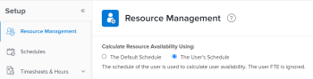

# Ressourcenplaner - Übersicht {#resource-planner-overview}

>[!CONTEXTUALHELP]
>id="wf-resourcing-planner"
>title="Ressourcenplaner"
>abstract="Mit dem Ressourcenplaner können Sie die Ressourcenzuweisung für die Projekte, denen sie zugewiesen sind, schätzen und budgetieren sowie deren Verfügbarkeit für zukünftige Arbeiten prognostizieren."

<!-- Audited: 12/2023 -->

<!--

(Alina: this used to be the beginning of Planning in the Resource Planner - consider restructuring it further? Merging some of this information with information about Understanding Navigation in the RP?!)

-->

Mit dem Ressourcenplaner können Sie die Ressourcenzuweisung für die Projekte, denen sie zugewiesen sind, schätzen und budgetieren und deren Verfügbarkeit für zukünftige Arbeiten prognostizieren.

Einen allgemeinen Überblick über die Ressourcenplanung in Adobe Workfront finden Sie im Artikel [Erste Schritte mit der Ressourcenplanung](../../resource-mgmt/resource-planning/get-started-resource-planning.md).

## Ressourcenplaner - Übersicht

Mit dem Ressourcenplaner können Sie die Verfügbarkeit von Benutzern und Aufgabengebieten sowie den geplanten Zeitaufwand für den Abschluss von Projektarbeiten einfach nachvollziehen. Sie können dann entscheiden, wie Sie Ihre Benutzer und deren Aufgabengebiete den Projekten zuweisen, denen sie zugewiesen sind, basierend auf ihrer verfügbaren Zeit.

>[!IMPORTANT]
>
>Sie können den Ressourcenplaner nicht verwenden, um Benutzern die tatsächliche Arbeit (Aufgaben und Probleme) zuzuweisen. Sie können den Zeitaufwand für die Benutzer oder Aufgabengebiete zur Durchführung eines Projekts nur schätzen, unabhängig von den ihnen zugewiesenen Aufgaben und Problemen.\
>Verwenden Sie den Workload-Balancer, um Benutzenden tatsächliche Arbeit zuzuweisen. Weitere Informationen zum Workload-Balancer finden Sie unter [Übersicht über den Workload-Balancer](../../resource-mgmt/workload-balancer/overview-workload-balancer.md).

Sie können Informationen im Ressourcenplaner mithilfe von drei separaten Ansichten anzeigen. Sie können jede Ansicht für einen der folgenden Zwecke verwenden:

* So budgetieren Sie die Zeit oder die Kosten Ihrer Ressourcen für die zu erledigende Arbeit mithilfe der Projekt- und Rollenansichten. Dies ist der Hauptzweck des Ressourcenplaners.\
  Weitere Informationen zur Budgetierung im Ressourcenplaner finden Sie im Artikel [Budgetressourcen im Ressourcenplaner mithilfe der Projekt- und Aufgabenansichten](../resource-planning/budget-resources-project-role-views-resource-planner.md).

* So zeigen Sie die folgenden Informationen in der Benutzeransicht an:

   * Verfügbarkeit der Benutzer gemäß ihrem Zeitplan
   * Der geplante Zeitaufwand für die Fertigstellung der Arbeiten gemäß dem Projektplan
   * Die Zeit, die Benutzende bereits für tatsächliche Arbeitselemente angemeldet haben

  Weitere Informationen zum Anzeigen verfügbarer, geplanter und tatsächlicher Stunden bzw. VZÄ für Benutzer im Ressourcenplaner finden Sie im Artikel [Verfügbare, geplante und tatsächliche Stunden bzw. VZÄ im Ressourcenplaner anzeigen bei Verwendung der Benutzeransicht](../../resource-mgmt/resource-planning/view-hours-fte-user-view-resource-planner.md#using).

## Überlegungen zum Ressourcenplaner

* Sie können die Projekte, an denen Sie arbeiten, nach Priorität ordnen und die Ressourcenzuweisung entsprechend ihrer Priorität budgetieren, um sicherzustellen, dass Sie die Ressourcen zuerst den wichtigsten Projekten zuweisen.

  Informationen zum Priorisieren von Projekten im Ressourcenplaner finden Sie unter [Priorisieren von Projekten im Ressourcenplaner](../../resource-mgmt/resource-planning/prioritize-projects-resource-planner.md).

* Sie können Stunden-, FTE- und Kosteninformationen aus den Aufgaben und Problemen von Projekten anzeigen.

  >[!NOTE]
  >
  >Aufgaben und Probleme werden nicht im Ressourcenplaner angezeigt. Die Stunden-, VZÄ- und Kosteninformationen aus den Ressourcenzuteilungen für die Vorgänge werden jedoch im Ressourcenplaner als Gesamtanzahl für das Projekt angezeigt.

* Die Stunden-, VZÄ- und Kosteninformationen aus übergeordneten Vorgängen werden aus den Projekten ausgeschlossen, die im Ressourcenplaner angezeigt werden. Es wird empfohlen, Ressourcen nur untergeordneten Vorgängen zuzuweisen, wenn Sie die Zeit oder Kosten dieser Ressourcen im Ressourcenplaner verwalten möchten.

  Informationen zu übergeordneten Aufgaben finden Sie in den folgenden Artikeln:

   * [Aufgaben - Übersicht](../../manage-work/tasks/task-information/tasks-overview.md)
   * [Teilaufgaben erstellen](../../manage-work/tasks/create-tasks/create-subtasks.md)

  >[!TIP]
  >
  >Übergeordnete Aufgaben zeigen eine Summe der Stunden und Kosten der untergeordneten Aufgaben an. Aus diesem Grund würden die Zählstunden, FTE und Kosten der untergeordneten Aufgaben und der übergeordneten Aufgaben diese Beträge zweimal zählen. Aus diesem Grund werden die Informationen zur übergeordneten Aufgabe aus dem Ressourcenplaner ausgeschlossen.

* Sie können die Zuweisung von Teams für die Projekte, für die sie Aufgaben oder Probleme haben, nicht im Ressourcenplaner verwalten.
* Sie können Ressourcen für mehrere Projekte gleichzeitig mit dem Ressourcenplaner budgetieren oder für ein einzelnes Projekt mithilfe des Bereichs Ressourcenbudgetierung des Business Case. Die Informationen, die Sie für ein Projekt budgetieren, werden auch im Ressourcenplaner angezeigt.

  Informationen dazu, wie Sie Ressourcen für ein einzelnes Projekt budgetieren können, finden Sie im Artikel [Budgetressourcen im Business Case](../../manage-work/projects/define-a-business-case/budget-resources-in-business-case.md).

  Informationen dazu, wie Sie Ressourcen im Ressourcenplaner für mehrere Projekte gleichzeitig budgetieren können, finden Sie im Abschnitt „Budgetressourcen im Ressourcenplaner“ im Artikel [Budgetressourcen im Ressourcenplaner mithilfe der Projekt- und Rollenansichten](../../resource-mgmt/resource-planning/budget-resources-project-role-views-resource-planner.md).

## Voraussetzungen für die Arbeit im Ressourcenplaner {#prerequisites-for-working-in-the-resource-planner}

<!--

(<b>THIS SECTION IS LINKED TO ALL RES PLANNING ARTICLES. DO NOT RENAME OF DELETE THIS!</b> - do NOT ADD the variable here, because it might break this link!)

-->

Um den Ressourcenplaner erfolgreich für die Budgetierung Ihrer Ressourcen verwenden zu können, müssen Sie zunächst sicherstellen, dass Sie, Ihre Projekte und Ihre Aufgaben eine Reihe von Voraussetzungen erfüllen. Diese Voraussetzungen sind erforderlich, um die richtigen Informationen im Ressourcenplaner anzuzeigen und Ihre Ressourcen korrekt zu verwalten.

>[!IMPORTANT]
>
>Wenn eine der folgenden Voraussetzungen fehlt, kann es sein, dass einige der Informationen über die Zuordnung oder die Verfügbarkeit der Ressourcen fehlen oder einen Nullwert aufweisen.\
>Weitere Informationen dazu, warum Felder keine Daten enthalten oder keine Werte aufweisen, erhalten Sie, wenn Sie den Mauszeiger über die Felder bewegen.

>[!NOTE]
>
>Die folgenden Voraussetzungen sind nur erforderlich, wenn Sie den Ressourcenplaner nach Projekt oder Aufgabengebiet anzeigen oder Ressourcen im Business Case eines Projekts budgetieren.

Die folgenden Arten von Voraussetzungen sind erforderlich, damit der Ressourcenplaner bei der Anzeige nach Projekt oder Rolle ordnungsgemäß funktioniert:

* [Voraussetzungen für Benutzer](#user-prerequisites)
* [Projektvoraussetzungen](#project-prerequisites)
* [Voraussetzungen für Aufgaben und Probleme](#tasks-and-issues-prerequisites)
* [Voraussetzungen auf Systemebene](#system-level-prerequisites)

### Voraussetzungen für den Benutzer {#user-prerequisites}

Stellen Sie sicher, dass die folgende Benutzereinrichtung vorhanden ist, bevor Sie mit der Verwendung des Ressourcenplaners beginnen:

* Sie haben den richtigen Zugriff auf Budgetressourcen.

  Informationen zum Zugriff auf Budgetressourcen finden Sie im Artikel [Zugriff auf Budgetressourcen in Adobe Workfront erforderlich](../../resource-mgmt/resource-planning/access-needed-to-budget-resources.md).

* Benutzer, die Aufgaben zugewiesen sind, werden zu den mit dem Projekt verknüpften Ressourcenpools hinzugefügt.

  Informationen zum Hinzufügen von Benutzern zu Ressourcenpools finden Sie unter [Zuordnen von Ressourcenpools zu Benutzern](../../resource-mgmt/resource-planning/resource-pools/associate-resource-pools-with-users.md).

  >[!NOTE]
  >
  >Wenn Benutzer nicht zu Ressourcenpools hinzugefügt werden, können die folgenden Szenarien vorliegen:
  >
  >   
  >   
  >   * Die Benutzer werden nicht im Ressourcenplaner angezeigt, obwohl sie möglicherweise Aufgaben in den Projekten zugewiesen sind.
  >   * Wenn die Aufgaben, mit denen sie verknüpft sind, über geplante Stunden verfügen, werden diese Stunden für das Projekt nicht im Ressourcenplaner angezeigt, es sei denn, der/die Benutzende ist auch mit einem Aufgabengebiet für diese Aufgaben verknüpft.
  >   * Wenn die Benutzer einem Aufgabengebiet für eine Aufgabe im Projekt zugeordnet sind, werden die geplanten Stunden im Ressourcenplaner für das Aufgabengebiet angezeigt, das Aufgabengebiet kann jedoch nicht budgetiert werden.
  >   
  >

* Benutzern, die Arbeits- und Ressourcenpools zugewiesen sind, müssen Zeitpläne und Aufgabengebiete mit ihrem Profil verknüpft sein.

  Informationen zum Verknüpfen von Zeitplänen und Aufgabengebieten mit Benutzern finden Sie unter [Bearbeiten des Benutzerprofils](../../administration-and-setup/add-users/create-and-manage-users/edit-a-users-profile.md).

  >[!NOTE]
  >
  >Benutzer, die keinem Zeitplan zugeordnet sind, sich jedoch im Ressourcenpool des Projekts befinden, können nicht im Ressourcenplaner budgetiert werden.

* Stellen Sie für genaue Informationen zu Verfügbare Stunden sicher, dass die Zeitpläne, die Ihren Benutzern zugeordnet sind, die Zeitplanausnahmen und die Ausfallzeiten aktualisiert haben.

  >[!NOTE]
  >
  >Wenn ein(e) Benutzende(r) keinem Zeitplan zugeordnet ist, wird im Ressourcenplaner standardmäßig der Standardzeitplan Ihres Workfront-Systems dem/r Benutzenden zugeordnet.

  Informationen zum Erstellen von Zeitplänen finden Sie im Artikel [Erstellen eines Zeitplans](../../administration-and-setup/set-up-workfront/configure-timesheets-schedules/create-schedules.md).

* Wenn Sie Ihre Ressourcen nach Kosten budgetieren möchten, müssen Sie Aufgabengebiete mit Kosten/Std. verknüpfen. Tarife. Die Kosten, die den Benutzern in Ihren Ressourcenpools zugewiesenen Aufgabengebieten zugeordnet sind, werden zur Berechnung der budgetierten Lohnkosten und der budgetierten Kosten des Projekts verwendet.\
  Informationen zum Verknüpfen von Aufgabengebieten mit Tarifen finden Sie im Artikel [Erstellen und Verwalten von Aufgabengebieten](../../administration-and-setup/set-up-workfront/organizational-setup/create-manage-job-roles.md).\
  Informationen zur Berechnung budgetierter Lohnkosten finden Sie im Artikel [Erläuterung budgetierter Lohnkosten und budgetierter Stunden für Projekte](../../manage-work/projects/project-finances/budgeted-labor-cost.md).\
  Informationen zur Berechnung budgetierter Kosten finden Sie im Artikel [Budgetierte Kosten berechnen](../../manage-work/projects/project-finances/budgeted-cost.md).

### Voraussetzungen für das Projekt {#project-prerequisites}

Stellen Sie sicher, dass die folgende Projekteinrichtung vorhanden ist, bevor Sie mit dem Ressourcenplaner beginnen:

* Ihre Projekte sind mit Ressourcenpools verknüpft.\
  Weitere Informationen zum Hinzufügen von Ressourcenpools zu Projekten finden Sie unter [Ressourcenpools mit Projekten und Vorlagen verknüpfen](../../resource-mgmt/resource-planning/resource-pools/associate-resource-pools-with-projects-and-templates.md).

  >[!IMPORTANT]
  >
  >Projekte ohne Ressourcenpools zeigen keine Informationen zu geplanten Stunden oder Zuordnungen im Ressourcenplaner an.

### Voraussetzungen für Aufgaben und Probleme {#tasks-and-issues-prerequisites}

Obwohl Sie keine Vorgänge und Probleme im Ressourcenplaner anzeigen können, werden deren Informationen an die Projekte übertragen, die im Ressourcenplaner angezeigt werden.

Stellen Sie sicher, dass die folgende Aufgaben- und Problemeinrichtung vorhanden ist, bevor Sie mit der Budgetierung von Ressourcen im Ressourcenplaner beginnen:

* Die Aufgaben oder Probleme in den Projekten, für die Sie Ressourcen budgetieren, sind einer der folgenden Entitäten zugewiesen:

   * Benutzer in den Ressourcenpools des Projekts, die auch mit Aufgabengebieten verknüpft sind
   * Aufgabengebiete

  >[!NOTE]
  >
  >Die geplanten Stunden für Aufgaben und Probleme, die Aufgabengebieten zugewiesen wurden, werden im Ressourcenplaner angezeigt, diese Stunden können jedoch nicht budgetiert werden, es sei denn, ein Benutzer, der mit dem Aufgabengebiet verknüpft ist, wird in einem mit dem Projekt verknüpften Ressourcenpool aufgeführt.

* Sie sollten Benutzern oder Rollen keine übergeordneten Aufgaben zuweisen.

  Um Ihre Informationen im Ressourcenplaner für Benutzer oder Rollen anzuzeigen, die mit übergeordneten Aufgaben verknüpft sind, müssen Sie sie auch den untergeordneten Aufgaben zuweisen. Der Ressourcenplaner zeigt keine Informationen aus übergeordneten Vorgängen an.

* Aufgaben und Probleme haben einen Wert für Geplante Stunden, der größer als null ist.
* Aufgaben und Probleme haben einen Wert für ihre Dauer von größer als null.
* Die geplanten Termine der Anfragen befinden sich innerhalb der Projektplanung.

### Voraussetzungen auf Systemebene {#system-level-prerequisites}

Sie müssen verstehen, wie die Benutzerverfügbarkeit in Ihrer Workfront-Instanz gemäß den Ressourcenverwaltungseinstellungen in Ihrem System berechnet wird. Workfront kann die Benutzerverfügbarkeit anhand des Zeitplans des Benutzers auf der Seite „Benutzerprofil“ oder des Standardzeitplans Ihres Systems berechnen.

Ihr Workfront-Administrator konfiguriert Ihre Voreinstellungen für die Ressourcenverwaltung.

Weitere Informationen finden Sie unter [Voreinstellungen für die Ressourcenverwaltung konfigurieren](../../administration-and-setup/set-up-workfront/configure-system-defaults/configure-resource-mgmt-preferences.md).

## Suchen des Ressourcenplaners

<!--

(This became another standalone article; drfat this section here when article is live.)

-->

Sie können den Ressourcenplaner in zwei Bereichen von Workfront platzieren, je nachdem, ob Sie Ihre Ressourcen für mehrere Projekte oder nur für ein Projekt budgetieren möchten.

Informationen zum Auffinden des Ressourcenplaners finden Sie unter [Finden des Ressourcenplaners](../../resource-mgmt/resource-planning/locate-resource-planner.md).

<!--

(this is drafted and moved to its own article: locate-resource-planner) 

Ensure that all prerequisites are met before starting to use the Resource Planner. This way, you ensure that the Resource Planner displays the correct information before you start budgeting your resources. For information about the prerequisites that must be met before you can start using the Resource Planner, see the <a href="#prerequisites-for-working-in-the-resource-planner" class="MCXref xref">Prerequisites for working in the Resource Planner</a> section in this article. 

You can locate the Resource Planner in two areas of Workfront, depending on whether you want to budget your resources for multiple projects, or for just one project.

<ul>
<li><a href="#use-the-resource-planner-for-multiple-projects" class="MCXref xref">Use the Resource Planner for multiple projects</a> </li>
<li> 
<a href="#use-the-resource-planner-for-one-project" class="MCXref xref">Use the Resource Planner for one project</a> 
 </li>
</ul>

<strong>Use the Resource Planner for multiple projects</strong>

When using the Resource Planner for multiple projects, the allocation numbers for your resources represent numbers across multiple projects. 

To access the  Planner section  in the  Resourcing area: 

<ol>
<li value="1">  Click the <strong>Main Menu</strong> icon  in the upper-right corner of Adobe Workfront.  </li>
<li value="2"> 
  Click <strong>Resourcing</strong>. The Resource Planner displays by default.  For information about budgeting resources in the Resource Planner, see the article <a href="../../resource-mgmt/resource-planning/budget-resources-project-role-views-resource-planner.md" class="MCXref xref">Budget resources in the Resource Planner using the Project and Role views</a>. 
 
  
 </li>
<li value="3">  Hover over the left panel, and click <strong>Resource Pools</strong>.  For information about creating new resource pools, see <a href="../../resource-mgmt/resource-planning/resource-pools/create-resource-pools.md" class="MCXref xref">Create resource pools</a>.</li>
</ol>

<strong>Use the Resource Planner for one project</strong>

When using the Resource Planner for one project, the allocation numbers for your resources represent numbers for the selected project. 

<ol>
<li value="1"> 
Go to a project you want to budget resources for.
 </li>
<li value="2"> 
Click <strong>Business Case</strong> in the left panel.
 </li>
<li value="3"> 
Scroll to the <strong>Resource Budgeting</strong> section of the Business Case.
 </li>
<li value="4"> 
Click <strong>Edit Resource Budgeting</strong> to add resource pools to your project and start budgeting your resources. 
 <note type="tip">
You can only add a resource pool in the Resource Budgeting area of the Business Case when the project has no resource pools associated with it. When the project already has a resource pool, the users in the pool and their job roles display in the Resource Budgeting area by default.
</note> 
  
 
For information about budgeting resources for one project, see the article <a href="../../manage-work/projects/define-a-business-case/budget-resources-in-business-case.md" class="MCXref xref">Budget resources in the Business Case</a>.
 </li>
</ol>

-->

## Die Bereiche des Ressourcenplaners

Sie können die folgenden Informationen anzeigen oder die folgenden Aktionen im Ressourcenplaner ausführen:

* Informationen zu den Ressourcen, die Ihren Projekten im Ressourcenplaner zugewiesen sind, in einer allgemeinen Zeitleiste.
* Überallokation oder Unterauslastung Ihrer Ressourcen im Ressourcenplaner.
* Budgetieren Sie Ihre Ressourcen für Ihre Arbeit manuell oder automatisch.

Weitere Informationen dazu, welche Bereiche im Ressourcenplaner angezeigt werden und wie Sie konfigurieren können, welche Informationen in diesen Bereichen angezeigt werden, finden Sie im Artikel [Übersicht über die Ressourcenplaner-Navigation](../../resource-mgmt/resource-planning/resource-planner-navigation.md).

## Einschränkungen bei der Anzeige von Informationen im Ressourcenplaner

Um die Leistung zu verbessern, beschränkt Workfront die Anzahl der Elemente, die Sie im Ressourcenplaner anzeigen können.

Weitere Informationen zu diesen Einschränkungen finden Sie im Artikel [Anzeigebeschränkungen für den Ressourcenplaner](../../resource-mgmt/resource-planning/resource-planner-display-limitations.md) .

## FTE im Ressourcenplaner berechnen

Sie können Verfügbarkeits-, Zuordnungs- und geplante Werte im Ressourcenplaner in Stunden, FTE oder Kosten anzeigen.

Weitere Informationen zum Ändern der im Ressourcenplaner angezeigten Informationen finden Sie im Abschnitt [Informationen nach Stunde, FTE oder Kosten anzeigen](../../resource-mgmt/resource-planning/resource-availability-allocation-resource-planner.md#display-by-hour-or-fte-menu) im Artikel [Ressourcenverfügbarkeit und -zuordnung mit dem Adobe Workfront-Ressourcenplaner ](../../resource-mgmt/resource-planning/resource-availability-allocation-resource-planner.md).

Weitere Informationen dazu, wie die Stunden und VZÄ für Benutzende und Rollen in Workfront berechnet werden, finden Sie im Artikel [Übersicht über die Stundenberechnung und VZÄ für Benutzende und Rollen im Ressourcenplaner](../../resource-mgmt/resource-planning/calculate-hours-fte-for-users-roles-resource-planner.md).

## Kosten im Ressourcenplaner berechnen

Sie müssen über Anzeigezugriff auf Finanzdaten und Anzeigefinanzberechtigungen für die Projekte verfügen, um die Informationen nach Kosten im Ressourcenplaner anzeigen zu können.

Neben der Anzeige der Verfügbarkeit, Zuordnung und der geplanten Werte im Ressourcenplaner in Stunden und FTE können Sie diese auch nach Kosten anzeigen.

>[!TIP]
>
>Um Informationen nach Kosten im Ressourcenplaner anzeigen zu können, müssen Sie Ihre Benutzer und Aufgabengebiete mit den Kosten pro Stunde verknüpfen.

Weitere Informationen zur Zuordnung der Stundensätze für Kosten pro Stunde zu Aufgabengebieten finden Sie im Artikel [Erstellen und Verwalten von Aufgabengebieten](../../administration-and-setup/set-up-workfront/organizational-setup/create-manage-job-roles.md).\
Weitere Informationen zur Zuordnung von Stundensätzen zu Benutzenden finden Sie im Artikel [Bearbeiten des Benutzerprofils](../../administration-and-setup/add-users/create-and-manage-users/edit-a-users-profile.md).

Beachten Sie beim Anzeigen von Informationen nach Kosten im Ressourcenplaner Folgendes:

* Die Kosten jedes Stundentyps (geplant, verfügbar, budgetiert, tatsächlich für Benutzer, Funktionen oder die Projekte) werden mit einem anderen Kostensatz berechnet.
* Die geplanten Kosten werden von der Kostenart der Aufgaben in den Projekten beeinflusst.
* Wenn Sie die Benutzeransicht auf den Ressourcenplaner anwenden, können Sie die Zuordnungs- und Verfügbarkeitsinformationen nicht nach Kosten anzeigen.

Weitere Informationen zur Kostenberechnung im Ressourcenplaner für Benutzer und Rollen finden Sie im Artikel [Kosten im Ressourcenplaner berechnen](../../resource-mgmt/resource-planning/calculate-costs-resource-planner.md).

<!--

<h2>Use the User View to view Available, Planned, and Actual Hours or FTE </h2>

(this information is repeated from above where it exists in shorter form. Drafted to simplify the amount of info of this article.) 

You can use the User View of the Resource Planner to display information about the Planned, Available, and Actual Hours or FTE values for projects and resources. 

For information about using the Resource Planner to review the Available, Planned, and Actual Hours and FTE for resources, see the article <a href="../../resource-mgmt/resource-planning/view-hours-fte-user-view-resource-planner.md" class="MCXref xref">View Available, Planned, and Actual Hours or FTE in the Resource Planner when using the User view</a>.

<strong>Use the Project and Role Views to budget resources </strong>

 The main function of the Resource Planner is to budget your resources for the work that needs to be completed on the projects that you can manage. 

 You can budget your resources only if you apply the <strong>View by Project</strong> or <strong>View by Role</strong> views to the Resource Planner.

For information about budgeting resources using the Project and Role views in the Resource Planner, see the article <a href="../../resource-mgmt/resource-planning/budget-resources-project-role-views-resource-planner.md"><a href="../../resource-mgmt/resource-planning/budget-resources-project-role-views-resource-planner.md" class="MCXref xref">Budget resources in the Resource Planner using the Project and Role views</a></a>.

-->

## Filtern von Informationen im Ressourcenplaner

Sie können die Anzahl der Projekte, Rollen oder Benutzer, die im Ressourcenplaner angezeigt werden, reduzieren, indem Sie einen Filter erstellen.\
Weitere Informationen finden Sie im Artikel [Filtern von Informationen im Ressourcenplaner](../../resource-mgmt/resource-planning/filter-resource-planner.md).
