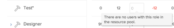

# Übersicht über den Ressourcenplaner

<!--

(Alina: this used to be the beginning of Planning in the Resource Planner - consider restructuring it further? Merging some of this information with information about Understanding Navigation in the RP?!)

-->

Sie können die Zuweisung Ihrer Ressourcen zu den Projekten, denen sie zugewiesen sind, schätzen und deren Verfügbarkeit für zukünftige Arbeiten vorhersagen, indem Sie den Ressourcenplaner verwenden.

Eine allgemeine Übersicht über die Ressourcenplanung in Adobe Workfront finden Sie im Artikel [Erste Schritte mit der Ressourcenplanung](../../resource-mgmt/resource-planning/get-started-resource-planning.md).

## Übersicht über den Ressourcenplaner

Sie können den Ressourcen-Planer verwenden, um die Verfügbarkeit von Benutzern und Arbeitsplatzrollen sowie die geplante Zeit, die zum Abschluss der Arbeit an Projekten erforderlich ist, einfach zu verstehen. Anschließend können Sie entscheiden, wie Sie Ihre Benutzer und ihre Rollen den Projekten zuweisen, denen sie zugewiesen sind, basierend auf ihrer verfügbaren Zeit.

>[!IMPORTANT]
>
>Sie können den Ressourcen-Planer nicht verwenden, um Benutzern tatsächliche Arbeit (Aufgaben und Probleme) zuzuweisen. Sie können nur schätzen, wie viel Zeit die Benutzer oder Aufgabenrollen zum Abschluss eines Projekts benötigen, unabhängig von den Aufgaben und Problemen, denen sie zugewiesen sind.\
>Um Benutzern tatsächliche Arbeit zuzuweisen, müssen Sie den Lastenausgleich verwenden. Weitere Informationen zum Arbeitslastausgleich finden Sie unter [Übersicht über den Lastenausgleich](../../resource-mgmt/workload-balancer/overview-workload-balancer.md).

Sie können Informationen im Ressourcenplaner in drei separaten Ansichten anzeigen. Sie können jede Ansicht verwenden, um einen der folgenden Zwecke zu erfüllen:

* Um die Zeit oder Kosten Ihrer Ressourcen für die Arbeit zu planen, die mithilfe der Projekt- und Rollenansichten erreicht werden muss. Dies ist der Hauptzweck des Ressourcenplaners.\
   Weitere Informationen zum Budgeting im Ressourcen-Planer finden Sie im Artikel [Budgetressourcen im Ressourcenplaner mithilfe der Projekt- und Rollenansicht](../resource-planning/budget-resources-project-role-views-resource-planner.md).

* So zeigen Sie die folgenden Informationen mithilfe der Benutzeransicht an:

   * die Verfügbarkeit Ihrer Benutzer entsprechend ihrem Zeitplan
   * den geplanten Zeitaufwand für den Abschluss der Arbeiten gemäß dem Projektplan.
   * die Zeit, die Benutzer bereits bei den eigentlichen Arbeitselementen angemeldet haben.

   Weitere Informationen zum Anzeigen der Verfügbaren, geplanten und tatsächlichen Stunden oder der FTE für Benutzer im Resource Planer finden Sie im Artikel [Anzeigen der verfügbaren, geplanten und tatsächlichen Stunden oder der FTE im Ressourcenplaner bei Verwendung der Benutzeransicht](../../resource-mgmt/resource-planning/view-hours-fte-user-view-resource-planner.md#using).

## Überlegungen zum Ressourcenplaner

* Sie können die Projekte, an denen Sie arbeiten, priorisieren und Ihre Ressourcenzuweisung entsprechend ihrer Priorität planen, um sicherzustellen, dass Sie zunächst über Ressourcen für die wichtigsten Projekte verfügen.

   Informationen zur Priorisierung von Projekten im Ressourcenplaner finden Sie unter [Priorisieren von Projekten im Ressourcenplaner](../../resource-mgmt/resource-planning/prioritize-projects-resource-planner.md).

* Sie können Stunden-, FTE- und Kosteninformationen aus den Aufgaben und Ausgaben von Projekten anzeigen.

   >[!NOTE]
   >
   >Aufgaben und Probleme werden nicht im Ressourcenplaner angezeigt. Die Stunden-, FTE- und Kosteninformationen aus den Ressourcenzuweisungen für die Aufgaben werden im Ressourcenplaner jedoch als Gesamtanzahl für das Projekt angezeigt.

* Die Stunden-, FTE- und Kosteninformationen von übergeordneten Aufgaben werden aus den Projekten ausgeschlossen, die im Ressourcenplaner angezeigt werden. Es wird empfohlen, Ressourcen nur untergeordneten Aufgaben zuzuweisen, wenn Sie die Zeit oder Kosten dieser Ressourcen im Ressourcenplaner verwalten möchten.

   Weitere Informationen zu übergeordneten Aufgaben finden Sie in den folgenden Artikeln:

   * [Aufgabenübersicht](../../manage-work/tasks/task-information/tasks-overview.md)
   * [Erstellen von Unteraufgaben](../../manage-work/tasks/create-tasks/create-subtasks.md)

   >[!TIP]
   >
   >Die übergeordneten Aufgaben zeigen die Gesamtstunden und -kosten der untergeordneten Aufgaben an. Daher würden die Zählung von Stunden, VZÄ und Kosten der untergeordneten Aufgaben und der übergeordneten Aufgaben diese Beträge doppelt zählen. Aus diesem Grund werden die Informationen der übergeordneten Aufgabe aus dem Ressourcenplaner ausgeschlossen.

* Sie können die Zuweisung von Teams nicht für die Projekte verwalten, für die sie Aufgaben oder Probleme im Ressourcenplaner haben.
* Sie können Ressourcen für mehrere Projekte gleichzeitig mit dem Resource Planer oder für ein einzelnes Projekt im Bereich Resource Budgeting des Business Case einsetzen. Die Informationen, die Sie für ein Projekt planen, werden auch im Ressourcenplaner angezeigt.

   Informationen dazu, wie Sie Ressourcen für ein einzelnes Projekt einsetzen können, finden Sie im Artikel [Haushaltsmittel im Geschäftsfall](../../manage-work/projects/define-a-business-case/budget-resources-in-business-case.md).

   Informationen dazu, wie Sie Ressourcen im Ressourcenplaner für mehrere Projekte gleichzeitig einsetzen können, finden Sie im Artikel unter &quot;Budgetressourcen im Ressourcenplaner&quot;im Abschnitt [Budgetressourcen im Ressourcenplaner mithilfe der Projekt- und Rollenansicht](../../resource-mgmt/resource-planning/budget-resources-project-role-views-resource-planner.md).

## Voraussetzungen für die Arbeit im Ressourcenplaner {#prerequisites-for-working-in-the-resource-planner}

<!--

(<b>THIS SECTION IS LINKED TO ALL RES PLANNING ARTICLES. DO NOT RENAME OF DELETE THIS!</b> - do NOT ADD the variable here, because it might break this link!)

-->

Um den Ressourcen-Planer erfolgreich für das Budget Ihrer Ressourcen zu verwenden, müssen Sie zunächst sicherstellen, dass Sie, Ihre Projekte und Ihre Aufgaben eine Reihe von Voraussetzungen erfüllen. Diese Voraussetzungen müssen erfüllt sein, um die richtigen Informationen im Ressourcenplaner anzuzeigen und Ihre Ressourcen korrekt zu verwalten.

>[!IMPORTANT]
>
>Wenn eine der folgenden Voraussetzungen fehlt, können Sie feststellen, dass einige der Informationen über die Zuordnung oder Verfügbarkeit der Ressourcen fehlen oder einen Nullwert aufweisen.\
>Wenn Sie weitere Informationen dazu benötigen, warum in Feldern Daten fehlen oder Nullwerte vorhanden sind, halten Sie den Mauszeiger über die Felder.

>[!NOTE]
>
>Die folgenden Voraussetzungen sind nur erforderlich, wenn Sie den Ressourcenplaner nach Projekt oder Rolle des Auftrags anzeigen oder wenn Sie Ressourcen im Geschäftsfall eines Projekts mit Budgets versehen.

Die folgenden Arten von Voraussetzungen sind erforderlich, damit der Ressourcen-Planer bei der Anzeige nach Projekt oder Rolle die richtigen Funktionen bietet:

* [Benutzervoraussetzungen](#user-prerequisites)
* [Projektvoraussetzungen](#project-prerequisites)
* [Voraussetzungen für Aufgaben und Probleme](#tasks-and-issues-prerequisites)
* [Voraussetzungen auf Systemebene](#system-level-prerequisites)

### Benutzervoraussetzungen {#user-prerequisites}

Stellen Sie sicher, dass die folgende Benutzereinrichtung vorhanden ist, bevor Sie mit der Verwendung des Ressourcen-Planers beginnen:

* Sie haben den richtigen Zugriff auf Budgetressourcen.

   Informationen zum benötigten Zugriff auf Budgetressourcen finden Sie im Artikel [Erforderlicher Zugriff auf Budgetressourcen in Adobe Workfront](../../resource-mgmt/resource-planning/access-needed-to-budget-resources.md).

* Benutzer, die Aufgaben zugewiesen sind, werden zu den Ressourcenpools hinzugefügt, die mit dem Projekt verknüpft sind.

   Informationen zum Hinzufügen von Benutzern zu Ressourcen-Pools finden Sie unter [Verknüpfen von Ressourcen-Pools mit Benutzern](../../resource-mgmt/resource-planning/resource-pools/associate-resource-pools-with-users.md).

   >[!NOTE]
   >
   >Wenn Benutzer nicht zu Ressourcen-Pools hinzugefügt werden, gibt es die folgenden Szenarien:
   >
   >   
   >   
   >   * Die Benutzer werden nicht im Ressourcenplaner angezeigt, obwohl sie möglicherweise Aufgaben in den Projekten zugewiesen sind.
   >   * Wenn die Aufgaben, mit denen sie verknüpft sind, geplante Stunden haben, werden diese Stunden für das Projekt im Ressourcenplaner nicht angezeigt, es sei denn, der Benutzer ist auch mit einer Auftrags-Rolle für diese Aufgaben verknüpft.
   >   * Wenn die Benutzer einer Aufgabe in dem Projekt eine Rolle als Job zugewiesen haben, werden die geplanten Stunden im Ressourcenplaner für die Rolle &quot;Job&quot;angezeigt, die Rolle &quot;Job&quot;kann jedoch nicht in den Haushaltsplan aufgenommen werden.

* Benutzern, die Arbeits- und Ressourcenpools zugewiesen sind, müssen Zeitpläne und Vorgangsrollen mit ihrem Profil zugeordnet sein.

   Informationen zum Verknüpfen von Zeitplänen und Auftragsrollen mit Benutzern finden Sie unter [Benutzerprofil bearbeiten](../../administration-and-setup/add-users/create-and-manage-users/edit-a-users-profile.md).

   >[!NOTE]
   >
   >Benutzer, die nicht mit einem Zeitplan verknüpft sind, sich aber im Ressourcenpool des Projekts befinden, können nicht im Ressourcenplaner eingebunden werden.

* Stellen Sie für genaue Informationen zu den verfügbaren Stunden sicher, dass die mit Ihren Benutzern verknüpften Zeitpläne über die zeitgesteuerten Ausnahmen und die aktualisierte Zeitdauer verfügen.

   >[!NOTE]
   >
   >Wenn ein Benutzer keinem Zeitplan zugeordnet ist, wird der Standardzeitplan Ihres Workfront-Systems standardmäßig dem Benutzer zum Zwecke des Ressourcenplaners zugeordnet.

   Informationen zum Erstellen von Zeitplänen finden Sie im Artikel [Zeitplan erstellen](../../administration-and-setup/set-up-workfront/configure-timesheets-schedules/create-schedules.md).

* Wenn Sie Ihre Ressourcen nach Kosten aufschlüsseln möchten, müssen Sie &quot;Auftragsrollen&quot;Kosten/Stunde zuordnen. -Tarife. Die Kosten, die mit den Benutzerrollen in Ihren Ressourcenpools verbunden sind, werden zur Berechnung der budgetierten Arbeitskosten und der Budgetierten Kosten des Projekts verwendet.\
   Informationen zum Verknüpfen von Auftrags-Rollen mit Raten finden Sie im Artikel [Erstellen und Verwalten von Vorgangsrollen](../../administration-and-setup/set-up-workfront/organizational-setup/create-manage-job-roles.md).\
   Informationen zur Berechnung der budgetierten Arbeitskosten finden Sie in diesem Artikel [Budgetierte Arbeitskosten und budgetierte Stunden für Projekte](../../manage-work/projects/project-finances/budgeted-labor-cost.md).\
   Weitere Informationen zur Berechnung von budgetierten Kosten finden Sie im Artikel [Berechnete veranschlagte Kosten](../../manage-work/projects/project-finances/budgeted-cost.md).

### Projektvoraussetzungen {#project-prerequisites}

Stellen Sie sicher, dass das folgende Projekt eingerichtet ist, bevor Sie mit der Verwendung des Ressourcen-Planers beginnen:

* Ihre Projekte sind mit Ressourcen-Pools verknüpft.\
   Weitere Informationen zum Hinzufügen von Ressourcen-Pools zu Projekten finden Sie unter [Verknüpfen von Ressourcen-Pools mit Projekten und Vorlagen](../../resource-mgmt/resource-planning/resource-pools/associate-resource-pools-with-projects-and-templates.md).

   >[!IMPORTANT]
   >
   >Projekte ohne Ressourcen-Pools zeigen keine Informationen zu &quot;Geplante Stunde&quot;oder &quot;Zuweisungen&quot;im Ressourcenplaner an.

### Voraussetzungen für Aufgaben und Probleme {#tasks-and-issues-prerequisites}

Sie können zwar keine Aufgaben und Probleme im Ressourcenplaner anzeigen, jedoch werden deren Informationen an die Projekte übermittelt, die im Ressourcenplaner angezeigt werden.

Stellen Sie sicher, dass die folgende Aufgabe und das Einrichten von Problemen vorhanden sind, bevor Sie mit der Budgetierung von Ressourcen im Ressourcenplaner beginnen:

* Die Aufgaben oder Probleme im Zusammenhang mit den Projekten, für die Sie Haushaltsmittel einsetzen, werden einer dieser Einrichtungen zugewiesen:

   * Benutzer in den Ressourcen-Pools des Projekts, die auch mit Auftragsrollen verknüpft sind
   * Aufgabengebiete

   >[!NOTE]
   >
   >Die geplanten Stunden von Aufgaben und Problemen, die Auftragsrollen zugewiesen sind, werden im Ressourcen-Planer angezeigt. Diese Stunden können jedoch nicht in den Haushaltsplan aufgenommen werden, es sei denn, ein Benutzer, der mit der Auftragsrolle verknüpft ist, wird in einem Ressourcenpool aufgelistet, der mit dem Projekt verknüpft ist.

* Sie sollten Benutzern oder Rollen keine übergeordneten Aufgaben zuweisen.

   Um Stundeninformationen im Ressourcenplaner für Benutzer oder Rollen anzuzeigen, die übergeordneten Aufgaben zugeordnet sind, müssen Sie sie auch den untergeordneten Aufgaben zuweisen. Der Ressourcen-Planer zeigt keine Informationen aus übergeordneten Aufgaben an.

* Aufgaben und Probleme haben einen Wert für &quot;Geplante Stunden&quot;, der größer als null ist.
* Aufgaben und Probleme haben einen Wert für ihre Dauer, der größer als null ist.
* Die geplanten Daten der Probleme entsprechen dem Zeitrahmen des Projekts.

### Voraussetzungen auf Systemebene {#system-level-prerequisites}

Sie müssen verstehen, wie Ihre Workfront-Instanz die Benutzerverfügbarkeit gemäß den Voreinstellungen für die Ressourcenverwaltung in Ihrem System berechnet. Workfront kann die Benutzerverfügbarkeit mithilfe des Benutzerzeitplans (wie auf der Benutzerprofilseite definiert) oder des Standardzeitplans Ihres Systems berechnen.

Ihr Workfront-Administrator konfiguriert Ihre Voreinstellungen für die Ressourcenverwaltung.

Weitere Informationen finden Sie unter [Voreinstellungen für die Ressourcenverwaltung konfigurieren](../../administration-and-setup/set-up-workfront/configure-system-defaults/configure-resource-mgmt-preferences.md).

## Suchen Sie den Ressourcen-Planer .

<!--

(This became another standalone article; drfat this section here when article is live.)

-->

Sie können den Ressourcenplaner in zwei Bereichen von Workfront finden, je nachdem, ob Sie Ihre Ressourcen für mehrere Projekte oder nur für ein Projekt einsetzen möchten.

Informationen zum Auffinden des Ressourcen-Planers finden Sie unter [Suchen Sie den Ressourcen-Planer .](../../resource-mgmt/resource-planning/locate-resource-planner.md).

<!--

(this is drafted and moved to its own article: locate-resource-planner) 

Ensure that all prerequisites are met before starting to use the Resource Planner. This way, you ensure that the Resource Planner displays the correct information before you start budgeting your resources. For information about the prerequisites that must be met before you can start using the Resource Planner, see the <a href="#prerequisites-for-working-in-the-resource-planner" class="MCXref xref">Prerequisites for working in the Resource Planner</a> section in this article. 

You can locate the Resource Planner in two areas of Workfront, depending on whether you want to budget your resources for multiple projects, or for just one project.

<ul>
<li><a href="#use-the-resource-planner-for-multiple-projects" class="MCXref xref">Use the Resource Planner for multiple projects</a> </li>
<li> 
<a href="#use-the-resource-planner-for-one-project" class="MCXref xref">Use the Resource Planner for one project</a> 
 </li>
</ul>

<strong>Use the Resource Planner for multiple projects</strong>

When using the Resource Planner for multiple projects, the allocation numbers for your resources represent numbers across multiple projects. 

To access the  Planner section  in the  Resourcing area: 

<ol>
<li value="1">  Click the <strong>Main Menu</strong> icon  in the upper-right corner of Adobe Workfront.  </li>
<li value="2"> 
  Click <strong>Resourcing</strong>. The Resource Planner displays by default.  For information about budgeting resources in the Resource Planner, see the article <a href="../../resource-mgmt/resource-planning/budget-resources-project-role-views-resource-planner.md" class="MCXref xref">Budget resources in the Resource Planner using the Project and Role views</a>. 
 
  
 </li>
<li value="3">  Hover over the left panel, and click <strong>Resource Pools</strong>.  For information about creating new resource pools, see <a href="../../resource-mgmt/resource-planning/resource-pools/create-resource-pools.md" class="MCXref xref">Create resource pools</a>.</li>
</ol>

<strong>Use the Resource Planner for one project</strong>

When using the Resource Planner for one project, the allocation numbers for your resources represent numbers for the selected project. 

<ol>
<li value="1"> 
Go to a project you want to budget resources for.
 </li>
<li value="2"> 
Click <strong>Business Case</strong> in the left panel.
 </li>
<li value="3"> 
Scroll to the <strong>Resource Budgeting</strong> section of the Business Case.
 </li>
<li value="4"> 
Click <strong>Edit Resource Budgeting</strong> to add resource pools to your project and start budgeting your resources. 
 <note type="tip">
You can only add a resource pool in the Resource Budgeting area of the Business Case when the project has no resource pools associated with it. When the project already has a resource pool, the users in the pool and their job roles display in the Resource Budgeting area by default.
</note> 
  
 
For information about budgeting resources for one project, see the article <a href="../../manage-work/projects/define-a-business-case/budget-resources-in-business-case.md" class="MCXref xref">Budget resources in the Business Case</a>.
 </li>
</ol>

-->

## Die Bereiche des Ressourcen-Planers

Sie können die folgenden Informationen anzeigen oder die folgenden Aktionen im Ressourcenplaner ausführen:

* Informationen über die Ressourcen, die Ihren Projekten im Ressourcenplaner in einer allgemeinen Zeitleiste zugewiesen sind.
* Überzuweisung oder Unterauslastung Ihrer Ressourcen im Ressourcenplaner.
* Budgets für Ihre Ressourcen für die Arbeit manuell oder automatisch.

Weitere Informationen dazu, welche Bereiche im Ressourcenplaner angezeigt werden und wie Sie konfigurieren, welche Informationen in diesen Bereichen angezeigt werden, finden Sie im Artikel [Navigationsübersicht über den Ressourcenplaner](../../resource-mgmt/resource-planning/resource-planner-navigation.md).

## Einschränkungen bei der Anzeige von Informationen im Ressourcenplaner

Um die Leistung zu verbessern, beschränkt Workfront die Anzahl der Elemente, die Sie im Ressourcenplaner anzeigen können.

Weitere Informationen zu diesen Einschränkungen finden Sie im Artikel [Anzeigebeschränkungen für den Ressourcenplaner](../../resource-mgmt/resource-planning/resource-planner-display-limitations.md) .

## FTE im Ressourcenplaner berechnen

Sie können Verfügbarkeits-, Zuordnungs- und geplante Werte im Ressourcenplaner in Stunden, FTE oder Kosten anzeigen.

Weitere Informationen zum Ändern der im Ressourcenplaner angezeigten Informationen finden Sie im Abschnitt [Anzeigen von Informationen nach Stunde, FTE oder Kosten](../../resource-mgmt/resource-planning/resource-availability-allocation-resource-planner.md#display-by-hour-or-fte-menu) im Artikel [Überprüfen der Ressourcenverfügbarkeit und -zuordnung mithilfe des Adobe Workfront Resource Planner](../../resource-mgmt/resource-planning/resource-availability-allocation-resource-planner.md).

Weitere Informationen dazu, wie die Stunden und die FTE für Benutzer und Rollen in Workfront berechnet werden, finden Sie im Artikel [Übersicht über die Berechnung der Stunden und der FTE für Benutzer und Rollen im Resource Planer](../../resource-mgmt/resource-planning/calculate-hours-fte-for-users-roles-resource-planner.md).

## Berechnen der Kosten im Ressourcenplaner

Sie müssen Zugriff auf Finanzdaten anzeigen und Finanzberechtigungen für die Projekte anzeigen können, um die Informationen nach Kosten im Ressourcenplaner anzuzeigen.

Neben der Anzeige von Verfügbarkeit, Zuordnung und geplanten Werten im Ressourcenplaner in Stunden und FTE können Sie sie auch nach Kosten anzeigen.

>[!TIP]
>
>Sie müssen Ihre Benutzer und Ihre Jobrollen mit den Kosten pro Stunde-Raten verknüpfen, um Informationen nach Kosten im Ressourcen-Planer anzuzeigen.

Weitere Informationen zum Verknüpfen von Kosten pro Stunde-Raten mit Stellenrollen finden Sie im Artikel [Erstellen und Verwalten von Vorgangsrollen](../../administration-and-setup/set-up-workfront/organizational-setup/create-manage-job-roles.md).\
Weitere Informationen zum Verknüpfen von Kosten pro Stunde mit Benutzern finden Sie im Artikel [Benutzerprofil bearbeiten](../../administration-and-setup/add-users/create-and-manage-users/edit-a-users-profile.md).

Beachten Sie beim Anzeigen von Informationen nach Kosten im Ressourcenplaner Folgendes:

* Die Kosten für jeden Stundentyp (Geplant, Verfügbar, Geplant, Aktuell für Benutzer, Rollen oder Projekte) werden anhand einer anderen Kostenstelle berechnet.
* Die geplanten Kosten werden durch den Kostentyp der Projektaufgaben beeinflusst.
* Wenn Sie die Benutzeransicht auf den Ressourcenplaner anwenden, können Sie die Zuordnungs- und Verfügbarkeitsinformationen nicht nach Kosten anzeigen.

Weitere Informationen zur Berechnung der Kosten im Ressourcenplaner für Benutzer und Rollen finden Sie im Artikel [Kosten im Ressourcenplaner berechnen](../../resource-mgmt/resource-planning/calculate-costs-resource-planner.md).

<!--

<h2>Use the User View to view Available, Planned, and Actual Hours or FTE </h2>

(this information is repeated from above where it exists in shorter form. Drafted to simplify the amount of info of this article.) 

You can use the User View of the Resource Planner to display information about the Planned, Available, and Actual Hours or FTE values for projects and resources. 

For information about using the Resource Planner to review the Available, Planned, and Actual Hours and FTE for resources, see the article <a href="../../resource-mgmt/resource-planning/view-hours-fte-user-view-resource-planner.md" class="MCXref xref">View Available, Planned, and Actual Hours or FTE in the Resource Planner when using the User view</a>.

<strong>Use the Project and Role Views to budget resources </strong>

 The main function of the Resource Planner is to budget your resources for the work that needs to be completed on the projects that you can manage. 

 You can budget your resources only if you apply the <strong>View by Project</strong> or <strong>View by Role</strong> views to the Resource Planner.

For information about budgeting resources using the Project and Role views in the Resource Planner, see the article <a href="../../resource-mgmt/resource-planning/budget-resources-project-role-views-resource-planner.md"><a href="../../resource-mgmt/resource-planning/budget-resources-project-role-views-resource-planner.md" class="MCXref xref">Budget resources in the Resource Planner using the Project and Role views</a></a>.

-->

## Filtern von Informationen im Ressourcenplaner

Sie können die Anzahl der im Ressourcenplaner angezeigten Projekte, Rollen oder Benutzer verringern, indem Sie einen Filter erstellen.\
Weitere Informationen finden Sie im Artikel [Filtern von Informationen im Ressourcenplaner](../../resource-mgmt/resource-planning/filter-resource-planner.md).
