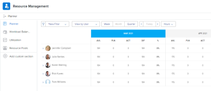

# Suchen des Ressourcenplaners

<!--

(This came off this article: draft that content in the article when this comes live: /Content/Resource Mgmt/Resource Planning/get-started-resource-planner.html)

-->

Sie können den Ressourcenplaner verwenden, um die Zuordnung Ihrer Ressourcen zu Projekten zu verwalten. Sie können über den Business Case des Projekts auf den Ressourcenplaner für mehrere Projekte gleichzeitig oder für ein Projekt zugreifen.

## Zugriffsanforderungen

+++ Erweitern Sie , um die Zugriffsanforderungen für die -Funktion in diesem Artikel anzuzeigen.

<table style="table-layout:auto"> 
 <col> 
 <col> 
 <tbody> 
  <tr> 
   <td>Adobe Workfront-Paket</td> 
   <td>
Beliebig
</td>
  </tr> 
  <tr> 
   <td>Adobe Workfront-Lizenz</td> 
   <td>
Leicht oder höher für ein Projekt; Standard für mehrere Projekte

       
Überprüfung oder höher für ein Projekt; Planen mehrerer Projekte
</td>
  </tr> 
  <tr> 
   <td>Konfigurationen der Zugriffsebene</td> 
   <td> 
Anzeigen des Zugriffs auf das Ressourcenmanagement oder höher
 </td> 
  </tr> 
  <tr> 
   <td>Objektberechtigungen</td> 
   <td> 
Anzeigen von Berechtigungen für Projekte und Benutzer 
 </td> 
  </tr> 
 </tbody> 
</table>

Weitere Informationen finden Sie unter [Zugriffsanforderungen in der Dokumentation zu Workfront](/help/quicksilver/administration-and-setup/add-users/access-levels-and-object-permissions/access-level-requirements-in-documentation.md).

+++

## Voraussetzungen

Stellen Sie sicher, dass alle Voraussetzungen für den Zugriff auf und die Arbeit mit dem Ressourcenplaner erfüllt sind, bevor Sie ihn verwenden. Auf diese Weise stellen Sie sicher, dass der Ressourcenplaner die richtigen Informationen anzeigt, bevor Sie mit der Budgetierung Ihrer Ressourcen beginnen.

Informationen zu den Voraussetzungen für den Ressourcenplaner finden Sie unter [Erste Schritte mit der Ressourcenplanung](../../resource-mgmt/resource-planning/get-started-resource-planning.md).

## Suchen des Ressourcenplaners

Sie können den Ressourcenplaner in zwei Bereichen von Workfront platzieren, je nachdem, ob Sie Ihre Ressourcen für mehrere Projekte oder nur für ein Projekt budgetieren möchten.

* [Verwenden Sie den Ressourcenplaner für mehrere Projekte](#use-the-resource-planner-for-multiple-projects)
* [Verwenden des Ressourcenplaners für ein Projekt](#use-the-resource-planner-for-one-project)

### Verwenden des Ressourcenplaners für mehrere Projekte {#use-the-resource-planner-for-multiple-projects}

Wenn Sie den Ressourcenplaner für mehrere Projekte verwenden, stellen die Zuordnungsnummern für Ihre Ressourcen Zahlen über mehrere Projekte hinweg dar.

So greifen Sie auf den Bereich „Planer“ im Bereich „Ressourcen“ zu:

{{step1-to-resourcing}}

Der Planer wird standardmäßig angezeigt.  Informationen zur Budgetierung von Ressourcen im Ressourcenplaner finden Sie im Artikel [Budgetressourcen im Ressourcenplaner mithilfe der Projekt- und Aufgabenansichten](../../resource-mgmt/resource-planning/budget-resources-project-role-views-resource-planner.md).

1. Klicken Sie **linken Bedienfeld**&#x200B;Ressourcenpools“.
Informationen zum Erstellen von Ressourcenpools finden Sie unter [Ressourcenpools erstellen](../../resource-mgmt/resource-planning/resource-pools/create-resource-pools.md).

### Verwenden des Ressourcenplaners für ein Projekt {#use-the-resource-planner-for-one-project}

Wenn Sie den Ressourcenplaner für ein Projekt verwenden, stellen die Zuordnungsnummern für Ihre Ressourcen Zahlen für das ausgewählte Projekt dar.

1. Zu einem Projekt gehen, für das Ressourcen budgetiert werden sollen.
1. Klicken Sie **linken Bedienfeld** Business Case“.
1. Scrollen Sie zum Abschnitt **Ressourcenbudgetierung** des Business-Case.
1. Klicken Sie **Ressourcenbudgetierung bearbeiten**, um Ressourcenpools zu Ihrem Projekt hinzuzufügen und mit der Budgetierung Ihrer Ressourcen zu beginnen.

   >[!TIP]
   >
   >Sie können einen Ressourcenpool im Bereich Ressourcenbudgetierung des Business Case nur hinzufügen, wenn dem Projekt keine Ressourcenpools zugeordnet sind. Wenn das Projekt bereits über einen Ressourcenpool verfügt, werden die Benutzer im Pool und ihre Aufgabengebiete standardmäßig im Bereich Ressourcenbudgetierung angezeigt.

   

   Informationen zur Budgetierung von Ressourcen für ein Projekt finden Sie im Artikel [Budgetressourcen im Business Case](../../manage-work/projects/define-a-business-case/budget-resources-in-business-case.md).
