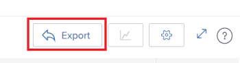

# Übersicht über die Navigation im Ressourcenplaner

Mithilfe des Adobe Workfront-Ressourcenplaners können Sie die Verfügbarkeit Ihrer Ressourcen sowie den geplanten Zeitaufwand für die Fertigstellung der Arbeit an Ihren Projekten leicht nachvollziehen. Anschließend können Sie die Zuordnung Ihrer Benutzer und deren Aufgabengebiete für die Projekte verwalten, denen sie zugewiesen sind.

>[!TIP]
>
>Sie können die Zuweisung von Teams für die Aufgaben, denen sie im Ressourcenplaner zugewiesen sind, nicht verwalten.

Sie müssen die Voraussetzungen erfüllen, um den Ressourcenplaner vollständig nutzen zu können. Weitere Informationen zum Ressourcenplaner finden Sie unter [Ressourcenplaner - Übersicht](../../resource-mgmt/resource-planning/get-started-resource-planner.md).

In den folgenden Abschnitten werden alle Bereiche des Ressourcenplaners beschrieben.

## Zeitlicher Ablauf der Projekte

Verwenden Sie den Kalender oben im Ressourcenplaner, um durch die Zeitleiste der Projekte zu navigieren, die Sie anzeigen. Die Zeitleiste beginnt standardmäßig mit dem heutigen Monat.\
Weitere Informationen zum Ändern des Zeitrahmens der Zeitleiste, die im Ressourcenplaner angezeigt wird, finden Sie im Abschnitt [Zeitrahmenauswahl](#timeframe-selection) in diesem Artikel.

## Zeitrahmenauswahl  {#timeframe-selection}

Standardmäßig zeigt der Ressourcenplaner Ressourceninformationen für drei oder vier Monate an, beginnend mit dem aktuellen Monat. Die Anzahl der angezeigten Zeiträume hängt von der Breite Ihres Bildschirms ab.

>[!TIP]
>
>Sie können im Ressourcenplaner nicht mehr als vier Zeiträume gleichzeitig anzeigen.

So navigieren Sie in der Zeitleiste:

1. Klicken Sie auf die Pfeile nach hinten und vorwärts, um sich auf der Timeline vor- und rückwärts zu bewegen.
1. Wählen Sie im Ressourcenplaner aus den folgenden Datumsbereichsoptionen aus, indem Sie auf die entsprechenden Schaltflächen klicken:

   <table style="table-layout:auto"> 
    <col> 
    <col> 
    <tbody> 
     <tr> 
      <td role="rowheader">Woche</td> 
      <td>Zeigt Informationen nach Woche an. Die Anzahl der Wochen wird neben den Datumsangaben in der Spaltenüberschrift angezeigt. </td> 
     </tr> 
     <tr> 
      <td role="rowheader">Monat</td> 
      <td> Zeigt Informationen nach Monat an.</td> 
     </tr> 
     <tr> 
      <td role="rowheader">Quartal</td> 
      <td>Zeigt Informationen nach Quartal an. Die Nummer des Quartals wird neben den Datumsangaben in der Spaltenüberschrift angezeigt. Benutzerdefinierte Quartale werden nicht im Ressourcenplaner angezeigt. </td> 
     </tr> 
     <tr> 
      <td role="rowheader">Heute</td> 
      <td>Kehrt zum heutigen Monat, zur heutigen Woche oder zum heutigen Quartal zurück.</td> 
     </tr> 
    </tbody> 
   </table>

## Projekt-/Rollen-/Benutzeransichtsauswahl

Sie können die Ansicht im Ressourcenplaner ändern, je nachdem, wie die Informationen angezeigt werden sollen.

Standardmäßig wird der Ressourcenplaner in der Benutzeransicht angezeigt. Sie können die Ansicht in die Projekt- oder Rollenansichten ändern. Wenn Sie sie in eine andere Ansicht ändern, wird Ihre Auswahl zur Standardansicht.

Wenn Sie die Ansicht ändern, ändern sich auch die folgenden Informationen:

* Die Objekthierarchie (Informationen in den Zeilen des Ressourcenplaners).
* Die Informationen zur Stundenzuweisung (Informationen in den Spalten des Ressourcenplaners).

  Weitere Informationen dazu, was die Spalten im Ressourcenplaner je nach ausgewählter Ansicht anzeigen, finden Sie unter [Ressourcenverfügbarkeit und -zuordnung mit dem Adobe Workfront-Ressourcenplaner überprüfen](../../resource-mgmt/resource-planning/resource-availability-allocation-resource-planner.md).

Um genaue Informationen im Ressourcenplaner anzuzeigen, müssen Sie eine Reihe von Voraussetzungen erfüllen. Weitere Informationen zu den Voraussetzungen finden Sie im Abschnitt „Voraussetzungen für die Arbeit im Ressourcenplaner“ im Artikel [Ressourcenplaner - Übersicht](../../resource-mgmt/resource-planning/get-started-resource-planner.md).  So ändern Sie die Ansicht im Ressourcenplaner:

1. Navigieren Sie zum **Ressourcenplaner**.\
   Weitere Informationen zum Zugriff auf den Ressourcenplaner finden Sie im Abschnitt [Suchen des ](../../resource-mgmt/resource-planning/get-started-resource-planner.md#accessing-the-resource-planner)) im Artikel [Ressourcenplaner - Übersicht](../../resource-mgmt/resource-planning/get-started-resource-planner.md).

1. Wählen **im Dropdown** Menü Anzeigen nach eine der folgenden Ansichten aus:

   * [Nach Projekt anzeigen](#view-by-project)
   * [Nach Funktion anzeigen](#view-by-role)
   * [Nach Benutzer/Benutzerin anzeigen](#view-by-user)

### Nach Projekt anzeigen {#view-by-project}

Beachten Sie bei der Auswahl der Projektansicht im Ressourcenplaner Folgendes:

* Es werden Projekte angezeigt, für die Sie zumindest über die Berechtigung zum Anzeigen verfügen.
* Wenn Sie zum ersten Mal auf den Ressourcenplaner zugreifen, können Sie Projekte sehen, die nach dem Standardfilter gefiltert wurden.\
  Weitere Informationen zum Filtern von Informationen im Ressourcenplaner finden Sie unter [Filtern von Informationen im Ressourcenplaner](../../resource-mgmt/resource-planning/filter-resource-planner.md).

* Die Anzahl der Elemente, die Sie in der Projektansicht anzeigen oder exportieren können, ist begrenzt, um die Leistung zu verbessern.\
  Weitere Informationen zu Einschränkungen bei der Anzeige des Ressourcenplaners in der Projektansicht finden Sie im Abschnitt [Einschränkungen in der Projektansicht](../../resource-mgmt/resource-planning/resource-planner-display-limitations.md#project-view-limits) im Artikel [Anzeigebeschränkungen des Ressourcenplaners](../../resource-mgmt/resource-planning/resource-planner-display-limitations.md).

* Die Projekte werden in der Projektansicht nach ihrer Priorität aufgelistet.\
  Weitere Informationen zur Projektpriorität im Ressourcenplaner finden Sie im [Projektplanungspriorität](#project-planning-priority) in diesem Artikel.

* Wenn Sie die einzelnen Projekte erweitern, können Sie die damit verbundenen Aufgabengebiete anzeigen.\
  Wenn Sie jede Rolle erweitern, können Sie mit ihr verknüpfte Benutzer anzeigen.\
  Scrollen Sie zu Mehr Rollen und Benutzer unter jedem Projekt laden .

* Wenn diese Ansicht angewendet wird, summieren sich die Funktionsstunden, VZÄ oder Kosten zu den Projektstunden, VZÄ oder Kosten.\
  

* Sie können die folgenden Stunden-, FTE- oder Kosteninformationen in der Projektansicht anzeigen:

   * Verfügbar
   * Geplant
   * Budgetiert
   * Abweichung
   * Net

     Weitere Informationen finden Sie unter [Budgetressourcen im Ressourcenplaner mithilfe der Projekt- und Rollenansichten](../../resource-mgmt/resource-planning/budget-resources-project-role-views-resource-planner.md).

### Nach Funktion anzeigen {#view-by-role}

Beachten Sie bei der Auswahl der Rollenansicht im Ressourcenplaner Folgendes:

* Sie müssen mindestens über Ansichtszugriff auf das Ressourcen-Management und Ansichtsberechtigungen für Projekte verfügen, um die mit diesen Projekten verknüpften Rollen anzeigen zu können.
* Sie können jede Rolle erweitern, um eine Liste von Projekten anzuzeigen, und jedes Projekt, um eine Liste von Benutzern anzuzeigen, die diese Rollen in den Projekten erfüllen können.
* Die Anzahl der Elemente, die Sie in der Rollenansicht anzeigen oder exportieren können, ist begrenzt, um die Leistung zu verbessern.\
  Weitere Informationen zu Einschränkungen bei der Anzeige des Ressourcenplaners in der Rollenansicht finden Sie im Abschnitt [Einschränkungen in der Rollenansicht](../../resource-mgmt/resource-planning/resource-planner-display-limitations.md#role-view-limits) unter [Einschränkungen der Ressourcenplaner-Anzeige](../../resource-mgmt/resource-planning/resource-planner-display-limitations.md) .

* Die Projekte werden unter dem Aufgabengebiet in der gleichen Prioritätsreihenfolge wie in der Projektansicht aufgeführt.
* Wenn diese Ansicht angewendet wird, summieren sich die Projektstunden, FTE oder Kosten zu den Funktionsstunden, FTE oder Kosten.\
  

* Sie können die folgenden Stunden-, FTE- oder Kosteninformationen in der Rollenansicht anzeigen:

   * Verfügbar
   * Geplant
   * Budgetiert
   * Abweichung
   * Net

     Weitere Informationen finden Sie unter [Budgetressourcen im Ressourcenplaner mithilfe der Projekt- und Rollenansichten](../../resource-mgmt/resource-planning/budget-resources-project-role-views-resource-planner.md).

### Nach Benutzer/Benutzerin anzeigen {#view-by-user}

Sie können den Ressourcenplaner in der Benutzeransicht anzeigen, um den Unterschied zwischen den geplanten und den verfügbaren Stunden oder VZÄ für Ihre Benutzer zu verstehen oder die Menge der tatsächlich protokollierten Stunden anzuzeigen.

Sie können Ihre Ressourcen nicht budgetieren, wenn Sie die Benutzeransicht auf den Ressourcenplaner anwenden. Sie müssen Ihre Ressourcen mithilfe der Projekt- oder Rollenansichten budgetieren und die Benutzeransicht verwenden, um die Zuordnung und Verfügbarkeit Ihrer Benutzer in Bezug auf die geplanten Arbeiten zu überprüfen.* *

Die Benutzeransicht ist die Standardansicht des Ressourcenplaners.

Beachten Sie bei der Auswahl der Benutzeransicht im Ressourcenplaner Folgendes:

* Sie können alle aktiven und mindestens einmal bei Adobe Workfront angemeldeten Benutzer anzeigen, für die Sie über Berechtigungen verfügen (bis zu 2.000 Benutzer).\
  Filtern Sie die Benutzerliste nach Team, Aufgabengebiet oder Pools, um Benutzer anzuzeigen, die nur mit diesen Entitäten verknüpft sind.
* Wenn Sie die Liste der Benutzer nach Projekten gefiltert haben, können nur die mit den gefilterten Projekten verknüpften Benutzer erweitert werden und auch Ihre Informationen anzeigen.\
  Weitere Informationen zum Filtern von Informationen im Ressourcenplaner finden Sie unter [Filtern von Informationen im Ressourcenplaner](../../resource-mgmt/resource-planning/filter-resource-planner.md) .

* Die Anzahl der Elemente, die Sie in der Benutzeransicht anzeigen oder exportieren können, ist begrenzt, um die Leistung zu verbessern.\
  Weitere Informationen zu Einschränkungen beim Anzeigen des Ressourcenplaners in der Benutzeransicht finden Sie [ Abschnitt „Einschränkungen in der ](../../resource-mgmt/resource-planning/resource-planner-display-limitations.md#user-view-limits)&quot; in [Einschränkungen des Ressourcenplaners](../../resource-mgmt/resource-planning/resource-planner-display-limitations.md) .

* Die Projekte werden unter dem Namen des Benutzers in der gleichen Prioritätsreihenfolge wie in der Projektansicht aufgeführt.\
  Weitere Informationen zur Projektpriorität im Ressourcenplaner finden Sie im [Projektplanungspriorität](#project-planning-priority) in diesem Artikel.

* Wenn Benutzenden kein Aufgabengebiet zugeordnet ist, werden die Stunden- oder FTE-Werte unter dem Abschnitt **Keine Funktion** aufgeführt.
* Wenn diese Ansicht angewendet wird, summieren sich die Projektstunden oder VZÄ zu den Benutzerstunden oder VZÄ.

  >[!TIP]
  >
  >Sie können die Zuordnung und Verfügbarkeit der Benutzer nach Kosten nicht in der Benutzeransicht anzeigen.

* Ihre Berechtigungen für Projekte und Aufgaben bestimmen, was unter den Namen der Benutzer angezeigt wird, die Sie in der Benutzeransicht sehen.\
  Die folgenden Szenarien sind vorhanden:

   * Wenn Sie nicht über die erforderlichen Berechtigungen zum Anzeigen von Projekten und Aufgaben oder Problemen verfügen, die den Benutzern im Ressourcenplaner zugewiesen sind, werden diese Elemente in den Abschnitten **Nicht zugängliche Elemente** angezeigt. Die **Nicht zugängliche Elemente**-Abschnitte ersetzen in diesem Fall die Projekt- oder Aufgabenabschnitte.

   * Wenn Sie nicht berechtigt sind, die Projekte anzuzeigen, aber Zugriff haben, um die Aufgaben oder Probleme in den Projekten anzuzeigen, werden die Projekte, Aufgaben und Probleme unter den Namen der ihnen zugewiesenen Benutzer aufgeführt.
   * Wenn Sie berechtigt sind, die Projekte anzuzeigen, aber keine Aufgaben oder Probleme in den Projekten, wird der Projektname angezeigt und die Aufgaben und Probleme werden unter dem Abschnitt **Nicht zugängliche Elemente** aufgelistet.\
     Weitere Informationen zu Berechtigungen in Workfront finden Sie unter [Übersicht über Freigabeberechtigungen für Objekte](../../workfront-basics/grant-and-request-access-to-objects/sharing-permissions-on-objects-overview.md).

     

   

* Sie können die folgenden Stunden- und FTE-Informationen in der Benutzeransicht anzeigen:

   * Verfügbar
   * Geplant
   * Tatsächlich
   * Unterschied zwischen geplant und tatsächlich
   * Prozentsatz der geplanten Zuteilung

     Weitere Informationen finden Sie unter [Verfügbare, geplante und tatsächliche Stunden oder VZÄ im Ressourcenplaner anzeigen, wenn Sie die Benutzeransicht verwenden](../../resource-mgmt/resource-planning/view-hours-fte-user-view-resource-planner.md)

## Projektname

Im Ressourcenplaner werden die folgenden Projekte angezeigt:

* Projekte, für die Sie über die Berechtigung verfügen, mindestens Folgendes anzuzeigen.

  Sie müssen auch Zugriff auf zumindest „Ressourcenverwaltung anzeigen“ in Ihrer Zugriffsebene haben.

  Informationen zum Zugriff, der für die Verwendung des Ressourcenplaners erforderlich ist, finden Sie unter [Zugriff auf die Budgetierung von Ressourcen in Adobe Workfront](../../resource-mgmt/resource-planning/access-needed-to-budget-resources.md).

* Durch den auf den Ressourcenplaner angewendeten Filter eingeschränkte Projekte

  Weitere Informationen zum Filtern von Informationen im Ressourcenplaner finden Sie unter [Filtern von Informationen im Ressourcenplaner](../../resource-mgmt/resource-planning/filter-resource-planner.md).

  >[!NOTE]
  >
  >Es wird empfohlen, Filter zu verwenden, um die Anzahl der Projekte zu reduzieren, die im Ressourcenplaner angezeigt werden.

## Projektplanungspriorität {#project-planning-priority}

Projekte werden im Ressourcenplaner nach Priorität geordnet aufgelistet, wobei das wichtigste Projekt ganz oben steht. Die Priorität wird durch eine Zahl vor dem Projektnamen angezeigt.

Sie können eine Einstellung auch aktivieren, um die Projektprioritäten entsprechend ihren Portfolios anzuzeigen, wenn sie mit einem Portfolio verknüpft sind. Informationen zum Priorisieren von Projekten und Anzeigen von Portfolioprioritäten im Ressourcenplaner finden Sie unter [Priorisieren von Projekten im Ressourcenplaner](../../resource-mgmt/resource-planning/prioritize-projects-resource-planner.md).

## Name des Aufgabengebiets

Die folgenden Kategorien von Aufgabengebieten sind im Ressourcenplaner aufgeführt:

* Die Aufgabengebiete, die Aufgaben zugewiesen sind.
* Die Aufgabengebiete, die keinen Aufgaben zugewiesen sind, jedoch die primären Aufgabengebiete der Benutzer sind, die mit den Ressourcenpools der Projekte verknüpft sind.
* Die sekundären Aufgabengebiete von Benutzern, die Aufgaben in diesen Aufgabengebieten zugewiesen sind.
* Die sekundären Aufgabengebiete von Benutzern, die über einen gültigen **Prozentsatz der FTE-Verfügbarkeit** in ihrem Profil verfügen.\
  Weitere Informationen zum **Prozentsatz der FTE-Verfügbarkeit** für Aufgabengebiete finden Sie unter [Bearbeiten des Benutzerprofils](../../administration-and-setup/add-users/create-and-manage-users/edit-a-users-profile.md) .

>[!NOTE]
>
>Aufgabengebiete, die Problemen zugewiesen sind, werden auch aufgelistet, wenn die Einstellung **Stunden aus Problem einbeziehen** aktiviert ist. Weitere Informationen zur Aktivierung von Problemstunden im Ressourcenplaner finden Sie im Abschnitt [Einstellungen](#settings).

## Benutzername

Die im Ressourcenplaner in der Projekt- und Rollenansicht aufgelisteten Benutzer gehören zu den Ressourcenpools, die mit den Projekten verknüpft sind.\
Weitere Informationen zum Ausfüllen von Ressourcenpools mit Benutzern finden Sie unter [Zuordnen von Ressourcenpools zu Benutzern](../../resource-mgmt/resource-planning/resource-pools/associate-resource-pools-with-users.md).

Alle Benutzenden, auf die Sie Zugriff haben und die sich mindestens einmal bei Workfront angemeldet haben, werden in der Benutzeransicht angezeigt.

In den Projekt- und Rollenansichten könnten Benutzer unter den folgenden Arten von Aufgabengebieten aufgeführt werden:

* Ihr primäres Aufgabengebiet
* Ihr sekundäres Aufgabengebiet in den folgenden Szenarien:

   * Wenn das sekundäre Aufgabengebiet eine gültige Zahl für den **Prozentsatz der FTE-Verfügbarkeit** in seinem Benutzerprofil hat.
   * Wenn der/die Benutzende Aufgaben in diesen Rollen zugewiesen ist

Weitere Informationen zum **Prozentsatz der FTE-Verfügbarkeit** für ein Aufgabengebiet finden Sie unter [Bearbeiten des Benutzerprofils](../../administration-and-setup/add-users/create-and-manage-users/edit-a-users-profile.md) .

## Abschnitte „Keine Rolle“ und „Kein Benutzer“

* [ Abschnitt „Keine Rolle“](#no-role-section)
* [Abschnitt „Kein Benutzer“](#no-user-section)

### Abschnitt „Keine Rolle“  {#no-role-section}

Wenn ein(e) Benutzende(r) zu einem Ressourcenpool gehört, der mit einem Projekt verknüpft ist, ihm/ihr jedoch kein Aufgabengebiet zugeordnet ist, wird er/sie im Abschnitt **Keine**) anstelle unter einem bestimmten Aufgabengebiet angezeigt.

Sie können keine Stunden für einen Benutzer in einem Abschnitt **Keine Rolle** budgetieren. Dem Benutzer muss mindestens ein Aufgabengebiet zugeordnet sein, damit er für Arbeit budgetiert werden kann.\

### Abschnitt „Kein Benutzer“  {#no-user-section}

Wenn Sie einem Team eine Aufgabe zuweisen oder die Zuweisung aufheben, werden die geplanten Stunden unter dem Abschnitt **Kein Benutzer** angezeigt, der im Ressourcenplaner unter dem Abschnitt **Keine**&quot; angezeigt wird. Diese Aufgaben werden nicht im Ressourcenplaner angezeigt, wenn die Ansicht &quot;**nach Benutzer“** wird.

Die Anzahl der geplanten Stunden, die den Aufgaben im Projekt zugeordnet wurden, wird im Ressourcenplaner im Abschnitt **Kein Benutzer** angezeigt, diese Zuordnungen können jedoch nicht budgetiert werden.

 

## Filter

Mithilfe von Filtern können Sie die Informationen einschränken, die Sie im Ressourcenplaner anzeigen.

Weitere Informationen zum Filtern im Ressourcenplaner finden Sie unter [Filtern von Informationen im Ressourcenplaner](../../resource-mgmt/resource-planning/filter-resource-planner.md) .

## Einstellungen {#settings}

Im Bereich Einstellungen können Sie Optionen zum Anzeigen oder Ausblenden von Informationen im Ressourcenplaner aktivieren oder deaktivieren.

So aktivieren Sie Einstellungen im Ressourcenplaner:

1. Öffnen Sie den Ressourcenplaner.
1. Klicken Sie auf **Symbol** Einstellungen“.

   

   Das Feld Ressourcenplaner-Einstellungen wird angezeigt.

   

1. Aktivieren Sie die Einstellung **Stunden aus Problemen einbeziehen**, um geplante Stunden aus Problemen im Ressourcenplaner anzuzeigen. Diese Einstellung ist standardmäßig deaktiviert.

   Beachten Sie beim Aktivieren dieser Einstellung Folgendes:

   * Der Name des Benutzers, der den Problemen zugewiesen wurde, wird unter dem ihm zugeordneten Aufgabengebiet für das Problem angezeigt und Sie können budgetierte Stunden für den Benutzer und das Aufgabengebiet in den Projekt- und Rollenansichten angeben.
   * Die Probleme, denen die Benutzer zugewiesen sind, werden in der Benutzeransicht unter den Namen der Aufgabengebiete aufgeführt.

     >[!IMPORTANT]
     >
     >**Wenn das geplante Start- und Abschlussdatum der Anfrage außerhalb der Zeitleiste des Projekts liegt, werden die geplanten Stunden für die Anfrage entsprechend den Datumsangaben der Anfrage angezeigt. Wenn beispielsweise die Projektzeitleiste zwischen Januar und März liegt, die Zeitleiste der Probleme jedoch im August, werden die geplanten Stunden für die Probleme im August angezeigt.**

1. Portfolio (Bedingt und optional) Wenn Sie die Projektansicht ausgewählt haben, aktivieren Sie die Einstellung Projektprioritäten anzeigen , um die Projektprioritäten entsprechend dem Portfolio anzuzeigen, dem sie zugewiesen wurden. Die Priorität der Projekte entsprechend ihren Portfolios wird neben der Ressourcenplaner-Priorität angezeigt. Diese Einstellung ist standardmäßig deaktiviert.

   Informationen zum Priorisieren von Projekten im Ressourcenplaner finden Sie unter [Priorisieren von Projekten im Ressourcenplaner](../../resource-mgmt/resource-planning/prioritize-projects-resource-planner.md).

## Option für Vollbildmodus

Sie können den Ressourcenplaner im Vollbildmodus anzeigen, um die Informationsmenge zu vergrößern, die Sie auf dem Bildschirm anzeigen können.

Die Option zur Anzeige von Informationen im Vollbildmodus steht für alle Ansichten des Ressourcenplaners zur Verfügung.

So zeigen Sie den Ressourcenplaner im Vollbildmodus an:

1. Navigieren Sie zum **Ressourcenplaner**.
1. Klicken Sie auf **Vollbildsymbol**, um den Ressourcenplaner im Vollbildmodus anzuzeigen.\
   \
   Der Ressourcenplaner wird erweitert, sodass er Ihr gesamtes Browser-Fenster einnimmt, und das Symbol ändert sich in eine Option **Vollbildansicht schließen**.

1. (Optional) Klicken Sie auf das **Vollbildsymbol schließen**, um zur vorherigen Anzeige zurückzukehren.

## Exportoption

Sie können Informationen aus jeder Ansicht des Ressourcenplaners in eine Excel-Datei (.xlsx) exportieren.\
Informationen zum Exportieren von Informationen aus dem Ressourcenplaner finden Sie unter [Exportieren von Informationen aus dem Ressourcenplaner](../../resource-mgmt/resource-planning/export-resource-planner.md).

Sie können die Informationsmenge und die Anzeige Ihrer exportierten Datei verwalten.\
Informationen dazu, welche Informationen Sie aus dem Ressourcenplaner exportieren können und wie Sie das Erscheinungsbild der exportierten Datei verwalten, finden Sie unter [Anzeigebeschränkungen für den Ressourcenplaner](../../resource-mgmt/resource-planning/resource-planner-display-limitations.md).
