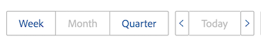

# Übersicht über die Navigation im Ressourcenplaner

<!-- Audited: 5/2025 -->

Der Adobe Workfront-Ressourcenplaner hilft Ihnen, die Verfügbarkeit Ihrer Ressourcen und den für die Fertigstellung der Projektarbeiten erforderlichen Zeitaufwand leicht zu verstehen. Anschließend können Sie die Zuordnung Ihrer Benutzer und deren Aufgabengebiete für die Projekte verwalten, denen sie zugewiesen sind.

>[!TIP]
>
>Sie können die Zuweisung von Teams zu den Aufgaben, denen sie im Ressourcenplaner zugewiesen sind, nicht verwalten.

Sie müssen die Voraussetzungen erfüllen, um den Ressourcenplaner vollständig nutzen zu können. Weitere Informationen zum Ressourcenplaner finden Sie unter [Ressourcenplaner - Übersicht](../../resource-mgmt/resource-planning/get-started-resource-planner.md).

In den folgenden Abschnitten werden alle Bereiche des Ressourcenplaners beschrieben.

## Zeitlicher Ablauf der Projekte

Verwenden Sie den Kalender oben im Ressourcenplaner, um durch die Zeitleiste der Projekte zu navigieren, die Sie anzeigen. Die Zeitleiste beginnt standardmäßig mit dem heutigen Monat.

Weitere Informationen zum Ändern des Zeitrahmens der Zeitleiste, die im Ressourcenplaner angezeigt wird, finden Sie im Abschnitt [Zeitrahmenauswahl](#timeframe-selection) in diesem Artikel.

## Zeitrahmenauswahl  {#timeframe-selection}

Standardmäßig zeigt der Ressourcenplaner Ressourceninformationen für jeweils 3 oder 4 Monate an, beginnend mit dem aktuellen Monat. Die Anzahl der angezeigten Zeiträume hängt von der Breite Ihres Bildschirms ab.

>[!TIP]
>
>Sie können im Ressourcenplaner nicht mehr als vier Zeiträume gleichzeitig anzeigen.

Um in der Zeitleiste zu navigieren, klicken Sie auf die Pfeile nach vorne und zurück, um in der Zeitleiste vorwärts und rückwärts zu navigieren. Anschließend können Sie im Ressourcenplaner aus den folgenden Datumsbereichsoptionen auswählen, indem Sie auf die entsprechenden Schaltflächen klicken:

<table style="table-layout:auto"> 
    <col> 
    <col> 
    <tbody> 
     <tr> 
      <td role="rowheader">Woche</td> 
      <td>Zeigt Informationen nach Woche an. Die Anzahl der Wochen wird neben den Datumsangaben in der Spaltenüberschrift angezeigt. </td> 
     </tr> 
     <tr> 
      <td role="rowheader">Monat</td> 
      <td> Zeigt Informationen nach Monat an.</td> 
     </tr> 
     <tr> 
      <td role="rowheader">Quartal</td> 
      <td>Zeigt Informationen nach Quartal an. Die Nummer des Quartals wird neben den Datumsangaben in der Spaltenüberschrift angezeigt. Benutzerdefinierte Quartale werden nicht im Ressourcenplaner angezeigt. </td> 
     </tr> 
     <tr> 
      <td role="rowheader">Heute</td> 
      <td>Kehrt zum heutigen Monat, zur heutigen Woche oder zum heutigen Quartal zurück.</td> 
     </tr> 
    </tbody> 
   </table>

## Projekt-/Rollen-/Benutzeransichtsauswahl

Sie können die Ansicht im Ressourcenplaner ändern, je nachdem, wie die Informationen angezeigt werden sollen.

Standardmäßig wird der Ressourcenplaner in der Benutzeransicht angezeigt. Sie können die Ansicht in die Projekt- oder Rollenansichten ändern. Wenn Sie sie in eine andere Ansicht ändern, wird Ihre Auswahl zur Standardansicht.

Wenn Sie die Ansicht ändern, ändern sich auch die folgenden Informationen:

* Die Objekthierarchie (Informationen in den Zeilen des Ressourcenplaners).
* Die Informationen zur Stundenzuweisung (Informationen in den Spalten des Ressourcenplaners).

  Weitere Informationen dazu, was die Spalten im Ressourcenplaner je nach ausgewählter Ansicht anzeigen, finden Sie unter [Ressourcenverfügbarkeit und -zuordnung mit dem Adobe Workfront-Ressourcenplaner überprüfen](../../resource-mgmt/resource-planning/resource-availability-allocation-resource-planner.md).

Um genaue Informationen im Ressourcenplaner anzuzeigen, müssen Sie eine Reihe von Voraussetzungen erfüllen. Weitere Informationen zu den Voraussetzungen finden Sie im Abschnitt „Voraussetzungen für die Arbeit im Ressourcenplaner“ im Artikel [Ressourcenplaner - Übersicht](../../resource-mgmt/resource-planning/get-started-resource-planner.md).

Um die Ansicht im Ressourcenplaner zu ändern, wählen Sie im Dropdown-Menü Ansicht nach eine der folgenden Ansichten aus:

* [Nach Projekt anzeigen](#view-by-project)
* [Nach Funktion anzeigen](#view-by-role)
* [Nach Benutzer/Benutzerin anzeigen](#view-by-user)

### Nach Projekt anzeigen {#view-by-project}

Beachten Sie bei der Auswahl der Projektansicht im Ressourcenplaner Folgendes:

* Sie können Projekte anzeigen, für die Sie über Berechtigungen zum Anzeigen verfügen.
* Wenn Sie zum ersten Mal auf den Ressourcenplaner zugreifen, können Sie Projekte sehen, die nach dem Standardfilter gefiltert wurden.\
  Weitere Informationen finden Sie unter [Filtern von Informationen im Ressourcenplaner](../../resource-mgmt/resource-planning/filter-resource-planner.md).

* Die Anzahl der Elemente, die Sie in der Projektansicht anzeigen oder exportieren können, ist begrenzt, um die Leistung zu verbessern.\
  Weitere Informationen finden Sie im Abschnitt Einschränkungen in der Projektansicht im Artikel [Anzeigebeschränkungen für den Ressourcenplaner](../../resource-mgmt/resource-planning/resource-planner-display-limitations.md).

* Die Projekte werden in der Projektansicht nach ihrer Priorität aufgelistet.\
  Weitere Informationen finden Sie [ Abschnitt „Projektplanungspriorität](#project-planning-priority) in diesem Artikel.

* Wenn Sie die einzelnen Projekte erweitern, können Sie die damit verbundenen Aufgabengebiete anzeigen.

* Wenn Sie jede Rolle erweitern, können Sie mit ihr verknüpfte Benutzer anzeigen. Scrollen Sie zu Mehr Rollen und Benutzer unter jedem Projekt laden .

* Wenn diese Ansicht angewendet wird, summieren sich die Funktionsstunden, VZÄ oder Kosten zu den Projektstunden, VZÄ oder Kosten.

* Sie können die folgenden Stunden-, FTE- oder Kosteninformationen in der Projektansicht anzeigen:

   * Verfügbar
   * Geplant
   * Budgetiert
   * Variance
   * Netto

     Weitere Informationen finden Sie unter [Budgetressourcen im Ressourcenplaner mithilfe der Projekt- und Rollenansichten](../../resource-mgmt/resource-planning/budget-resources-project-role-views-resource-planner.md).

### Nach Funktion anzeigen {#view-by-role}

Beachten Sie bei der Auswahl der Rollenansicht im Ressourcenplaner Folgendes:

* Sie müssen mindestens über Ansichtszugriff auf das Ressourcen-Management und Ansichtsberechtigungen für Projekte verfügen, um die mit diesen Projekten verknüpften Rollen anzeigen zu können.
* Sie können jede Rolle erweitern, um eine Liste von Projekten anzuzeigen, und jedes Projekt, um eine Liste von Benutzern anzuzeigen, die diese Rollen in den Projekten erfüllen können.
* Die Anzahl der Elemente, die Sie in der Rollenansicht anzeigen oder exportieren können, ist begrenzt, um die Leistung zu verbessern.\
  Weitere Informationen finden Sie unter „Einschränkungen“ im Abschnitt „Rollenansicht“ in [Einschränkungen bei der Ressourcenplaner-Anzeige](../../resource-mgmt/resource-planning/resource-planner-display-limitations.md).

* Die Projekte werden unter dem Aufgabengebiet in der gleichen Prioritätsreihenfolge wie in der Projektansicht aufgeführt.
* Wenn diese Ansicht angewendet wird, summieren sich die Projektstunden, FTE oder Kosten zu den Funktionsstunden, FTE oder Kosten.
* Sie können die folgenden Stunden-, FTE- oder Kosteninformationen in der Rollenansicht anzeigen:

   * Verfügbar
   * Geplant
   * Budgetiert
   * Variance
   * Netto

     Weitere Informationen finden Sie unter [Budgetressourcen im Ressourcenplaner mithilfe der Projekt- und Rollenansichten](../../resource-mgmt/resource-planning/budget-resources-project-role-views-resource-planner.md).

### Nach Benutzer/Benutzerin anzeigen {#view-by-user}

Sie können den Ressourcenplaner in der Benutzeransicht anzeigen, um den Unterschied zwischen den geplanten und den verfügbaren Stunden oder VZÄ für Ihre Benutzer zu verstehen oder die Menge der tatsächlich protokollierten Stunden anzuzeigen.

Sie können Ihre Ressourcen nicht budgetieren, wenn Sie die Benutzeransicht auf den Ressourcenplaner anwenden. Sie müssen Ihre Ressourcen mithilfe der Projekt- oder Rollenansichten budgetieren und die Benutzeransicht verwenden, um die Zuordnung und Verfügbarkeit Ihrer Benutzer in Bezug auf die geplanten Arbeiten zu überprüfen.

Die Benutzeransicht ist die Standardansicht des Ressourcenplaners.

Beachten Sie bei der Auswahl der Benutzeransicht im Ressourcenplaner Folgendes:

* Sie können alle Benutzenden anzeigen, für die Sie über Berechtigungen verfügen, bis zu 2.000 Benutzende, die aktiv sind und mindestens einmal bei Adobe Workfront angemeldet sind. Filtern Sie die Benutzerliste nach Team, Aufgabengebiet oder Pools, um Benutzer anzuzeigen, die nur mit diesen Entitäten verknüpft sind.
* Wenn Sie die Liste der Benutzer nach Projekten gefiltert haben, können nur die mit den gefilterten Projekten verknüpften Benutzer erweitert werden und Ihre Informationen anzeigen.\
  Weitere Informationen finden Sie unter [Filtern von Informationen im Ressourcenplaner](../../resource-mgmt/resource-planning/filter-resource-planner.md).

* Die Anzahl der Elemente, die Sie in der Benutzeransicht anzeigen oder exportieren können, ist begrenzt, um die Leistung zu verbessern.\
  Weitere Informationen finden Sie unter Einschränkungen im Abschnitt „Benutzeransicht“ in [Anzeigebeschränkungen für den Ressourcenplaner](../../resource-mgmt/resource-planning/resource-planner-display-limitations.md) .

* Die Projekte werden unter dem Benutzernamen in derselben Prioritätsreihenfolge aufgelistet wie in der Projektansicht.\
  Weitere Informationen finden Sie [ Abschnitt „Projektplanungspriorität](#project-planning-priority) in diesem Artikel.

* Wenn Benutzenden kein Aufgabengebiet zugeordnet ist, werden die Stunden- oder FTE-Werte im Abschnitt Keine Funktion aufgeführt.
* Wenn diese Ansicht angewendet wird, summieren sich die Projektstunden oder VZÄ zu den Benutzerstunden oder VZÄ.

  >[!TIP]
  >
  >Sie können die Zuordnung und Verfügbarkeit der Benutzer nach Kosten nicht in der Benutzeransicht anzeigen.

* Ihre Projekt- und Aufgabenberechtigungen bestimmen, was unter den Namen der Benutzer angezeigt wird, die Sie in der Benutzeransicht sehen.

  Die folgenden Szenarien sind vorhanden:

   * Wenn Sie nicht über die erforderlichen Berechtigungen zum Anzeigen von Projekten und Aufgaben oder Problemen verfügen, die den Benutzern im Ressourcenplaner zugewiesen sind, werden diese Elemente unter den Abschnitten Nicht zugängliche Elemente aufgeführt. In diesem Fall ersetzen diese Abschnitte die Projekt- oder Aufgabenabschnitte.

   * Wenn Sie nicht über die erforderlichen Berechtigungen zum Anzeigen der Projekte verfügen, aber Zugriff haben, um die Aufgaben oder Probleme in den Projekten anzuzeigen, werden die Projekte, Aufgaben und Probleme unter den Namen der ihnen zugewiesenen Benutzer aufgeführt.
   * Wenn Sie berechtigt sind, die Projekte anzuzeigen, aber keine Aufgaben oder Probleme in den Projekten, wird der Projektname angezeigt und die Aufgaben und Probleme werden im Abschnitt Nicht zugängliche Elemente aufgeführt.

     Weitere Informationen finden Sie unter [Übersicht über Freigabeberechtigungen für Objekte](../../workfront-basics/grant-and-request-access-to-objects/sharing-permissions-on-objects-overview.md).

* Sie können die folgenden Stunden- und FTE-Informationen in der Benutzeransicht anzeigen:

   * Verfügbar
   * Geplant
   * Tatsächlich
   * Unterschied zwischen geplant und tatsächlich
   * Prozentsatz der geplanten Zuteilung

     Weitere Informationen finden Sie unter [Verfügbare, geplante und tatsächliche Stunden oder VZÄ im Ressourcenplaner anzeigen, wenn Sie die Benutzeransicht verwenden](../../resource-mgmt/resource-planning/view-hours-fte-user-view-resource-planner.md)

## Projektname

Im Ressourcenplaner werden die folgenden Projekte angezeigt:

* Projekte, für die Sie Berechtigungen haben. Sie müssen auch Zugriff auf „Ressourcenverwaltung anzeigen“ in Ihrer Zugriffsebene haben.

  Weitere Informationen finden Sie unter [Zugriff erforderlich, um Ressourcen in Adobe Workfront zu budgetieren](../../resource-mgmt/resource-planning/access-needed-to-budget-resources.md).

* Durch den auf den Ressourcenplaner angewendeten Filter eingeschränkte Projekte

  Weitere Informationen finden Sie unter [Filtern von Informationen im Ressourcenplaner](../../resource-mgmt/resource-planning/filter-resource-planner.md).

  >[!NOTE]
  >
  >Es wird empfohlen, Filter zu verwenden, um die Anzahl der Projekte zu reduzieren, die im Ressourcenplaner angezeigt werden.

## Projektplanungspriorität {#project-planning-priority}

Projekte werden im Ressourcenplaner nach Priorität geordnet aufgelistet, wobei das wichtigste Projekt ganz oben steht. Die Priorität wird durch eine Zahl vor dem Projektnamen angezeigt.

Sie können eine Einstellung auch aktivieren, um die Projektprioritäten entsprechend ihren Portfolios anzuzeigen, wenn sie mit einem Portfolio verknüpft sind. Weitere Informationen finden Sie [Priorisieren von Projekten im Ressourcenplaner](../../resource-mgmt/resource-planning/prioritize-projects-resource-planner.md).

## Name des Aufgabengebiets

Die folgenden Kategorien von Aufgabengebieten sind im Ressourcenplaner aufgeführt:

* Die Aufgabengebiete, die Aufgaben zugewiesen sind.
* Die Aufgabengebiete, die keinen Aufgaben zugewiesen sind, jedoch die primären Aufgabengebiete der Benutzer sind, die mit den Ressourcenpools der Projekte verknüpft sind.
* Die sekundären Aufgabengebiete von Benutzern, die Aufgaben in diesen Aufgabengebieten zugewiesen sind.
* Die sekundären Aufgabengebiete von Benutzern, die einen gültigen Prozentsatz der FTE-Verfügbarkeit in ihrem Profil haben.\
  Weitere Informationen zum Prozentsatz der FTE-Verfügbarkeit für Aufgabengebiete finden Sie unter [Bearbeiten des Benutzerprofils](../../administration-and-setup/add-users/create-and-manage-users/edit-a-users-profile.md).

>[!NOTE]
>
>Aufgabengebiete, die Problemen zugewiesen sind, werden auch aufgeführt, wenn die Einstellung Stunden aus Problem einbeziehen aktiviert ist. Weitere Informationen zur Aktivierung von Problemstunden im Ressourcenplaner finden Sie im Abschnitt [Einstellungen](#settings).

## Benutzername

Die im Ressourcenplaner in der Projekt- und Rollenansicht aufgelisteten Benutzer gehören zu den Ressourcenpools, die mit den Projekten verknüpft sind.\
Weitere Informationen finden Sie unter [Zuordnen von Ressourcenpools zu Benutzern](../../resource-mgmt/resource-planning/resource-pools/associate-resource-pools-with-users.md).

Alle Benutzenden, auf die Sie Zugriff haben und die sich mindestens einmal bei Workfront angemeldet haben, werden in der Benutzeransicht angezeigt.

In den Projekt- und Rollenansichten könnten Benutzer unter den folgenden Arten von Aufgabengebieten aufgeführt werden:

* Ihr primäres Aufgabengebiet
* Ihr sekundäres Aufgabengebiet in den folgenden Szenarien:

   * Wenn das sekundäre Aufgabengebiet eine gültige Zahl für den Prozentsatz der FTE-Verfügbarkeit in seinem Benutzerprofil hat.
   * Wenn der/die Benutzende Aufgaben in diesen Rollen zugewiesen ist
Weitere Informationen zum Prozentsatz der FTE-Verfügbarkeit für ein Aufgabengebiet finden Sie unter [Bearbeiten des Benutzerprofils](../../administration-and-setup/add-users/create-and-manage-users/edit-a-users-profile.md) .

## Keine Rolle und keine Benutzerabschnitte

### Abschnitt „Keine Rolle“  {#no-role-section}

Wenn ein(e) Benutzende(r) einem Ressourcenpool angehört, der mit einem Projekt verknüpft ist, ihm/ihr jedoch kein Aufgabengebiet zugeordnet ist, wird er/sie im Abschnitt Keine Rolle angezeigt statt in einem bestimmten Aufgabengebiet.

Sie können keine Stunden für einen Benutzer in einem Abschnitt ohne Funktion budgetieren. Dem Benutzer muss mindestens ein Aufgabengebiet zugeordnet sein, damit er für Arbeit budgetiert werden kann.

### Kein Benutzerabschnitt  {#no-user-section}

Wenn Sie einem Team eine Aufgabe zuweisen oder die Zuweisung aufheben, werden die geplanten Stunden unter dem Abschnitt Kein Benutzer angezeigt, der im Ressourcenplaner unter dem Abschnitt Keine Rolle angezeigt wird. Diese Aufgaben werden bei Verwendung der Ansicht Nach Benutzer anzeigen nicht im Ressourcenplaner angezeigt.

Die Anzahl der geplanten Stunden, die den Aufgaben im Projekt zugeordnet wurden, wird im Ressourcenplaner im Abschnitt „Kein Benutzer“ angezeigt. Sie können jedoch für diese Zuordnungen kein Budget erstellen.

## Filter

Mithilfe von Filtern können Sie die Informationen einschränken, die Sie im Ressourcenplaner anzeigen.

Weitere Informationen zum Filtern im Ressourcenplaner finden Sie unter [Filtern von Informationen im Ressourcenplaner](../../resource-mgmt/resource-planning/filter-resource-planner.md) .

## Einstellungen {#settings}

Im Bereich Einstellungen können Sie Optionen zum Anzeigen oder Ausblenden von Informationen im Ressourcenplaner aktivieren oder deaktivieren. Um das Dialogfeld Ressourcenplaner-Einstellungen zu öffnen, klicken Sie auf das Symbol Einstellungen oben rechts auf der Seite.

Von hier aus können Sie eine oder beide der folgenden Einstellungen aktivieren:

* **Stunden aus Problemen einbeziehen**: Zeigt geplante Stunden aus Problemen an.

  Beachten Sie beim Aktivieren dieser Einstellung Folgendes:

   * Der Name des Benutzers, der den Problemen zugewiesen wurde, wird unter dem Aufgabengebiet angezeigt, das ihnen im Problem zugeordnet ist. In den Projekt- und Aufgabenansichten können Sie budgetierte Stunden für den Benutzer und das Aufgabengebiet angeben.
   * Die Probleme, denen die Benutzer zugewiesen sind, werden in der Benutzeransicht unter den Namen der Aufgabengebiete aufgeführt.

     >[!IMPORTANT]
     >
     >Wenn das geplante Start- und Abschlussdatum der Anfrage außerhalb der Zeitleiste des Projekts liegt, werden die geplanten Stunden für die Anfrage entsprechend den Datumsangaben der Anfrage angezeigt. Wenn beispielsweise die Projektzeitleiste zwischen Januar und März liegt, die Zeitleiste der Probleme jedoch im August, werden die geplanten Stunden für die Probleme im August angezeigt.

* **Portfolio-Prioritäten anzeigen**: Zeigt die Projektprioritäten entsprechend der Portfolio an, der sie zugewiesen sind.

  Informationen zum Priorisieren von Projekten im Ressourcenplaner finden Sie unter [Priorisieren von Projekten im Ressourcenplaner](../../resource-mgmt/resource-planning/prioritize-projects-resource-planner.md).

  

## Option für Vollbildmodus

Sie können den Ressourcenplaner im Vollbildmodus anzeigen, um die Informationsmenge zu vergrößern, die Sie auf dem Bildschirm anzeigen können. Diese Option ist für alle Ansichten verfügbar.

Um den Ressourcenplaner im Vollbildmodus anzuzeigen, klicken Sie auf das Vollbildsymbol in der oberen rechten Ecke der Seite.

Sobald der Bildschirm erweitert ist, können Sie auf das Symbol Vollbild schließen klicken, um zur vorherigen Anzeige zurückzukehren.

## Exportoption

Sie können Informationen aus jeder Ansicht des Ressourcenplaners in eine Excel-Datei (.xlsx) exportieren.

Informationen zum Exportieren von Informationen aus dem Ressourcenplaner finden Sie unter [Exportieren von Informationen aus dem Ressourcenplaner](../../resource-mgmt/resource-planning/export-resource-planner.md).

Sie können die Informationsmenge und die Anzeige Ihrer exportierten Datei verwalten.

Informationen dazu, welche Informationen Sie aus dem Ressourcenplaner exportieren können und wie Sie das Erscheinungsbild der exportierten Datei verwalten, finden Sie unter [Anzeigebeschränkungen für den Ressourcenplaner](../../resource-mgmt/resource-planning/resource-planner-display-limitations.md).
