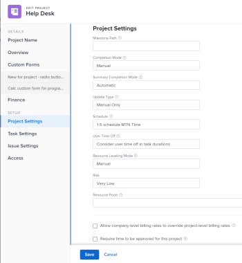
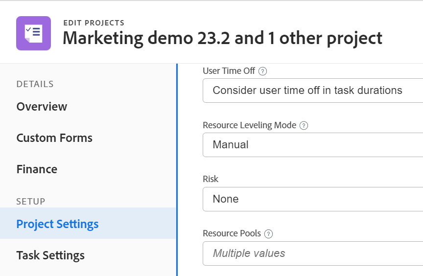

# Zuordnen von Ressourcen-Pools zu Projekten und Vorlagen

<!--
 drafted for bulk editing projects: keep this in yellow till this releases to ALL customers - May 1, 2023

Also - take out all the references to Preview and Prod at prod final
-->

<!--The highlighted information on this page refers to functionality not yet generally available. It is available for all customers in the Preview environment and for a select group of customers in the Production environment.-->

<!--

The sections about how to add resource pools to templates, projects are duplicated from the articles listed in those sections (Editing Projects, Creating a Template, etc).

***I decided to keep these steps here, though, because it's hard to parse through those much lunger articles for just updating this one field.)

-->

Ressourcenpools sind Sammlungen von Benutzern, die Ihnen bei der Verwaltung von Ressourcen in Adobe Workfront helfen.

Nachdem Sie Ressourcenpools erstellt haben, können Sie sie mit Projekten oder Vorlagen verknüpfen, damit Sie später Ihre Ressourcen für die Projekte budgetieren können.

Es wird empfohlen, Ressourcenpools im Voraus zu erstellen, sie mit Projekten zu verknüpfen und Ressourcen zu budgetieren, bevor das Projekt beginnt.

Informationen zu Ressourcenpools finden Sie unter [Ressourcenpools - Übersicht](../../../resource-mgmt/resource-planning/resource-pools/work-with-resource-pools.md).

Informationen zum Erstellen von Ressourcenpools finden Sie unter [Ressourcenpools erstellen](../../../resource-mgmt/resource-planning/resource-pools/create-resource-pools.md).

## Zugriffsanforderungen

+++ Erweitern, um die Zugriffsanforderungen für die in diesem Artikel beschriebene Funktionalität anzuzeigen.

<table style="table-layout:auto"> 
 <col> 
 <col> 
 <tbody> 
  <tr> 
   <td>Adobe Workfront-Paket</td> 
   <td>
Beliebig
</td> 
  </tr> 
  <tr> 
   <td>Adobe Workfront-Lizenz</td> 
   <td>
Standard

   
Abo
</td>
  </tr> 
  <tr> 
   <td>Konfigurationen der Zugriffsebene</td> 
   <td> 
Bearbeiten des Zugriffs auf das Ressourcen-Management, der den Zugriff auf die Verwaltung von Ressourcenpools umfasst
 
Zugriff auf Projekte, Vorlagen und Benutzer bearbeiten
</td> 
  </tr> 
  <tr> 
   <td>Objektberechtigungen</td> 
   <td>Verwalten Sie Berechtigungen für die Projekte, Vorlagen und Benutzer, mit denen Sie die Ressourcenpools verknüpfen möchten</td> 
  </tr> 
 </tbody> 
</table>

Weitere Informationen finden Sie unter [Zugriffsanforderungen](/help/quicksilver/administration-and-setup/add-users/access-levels-and-object-permissions/access-level-requirements-in-documentation.md) in der Dokumentation zu Workfront.

+++

## Ressourcenpools mit einem Projekt oder einer Vorlage verknüpfen

Ressourcenpools können mit einer Vorlage auf die gleiche Weise verknüpft werden wie Ressourcenpools mit einem Projekt. Dieser Artikel beschreibt, wie Sie Ressourcenpools mit Projekten verknüpfen können.

1. Gehen Sie zu einem Projekt und klicken Sie auf das **Mehr**-Symbol  neben dem Projektnamen und klicken Sie dann auf **Bearbeiten**.

1. Klicken Sie **Projekteinstellungen**.

1. Geben Sie zunächst den Namen eines Ressourcenpools in das Feld **Ressourcenpools** ein und wählen Sie ihn dann aus der Liste aus, wenn er angezeigt wird.\
   Sie können mehrere Ressourcenpools mit einem Projekt oder einer Vorlage verknüpfen.

   

1. Klicken Sie auf **Speichern**.

Weitere Informationen zum Bearbeiten und Verknüpfen eines Projekts mit Ressourcenpools finden Sie unter [Projekte bearbeiten](../../../manage-work/projects/manage-projects/edit-projects.md).

Weitere Informationen zum Bearbeiten einer Vorlage und zum Verknüpfen mit Ressourcenpools finden Sie unter [Projektvorlagen bearbeiten](../../../manage-work/projects/create-and-manage-templates/edit-templates.md).

## Ressourcenpools stapelweise mit mehreren Projekten oder Vorlagen verknüpfen

Sie können mehrere Projekte oder Vorlagen gleichzeitig bearbeiten und dieselben Ressourcenpools mit allen verknüpfen.

Ressourcenpools können mit Vorlagen auf die gleiche Weise verknüpft werden wie Ressourcenpools mit Projekten.

So verknüpfen Sie Ressourcenpools mit mehreren Projekten in großen Mengen:

1. Zu einer Projektliste gehen.
1. Wählen Sie mehrere Projekte aus und klicken Sie dann oben in **Liste auf** BearbeitenBearbeiten“.

1. Klicken Sie auf **Einstellungen**.
1. Geben Sie zunächst den Namen eines Ressourcenpools in das Feld **Ressourcenpools** ein und wählen Sie ihn dann aus der Liste aus, wenn er angezeigt wird.\
   Sie können mehrere Ressourcenpools mit den Projekten oder Vorlagen verknüpfen.

   >[!NOTE]
   >
   >* Wenn Sie Vorlagen stapelweise bearbeiten, werden in diesem Feld nur die Ressourcenpools angezeigt, die allen ausgewählten Vorlagen gemeinsam sind. Wenn die ausgewählten Vorlagen keine freigegebenen Ressourcenpools haben, ist dieses Feld leer. Die Ressourcenpools, die Sie hier angeben, überschreiben die einzelnen Ressourcenpools der Projekte oder Vorlagen.
   >
   >* Wenn Sie Projekte in großen Mengen bearbeiten, gibt es einen Indikator für „Mehrere Werte“, wenn die ausgewählten Projekte unterschiedliche Ressourcenpools haben. Wenn Sie Ressourcenpools stapelweise für Projekte hinzufügen, werden alle Pools dem ausgewählten Projekt hinzugefügt, wobei die ursprünglichen Ressourcenpools überschrieben werden.

   

1. Klicken Sie auf **Änderungen speichern**.\
   Wenn Ihre Ressourcenpools mit Ihren Projekten oder Vorlagen verknüpft sind, können Sie Benutzerzuweisungen für Ihre Projekte im Ressourcenplaner budgetieren.\
   Weitere Informationen zum Ressourcenplaner finden Sie unter [Überblick über den Ressourcenplaner](../../../resource-mgmt/resource-planning/get-started-resource-planner.md).

Weitere Informationen zum Massenbearbeiten von Projekten finden Sie im Abschnitt „Massenbearbeitung von Projekten“ in [Projekte bearbeiten](../../../manage-work/projects/manage-projects/edit-projects.md).

Weitere Informationen zur Massenbearbeitung von Vorlagen finden Sie im Abschnitt „Massenbearbeitung von Vorlagen“ in [Projektvorlagen bearbeiten](../../../manage-work/projects/create-and-manage-templates/edit-templates.md).
