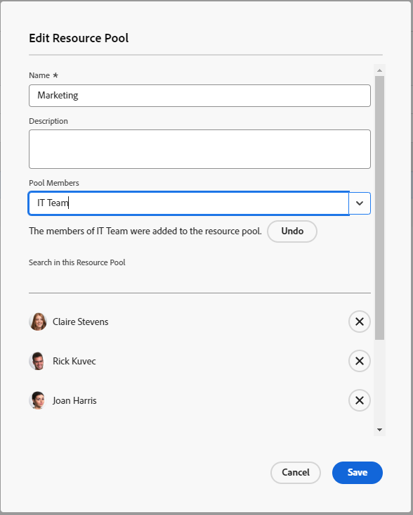

# Erstellen von Ressourcen-Pools {#create-resource-pools}

>[!CONTEXTUALHELP]
>id="wf_resource_pools"
>title="Ressourcenpools"
>abstract="Ein Ressourcenpool-Pool ist eine Sammlung von Benutzenden, die gleichzeitig für die Fertigstellung eines Projekts benötigt werden. Nachdem Sie einen Ressourcen-Pool erstellt haben, können Sie ihn mit Projekten und Vorlagen verknüpfen."

Ressourcenpools sind Sammlungen von Benutzern, mit denen Sie Ressourcen in Adobe Workfront einfacher verwalten können. Weitere Informationen zu Ressourcenpools finden Sie unter [Ressourcenpools - Übersicht](../../../resource-mgmt/resource-planning/resource-pools/work-with-resource-pools.md).

## Zugriffsanforderungen

+++ Erweitern Sie , um die Zugriffsanforderungen für die -Funktion in diesem Artikel anzuzeigen.

<table style="table-layout:auto"> 
 <col> 
 <col> 
 <tbody> 
  <tr> 
   <td>Adobe Workfront-Paket</td> 
   <td>
Beliebig
</td> 
  </tr> 
  <tr> 
   <td>Adobe Workfront-Lizenz</td> 
   <td>
Standard

   
Plan
</td>
  </tr> 
  <tr> 
   <td>Konfigurationen der Zugriffsebene</td> 
   <td> 
Bearbeiten des Zugriffs auf das Ressourcen-Management, der den Zugriff auf die Verwaltung von Ressourcenpools umfasst
 
Zugriff auf Projekte, Vorlagen und Benutzer bearbeiten
</td> 
  </tr> 
  <tr> 
   <td>Objektberechtigungen</td> 
   <td>Verwalten Sie Berechtigungen für die Projekte, Vorlagen und Benutzer, mit denen Sie die Ressourcenpools verknüpfen möchten</td> 
  </tr> 
 </tbody> 
</table>

Weitere Informationen finden Sie unter [Zugriffsanforderungen in der Dokumentation zu Workfront](/help/quicksilver/administration-and-setup/add-users/access-levels-and-object-permissions/access-level-requirements-in-documentation.md).

+++

## Ressourcenpool erstellen {#create-a-resource-pool}

{{step1-to-resourcing}}

1. Klicken Sie **linken Bedienfeld** Ressourcenpools“.
1. Klicken Sie **Neuer Ressourcenpool**.

   

1. Geben Sie Folgendes an:

   <table style="table-layout:auto">
    <col>
    <col>
    <tbody>
     <tr>
      <td role="rowheader"><strong>Name</strong></td>
      <td>Dies ist der Name des Ressourcenpools.</td>
     </tr>
     <tr>
      <td role="rowheader"><strong>Beschreibung</strong></td>
      <td>Dies ist eine kurze Beschreibung dieses Ressourcenpools. Sie können beispielsweise angeben, für welchen Zweck sie verwendet werden soll.</td>
     </tr>
     <tr>
      <td role="rowheader"><strong>Pool-Mitglieder</strong></td>
      <td>
 Fügen Sie Benutzer einzeln zum Ressourcenpool hinzu. Oder  So fügen Sie dem Ressourcenpool eine große Anzahl von Benutzern gleichzeitig hinzu. Sie können eine der folgenden Entitäten hinzufügen, die mit Benutzenden oder einer Sammlung von Benutzenden verknüpft sind:
        <ul>
         <li><strong>Teams</strong>: Alle Mitglieder des Teams werden dem Ressourcenpool hinzugefügt.</li>
         <li><strong>Groups</strong>: Alle Mitglieder der Gruppe werden dem Ressourcenpool hinzugefügt.</li>
         <li><strong>Rollen</strong>: Alle mit dieser Rolle verknüpften Benutzer werden dem Ressourcenpool hinzugefügt.</li>
         <li><strong>Unternehmen</strong>: Alle Benutzer im Unternehmen werden zum Ressourcenpool hinzugefügt.</li>
        </ul>
Tipp: Sie können nur aktive Benutzer, Teams, Rollen oder Unternehmen hinzufügen.
 Möglicherweise müssen Sie im Dialogfeld nach unten scrollen, um alle Benutzenden im Ressourcenpool anzuzeigen.
        
Hinweis: Wenn ein(e) Benutzende(r) Mitglied einer Gruppe, eines Teams oder einer Firma wird oder mit einem Aufgabengebiet verknüpft ist, nachdem die Gruppe, das Team, die Firma oder das Aufgabengebiet zum Ressourcenpool hinzugefügt wurde, wird das neue Mitglied nicht automatisch zum Ressourcenpool hinzugefügt.  Wenn ein Benutzer dem Team, der Gruppe, dem Unternehmen und dem Aufgabengebiet angehört, das Sie hinzufügen, wird der Benutzer nur einmal zum Ressourcenpool hinzugefügt. Benutzende, die deaktiviert werden, nachdem sie zum Ressourcenpool hinzugefügt wurden, werden in der Benutzerliste abgeblendet angezeigt und als deaktiviert markiert.

</td>
     </tr>
    </tbody>
   </table>

1. (Optional) Verwenden Sie den **Rückgängig**-Link, um die Benutzer zu entfernen, die über eine Gruppe, ein Team, ein Unternehmen oder ein Aufgabengebiet hinzugefügt wurden.

   >[!NOTE]
   >
   >Es gibt keine Begrenzung dafür, wie viele Benutzer Sie in einem Ressourcenpool haben können. Wir empfehlen jedoch, nicht zu viele Benutzer zu einem Ressourcenpool hinzuzufügen, da die Ressourcenverwaltung andernfalls eine Herausforderung werden könnte. Die Liste der Benutzer zeigt nur die ersten 2.000 Benutzer im Ressourcenpool an, und sie werden alphabetisch aufgelistet.

   

1. (Optional) Klicken Sie auf das X-Symbol rechts neben dem Namen eines Benutzers, um ihn zu entfernen. Weitere Informationen zum Entfernen von Benutzern aus einem Ressourcenpool finden Sie unter [Entfernen von Benutzern aus Ressourcenpools](../../../resource-mgmt/resource-planning/resource-pools/remove-users-from-resource-pool.md).
1. (Optional) Verwenden Sie die **Suche**, um einen Benutzer im Ressourcenpool zu finden.
1. Klicken Sie auf **Erstellen**.
