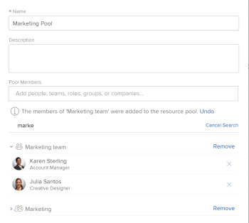

# Benutzer aus Ressourcen-Pools entfernen

{{preview-and-fast-release-Q424}}

Es gibt zwar keine Beschränkung dafür, wie viele Benutzer Sie in einem Ressourcenpool haben können, aber die Liste der Benutzer zeigt nur die ersten 2000 Benutzer an, die alphabetisch aufgelistet sind.

Es wird empfohlen, deaktivierte oder verschobene Rollen oder Abteilungen zu entfernen, um sicherzustellen, dass Sie in allen Ressourcen-Pools stets über eine genaue Liste der Benutzer verfügen.

Weitere Informationen zu Ressourcen-Pools finden Sie unter [Überblick über Ressourcen-Pools](../../../resource-mgmt/resource-planning/resource-pools/work-with-resource-pools.md).

## Zugriffsanforderungen

+++ Erweitern Sie , um die Zugriffsanforderungen für die Funktionalität in diesem Artikel anzuzeigen.

Sie müssen über folgenden Zugriff verfügen, um die Schritte in diesem Artikel ausführen zu können:

<table style="table-layout:auto"> 
 <col> 
 <col> 
 <tbody> 
  <tr> 
   <td role="rowheader">Adobe Workfront-Abo</td> 
   <td>
Neu: Beliebig

       
oder

       
Aktuell: Pro und höher
 </td> 
  </tr> 
  <tr> 
   <td role="rowheader">Adobe Workfront-Lizenz</td> 
   <td>
Neu: Standard

       
oder

       
Aktuell: Plan
</td>
  </tr> 
  <tr> 
   <td role="rowheader">Konfigurationen auf Zugriffsebene</td> 
   <td> 
Zugriff auf die Ressourcenverwaltung bearbeiten, einschließlich Zugriff auf Ressourcen-Pools verwalten
 
Anzeigen oder höherer Zugriff auf Benutzer
</td> 
  </tr> 
 </tbody> 
</table>

Weitere Informationen zu den Informationen in dieser Tabelle finden Sie unter [Zugriffsanforderungen in der Workfront-Dokumentation](/help/quicksilver/administration-and-setup/add-users/access-levels-and-object-permissions/access-level-requirements-in-documentation.md).

+++

## Entfernen von Benutzern aus einem Ressourcen-Pool

Sie können Benutzer aus einem Ressourcen-Pool entfernen, wenn diese Benutzer in diesem Pool nicht mehr benötigt werden.

So entfernen Sie einen Benutzer aus einem Ressourcen-Pool:

{{step1-to-resourcing}}

1. Klicken Sie im linken Bereich auf **Ressourcenpools** .
1. Wählen Sie einen Ressourcen-Pool aus und klicken Sie auf **Bearbeiten**.
Oder\
   Klicken Sie auf den Namen eines Ressourcen-Pools.

1. Beginnen Sie mit der Eingabe des Namens eines Benutzers, den Sie im Feld **Suche in diesem Ressourcen-Pool** entfernen möchten.\
   Oder\
   Beginnen Sie mit der Eingabe des Namens eines Unternehmens, einer Rolle im Job, eines Teams oder einer Gruppe, wenn Sie alle mit diesen Entitäten verknüpften Benutzer entfernen möchten.

   Beispielbild in der Vorschauumgebung:

   

   Beispielbild in der Produktionsumgebung:
   

1. Klicken Sie auf das Symbol &quot;x&quot;auf Benutzerebene, um einen Benutzer aus dem Ressourcen-Pool zu entfernen. Sie werden aus allen Listen entfernt, in denen sie angezeigt werden.\
   Oder\
   Um alle Benutzer zu entfernen, die mit einer Auftragsrolle, Gruppe, Gruppe oder Firma verbunden sind, klicken Sie auf der Auftrags-, Gruppen-, Team- oder Unternehmensebene auf **Entfernen** . Dadurch werden alle mit dieser Auftragsrolle, Gruppe, Gruppe oder Firma verknüpften Benutzer aus dem Ressourcen-Pool entfernt.

1. Klicken Sie auf **Speichern**.
