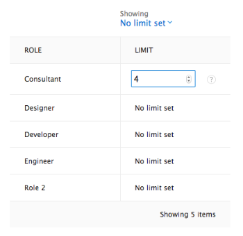

# Automatisch nicht zugewiesene Aufgaben und Probleme in den Planungsbereichen zuweisen

>[!IMPORTANT]
>  
>Die in diesem Artikel beschriebene Planungsfunktion wird seit der Version 23.1 im Januar 2023 nicht mehr unterstützt und aus Adobe Workfront entfernt.   
>  
>  Dieser Artikel wird auch kurz nach der Version 23.1 (Anfang 2023) entfernt. Zu diesem Zeitpunkt empfehlen wir, alle Lesezeichen entsprechend zu aktualisieren. 
> 
> Sie können jetzt den Lastenausgleich verwenden, um die Arbeit für Ihre Ressourcen zu planen. 
>  
> Informationen zum Planen von Ressourcen mit dem Lastenausgleich finden Sie im Abschnitt [Der Lastenausgleich](../../resource-mgmt/workload-balancer/workload-balancer.md). 

<!-- 

>[!CAUTION] 
> 
> 
> The information in this article refers to the Adobe Workfront's Scheduling tools. The Scheduling areas have been removed from the Preview environment and will be removed from the Production environment in **January 2023**.  
>  Instead, you can schedule resources in the Workload Balancer.  
> 
>*  For information about scheduling resources using the Workload Balancer, see the section [The Workload Balancer](../../resource-mgmt/workload-balancer/workload-balancer.md). 
> 
>*  For more information about the deprecation and removal of the Scheduling tools, see [Deprecation of Resource Scheduling tools in Adobe Workfront](../../resource-mgmt/resource-mgmt-overview/deprecate-resource-scheduling.md). 
-->

Bei Verwendung der Planungswerkzeuge können Sie es Adobe Workfront ermöglichen, aktuelle Arbeitsaufgaben für alle verfügbaren Benutzer zu analysieren und intelligente, logische Zuweisungen für alle Aufgaben oder Probleme vorzuschlagen, die noch nicht zugewiesen sind. Sie können alle vorgeschlagenen Zuweisungen vor ihrer Fertigstellung ändern.

Workfront untersucht die Aufgaben und Probleme, die im nicht zugewiesenen Bereich innerhalb des derzeit ausgewählten Datumsbereichs verfügbar sind, und schlägt Zuweisungen für jedes Element auf einmal vor. Sie können einen Filter erstellen, um die Anzahl der im Bereich Nicht zugewiesen verfügbaren Elemente zu begrenzen.

Ihr Systemadministrator bestimmt, wie Workfront die Verfügbarkeit von Ressourcen auf Systemebene berechnet (unter Berücksichtigung der Stunden und der FTE-Verfügbarkeit). Je nach dieser systemweiten Einstellung wird die Ressourcenverfügbarkeit entweder anhand des Standardzeitplans oder des Benutzerzeitplans berechnet. Weitere Informationen finden Sie unter [Konfigurieren der Berechnung der Ressourcenstunde und der FTE-Verfügbarkeit durch Workfront für den Planungsbereich](../../resource-mgmt/resource-scheduling/calculate-hours-fte-scheduling-area.md).

## Zugriffsanforderungen

Sie müssen über folgenden Zugriff verfügen, um die Schritte in diesem Artikel ausführen zu können:

<table style="table-layout:auto"> 
 <col> 
 <col> 
 <tbody> 
  <tr> 
   <td role="rowheader">Adobe Workfront-Plan*</td> 
   <td> 
Beliebig
 </td> 
  </tr> 
  <tr> 
   <td role="rowheader">Adobe Workfront-Lizenz*</td> 
   <td> 
Arbeit oder höher
 </td> 
  </tr> 
  <tr> 
   <td role="rowheader">Zugriffsebene*</td> 
   <td> 
Anzeigen oder höherer Zugriff auf Projekte, Aufgaben und Probleme
 
<strong>NOTIZ</strong>

Wenn Sie immer noch keinen Zugriff haben, fragen Sie Ihren Workfront-Administrator, ob er zusätzliche Zugriffsbeschränkungen für Ihre Zugriffsebene festlegt. Informationen dazu, wie ein Workfront-Administrator Ihre Zugriffsstufe ändern kann, finden Sie unter <a href="../../administration-and-setup/add-users/configure-and-grant-access/create-modify-access-levels.md" class="MCXref xref">Benutzerdefinierte Zugriffsebenen erstellen oder ändern</a>.
 </td>
</tr> 
  <tr> 
   <td role="rowheader">Objektberechtigungen</td> 
   <td> 
Beitragen Sie Berechtigungen oder höher zu den Projekten, Aufgaben und Problemen, für die Sie Zuweisungen aktualisieren.
 
Informationen zum Anfordern von zusätzlichem Zugriff finden Sie unter <a href="../../workfront-basics/grant-and-request-access-to-objects/request-access.md" class="MCXref xref">Zugriff auf Objekte anfordern </a>.
 </td> 
  </tr> 
 </tbody> 
</table>

*Wenden Sie sich an Ihren Workfront-Administrator, um zu erfahren, welchen Plan, welchen Lizenztyp oder welchen Zugriff Sie haben.

## Voraussetzungen {#prerequisites}

Workfront verwendet einen proprietären Algorithmus, um Zuweisungsvorschläge zu bestimmen. Um die bestmöglichen Ergebnisse zu erzielen, stellen Sie sicher, dass die folgenden Informationen in Workfront korrekt sind:

* Aufgaben- und Probleminformationen, einschließlich:

   * Rollenzuweisungen\
      Für Aufgaben und Probleme, die keiner Rolle zugewiesen sind, wird kein Vorschlag unterbreitet.
   * Geplante Stunden\
      Wenn eine Aufgabe oder ein Problem derzeit keine geplanten Stunden aufweist, geht Workfront bei der automatischen Zuweisung von Arbeit von 4 geplanten Arbeitsstunden pro Arbeitstag aus. Diese Stunden werden dem Arbeitselement nicht automatisch zugewiesen. werden nur verwendet, um eine realistischere Verteilung der Zuweisungen sicherzustellen.
   * Geplante Startdaten und geplante Abschlussdaten

* Benutzerinformationen, darunter:

   * Primäre und sekundäre Rollenzuweisungen für das Benutzerprofil
   * Team-Informationen des Projekts

## Konfigurieren von Rollenbeschränkungen

Rollenbeschränkungen steuern die Anzahl der Benutzer mit einer bestimmten Rolle, denen automatisch Aufgaben zugewiesen werden können. Rollenbeschränkungen arbeiten pro Projekt, um sicherzustellen, dass rollenbasierte Aufgaben nicht unter einer großen Anzahl von Benutzern verteilt werden.

In den folgenden Szenarien wird beschrieben, wie Rollenbeschränkungen für Projekte gelten:

* **Szenario 1**: Wenn dem Projektteam keine Benutzer zugewiesen sind, verwendet das System die Rollenbeschränkung, um Aufgaben zuzuweisen.\
   Sie haben beispielsweise ein Projekt ohne Benutzer, die dem Projektteam zugewiesen sind. Dieses Projekt umfasst zehn Projektverwaltungsaufgaben, die zugewiesen werden müssen. Für die Rolle &quot;Projektmanager&quot;wurde eine Rollenbeschränkung von 1 festgelegt. Das System weist alle 10 Aufgaben einem Projektmanager zu, da die Rollenbeschränkung auf 1 festgelegt ist.

* **Szenario 2**: Wenn die Rollenbegrenzung größer ist als die Anzahl der dem Projektteam zugewiesenen Benutzer, werden zusätzlichen Benutzern Aufgaben zugewiesen.\
   Sie haben beispielsweise ein Projekt mit einem Autor, der dem Projektteam zugewiesen ist. Dieses Projekt umfasst 12 Schreibaufgaben, die zugewiesen werden müssen. Für die Rolle &quot;Writer&quot;ist eine Rollenbeschränkung von 2 festgelegt. Das System weist alle 12 Aufgaben zwischen dem Autor des Projektteams und einem zusätzlichen Autor zu, da die Rollenbeschränkung auf 2 festgelegt ist.

* **Szenario 3**: Wenn die Rollenbegrenzung kleiner ist als die Anzahl der dem Projekt-Team zugewiesenen Benutzer, wird die Rollenbegrenzung überschrieben.\
   Sie haben beispielsweise ein Projekt mit vier Designern, die dem Projektteam zugewiesen sind. Dieses Projekt umfasst 8 Designeraufgaben, die zugewiesen werden müssen. Für die Designer-Rolle müssen Sie eine Rollenbeschränkung von 2 festgelegt haben. Das System weist alle 8 Aufgaben zwischen jedem der 4 Projekt-Teamentwickler zu, auch wenn die Rollenbegrenzung auf 2 festgelegt ist.

So legen Sie Beschränkungen für die Aufgabenrollenzuweisung fest:

1. Gehen Sie zur Zeitleiste für die Planung mehrerer Projekte oder einzelner Projekte:

   * **Für mehrere Projekte**:  Klicken Sie auf **Hauptmenü** icon  Klicken Sie oben rechts in Workfront auf **Ressourcen > Lastenausgleich**, wählen Sie **Planung** im Dropdown-Menü oben links.
   * **Für ein einzelnes Projekt**: Wechseln Sie zu einem Projekt, klicken Sie auf die **Lastenausgleich** im linken Bereich, und wählen Sie dann **Planung** aus dem Dropdown-Menü oben links.

1. Klicken Sie auf **Einstellungen** Symbol.\
   

1. Klicken Sie im Abschnitt &quot;Automatisierte Ressourcenplanung&quot;auf das **Limit** -Spalte mit dem Element im **Rolle** und geben Sie eine positive Zahl ein.\
   Workfront speichert Ihre Änderungen automatisch.

   >[!NOTE]
   >
   >Alle aktuellen Team-Mitglieder des Projekts haben unabhängig von der festgelegten Rollenbegrenzung automatisch Anspruch auf die gesamte empfohlene Arbeit.

   

1. (Optional) Klicken Sie auf die **Anzeigen** oben in der Spalte &quot;Limit&quot;und wählen Sie die gewünschten Anzeigeoptionen aus.
1. Um zum Bereich für die Ressourcenplanung zurückzukehren, klicken Sie auf **Zurück zur Planung**.

## Aufgaben und Probleme automatisch zuweisen

Sie können Benutzern in der Zeitleistensegment-Planung Aufgaben und Probleme zuweisen, unabhängig davon, ob Sie sich auf der Registerkarte Planung (beim Planen von Ressourcen für mehrere Projekte) oder auf der Registerkarte Strukturierung (beim Planen von Ressourcen für ein einzelnes Projekt) befinden.

Damit Workfront automatisch Zuweisungen für Aufgaben und Probleme im nicht zugewiesenen Bereich vorschlagen kann:

1. Gehen Sie zur Zeitleiste für die Planung mehrerer Projekte oder einzelner Projekte:

   * **Für mehrere Projekte**:  Klicken Sie auf **Hauptmenü** icon  Klicken Sie oben rechts in Workfront auf **Ressourcen > Lastenausgleich**, wählen Sie **Planung** im Dropdown-Menü oben links.
   * **Für ein einzelnes Projekt**: Wechseln Sie zu einem Projekt, klicken Sie auf die **Lastenausgleich** im linken Bereich, und wählen Sie dann **Planung** aus dem Dropdown-Menü oben links.

1. (Optional) Erstellen Sie einen Filter, um anzupassen, welcher Inhalt im Bereich Nicht zugewiesen auf der Zeitleistensegment der Planung angezeigt wird.\
   Weitere Informationen zum Erstellen eines Filters finden Sie unter [Filtern von Informationen im Bereich &quot;Planung&quot;](../../resource-mgmt/resource-scheduling/filter-scheduling-area.md#creating-and-modifying-filters-on-the-scheduling-tab-for-projects) in [Filtern von Informationen im Bereich &quot;Planung&quot;](../../resource-mgmt/resource-scheduling/filter-scheduling-area.md) [Filtern von Informationen im Bereich &quot;Planung&quot;](../../resource-mgmt/resource-scheduling/filter-scheduling-area.md)

   >[!TIP]
   >
   >So stellen Sie sicher, dass Workfront die Arbeit den am besten geeigneten Benutzern zuweist:
   >
   >* Filtern Sie nur Informationen, die sich auf die im nicht zugewiesenen Bereich angezeigten Aufgaben auswirken (z. B. Portfolios, Programme und Projekte).
   >* Es wird empfohlen, keine Informationen zu filtern, die sich darauf auswirken, welche Benutzer in der Zeitleistensegment der Planung zugewiesen werden können. Dadurch wird Workfront daran gehindert, alle potenziellen Bevollmächtigten zu sehen, was zu weniger zufriedenstellenden Zuweisungen führen kann.

1. (Optional) Ändern Sie den Datumsbereich, der auf der Zeitleistensegment der Planung angezeigt wird, wie unter [Datumsbereich der Planungsbereiche anpassen](../../resource-mgmt/resource-scheduling/get-started-resource-scheduling.md#adjusting-the-date-range-for-which-data-is-displayed) in [Erste Schritte mit der Ressourcenplanung](../../resource-mgmt/resource-scheduling/get-started-resource-scheduling.md). Workfront führt Zuweisungen nur für Aufgaben und Probleme innerhalb des sichtbaren Datumsbereichs in der Zeitplanungs-Timeline durch.

1. Klicken Sie auf **Auto** in der oberen rechten Ecke der Zeitplanungs-Timeline.\
   \
   Workfront schlägt Zuweisungen für jede Aufgabe oder jedes Thema im **Nicht zugewiesen** Bereich.

   >[!TIP]
   >
   >Aufgaben und Probleme müssen bereits einer Rolle zugewiesen sein, damit eine Zuweisung vorgeschlagen werden kann. Um die bestmöglichen Ergebnisse zu erzielen, sollten Aufgaben und Probleme die in [Voraussetzungen](#prerequisites).

   Die vorgeschlagenen Zuweisungen werden wie folgt durch eine gepunktete Übersicht über jede Aufgabe oder jedes Problem unterschieden:\
   **Vorgeschlagene Aufgabenzuweisung:**

   **Vorhandene Aufgabenzuweisung:**

1. (Optional) Sie können alle vorgeschlagenen oder vorhandenen Zuweisungen ändern, bevor Sie die Zuweisungen abschließen:

   >[!NOTE]
   >
   >Wenn Sie eine vorhandene Zuweisung ändern, wird sie in einen vorgeschlagenen Status geändert.

   * So weisen Sie einem anderen Benutzer ein Element zu:

      * Ziehen Sie die Aufgabe oder das Problem vom vorgeschlagenen Benutzer in die Zeile eines anderen Benutzers, den Sie zuweisen möchten.

         <!--      
        <MadCap:conditionalText data-mc-conditions="QuicksilverOrClassic.Draft mode">      
        (NOTE: lists in this article need to be reformatted and maybe split - too many levels in)      
        </MadCap:conditionalText>      
        -->

         Für einen bestimmten Benutzer werden maximal 10 Aufgaben pro Tag angezeigt. Sie können die Liste erweitern, um alle Aufgaben anzuzeigen, die diesem Benutzer derzeit zugewiesen sind. (Nach Durchführung von Zuweisungen in der Planung werden möglicherweise vorübergehend mehr als 10 Aufgaben angezeigt.)\
         Beim Ziehen eines Elements werden die folgenden Informationen angezeigt, bevor die Aufgabe oder das Problem freigegeben und die Zuweisung abgeschlossen wird:

         * In der Zeile des Benutzers wird ein Dropindikator angezeigt. Auf diese Weise können Sie sehen, wo ein Element vor der Zuweisung zugewiesen wird.
         * Wenn die Benutzerzuordnung in der Planung aktiviert ist, werden die roten Überzuordnungsanzeiger angezeigt, wenn der Benutzer nach Abschluss der Zuweisung übergeordnet wird.\
            Weitere Informationen zu Überverteilungsindikatoren finden Sie unter [Zuordnungsindikatoren](../../resource-mgmt/resource-scheduling/manage-allocations-scheduling-areas.md#understanding-allocation-indicators).

         * Benutzer, die für den Erhalt der Zuweisung nicht berechtigt sind, sind abgeblendet.
      * Erweitern Sie die Aufgabe oder das Problem, die/das Sie zuweisen möchten, und klicken Sie auf den Dropdown-Pfeil im **Zuweisungen** eingeben, den Namen des Benutzers eingeben, den Sie zuweisen möchten, und dann in der Dropdown-Liste auf den Namen des Benutzers klicken.\
         
   * Um die Zuweisung zu verzögern, ziehen Sie alle Aufgaben oder Probleme, die Sie noch nicht zum Zuweisen zum **Nicht zugewiesen** Bereich.

1. Klicken Sie auf **Zuweisungen vornehmen** -Schaltfläche am oberen Rand der Planungszeitleiste klicken, um die vorgeschlagenen Zuweisungen abzuschließen.\
   Oder\
   Klicken **Abbrechen** alle vorgeschlagenen Zuweisungen an ihre früheren Positionen zurückzugeben.
