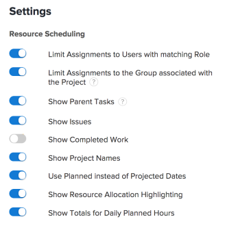

# Einstellungen in den Planungsbereichen konfigurieren

>[!IMPORTANT]
>  
>Die in diesem Artikel beschriebene Planungsfunktion wird seit der Version 23.1 im Januar 2023 nicht mehr unterstützt und aus Adobe Workfront entfernt.   
>  
>  Dieser Artikel wird auch kurz nach der Version 23.1 (Anfang 2023) entfernt. Zu diesem Zeitpunkt empfehlen wir, alle Lesezeichen entsprechend zu aktualisieren. 
> 
> Sie können jetzt den Lastenausgleich verwenden, um die Arbeit für Ihre Ressourcen zu planen. 
>  
> Informationen zum Planen von Ressourcen mit dem Lastenausgleich finden Sie im Abschnitt [Der Lastenausgleich](../../resource-mgmt/workload-balancer/workload-balancer.md). 

<!--  

>[!CAUTION] 
> 
> 
> The information in this article refers to the Adobe Workfront's Scheduling tools. The Scheduling areas have been removed from the Preview environment and will be removed from the Production environment in **January 2023**. 
>  Instead, you can schedule resources in the Workload Balancer.  
> 
>*  For information about scheduling resources using the Workload Balancer, see the section [The Workload Balancer](../../resource-mgmt/workload-balancer/workload-balancer.md). 
> 
>*  For more information about the deprecation and removal of the Scheduling tools, see [Deprecation of Resource Scheduling tools in Adobe Workfront](../../resource-mgmt/resource-mgmt-overview/deprecate-resource-scheduling.md). 
-->

Sie können verschiedene Einstellungen konfigurieren, um anzupassen, wie und welche Informationen in der Planung angezeigt werden.

## Zugriffsanforderungen

Sie müssen über folgenden Zugriff verfügen, um die Schritte in diesem Artikel ausführen zu können:

<table style="table-layout:auto"> 
 <col> 
 <col> 
 <tbody> 
  <tr> 
   <td role="rowheader">Adobe Workfront-Plan*</td> 
   <td> 
Beliebig
 </td> 
  </tr> 
  <tr> 
   <td role="rowheader">Adobe Workfront-Lizenz*</td> 
   <td> 
Arbeit oder höher
 </td> 
  </tr> 
  <tr> 
   <td role="rowheader">Zugriffsebene*</td> 
   <td> 
Anzeigen des Zugriffs oder höher auf Projekte, Aufgaben und Probleme
 
<b>NOTIZ</b>

Wenn Sie immer noch keinen Zugriff haben, fragen Sie Ihren Workfront-Administrator, ob er zusätzliche Zugriffsbeschränkungen für Ihre Zugriffsebene festlegt. Informationen dazu, wie ein Workfront-Administrator Ihre Zugriffsstufe ändern kann, finden Sie unter <a href="../../administration-and-setup/add-users/configure-and-grant-access/create-modify-access-levels.md" class="MCXref xref">Benutzerdefinierte Zugriffsebenen erstellen oder ändern</a>.
 </td>
</tr> 
  <tr> 
   <td role="rowheader">Objektberechtigungen</td> 
   <td> 
Beitragen von Berechtigungen oder höher zu Projekten, Aufgaben und Problemen
 
Informationen zum Anfordern von zusätzlichem Zugriff finden Sie unter <a href="../../workfront-basics/grant-and-request-access-to-objects/request-access.md" class="MCXref xref">Zugriff auf Objekte anfordern </a>.
 </td> 
  </tr> 
 </tbody> 
</table>

*Wenden Sie sich an Ihren Workfront-Administrator, um zu erfahren, welchen Plan, welchen Lizenztyp oder welchen Zugriff Sie haben.

## Konfigurieren von Problemen, die in der Planung angezeigt werden sollen

<!--

(NOTE: ALL THE SECTIONS BELOW ARE LINKED TO PRODUCT. DO NOT CHANGE TITLES) 

-->

Sie können festlegen, dass zusätzlich zu den Aufgaben in der Planung Probleme angezeigt werden.\
Beim Planen von Ressourcen im Abschnitt Planung für ein Team werden zusätzlich zu Aufgaben standardmäßig Probleme angezeigt. Beim Planen von Ressourcen für Projekte werden standardmäßig nur Aufgaben angezeigt.

1. Gehen Sie zur Zeitleiste für die Planung mehrerer Projekte, eines einzelnen Projekts oder eines Teams:

   * **Für mehrere Projekte**:  Klicken Sie auf **Hauptmenü** icon  Klicken Sie oben rechts in Workfront auf **Ressourcen > Lastenausgleich**, wählen Sie **Planung** im Dropdown-Menü oben links.
   * **Für ein einzelnes Projekt**: Wechseln Sie zu einem Projekt, klicken Sie auf die **Lastenausgleich** im linken Bereich, und wählen Sie dann **Planung** aus dem Dropdown-Menü oben links.
   * **Für ein Team**: Klicken Sie auf **Hauptmenü** icon  Klicken Sie oben rechts in Workfront auf **Teams**, wählen Sie ein Team aus, klicken Sie auf **Lastenausgleich** Wählen Sie im linken Bereich die Option **Planung** aus dem Dropdown-Menü oben links.

1. Klicken Sie auf **Einstellungen** auf der Zeitleiste der Planung.

1. Aktivieren Sie im Dialogfeld Einstellungen für die Ressourcenplanung die Option **Probleme anzeigen** -Option.\
   

1. Klicken **Zurück zur Planung**. 

## Konfigurieren abgeschlossener Arbeiten für die Anzeige in der Zeitplanungs-Timeline

Sie können die Planung so konfigurieren, dass bereits als abgeschlossen markierte Arbeiten angezeigt werden. Standardmäßig werden abgeschlossene Arbeiten nicht in der Planung angezeigt. 

1. Gehen Sie zur Zeitleiste für die Planung mehrerer Projekte, eines einzelnen Projekts oder eines Teams:

   * **Für mehrere Projekte**:  Klicken Sie auf **Hauptmenü** icon  Klicken Sie oben rechts in Workfront auf **Ressourcen > Lastenausgleich**, wählen Sie **Planung** im Dropdown-Menü oben links.
   * **Für ein einzelnes Projekt**: Wechseln Sie zu einem Projekt, klicken Sie auf die **Lastenausgleich** im linken Bereich, und wählen Sie dann **Planung** aus dem Dropdown-Menü oben links.
   * **Für ein Team**: Klicken Sie auf **Hauptmenü** icon  Klicken Sie oben rechts in Workfront auf **Teams**, wählen Sie ein Team aus, klicken Sie auf **Lastenausgleich** Wählen Sie im linken Bereich die Option **Planung** aus dem Dropdown-Menü oben links.

1. Klicken Sie auf **Einstellungen** auf der Zeitleiste der Planung.

1. Aktivieren Sie im Dialogfeld Einstellungen für die Ressourcenplanung die Option **Abgeschlossene Arbeit anzeigen** -Option.\
   

1. Klicken **Zurück zur Planung**.\
   Die abgeschlossene Arbeit wird mit einem Häkchen in der oberen rechten Ecke des Arbeitselements angezeigt.

## Konfigurieren von Projektnamen, die in der Zeitplanungs-Timeline angezeigt werden sollen 

Sie können den Projektnamen so konfigurieren, dass er für jede Aufgabe und jedes Problem in der Planung angezeigt wird. Auf diese Weise können Benutzer, die sich die Planung ansehen, schnell den Namen des Projekts anzeigen, in dem sich die Aufgabe oder das Problem befindet.

Wenn Sie die Anzeige von Projektnamen aktivieren, belegt jede Aufgabe und jedes Problem mehr vertikalen Platz in der Zeitleiste der Planung, was zu weniger Aufgaben und Problemen führt, die in einer einzigen Ansicht angezeigt werden.

Standardmäßig werden Projektnamen nicht für Aufgaben und Probleme in der Planung angezeigt.

So zeigen Sie Projektnamen zu Aufgaben und Problemen in der Planung an:

1. Gehen Sie zur Zeitleiste für die Planung für mehrere Projekte oder für ein Team:

   * **Für mehrere Projekte**:  Klicken Sie auf **Hauptmenü** icon  Klicken Sie oben rechts in Workfront auf **Ressourcen > Lastenausgleich**, wählen Sie **Planung** im Dropdown-Menü oben links.
   * **Für ein Team**: Klicken Sie auf **Hauptmenü** icon  Klicken Sie oben rechts in Workfront auf **Teams**, wählen Sie ein Team aus, klicken Sie auf **Lastenausgleich** Wählen Sie im linken Bereich die Option **Planung** aus dem Dropdown-Menü oben links.

1. Klicken Sie auf **Einstellungen** auf der Zeitleiste der Planung.

1. Aktivieren Sie im Dialogfeld Einstellungen für die Ressourcenplanung die Option, **Projektnamen anzeigen**.\
   

1. Klicken **Zurück zur Planung**.\
   Jede Aufgabe und jedes Problem in der Planung zeigt den Namen des Projekts an, in dem sich die Aufgabe oder das Problem befindet.\
   

## Konfigurieren der Anzeige der geplanten Daten in der Planung

Standardmäßig werden geplante Datumswerte in der Zeitplanungs-Timeline verwendet. Alternativ können Sie die Zeitleiste für die Planung so konfigurieren, dass sie die geplanten Daten verwendet.

Beachten Sie die folgenden Informationen zu geplanten und geplanten Daten:

* Geplante Daten für Aufgaben können manuell festgelegt oder automatisch festgelegt werden, je nach Aufgabenbegrenzung und Dauer. Weitere Informationen finden Sie in den Artikeln [Übersicht über Aufgabenbegrenzungen](../../manage-work/tasks/task-constraints/task-constraint-overview.md) und  [Übersicht über Aufgabendauer und -dauer](../../manage-work/tasks/taskdurtn/task-duration-and-duration-type.md) .

   Geplante Daten für Probleme werden von Benutzern manuell festgelegt. Der Systemadministrator kann jedoch Benutzer daran hindern, geplante Daten für Probleme anzupassen.

* Die geplanten Daten für Aufgaben und Probleme werden automatisch festgelegt. Weitere Informationen zu den geplanten Datumsangaben finden Sie in den Artikeln [Übersicht über das geplante Abschlussdatum für Projekte, Aufgaben und Probleme](../../manage-work/projects/planning-a-project/project-projected-completion-date.md).

>[!NOTE]
>
>Bei der Verwendung der geplanten Daten in der Zeitleiste der Planung können keine Informationen zur Benutzerzuordnung angezeigt werden. Weitere Informationen zu Benutzerzuweisungen finden Sie im Artikel [Nicht zugewiesene Aufgaben und Probleme manuell in den Planungsbereichen zuweisen](../../resource-mgmt/resource-scheduling/manually-assign-items-scheduling-areas.md).

So konfigurieren Sie die Planung so, dass Aufgaben und Probleme entsprechend den geplanten Daten angezeigt werden: 

1. Gehen Sie zur Zeitleiste für die Planung mehrerer Projekte, eines einzelnen Projekts oder eines Teams:

   * **Für mehrere Projekte**:  Klicken Sie auf **Hauptmenü** icon  Klicken Sie oben rechts in Workfront auf **Ressourcen > Lastenausgleich**, wählen Sie **Planung** im Dropdown-Menü oben links.
   * **Für ein einzelnes Projekt**: Wechseln Sie zu einem Projekt, klicken Sie auf die **Lastenausgleich** im linken Bereich, und wählen Sie dann **Planung** aus dem Dropdown-Menü oben links.
   * **Für ein Team**: Klicken Sie auf **Hauptmenü** icon  Klicken Sie oben rechts in Workfront auf **Teams**, wählen Sie ein Team aus, klicken Sie auf **Lastenausgleich** Wählen Sie im linken Bereich die Option **Planung** aus dem Dropdown-Menü oben links.

1. Klicken Sie auf **Einstellungen** auf der Zeitleiste der Planung.

1. Deaktivieren Sie im Dialogfeld Einstellungen für die Ressourcenplanung die **Verwenden Sie &quot;Geplant&quot;anstelle der geplanten Datumswerte.** -Option.
1. Klicken **Zurück zur Planung**.

## Konfigurieren der Anzeige von Benutzern in der Zeitleiste der Planung

>[!NOTE]
>
>Dieser Abschnitt gilt nur bei der Planung von Ressourcen für Teams (im Abschnitt Planung für ein Team ). Beim Planen von Ressourcen für mehrere Projekte (auf der Registerkarte Planung ) oder für ein einzelnes Projekt (auf der Registerkarte Strukturierung ) können Benutzer nicht alphabetisch angezeigt werden. sie sind immer nach Rolle organisiert.

Bei der Planung von Ressourcen für ein Team können Sie Benutzer so konfigurieren, dass sie entweder alphabetisch oder nach Rolle in der Planung angezeigt werden. Standardmäßig werden Benutzer alphabetisch angezeigt (Rollen werden nicht angezeigt).

1. Klicken Sie auf **Hauptmenü** icon  Klicken Sie oben rechts in Workfront auf Teams . Standardmäßig ist ein Team ausgewählt.

1. Klicken Sie auf **Einstellungen** auf der Zeitleiste der Planung.

1. Wählen Sie im Dialogfeld Einstellungen aus, ob die **Gruppe nach Rolle** -Option.\
   Wenn diese Option deaktiviert ist, werden die Benutzer in alphabetischer Reihenfolge angezeigt und die Rollen werden nicht in der Planung angezeigt.\
   Wenn diese Option aktiviert ist, werden die Rollen in der Planung angezeigt und die Benutzer werden in ihrer jeweiligen Rolle gruppiert. Wenn für einen bestimmten Benutzer mehrere Rollen im System definiert sind, wird dieser Benutzer mehrmals in der Zeitleiste der Planung unter jeder entsprechenden Rolle angezeigt.\
   

1. Klicken **Zurück zur Planung**.

## Konfigurieren, ob übergeordnete Aufgaben in der Planung angezeigt werden

<!--

(NOTE: This section is linked to the UI in a tooltip inside the Settings of the scheduler. do not rename/ remove/ edit the tag!! - Resource Scheduling (People> Scheduling>Settings>Show Parent Tasks tooltip)

-->

Übergeordnete Aufgaben werden abhängig von der Zeitleiste, auf die Sie zugreifen, unterschiedlich angezeigt. 

* [Anzeigen von übergeordneten Aufgaben für mehrere Projekte](#display-parent-tasks-for-multiple-projects)
* [Übergeordnete Aufgaben für ein Projekt oder ein Team anzeigen](#display-parent-tasks-for-a-project-or-a-team)

### Anzeigen von übergeordneten Aufgaben für mehrere Projekte {#display-parent-tasks-for-multiple-projects}

Bei der Planung von Ressourcen für mehrere Projekte im Abschnitt Planung hängt es von den folgenden Einstellungen ab, ob übergeordnete Aufgaben angezeigt werden oder nicht:

* Der Abschlussmodus des Projekts.
* Der Modus &quot;Zusammenfassung abgeschlossen&quot;des Projekts.
* Die Einstellung Übergeordnete Aufgaben anzeigen auf der Registerkarte Planung .

In der folgenden Tabelle werden die übergeordneten Aufgaben auf der Registerkarte Planung angezeigt und es wird nur die Unteraufgaben angezeigt. 

| **Festlegen übergeordneter Aufgaben anzeigen** | **Abschlussmodus des Projekts** | **Zusammenfassungsmodus des Projekts** | **Art der in der Zeitleiste der Planung angezeigten Aufgaben** |
|---|---|---|---|
| Deaktiviert | Manuell | Automatisch | Nur Unteraufgaben |
| Deaktiviert | Manuell | Manuell | Nur Unteraufgaben |
| Deaktiviert | Automatisch | Automatisch | Nur Unteraufgaben |
| Deaktiviert | Automatisch | Manuell | Nur Unteraufgaben |
| Aktiviert | Automatisch | Manuell | Unteraufgaben und übergeordnete Aufgaben |
| Aktiviert | Automatisch | Automatisch | Nur Unteraufgaben |
| Aktiviert | Manuell | Manuell | Unteraufgaben und übergeordnete Aufgaben |
| Aktiviert | Manuell | Automatisch | Nur Unteraufgaben |

Informationen zum Konfigurieren der **Abschlussmodus** und **Modus für Zusammenfassungsabschluss** -Felder für jedes Projekt finden Sie im Abschnitt &quot;Einstellungen&quot;im Artikel [Projekte bearbeiten](../../manage-work/projects/manage-projects/edit-projects.md).

Sie können die Einstellung &quot;Übergeordnete Aufgaben anzeigen&quot;im Abschnitt &quot;Planung&quot;für mehrere Projekte manuell konfigurieren. 

So konfigurieren Sie die Einstellung &quot;Übergeordnete Aufgaben anzeigen&quot;: 

1. Klicken Sie auf **Hauptmenü** icon  Klicken Sie oben rechts in Workfront auf **Ressourcen > Lastenausgleich**, wählen Sie **Planung** im Dropdown-Menü oben links.
1. Klicken Sie auf **Einstellungen** auf der Zeitleiste der Planung.

1. Wählen Sie im Dialogfeld Einstellungen für die Ressourcenplanung aus, ob die Option aktiviert werden soll. **Übergeordnete Aufgaben anzeigen.**
Wenn diese Option aktiviert ist, werden die übergeordneten Aufgaben aus allen Projekten gemäß dem Zusammenfassungsabschlussmodus und den Einstellungen für den Abschlussmodus der Projekte angezeigt, wie in der obigen Tabelle beschrieben. Diese Option ist standardmäßig aktiviert.
\
   

1. Klicken **Zurück zur Planung** in der linken unteren Ecke.

### Übergeordnete Aufgaben für ein Projekt oder ein Team anzeigen {#display-parent-tasks-for-a-project-or-a-team}

Ob beim Planen von Ressourcen im Abschnitt &quot;Staffing&quot;eines Projekts oder im Abschnitt &quot;Planung&quot;die übergeordneten Aufgaben angezeigt werden, hängt von den folgenden Einstellungen ab:

* Der Abschlussmodus des Projekts.
* Der Modus &quot;Zusammenfassung abgeschlossen&quot;des Projekts.

Informationen zum Konfigurieren der **Abschlussmodus** und **Modus für Zusammenfassungsabschluss** -Felder für jedes Projekt finden Sie im Abschnitt &quot;Einstellungen&quot;im Artikel [Projekte bearbeiten](../../manage-work/projects/manage-projects/edit-projects.md).

In der folgenden Tabelle wird beschrieben, wann die übergeordneten Aufgaben im Abschnitt &quot;Zuordnung&quot;eines Projekts oder im Abschnitt &quot;Zeitplan&quot;angezeigt werden und wann nur die Unteraufgaben angezeigt werden. 

| Abschlussmodus des Projekts | Zusammenfassungsmodus des Projekts | Art der Aufgaben, die im Bereich Planung angezeigt werden | Art der Aufgaben, die im Bereich Planung der Teams angezeigt werden |
|---|---|---|---|
| Manuell | Automatisch | Nur Unteraufgaben | Nur Unteraufgaben |
| Manuell | Manuell | Unteraufgaben und übergeordnete Aufgaben | Nur Unteraufgaben |
| Automatisch | Automatisch | Nur Unteraufgaben | Nur Unteraufgaben |
| Automatisch | Manuell | Unteraufgaben und übergeordnete Aufgaben | Nur Unteraufgaben |
| Automatisch | Manuell | Unteraufgaben und übergeordnete Aufgaben | Nur Unteraufgaben |
| Automatisch | Automatisch | Nur Unteraufgaben | Nur Unteraufgaben |
| Manuell | Manuell | Unteraufgaben und übergeordnete Aufgaben | Nur Unteraufgaben |
| Manuell | Automatisch | Nur Unteraufgaben | Nur Unteraufgaben |

## Konfigurieren, ob in der Zeitleiste der Planung tägliche geplante Stunden angezeigt werden

So konfigurieren Sie die Planung so, dass die täglichen Gesamtsummen für die geplanten Stunden für jeden Benutzer angezeigt werden: 

1. Gehen Sie zur Zeitleiste für die Planung mehrerer Projekte, eines einzelnen Projekts oder eines Teams:

   * **Für mehrere Projekte**:  Klicken Sie auf **Hauptmenü** icon  Klicken Sie oben rechts in Workfront auf **Ressourcen > Lastenausgleich**, wählen Sie **Planung** im Dropdown-Menü oben links.
   * **Für ein einzelnes Projekt**: Wechseln Sie zu einem Projekt, klicken Sie auf die **Lastenausgleich** im linken Bereich, und wählen Sie dann **Planung** aus dem Dropdown-Menü oben links.
   * **Für ein Team**: Klicken Sie auf **Hauptmenü** icon  Klicken Sie oben rechts in Workfront auf **Teams**, wählen Sie ein Team aus, klicken Sie auf **Lastenausgleich** Wählen Sie im linken Bereich die Option **Planung** aus dem Dropdown-Menü oben links.

1. Klicken Sie auf **Einstellungen** auf der Zeitleiste der Planung.

1. Aktivieren Sie im Dialogfeld Einstellungen die folgenden Optionen:

   *  **Gesamtwerte für geplante tägliche Stunden anzeigen**: Zeigt die Gesamtdauer der geplanten Stunden pro Tag für jeden Benutzer an.
   * **Markierung für Ressourcenzuordnung anzeigen**: Hebt die Zuordnung des Benutzers zu Aufgaben und Problemen hervor und zeigt die Tage an, an denen die Benutzer übergeordnet sind.\
      Diese Optionen sind standardmäßig deaktiviert.\
      

1. Klicken **Zurück zur Planung**.\
   Die Gesamtzahl der geplanten Stunden, die dem Benutzer zugeordnet sind, wird für jeden Tag angezeigt.\
   Die geplanten Stunden für die Tage, an denen der Benutzer überzugeordnet ist, sind rot hervorgehoben.\
   Weitere Informationen zu Benutzerzuweisungen finden Sie im Artikel [Nicht zugewiesene Aufgaben und Probleme manuell in den Planungsbereichen zuweisen](../../resource-mgmt/resource-scheduling/manually-assign-items-scheduling-areas.md).

## Konfigurieren, ob alle Benutzeraufgaben in der Zeitleiste der Planung angezeigt werden

>[!NOTE]
>
>Diese Option gilt nur bei der Planung von Ressourcen für einzelne Projekte (im Abschnitt Planung des Projekts ). Diese Option ist nicht verfügbar, wenn Sie Ressourcen für mehrere Projekte (im Abschnitt Planung ) oder für Teams (im Abschnitt Planung für ein Team ) planen.

So konfigurieren Sie, ob alle den einzelnen Benutzern zugewiesenen Aufgaben (nicht nur die Aufgaben, die mit dem angezeigten Projekt verknüpft sind) in der Planung angezeigt werden:

1. Wechseln Sie zu dem Projekt, in dem Sie die Planung konfigurieren möchten, um alle Aufgaben anzuzeigen, die jedem Benutzer zugewiesen sind.
1. Klicken Sie auf **Lastenausgleich** im linken Bereich (möglicherweise befindet er sich unter **Mehr anzeigen**), wählen Sie **Planung** aus dem Dropdown-Menü oben links.
1. Klicken Sie auf **Einstellungen** auf der Zeitleiste der Planung.

1. Wählen Sie im Bereich Einstellungen aus, ob die Option aktiviert werden soll. **Alle Benutzeraufgaben anzeigen**.\
   Wenn diese Option aktiviert ist, werden alle jedem Benutzer zugewiesenen Aufgaben in der Planung angezeigt, unabhängig davon, in welchem Projekt sich die Aufgaben befinden.\
   Diese Option ist standardmäßig deaktiviert.\
   

1. Klicken **Zurück zur Planung**.
