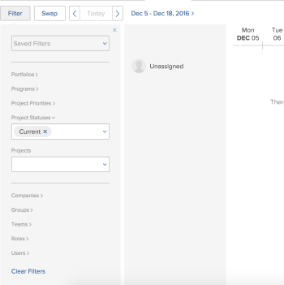

# Filtern von Informationen im Bereich &quot;Planung&quot;

>[!IMPORTANT]
>  
>Die in diesem Artikel beschriebene Planungsfunktion wird seit der Version 23.1 im Januar 2023 nicht mehr unterstützt und aus Adobe Workfront entfernt.   
>  
>  Dieser Artikel wird auch kurz nach der Version 23.1 (Anfang 2023) entfernt. Zu diesem Zeitpunkt empfehlen wir, alle Lesezeichen entsprechend zu aktualisieren. 
> 
> Sie können jetzt den Lastenausgleich verwenden, um die Arbeit für Ihre Ressourcen zu planen. 
>  
> Informationen zum Planen von Ressourcen mit dem Lastenausgleich finden Sie im Abschnitt [Der Lastenausgleich](../../resource-mgmt/workload-balancer/workload-balancer.md). 

<!-- 

>[!CAUTION] 
> 
> 
> The information in this article refers to the Adobe Workfront's Scheduling tools. The Scheduling areas have been removed from the Preview environment and will be removed from the Production environment in **January 2023**.   
>  Instead, you can schedule resources in the Workload Balancer.  
> 
>*  For information about scheduling resources using the Workload Balancer, see the section [The Workload Balancer](../../resource-mgmt/workload-balancer/workload-balancer.md). 
> 
>*  For more information about the deprecation and removal of the Scheduling tools, see [Deprecation of Resource Scheduling tools in Adobe Workfront](../../resource-mgmt/resource-mgmt-overview/deprecate-resource-scheduling.md). 
-->

<!--

(SEVERAL SECTIONS BELOW LINKED TO THE PRODUCT. SEE NOTES

-->

Mithilfe eines Filters im Bereich &quot;Ressourcenplanung&quot;können Sie bestimmen, welche Arbeitselemente in der Zeitleiste der Planung angezeigt werden. Dazu gehören die Aufgaben und Probleme, die im nicht zugewiesenen Bereich angezeigt werden, sowie die Benutzer, die angezeigt werden.

Bevor Sie mit dem Filtern von Inhalten wie in diesem Abschnitt beschrieben beginnen, sollten Sie sich mit der Funktionsweise der Ressourcenplanung in Adobe Workfront vertraut machen.\
Informationen zur Ressourcenplanung in Workfront finden Sie im Artikel [Erste Schritte mit der Ressourcenplanung](../../resource-mgmt/resource-scheduling/get-started-resource-scheduling.md).\
Weitere Informationen zur Planung finden Sie im Artikel [Erste Schritte mit der Ressourcenplanung](../../resource-mgmt/resource-scheduling/get-started-resource-scheduling.md).

Sie können Ressourcen oder ein einzelnes Team, dem Sie angehören, oder für Projekte planen, für die Sie Ressourcen-Manager sind.

## Zugriffsanforderungen

Sie müssen über Folgendes verfügen:

<table style="table-layout:auto"> 
 <col> 
 <col> 
 <tbody> 
  <tr> 
   <td role="rowheader">Adobe Workfront-Plan*</td> 
   <td> 
Beliebig
 </td> 
  </tr> 
  <tr> 
   <td role="rowheader">Adobe Workfront-Lizenz*</td> 
   <td> 
Arbeit oder höher
 </td> 
  </tr> 
  <tr> 
   <td role="rowheader">Zugriffsebene*</td> 
   <td> 
Anzeigen des Zugriffs oder höher auf Projekte, Aufgaben und Probleme
 
<b>NOTIZ</b>

Wenn Sie immer noch keinen Zugriff haben, fragen Sie Ihren Workfront-Administrator, ob er zusätzliche Zugriffsbeschränkungen für Ihre Zugriffsebene festlegt. Informationen dazu, wie ein Workfront-Administrator Ihre Zugriffsstufe ändern kann, finden Sie unter <a href="../../administration-and-setup/add-users/configure-and-grant-access/create-modify-access-levels.md" class="MCXref xref">Benutzerdefinierte Zugriffsebenen erstellen oder ändern</a>.
 </td>
</tr> 
  <tr> 
   <td role="rowheader">Objektberechtigungen</td> 
   <td> 
Anzeigen von Berechtigungen oder höher für Projekte, Aufgaben und Probleme
 
Informationen zum Anfordern von zusätzlichem Zugriff finden Sie unter <a href="../../workfront-basics/grant-and-request-access-to-objects/request-access.md" class="MCXref xref">Zugriff auf Objekte anfordern </a>.
 </td> 
  </tr> 
 </tbody> 
</table>

*Wenden Sie sich an Ihren Workfront-Administrator, um zu erfahren, welchen Plan, welchen Lizenztyp oder welchen Zugriff Sie haben.

<!--

(NOTE: sections below - LINKED TO THE ui. DO NOT RENAME/ DELETE)

-->

## Erstellen Sie einen Filter im Bereich Zeitplan (für Teams).

Aufgaben und Probleme aus den Projekten, Benutzern und Rollen, die Sie im Filter definieren, werden auf der Registerkarte &quot;Arbeiten am&quot;in der Zeitleiste der Planung angezeigt. Verwenden Sie die Optionen im Filter, um zu bestimmen, welche Projekte, Benutzer und Rollen in der Zeitleiste der Planung dargestellt werden.

>[!NOTE]
>
>Filter können nicht auf der Registerkarte &quot;Arbeiten auf&quot;(für ein Team) gespeichert werden. Wenn Sie die Seite aktualisieren oder von ihr weg navigieren, kehrt der Filter zu den Standardeinstellungen zurück.

So erstellen Sie einen Filter für die Zeitleiste der Planung auf der Registerkarte Arbeiten am für Teams:

1. Klicken Sie auf **Hauptmenü** icon  Klicken Sie oben rechts in Workfront auf **Teams**, wählen Sie ein Team aus, klicken Sie auf **Lastenausgleich** Wählen Sie im linken Bereich die Option **Planung** aus dem Dropdown-Menü oben links.
1. Klicken **Filter**.
1. Bestimmen Sie, welche Projekte im nicht zugewiesenen Bereich dargestellt werden, indem Sie die folgenden Informationen angeben:

   <!--
   
(NOTE: Alina: there was a note that [This step is linked to from the context-sensitive help] but I could not find from where in the UI it is linked.)&nbsp;

   -->

   * **Projektprioritäten:** Wählen Sie die Priorität der Projekte aus, die Sie in der Planung darstellen möchten. Aufgaben und Probleme aus Projekten mit den von Ihnen ausgewählten Prioritäten werden in der Planung angezeigt.\
      In diesem Menü können Sie nur Prioritäten aus Projekten auswählen, die Aufgaben oder dem Team zugewiesene Probleme enthalten.
   * **Projektstatus:** Wählen Sie den Status der Projekte aus, die Sie in der Planung darstellen möchten. Aufgaben und Probleme aus Projekten mit dem von Ihnen ausgewählten Status werden in der Planung angezeigt.\
      In diesem Menü können Sie nur Status von Projekten auswählen, die Aufgaben oder dem Team zugewiesene Probleme enthalten.
   * **Projekte:** Wählen Sie alle Projekte aus, die Sie in der Planung darstellen möchten. Aufgaben und Probleme aus den ausgewählten Projekten werden in der Planung angezeigt.\
      Ihre Auswahl in den vorherigen Feldern bestimmt die Projekte, die ausgewählt werden können.\
      In diesem Menü können Sie nur Projekte auswählen, die Aufgaben oder Probleme enthalten, die dem Team zugewiesen sind.

1. Bestimmen Sie, welche Benutzer in der Planung angezeigt werden, indem Sie die folgenden Informationen angeben. Standardmäßig werden alle Teammitglieder angezeigt.

   <!--
   
(NOTE: this step is linked in the UI.)

   -->

   * **Rollen:** Wählen Sie die Rollen aus, die in der Planung dargestellt werden sollen.\
      Im Bereich Nicht zugewiesen werden nur Aufgaben angezeigt, die dieser Rolle zugewiesen sind. Es werden nur Benutzer mit den ausgewählten Rollen angezeigt, denen diese Aufgaben zugewiesen werden können.\
      Benutzer werden in der Zeitleiste der Planung angezeigt, organisiert nach Auftragsrolle.
   * **Benutzer:** Wählen Sie die einzelnen Benutzer aus, die in der Planung dargestellt werden sollen.\
      Es werden nur die von Ihnen ausgewählten Benutzer angezeigt, unabhängig davon, ob sie über eine Rollenzuweisung verfügen, die der Rollenzuweisung von Aufgaben im nicht zugewiesenen Bereich entspricht.\
      Diese Option hat keine Auswirkungen darauf, welche Aufgaben und Probleme im Bereich Nicht zugewiesen angezeigt werden.

      <!--   
     
(NOTE: Alina: [! Users with Plan, Work, or Review licenses are available. Users with Request licenses are not available. - This is what it used to say. I think now instead you select specific users, not license types.])
   
     -->

1. (Optional) Weitere Änderungen an der Planungszeitleiste (z. B. Änderung des Datumsbereichs) und Änderungen an Benutzerzuweisungen finden Sie im Artikel [Nicht zugewiesene Aufgaben und Probleme manuell in den Planungsbereichen zuweisen](../../resource-mgmt/resource-scheduling/manually-assign-items-scheduling-areas.md).

<!--

(NOTE: below - LINKED TO THE UI, DO NOT RENAME/ DELETE/ CHANGE)

-->

## Erstellen und Ändern von Filtern im Bereich Planung (für mehrere Projekte)

Sie können einen neuen Filter erstellen, einen zuvor erstellten Filter anwenden, einen zuvor erstellten Filter ändern oder einen Filter löschen. Sie können keine von Ihnen erstellten Filter für andere Benutzer freigeben.

* [Erstellen Sie im Bereich Planung einen Filter (für Projekte).](#create-a-filter-in-the-scheduling-section-for-projects)
* [Anwenden eines gespeicherten Filters](#apply-a-saved-filter)
* [Speichern Filter ändern](#modify-a-saved-filter)
* [Löschen gespeicherter Filter](#delete-a-saved-filter)

### Erstellen Sie im Bereich Planung einen Filter (für Projekte). {#create-a-filter-in-the-scheduling-section-for-projects}

<!--

(NOTE: *****LINKED TO THE PRODUCT FROM THE GLOBAL SCHEDULER >> BOTH THE FIRST AND THE SECOND AREAS) 

-->

Aufgaben und Probleme aus den Projekten, Benutzern und Rollen, die Sie im Filter definieren, werden auf der Registerkarte &quot;Planung&quot;in der Timeline der Planung angezeigt. Verwenden Sie die Optionen im Filter, um zu bestimmen, welche Projekte, Benutzer und Rollen in der Zeitleiste der Planung dargestellt werden.

So erstellen Sie auf der Registerkarte Planung einen Filter für die Planung von mehreren Projekten:

1. Klicken Sie auf **Hauptmenü** icon  Klicken Sie oben rechts in Workfront auf **Ressourcen > Lastenausgleich**, wählen Sie **Planung** im Dropdown-Menü oben links.
1. Klicken **Filter**.\
   

1. Lassen Sie die **Gespeicherte Filter** Feld leer.
1. Bestimmen Sie, welche Projekte im nicht zugewiesenen Bereich dargestellt werden, indem Sie die folgenden Informationen angeben:

   <!--
   
(NOTE: Alina: this step is linked in the UI.) 

   -->

   * **Portfolios:** Wählen Sie alle Portfolios aus, die Programme und Projekte enthalten, die Sie in der Planung darstellen möchten.

      Es sind nur Programme innerhalb der Portfolios verfügbar, die Sie auswählen. **Programm** -Feld.

   * **Programme:** Wählen Sie alle Programme aus, die Projekte enthalten, die Sie in der Planung darstellen möchten.\
      Ihre Auswahl in der **Portfolio** bestimmen, welche Programme ausgewählt werden können.\
      Es können nur Projekte innerhalb der von Ihnen ausgewählten Programme im **Projekte** -Feld.

   * **Projektprioritäten:** Wählen Sie die Priorität der Projekte aus, die Sie in der Planung darstellen möchten.\
      Es werden nur Projekte mit den von Ihnen ausgewählten Prioritäten vertreten.

   * **Projektstatus:** Wählen Sie den Status der Projekte aus, die Sie in der Planung darstellen möchten.\
      Es werden nur Projekte mit dem Status dargestellt, den Sie auswählen.

   * **Projektunternehmen:** Aufgaben und Probleme werden nur dann in der Planung angezeigt, wenn sie zu einem Projekt gehören, das mit einem ausgewählten Unternehmen übereinstimmt.

   * **Projektgruppen:** Aufgaben und Probleme werden nur dann in der Planung angezeigt, wenn sie zu einem Projekt gehören, das mit einer von Ihnen ausgewählten Gruppe übereinstimmt.

   * **Projekte:** Wählen Sie alle Projekte aus, die Sie in der Planung darstellen möchten. Aufgaben und Probleme aus den ausgewählten Projekten werden in der Planung angezeigt.\
      Ihre Auswahl in den vorherigen Feldern bestimmt die Projekte, die ausgewählt werden können.\
      Aufgaben und Probleme aus den ausgewählten Projekten werden in der Planung angezeigt. In diesem Menü können Sie nur Projekte auswählen, die Aufgaben oder Probleme enthalten, die dem Team zugewiesen sind.

1. Bestimmen Sie, welche Benutzer in der Planung angezeigt werden, indem Sie die folgenden Informationen angeben: (Standardmäßig werden nur Benutzer angezeigt, denen aus dem Bereich Nicht zugewiesen eine Aufgabe oder ein Problem zugewiesen werden kann. Wenn Sie einzelne Benutzer auswählen, werden die Benutzer in der Zeitleiste der Planung angezeigt, unabhängig davon, ob sie berechtigt sind, eine Aufgabe oder ein Problem aus dem Bereich Nicht zugewiesen zu erhalten.) 

   <!--
   
(NOTE: Alina: this step had a note that it is linked in the UI but I could not find from where.) 

   -->

   * **Benutzerunternehmen:** In diesem Feld können Sie Benutzer anderer Unternehmen daran hindern, in der Planung angezeigt zu werden.\
      Lassen Sie dieses Feld leer, wenn Benutzer aus einem beliebigen Unternehmen hinzugefügt werden sollen. Wenn Sie einzelne Unternehmen angeben, können nur Benutzer dieser Unternehmen zur Planung hinzugefügt werden. Wenn Sie ein Unternehmen angeben, werden Benutzer von diesem Unternehmen nicht automatisch zur Planung hinzugefügt. Verwenden Sie stattdessen die unten stehenden Felder, um bestimmte Benutzer hinzuzufügen.\
      Diese Option hat keine Auswirkungen darauf, welche Aufgaben und Probleme im Bereich Nicht zugewiesen angezeigt werden.****

   * **Benutzergruppen:** Alle Benutzer einer beliebigen Benutzergruppe, die Sie angeben, werden in der Planung angezeigt.

   * **Teams:** Alle Benutzer eines von Ihnen angegebenen Teams werden in der Planung angezeigt.\
      Diese Option hat keine Auswirkungen darauf, welche Aufgaben und Probleme im Bereich Nicht zugewiesen angezeigt werden.

   * **Rollen:** Wählen Sie die Rollen aus, die in der Planung dargestellt werden sollen.\
      Im Bereich Nicht zugewiesen werden nur Aufgaben angezeigt, die dieser Rolle zugewiesen sind. Es werden nur Benutzer mit den ausgewählten Rollen angezeigt, denen diese Aufgaben zugewiesen werden können.\
      Benutzer werden in der Zeitleiste der Planung angezeigt, organisiert nach Auftragsrolle.

   * **Benutzer:** Wählen Sie die einzelnen Benutzer aus, die in der Planung dargestellt werden sollen.\
      Es werden nur die von Ihnen ausgewählten Benutzer angezeigt, unabhängig davon, ob sie über eine Rollenzuweisung verfügen, die der Rollenzuweisung von Aufgaben im nicht zugewiesenen Bereich entspricht.\
      Diese Option hat keine Auswirkungen darauf, welche Aufgaben und Probleme im Bereich Nicht zugewiesen angezeigt werden.
   <!--
   
NOTE: [! Users with Plan, Work, or Review licenses are available. Users with Request licenses are not available. - This is what it used to say. I think now instead you select specific users, not license types.]) 

   -->

1. Klicken **Neuen Filter speichern**.\
   Ihre Daten werden in der Planung angezeigt.

1. (Optional) Weitere Änderungen an der Planungszeitleiste (z. B. Änderung des Datumsbereichs) und Änderungen an Benutzerzuweisungen finden Sie im Artikel [Nicht zugewiesene Aufgaben und Probleme manuell in den Planungsbereichen zuweisen](../../resource-mgmt/resource-scheduling/manually-assign-items-scheduling-areas.md).

### Anwenden eines gespeicherten Filters {#apply-a-saved-filter}

>[!NOTE]
>
>Diese Option gilt nur bei der Planung von Ressourcen für mehrere Projekte (im Tab Planung ). Sie können keinen gespeicherten Filter anwenden, wenn Sie Ressourcen für ein Team planen (auf der Registerkarte &quot;Arbeiten am&quot;) oder wenn Sie Ressourcen für ein einzelnes Projekt planen (auf der Registerkarte &quot;Staffelung&quot;).

Sie können einen zuvor erstellten Filter anwenden.

So wenden Sie einen gespeicherten Filter für mehrere Projekte an:

1. Klicken Sie auf **Hauptmenü** icon  Klicken Sie oben rechts in Workfront auf **Ressourcen > Lastenausgleich**, wählen Sie **Planung** im Dropdown-Menü oben links.
1. Klicken **Filter**.
1. Im **Gespeicherte Filter** auswählen, den anzuwendenden Filter.\
   Ihre Daten werden in der Planung angezeigt.

1. (Optional) Weitere Änderungen an der Planungszeitleiste (z. B. Änderung des Datumsbereichs) und Änderungen an Benutzerzuweisungen finden Sie im Artikel [Nicht zugewiesene Aufgaben und Probleme manuell in den Planungsbereichen zuweisen](../../resource-mgmt/resource-scheduling/manually-assign-items-scheduling-areas.md).

### Speichern Filter ändern {#modify-a-saved-filter}

>[!NOTE]
>
>Diese Option gilt nur bei der Planung von Ressourcen für mehrere Projekte (im Tab Planung ). Sie können einen gespeicherten Filter nicht ändern, wenn Sie Ressourcen für ein Team planen (auf der Registerkarte &quot;Arbeiten am&quot;) oder wenn Sie Ressourcen für ein einzelnes Projekt planen (auf der Registerkarte &quot;Staffelung&quot;).

Sie können einen zuvor erstellten Filter ändern.

So ändern Sie einen gespeicherten Filter für mehrere Projekte:

1. Klicken Sie auf **Hauptmenü** icon  Klicken Sie oben rechts in Workfront auf **Ressourcen > Lastenausgleich**, wählen Sie **Planung** im Dropdown-Menü oben links.
1. Klicken **Filter**.
1. Im **Gespeicherte Filter** auswählen, wählen Sie aus der Dropdown-Liste den zu ändernden Filter aus.
1. Geben Sie an, welche Daten in der Zeitplanungs-Timeline angezeigt werden sollen.
1. Klicken Sie auf **Speichern**.\
   Ihre Daten werden in der Planung angezeigt.

1. (Optional) Weitere Änderungen an der Planungszeitleiste (z. B. Änderung des Datumsbereichs) und Änderungen an Benutzerzuweisungen finden Sie im Artikel [Nicht zugewiesene Aufgaben und Probleme manuell in den Planungsbereichen zuweisen](../../resource-mgmt/resource-scheduling/manually-assign-items-scheduling-areas.md).

### Löschen gespeicherter Filter {#delete-a-saved-filter}

>[!NOTE]
Diese Option gilt nur bei der Planung von Ressourcen für mehrere Projekte (im Tab Planung ). Sie können einen gespeicherten Filter nicht löschen, wenn Sie Ressourcen für ein Team planen (auf der Registerkarte &quot;Arbeiten am&quot;) oder wenn Sie Ressourcen für ein einzelnes Projekt planen (auf der Registerkarte &quot;Staffelung&quot;).

Sie können einen zuvor erstellten Filter löschen.

1. Klicken Sie auf **Hauptmenü** icon  Klicken Sie oben rechts in Workfront auf **Ressourcen > Lastenausgleich**, wählen Sie **Planung** im Dropdown-Menü oben links.
1. Klicken **Filter**.
1. Im **Gespeicherte Filter** Klicken Sie in der Dropdown-Liste neben dem Filter, den Sie löschen möchten, auf das Symbol (x). 

## Erstellen und Ändern von Filtern im Bereich Planung (für ein einzelnes Projekt)

<!--

(NOTE: **** LINKED FROM THE PRODUCT FROM THE PROJECT> STAFFING> SCHEDULING AREA) 

-->

Aufgaben und Probleme von Benutzern, Teams und Rollen, die Sie im Filter definieren, werden in der Zeitleiste der Planung auf der Registerkarte &quot;Formatierung&quot;angezeigt. Verwenden Sie die Optionen im Filter, um zu bestimmen, welche Benutzer, Teams und Rollen in der Zeitleiste der Planung dargestellt werden.

>[!NOTE]
Filter können nicht auf der Registerkarte &quot;Stiftierung&quot;(für ein einzelnes Projekt) gespeichert werden. Wenn Sie die Seite aktualisieren oder von ihr weg navigieren, kehrt der Filter zu den Standardeinstellungen zurück.

So erstellen Sie für einzelne Projekte auf der Registerkarte &quot;Staffelung&quot;einen Filter für die Planung:

1. Wechseln Sie zu einem Projekt, klicken Sie auf die **Lastenausgleich** im linken Bereich, und wählen Sie dann **Planung** aus dem Dropdown-Menü oben links.
1. Bestimmen Sie, welche Benutzer in der Planung angezeigt werden, indem Sie die folgenden Informationen angeben: (Standardmäßig werden nur Benutzer angezeigt, denen aus dem Bereich Nicht zugewiesen eine Aufgabe oder ein Problem zugewiesen werden kann. Wenn Sie einzelne Benutzer auswählen, werden die Benutzer in der Zeitleiste der Planung angezeigt, unabhängig davon, ob sie berechtigt sind, eine Aufgabe oder ein Problem aus dem Bereich Nicht zugewiesen zu erhalten.) 

   <!--
   
(NOTE: Alina: [This step is linked to from the context-sensitive help])  

   -->

   * **Benutzerunternehmen:** In diesem Feld können Sie Benutzer anderer Unternehmen daran hindern, in der Planung angezeigt zu werden.\
      Lassen Sie dieses Feld leer, wenn Benutzer aus einem beliebigen Unternehmen hinzugefügt werden sollen. Wenn Sie einzelne Unternehmen angeben, können nur Benutzer dieser Unternehmen zur Planung hinzugefügt werden. Wenn Sie ein Unternehmen angeben, werden Benutzer von diesem Unternehmen nicht automatisch zur Planung hinzugefügt. Verwenden Sie stattdessen die unten stehenden Felder, um bestimmte Benutzer hinzuzufügen.\
      Diese Option hat keine Auswirkungen darauf, welche Aufgaben und Probleme im Bereich Nicht zugewiesen angezeigt werden.

   * **Benutzergruppen:** Alle Benutzer einer beliebigen Benutzergruppe, die Sie angeben, werden in der Planung angezeigt.

   * **Teams:** Alle Benutzer eines von Ihnen angegebenen Teams werden in der Planung angezeigt.\
      Diese Option hat keine Auswirkungen darauf, welche Aufgaben und Probleme im Bereich Nicht zugewiesen angezeigt werden.

   * **Rollen:** Wählen Sie die Rollen aus, die in der Planung dargestellt werden sollen.\
      Im Bereich Nicht zugewiesen werden nur Aufgaben angezeigt, die dieser Rolle zugewiesen sind. Es werden nur Benutzer mit den ausgewählten Rollen angezeigt, denen diese Aufgaben zugewiesen werden können.\
      Benutzer werden in der Zeitleiste der Planung angezeigt, organisiert nach Auftragsrolle.

   * **Benutzer:** Wählen Sie die einzelnen Benutzer aus, die in der Planung dargestellt werden sollen.\
      Es werden nur die von Ihnen ausgewählten Benutzer angezeigt, unabhängig davon, ob sie über eine Rollenzuweisung verfügen, die der Rollenzuweisung von Aufgaben im nicht zugewiesenen Bereich entspricht.\
      Diese Option hat keine Auswirkungen darauf, welche Aufgaben und Probleme im Bereich Nicht zugewiesen angezeigt werden.
   <!--
   
(NOTE: [! Users with Plan, Work, or Review licenses are available. Users with Request licenses are not available. - This is what it used to say. I think now instead you select specific users, not license types.]) 

   -->
