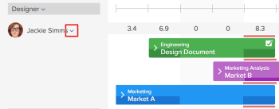
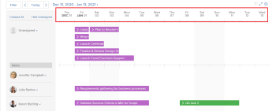

# Erste Schritte mit der Ressourcenplanung

>[!IMPORTANT]
>  
>Die in diesem Artikel beschriebene Planungsfunktion wird seit der Version 23.1 im Januar 2023 nicht mehr unterstützt und aus Adobe Workfront entfernt.   
>  
>  Dieser Artikel wird auch kurz nach der Version 23.1 (Anfang 2023) entfernt. Zu diesem Zeitpunkt empfehlen wir, alle Lesezeichen entsprechend zu aktualisieren. 
> 
> Sie können jetzt den Lastenausgleich verwenden, um die Arbeit für Ihre Ressourcen zu planen. 
>  
> Informationen zum Planen von Ressourcen mit dem Lastenausgleich finden Sie im Abschnitt [Der Lastenausgleich](../../resource-mgmt/workload-balancer/workload-balancer.md). 

<!--  

>[!CAUTION] 
> 
> 
> The information in this article refers to the Adobe Workfront's Scheduling tools. The Scheduling areas have been removed from the Preview environment and will be removed from the Production environment in **January 2023**.   
>  Instead, you can schedule resources in the Workload Balancer.  
> 
>*  For information about scheduling resources using the Workload Balancer, see the section [The Workload Balancer](../../resource-mgmt/workload-balancer/workload-balancer.md). 
> 
>*  For more information about the deprecation and removal of the Scheduling tools, see [Deprecation of Resource Scheduling tools in Adobe Workfront](../../resource-mgmt/resource-mgmt-overview/deprecate-resource-scheduling.md). 
-->

<!--

(NOTE: LINKED TO THE PRODUCT FROM: ALL SCHEDULING TOOLS: GLOBAL, TEAM, PROJECT STAFFING *** LINKED TO LOTS OF ARTICLES, AS WELL!) 

(NOTE: Alina: this article should be divided in multiple articles, but CAREFULLY because some sections are linked to the UI)

-->

Bei Verwendung der Ressourcenplanungs-Funktion in Adobe Workfront können Sie den entsprechenden Benutzern Aufgaben und Probleme leichter zuweisen. Sie können festlegen, welche Benutzer die Aufgabe oder das Problem ausführen können, wobei sowohl die Rolle des Auftrags als auch die Verfügbarkeit des Benutzers berücksichtigt werden.

In den folgenden Abschnitten finden Sie weitere Details zur Verwendung der Planungsbereiche in Workfront.

## Voraussetzungen für die Verwendung der Planungswerkzeuge in Workfront

>[!IMPORTANT]
>
>Die in diesem Artikel beschriebenen Voraussetzungen gelten nur für die Planungsbereiche von Workfront. Informationen zu Best Practices für die Verwendung des Workload Balancers finden Sie unter [Übersicht über den Lastenausgleich](../../resource-mgmt/workload-balancer/overview-workload-balancer.md).

Um die Planungsfunktion für Ressourcen in Workfront erfolgreich nutzen zu können, müssen Sie zunächst sicherstellen, dass Sie, Ihre Projekte sowie Ihre Aufgaben und Probleme die folgenden Voraussetzungen erfüllen:

* [Benutzervoraussetzungen](#user-prerequisites)
* [Projektvoraussetzungen](#project-prerequisites)
* [Voraussetzungen für Aufgaben und Probleme](#task-and-issue-prerequisites)

### Benutzervoraussetzungen {#user-prerequisites}

Sie können die Tools zur Ressourcenplanung verwenden, die auf der Registerkarte Planung , auf der Registerkarte Zuordnung oder auf der Registerkarte Arbeiten am verfügbar sind, wenn die folgenden Bedingungen erfüllt sind:

**Bei der Planung von Ressourcen als Ressourcen-Manager (auf der Registerkarte Planung ):**

* Sie werden als Ressourcen-Manager für die Projekte benannt, für die Sie Ressourcen verwalten möchten.

   Weitere Informationen zum Benennen von Ressourcen-Managern für ein Projekt finden Sie im Artikel [Ressourcen-Manager für ein Projekt oder eine Vorlage bestimmen](../../manage-work/projects/planning-a-project/designate-resource-managers-for-projects-and-templates.md).

* Sie sind Benutzer mit einer Planungslizenz.

Standardmäßig werden Benutzer nur dann in der Planung angezeigt, wenn sie eine im System definierte Aufgabenrolle haben (entweder die Rolle des Hauptauftrags oder eines sekundären Auftrags) und diese Rolle mit der Auftragsrolle übereinstimmt, die einer Aufgabe oder einem Problem zugewiesen ist, die bzw. das derzeit in der **Nicht zugewiesen** auf der Zeitleiste der Planung. Sie können diese Funktion deaktivieren, damit jedem Benutzer Aufgaben und Probleme zugewiesen werden können, unabhängig davon, ob für diesen Benutzer in seinem Benutzerprofil eine Rolle definiert ist, die der Rollenzuweisung der Aufgabe oder des Problems entspricht, die ihm zugewiesen wird. Weitere Informationen finden Sie im Artikel [Zulassen von Benutzerzuweisungen unabhängig von Rolle und Gruppenmitgliedschaft in den Planungsbereichen](../../resource-mgmt/resource-scheduling/assignments-regardless-of-role-or-group-scheduling-areas.md).

Standardmäßig können Zuweisungen nur Benutzern vorgenommen werden, die eine Rolle in ihrem Benutzerprofil definiert haben, die der Rollenzuweisung der Aufgabe oder des Problems entspricht, die/das ihnen zugewiesen wird.

**Beim Planen von Ressourcen als Mitglied des Projektteams (über die Registerkarte &quot;Staffing&quot;in einem Projekt):**

* Sie sind berechtigt, das Projekt anzuzeigen, zu beitragen oder zu verwalten
* Sie verfügen über eine Plan- oder Arbeitslizenz

<!--
<note type="note">  If Workfront has not removed the Use New Scheduling Area option from your Scheduling settings, users must have a Plan license and Manage permissions to the project to view the Scheduling timeline. For more information about the removal of the Use New Scheduling Area option, see the article
<a href="../../product-announcements/announcements/announcement-archive/replace-flash-tools.md" class="MCXref xref">Replacement of Flash-based tools in Adobe Workfront</a>.
</note>
-->

**Beim Planen von Ressourcen als Teammitglied (auf der Registerkarte &quot;Arbeiten am&quot;):**

* Sie sind Mitglied des Teams\
   Alle Mitglieder des Teams werden in der Planung angezeigt. Aufgaben und Probleme, die dem Team zugewiesen und keinem Benutzer zugewiesen sind, werden im Bereich Nicht zugewiesen angezeigt. Aufgaben und Probleme, die dem Team und einem Benutzer im Team zugewiesen sind, werden in der Zeile des Benutzers angezeigt, dem sie zugewiesen sind.

### Projektvoraussetzungen {#project-prerequisites}

Die in diesem Abschnitt beschriebenen Projekterfordernisse gelten nur, wenn Sie Ressourcen als Ressourcen-Manager in der Planung planen.

Die von Ihnen verwalteten Projekte müssen einen der folgenden Status aufweisen (oder einen Status, der mit einem dieser Status übereinstimmt), damit Arbeitselemente aus diesen Projekten in der Planung angezeigt werden: Planung, Aktuell oder Genehmigt. Standardmäßig werden nur Projekte mit dem Status Aktueller Status angezeigt.

Weitere Informationen zum Projektstatus finden Sie im Artikel [Erstellen oder Bearbeiten eines Status](../../administration-and-setup/customize-workfront/creating-custom-status-and-priority-labels/create-or-edit-a-status.md).

<!--

(NOTE: [! I assume this doesn't apply when using the Staffing tab on a single project? The project can be in whatever status?]) 

-->

### Voraussetzungen für Aufgaben und Probleme {#task-and-issue-prerequisites}

Um bei der Verwendung der Tools zur Ressourcenplanung in Workfront am effektivsten zu sein, müssen Sie sicherstellen, dass für Aufgaben und Probleme in Ihrem System die folgenden Kriterien definiert sind:

* Dauer
* Geplante Startdaten
* Geplante Stunden\
   Geplante Stunden sind erforderlich, um die Benutzerzuordnungen zu ändern, wie im Artikel beschrieben. [Verwalten von Benutzerzuweisungen in den Planungsbereichen](../../resource-mgmt/resource-scheduling/manage-allocations-scheduling-areas.md).

   >[!NOTE]
   >
   >Im Feld Geplante Stunden auf der Karte Ressourcenplanung wird tatsächlich die Summe aller workPerDay -Werte angezeigt, nicht die Anzahl der geplanten Stunden für die Aufgabe. workPerDay -Werte werden berechnet, indem der Wert für geplante Stunden durch die Aufgabendauer geteilt wird. Bei einer Dauer von ungleich null stimmen die Werte in der Regel mit den geplanten Stunden der Aufgabe überein, obwohl einige kleine Abweichungen aufgrund der Rundung auftreten können. Wenn eine Dauer 0 Tage beträgt, zeigt die geplante Stunde 0 Stunden an.

* Rollenzuweisungen

## Informationen in den Planungsbereichen anzeigen

* [Informationen in den Planungsbereichen suchen und anzeigen](#locate-and-view-information-in-the-scheduling-areas)
* [Anzeigen von Ressourcenzuweisungen und Details](#view-resource-assignments-and-details)
* [Minimieren von Aufgaben und Problemen in den Planungsbereichen](#minimize-tasks-and-issues-on-the-scheduling-areas)
* [Datumsbereich der Planungsbereiche anpassen](#adjust-the-date-range-of-the-scheduling-areas)

### Informationen in den Planungsbereichen suchen und anzeigen {#locate-and-view-information-in-the-scheduling-areas}

Je nachdem, wo Sie Ressourcen planen möchten, können Sie in den folgenden Bereichen von Workfront auf die Zeitleiste für die Planung zugreifen:

* Bei mehreren Projekten im Bereich Planung
* Für ein Projekt im Abschnitt Planung
* Für ein Team im Abschnitt Planung

1. Gehen Sie zur Zeitleiste für die Planung mehrerer Projekte, eines einzelnen Projekts oder eines Teams:

   * **Für mehrere Projekte**:  Klicken Sie auf **Hauptmenü** icon  Klicken Sie oben rechts in Workfront auf **Ressourcen > Lastenausgleich**, wählen Sie **Planung** im Dropdown-Menü oben links.
   * **Für ein einzelnes Projekt**: Wechseln Sie zu einem Projekt, klicken Sie auf die **Lastenausgleich** im linken Bereich, und wählen Sie dann **Planung** aus dem Dropdown-Menü oben links.
   * **Für ein Team**: Klicken Sie auf **Hauptmenü** icon  Klicken Sie oben rechts in Workfront auf **Teams**, wählen Sie ein Team aus, klicken Sie auf **Lastenausgleich** Wählen Sie im linken Bereich die Option **Planung** aus dem Dropdown-Menü oben links.

1. (Optional) Klicken Sie auf die **Vollbild** in der oberen rechten Ecke der Zeitplanungs-Timeline angezeigt.\
   \
   Die Zeitleiste für die Planung wird im Vollbildmodus angezeigt. Wenn Sie die Planung der Timeline im Vollbildmodus anzeigen, nimmt die Timeline für die Planung den gesamten Bildschirm ein. alle anderen Informationen ausgeblendet sind (einschließlich aller Team- oder Projektinformationen, der globalen Navigationsleiste und Browserinformationen).

1. (Optional) Führen Sie einen der folgenden Schritte aus, um den Vollbildmodus zu beenden:

   * Klicken Sie auf **Vollbild** Symbol.
   * Drücken Sie die Esc-Taste.

### Anzeigen von Ressourcenzuweisungen und Details {#view-resource-assignments-and-details}

Sie können die aktuellen Ressourcenzuweisungen und andere Details zu einzelnen Aufgaben und Problemen in der Planung anzeigen.

1. Gehen Sie zur Zeitleiste für die Planung mehrerer Projekte, eines einzelnen Projekts oder eines Teams:

   * **Für mehrere Projekte**:  Klicken Sie auf **Hauptmenü** icon  Klicken Sie oben rechts in Workfront auf **Ressourcen > Lastenausgleich**, wählen Sie **Planung** im Dropdown-Menü oben links.
   * **Für ein einzelnes Projekt**: Wechseln Sie zu einem Projekt, klicken Sie auf die **Lastenausgleich** im linken Bereich, und wählen Sie dann **Planung** aus dem Dropdown-Menü oben links.
   * **Für ein Team**: Klicken Sie auf **Hauptmenü** icon  Klicken Sie oben rechts in Workfront auf **Teams**, wählen Sie ein Team aus, klicken Sie auf **Lastenausgleich** Wählen Sie im linken Bereich die Option **Planung** aus dem Dropdown-Menü oben links.

1. (Optional) Um anzupassen, welcher Inhalt in der Zeitplanungs-Timeline angezeigt wird, erstellen Sie einen Filter, wie unter [Filtern von Informationen im Bereich &quot;Planung&quot;](../../resource-mgmt/resource-scheduling/filter-scheduling-area.md).
1. Erweitern Sie eine Aufgabe oder ein Problem, um die folgenden Informationen anzuzeigen:

   * **Projekt:** Name und Link zum Projekt, in dem sich die Aufgabe befindet.

   * **Daten:** Die mit der Aufgabe verknüpften Start- und Fälligkeitsdaten.

   * **Geplante Stunden:** Die Anzahl der mit der Aufgabe verbundenen geplanten Stunden.\
      Geplante Stunden werden nur angezeigt, wenn die Aufgabe einem Benutzer oder einer Auftragsrolle zugewiesen ist.

   * **Vorgängersymbol:** Alle mit der Aufgabe verbundenen Vorgänger. Das Symbol &quot;Vorgänger&quot;wird nur angezeigt, wenn der Aufgabe Vorgänger zugeordnet sind. Das Vorgängersymbol ist grün, wenn der Vorgänger fertig ist und die Aufgabe bereit zur Bearbeitung ist.

   * **Zuweisungen:** Alle Benutzer- oder Aufgabenrollenzuweisungen, die mit der Aufgabe verknüpft sind. Aufgabenrollenzuweisungen werden in Klammern neben der Benutzerzuweisung angezeigt.\
      Team-Zuweisungen werden nicht angezeigt.\
      Wenn Sie über Contribute-Zugriff auf die Aufgabe oder das Problem verfügen, können Sie die Stunden ändern, zu denen die Benutzer an jedem Tag innerhalb der Aufgaben- oder Problemlaufzeit zugewiesen werden. Weitere Informationen zum Ändern von Benutzerzuordnungen finden Sie im Artikel [Verwalten von Benutzerzuweisungen in den Planungsbereichen](../../resource-mgmt/resource-scheduling/manage-allocations-scheduling-areas.md).

### Minimieren von Aufgaben und Problemen in den Planungsbereichen {#minimize-tasks-and-issues-on-the-scheduling-areas}

Durch die Minimierung von Aufgaben und Problemen können Sie Benutzerzuweisungen für eine große Anzahl von Benutzern auf einem einzigen Bildschirm anzeigen.\
Alle Aufgaben und Probleme in der Planung werden standardmäßig minimiert.

Wenn Aufgaben und Probleme minimiert werden, haben Sie folgende Möglichkeiten:

* Dauer der Aufgabe anzeigen
* Projektfarbe anzeigen
* Weisen Sie Benutzern in der Zeitleiste der Planung Aufgaben aus dem Bereich Nicht zugewiesen zu

Wenn Aufgaben und Probleme minimiert werden, können Sie Folgendes nicht tun:

* Aufgabennamen anzeigen
* Ziehen Sie Aufgaben, die bereits einem Benutzer zugewiesen sind, und weisen Sie sie erneut zu
* Aufgaben erweitern, um Details anzuzeigen

Wenn Sie die Einstellung Gesamt für täglich geplante Stunden anzeigen aktivieren, können Sie bei minimierten Aufgaben und Problemen nur Folgendes tun:

* Sehen Sie sich die Gesamtanzahl der täglich geplanten Stunden für jeden Benutzer an.

Wenn Sie Aufgaben und Probleme wie in diesem Abschnitt beschrieben minimieren, werden diese Änderungen nur für Sie angezeigt. Aufgaben und Probleme bleiben so lange minimiert, bis Sie sie erweitern oder die Browser-Sitzung beenden. (Beim Aktualisieren der Seite werden minimierte Aufgaben und Probleme nicht in den erweiterten Status zurückgesetzt.)

In der Zeitleiste für die Planung können Sie Aufgaben und Probleme minimieren, die für einzelne Benutzer, für Aufgabenrollen oder für alle Benutzer angezeigt werden.

* [Minimieren von Aufgaben und Problemen für einzelne Benutzer](#minimize-tasks-and-issues-for-individual-users)
* [Minimieren von Aufgaben und Problemen für eine berufliche Rolle](#minimize-tasks-and-issues-for-a-job-role)
* [Minimieren von Aufgaben und Problemen für alle Benutzer](#minimize-tasks-and-issues-for-all-users)

#### Minimieren von Aufgaben und Problemen für einzelne Benutzer {#minimize-tasks-and-issues-for-individual-users}

1. Klicken Sie in der Planung neben dem Benutzer auf das Caret-Symbol, dessen Aufgaben und Probleme Sie minimieren möchten.\
   \
   Wie Aufgaben und Probleme angezeigt werden, hängt von den folgenden Einstellungen ab:

   * Wenn Sie die **Gesamtwerte für geplante tägliche Stunden anzeigen** Es gelten folgende Bedingungen:

      * Nur geplante Stunden für die Benutzeranzeige
      * Aufgaben und Probleme werden ausgeblendet
   * Wenn Sie die **Gesamtwerte für geplante tägliche Stunden anzeigen** Aufgaben und Probleme für den Benutzer werden minimiert.\
      

#### Minimieren von Aufgaben und Problemen für eine berufliche Rolle {#minimize-tasks-and-issues-for-a-job-role}

Sie können Aufgaben und Probleme für alle Benutzer minimieren, die mit einer bestimmten Rolle verknüpft sind.

1. Klicken Sie auf das Caret neben der Auftragsrolle in der Zeitleiste der Planung, die die Benutzer enthält, deren Aufgaben und Probleme Sie minimieren möchten.\
   \
   Aufgaben und Probleme für alle Benutzer, die mit dieser Rolle verknüpft sind, werden minimiert, wenn Sie die **Gesamtwerte für geplante tägliche Stunden anzeigen** -Einstellung.\
   Aufgaben und Probleme werden ausgeblendet und nur die geplanten Stunden für die Benutzer werden angezeigt, wenn Sie diese Einstellung aktivieren.\
   

#### Minimieren von Aufgaben und Problemen für alle Benutzer {#minimize-tasks-and-issues-for-all-users}

1. Klicken **Alle reduzieren** oben im Bereich &quot;Benutzer und Rollen&quot;.\
   \
   Oder\
   Klicken Sie auf das Caret neben einer beliebigen Benutzer- oder Auftragsrolle in der Zeitplanungs-Timeline, während Sie die Umschalttaste gedrückt halten.\
   \
   Aufgaben und Probleme für alle Benutzer und Rollen werden minimiert, wenn Sie die **Gesamtwerte für geplante tägliche Stunden anzeigen** und Aufgaben und Probleme werden ausgeblendet, wenn Sie sie aktivieren.\
   Wenn die Variable **Gesamtwerte für geplante tägliche Stunden anzeigen** nur die geplanten Stunden für die Benutzer aktiviert ist. Aufgaben und Probleme für das nicht zugewiesene Gebiet bleiben auf ein Mindestmaß beschränkt.\
   

### Datumsbereich der Planungsbereiche anpassen {#adjust-the-date-range-of-the-scheduling-areas}

Standardmäßig werden 14 aufeinander folgende Tage (einschließlich Wochenenden) in der Planung angezeigt, beginnend mit dem aktuellen Tag.

Verwenden Sie eine der folgenden Optionen, um den Datumsbereich zu ändern, für den in der Zeitplanungs-Timeline Daten angezeigt werden:

* **Datumsbereichsoptionen:** Klicken Sie auf den aktuellen Datumsbereich und wählen Sie dann die Anzahl der Wochen aus, die in der Timeline angezeigt werden sollen. Sie können Tag (ein Tag), 1 Woche (7 Tage), 2 Wochen (14 Tage), 3 Wochen (21 Tage), 4 Wochen (28 Tage) oder 6 Wochen (42 Tage) anzeigen.\
   Beachten Sie beim Anpassen des Datumsbereichs der Zeitplanungs-Timeline Folgendes:

   * Die ausgewählten Datumsbereichsoptionen bleiben beim nächsten Besuch der Zeitplanungs-Timeline erhalten.

      <!--   
     
(NOTE: [! Not sure if this is going to apply to all 3 scheduling areas...]) 
   
     -->

   * Beim Anzeigen der Zeitleiste für die Planung in der Ansicht &quot;Day&quot;werden Benutzerzuordnungen nicht angezeigt.\
      

* **Kalender:** Klicken Sie auf den aktuellen Datumsbereich und dann auf den Tag vor oder nach dem aktuellen Tag. Die Zeit zwischen dem aktuellen Tag und dem ausgewählten Tag ist der neue Bereich.\
   

* **Heute:** Klicken Sie auf diese Option, um den aktuellen Tag anzuzeigen. Der aktuelle Tag wird dann ganz links im Datumsbereich angezeigt.\
   Klicken Sie auf den Links- und Rechtspfeil, um vergangene oder zukünftige Daten anzuzeigen.

   >[!NOTE]
   >
   >Der ausgewählte Zeitrahmen wird beim Aktualisieren der Seite beibehalten.

   

* **Ziehen Sie den Datumsbereich per Drag-and-Drop in den Arbeitsbereich:** Ziehen Sie den Datumsbereich an den Anfang der Zeitplanungs-Timeline.\
   

## Einstellungen in den Planungsbereichen konfigurieren

Bestimmte Informationen werden standardmäßig in der Planung angezeigt. Sie können Ihre Einstellungen auch so konfigurieren, dass zusätzliche Informationen angezeigt werden.

Informationen zum Konfigurieren Ihrer Einstellungen in der Zeitleiste &quot;Planung&quot;finden Sie in den folgenden Artikeln:

[Einstellungen in den Planungsbereichen konfigurieren](../../resource-mgmt/resource-scheduling/configure-settings-scheduling-areas.md)

[Zulassen von Benutzerzuweisungen unabhängig von Rolle und Gruppenmitgliedschaft in den Planungsbereichen](../../resource-mgmt/resource-scheduling/assignments-regardless-of-role-or-group-scheduling-areas.md)

[Automatisch nicht zugewiesene Aufgaben und Probleme in den Planungsbereichen zuweisen](../../resource-mgmt/resource-scheduling/automatically-assign-items-scheduling-areas.md)

## Filtern von Informationen in den Planungsbereichen

Sie können festlegen, was in der Timeline der Planung angezeigt wird, indem Sie einen Filter erstellen.

Weitere Informationen finden Sie im Artikel [Filtern von Informationen im Bereich &quot;Planung&quot;](../../resource-mgmt/resource-scheduling/filter-scheduling-area.md).

## Ändern von Benutzerzuweisungen und Zuordnungen

* [Ändern von Benutzerzuweisungen](#modify-user-assignments)
* [Ändern der Benutzerzuordnungen](#modify-user-allocations)

### Ändern von Benutzerzuweisungen {#modify-user-assignments}

Sie können Benutzerzuweisungen auf der Registerkarte Planung ändern (wenn Sie Ressourcen für Projekte planen), indem Sie entweder das Tauschen-Tool verwenden oder Aufgaben und Probleme direkt über die Planung in der Timeline ändern. Sie können Benutzerzuweisungen auf der Registerkarte &quot;Arbeiten am&quot;(beim Planen von Ressourcen für Teams) ändern, indem Sie Aufgaben und Probleme direkt in der Zeitleiste der Planung ändern.

Weitere Informationen finden Sie im Artikel [Nicht zugewiesene Aufgaben und Probleme manuell in den Planungsbereichen zuweisen](../../resource-mgmt/resource-scheduling/manually-assign-items-scheduling-areas.md).

### Ändern der Benutzerzuordnungen {#modify-user-allocations}

Sie können bestimmen, wie die geplanten Stunden für eine Aufgabe oder ein Problem Benutzern zugewiesen werden. Geplante Stunden können wie folgt aufgeteilt werden:

* Unter Benutzern, die der Aufgabe oder dem Problem zugewiesen sind.
* Über die Dauer der Aufgabe oder des Problems hinweg.

Weitere Informationen finden Sie im Artikel [Verwalten von Benutzerzuweisungen in den Planungsbereichen](../../resource-mgmt/resource-scheduling/manage-allocations-scheduling-areas.md).
