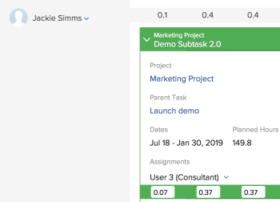

# Verwalten von Benutzerzuweisungen in den Planungsbereichen

>[!IMPORTANT]
>  
>Die in diesem Artikel beschriebene Planungsfunktion wird seit der Version 23.1 im Januar 2023 nicht mehr unterstützt und aus Adobe Workfront entfernt.   
>  
>  Dieser Artikel wird auch kurz nach der Version 23.1 (Anfang 2023) entfernt. Zu diesem Zeitpunkt empfehlen wir, alle Lesezeichen entsprechend zu aktualisieren. 
> 
> Sie können jetzt den Lastenausgleich verwenden, um die Arbeit für Ihre Ressourcen zu planen. 
>  
> Informationen zum Planen von Ressourcen mit dem Lastenausgleich finden Sie im Abschnitt [Der Lastenausgleich](../../resource-mgmt/workload-balancer/workload-balancer.md). 

<!--  

>[!CAUTION] 
> 
> 
> The information in this article refers to the Adobe Workfront's Scheduling tools. The Scheduling areas have been removed from the Preview environment and will be removed from the Production environment in **January 2023**.   
>  Instead, you can schedule resources in the Workload Balancer.  
> 
>*  For information about scheduling resources using the Workload Balancer, see the section [The Workload Balancer](../../resource-mgmt/workload-balancer/workload-balancer.md). 
> 
>*  For more information about the deprecation and removal of the Scheduling tools, see [Deprecation of Resource Scheduling tools in Adobe Workfront](../../resource-mgmt/resource-mgmt-overview/deprecate-resource-scheduling.md). 

-->

Benutzerzuweisungen sind Stunden, die die Zeit angeben, die ein Benutzer für einen bestimmten Tag verbringen soll, um ein Arbeitselement abzuschließen. Sie sind in den geplanten Stunden des Arbeitselements enthalten.

In diesem Artikel wird beschrieben, wie Sie die tägliche stündliche Zuordnung für Benutzer aktualisieren, die Aufgaben oder Problemen im Bereich &quot;Ressourcenplanung&quot;zugewiesen sind. Informationen zum Verwalten der Gesamtzuweisungen für Benutzer und Auftragsrollen für Aufgaben finden Sie unter [Verwalten von Benutzer- und Rollenzuordnungsstunden für Aufgaben](../../manage-work/tasks/assign-tasks/manage-allocation-hours-on-tasks.md). Sie können die Gesamtzuweisungen für Benutzer und Auftragsrollen für Probleme nicht aktualisieren.

Sie können Benutzerzuordnungen in den folgenden Bereichen von Adobe Workfront anzeigen:

* Im Bereich Planung des Bereichs Ressourcen .
* im Abschnitt Planung eines Projekts (beim Planen von Ressourcen für ein einzelnes Projekt).
* im Bereich Planung eines Teams (beim Planen von Ressourcen für ein Team).

## Zugriffsanforderungen

Sie müssen über Folgendes verfügen:

<table style="table-layout:auto"> 
 <col> 
 <col> 
 <tbody> 
  <tr> 
   <td role="rowheader">Adobe Workfront-Plan*</td> 
   <td> 
Beliebig
 </td> 
  </tr> 
  <tr> 
   <td role="rowheader">Adobe Workfront-Lizenz*</td> 
   <td> 
Arbeit oder höher
 </td> 
  </tr> 
  <tr> 
   <td role="rowheader">Zugriffsebene*</td> 
   <td> 
Anzeigen oder höherer Zugriff auf Projekte, Aufgaben und Probleme
 
<b>NOTIZ</b>

Wenn Sie immer noch keinen Zugriff haben, fragen Sie Ihren Workfront-Administrator, ob er zusätzliche Zugriffsbeschränkungen für Ihre Zugriffsebene festlegt. Informationen dazu, wie ein Workfront-Administrator Ihre Zugriffsstufe ändern kann, finden Sie unter <a href="../../administration-and-setup/add-users/configure-and-grant-access/create-modify-access-levels.md" class="MCXref xref">Benutzerdefinierte Zugriffsebenen erstellen oder ändern</a>.
 </td>
</tr> 
  <tr> 
   <td role="rowheader">Objektberechtigungen</td> 
   <td> 
Beitragen von Berechtigungen zu Projekten, Aufgaben und Problemen
 
Informationen zum Anfordern von zusätzlichem Zugriff finden Sie unter <a href="../../workfront-basics/grant-and-request-access-to-objects/request-access.md" class="MCXref xref">Zugriff auf Objekte anfordern </a>.
 </td> 
  </tr> 
 </tbody> 
</table>

*Wenden Sie sich an Ihren Workfront-Administrator, um zu erfahren, welchen Plan, welchen Lizenztyp oder welchen Zugriff Sie haben.

## Benutzerzuweisungen in den Planungsbereichen

Bevor Sie mit der Zuweisung von Zeit an Benutzer beginnen, wie in diesem Artikel beschrieben, sollten Sie sich mit der Funktionsweise der Ressourcenplanung in Workfront vertraut machen, wie hier beschrieben: [Erste Schritte mit der Ressourcenplanung](../../resource-mgmt/resource-scheduling/get-started-resource-scheduling.md).

Sie können Ressourcen für die Arbeit an Aufgaben und Problemen für ein einzelnes Team, dem Sie angehören, für ein einzelnes Projekt, in dem Sie Mitglied des Projektteams sind, oder für mehrere Projekte, für die Sie der Ressourcen-Manager sind, planen.

In den folgenden Abschnitten wird beschrieben, wie Sie Benutzerzuordnungen in Workfront aktivieren und verwalten:

* [Verwenden Sie die Planungsbereiche, um Aufgaben zuzuweisen.](#use-the-scheduling-areas-to-assign-work)
* [Zuordnungen, die in den Feldern Aufgabe bearbeiten oder Problem bearbeiten im Vergleich zu den Planungsbereichen festgelegt wurden](#allocations-set-on-the-edit-task-or-the-edit-issue-boxes-vs-in-the-scheduling-areas)
* [Zuordnungsindikatoren](#allocation-indicators)
* [Standardzuordnung für geplante Stunden](#default-allocation-for-planned-hours)
* [Wer kann Zuordnungen anzeigen und ändern?](#who-can-view-and-modify-allocations)
* [Zeitzonen in den Planungsbereichen](#time-zone-considerations-in-the-scheduling-areas)

### Verwenden Sie die Planungsbereiche, um Aufgaben zuzuweisen. {#use-the-scheduling-areas-to-assign-work}

Wenn Sie Benutzern in der Zeitleiste &quot;Planung&quot;neue Arbeit zuweisen, können Sie festlegen, wie die geplanten Stunden für eine Aufgabe oder ein Problem Benutzern zugewiesen werden.\
Weitere Informationen zu geplanten Stunden finden Sie unter [Übersicht über geplante Stunden](../../manage-work/tasks/task-information/planned-hours.md).

Geplante Stunden können wie folgt aufgeteilt werden:

* Unter Benutzern, die der Aufgabe oder dem Problem zugewiesen sind
* Über die Dauer der Aufgabe oder des Problems hinweg\
   So kann beispielsweise eine verkaufsbezogene Aufgabe mehr Arbeit zum Ende der Aufgabendauer erfordern. Sie können diese ungleiche Verteilung der Stunden in Ihre Aufgabe planen.

>[!TIP]
>
>Beim Planen von Ressourcen für mehrere Projekte aus den Planungsbereichen werden nicht alle Benutzer und Arbeitselemente in der Zeitleiste der Planung angezeigt. Informationen dazu, welche Informationen auf der Zeitleiste &quot;Planung&quot;angezeigt werden, finden Sie unter [Erste Schritte mit der Ressourcenplanung](../../resource-mgmt/resource-scheduling/get-started-resource-scheduling.md).

### Zuordnungen, die in den Feldern Aufgabe bearbeiten oder Problem bearbeiten im Vergleich zu den Planungsbereichen festgelegt wurden {#allocations-set-on-the-edit-task-or-the-edit-issue-boxes-vs-in-the-scheduling-areas}

Sie können die Benutzerzuordnungen für eine Aufgabe oder ein Problem an den folgenden Stellen in Workfront ändern:

* Die Zeitleiste für die Planung\
   Die Planung befindet sich in den folgenden Bereichen:

   * Im Bereich Planung des Bereichs Ressourcen .
   * im Abschnitt Planung eines Projekts (beim Planen von Ressourcen für ein einzelnes Projekt).
   * im Bereich Planung eines Teams (beim Planen von Ressourcen für ein Team).

   Wenn Sie Benutzerzuordnungen in der Zeitleiste &quot;Planung&quot;ändern (wie im Abschnitt [Ändern der Benutzerzuordnungen](#modify-user-allocations) -Abschnitt in diesem Artikel) können Sie Zuordnungen für jeden Benutzer zu der Aufgabe oder dem Problem sowie für jeden Tag innerhalb der Aufgaben- oder Problemlaufzeit definieren.\
   

* Dialogfeld &quot;Aufgabe bearbeiten&quot;oder &quot;Problem bearbeiten&quot;.\
   Wenn Sie Benutzerzuordnungen über ein Dialogfeld &quot;Aufgabe bearbeiten&quot;oder &quot;Problem bearbeiten&quot;ändern (wie hier beschrieben: [Prozentsatz für Benutzer- oder Rollenzuweisungen verwalten](../../manage-work/tasks/assign-tasks/manage-allocation-percentage-on-tasks.md)), können Sie Zuordnungen für die Aufgabe oder das Problem nur als Ganzes für jeden Benutzer definieren. Wenn Sie diese Zuordnungen pro Tag verwalten möchten, müssen Sie die Zuordnungen in der Zeitleiste für die Planung ändern, wie im Abschnitt [Ändern der Benutzerzuordnungen](#modify-user-allocations) in diesem Artikel.

   >[!IMPORTANT]
   >
   >Beim Ändern von Benutzerzuordnungen über ein Dialogfeld &quot;Aufgabe bearbeiten&quot;oder &quot;Problem&quot;werden Zuordnungen, die Sie zuvor in der Zeitleiste &quot;Planung&quot;konfiguriert haben, überschrieben. Darüber hinaus werden Änderungen an den Zuordnungen in der Zeitleiste &quot;Planung&quot;nicht in einem Dialogfeld &quot;Aufgabe bearbeiten&quot;oder &quot;Problem bearbeiten&quot;angezeigt.

Es wird empfohlen, Benutzerzuordnungen über die Planung anstatt über die Aufgabe oder das Problem bearbeiten zu verwalten, um die folgenden Vorteile zu nutzen:

* Sie können deutlich erkennen, wann Benutzer mithilfe von Zuordnungsindikatoren überverteilt werden, wie im Abschnitt [Zuordnungsindikatoren](#allocation-indicators) Abschnitt.
* Sie können einem Benutzer mehr Zeit zuweisen als einem anderen.\
   Zuordnungsindikatoren bieten eine visuelle Darstellung, wie die Zuordnung eines Benutzers zu anderen Benutzern im Vergleich dargestellt wird, wie in der [Zuordnungsindikatoren](#allocation-indicators) Abschnitt.

* Sie können mehr Zeit für die Arbeit an einem Tag als an einem anderen Tag zuweisen.\
   Zuordnungsindikatoren bieten eine visuelle Darstellung der zugewiesenen Benutzer an einem bestimmten Tag, wie unter [Zuordnungsindikatoren](#allocation-indicators).

* Sie können alle Aufgaben im Zusammenhang mit der Ressourcenzuweisung an einem Ort in der Planung ausführen.

### Zuordnungsindikatoren {#allocation-indicators}

Es stehen verschiedene visuelle Indikatoren zur Verfügung, um schnelle Informationen darüber bereitzustellen, wie weit ein Benutzer für die Arbeit an einem bestimmten Tag zugewiesen ist.

Ihr Systemadministrator bestimmt, wie Workfront die Benutzerverfügbarkeit auf Systemebene berechnet (unter Berücksichtigung der Stunden und der FTE-Verfügbarkeit). Je nach dieser systemweiten Einstellung wird die Benutzerverfügbarkeit entweder anhand des Standardzeitplans oder des Benutzerzeitplans berechnet. Weitere Informationen finden Sie unter [Konfigurieren der Berechnung der Ressourcenstunde und der FTE-Verfügbarkeit durch Workfront für den Planungsbereich](../../resource-mgmt/resource-scheduling/calculate-hours-fte-scheduling-area.md).

* **Zuordnungsschattierung**
Die Zuordnung wird visuell für Aufgaben angezeigt, die Benutzern in Form von Schattierungen zugewiesen wurden. Eine dunklere Schattierung bezeichnet die zugewiesenen Stunden als Prozentsatz der FTE der zugewiesenen Benutzer (Vollzeitäquivalent) an einem bestimmten Tag. (Weitere Informationen zur Konfiguration von FTE in Workfront finden Sie unter [Konfigurieren der Berechnung der Ressourcenstunde und der FTE-Verfügbarkeit durch Workfront für den Planungsbereich](../../resource-mgmt/resource-scheduling/calculate-hours-fte-scheduling-area.md).\
   Beispielsweise wird ein einzelner Benutzer einer Aufgabe zugewiesen, die über einen Zeitraum von 4 geplanten Stunden und eine Dauer von 1 Tag verfügt. Die FTE für den Benutzer wird im System als 1 definiert (d. h. der Benutzer soll in Vollzeit arbeiten, d. h. 40 Stunden pro Woche oder 8 Stunden pro Tag). Die Schattierung für die Aufgabe an einem bestimmten Tag belegt die Hälfte des vertikalen Bereichs der Aufgabe. Dies bedeutet, dass dem Benutzer die Hälfte seiner FTE (4 Stunden) an diesem Tag zugewiesen wird.\
   \
   Die Aufgabe oder das Problem zeigt die kumulative Zuordnung für alle Benutzer an, die dem Arbeitselement zugewiesen sind. Sie können ein Arbeitselement erweitern, um weitere Details anzuzeigen, einschließlich der dem Arbeitselement zugewiesenen Personen und der Anzahl der Stunden, die jedem Benutzer zugewiesen sind.\
   Bei Aufgaben im **Nicht zugewiesen** auf der Zeitleiste für die Planung.\
   

* **Tägliche Gesamtsummen für jeden Tag für jeden Benutzer:** Sie können die Gesamtanzahl der geplanten Stunden anzeigen, die einem bestimmten Benutzer an jedem Tag zugeordnet sind. Diese Informationen werden oben in der Zeile jedes Benutzers in der Zeitleiste &quot;Planung&quot;angezeigt. Diese Informationen werden nicht standardmäßig angezeigt. Sie können dies wie unter [Benutzerzuordnungen aktivieren](#enable-user-allocations). Aufgaben aus Projekten mit einem der folgenden Status werden bei der Bestimmung der täglichen Gesamtwerte berücksichtigt: Aktuell, Planung oder Genehmigt.\
   

* **Überallokationsindikatoren**
Wenn die Gesamtzahl der geplanten Stunden, die einem Benutzer an einem bestimmten Tag zugewiesen wurden, die Anzahl der Stunden überschreitet, die der Benutzer an einem Tag arbeitet (für alle Aufgaben), wird dieser Benutzer als an diesem Tag überverteilt betrachtet.\
   Wenn ein Benutzer übergeordnet ist, wird ein roter Balken angezeigt, in dem jede Aufgabe am Tag dargestellt wird.\
   Aufgaben aus Projekten mit einem der folgenden Status werden bei der Bestimmung der Überzuweisung eines Benutzers berücksichtigt: Aktuell, Planung oder Genehmigt.\
   Die Anzahl der Stunden, die ein Benutzer an einem Tag arbeitet, wird über das FTE-Feld im Profil jedes Benutzers definiert, wie im Abschnitt [Konfigurieren der Berechnung der Ressourcenstunde und der FTE-Verfügbarkeit durch Workfront für den Planungsbereich](../../resource-mgmt/resource-scheduling/calculate-hours-fte-scheduling-area.md).\
   \
   Wenn Sie die **Gesamtwerte für geplante tägliche Stunden anzeigen** und **Markierung für Ressourcenzuordnung anzeigen** in Ihren Einstellungen angezeigt wird, wird die tägliche Gesamtanzahl der geplanten Stunden rot angezeigt, wenn der Benutzer übergeordnet ist. Stunden werden standardmäßig auf das nächste Zehnte angezeigt (z. B. 1.3).\
   

### Standardzuordnung für geplante Stunden {#default-allocation-for-planned-hours}

Workfront versucht, geplante Stunden wie folgt auf die zugewiesenen Benutzer und Tage zu verteilen:

* Wenn mehrere Benutzer einer Aufgabe oder einem Problem zugewiesen sind, werden die Stunden gleichmäßig zwischen den Benutzern aufgeteilt.\
   Die Verteilung spiegelt alle erweiterten Zuweisungen wider, die bereits für die Aufgabe vorgenommen wurden.\
   Weitere Informationen zu erweiterten Zuweisungen finden Sie unter [Erweiterte Zuweisungen erstellen](../../manage-work/tasks/assign-tasks/create-advanced-assignments.md).

* Wenn die Dauer der Aufgabe oder des Problems mehrere Tage umfasst, werden die geplanten Stunden gleichmäßig auf die Tage verteilt und unter allen Benutzern, die der Aufgabe zugewiesen sind, basierend auf dem Zeitplan des Benutzers.
* Wenn sich die geplanten Stunden einer Aufgabe über mehrere Tage erstrecken, kann ein Benutzer, der die Aufgabe aus einer anderen Zeitzone betrachtet, einen Unterschied in der Aufgabendauer, dem geplanten Startdatum oder dem geplanten Abschlussdatum sehen.

Stunden werden standardmäßig auf das nächste Hundertstel angezeigt (z. B. 1.33). Sie können nach rechts scrollen, um weitere Informationen anzuzeigen.\

### Wer kann Zuordnungen anzeigen und ändern? {#who-can-view-and-modify-allocations}

Die folgenden Benutzertypen können Benutzerzuordnungen in Workfront anzeigen oder ändern:

* **Ressourcen-Manager:** Sie können die Benutzerzuordnungen für Aufgaben und Probleme in allen Projekten, für die Sie der Ressourcen-Manager sind, anzeigen und ändern. Dies können Sie entweder in der Zeitleiste für die Planung im Bereich Personen oder auf der Registerkarte für die Formatierung eines Projekts tun.\
   Informationen dazu, wie Ressourcenmanager projektübergreifend Änderungen an Aufgaben und Problemen vornehmen können, finden Sie unter [Nicht zugewiesene Aufgaben und Probleme manuell in den Planungsbereichen zuweisen](../../resource-mgmt/resource-scheduling/manually-assign-items-scheduling-areas.md).

* **Benutzer planen und arbeiten:** Sie können Zuordnungen für alle Aufgaben und Probleme anzeigen, die Ihnen zugewiesen sind, indem Sie entweder den neuen &quot;Mein Arbeitskalender&quot;oder den &quot;Arbeitskalender&quot;für ein Team verwenden, dem Sie angehören.\
   Sie können nicht nur Zuordnungen anzeigen, sondern auch Zuordnungen ändern, wenn Sie über Contribute-Zugriff auf Aufgaben und Probleme verfügen.

   <!--
  <MadCap:conditionalText data-mc-conditions="QuicksilverOrClassic.Draft mode">
  (NOTE: Article is conditioned to classic.)
  </MadCap:conditionalText>
  -->

### Zeitzonen in den Planungsbereichen  {#time-zone-considerations-in-the-scheduling-areas}

In seltenen Fällen können Benutzer, die die Zeitleiste für die Planung anzeigen, Inkonsistenzen sehen, bei denen die geplanten Stunden einer Aufgabe nicht mit den insgesamt zugewiesenen Stunden einzelner Tage übereinstimmen. Dies kann vorkommen, wenn die Zeitzoneneinstellung eines Benutzers im Betriebssystem dergestalt ist, dass sich das geplante Startdatum oder das geplante Abschlussdatum von einem anderen Benutzer unterscheidet.

Wenn beispielsweise das geplante Abschlussdatum einer Aufgabe am 11.00 Uhr (18.03.2018) auf 11.00 Uhr (MST) festgelegt ist, würde ein Benutzer in Australien, der die Aufgabe ansieht, das geplante Abschlussdatum am 11.4.18.2018 um 1:00 Uhr anzeigen. Wenn der Benutzer in Australien am 11.4.18 Stunden zuweist, sind diese zugewiesenen Stunden für den Benutzer auf MST nicht sichtbar. Diese Stunden werden jedoch immer bei den geplanten Stunden des Projekts berücksichtigt.

## Benutzerzuordnungen aktivieren {#enable-user-allocations}

Die Funktion für die Benutzerzuordnung ist in der Planung standardmäßig deaktiviert. Bevor Sie die in diesem Abschnitt beschriebene Funktion zur Benutzerzuordnung verwenden können, müssen Sie sie zunächst aktivieren.

>[!NOTE]
>
>Benutzerzuordnungen können nur aktiviert werden, wenn die Zeitleiste für die Planung für die Verwendung geplanter Datumswerte konfiguriert ist. Wenn die Zeitleiste für die Planung für die Verwendung der geplanten Datumswerte konfiguriert ist, können die Benutzerzuordnungen nicht angezeigt werden. Weitere Informationen zum Konfigurieren der Zeitleiste für die Planung für die Verwendung geplanter oder geplanter Datumswerte finden Sie unter &quot;Konfigurieren der geplanten Datumswerte für die Anzeige in der Zeitleiste für die Planung&quot;in [Einstellungen in den Planungsbereichen konfigurieren](../../resource-mgmt/resource-scheduling/configure-settings-scheduling-areas.md).

So aktivieren Sie Benutzerzuordnungen in der Zeitleiste &quot;Planung&quot;:

1. Gehen Sie zur Zeitleiste für die Planung mehrerer Projekte, eines einzelnen Projekts oder eines Teams:

   * **Für mehrere Projekte**:  Klicken Sie auf **Hauptmenü** icon  Klicken Sie oben rechts in Workfront auf **Ressourcen > Lastenausgleich**, wählen Sie **Planung** im Dropdown-Menü oben links.
   * **Für ein einzelnes Projekt**: Wechseln Sie zu einem Projekt, klicken Sie auf die **Lastenausgleich** im linken Bereich, und wählen Sie dann **Planung** aus dem Dropdown-Menü oben links.
   * **Für ein Team**: Klicken Sie auf **Hauptmenü** icon  Klicken Sie oben rechts in Workfront auf **Teams**, wählen Sie ein Team aus, klicken Sie auf **Lastenausgleich** Wählen Sie im linken Bereich die Option **Planung** aus dem Dropdown-Menü oben links.

   

1. Klicken Sie auf **Einstellungen** auf der Timeline für die Planung.\
   \
   Das Dialogfeld Einstellungen für die Ressourcenplanung wird angezeigt.\
   

1. Aktivieren Sie eine oder beide der folgenden Optionen, um die Benutzerzuordnungen in der Zeitleiste &quot;Planung&quot;anzuzeigen:

   <table style="table-layout:auto"> 
    <col> 
    <col> 
    <tbody> 
     <tr> 
      <td role="rowheader">Markierung der Ressourcenzuteilung anzeigen</td> 
      <td> 
Zeigen Sie die Schattierung der Benutzerzuordnung für Aufgaben und Probleme in der Zeitleiste "Planung"an. 
 
Diese Option ist standardmäßig deaktiviert.
 </td> 
     </tr> 
     <tr> 
      <td role="rowheader">Gesamtwerte für täglich geplante Stunden anzeigen</td> 
      <td>Zeigt die Gesamtzahl der geplanten Stunden an, die jedem Benutzer für jeden Tag in der Planung zugewiesen werden. Die geplanten Stunden werden auf das nächste Zehnte angezeigt (z. B. 1.3). Diese Option ist standardmäßig deaktiviert.</td> 
     </tr> 
    </tbody> 
   </table>

1. (Optional) Im **Einbeziehen von Problemen** können Sie festlegen, ob Probleme in der Planung angezeigt werden sollen.\
   Diese Option ist standardmäßig deaktiviert.

1. Klicken **Zurück zur Planung**.\
   Benutzerzuordnungen werden jetzt in der Planung angezeigt.\
   

## Ändern der Benutzerzuordnungen {#modify-user-allocations}

Sie können die Benutzerzuordnungen für eine Aufgabe oder ein Problem in der Zeitleiste für die Planung (wie in diesem Abschnitt beschrieben) oder im Dialogfeld Aufgabe oder Problem bearbeiten ändern. Weitere Informationen finden Sie unter [Zuordnungen, die in den Feldern Aufgabe bearbeiten oder Problem bearbeiten im Vergleich zu den Planungsbereichen festgelegt wurden](#allocations-set-on-the-edit-task-or-the-edit-issue-boxes-vs-in-the-scheduling-areas).

Standardmäßig werden Benutzer einer Aufgabe oder einem Problem gleichmäßig zwischen den Bevollmächtigten und zwischen Tagen innerhalb der Dauer zugewiesen, wie unter [Standardzuordnung für geplante Stunden](#default-allocation-for-planned-hours).

So ändern Sie die Benutzerzuordnungen für eine Aufgabe oder ein Problem in der Zeitleiste &quot;Planung&quot;:

1. Gehen Sie zur Zeitleiste für die Planung mehrerer Projekte, eines einzelnen Projekts oder eines Teams:

   * **Für mehrere Projekte**:  Klicken Sie auf **Hauptmenü** icon  Klicken Sie oben rechts in Workfront auf **Ressourcen > Lastenausgleich**, wählen Sie **Planung** im Dropdown-Menü oben links.
   * **Für ein einzelnes Projekt**: Wechseln Sie zu einem Projekt, klicken Sie auf die **Lastenausgleich** im linken Bereich, und wählen Sie dann **Planung** aus dem Dropdown-Menü oben links.
   * **Für ein Team**: Klicken Sie auf **Hauptmenü** icon  Klicken Sie oben rechts in Workfront auf **Teams**, wählen Sie ein Team aus, klicken Sie auf **Lastenausgleich** Wählen Sie im linken Bereich die Option **Planung** aus dem Dropdown-Menü oben links.

   

1. Stellen Sie sicher, dass die Benutzerzuordnungen in der Zeitleiste &quot;Planung&quot;aktiviert sind, wie im Abschnitt [Benutzerzuordnungen aktivieren](#enable-user-allocations) in diesem Artikel.
1. Erweitern Sie die Aufgabe, in der Sie Benutzerzuordnungen verwalten möchten.\
   Standardmäßig sind die geplanten Stunden gleichmäßig auf die zugewiesenen Benutzer und Tage der Aufgabendauer aufgeteilt. An Wochenenden (Samstags und Sonntagen) werden keine Stunden hinzugefügt. Weitere Informationen finden Sie unter [Standardzuordnung für geplante Stunden](#default-allocation-for-planned-hours) in diesem Artikel.

1. Klicken Sie auf das Feld für den Benutzer, dessen Stunden an einem bestimmten Tag angepasst werden sollen.

   >[!NOTE]
   >
   >Um die ursprüngliche Verteilung nach der Änderung der Stunden beizubehalten, klicken Sie auf **Abbrechen**.

1. Geben Sie die angepasste Anzahl von Stunden an.
1. Klicken Sie auf **Speichern**.\
   Sie können Ihre Änderungen nur speichern, wenn die Gesamtanzahl der Stunden für die Aufgabe der Anzahl der ursprünglich geplanten Stunden entspricht. Diese Zahl wird im **Geplante Stunden** -Feld für die Aufgabe. Die Zahl wird rot angezeigt, wenn die Gesamtanzahl der geplanten Stunden nicht mit der Gesamtanzahl der geplanten Stunden übereinstimmt.\
   

## Kriterien für das Zurücksetzen der Benutzerzuordnungen

Workfront setzt die Benutzerzuordnungen zurück, die Sie in der Zeitleiste &quot;Planung&quot;manuell bearbeiten, wenn eine Reihe von Aktionen für die Aufgaben oder das Projekt ausgeführt werden. Im Allgemeinen setzt Workfront die Benutzerzuweisungen jedes Mal zurück, wenn die Timeline des Projekts neu berechnet wird, wenn sich die Anzahl der geplanten Stunden für die Aufgaben und Probleme in diesem Prozess geändert hat.\
Weitere Informationen zur Neuberechnung des Zeitplans von Projekten finden Sie unter [Projektzeitpläne neu berechnen](../../manage-work/projects/manage-projects/recalculate-project-timeline.md).

Einige der gängigsten Kriterien, die die Benutzerzuordnungen in der Zeitleiste für die Planung zurücksetzen könnten, sind:

* Hinzufügen einer Aufgabe zu einer Iteration.\
   Da Iterationen feste Datumswerte aufweisen, werden die Daten der Aufgaben und die Zuordnungen neu berechnet.\
   Informationen dazu, wie sich Iterationen auf Aufgabendaten auswirken können, finden Sie unter [Hinzufügen von Meldungen zu einer vorhandenen Iteration](../../agile/use-scrum-in-an-agile-team/iterations/add-stories-to-existing-iteration.md).

* Ändern der Dauer einer Aufgabe in &quot;Anstrengung gesteuert&quot;.
* Ändern des Typs der Dauer einer Aufgabe in &quot;Berechnete Zuweisung&quot;, wenn mehr als 1 Person zugewiesen wird.\
   Weitere Informationen zur Aufgabendauer finden Sie unter [Übersicht über Aufgabendauer und -dauer](../../manage-work/tasks/taskdurtn/task-duration-and-duration-type.md).

* Änderung des geplanten Start- und geplanten Abschlussdatums des Projekts.\
   Weitere Informationen zu den geplanten Projektzeitpunkten finden Sie unter [Übersicht über das geplante Projektstartdatum](../../manage-work/projects/planning-a-project/project-planned-start-date.md) und [Festlegen des geplanten Abschlussdatums des Projekts](../../manage-work/projects/planning-a-project/project-planned-completion-date.md).

   Informationen zum geplanten Abschlussdatum der Aufgabe finden Sie unter [Übersicht über die geplante Aufgabe - Abschlussdatum](../../manage-work/tasks/task-information/task-planned-completion-date.md).

* Ändern der Daten einer Vorgängeraufgabe, wenn die Aufgabenbegrenzung eine flexible Einschränkung ist.\
   Beispielsweise so schnell wie möglich oder so spät wie möglich.\
   Weitere Informationen zur Aufgabenbegrenzung finden Sie unter [Übersicht über Aufgabenbegrenzungen](../../manage-work/tasks/task-constraints/task-constraint-overview.md).

* Änderung der Anzahl der geplanten Stunden für Aufgaben oder Probleme.

   Weitere Informationen zu geplanten Stunden in Workfront finden Sie unter [Übersicht über geplante Stunden](../../manage-work/tasks/task-information/planned-hours.md).
