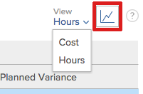

# Informationen zur Ressourcenauslastung anzeigen

<!-- Audited: 01/2024 -->

<!--

(NOTE:&nbsp;this is linked to the UI from the Utilization report. ALWAYS keep this information. DO NOT DELETE!!)

-->

Sie können die Nutzung Ihrer Ressourcen im Bericht &quot;Nutzung&quot;anzeigen.

<!--

(NOTE: Vazgen's response about these hours ie below and he asked us to NOT document them:

It queries Assignments first to get the tasks, issues, projects to display in the view. And then from those gets the hours.

In some cases, like for Planned Hours, it takes them from Assignments

But Budgeted Hours come from projects.

And Actual Hours are their own object - Hour)

-->

<!--

This report displays information about the assignments on work items for projects in your environment, like Planned, Actual, and Budgeted Hours, FTE, or Cost.&nbsp;These are hours,&nbsp;FTE, or costs associated with the assignments and not with the tasks and issues themselves.(PRIVATE NOTE:&nbsp;Vazgen's response about these hours: It queries Assignments first to get the tasks, issues, projects to display in the view. And then from those gets the hours. In some cases, like for Planned Hours, it takes them from Assignments; But Budgeted Hours come from projects. And Actual Hours are their own object - Hour.)

-->

## Zugriffsanforderungen

+++ Erweitern Sie , um die Zugriffsanforderungen für die Funktionalität in diesem Artikel anzuzeigen.

Sie müssen über Folgendes verfügen, um auf den Bericht &quot;Nutzung&quot;zugreifen zu können:

<table style="table-layout:auto"> 
 <col> 
 <col> 
 <tbody> 
  <tr> 
   <td role="rowheader">Adobe Workfront-Abo</td> 
   <td>
Neu: Beliebig

       
Oder

       
Aktuell: Pro oder höher
 </td> 
  </tr> 
  <tr> 
   <td role="rowheader">Adobe Workfront-Lizenz</td> 
   <td>
Neu: Standard

       
Oder

       
Aktuell: Plan
 </td> 
  </tr> 
  <tr> 
   <td role="rowheader">Konfigurationen auf Zugriffsebene</td> 
   <td> 
Zeigen Sie den Zugriff auf Folgendes an oder höher:
 
    <ul> 
     <li> 
Ressourcenverwaltung 
 </li> 
     <li> 
Projekte
 </li> 
     <li> 
Portfolios
 </li> 
     <li> 
Programme
 </li> 
     <li> 
Finanzdaten, wenn Sie Informationen nach Kosten anzeigen möchten
 </li> 
    </ul> </td> 
  </tr> 
  <tr> 
   <td role="rowheader">Objektberechtigungen</td> 
   <td> 
Anzeigen des Zugriffs auf Projekte, Portfolios und Programme für den Zugriff auf den Abschnitt "Nutzung"im Bereich "Ressourcen"
 
  
 
Zugriff auf ein Projekt verwalten , um auf den Abschnitt "Nutzung"des Projekts zuzugreifen
 
  </td> 
  </tr> 
 </tbody> 
</table>

Weitere Informationen zu den Informationen in dieser Tabelle finden Sie unter [Zugriffsanforderungen in der Workfront-Dokumentation](/help/quicksilver/administration-and-setup/add-users/access-levels-and-object-permissions/access-level-requirements-in-documentation.md).

+++

<!--

You must have View access to the projects you want to view utilization information for as described in this section. If you are still unable to access this information, contact your Workfront administrator. (NOTE:&nbsp;replaced with above table)

-->

<!--

<h2>Prerequisites for accessing utilization information</h2>

(NOTE: drafted, replaced with above table)

To access utilization information as described in this section, ensure that the following conditions are met:

<ul>
<li>You have at least&nbsp;View access to the project, program, or portfolio for which you want to view the utilization information.</li>
<li>Your Workfront administrator must grant you at least View access to&nbsp;Financial&nbsp;Data in your Access Level to be able to view cost and revenue information in the Utilization report. The Workfront administrator must enable both View Role Billing & Cost Rates as well as View User Billing &&nbsp;Cost Rates when they grant you the View access to Financial Data. For information about granting access to&nbsp;Financial&nbsp;Data, see <a href="../../administration-and-setup/add-users/configure-and-grant-access/grant-access-financial.md" class="MCXref xref">Grant access to financial data</a>. </li>
<li>

(NOTE:&nbsp;drafted. No longer the case.) 

The Utilization tab is included on any layout template that is assigned to you and that is applied to either the projects you view or to the Reporting area. 

The Utilization section is included on any layout template that is assigned to you and that is applied to either the projects you view or to the Resourcing area. 

</li>
<li>

The Utilization tab is available by default in the Reporting area if the system administrator has not assigned a custom layout template to you. 

The Utilization section is available by default in the Resourcing area if the system administrator has not assigned a custom layout template to you. 

</li>
</ul>

-->

## Übersicht über den Nutzungsbericht {#overview-of-the-utilization-report}

Im Nutzungsbericht können Sie den Fortschritt, die Kosten oder den Umsatz eines Projekts, Programms oder Portfolios in einem einzigen Bericht anzeigen. Sie können auch den Umsatz mit den Kosten vergleichen.

Sie können den Nutzungsbericht im Bereich &quot;Ressourcen&quot;anzeigen, um die Nutzung über mehrere Projekte hinweg anzuzeigen, oder Sie können ihn auf der Ebene eines Projekts anzeigen, um die Nutzung der einzelnen Ressourcen (Auftragsrollen und Benutzer) anzuzeigen, die mit diesem Projekt verbunden sind.

Informationen zum Zugriff auf und zur Verwendung des Nutzungsberichts finden Sie im Abschnitt [Fortschritt, Kosten und Umsatz mit dem Nutzungsbericht verfolgen](#track-progress-cost-and-revenue-with-the-utilization-report) in diesem Artikel.

### Tracking von Stunden (Fortschritt) {#track-hours-progress}

Sie können den Fortschritt verfolgen, indem Sie sich ansehen, wie die geplanten und geplanten Stunden im Vergleich zu den tatsächlichen Stunden verlaufen.

Beim Verfolgen des Fortschritts eines Projekts, Programms oder Portfolios wird der Fortschritt sowohl bei Aufgaben als auch bei Problemen im Nutzungsbericht berücksichtigt.

Die folgenden Informationen sind beim Verfolgen von Stunden im Nutzungsbericht verfügbar:

<table style="table-layout:auto"> 
 <col> 
 <col> 
 <thead> 
  <tr> 
   <th><strong>Spaltentitel bei Ansicht von Stunden</strong> </th> 
   <th><strong>Funktion</strong> </th> 
  </tr> 
 </thead> 
 <tbody> 
  <tr> 
   <td scope="col"><strong>Budgetierte Stunden</strong> </td> 
   <td scope="col"> 
Die insgesamt geplanten Stunden für die einbezogenen Projekte. Sie können die geplanten Gesamtstunden für das Gesamtleben der enthaltenen Projekte anzeigen oder die Gesamtanzahl der geplanten Stunden nur für den angegebenen Datumsbereich anzeigen (Sie können eine einzelne Woche oder einen bestimmten Monat angeben). 
 
Budgetierte Stunden werden aus den Informationen gefüllt, die im Bereich "Ressourcenbudgetierung"des Geschäftsfalls oder im Ressourcen-Planer<em> verfügbar sind.</em>
 
Die budgetierten Stunden werden im Nutzungsbericht in einer der folgenden Zeilen angezeigt:
 
    <ul> 
     <li> Budgetierte Stunden werden nach Auftragsrolle und nach einzelnen Benutzern im Nutzungsbericht wie folgt zusammengefasst: <strong>Individueller Benutzer:</strong> Budgetierte Stunden werden für jeden Benutzer im Nutzungsbericht zusammengefasst. Diese budgetierten Stunden sind mit den Aufgaben und Problemen verknüpft, denen der Benutzer für die enthaltenen Projekte zugewiesen ist. (Sie können die Zeile der entsprechenden Auftragsrolle erweitern, um eine Liste der Benutzer mit dieser Auftragsrolle anzuzeigen.) <strong>Auftragsrolle:</strong> Budgetierte Stunden werden anhand der Stellenrolle im Nutzungsbericht zusammengefasst. Budgetierte Stunden erscheinen als Ergebnis eines der folgenden Szenarien in einer bestimmten Rolle:
     <ul>
     <li>Die Rolle "Job"wird als primäre Aufgabenrolle des Benutzers definiert, der der Aufgabe oder dem Problem zugewiesen ist, der die Budgetzeit zugeordnet ist. </li> 
       <li>Wenn Sie Nutzungsinformationen für ein einzelnes Projekt anzeigen, wird die Rolle des Benutzers, dem die Stunden zugewiesen sind, verwendet, unabhängig davon, ob es keine Zuweisung für die Aufgabe oder das Problem gibt, ob einem anderen Benutzer keine Aufgabenrollenzuweisung zugewiesen wurde, ein anderer Benutzer mit einer anderen Rolle für den Auftrag zugewiesen wird oder ein anderes Team zugewiesen wird.</li> 
       <li>Wenn Sie Nutzungsinformationen für mehrere Projekte, Programme oder Portfolios anzeigen, wird die Aufgabenrolle des den Stunden zugewiesenen Benutzers nur verwendet, wenn die Rolle einer Aufgabe oder eines Problems in einem Projekt zugewiesen ist. </li> 
       <li>Die Rolle des Auftrags wird der Aufgabe oder dem Problem zugewiesen, der bzw. dem die budgetierten Stunden zugeordnet sind, und der Benutzer, der der Aufgabe oder dem Problem zugewiesen ist, hat keine Rolle im System.</li> 
      </ul></li> 
    </ul> 
    <ul> 
     <li> 
<strong>Nicht zugewiesene Stunden</strong>: Die budgetierten Stunden werden im Nutzungsbericht im Abschnitt Nicht zugewiesene Stunden angezeigt, wenn die budgetierten Stunden mit einer Aufgabe oder einem Problem verbunden sind und der Aufgabe oder dem Problem kein Benutzer oder keine Rolle zugewiesen ist. Dieser Abschnitt wird nur angezeigt, wenn Stunden am Projekt vorhanden sind, die mit dieser Beschreibung übereinstimmen, und wenn der Nutzungsbericht von oder aus einem Projekt angezeigt wird. 
 
Dieser Abschnitt wird nur angezeigt, wenn Stunden am Projekt vorhanden sind, die dieser Beschreibung entsprechen, und wenn der Bericht "Nutzung"nach oder von einem Projekt angezeigt wird. 
 </li> 
    </ul> 
Weitere Informationen zu geplanten Stunden finden Sie unter <a href="/help/quicksilver/manage-work/projects/project-finances/budgeted-labor-cost.md#locate-the-budgeted-hours-of-a-project">Budgetierte Stunden eines Projekts finden</a> in <a href="/help/quicksilver/manage-work/projects/project-finances/budgeted-labor-cost.md">Budgetierte Arbeitskosten und getierte Stunden für Projekte verstehen</a>.
 </td> 
  </tr> 
  <tr> 
   <td scope="col"><strong>Geplante Stunden</strong> </td> 
   <td scope="col">

Die geplanten Stunden für die enthaltenen Projekte, die mit den Zuweisungen für jede Aufgabe und jedes Problem verknüpft sind. Sie können die gesamten geplanten Stunden aller Zuweisungen im Projekt für die Gesamtdauer der enthaltenen Projekte anzeigen oder die insgesamt geplanten Stunden nur für den angegebenen Datumsbereich anzeigen (Sie können eine einzelne Woche oder einen bestimmten Monat angeben).

<strong>TIP </strong>

Die geplanten Stunden von Artikeln mit einer Dauer von 0 werden nicht berücksichtigt. 

Bei geplanten Stunden im Nutzungsbericht wird berücksichtigt, ob die geplanten Stunden über die Dauer einer Aufgabe oder eines Problems hinweg neu zugewiesen wurden. 

Wenn die tägliche Zuweisung von Stunden durch den Benutzer mithilfe des Workload Balancer geändert wurde, können die Daten im Auslastungsbericht betroffen sein, wenn die im Auslastungsbericht ausgewählten Daten nur einen Teil der Dauer einer Aufgabe oder eines Problems enthalten. 

Informationen zum Ändern der Zuordnungen für Benutzer finden Sie unter <a href="../workload-balancer/manage-user-allocations-workload-balancer.md">Verwalten von Benutzerzuordnungen im Arbeitslastausgleich</a>.

Geplante Stunden werden im Nutzungsbericht in einer der folgenden Zeilen angezeigt:

<ul>

<li>Geplante Stunden werden im Nutzungsbericht nach Auftragsrolle und nach individuellem Benutzer wie folgt zusammengefasst: 
<ul>

<li><strong>Individueller Benutzer</strong>: Die geplanten Stunden werden für jeden Benutzer im Nutzungsbericht zusammengefasst. Diese geplanten Stunden sind mit den Aufgaben und Problemen verknüpft, denen der Benutzer für die enthaltenen Projekte zugewiesen ist. (Sie können die Zeile der entsprechenden Auftragsrolle erweitern, um eine Liste der Benutzer mit dieser Auftragsrolle anzuzeigen.)

<li><strong>Auftragsrolle</strong>: Geplante Stunden werden nach Auftragsrolle im Nutzungsbericht eines einzelnen Projekts zusammengefasst. Geplante Stunden werden als Ergebnis eines der folgenden Szenarien in einer bestimmten Rolle angezeigt:  
<ul>

<li>Die Auftragsrolle ist definiert als die Rolle des Hauptauftrags des Benutzers, der der Aufgabe oder dem Problem zugewiesen ist, mit der bzw. dem die geplanten Stunden verknüpft sind.

<li>Wenn Sie Nutzungsinformationen für ein einzelnes Projekt anzeigen, werden die Stunden, die mit einer Auftragsrolle verknüpft sind, in den folgenden Szenarien nicht für die Auftragsrolle angezeigt:   
<ul>

<li>Es gibt keine Zuweisung zu der Aufgabe oder dem Problem

<li>Ein Benutzer ohne Aufgabenrollenzuweisung wurde zugewiesen.

<li>Dem Benutzer wird eine andere Aufgabenrolle zugewiesen.

<li>Ein Team wird der Aufgabe oder dem Problem zugewiesen
</li>   
</ul>

<li>Wenn Sie Nutzungsinformationen für mehrere Projekte, Programme oder Portfolios anzeigen, wird die Aufgabenrolle des den Stunden zugewiesenen Benutzers nur verwendet, wenn die Rolle einer Aufgabe oder eines Problems in einem Projekt zugewiesen ist. Die Auftragsrollenstunden werden nicht separat angezeigt, wenn der Bericht "Nutzung"für mehrere Projekte angezeigt wird.

<li>Die Rolle "Auftrag"wird der Aufgabe oder dem Problem zugewiesen, der bzw. dem geplante Stunden zugeordnet sind, und der der Aufgabe oder dem Problem zugewiesene Benutzer hat keine Rolle im System.
</li>  
</ul>

<li><strong>Nicht zugewiesene Stunden</strong>: Geplante Stunden werden im Nutzungsbericht im Abschnitt Nicht zugewiesene Stunden angezeigt, wenn geplante Stunden mit einer Aufgabe oder einem Problem verknüpft sind und der Aufgabe oder dem Problem kein Benutzer oder keine Rolle zugewiesen ist. Dieser Abschnitt wird nur angezeigt, wenn Stunden am Projekt vorhanden sind, die dieser Beschreibung entsprechen, und wenn der Nutzungsbericht für ein einzelnes Projekt angezeigt wird.  Weitere Informationen zu geplanten Stunden finden Sie unter <a href="../../manage-work/tasks/task-information/planned-hours.md">Übersicht über geplante Stunden</a>.
</li> 
</ul>
</li> 
</ul> </td> 
  </tr> 
  <tr> 
   <td><strong>Tatsächliche Stunden</strong> </td> 
   <td> 
 Die Gesamtstunden, die bei den Aufgaben, Problemen, und beim Projekt für die enthaltenen Projekte protokolliert wurden. Sie können die tatsächlichen Gesamtstunden für die Gesamtdauer der enthaltenen Projekte anzeigen oder die tatsächlichen Gesamtstunden nur für den angegebenen Datumsbereich anzeigen (Sie können eine einzelne Woche oder einen einzelnen Monat angeben). 
 
<strong>Warnung:</strong> Der Nutzungsbericht enthält Stunden, die beim Projekt protokolliert wurden, untergeordnete Aufgaben, Probleme und übergeordnete Aufgaben, die mindestens eine Zuweisung aufweisen. Sie enthält keine Stunden, die mit übergeordneten Aufgaben ohne Zuweisungen protokolliert wurden. Es wird empfohlen, keine übergeordneten Aufgaben als Arbeitsaufgaben zu verwenden und Ihren Ressourcen nur untergeordnete Aufgaben zuzuweisen. 
 
Die tatsächlichen Stunden werden im Nutzungsbericht in einer der folgenden Zeilen angezeigt:
 
    <ul> 
     <li> Die tatsächlichen Stunden werden nach Auftragsrolle und nach einzelnen Benutzern im Nutzungsbericht eines Projekts zusammengefasst, wie folgt: <strong>Individueller Benutzer:</strong> Die tatsächlichen Stunden werden im Nutzungsbericht in der Zeile des Benutzers angezeigt, der die Stunden protokolliert hat. (Sie können die Zeile der entsprechenden Auftragsrolle erweitern, um eine Liste der Benutzer mit dieser Auftragsrolle anzuzeigen, die Stunden protokolliert haben.) <strong>Auftragsrolle:</strong> Die tatsächlichen Stunden, die von Benutzern protokolliert werden, die diesen Rollen zugeordnet sind, werden im Nutzungsbericht in der Zeile der entsprechenden Auftragsrolle zusammengefasst. Die tatsächlichen Stunden werden in einer bestimmten Rolle als Ergebnis eines der folgenden Szenarien angezeigt: 
      <ul> 
       <li>Die Auftragsrolle wird als primäre Aufgabenrolle des Benutzers definiert, der die Stunden protokolliert hat</li> 
       <li>Es gibt keine Zuweisung zu der Aufgabe oder dem Problem</li> 
       <li>Ein anderer Benutzer wurde ohne Aufgabenrollenzuweisung zugewiesen</li> 
       <li>Einem anderen Benutzer wird eine andere Aufgabenrolle zugewiesen.</li> 
       <li> 
Ein Team wird zugewiesen
 </li> 
      </ul></li>  
     
Wenn dem Benutzer, der die Stunden protokolliert, keine Arbeitsrolle mit seinem Profil zugeordnet ist, ist die für den Auslastungsbericht verwendete Vorgangsrolle die der Aufgabe oder dem Problem zugewiesene Auftragsrolle, in der Stunden protokolliert werden, oder die mit dem Primären Eigentümer der Aufgabe oder des Problems verknüpfte Auftragsrolle. 
 
     <li><strong>Sonstige Stunden:</strong> Die tatsächlichen Stunden werden im Nutzungsbericht im Abschnitt "Andere Stunden"in der Zeile des Benutzers angezeigt, der sich in den Stunden angemeldet hat. Stunden werden in diesem Abschnitt angezeigt, wenn für den Benutzer, der die Stunden protokolliert hat, keine Vorgangsrolle im System definiert ist. Dieser Abschnitt wird nur angezeigt, wenn Stunden am Projekt dieser Beschreibung entsprechen. </li> 
    </ul> </td> 
  </tr> 
  <tr> 
   <td><strong>budgetierte Abweichung (für Stunden)</strong> </td> 
   <td> 
Die insgesamt veranschlagten Stunden abzüglich der tatsächlichen Gesamtstunden für die einbezogenen Projekte. Sie können die gesamte budgetierte Varianz für die gesamte Lebensdauer der eingeschlossenen Projekte anzeigen oder die gesamte budgetierte Varianz nur für den angegebenen Datumsbereich anzeigen (Sie können eine einzelne Woche oder einen bestimmten Monat angeben). 
 
Wenn der Wert positiv ist, wird er grün angezeigt. Dies zeigt an, dass die geplanten Gesamtstunden die tatsächlichen Stunden überschreiten.
 
Wenn der Wert negativ ist, wird er rot angezeigt. Dies zeigt an, dass die geplanten Gesamtstunden weniger als die tatsächlichen Stunden betragen.
 
  
 </td> 
  </tr> 
  <tr> 
   <td><strong>Geplante Abweichung (für Stunden)</strong> </td> 
   <td> 
Die insgesamt geplanten Stunden abzüglich der tatsächlichen Gesamtstunden für die enthaltenen Projekte. Sie können die insgesamt geplante Varianz für die gesamte Lebensdauer der enthaltenen Projekte anzeigen oder die insgesamt geplante Varianz nur für den angegebenen Datumsbereich anzeigen (Sie können eine einzelne Woche oder einen bestimmten Monat angeben).
 
Wenn der Wert positiv ist, wird er grün angezeigt. Dies zeigt an, dass die geplanten Gesamtstunden die tatsächlichen Stunden überschreiten.
 
Wenn der Wert negativ ist, wird er rot angezeigt. Dies zeigt an, dass die geplanten Gesamtstunden weniger als die tatsächlichen Stunden betragen.
 </td> 
  </tr> 
 </tbody> 
</table>

### Kosten verfolgen {#track-cost}

Sie können Kosten nachverfolgen, indem Sie sich ansehen, wie die budgetierten Kosten und geplanten Kosten mit den tatsächlichen Kosten verglichen werden.

Bei der Verfolgung der Kosten eines Projekts, Programms oder Portfolios stammen die Informationen im Nutzungsbericht aus Aufgaben. Kosteninformationen aus Aufgaben sind immer im Nutzungsbericht verfügbar. Die Kosten für Aufgaben werden basierend auf dem Kostentyp der Aufgabe berechnet. Informationen zum Kostentyp von Aufgaben finden Sie unter [So berechnet Workfront Kostentypen für Aufgaben](/help/quicksilver/manage-work/projects/project-finances/track-costs.md#how-workfront-calculates-cost-types-for-tasks) in [Kosten tracken](/help/quicksilver/manage-work/projects/project-finances/track-costs.md).

Sie können Kosteninformationen im Bericht &quot;Nutzung&quot;wie folgt anzeigen:

* Für eine bestimmte Woche oder einen bestimmten Monat oder für das gesamte Projekt, Programm oder Portfolio
* Nach Rolle oder Einzelperson für Projekte

Die Währung im Nutzungsbericht wird durch die im Projekt festgelegte Währung bestimmt. Informationen zum Anpassen der Währung für ein Projekt finden Sie unter [Ändern der Projektwährung](../../manage-work/projects/project-finances/change-project-currency.md).

Die folgenden Informationen sind im Nutzungsbericht verfügbar, wenn Sie Kosten nachverfolgen:

<table style="table-layout:auto"> 
 <col> 
 <col> 
 <thead> 
  <tr> 
   <th><strong>Spaltentitel bei Ansicht von Kosten</strong> </th> 
   <th> 
<strong>Funktion</strong> 
 </th> 
  </tr> 
 </thead> 
 <tbody> 
  <tr> 
   <td scope="col"><strong>Budgetierte Kosten</strong> </td> 
   <td scope="col"> 
Die budgetierten Kosten für die enthaltenen Projekte. Sie können die Gesamtkosten der Budgetierung für die Gesamtdauer der eingeschlossenen Projekte anzeigen oder die Gesamtkosten der Budgetierung nur für den angegebenen Datumsbereich anzeigen (Sie können eine einzelne Woche oder einen einzelnen Monat angeben).
 
Da sich die im Nutzungsbericht veranschlagten Kosten auf Kosten nach Rolle konzentrieren, entspricht die Berechnung den budgetierten Arbeitskosten in anderen Bereichen von Workfront. Weitere Informationen zur Berechnung der budgetierten Arbeitskosten finden Sie unter <a href="../../manage-work/projects/project-finances/budgeted-labor-cost.md" class="MCXref xref">Budgetierte Arbeitskosten und geplante Arbeitsstunden für Projekte verstehen</a>.
 </td> 
  </tr> 
  <tr> 
   <td scope="col"><strong>Geplante Kosten</strong> </td> 
   <td scope="col"> 
Gesamtsumme der geplanten Kosten für die enthaltenen Projekte. Sie können die Gesamtsumme der geplanten Kosten für die gesamte Lebensdauer der enthaltenen Projekte anzeigen oder die Gesamtsumme der geplanten Kosten nur für den angegebenen Datumsbereich anzeigen (Sie können eine einzelne Woche oder einen einzelnen Monat angeben).
 
Beachten Sie, dass die geplanten Kosten für die Wochen-, Monats- und vierteljährlichen Ansichten als Durchschnitt des ausgewählten Zeitraums berechnet werden, in dem die Kostensätze für Stellenberufe oder Benutzer datumswirksam sind.

Informationen dazu, wie die geplanten Kosten für das Projekt berechnet werden, finden Sie unter <a href="/help/quicksilver/manage-work/projects/project-finances/track-costs.md#how-workfront-calculates-planned-budgeted-and-actual-costs">Berechnung der geplanten, budgetierten und tatsächlichen Kosten durch Workfront</a> in <a href="/help/quicksilver/manage-work/projects/project-finances/track-costs.md">Kosten für das Tracking</a>.
 </td>
  </tr> 
  <tr> 
   <td scope="col"><strong>Tatsächliche Kosten</strong> </td> 
   <td scope="col"> 
Die tatsächlichen Gesamtkosten der enthaltenen Projekte. Sie können die tatsächlichen Gesamtkosten für die Gesamtdauer der eingeschlossenen Projekte anzeigen oder die tatsächlichen Gesamtkosten nur für den angegebenen Datumsbereich anzeigen (Sie können eine einzelne Woche oder einen einzelnen Monat angeben).
 
Informationen dazu, wie die tatsächlichen Kosten für das Projekt berechnet werden, finden Sie unter <a href="/help/quicksilver/manage-work/projects/project-finances/track-costs.md#how-workfront-calculates-planned-budgeted-and-actual-costs">Berechnung der geplanten, budgetierten und tatsächlichen Kosten durch Workfront</a> in <a href="/help/quicksilver/manage-work/projects/project-finances/track-costs.md">Kosten für das Tracking</a>.
 </td>
  </tr> 
  <tr> 
   <td><strong>budgetierte Abweichung (für Kosten)</strong> </td> 
   <td scope="col"> 
Die gesamten veranschlagten Kosten abzüglich der tatsächlichen Gesamtkosten für die enthaltenen Projekte. Sie können die gesamte budgetierte Varianz für die gesamte Lebensdauer der eingeschlossenen Projekte anzeigen oder die gesamte budgetierte Varianz nur für den angegebenen Datumsbereich anzeigen (Sie können eine einzelne Woche oder einen bestimmten Monat angeben).
 
Wenn der Wert positiv ist, wird er grün angezeigt. Dies deutet darauf hin, dass die gesamten budgetierten Kosten größer sind als die tatsächlichen Kosten.
 
Wenn der Wert negativ ist, wird er rot angezeigt. Dies zeigt an, dass die Gesamtkosten unter den tatsächlichen Kosten liegen.
 </td>
  </tr> 
  <tr> 
   <td><strong>Geplante Abweichung (für Kosten)</strong> </td> 
   <td> 
Die gesamten geplanten Kosten abzüglich der tatsächlichen Gesamtkosten für die enthaltenen Projekte. Sie können die insgesamt geplante Varianz für die gesamte Lebensdauer der enthaltenen Projekte anzeigen oder die insgesamt geplante Varianz nur für den angegebenen Datumsbereich anzeigen (Sie können eine einzelne Woche oder einen bestimmten Monat angeben). 
 
Wenn der Wert positiv ist, wird er grün angezeigt. Dies deutet darauf hin, dass die gesamten geplanten Kosten größer als die tatsächlichen Kosten sind.
 
Wenn der Wert negativ ist, wird er rot angezeigt. Dies zeigt an, dass die Gesamtkosten der geplanten Kosten unter den tatsächlichen Kosten liegen.
 </td> 
  </tr> 
 </tbody> 
</table>

### Umsatz verfolgen {#track-revenue}

Sie können den Umsatz verfolgen, indem Sie anzeigen, wie der geplante und der geplante Umsatz mit dem tatsächlichen Umsatz verglichen werden.

Beim Verfolgen des Umsatzes eines Projekts, Programms oder Portfolios werden nur Umsätze aus Aufgaben im Bericht Verwendung erfasst.

Die Informationen in der folgenden Tabelle sind beim Verfolgen des Umsatzes im Nutzungsbericht verfügbar.

Informationen zu den spezifischen Feldern und deren Berechnung durch Workfront finden Sie unter [Kosten-Tracking](../../manage-work/projects/project-finances/track-costs.md) und [Übersicht über Abrechnung und Umsatz](../../manage-work/projects/project-finances/billing-and-revenue-overview.md).

<table style="table-layout:auto"> 
 <col> 
 <col> 
 <thead> 
  <tr> 
   <th><strong>Spaltentitel bei Ansicht des Umsatzes</strong> </th> 
   <th> <strong>Funktion</strong></th> 
  </tr> 
 </thead> 
 <tbody> 
  <tr> 
   <td scope="col"><strong>budgetierter Umsatz</strong> </td> 
   <td scope="col"> 
Die Gesamtbudgetierten Stunden multipliziert mit dem Role Billing Rate für die einbezogenen Projekte. Sie können den Gesamtumsatz im Budget für die gesamte Lebensdauer der enthaltenen Projekte anzeigen oder den Gesamtumsatz nur für den angegebenen Datumsbereich anzeigen (Sie können eine bestimmte Woche oder einen bestimmten Monat angeben).
 </td> 
  </tr> 
  <tr> 
   <td scope="col"><strong>Geplanter Umsatz</strong> </td> 
   <td scope="col"> 
Der geplante Umsatz im Bericht "Nutzung"ist der Umsatz, der mit den geplanten Stunden verbunden ist und den Ressourcen zugeordnet ist, die den Aufgaben des Projekts zugewiesen sind.
 
Workfront berechnet den geplanten Umsatz des Projekts für den Bericht "Nutzung"anhand der folgenden Formel:
 
<code>Project Planned Revenue = SUM (All Tasks Planned Revenue)</code> 
 
   
<b>NOTE</b>
   
Das Projekt "Geplanter Umsatz", das im Nutzungsbericht angezeigt wird, unterscheidet sich von dem "Geplanter Umsatz", der im Bereich "Projektdetails"und in den Projektberichten angezeigt wird. 
 
Der geplante Umsatz im Bereich "Projektdetails"spiegelt den Umsatz der Aufgabe sowie den festen Umsatz des Projekts wider. Der geplante Umsatz im Nutzungsbericht zeigt den geplanten Umsatz an, der nur mit den Aufgaben im Projekt verbunden ist. 
 
     
Example: </b>">  
      
Wenn das Projekt eine Aufgabe mit 10 Stunden umfasst, die einem Berater mit einer Stundenrate von 20 US-Dollar zugewiesen ist und das Projekt einen festen Umsatz von 100 US-Dollar aufweist, zeigt der Nutzungsbericht 200 US-Dollar für den geplanten Umsatz an (den geplanten Umsatz, der mit den Stunden der Aufgabe verknüpft ist). Im Abschnitt Projektdetails werden 300 USD (der geplante Umsatz aus der Aufgabe und der feste Umsatz für das Projekt) angezeigt. 
 
     
 
Weitere Informationen über die Aufgabe und das Projekt "Geplanter Umsatz"außerhalb des Nutzungs-Berichts finden Sie unter <a href="../../manage-work/projects/project-finances/billing-and-revenue-overview.md" class="MCXref xref">Übersicht über Rechnungsstellung und Umsatz</a>.
 
 
Die Art und Weise, wie der Nutzungsbericht den geplanten Umsatz für die enthaltenen Projekte berechnet und anzeigt, berücksichtigt den für die Aufgabe festgelegten Umsatztyp. 
 
Je nach dem Umsatztyp jeder Aufgabe im Projekt gibt es die folgenden Szenarien: 
 
<strong>Fester Umsatz:</strong> Unabhängig von der Aufgabenzuweisung wird der Umsatz der Aufgabe immer mit dem für die Aufgabe angegebenen Festbetrag berechnet.
 
<b>WICHTIG</b>

Im Gegensatz zu anderen Bereichen von Workfront berechnet der Nutzungsbericht den geplanten Umsatz für feste Umsätze, indem er den festen Umsatz gleichmäßig durch die Anzahl der geplanten Stunden für die Aufgabe teilt. 
 
Beispielsweise hat eine Aufgabe einen Umsatz von 200 USD. Wenn die Aufgabe vier geplante Stunden umfasst, beträgt jede Stunde 50 USD. Dies wird auf Benutzer- und Rollenebene verteilt. Diese Verteilung ist für den Bericht &quot;Nutzung&quot;eindeutig.
 
<b>NOTE</b>

Wenn Sie eine Aufgabe mit festem Umsatz haben und für die Aufgabe keine geplanten Stunden vorgesehen sind, wird der Umsatz nicht im Nutzungsbericht angezeigt, da es keine Möglichkeit gibt, ihn auf die Stunden zu verteilen. Wenn Sie für Aufgaben mit festem Umsatz und ohne Zuweisung geplante Stunden geplant haben, wird der Umsatz als nicht zugewiesener Umsatz angezeigt. 
 
<strong>Stündliche Rolle:</strong> Der Umsatz aus der Aufgabe wird anhand des für eine bestimmte Rolle festgelegten Abrechnungskurses multipliziert mit der Anzahl der mit dieser Rolle verbundenen geplanten Stunden berechnet. Workfront verwendet die folgende Formel:
 
<code>Rolle &quot;Stündlicher geplanter Umsatz = SUM(geplante Stunden von der Rolle für alle Aufgaben) * Gebührenabrechnungsrate</code>

<b>HINWEIS:</b> Der Abrechnungsstundensatz in der Formel berücksichtigt alle Datumsänderungen des Satzes.
   
<strong>Benutzer stündlich:</strong> Der Umsatz aus der Aufgabe wird anhand des für einen bestimmten Benutzer festgelegten Abrechnungssatzes multipliziert mit der Anzahl der diesem Benutzer zugeordneten geplanten Stunden berechnet. Workfront verwendet die folgende Formel:
 
<code>Benutzerstündlicher geplanter Umsatz = SUM(geplante Stunden von Benutzern für alle Aufgaben) * Benutzerabrechnungsrate</code> 
 
<b>HINWEIS:</b> Der Abrechnungsstundensatz in der Formel berücksichtigt alle Datumsänderungen des Satzes.
 
<b>Stündliche Rolle oder Benutzer stündlich Plus fest</b> 
 
<b>WICHTIG</b>

Im Gegensatz zu anderen Bereichen von Workfront berechnet der Nutzungsbericht den geplanten Umsatz, indem er den festen Umsatz gleichmäßig durch die Anzahl der geplanten Stunden für die Aufgabe teilt. 
 
Die folgenden Fälle sind vorhanden: 

<ul>
<li> 
<strong>Stündlich plus fest:</strong> Der Umsatz aus der Aufgabe wird anhand des für eine bestimmte Rolle festgelegten Abrechnungskurses multipliziert mit der Anzahl der mit der Rolle verbundenen geplanten Stunden berechnet. Darüber hinaus wird der Rollenrate ein fester Betrag hinzugefügt, der für die Aufgabe angegeben ist. Workfront verwendet die folgende Formel:
 
<code>Rolle Stündlich plus Fester geplanter Umsatz = [SUM(geplante Stunden von der Rolle für alle Aufgaben) * Rollenabrechnungsrate] + SUM(Begrenzung oder fester Betrag der Aufgabe/geplante Stunden der Aufgabe)</code> 
 </li>
<li> 
<strong>Benutzer Stündlich plus Feste Zeit:</strong> Die für einen bestimmten Benutzer festgelegte Abrechnungsrate, multipliziert mit der Anzahl der geplanten Stunden für die Aufgabe von diesem Benutzer. Darüber hinaus wird der Benutzerrate ein fester Betrag hinzugefügt, der für die Aufgabe angegeben ist. Workfront verwendet die folgende Formel:
 
<code>Benutzer Stündlich plus Fester Umsatz = [SUM(geplante Stunden vom Benutzer für alle Aufgaben) * Abrechnungsrate des Benutzers] + SUM(Begrenzung oder Feste Menge der Aufgabe/geplante Stunden der Aufgabe)</code> 
 </li>
</ul> 
<b>Rolle oder Benutzer stündlich mit Cap</b> 
 
<b>WICHTIG</b>

Im Gegensatz zu anderen Bereichen in Workfront gilt der Betrag über der Obergrenze, wenn der geplante Umsatz die Obergrenze überschreitet, als fester Umsatz. Der geplante Umsatz wird berechnet, indem der feste Umsatz gleichmäßig durch die Anzahl der geplanten Stunden für die Aufgabe dividiert und dann der Höchstbetrag und die Rolle oder der stündliche Umsatz des Benutzers hinzugefügt werden.  
 
Die folgenden Fälle sind vorhanden: 

<ul>
<li> 
<strong>Stündliche Rolle mit Cap:</strong> Aufgaben werden stündlich wie in der Rolle Stündlich abgerechnet, sie haben jedoch einen maximalen Höchstbetrag, den Sie angeben können. Workfront verwendet die folgende Formel:
 
<code>Stündliche Rolle mit geplantem Gesamtumsatz = [SUM(Geplante Stunden von der Rolle für alle Aufgaben und Probleme) * Rollenabrechnungsrate] + Gesamtbetrag der Aufgabe + SUM(Betrag über der Obergrenze/geplante Stunden der Aufgabe)</code> 
 </li>
<li> 
<strong>Benutzer stündlich mit Cap:</strong> Aufgaben werden stündlich in Rechnung gestellt wie Benutzer stündlich, sie haben jedoch einen Maximalbetrag, den Sie angeben können. Workfront verwendet die folgende Formel: 
 
<code>Benutzerstündlich mit geplantem Umsatz (Gesamtsumme pro Stunde) = [SUM(geplante Stunden vom Benutzer für alle Aufgaben) * Benutzerabrechnungsrate] + Obergrenze der Aufgabe + SUM(Betrag über dem Höchstbetrag/geplante Stunden der Aufgabe)</code> 
 </li>
</ul> 
Weitere Informationen dazu, welche Rolle oder welcher Benutzer bei der Berechnung des geplanten Umsatzes berücksichtigt wird, finden Sie unter <a href="../../manage-work/projects/project-finances/billing-and-revenue-overview.md" class="MCXref xref">Übersicht über Rechnungsstellung und Umsatz</a>.
 </td>
</tr> 
  <tr> 
   <td><strong>Tatsächlicher Umsatz</strong> </td>
   <td> 
Der tatsächliche Umsatz ist der Umsatz, der mit den tatsächlichen Stunden der Aufgaben und des Projekts verbunden ist. Weitere Informationen zum tatsächlichen Umsatz finden Sie unter <a href="/help/quicksilver/manage-work/projects/project-finances/billing-and-revenue-overview.md#track-revenue-amounts">Verfolgen von Umsatzsummen</a> in <a href="/help/quicksilver/manage-work/projects/project-finances/billing-and-revenue-overview.md">Übersicht über Abrechnung und Umsatz</a>.

Die Berechnung des tatsächlichen Umsatzes für die enthaltenen Projekte durch den Nutzungsbericht hängt vom für die Aufgabe festgelegten Umsatztyp ab, wie folgt:
 
<strong>Fester Umsatz:</strong> Unabhängig von der Aufgabenzuweisung wird der Umsatz der Aufgabe immer mit dem für die Aufgabe angegebenen Festbetrag berechnet.
 
<b>WICHTIG</b>

Im Gegensatz zu anderen Bereichen von Workfront berechnet der Nutzungsbericht den tatsächlichen Umsatz, indem er den festen Umsatz gleichmäßig durch die Anzahl der Stunden teilt, die bei der Aufgabe protokolliert wurden. 
 
 
 
Beispielsweise hat eine Aufgabe einen tatsächlichen Umsatz von 200 USD. Wenn die Aufgabe 4 Stunden umfasst, beträgt die Stunde 50 USD. Dies wird auf Benutzer- und Rollenebene verteilt. Diese Verteilung ist für den Bericht &quot;Nutzung&quot;eindeutig.
 
<b>NOTE</b>

Wenn Sie eine Aufgabe mit festem Umsatz haben und keine tatsächlichen Stunden für die Aufgabe vorhanden sind, wird der tatsächliche Umsatz nicht im Nutzungsbericht angezeigt, da keine Möglichkeit zur Verteilung der Stunden besteht. 
 
<strong>Stündliche Rolle:</strong> Der Umsatz aus der Aufgabe wird anhand des für eine bestimmte Rolle festgelegten Abrechnungskurses multipliziert mit der Anzahl der tatsächlichen Stunden berechnet.
 
Workfront verwendet die folgende Formel:
 
<code>Stündliche tatsächliche Umsätze = SUM(tatsächliche Stunden von der Rolle bei allen Aufgaben) * Gebührenabrechnungsrate</code> 
 
<b>HINWEIS:</b> Der Abrechnungsstundensatz in der Formel berücksichtigt alle Datumsänderungen des Satzes.
 
<strong>Benutzer stündlich:</strong> Der Umsatz aus der Aufgabe wird anhand der für einen bestimmten Benutzer festgelegten Abrechnungsrate berechnet, multipliziert mit der Anzahl der Stunden, die dieser Benutzer mit der Aufgabe protokolliert hat. Workfront verwendet die folgende Formel:
 
<code>Tatsächlicher Benutzerumsatz pro Stunde = SUM(tatsächliche Stunden vom Benutzer für alle Aufgaben) * Abrechnungsrate für Benutzer</code>
 
<b>HINWEIS:</b> Der Abrechnungsstundensatz in der Formel berücksichtigt alle Datumsänderungen des Satzes.
 
<b>Rolle oder Benutzer stündlich Plus fest</b> 
 
<b>WICHTIG</b>

Im Gegensatz zu anderen Bereichen von Workfront berechnet der Nutzungsbericht den tatsächlichen Umsatz, indem er den festen Umsatz gleichmäßig durch die Anzahl der Stunden teilt, die bei der Aufgabe protokolliert wurden. 
 
Die folgenden Fälle sind vorhanden: 

<ul>
<li> 
<strong>Stündliche plus Feste Rolle:</strong> Die für eine bestimmte Rolle festgelegte Abrechnungsrate, multipliziert mit der Anzahl der Stunden, die von einem Benutzer mit dieser Rolle für die Aufgabe protokolliert wurden. Darüber hinaus wird der Rollenrate ein fester Betrag hinzugefügt, der für die Aufgabe angegeben ist. 
 
Workfront verwendet die folgende Formel:
 
<code>Rolle Stündlich plus Fester tatsächlicher Umsatz = [SUM(tatsächliche Stunden von der Rolle für alle Aufgaben) * Rollenabrechnungsrate] + SUM(Begrenzung oder festes Volumen der Aufgabe/tatsächliche Stunden der Aufgabe)</code> 
 </li>
<li> 
<strong>Benutzer Stündlich Plus korrigiert:</strong> Die für einen bestimmten Benutzer festgelegte Abrechnungsrate multipliziert mit der Anzahl der Stunden, die dieser Benutzer mit der Aufgabe protokolliert hat. Darüber hinaus wird der Benutzerrate ein fester Betrag hinzugefügt, der für die Aufgabe angegeben ist. 
 
Workfront verwendet die folgende Formel:
 
<code>Benutzerstündlich plus Fester tatsächlicher Umsatz = [SUM(Tatsächliche Stunden von der Rolle für alle Aufgaben) * Abrechnungsrate der Benutzer] + SUM(Begrenzung oder Feste Menge der Aufgabe/Benutzerstunden der Aufgabe)</code> 
 </li>
</ul> 
<b>Rolle oder Benutzer stündlich mit Cap</b> 
 
<b>WICHTIG</b>

Im Gegensatz zu anderen Bereichen in Workfront gilt der Betrag über der Obergrenze, wenn der geplante Umsatz die Obergrenze überschreitet, als fester Umsatz. Der geplante Umsatz wird berechnet, indem der feste Umsatz gleichmäßig durch die Anzahl der geplanten Stunden für die Aufgabe dividiert und dann der Höchstbetrag und die Rolle oder der stündliche Umsatz des Benutzers hinzugefügt werden.  
 
Die folgenden Fälle sind vorhanden:

<ul>
<li> 
<strong>Stündliche Rolle mit Cap:</strong> Aufgaben werden stündlich wie in der Rolle Stündlich abgerechnet, sie haben jedoch einen maximalen Höchstbetrag, den Sie angeben können. Workfront verwendet die folgende Formel:
 
<code>Stündliche Rolle mit dem tatsächlichen Umsatz = [SUM(tatsächliche Stunden von der Rolle für alle Aufgaben und Probleme) * Rollenabrechnungsrate] + Höchstbetrag der Aufgabe + SUM(Betrag über der Obergrenze/tatsächliche Stunden der Aufgabe)</code>
 </li>
<li> 
<strong>Benutzer stündlich mit Cap:</strong> Aufgaben werden stündlich in Rechnung gestellt wie Benutzer stündlich, sie haben jedoch einen Maximalbetrag, den Sie angeben können.
 
 Workfront verwendet die folgende Formel:
 
<code>Benutzerstündlich mit maximalem Umsatz = [SUM(Tatsächliche Stunden von der Rolle für alle Aufgaben und Probleme) * Benutzerabrechnungsrate] + Obergrenze der Aufgabe + SUM(Betrag über der Obergrenze/tatsächliche Stunden der Aufgabe)</code> 
 </li>
</ul>

<strong>Projekterlös</strong>: Der Umsatz, der mit den im Projekt angemeldeten Stunden verbunden ist, wird unter Berücksichtigung der Abrechnung pro Stunde berechnet, welche Rolle der Hauptauftrag des Benutzers spielt, der die Zeit protokolliert. Wir empfehlen keine Protokollierungszeit für das Projekt. 

<b>NOTE</b>

Wenn der Benutzer nicht mit einer Stellenrolle verknüpft ist oder die Abrechnung pro Stunde der Primären Rolle null ist, berechnet Workfront den tatsächlichen Umsatz anhand des Betrags Abrechnung pro Stunde für den Benutzer. Wenn der Benutzer keinen Betrag pro Stunde in seinem Profil hat, ist der tatsächliche Umsatz null. 

</td> 
  </tr> 
  <tr> 
   <td><strong>budgetierte Abweichung (für Umsatz)</strong> </td> 
   <td> 
Die tatsächlichen Gesamteinnahmen abzüglich der ausgewiesenen Einnahmen aus den einbezogenen Projekten. Sie können die gesamte budgetierte Varianz für die gesamte Lebensdauer der eingeschlossenen Projekte anzeigen oder die gesamte budgetierte Varianz nur für den angegebenen Datumsbereich anzeigen (Sie können eine einzelne Woche oder einen Monat angeben).
 
Wenn der Wert positiv ist, wird er grün angezeigt. Dies zeigt an, dass der Gesamtumsatz größer ist als der tatsächliche Umsatz.
 
Wenn der Wert negativ ist, wird er rot angezeigt. Dies zeigt an, dass der Gesamtumsatz geringer ist als der tatsächliche Umsatz.
 </td>
  </tr> 
  <tr> 
   <td><strong>Geplante Abweichung (für Umsatz)</strong> </td> 
   <td> 
Der tatsächliche Gesamtumsatz abzüglich des gesamten geplanten Umsatzes für die einbezogenen Projekte. Sie können die insgesamt geplante Varianz für die gesamte Lebensdauer der eingeschlossenen Projekte anzeigen oder die insgesamt geplante Varianz nur für den angegebenen Datumsbereich anzeigen (Sie können eine einzelne Woche oder einen bestimmten Monat angeben). 
 
Wenn der Wert positiv ist, wird er grün angezeigt. Dies zeigt an, dass der geplante Gesamtumsatz größer ist als der tatsächliche Umsatz.
 
Wenn der Wert negativ ist, wird er rot angezeigt. Dies zeigt an, dass der geplante Gesamtumsatz kleiner als der tatsächliche Umsatz ist.
 </td>
  </tr> 
 </tbody> 
</table>

<!--Note from the table about Actual revenue: 
     
Actual Revenue is displayed in the Utilization report only after the task is marked as Complete or Done (or a status that equates with Complete).

    -->

<!--More notes from the table: 
     
(NOTE:&nbsp;the note below is duplicated in this article: /Content/Manage work/Projects/Project Finances/billing-and-revenue-overview.html and in the glossary)

   -->

### Vergleich des Umsatzes mit den geplanten und tatsächlichen Kosten {#compare-revenue-against-planned-and-actual-costs}

Sie können die geplanten oder tatsächlichen Kosten neben dem geplanten Umsatz anzeigen. Die Marge (%) wird ebenfalls angezeigt (die Marge wird als Umsatz - Kosten/Umsatz berechnet).

Die folgenden Informationen sind im Nutzungsbericht beim Vergleich von Umsatz mit geplanten und tatsächlichen Kosten verfügbar:

<table style="table-layout:auto"> 
 <col> 
 <col> 
 <thead> 
  <tr> 
   <th><strong>Spaltentitel bei Anzeige von Umsatz vs. Kosten (geplant)</strong> </th> 
   <th> <strong>Funktion</strong></th> 
  </tr> 
 </thead> 
 <tbody> 
  <tr> 
   <td scope="col"><strong>Geplante Kosten</strong> </td> 
   <td scope="col"> Gesamtsumme der geplanten Kosten für die enthaltenen Projekte. Sie können die Gesamtsumme der geplanten Kosten für die gesamte Lebensdauer der enthaltenen Projekte anzeigen oder die Gesamtsumme der geplanten Kosten nur für den angegebenen Datumsbereich anzeigen (Sie können eine einzelne Woche oder einen einzelnen Monat angeben). </td> 
  </tr> 
  <tr> 
   <td scope="col"><strong>Geplanter Umsatz</strong> </td> 
   <td scope="col"> 
Der geplante Umsatz ist der Umsatz, der mit den geplanten Stunden der Aufgaben verbunden ist. 
 
Die Berechnung und Anzeige des geplanten Umsatzes für die eingeschlossenen Projekte im Nutzungsbericht hängt vom für die Aufgabe festgelegten Umsatztyp ab, wie im Abschnitt <a href="#track-revenue" class="MCXref xref">Umsatz verfolgen</a> in diesem Artikel beschrieben.
 </td> 
  </tr> 
  <tr> 
   <td scope="col"><strong>Rand</strong> </td> 
   <td scope="col"> 
Der Prozentsatz der Spanne wird wie folgt berechnet:
 
<code>Planned Revenue - Planned Cost / Planned Revenue * 100. </code>
 
<b>NOTIZ</b>

Wenn der geplante Umsatz gleich 0 ist, wird der Rand als 0 angezeigt. 
 </td>
</tr> 
  <tr> 
   <td scope="col"> 
<strong>Spaltentitel bei Ansicht von Umsatz vs. Kosten (tatsächlich)</strong> 
  </td> 
   <td scope="col">
<strong>Funktion</strong>
</td> 
  </tr> 
  <tr> 
   <td scope="col"><strong>Tatsächliche Kosten</strong> </td> 
   <td scope="col"> 
Die tatsächlichen Gesamtkosten der enthaltenen Projekte. Sie können die tatsächlichen Gesamtkosten für die Gesamtdauer der eingeschlossenen Projekte anzeigen oder die tatsächlichen Gesamtkosten nur für den angegebenen Datumsbereich anzeigen (Sie können eine einzelne Woche oder einen einzelnen Monat angeben).
 </td> 
  </tr> 
  <tr> 
   <td scope="col"><strong>Tatsächlicher Umsatz</strong> </td> 
   <td> 
Der tatsächliche Umsatz ist der Umsatz, der mit den tatsächlichen Stunden der Aufgaben verbunden ist.
 
Der tatsächliche Umsatz wird im Nutzungsbericht erst angezeigt, nachdem die Aufgabe als abgeschlossen oder Fertig markiert wurde (oder ein Status, der mit Abgeschlossen übereinstimmt).
 
Die Berechnung des tatsächlichen Umsatzes für die enthaltenen Projekte durch den Nutzungsbericht hängt vom für die Aufgabe festgelegten Umsatztyp ab, wie im Abschnitt <a href="#track-revenue" class="MCXref xref">Umsatz verfolgen</a> in diesem Artikel beschrieben. 
 </td> 
  </tr> 
  <tr> 
   <td scope="col"><strong>Rand</strong> </td> 
   <td> 
Der Prozentsatz der Spanne wird wie folgt berechnet:
 
Tatsächlicher Umsatz - Tatsächliche Kosten / Tatsächlicher Umsatz * 100. 
 
<b>NOTIZ</b>

Wenn der tatsächliche Umsatz gleich 0 ist, wird der Rand als 0 angezeigt. 
 </td>
</tr> 
 </tbody> 
</table>

<!--Note from the table from above "Function" header in the middle of the table; right after the "Planned Revenue"/"Margin" definition: 
     
(NOTE: This needs to be either split in two tables of formatted differently)

    -->

## Verfolgen von Fortschritt, Kosten und Umsatz mit dem Nutzungsbericht {#track-progress-cost-and-revenue-with-the-utilization-report}

Sie können den Fortschritt oder die Kosten eines Projekts, Programms oder Portfolios verfolgen.

Sie können Informationen zum Nutzungsbericht für eine bestimmte Woche oder einen bestimmten Monat oder für die Gesamtdauer der Projekte anzeigen.

So verfolgen Sie den Fortschritt oder die Kosten eines oder mehrerer Projekte mit einem Nutzungsbericht:

1. Führen Sie je nachdem, ob Sie Nutzungsinformationen für ein einzelnes Projekt, mehrere Projekte, ein Programm oder ein Portfolio anzeigen, einen der folgenden Schritte aus:

   * So zeigen Sie Nutzungsinformationen für ein einzelnes Projekt an:

      1. Wechseln Sie zu einem Projekt, für das Sie Nutzungsinformationen anzeigen möchten, und klicken Sie dann auf **Mehr anzeigen> Nutzung**.
      1. Informationen zur Verwendung werden automatisch angezeigt, wenn Sie ein einzelnes Projekt anzeigen. Es ist nicht erforderlich, einen Filter anzuwenden.\
         Wenn Sie den Nutzungsbericht filtern möchten, können Sie einen Filter anwenden und dann auf **Ausführen** klicken.\
         Informationen zum Filtern des Nutzungsprotokolls finden Sie unter [Informationen zur Filterauslastung](#filter-utilization-information) in diesem Artikel.\
         Die Informationen zur Verwendung werden für einzelne Benutzer und Rollen angezeigt (Benutzer werden in ihrer zugehörigen Rolle gruppiert).

   * So zeigen Sie Nutzungsinformationen für mehrere Projekte an:

     {{step1-to-utilization-report}}

      1. Wenden Sie einen Filter auf den Nutzungsbericht an und klicken Sie dann auf **Ausführen**.
Sie müssen mindestens ein Projekt im Filter angeben, bevor Sie den Bericht &quot;Nutzung&quot;ausführen. Informationen zum Filtern des Nutzungsprotokolls finden Sie unter [Informationen zur Filterauslastung](#filter-utilization-information) in diesem Artikel.\
         Informationen zur Verwendung werden für einzelne Rollen und Projekte angezeigt (Rollen sind innerhalb des zugehörigen Projekts gruppiert).

   * So zeigen Sie Nutzungsinformationen für ein Programm an:

     {{step1-to-utilization-report}}

      1. Klicken Sie auf **Anzeigen**>**Programme**.
      1. Wenden Sie einen Filter auf den Nutzungsbericht an und klicken Sie dann auf **Ausführen**.\
         Sie müssen ein oder mehrere Programme im Filter angeben, bevor Sie den Bericht &quot;Nutzung&quot;ausführen. Informationen zum Filtern des Nutzungsprotokolls finden Sie unter [Informationen zur Filterauslastung](#filter-utilization-information) in diesem Artikel.\
         Informationen zur Nutzung werden für einzelne Projekte und Programme angezeigt (Projekte sind in ihrem jeweiligen Programm gruppiert).

   * So zeigen Sie Nutzungsinformationen für ein Portfolio an:

     {{step1-to-utilization-report}}

      1. Klicken Sie auf **Anzeigen**>**Portfolios**.
      1. Wenden Sie einen Filter auf den Nutzungsbericht an und klicken Sie dann auf **Ausführen**.\
         Sie müssen mindestens ein Portfolio im Filter angeben, bevor Sie den Bericht &quot;Nutzung&quot;ausführen. Informationen zum Filtern des Nutzungsprotokolls finden Sie unter [Informationen zur Filterauslastung](#filter-utilization-information) in diesem Artikel.\
         Informationen zur Nutzung werden für einzelne Projekte, Programme und Portfolios angezeigt (Projekte werden innerhalb ihres zugehörigen Programms gruppiert und Programme innerhalb ihres zugehörigen Portfolios gruppiert).

1. Klicken Sie in der rechten oberen Ecke des Auslastungsberichts auf **Ansicht** und wählen Sie dann im Menü eine der folgenden Optionen aus:

   * **Kosten**
   * **Stunden**
   * **Umsatz**
   * **Umsatz vs. Kosten (geplant)**
   * **Umsatz vs. Kosten (tatsächlich)**

   Die ausgewählte Option bestimmt, welche Spalten und Informationen im Bericht verfügbar sind.
   

1. (Optional) Wählen Sie den Datumsbereich aus, für den die Nutzungsinformationen angezeigt werden. Sie können Informationen für eine bestimmte Woche oder einen bestimmten Monat links neben der Spalte **Insgesamt** anzeigen. Informationen für das gesamte Projekt, Programm oder Portfolio werden immer in der Spalte **Allgemein** angezeigt.\
   Weitere Informationen finden Sie unter [Anpassen des Datumsbereichs, für den Informationen angezeigt werden](#adjust-the-date-range-for-which-information-is-displayed) in diesem Artikel.

1. (Optional) Klicken Sie auf einen beliebigen Spaltentitel, um den Nutzungsbericht nach den Informationen in dieser Spalte zu sortieren. Die Sortierung funktioniert nur, wenn Sie mehrere Elemente in Ihren Bericht aufnehmen. Sie können beispielsweise die Ergebnisse Ihres Berichts sortieren, wenn Sie mehr als ein Projekt (oder Portfolio oder Programm) betrachten. Sie können die Ergebnisse nicht sortieren, wenn Sie jeweils nur ein Projekt (oder ein Portfolio oder ein Programm) betrachten.
1. Verwenden Sie die Informationen im Abschnitt [Übersicht über den Nutzungsbericht](#overview-of-the-utilization-report) in diesem Artikel, um mehr über die einzelnen Spalten im Nutzungsbericht zu erfahren.

## Informationen zur Filterauslastung {#filter-utilization-information}

Sie können die in einem Nutzungsbericht angezeigten Inhalte nach einem Projekt filtern. Sie können nach Aufgaben, Problemen, Rollen und benutzerdefinierten Daten filtern. Wenn Sie einen Filter anwenden, enthält der Nutzungsbericht Informationen, die auf den von Ihnen ausgewählten Kriterien basieren.

Sie können einen neuen Filter erstellen oder einen zuvor erstellten Filter anwenden.

### Filter erstellen oder ändern {#create-or-modify-a-filter}

Wenn Sie einen Filter erstellen, haben alle Workfront-Benutzer, die Zugriff auf den Bericht &quot;Nutzung&quot;haben, auch Zugriff auf den von Ihnen erstellten Filter. Wenn Sie einen vorhandenen Filter ändern, wird der Filter für alle Benutzer geändert, die Zugriff auf den Bericht &quot;Verwendung&quot;haben.

So erstellen oder ändern Sie einen Filter:

1. Öffnen Sie den Nutzungsbericht.
Siehe [Verfolgen Sie Fortschritt, Kosten und Umsatz mit dem Nutzungsbericht](#track-progress-cost-and-revenue-with-the-utilization-report), um dies zu erreichen.

1. Klicken Sie auf das Symbol **Filter** , um die Filteroptionen anzuzeigen.
1. (Bedingt) Um einen vorhandenen Filter zu ändern, klicken Sie auf das Dropdown-Menü **Filter** und wählen Sie dann den Filter aus, den Sie ändern möchten.
1. Geben Sie die folgenden Informationen an, um den Filter zu erstellen oder zu ändern:

   * **Portfolios:** Geben Sie den Namen des Portfolios ein, das die Informationen enthält, die Sie in den Bericht &quot;Nutzung&quot;aufnehmen möchten, und klicken Sie dann auf den Namen, wenn er in der Dropdownliste angezeigt wird.\
     Wiederholen Sie diesen Vorgang, um Informationen aus mehreren Portfolios in den Nutzungsbericht aufzunehmen.\
     Um alle Portfolios aus Ihrem System in Ihren Filter aufzunehmen, klicken Sie auf **Alle hinzufügen**. (Diese Option ist nur verfügbar, wenn Ihr System weniger als 10 Portfolios enthält.)

   * **Programme:** Geben Sie den Namen des Programms ein, das die Informationen enthält, die Sie in den Bericht &quot;Nutzung&quot;aufnehmen möchten, und klicken Sie dann auf den Namen, wenn er in der Dropdown-Liste angezeigt wird.\
     Wiederholen Sie diesen Vorgang, um Informationen aus mehreren Aufgaben in den Bericht &quot;Nutzung&quot;aufzunehmen.\
     Wenn Sie bereits Portfolios im Filter benannt haben, muss das von Ihnen angegebene Programm aus den bereits im Filter enthaltenen Portfolios stammen. Ist dies nicht der Fall, werden die Daten aus dem Programm nicht in den Bericht &quot;Nutzung&quot;aufgenommen.\
     Um alle Programme aus Ihrem System in Ihren Filter aufzunehmen, klicken Sie auf **Alle hinzufügen**. (Diese Option ist nur verfügbar, wenn Ihr System weniger als 20 Programme enthält.)

   * **Projekte:** Geben Sie den Namen des Projekts ein, das die Informationen enthält, die Sie in den Bericht &quot;Nutzung&quot;aufnehmen möchten, und klicken Sie dann auf den Namen, wenn er in der Dropdownliste angezeigt wird.\
     Wiederholen Sie diesen Vorgang, um Informationen aus mehreren Projekten in den Nutzungsbericht aufzunehmen.\
     Wenn Sie bereits Portfolios oder Programme im Filter benannt haben, muss das von Ihnen angegebene Projekt aus einem der Portfolios oder Programme stammen, die bereits im Filter enthalten sind. Ist dies nicht der Fall, werden die Daten aus dem Projekt nicht in den Bericht &quot;Nutzung&quot;aufgenommen.\
     Um alle Projekte aus Ihrem System in Ihren Filter aufzunehmen, klicken Sie auf **Alle hinzufügen**. (Diese Option ist nur verfügbar, wenn Ihr System weniger als 250 Projekte enthält.)

   * **Aufgaben:** Geben Sie den Namen der Aufgabe ein, die die Informationen enthält, die Sie in den Bericht &quot;Nutzung&quot;aufnehmen möchten, und klicken Sie dann auf den Namen, wenn er in der Dropdown-Liste angezeigt wird.\
     Wiederholen Sie diesen Vorgang, um Informationen aus mehreren Aufgaben in den Bericht &quot;Nutzung&quot;aufzunehmen.\
     Wenn Sie bereits Portfolios, Programme oder Projekte im Filter benannt haben, muss die Aufgabe aus einem der Portfolios, Programme oder Projekte stammen, die bereits im Filter enthalten sind. Ist dies nicht der Fall, werden die Daten aus der Aufgabe nicht in den Bericht &quot;Nutzung&quot;aufgenommen.

   * **Probleme:** Geben Sie den Namen des Problems ein, das die Informationen enthält, die Sie in den Bericht &quot;Nutzung&quot;aufnehmen möchten, und klicken Sie dann auf den Namen, wenn er in der Dropdownliste angezeigt wird.\
     Wiederholen Sie diesen Vorgang, um Informationen aus mehreren Problemen in den Bericht &quot;Nutzung&quot;aufzunehmen.\
     Wenn Sie bereits Portfolios, Programme oder Projekte im Filter benannt haben, muss das von Ihnen angegebene Problem aus einem der Portfolios, Programme oder Projekte stammen, die bereits im Filter enthalten sind. Ist dies nicht der Fall, werden die Daten aus dem Problem nicht in den Nutzungsbericht aufgenommen.\
     Kosteninformationen für Probleme werden nicht immer im Nutzungsbericht aufgeführt. Weitere Informationen dazu, wann im Nutzungsbericht Kosteninformationen für Probleme enthalten sind, finden Sie unter [Verfolgen von Fortschritt, Kosten und Umsatz mit dem Nutzungsbericht](#track-progress-cost-and-revenue-with-the-utilization-report) in diesem Artikel.

   * **Rollen:** Geben Sie den Namen der Rolle ein, die Sie im Nutzungsbericht darstellen möchten, und klicken Sie dann auf den Namen, wenn er in der Dropdownliste angezeigt wird. Wiederholen Sie diesen Vorgang, um weitere Rollen hinzuzufügen.
Der Nutzungsbericht enthält nur Informationen zu den von Ihnen angegebenen Rollen. Beispielsweise enthält eine Aufgabe 10 tatsächliche Stunden. Sechs dieser Stunden stammen aus einer Designer-Rolle und vier aus einer Entwicklerrolle. Wenn Sie den Nutzungsbericht nach Rolle für Designer filtern, werden die vier Stunden, die aus der Entwicklerrolle stammen, aus dem Bericht ausgeschlossen.

   * **Filterregel hinzufügen:** Klicken Sie auf **Filterregel hinzufügen**, klicken Sie auf das Textfeld und beginnen Sie mit der Eingabe des Feldnamens, nach dem Sie filtern möchten. Wenn das Feld verfügbar ist, wird es für jedes Objekt gefüllt, mit dem es verknüpft werden kann. Klicken Sie auf den Namen des Felds, um es dem Filter hinzuzufügen.

     >[!IMPORTANT]
     >
     >Sie müssen den Feldnamen und nicht die Feldbezeichnung eingeben. Die Feldbeschriftung wird in einem benutzerdefinierten Formular angezeigt, das an ein Objekt angehängt ist. Informationen zum Unterschied zwischen der Beschriftung und dem Namen eines benutzerdefinierten Felds finden Sie unter [Entwerfen eines Formulars mit dem Formularentwickler](/help/quicksilver/administration-and-setup/customize-workfront/create-manage-custom-forms/form-designer/design-a-form/design-a-form.md).

     Weitere Informationen zu den Feldern, die in den Spalten angezeigt werden, finden Sie unter [Glossar der Adobe Workfront-Terminologie](../../workfront-basics/navigate-workfront/workfront-navigation/workfront-terminology-glossary.md).\
     Wählen Sie die Filter- und Bedingungsmodifikatoren für den Filter aus. Die verfügbaren Modifikatoren werden unter [Filter und Bedingungsmodifikatoren](../../reports-and-dashboards/reports/reporting-elements/filter-condition-modifiers.md) beschrieben.

1. Um einen neuen Filter zu erstellen, klicken Sie auf **Filter speichern**.\
   Oder\
   Um einen vorhandenen Filter zu ändern, klicken Sie auf den Pfeil neben der Schaltfläche **Filter speichern** und dann auf **Neuen Filter speichern**.
Geben Sie im Feld **Filtername** einen Namen für den Filter ein und klicken Sie auf **Speichern**.
Der Bereich &quot;Nutzung&quot;wird mit den Informationen gefiltert, die Sie in den Filter aufgenommen haben.

### Anwenden eines gespeicherten Filters {#apply-a-saved-filter}

1. Öffnen Sie den Nutzungsbericht.
Siehe [Verfolgen Sie Fortschritt, Kosten und Umsatz mit dem Nutzungsbericht](#track-progress-cost-and-revenue-with-the-utilization-report), um dies zu erreichen.

1. Klicken Sie auf **Gespeicherte Filter** und wählen Sie dann in der Dropdownliste den anzuwendenden Filter aus.

### Filter duplizieren {#duplicate-a-filter}

1. Öffnen Sie den Nutzungsbericht.
Siehe [Verfolgen Sie Fortschritt, Kosten und Umsatz mit dem Nutzungsbericht](#track-progress-cost-and-revenue-with-the-utilization-report), um dies zu erreichen.

1. Klicken Sie auf **Gespeicherte Filter**, bewegen Sie den Mauszeiger über den zu duplizierenden Filter und klicken Sie auf das Symbol **Duplizieren** .

   

   Das Dialogfeld Filter duplizieren wird angezeigt.

1. Geben Sie im Feld **Filtername** einen Namen für den neuen Filter ein und klicken Sie auf **Speichern**.

### Filter umbenennen {#rename-a-filter}

Wenn Sie einen Filter umbenennen, sehen alle Workfront-Benutzer, die Zugriff auf den Bericht &quot;Verwendung&quot;haben, den von Ihnen eingegebenen neuen Namen.

So benennen Sie einen Filter um:

1. Öffnen Sie den Nutzungsbericht.
Siehe [Verfolgen Sie Fortschritt, Kosten und Umsatz mit dem Nutzungsbericht](#track-progress-cost-and-revenue-with-the-utilization-report), um dies zu erreichen.

1. Klicken Sie auf **Gespeicherte Filter**, bewegen Sie den Mauszeiger über den Filter, den Sie umbenennen möchten, und klicken Sie auf das Symbol **Umbenennen** .

   

   Das Dialogfeld Filter umbenennen wird angezeigt.

1. Geben Sie im Feld **Filtername** einen Namen für den neuen Filter ein und klicken Sie auf **Speichern**.

### Filter löschen {#delete-a-filter}

Wenn Sie einen Filter löschen, wird der Filter für alle Workfront-Benutzer gelöscht, die Zugriff auf den Bericht &quot;Verwendung&quot;haben.

So löschen Sie einen Filter:

1. Öffnen Sie den Nutzungsbericht.
Siehe [Verfolgen Sie Fortschritt, Kosten und Umsatz mit dem Nutzungsbericht](#track-progress-cost-and-revenue-with-the-utilization-report), um dies zu erreichen.

1. Klicken Sie auf **Gespeicherte Filter**, bewegen Sie den Mauszeiger über den Filter, den Sie löschen möchten, und klicken Sie auf das Symbol **Löschen** .

   

1. Klicken Sie auf **Löschen** , wenn Sie gefragt werden, ob Sie den Filter löschen möchten.

## Anpassen des Datumsbereichs, für den Informationen angezeigt werden {#adjust-the-date-range-for-which-information-is-displayed}

Sie können den Datumsbereich anpassen, für den die Nutzungsinformationen angezeigt werden. Sie können ein vergangenes oder künftiges Datum auswählen. Ihre Änderungen sind nur für Sie sichtbar.

1. Öffnen Sie den Nutzungsbericht.
Siehe [Verfolgen Sie Fortschritt, Kosten und Umsatz mit dem Nutzungsbericht](#track-progress-cost-and-revenue-with-the-utilization-report), um dies zu erreichen.

1. Klicken Sie auf den Datumsbereich neben der Schaltfläche **Exportieren** .

   Die aktuelle Woche ist standardmäßig ausgewählt.

1. Wählen Sie aus den folgenden Optionen:

   * **Woche:** Wählen Sie diese Option, um eine bestimmte Woche (von Sonntag bis Samstag) auszuwählen.
   * **Monat:** Wählen Sie diese Option, um einen bestimmten Monat auszuwählen.

   Der ausgewählte Datumsbereich wird im Bericht &quot;Nutzung&quot;links neben der Spalte **Insgesamt** angezeigt.\
   Workfront merkt sich, ob Sie eine Wochen- oder Monatsansicht anzeigen möchten. Wenn Sie das nächste Mal auf den Bericht &quot;Nutzung&quot;zugreifen, wird je nach ausgewählter Option die aktuelle Woche oder der aktuelle Monat angezeigt.

## Informationen zur Exportauslastung

Sie können Nutzungsinformationen für ein Projekt, Programm oder Portfolio aus Workfront exportieren. Informationen können nur in den Formaten XLSX, TSV und PDF exportiert werden.

In Microsoft Excel werden negative Zahlen in Klammern angezeigt.

Informationen zur Exportauslastung:

1. Öffnen Sie den Nutzungsbericht.
Siehe [Verfolgen Sie Fortschritt, Kosten und Umsatz mit dem Nutzungsbericht](#track-progress-cost-and-revenue-with-the-utilization-report), um dies zu erreichen.

1. Klicken Sie oben links im Bericht auf **Exportieren** .

1. Wählen Sie aus den folgenden Optionen aus:

   * **PDF:** Exportiert den Bericht im PDF-Format. Dies ist das empfohlene Format, wenn Sie den Bericht drucken möchten.\
     Wählen Sie entweder **Brief - Hochformat**, **Brief - Querformat** oder **Andere Größen** aus (bietet Optionen zum Exportieren in Legal (8,5&quot; x 14&quot;), Ledger (11&quot; x 17&quot;) und A4).
Je nach verwendetem Betriebssystem haben Sie möglicherweise die Möglichkeit, die Datei zu öffnen oder zu speichern. Öffnen Sie die Datei mit der zugehörigen Anwendung oder speichern Sie sie auf Ihrem Computer.

   * **Excel:** Exportiert den Bericht im XLSX-Format. Dies ist das empfohlene Format, wenn Sie die Daten in Excel weiter analysieren möchten.
Je nach verwendetem Betriebssystem haben Sie möglicherweise die Möglichkeit, die Datei zu öffnen oder zu speichern. Öffnen Sie die Datei mit der zugehörigen Anwendung oder speichern Sie sie auf Ihrem Computer.

   * **Tabulatorgetrennt:** Exportiert den Bericht im TSV-Format. Dies ist das empfohlene Format, wenn Sie die Daten zur weiteren Analyse in die Software von Drittanbietern importieren möchten.
Je nach verwendetem Betriebssystem haben Sie möglicherweise die Möglichkeit, die Datei zu öffnen oder zu speichern. Öffnen Sie die Datei mit der zugehörigen Anwendung oder speichern Sie sie auf Ihrem Computer.

1. Lesen Sie die Informationen im Artikel [Daten exportieren](../../reports-and-dashboards/reports/creating-and-managing-reports/export-data.md) , um zu erfahren, wie Sie die exportierte Datei verwenden.

## Anzeigen von Nutzungsinformationen in einer Grafik

Sie können die Daten aus dem Nutzungsbericht in einer Diagrammansicht visualisieren.

1. Öffnen Sie den Nutzungsbericht.
Siehe [Verfolgen Sie Fortschritt, Kosten und Umsatz mit dem Nutzungsbericht](#track-progress-cost-and-revenue-with-the-utilization-report), um dies zu erreichen.

1. Klicken Sie oben rechts im Nutzungsbericht auf das Symbol **Diagramm** .

   

   Der Nutzungsbericht wird in einer Diagrammansicht angezeigt.

1. (Optional) Konfigurieren Sie das Diagramm so, dass es Projekte, Programme oder Portfolios anzeigt, indem Sie die entsprechende Option aus dem Dropdownmenü **Anzeigen** auswählen.
1. (Optional) Bewegen Sie den Mauszeiger über einen bestimmten Zeitpunkt im Bericht, um Daten zu diesem Zeitpunkt anzuzeigen.

   

1. (Optional) Passen Sie die Filter an, um zu ändern, welche Informationen im Diagramm angezeigt werden. Informationen zum Anpassen der Filter finden Sie unter [Informationen zur Filterauslastung](#filter-utilization-information) in diesem Artikel.
1. (Optional) Konfigurieren Sie den Zeitrahmen des Diagrammberichts, wie unter [Anpassen des Datumsbereichs, für den Informationen angezeigt werden](#adjust-the-date-range-for-which-information-is-displayed) in diesem Artikel beschrieben.
