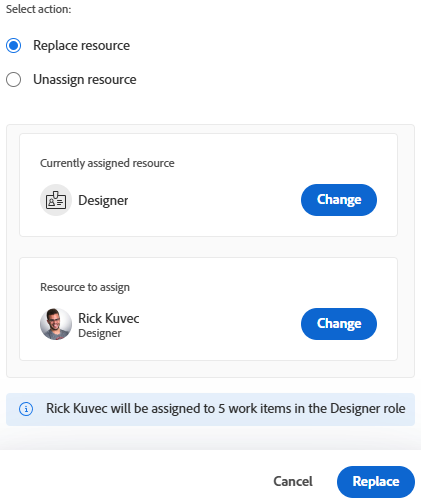

# Massenzuweisung von Arbeit im Workload Balancer

<!--Audited: 07/2024-->

Mit dem Adobe Workfront Workload-Balancer können Sie Ressourcen mehreren Aufgaben und Problemen stapelweise zuweisen.

Allgemeine Informationen zum Zuweisen von Arbeit zu Benutzern mithilfe des Workload Balancer finden Sie unter [Übersicht über die Zuweisung von Arbeit im Workload Balancer](../../resource-mgmt/workload-balancer/assign-work-in-workload-balancer.md).

## Zugriffsanforderungen

+++ Erweitern, um die Zugriffsanforderungen für die in diesem Artikel beschriebene Funktionalität anzuzeigen.

<table style="table-layout:auto"> 
 <col> 
 <col> 
 <tbody> 
  <tr> 
   <td>Adobe Workfront-Paket</td> 
   <td>
Beliebig
</td>
  </tr>
  <tr> 
   <td>Adobe Workfront-Lizenz</td> 
   <td>
Standard

       
Planung, wenn der Workload Balancer im Bereich „Ressourcen“ verwendet wird; Arbeit, wenn der Workload Balancer eines Teams oder Projekts verwendet wird
</td>
  </tr>
  <tr> 
   <td>Konfigurationen der Zugriffsebene</td> 
   <td> 
Zugriff auf Folgendes bearbeiten:
 
    <ul> 
     <li>Ressourcenverwaltung</li> 
     <li>Projekte</li> 
     <li>Aufgaben</li> 
     <li>Probleme</li> 
    </ul>
   </td> 
  </tr> 
  <tr> 
   <td>Objektberechtigungen</td> 
   <td>Tragen Sie Berechtigungen oder höher zu den Projekten, Aufgaben und Problemen bei, die „Zuweisungen vornehmen“ enthalten</td> 
  </tr> 
 </tbody> 
</table>

Weitere Informationen finden Sie unter [Zugriffsanforderungen](/help/quicksilver/administration-and-setup/add-users/access-levels-and-object-permissions/access-level-requirements-in-documentation.md) in der Dokumentation zu Workfront.

+++

## Überlegungen zum Erstellen umfangreicher Zuweisungen im Workload Balancer

* Sie können Ressourcenzuweisungen für mehrere Aufgaben und Probleme schnell in einem oder mehreren Projekten verwalten. Änderungen an Zuweisungen sind im Workload Balancer sofort sichtbar.
* Sie können keine Ressourcen Arbeitselementen zuweisen, die abgeschlossen sind, oder Elementen, die sich in einem abgeschlossenen Projekt befinden.
* Beim Massenzuweisen von Aufgabengebieten und Benutzern haben Sie folgende Möglichkeiten:

   * Ersetzen Sie Zuweisungen zwischen Benutzern und Rollen in allen gültigen Kombinationen.
   * Heben Sie die Zuweisung von Benutzenden zu allen Arbeitselementen auf.

**BEISPIELE**

* Sie sind für die Zuweisung von Benutzerzuweisungen an mehrere neue Projekte verantwortlich. Die Projekte wurden ursprünglich aus Vorlagen erstellt und Aufgabengebiete sind bereits den verschiedenen Aufgaben innerhalb der Projekte zugewiesen. Sie möchten allen Aufgaben, die derzeit einem Aufgabengebiet zugewiesen sind, einen bestimmten Benutzer, Jackie Simms, zuweisen. Mit der Funktion Ersetzen können Sie Jackie Simms diese Aufgaben zuweisen.
* Jackie Simms werden 45 Aufgaben in 3 verschiedenen Projekten zugewiesen. Jackie verlässt die Organisation, und jetzt müssen Sie ihre Aufgaben einem anderen Benutzer zuweisen. Mit der Funktion Ersetzen können Sie diese Aufgaben der neuen Person zuweisen.
* 10 Aufgaben aus 2 verschiedenen Projekten werden einem anderen Benutzer, Rick Kuvec, zugewiesen. Sie erkennen, dass Rick irrtümlich diesen Aufgaben zugewiesen wurde, aber Sie sind sich nicht sicher, wem sie zu diesem Zeitpunkt zugewiesen werden müssen. Sie müssen die Zuweisung von Rick zu allen Aufgaben gleichzeitig aufheben. Mit der Funktion Zuweisung aufheben können Sie Rick aus diesen Aufgaben entfernen.

## Massenzuweisung von Arbeit im Workload Balancer

1. Wechseln Sie zum Workload Balancer, dem Sie Arbeit zuweisen möchten.

   Sie können Benutzern mithilfe des Workload Balancer im Bereich Ressource, auf Projekt- oder auf Teamebene Arbeit zuweisen. Weitere Informationen dazu, wo sich der Workload-Balancer in Workfront befindet, finden Sie unter [Suchen des Workload-Balancer](../../resource-mgmt/workload-balancer/locate-workload-balancer.md).

1. Klicken Sie **Massenzuweisungen**  oben im Workload-Balancer.

   Das Bedienfeld Massenzuweisungen wird rechts neben dem Workload-Balancer geöffnet.

1. (Bedingt) Wenn Sie über den Bereich Ressourcen oder für ein Team auf den Workload Balancer zugreifen, erweitern Sie das Dropdown-Menü **Projekt: Name** und wählen Sie mithilfe der Filtermodifikatoren das Projekt oder die Projekte aus, denen Sie Zuweisungen erteilen möchten. Sie können Projekte nach Name (dies ist die Standardoption) oder Status auswählen.

   Informationen zu Workfront-Filtermodifikatoren finden Sie [Filter und Bedingungsmodifikatoren](../../reports-and-dashboards/reports/reporting-elements/filter-condition-modifiers.md).

   >[!NOTE]
   >
   >Der Projektname wird beim Zugriff auf den Workload-Balancer für ein Projekt standardmäßig ausgewählt.

   

1. (Optional) Klicken Sie auf **Projektaufgaben auswählen** um die Aufgabe(n) auszuwählen, für die Sie Zuweisungen vornehmen möchten, wählen Sie dann im Dropdown-Menü **Aufgabe: Name** die Option Aufgaben nach Name (dies ist die Standardoption) oder Status aus und verwenden Sie die Filtermodifikatoren, um nach bestimmten Aufgaben zu suchen.

   Informationen zu Workfront-Filtermodifikatoren finden Sie [Filter und Bedingungsmodifikatoren](../../reports-and-dashboards/reports/reporting-elements/filter-condition-modifiers.md).

   >[!NOTE]
   >
   >Sie können keine Aufgaben mit dem Status Abgeschlossen auswählen.

   

   >[!TIP]
   >
   >Lassen Sie diese Auswahl leer, wenn Sie sowohl für Probleme als auch für Aufgaben Massenzuweisungen vornehmen möchten.

1. (Optional) Klicken Sie auf das **Löschen**-Symbol  neben einem der ausgewählten Kriterien

   ODER

   Klicken **oben rechts** Bedienfeld Massenzuweisungen auf „Alle löschen“, um alle Auswahlen zu entfernen.

1. Wählen Sie eine der folgenden Optionen aus und fahren Sie mit den unten beschriebenen Schritten fort:

   * [Ressource ersetzen](#replace-user)
   * [Zuweisung der Ressource aufheben](#unassign-user)

   >[!TIP]
   >
   >Wenn keine Elemente mit den ausgewählten Filtern übereinstimmen, werden diese Optionen abgeblendet.

<!--

### Assign user {#assign-user}

When you assign a user using Bulk Assignments in the Workload Balancer, the following things occur:

* A user is assigned to all work items currently assigned to a specified role within the selected projects.
* The user is not assigned to the following types of work items:

   * Items that are already assigned to a user.
   * Completed items.

* If the user you selected is not associated with the specified role, the role is replaced by the user in the user's Primary Role.

To assign a user to work items previously assigned to job roles:

1. Start assigning work items using Bulk Assignments in the Workload Balancer as described above and select **Assign**. 

1. In the **Role assignment** field, click the drop-down arrow to choose from a list of roles. Only roles currently assigned within the specified projects are displayed. This is a required field. 

   

1. In the **User to assign** field, click the drop-down arrow to choose from a list of suggested users or to type another user's name.

   Select users from the following areas:

   * **Suggested Assignments**: Users who can fulfill the selected role and who match the criteria for Smart Assignments. For more information, see [Smart assignments overview](../../manage-work/tasks/assign-tasks/smart-assignments.md).
   * **Other Assignments**: All users in the system who can fulfill the selected role. 
   
      >[!TIP]
      >
      >Only the first 50 users are listed in the Other Assignments area.

   After selecting a user, Workfront displays a note about the number of items where the user you specified will be assigned and what job role they will replace.

   >[!TIP]
   >
   >All the roles of the user display in the list, under the user's name.

1. Click **Assign**.

   The specified roles are replaced with the users that you selected.

   You receive a confirmation about how many work items have had the selected role replaced with the selected user.

   

-->

### Ressource ersetzen {#replace-user}

Sie können eine Ressource, die bereits Arbeitselementen zugeordnet ist, in den ausgewählten Projekten durch eine andere Ressource ersetzen.

Der Ressourcenersatz kann wie folgt lauten:

* Funktion mit Funktion
* Benutzer mit Benutzer
* Benutzer mit Rolle
* Rolle mit dem Benutzer

Wenn Sie eine Ressource mithilfe von Massenzuweisungen im Workload Balancer durch eine andere Ressource ersetzen, treten folgende Dinge auf:

* Die Ersatzressource wird allen Arbeitselementen zugewiesen, die derzeit in den ausgewählten Projekten der ursprünglichen Ressource zugeordnet sind.
* Die neue Ressource ist keinem Arbeitselement zugewiesen, das bereits als „Abgeschlossen“ markiert ist.
* Für die Ersetzung von Benutzer zu Benutzer: Wenn die mit dem ersten Benutzer verknüpfte Rolle mit keiner der Rollen des zweiten Benutzers übereinstimmt, wird der zweite Benutzer in seiner Primären Rolle zugewiesen.

So ersetzen Sie eine Ressource durch eine andere:

1. Wählen Sie Arbeitselemente im Bereich Massenzuweisungen für den Workload-Balancer wie oben beschrieben aus und wählen Sie **Ressource ersetzen**.
1. Klicken Sie im Feld **Aktuell zugewiesene Ressource** auf den Dropdown-Pfeil, um aus einer Liste von Ressourcen auszuwählen. Nur Ressourcen, die derzeit unvollständigen Arbeitselementen innerhalb der angegebenen Projekte zugewiesen sind, werden angezeigt. Dies ist ein Pflichtfeld.

   

1. Klicken Sie im Feld **Zuzuweisende Ressource** auf den Dropdown-Pfeil, um aus einer Liste mit empfohlenen Ressourcen auszuwählen oder ein anderes Aufgabengebiet oder einen anderen Benutzernamen einzugeben. Die als Erstes aufgelisteten Ressourcen entsprechen standardmäßig den Kriterien für Smart Assignments. Weitere Informationen finden Sie unter [Smart Assignments - Übersicht](../../manage-work/tasks/assign-tasks/smart-assignments.md).

   Workfront zeigt einen Hinweis zur Anzahl der Elemente an, bei denen die aktuell zugewiesene Ressource die zweite Ressource ersetzt.

1. Klicken Sie **Ersetzen**.

   Die erste Ressource wird in allen Arbeitselementen des ausgewählten Projekts oder Vorgangs durch die zweite Ressource ersetzt.

   Sie erhalten eine Bestätigung darüber, wie viele Arbeitselemente mit der ursprünglichen Zuweisung durch die ausgewählte zweite Ressource ersetzt wurden.

### Zuweisung der Ressource aufheben {#unassign-user}

Sie können die Zuweisung einer Ressource zu allen Arbeitselementen aufheben, denen sie in den ausgewählten Projekten zugewiesen sind.

Wenn Sie die Zuweisung von Benutzenden zu allen Arbeitsaufträgen mithilfe von Massenzuweisungen im Workload Balancer aufheben, treten folgende Dinge auf:

* Der angegebene Benutzer wird aus allen Arbeitselementen entfernt, denen er zugewiesen ist.
* Wenn der nicht zugewiesene Benutzer Aufgabengebieten zugeordnet ist, bleiben die Aufgabengebiete den Arbeitselementen zugewiesen, wenn der Benutzer entfernt wird.

* Wenn der angegebene Benutzer Arbeitselementen zugewiesen wird, die abgeschlossen sind, bleibt der Benutzer diesen Arbeitselementen zugewiesen.

Weitere Informationen zu Benutzer- und Aufgabenrollenzuweisungen finden Sie unter [Übersicht über die Zuweisung von Arbeit im Workload-Balancer](../../resource-mgmt/workload-balancer/assign-work-in-workload-balancer.md).

So heben Sie die Zuweisung eines Benutzers zu Arbeitselementen in den ausgewählten Projekten oder zu den ausgewählten Aufgaben oder Problemen auf, denen er zugewiesen ist:

1. Wählen Sie Arbeitselemente im Bereich „Massenzuweisungen an den Workload-Balancer“ wie oben beschrieben aus und wählen Sie **Zuweisung der Ressource aufheben**.

1. Klicken Sie **Feld „Zuweisung des** aufheben“ auf den Dropdown-Pfeil, um aus einer Benutzerliste auszuwählen. Nur Benutzer, denen derzeit unvollständige Arbeitselemente innerhalb der angegebenen Projekte zugewiesen sind, werden angezeigt. Dies ist ein Pflichtfeld.

   

   Workfront zeigt einen Hinweis zur Anzahl der Elemente an, deren Zuweisung für den aktuell zugewiesenen Benutzer aufgehoben wird.

1. Klicken Sie **Zuweisung aufheben**.\
   Sie erhalten eine Bestätigung über die Anzahl der Arbeitselemente, aus denen der angegebene Benutzer entfernt wurde.

