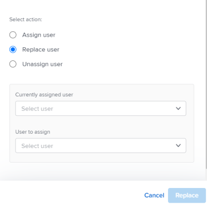

# Massenzuweisung von Arbeit mit dem Workload Balancer

<!--Audited: 07/2024-->

Mit dem Adobe Workfront Workload-Balancer können Sie Ressourcen mehreren Aufgaben und Problemen stapelweise zuweisen.

Allgemeine Informationen zum Zuweisen von Arbeit zu Benutzern mithilfe des Workload Balancer finden Sie unter [Übersicht über die Zuweisung von Arbeit im Workload Balancer](../../resource-mgmt/workload-balancer/assign-work-in-workload-balancer.md).

## Zugriffsanforderungen

+++ Erweitern Sie , um die Zugriffsanforderungen für die -Funktion in diesem Artikel anzuzeigen.

<table style="table-layout:auto"> 
 <col> 
 <col> 
 <tbody> 
  <tr> 
   <td>Adobe Workfront-Paket</td> 
   <td>
Beliebig
</td>
  </tr>
  <tr> 
   <td>Adobe Workfront-Lizenz</td> 
   <td>
Standard

       
Planung, wenn der Workload Balancer im Bereich „Ressourcen“ verwendet wird; Arbeit, wenn der Workload Balancer eines Teams oder Projekts verwendet wird
</td>
  </tr>
  <tr> 
   <td>Konfigurationen der Zugriffsebene</td> 
   <td> 
Zugriff auf Folgendes bearbeiten:
 
    <ul> 
     <li>Ressourcenverwaltung</li> 
     <li>Projekte</li> 
     <li>Aufgaben</li> 
     <li>Probleme</li> 
    </ul>
   </td> 
  </tr> 
  <tr> 
   <td>Objektberechtigungen</td> 
   <td>Tragen Sie Berechtigungen oder höher zu den Projekten, Aufgaben und Problemen bei, die „Zuweisungen vornehmen“ enthalten</td> 
  </tr> 
 </tbody> 
</table>

Weitere Informationen finden Sie unter [Zugriffsanforderungen in der Dokumentation zu Workfront](/help/quicksilver/administration-and-setup/add-users/access-levels-and-object-permissions/access-level-requirements-in-documentation.md).

+++

## Überlegungen zum Erstellen umfangreicher Zuweisungen im Workload Balancer

* Sie können schnell Benutzerzuweisungen für mehrere Aufgaben und Probleme in einem oder mehreren Projekten verwalten. Änderungen an Zuweisungen sind im Workload Balancer sofort sichtbar.
* Sie können keine Ressourcen Arbeitselementen zuweisen, die abgeschlossen sind, oder Elementen, die sich in einem abgeschlossenen Projekt befinden.
* Beim Massenzuweisen von Benutzern haben Sie folgende Möglichkeiten:

   * Weisen Sie einen Benutzer allen Arbeitselementen zu, die derzeit einem Aufgabengebiet zugewiesen sind.
   * Ersetzen von Benutzerzuweisungen zwischen Benutzern.
   * Heben Sie die Zuweisung von Benutzenden zu allen Arbeitselementen auf.

**BEISPIELE**

* Sie sind für die Zuweisung von Benutzerzuweisungen an mehrere neue Projekte verantwortlich. Die Projekte wurden ursprünglich aus Vorlagen erstellt und Aufgabengebiete sind bereits den verschiedenen Aufgaben innerhalb der Projekte zugewiesen. Sie möchten allen Aufgaben, die derzeit einem Aufgabengebiet zugewiesen sind, einen bestimmten Benutzer, Jackie Simms, zuweisen. Sie können die Funktion Zuweisen verwenden, um diese Aufgaben Jackie Simms zuzuweisen.
* Jackie Simms werden 45 Aufgaben in 3 verschiedenen Projekten zugewiesen. Jackie verlässt die Organisation, und jetzt müssen Sie ihre Aufgaben einem anderen Benutzer zuweisen. Mit der Funktion Ersetzen können Sie diese Aufgaben der neuen Person zuweisen.
* 10 Aufgaben aus 2 verschiedenen Projekten werden einem anderen Benutzer, Rick Kuvec, zugewiesen. Sie erkennen, dass Rick irrtümlich diesen Aufgaben zugewiesen wurde, aber Sie sind sich nicht sicher, wem sie zu diesem Zeitpunkt zugewiesen werden müssen. Sie müssen die Zuweisung von Rick zu allen Aufgaben gleichzeitig aufheben. Mit der Funktion Zuweisung aufheben können Sie Rick aus diesen Aufgaben entfernen.

## Massenzuweisung von Arbeit im Workload Balancer

1. Wechseln Sie zum Workload Balancer, dem Sie Arbeit zuweisen möchten.

   Sie können Benutzern mithilfe des Workload Balancer im Bereich Ressource, auf Projekt- oder auf Teamebene Arbeit zuweisen. Weitere Informationen dazu, wo sich der Workload-Balancer in Workfront befindet, finden Sie unter [Suchen des Workload-Balancer](../../resource-mgmt/workload-balancer/locate-workload-balancer.md).

1. Klicken Sie **Massenzuweisungen**  oben im Workload-Balancer.

   Das Bedienfeld Massenzuweisungen wird rechts neben dem Workload-Balancer geöffnet.

1. (Bedingt) Wenn Sie über den Bereich Ressourcen oder für ein Team auf den Workload Balancer zugreifen, erweitern Sie das Dropdown-Menü **Projekt: Name** und wählen Sie mithilfe der Filtermodifikatoren das Projekt oder die Projekte aus, denen Sie Zuweisungen erteilen möchten. Sie können Projekte nach Name (dies ist die Standardoption) oder Status auswählen.

   Informationen zu Workfront-Filtermodifikatoren finden Sie [Filter und Bedingungsmodifikatoren](../../reports-and-dashboards/reports/reporting-elements/filter-condition-modifiers.md).

   >[!NOTE]
   >
   >Der Projektname wird beim Zugriff auf den Workload-Balancer für ein Projekt standardmäßig ausgewählt.

   

1. (Optional) Klicken Sie auf **Projektaufgaben auswählen** um die Aufgabe(n) auszuwählen, für die Sie Zuweisungen vornehmen möchten, wählen Sie dann im Dropdown-Menü **Aufgabe: Name** die Option Aufgaben nach Name (dies ist die Standardoption) oder Status aus und verwenden Sie die Filtermodifikatoren, um nach bestimmten Aufgaben zu suchen.

   Informationen zu Workfront-Filtermodifikatoren finden Sie [Filter und Bedingungsmodifikatoren](../../reports-and-dashboards/reports/reporting-elements/filter-condition-modifiers.md).

   >[!NOTE]
   >
   >Sie können keine Aufgaben mit dem Status Abgeschlossen auswählen.

   

   >[!TIP]
   >
   >Lassen Sie diese Auswahl leer, wenn Sie sowohl für Probleme als auch für Aufgaben Massenzuweisungen vornehmen möchten.

1. (Optional) Klicken Sie auf das **Löschen**-Symbol  neben einem der ausgewählten Kriterien

   Oder

   Klicken **oben rechts** Bedienfeld Massenzuweisungen auf „Alle löschen“, um alle Auswahlen zu entfernen.

1. Wählen Sie eine der folgenden Optionen aus und fahren Sie mit den unten beschriebenen Schritten fort:

   * [Benutzer zuweisen](#assign-user)
   * [Benutzer ersetzen](#replace-user)
   * [Zuweisung des Benutzers aufheben](#unassign-user)

   >[!TIP]
   >
   >Wenn keine Elemente mit den ausgewählten Filtern übereinstimmen, werden diese Optionen abgeblendet.

### Benutzer zuweisen {#assign-user}

Wenn Sie einen Benutzer mithilfe von Massenzuweisungen im Workload Balancer zuweisen, treten folgende Dinge auf:

* Ein(e) Benutzende(r) wird allen Arbeitselementen zugewiesen, die derzeit in den ausgewählten Projekten einer bestimmten Rolle zugewiesen sind.
* Der Benutzer ist den folgenden Arten von Arbeitselementen nicht zugewiesen:

   * Elemente, die bereits einem Benutzer zugewiesen sind.
   * Abgeschlossene Elemente.

* Wenn der ausgewählte Benutzer nicht mit der angegebenen Rolle verknüpft ist, wird die Rolle durch den Benutzer in der Primären Rolle des Benutzers ersetzt.

So weisen Sie einen Benutzer Arbeitselementen zu, die zuvor Aufgabengebieten zugewiesen waren:

1. Beginnen Sie, wie oben beschrieben, mit der Zuweisung von Arbeitselementen mithilfe von Massenzuweisungen im Workload Balancer und wählen Sie **Zuweisen**.

1. Klicken Sie im Feld **Rollenzuweisung** auf den Dropdown-Pfeil, um aus einer Liste von Rollen auszuwählen. Es werden nur Rollen angezeigt, die derzeit innerhalb der angegebenen Projekte zugewiesen sind. Dies ist ein Pflichtfeld.

   

1. Klicken Sie im Feld **Zuzuweisender Benutzer** auf den Dropdown-Pfeil, um aus einer Liste empfohlener Benutzer auszuwählen oder den Namen eines anderen Benutzers einzugeben.

   Wählen Sie Benutzer aus den folgenden Bereichen aus:

   * **Vorgeschlagene Zuweisungen**: Benutzer, die die ausgewählte Rolle erfüllen können und die den Kriterien für intelligente Zuweisungen entsprechen. Weitere Informationen finden Sie unter [Smart Assignments - Übersicht](../../manage-work/tasks/assign-tasks/smart-assignments.md).
   * **Andere Zuweisungen**: Alle Benutzer im System, die die ausgewählte Rolle erfüllen können.

     >[!TIP]
     >
     >Nur die ersten 50 Benutzer werden im Bereich Sonstige Zuweisungen aufgeführt.

   Nach Auswahl eines Benutzers zeigt Workfront einen Hinweis zur Anzahl der Elemente an, denen der angegebene Benutzer zugewiesen wird, und zu dem Aufgabengebiet, das er ersetzen wird.

   >[!TIP]
   >
   >Alle Rollen des Benutzers werden in der Liste unter dem Namen des Benutzers angezeigt.

1. Klicken Sie **Zuweisen**.

   Die angegebenen Rollen werden durch die von Ihnen ausgewählten Benutzer ersetzt.

   Sie erhalten eine Bestätigung darüber, wie viele Arbeitselemente mit der ausgewählten Rolle durch den ausgewählten Benutzer ersetzt wurden.

   

### Benutzerin bzw. Benutzer ersetzen {#replace-user}

Sie können einen Benutzer, der bereits Arbeitselementen zugewiesen ist, in den ausgewählten Projekten durch einen anderen Benutzer ersetzen.

Wenn Sie einen Benutzer mithilfe von Massenzuweisungen im Workload Balancer durch einen anderen Benutzer ersetzen, treten folgende Dinge auf:

* Der Ersatzbenutzer wird allen Arbeitselementen zugewiesen, die derzeit einem ursprünglichen Benutzer in den ausgewählten Projekten zugewiesen sind.

* Der neue Benutzer ist keinem Arbeitselement zugewiesen, das bereits als „Abgeschlossen“ markiert ist.
* Wenn die mit dem ersten Benutzer verknüpfte Rolle mit keiner der Rollen des zweiten Benutzers übereinstimmt, wird der zweite Benutzer in seiner Primären Rolle zugewiesen.

So ersetzen Sie einen Benutzer durch einen anderen Benutzer:

1. Weisen Sie Arbeitselemente im Workload Balancer wie oben beschrieben zu und wählen Sie **Ersetzen**.
1. Klicken Sie im Feld **Aktuell zugewiesener Benutzer** auf den Dropdown-Pfeil, um aus einer Benutzerliste auszuwählen. Es werden nur Benutzende angezeigt, die derzeit unvollständigen Arbeitselementen innerhalb der angegebenen Projekte zugewiesen sind. Dies ist ein Pflichtfeld.

   

1. Klicken Sie im Feld **Zuzuweisender Benutzer** auf den Dropdown-Pfeil, um aus einer Liste empfohlener Benutzer auszuwählen oder einen anderen Benutzernamen einzugeben. Die in der Liste aufgelisteten Benutzer entsprechen standardmäßig den Kriterien für Smart Assignments. Weitere Informationen finden Sie unter [Smart Assignments - Übersicht](../../manage-work/tasks/assign-tasks/smart-assignments.md).

   Workfront zeigt einen Hinweis zur Anzahl der Elemente an, bei denen der aktuell zugewiesene Benutzer den zweiten Benutzer ersetzt, und zu den Rollen, die er ersetzen wird.

   

1. Klicken Sie **Ersetzen**.

   Der erste ausgewählte Benutzer wird in allen Arbeitselementen des ausgewählten Projekts durch den zweiten Benutzer ersetzt.

   Sie erhalten eine Bestätigung darüber, wie viele Arbeitselemente mit der ursprünglichen Benutzerzuweisung durch den ausgewählten zweiten Benutzer ersetzt wurden.

### Zuweisung des Benutzers aufheben {#unassign-user}

Sie können die Zuweisung eines Benutzers für alle Arbeitselemente aufheben, denen der Benutzer in den ausgewählten Projekten zugewiesen ist.

Wenn Sie die Zuweisung von Benutzenden zu allen Arbeitsaufträgen mithilfe von Massenzuweisungen im Workload Balancer aufheben, treten folgende Dinge auf:

* Der angegebene Benutzer wird aus allen Arbeitselementen entfernt, denen er zugewiesen ist.
* Wenn der nicht zugewiesene Benutzer Aufgabengebieten zugeordnet ist, bleiben die Aufgabengebiete den Arbeitselementen zugewiesen, wenn der Benutzer entfernt wird.

* Wenn der angegebene Benutzer Arbeitselementen zugewiesen wird, die abgeschlossen sind, bleibt der Benutzer diesen Arbeitselementen zugewiesen.

Weitere Informationen zu Benutzer- und Aufgabenrollenzuweisungen finden Sie unter [Übersicht über die Zuweisung von Arbeit im Workload-Balancer](../../resource-mgmt/workload-balancer/assign-work-in-workload-balancer.md).

So heben Sie die Zuweisung eines Benutzers zu Arbeitselementen in den ausgewählten Projekten oder zu den ausgewählten Aufgaben oder Problemen auf, denen er zugewiesen ist:

1. Weisen Sie Arbeitselemente im Workload Balancer wie oben beschrieben zu und wählen Sie **Zuweisung aufheben**.

1. Klicken Sie **Feld „Zuweisung des** aufheben“ auf den Dropdown-Pfeil, um aus einer Benutzerliste auszuwählen. Nur Benutzer, denen derzeit unvollständige Arbeitselemente innerhalb der angegebenen Projekte zugewiesen sind, werden angezeigt. Dies ist ein Pflichtfeld.

   

   Workfront zeigt einen Hinweis zur Anzahl der Elemente an, deren Zuweisung für den aktuell zugewiesenen Benutzer aufgehoben wird.

   

1. Klicken Sie **Zuweisung aufheben**.\
   Sie erhalten eine Bestätigung über die Anzahl der Arbeitselemente, aus denen der angegebene Benutzer entfernt wurde.

