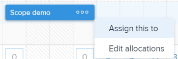

# Übersicht über die Zuweisung von Arbeit im Workload Balancer

Als Ressourcen-Manager können Sie den Adobe Workfront-Workload-Balancer verwenden, um Arbeitselemente anzuzeigen, die Benutzenden noch nicht zugewiesen wurden, und diese Elemente ihnen zuzuweisen.

Allgemeine Informationen zum Workload-Balancer finden Sie unter [Übersicht über den Workload-Balancer](../../resource-mgmt/workload-balancer/overview-workload-balancer.md).

Sie können Benutzenden in anderen Bereichen von Workfront Arbeitselemente (Aufgaben und Probleme) zuweisen. Mithilfe des Workload Balancer können Sie jedoch die Verfügbarkeit der Benutzer leicht nachvollziehen und alle anderen Elemente, denen sie zugewiesen sind, sehen, bevor Sie ihnen weitere Arbeit zuweisen.

Informationen zum Zuweisen von Arbeitselementen in anderen Bereichen von Workfront finden Sie in den folgenden Artikeln:

* [Aufgaben zuweisen](../../manage-work/tasks/assign-tasks/assign-tasks.md)
* [Probleme zuweisen](../../manage-work/issues/manage-issues/assign-issues.md)

## Benutzerverfügbarkeit im Workload Balancer

Sie können Arbeit im Workload Balancer zuweisen, um sie an die verfügbare Zeit der Benutzenden anzupassen. Um sicherzustellen, dass Sie den richtigen Arbeitsaufwand zuweisen und den Benutzer nicht übermäßig zuweisen, muss die Summe der geplanten Stunden der dem Benutzer zugewiesenen Arbeitselemente mit der täglichen oder wöchentlichen Zuordnung des Benutzers übereinstimmen.

Sie müssen verstehen, wie Workfront die verfügbare Zeit für einen Benutzer berechnet.

Workfront verwendet die folgenden Informationen, um die Kapazität des/r Benutzenden im Workload Balancer zu berechnen:

* Die Voreinstellungen für die Ressourcenverwaltung. Der Workfront-Administrator bestimmt, wie die verfügbare Zeit für das System berechnet wird, indem er im Bereich Ressourcenverwaltung im Setup eine der folgenden Optionen auswählt:

   * Der Standardzeitplan des Workfront-Systems und das FTE des Benutzers.
   * Der Zeitplan des Benutzers, wie im Bereich „Benutzerprofil“ angegeben.

     Damit wird die tägliche und wöchentliche Verfügbarkeit des Benutzers berechnet. Alle Zeitplanausnahmen für den ausgewählten Zeitplan werden in der Kapazität des/der Benutzenden im Workload-Balancer angezeigt.

  Weitere Informationen finden Sie unter [Voreinstellungen für die Ressourcenverwaltung konfigurieren](../../administration-and-setup/set-up-workfront/configure-system-defaults/configure-resource-mgmt-preferences.md).

  Weitere Informationen zu Zeitplänen finden Sie unter [Erstellen eines Zeitplans](../../administration-and-setup/set-up-workfront/configure-timesheets-schedules/create-schedules.md)

* Die Urlaubszeit des Benutzers. Dies zeigt an, an welchen Tagen der Benutzer den Flug starten möchte.

  Weitere Informationen finden Sie unter [Konfigurieren von Urlaubsterminen](../../workfront-basics/manage-your-account-and-profile/configuring-your-user-profile/personal-time-overview.md).

* Die Arbeitszeit des Benutzers. Dies gibt den Prozentsatz der FTE-Zeit an, die der Benutzer für die Durchführung tatsächlicher projektbezogener Arbeiten zur Verfügung steht, ohne Gemeinkosten. Legen Sie den Wert für Arbeitszeit auf 1 fest, um anzugeben, dass der Benutzer für projektbezogene Arbeit bis zum gesamten Vollzeitäquivalent verfügbar ist.

## Zuweisen von Arbeit im Workload Balancer

Sie können Arbeitselemente, die noch keinem Benutzer zugewiesen wurden, oder Elemente, die Benutzern im Workload Balancer zugewiesen wurden, neu zuweisen.

Sie können Arbeit im Workload Balancer wie folgt zuweisen:

* Jeweils ein Element durch manuelles Zuweisen jedes Elements.

  Erweiterte Zuweisungen können vorgenommen werden, wenn Elemente manuell einzeln zugewiesen werden.

  Weitere Informationen finden Sie unter [Arbeiten manuell über den Workload Balancer zuweisen](../../resource-mgmt/workload-balancer/assign-work-in-workload-balancer-manually.md).

* Jeweils ein Element durch Ziehen und Ablegen von Arbeitselementen an den Benutzer, der zugewiesen werden muss.

  Weitere Informationen finden Sie unter [Zuweisen von Arbeit im Workload Balancer durch Ziehen und Ablegen](../../resource-mgmt/workload-balancer/assign-work-in-workload-balancer-by-drag-and-drop.md).

* Gleichzeitige Verwendung mehrerer Elemente mithilfe der Option für Massenzuweisungen. Sie können Regeln definieren, mit denen Elemente mehreren Benutzern gleichzeitig zugewiesen werden.

  Weitere Informationen finden Sie unter [Massenzuweisung von Arbeit mit dem Workload-Balancer](../../resource-mgmt/workload-balancer/assign-work-in-workload-balancer-in-bulk.md).

Informationen zum Aufheben der Zuweisung von Arbeit finden [ unter „Zuweisung von Arbeit im Workload Balancer aufheben](../../resource-mgmt/workload-balancer/unassign-work-in-workload-balancer.md).

## Arbeitsauftragsbereiche im Workload Balancer

Sie können Benutzern mithilfe des Workload Balancer im Bereich Ressource, auf Projekt- oder auf Teamebene Arbeit zuweisen. Weitere Informationen dazu, wo sich der Workload-Balancer in Workfront befindet, finden Sie unter [Suchen des Workload-Balancer](../../resource-mgmt/workload-balancer/locate-workload-balancer.md).

Im Workload Balancer gibt es zwei Bereiche, in denen Sie Arbeitselemente anzeigen können:

* **Nicht zugewiesene Arbeit**: Zeigt Elemente an, die Benutzern nicht zugewiesen sind.
* **Zugewiesene Arbeit** zeigt Elemente an, die Benutzern zugewiesen sind.

In der folgenden Tabelle wird beschrieben, welche Elemente in den einzelnen Bereichen basierend auf ihren Zuweisungen angezeigt werden:

<table style="table-layout:auto"> 
 <col> 
 <col> 
 <col> 
 <tbody> 
  <tr> 
   <td><strong>Art der Zuweisung</strong> </td> 
   <td colspan="2"><strong>Bereiche, in denen die Zuweisungen sichtbar sind</strong> </td> 
  </tr> 
  <tr> 
   <td> </td> 
   <td>Nicht zugewiesene Arbeit </td> 
   <td>Zugewiesene Arbeit </td> 
  </tr> 
  <tr data-mc-conditions=""> 
   <td>Nicht zugewiesenes Element </td> 
   <td>✔ </td> 
   <td> </td> 
  </tr> 
  <tr> 
   <td>Team</td> 
   <td>✔</td> 
   <td> </td> 
  </tr> 
  <tr data-mc-conditions=""> 
   <td>Rolle </td> 
   <td>✔ </td> 
   <td> </td> 
  </tr> 
  <tr> 
   <td>Funktion und Team</td> 
   <td>✔</td> 
   <td> </td> 
  </tr> 
  <tr> 
   <td>Benutzerin oder Benutzer</td> 
   <td> </td> 
   <td>✔</td> 
  </tr> 
  <tr> 
   <td>Benutzer und Team</td> 
   <td> 
 
 </td> 
   <td>✔</td> 
  </tr> 
  <tr> 
   <td>Benutzer, Funktion und Team</td> 
   <td>✔*</td> 
   <td>✔**</td> 
  </tr> 
  <tr data-mc-conditions=""> 
   <td> 
Benutzer und Rolle
 </td> 
   <td>✔*</td> 
   <td>✔**</td> 
  </tr> 
 </tbody> 
</table>

&#42;Wenn ein Arbeitselement einem Benutzer und einer Funktion zugewiesen wird, wird es im Bereich Nicht zugewiesene Arbeit nur angezeigt, wenn die Funktion der Primäre Zugewiesene ist.

&#42;&#42;Wenn ein Arbeitselement einem Benutzer und einer anderen Entität zugewiesen wird, wird es im Bereich Zugewiesene Arbeit nur angezeigt, wenn der Benutzer der Primäre Bearbeiter ist.

Weitere Informationen zu den Bereichen „Nicht zugewiesen“ und „Zugewiesen“ im Workload Balancer finden Sie unter [Navigieren im Workload Balancer](../../resource-mgmt/workload-balancer/navigate-the-workload-balancer.md).

## Überlegungen zu mehreren Zuweisungen an Aufgabengebiete, Teams und Benutzer

Beachten Sie Folgendes, wenn Sie einem Arbeitselement mehrere Ressourcen zuweisen:

* Benutzern kann mehr als ein Aufgabengebiet mit ihrem Profil zugeordnet sein. Informationen zum Verknüpfen von Benutzern mit Aufgabengebieten finden Sie unter [Bearbeiten des Benutzerprofils](../../administration-and-setup/add-users/create-and-manage-users/edit-a-users-profile.md).

* Aufgaben oder Probleme werden in der Regel zuerst einem oder mehreren Aufgabengebieten oder einem Team zugewiesen. Wenn Projekte startbereit sind, müssen sie möglicherweise auch Benutzern zugewiesen werden.\
  Wenn eine Aufgabe oder ein Problem einer oder mehreren Rollen zugewiesen ist und Sie dann auch einen Benutzer zuweisen, entscheidet Adobe Workfront gemäß den folgenden Regeln, welches Aufgabengebiet mit dem zusätzlichen Benutzer (falls vorhanden) verknüpft werden soll:

   * Wenn nur ein Aufgabengebiet zugewiesen ist und es mit der Primären Rolle des Benutzers übereinstimmt, wird die Aufgabe oder das Problem nur dem Benutzer zugewiesen, der seine Primäre Rolle erfüllt.
   * Wenn mehrere Rollen zugewiesen sind und mindestens eine der Rollen mit den sekundären Rollen des Benutzers übereinstimmt, wird die Aufgabe oder das Problem dem Benutzer zugewiesen, der eine der anderen Rollen erfüllt (die Workfront zufällig auswählt, wenn mehrere Übereinstimmungen vorliegen), sowie allen zusätzlichen Rollen, die zugewiesen werden.
   * Wenn mindestens ein Aufgabengebiet zugewiesen ist und es keine Übereinstimmungen mit den Rollen des Benutzers gibt, wird die Aufgabe oder das Problem sowohl der Rolle bzw. den Rollen als auch dem Benutzer zugewiesen.

* Wenn eine Aufgabe oder ein Problem einem Team zugewiesen wird und Sie auch einen Benutzer zuweisen, bleibt die Aufgabe oder das Problem sowohl dem Team als auch dem Benutzer zugewiesen.

<!--

<h2 data-mc-conditions="QuicksilverOrClassic.Quicksilver"> Manually assign one item at a time</h2>

(NOTE: Moved manual assignment and drag-and-drop to their own articles) 

<ol>
<li value="1">Go to the Workload Balancer.</li>
<li value="2"> 
Go to the <strong>Unassigned Work</strong> area and apply a filter to view work items
 
Or
 
Go to the <strong>Assigned Work</strong> area and expand the name of a user to view the work items assigned to them.
 <note type="important">
You cannot view and assign issues from the Unassigned Work area. You can only reassign issues already assigned to users in the Assigned Work area. Otherwise, you can assign issues from a list or at the issue level. For information, see
<a href="../../manage-work/issues/manage-issues/assign-issues.md" class="MCXref xref">Assign issues</a>.
</note> </li>
<li value="3"> 
Click the <strong>More menu</strong>  on the bar of a work item, then click <strong>Assign this to</strong>. 
 
  
 <note type="tip">

You can also use the following shortcuts to assign tasks or issues: 

<ul>
<li>In Windows: CTRL+click the task or issue bar. </li>
<li>In&nbsp;Mac: CMD+click the task or issue bar. </li>
</ul>
</note> </li>
<li value="4"> 
Start typing the name of a user, job role, or team that you want to assign to the item in the <strong>Search people, role or teams</strong> field, select it when it displays in the list, then click&nbsp;<strong>Save</strong>. 
 
  
 
This assigns or reassigns the work item to the specified assignees.
 
If you assign an item to just a team or a job role, the item displays only in the Unassigned Work area. You must assign work items to users in order to display them in the Assigned Work area of the Workload Balancer.
 <note type="tip">

You can assign multiple users or job roles, and you can assign only one team. You can assign only active users, job roles, and teams.

If a user, job role, or a team was assigned before they were deactivated, they remain assigned to the work item. In this case, we recommend the following: 

<ul>
<li> 
Reassign the work item to active resources. 
 </li>
<li> 
Associate the users in a deactivated team with an active team and reassign the work item to the active team. 
 </li>
</ul>
</note> </li>
<li value="5"> 
(Optional) Click the <strong>Show allocations icon</strong> , then click the <strong>More menu</strong>  > <strong>Edit allocations</strong>.
 
Or
 
Double-click a daily or weekly allocation to modify the amount of time the user is allocated to the work item.
 
For information about modifying user allocations in the Workload Balancer, see the "Modify user allocations"&nbsp;section in the article <a href="../../resource-mgmt/workload-balancer/manage-user-allocations-workload-balancer.md" class="MCXref xref">Manage user allocations in the Workload Balancer</a>.
 </li>
</ol>

<h2>Assign an item by dragging and dropping</h2>

(NOTE: consider retitling this to "Assign one item at a time by dragging and dropping" when bulk assignments will come???)&nbsp;

You can assign an item from the Unassigned Work area to a user, or you can reassign an already assigned item to another user in the Assigned Work area.

<ol>
<li value="1">Go to the Workload Balancer.</li>
<li value="2"> 
Go to the <strong>Unassigned Work</strong> area and apply a filter to view work items.
 <note type="important">
You cannot view and assign issues from the Unassigned Work area.
</note> </li>
<li value="3"> 
Click the bar of a work item that indicates either the planned or the projected timeline and drag it over the name of a user in the <strong>Assigned</strong> area.
 
The user you hover over to drop the work item to is highlighted.
 <note type="tip">
The Planned Hours for the user you're hovering over update in real time with the number of daily Planned Hours from the work item, to indicate what the impact of adding a new item might be to their overall allocation.
</note> 
  
 </li>
<li value="4"> 
When you are ready, drop the selected work item in the same line as the user's name in the Assigned Area. The item is assigned and the allocated Planned Hours are updated for the user with the new hours from the work item.
 <note type="tip">

If you enabled Group by Project in the Settings area, the assigned task displays under the corresponding project. If the setting is disabled, the assigned task displays in the user area. 

The item displays according to the Workload Balancer criteria for sorting work items.&nbsp;For more information, see <a href="../../resource-mgmt/workload-balancer/navigate-the-workload-balancer.md" class="MCXref xref">Navigate the Workload Balancer</a>.

</note> </li>
<li value="5"> 
(Optional) Click the <strong>Show allocations icon</strong> , then click the <strong>More menu</strong>  > <strong>Edit allocations</strong>. (NOTE: make sure these are still called this, and that the icon has not changed)
 
Or
 
Double-click a daily or weekly allocation to modify the amount of time the user is allocated to the work item.
 
For information about modifying user allocations in the Workload Balancer, see the "Modify user allocations"&nbsp;section in the article <a href="../../resource-mgmt/workload-balancer/manage-user-allocations-workload-balancer.md" class="MCXref xref">Manage user allocations in the Workload Balancer</a>.
 </li>
</ol> 

<h2>Assign items in bulk</h2>

(NOTE: This is also a separate article. Should we keep this section or the separate article?) 

&nbsp;

-->

<!--

<h2>Unassign work items in the Workload Balancer</h2>

(NOTE: moved this section to a new article. Draft here at release to preview) 

You can either unassign items from users and move them to the Unassigned Work area, or reassign them to other users. 

To unassign work items from users: 

<ol>
<li value="1">In the Workload Balancer, go to the <strong>Assigned Work</strong> area and expand a user.</li>
<li value="2">Do 
<MadCap:conditionalText data-mc-conditions="QuicksilverOrClassic.Draft mode">
one of
</MadCap:conditionalText>
the following:
<ul>
<li class="preview" data-mc-conditions="QuicksilverOrClassic.Draft mode">
Find the item you want to unassign in a user's area, click it, drag and drop it in the Unassigned area or in another user's area. 
</li>
<li>
Click the <strong>More</strong> icon  to the right of the name of a work item, click&nbsp;<strong>Assign this to</strong> , then remove the name of the entities assigned to the work item or enter another name and click&nbsp;<strong>Save</strong>.

</li>
</ul>
The item displays in the Unassigned Work area if it matches the filtering criteria for that area and it is not assigned to any users or it displays in the user area if it is assigned to that user. 
<note type="tip">
Unassigned issues do not display in the Unassigned area.
</note>
For information about filtering information in the Workload Balancer, see <a href="../../resource-mgmt/workload-balancer/filter-information-workload-balancer.md" class="MCXref xref">Manage filters in the Workload Balancer</a>. 
</li>
</ol>

-->
