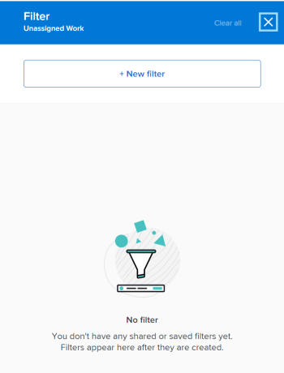

# Filtern von Informationen im Arbeitslastausgleich

<!--
(when they add custom fields to fitlering, add the caveat you added for the Resource Planner : only field NAMES and not LABELS are to be found in the drop-down >> ADD THIS IN THE STEP BELOW WHEN ADDING A FILTER)
-->

Als Ressourcen-Manager können Sie den Lastenausgleich verwenden, um die Arbeitslast Ihrer Benutzer anzuzeigen und zu verwalten. Weitere allgemeine Informationen zum Arbeitslastausgleich finden Sie in den folgenden Artikeln:

* [Übersicht über den Lastenausgleich](../../resource-mgmt/workload-balancer/overview-workload-balancer.md)
* [Navigieren Sie zum Lastenausgleich .](../../resource-mgmt/workload-balancer/navigate-the-workload-balancer.md)

>[!IMPORTANT]
>
>Um Arbeitselemente effizient zu finden und uns auf die von Ihnen verwalteten Benutzer oder Elemente zu konzentrieren, empfehlen wir dringend, Filter im Arbeitsladeregel zu verwenden. Auf diese Weise können Sie die richtigen Informationen anzeigen, bevor Sie mit der Verwaltung der Ressourcenzuweisungen beginnen.
>
>Wenn Sie einen neuen Filter speichern und anwenden und dann vom Arbeitslastausgleich weg navigieren, bleibt der Filter auch nach dem Abmelden und erneuten Anmelden erhalten.

Dieser Artikel enthält Informationen zu Filtern im Arbeitslastausgleich. Informationen zu Filtern in Workfront finden Sie unter [Filterübersicht](../../reports-and-dashboards/reports/reporting-elements/filters-overview.md).

## Zugriffsanforderungen

+++ Erweitern Sie , um die Zugriffsanforderungen für die Funktionalität in diesem Artikel anzuzeigen.

Sie müssen über folgenden Zugriff verfügen, um die Schritte in diesem Artikel ausführen zu können:

<table style="table-layout:auto"> 
 <col> 
 </col> 
 <col> 
 </col> 
 <tbody> 
  <tr> 
   <td role="rowheader">Adobe Workfront-Abo</td> 
   <td> 
Alle
 </td> 
  </tr> 
  <tr> 
   <td role="rowheader">Adobe Workfront-Lizenz</td> 
   <td>
Neu: Standard

       
oder

       
Aktuell: Planen Sie bei Verwendung des Workload-Balancers im Ressourcenbereich; 
       Arbeiten bei Verwendung des Workload Balancers für ein Team oder Projekt
</td>
  </tr>
  <tr> 
   <td role="rowheader">Konfigurationen auf Zugriffsebene</td> 
   <td> 
Zeigen Sie den Zugriff auf Folgendes an oder höher:
 
    <ul> 
     <li>Ressourcenverwaltung</li> 
     <li>Projekte</li> 
     <li>Aufgaben</li> 
     <li>Probleme</li>
     <li>Filter, Ansichten und Gruppierungen</li>
    </ul>
    
Zugriff auf Filter, Ansichten und Gruppierungen beim Erstellen oder Bearbeiten von Filtern bearbeiten 
 </td>
  </tr> 
  <tr> 
   <td role="rowheader">Objektberechtigungen</td> 
   <td> 
Anzeigen oder Höhere Berechtigungen für Projekte, Aufgaben, Probleme

   
Berechtigungen für Filter verwalten, die Sie bearbeiten oder löschen möchten

   </td> 
  </tr> 
 </tbody> 
</table>

Weitere Informationen zu den Informationen in dieser Tabelle finden Sie unter [Zugriffsanforderungen in der Workfront-Dokumentation](/help/quicksilver/administration-and-setup/add-users/access-levels-and-object-permissions/access-level-requirements-in-documentation.md).

+++

## Übersicht über Filter im Arbeitslastausgleich

Beachten Sie Folgendes beim Arbeiten mit Filtern im Arbeitslastausgleich:

* Je nachdem, von wo aus Sie auf den Lastenausgleich zugreifen, filtert Workfront die Informationen möglicherweise bereits für Sie. Informationen zu vorab angewendeten Filtern finden Sie im Abschnitt [Vorab angewendete Filter im Arbeitslastausgleich](#pre-applied-filters-in-the-workload-balancer) in diesem Artikel.
* Sie können einen Filter erstellen und anwenden, ohne ihn zu speichern, oder Sie können einen Filter speichern, um ihn später wiederzuverwenden.
* Wenn Sie einen Filter anwenden, ohne ihn zu speichern, können Sie zu den ursprünglichen Listen zurückkehren, indem Sie Ihre Seite aktualisieren.
* Sie können von Ihnen erstellte Filter oder Filter anzeigen, die von anderen Benutzern erstellt und für Sie freigegeben wurden.
* Wenn Sie einen freigegebenen Filter löschen oder bearbeiten, wird er auch für alle Personen gelöscht oder bearbeitet, für die er freigegeben ist.
* Wenn Sie in einem Bereich Filter im Arbeitslastausgleich erstellen, sind diese in anderen Bereichen nicht verfügbar.

  Beispielsweise sind Filter, die im Bereich &quot;Ressourcen&quot;erstellt wurden, nicht im Arbeitslastausgleich eines Projekts oder eines Teams verfügbar.

  Informationen darüber, wo Sie den Lastenausgleich finden können, finden Sie unter [Suchen des Lastenausgleichs](../../resource-mgmt/workload-balancer/locate-workload-balancer.md).

* Sie können nur die Elemente anzeigen, die mit den ausgewählten Filtern übereinstimmen, die auch mit den Daten in der Timeline übereinstimmen, die auf dem Bildschirm des Workload Balancer angezeigt wird.

## Vorab angewendete Filter im Lastenausgleich {#pre-applied-filters-in-the-workload-balancer}

Der Lastenausgleich zeigt Informationen in zwei separaten Bereichen an:

* **Der nicht zugewiesene Arbeitsbereich**: Arbeitselemente, die noch nicht Benutzern zugewiesen sind.
* **Der zugewiesene Arbeitsbereich**: Arbeitselemente, die Benutzern zugewiesen sind.

  Informationen dazu, was in den einzelnen Bereichen angezeigt wird, finden Sie unter [Navigieren im Arbeitslastausgleich](../../resource-mgmt/workload-balancer/navigate-the-workload-balancer.md).

>[!IMPORTANT]
>
>Jeder Bereich des Workload Balancers verfügt über einen eigenen Satz von Filtern, die unabhängig voneinander funktionieren. Sie müssen beide Filter konfigurieren, um anzugeben, welche Informationen in den einzelnen Bereichen angezeigt werden sollen.

Der Lastenausgleich zeigt Benutzer und deren Arbeitselemente an.
Die den Benutzern zugewiesenen Arbeitselemente werden nur angezeigt, wenn das Datum der Elemente mit dem auf dem Bildschirm angezeigten Zeitrahmen übereinstimmt.

Je nachdem, von wo aus Sie auf den Lastenausgleich zugreifen, werden die nicht zugewiesenen und zugewiesenen Bereiche bereits nach bestimmten Kriterien gefiltert, wie in der folgenden Tabelle beschrieben:

<table style="table-layout:auto"> 
 <col> 
 <col> 
 <col> 
 <tbody> 
  <tr> 
   <td role="rowheader"><strong>Workfront-Bereich, in dem Sie auf den Lastenausgleich zugreifen</strong></td> 
   <td><b>Elemente, die standardmäßig im nicht zugewiesenen Arbeitsbereich angezeigt werden</b> </td> 
   <td><b>Elemente, die standardmäßig im Bereich "Zugewiesene Arbeit"angezeigt werden</b> </td> 
  </tr> 
  <tr> 
   <td role="rowheader">Ressourcenbereich</td> 
   <td>Standardmäßig werden hier keine Elemente angezeigt. Sie müssen Filter anpassen, um Arbeitselemente in diesem Bereich anzuzeigen.</td> 
   <td>Benutzer, die Mitglieder eines Ihrer Teams sind, und deren Arbeitselemente. </td> 
  </tr> 
  <tr> 
   <td role="rowheader">Ein Team</td> 
   <td>Arbeitselemente, die dem Team oder dem Team zugewiesen sind, und eine Job-Rolle. </td> 
   <td> 
Benutzer, die Mitglieder des ausgewählten Teams sind, und deren Arbeitselemente.
 </td> 
  </tr> 
  <tr> 
   <td role="rowheader">Ein Projekt</td> 
   <td> 
Nicht zugewiesene Arbeitselemente oder Elemente, die Teams oder Auftragsrollen im ausgewählten Projekt zugewiesen sind, werden in diesem Bereich angezeigt.
 </td> 
   <td> 
Benutzer, die mindestens einem Arbeitselement für das ausgewählte Projekt zugewiesen sind, und ihre Arbeitselemente für das Projekt, wenn der Systemstandardfilter <b>Arbeitselemente dieses Projekts</b> ausgewählt ist. 

Wenn der Systemstandardfilter <b>Die Arbeitselemente dieses Projekts</b> deaktiviert ist, werden im Bereich "Zugewiesene Arbeit"eines Projekts alle Arbeitselemente der Benutzer angezeigt, die mindestens einem Element des ausgewählten Projekts zugewiesen sind.  
 Dieser Filter ist standardmäßig deaktiviert.

<b>NOTE</b>

Sie können die Option Alle Benutzer anzeigen im Lastenausgleich eines Projekts aktivieren, um alle Benutzer im System anzuzeigen. Weitere Informationen finden Sie unter <a href="../workload-balancer/navigate-the-workload-balancer.md" class="MCXref xref">Navigieren im Arbeitslastausgleich</a>

</td> 
  </tr> 
 </tbody> 
</table>

## Filter für den Lastenausgleich erstellen

Der Prozess zum Erstellen von Filtern für die Bereiche &quot;Nicht zugewiesene Arbeit&quot;und &quot;Zugewiesene Arbeit&quot;im Arbeitslastausgleich ist identisch, unabhängig davon, von wo aus Sie auf den Arbeitslastausgleich zugreifen. Informationen zum Auffinden des Lastenausgleichs finden Sie unter [Suchen des Lastenausgleichs](../../resource-mgmt/workload-balancer/locate-workload-balancer.md).

Sie können einen Filter von Grund auf neu erstellen oder einen der vordefinierten Filter bearbeiten. Informationen zu vorhandenen Filtern, die Sie bearbeiten können, finden Sie im Abschnitt [Einen vorhandenen Filter bearbeiten im Abschnitt &quot;Arbeitslastausgleich&quot;](#edit-an-existing-filter-in-the-workload-balancer) in diesem Artikel.

1. Wechseln Sie zum Lastenausgleich.

   Informationen zum Zugriff auf den Lastenausgleich finden Sie unter [Navigieren im Arbeitslastausgleich](../../resource-mgmt/workload-balancer/navigate-the-workload-balancer.md).

1. Klicken Sie oben rechts in den Bereichen **Nicht zugewiesene Arbeit** oder **Zugewiesene Arbeit** auf das Symbol **Filter** .

   Das Feld &quot;Filter-Builder&quot;wird rechts angezeigt. Der Name des Bereichs, für den Sie den Filter erstellen, wird in der Kopfzeile des Felds angezeigt.

   

1. (Optional und bedingt) Wenn Sie im Bereich &quot;Ressourcen&quot;auf den Arbeitslastausgleich zugreifen, wird der vordefinierte Standardfilter möglicherweise bereits auf den Bereich &quot;Zugewiesene Arbeit&quot;angewendet. Sie können eine Kopie des Standardfilters bearbeiten und speichern.

   >[!TIP]
   >
   >Der Filter Standard zeigt Benutzer an, die zu einem Ihrer Teams gehören, sowie deren Arbeitselemente. Sie können eine Kopie dieses Filters bearbeiten.

   Wenn Sie von einem Projekt aus auf den [!UICONTROL Arbeitslast-Balancer] zugreifen, wird der Filter &quot;[!UICONTROL Arbeitselemente dieses Projekts]&quot; möglicherweise bereits angewendet. Dadurch werden nur Arbeitselemente angezeigt, die Benutzern in diesem Projekt zugewiesen sind. Sie können eine Kopie dieses Filters duplizieren und speichern.

   Standardmäßig zeigt der [!UICONTROL Lastenausgleich] eines Projekts alle Arbeitselemente an, die allen Benutzern des Projekts zugewiesen sind.

1. Klicken Sie auf **Neuer Filter.**

   

1. Gehen Sie wie folgt vor, um einen Filter zu erstellen:

   1. Wählen Sie im ersten Dropdown-Menü einen Feldnamen aus oder klicken Sie auf **Felder durchsuchen** , um mit der Eingabe des Namens eines Felds zu beginnen, das nicht standardmäßig angezeigt wird.

      >[!IMPORTANT]
      >
      >Beim Referenzieren von benutzerdefinierten Feldern müssen Sie den Feldnamen und nicht die Feldbezeichnung eingeben. Die Feldbeschriftung wird in einem benutzerdefinierten Formular angezeigt, das an ein Objekt angehängt ist. Informationen zum Unterschied zwischen der Beschriftung und dem Namen eines benutzerdefinierten Felds finden Sie unter [Entwerfen eines Formulars mit dem Formularentwickler](/help/quicksilver/administration-and-setup/customize-workfront/create-manage-custom-forms/form-designer/design-a-form/design-a-form.md).

   1. (Bedingt) Wenn Sie auf **Felder durchsuchen** geklickt haben, geben Sie den Namen eines Felds in das Feld **Suchen** ein und wählen Sie es aus, wenn es in der Liste angezeigt wird.

      

      >[!TIP]
      >
      >Sie können ein Feld aus den folgenden Abschnitten auswählen:
      >
      >* **Letzte Auswahlen**: Die Felder, nach denen Sie kürzlich gefiltert haben.
      >* **Vorgeschlagene Felder**: Die am häufigsten verwendeten Felder.

   1. Wählen Sie einen Modifikator aus dem zweiten Dropdownmenü aus. Weitere Informationen zu Workfront-Filtermodifikatoren finden Sie unter [Filter und Bedingungsmodifikatoren](../../reports-and-dashboards/reports/reporting-elements/filter-condition-modifiers.md).
   1. Wählen Sie einen Wert für das Feld aus, nach dem Sie filtern möchten, oder geben Sie einen Wert ein.

      >[!NOTE]
      >
      > Wenn Sie Arbeitsobjekte aus einem bestimmten Portfolio anzeigen möchten, können Sie den folgenden Filter anwenden: &quot;Portfolio name contains marketing&quot;. Dadurch werden Arbeitselemente angezeigt, die zu einem Portfolio gehören, das &quot;Marketing&quot;im Namen enthält.
      >
      >

      >[!NOTE]
      >
      >Um Projekte mit dem Status &quot;On Hold&quot;auszuschließen, müssen Sie den folgenden Filter anwenden: &quot;Project: Status does not equal On Hold&quot;(Projekt: Status ist nicht gleich &quot;On Hold&quot;). Dadurch wird verhindert, dass Arbeitselemente aus On Hold-Projekten im Arbeitslade-Balancer angezeigt werden.

   1. (Optional) Klicken Sie auf das Symbol **Löschen**  , um ein Filterkriterium zu entfernen.

1. (Optional) Klicken Sie auf **Filter hinzufügen** , um weitere Filterkriterien hinzuzufügen, und wiederholen Sie dann die Aktionen aus Schritt 4.

   <!--(NOTE: ensure this stays correct)-->

1. Klicken Sie auf **Anwenden** , um die Ergebnisse des Filters auf den ausgewählten Bereich für den Arbeitslastausgleich anzuwenden, ohne ihn zu speichern.

   Die Liste der Arbeitselemente wird auf der linken Seite aktualisiert.

   >[!IMPORTANT]
   >
   >Die Ergebnisse werden im Arbeitslast-Balancer angezeigt, wenn alle von Ihnen hinzugefügten Filteranweisungen gleichzeitig &quot;true&quot;sind.

   Der Filter bleibt erhalten, bis Sie die Seite aktualisieren.

   Die Schaltfläche **Anwenden** wird durch die Schaltfläche **Als neu speichern** ersetzt.

1. Klicken Sie auf **Als neu speichern** , um den Filter für die zukünftige Verwendung zu speichern.

   

   >[!TIP]
   >
   >Wenn Sie jederzeit auf **Abbrechen** klicken, gelangen Sie zurück zum Filterbaubereich.

1. Wählen Sie **Unbenannter Filter** aus und geben Sie stattdessen den Namen des neuen Filters ein.
1. Wählen Sie aus dem Dropdownmenü **Symbol** ein Symbol für den neuen Filter aus.

   

1. (Optional) Fügen Sie eine Beschreibung für den Filter hinzu, um anzugeben, was eindeutig ist. Die Beschreibung wird unter dem Filternamen in der Filterliste angezeigt.
1. Klicken Sie auf **Speichern**.

   Gespeicherte Filter werden im Bereich Eigene Filter des Filterfelds angezeigt.

   Informationen zum Anwenden gespeicherter Filter finden Sie im Abschnitt [Einen gespeicherten Filter im Arbeitslastausgleich löschen](#delete-a-saved-filter-in-the-workload-balancer) in diesem Artikel.

1. (Bedingt) Bewegen Sie den Mauszeiger über das **Filtersymbol**  in der oberen rechten Ecke der Bereiche **Nicht zugewiesene Arbeit** oder **Zugewiesene Arbeit** , um eine QuickInfo mit dem Namen oder der Anzahl der aktuell angewendeten Filter anzuzeigen.

   

## Filter duplizieren

Sie können einen Filter duplizieren und bearbeiten, um einen neuen zu erstellen.

1. Wechseln Sie zum Lastenausgleich.

   Informationen zum Zugriff auf den Lastenausgleich finden Sie unter [Navigieren im Arbeitslastausgleich](../../resource-mgmt/workload-balancer/navigate-the-workload-balancer.md).

1. Klicken Sie oben rechts in den Bereichen **Nicht zugewiesene Arbeit** oder **Zugewiesene Arbeit** auf das Symbol **Filter** .

   Das Feld &quot;Filter-Builder&quot;wird rechts angezeigt. Der Name des Bereichs, für den Sie den Filter erstellen, wird in der Kopfzeile des Felds angezeigt.

1. Bewegen Sie den Mauszeiger über einen vorhandenen Filter, klicken Sie auf das Menü **Mehr**  und dann auf **Duplizieren**.

   

   >[!TIP]
   >
   > Beim Bearbeiten eines Filters können Sie auf das Menü **Mehr** in der linken unteren Ecke des Felds Filter bearbeiten klicken und dann auf **Duplizieren** klicken.

1. Bearbeiten Sie die folgenden Informationen für den duplizierten Filter:

   * Name

     Standardmäßig lautet der neue Filtername &quot;(Ursprünglicher Filtername) Kopieren&quot;.

   * Symbol
   * Beschreibung
   * Alle Felder, Modifikatoren oder Werte.

1. (Optional) Klicken Sie auf **Filter hinzufügen** , um dem duplizierten Filter weitere Anweisungen hinzuzufügen.
1. Klicken Sie auf **Speichern** , um den duplizierten Filter im Bereich **Meine Filter** zu speichern.

   Der ursprüngliche Filter bleibt unverändert und der duplizierte Filter wird als neuer Filter gespeichert.

## Vorhandenen Filter im Arbeitslastausgleich bearbeiten {#edit-an-existing-filter-in-the-workload-balancer}

Sie können einen gespeicherten Filter im Lastenausgleich bearbeiten.

>[!TIP]
>
>Wenn Sie einen für andere freigegebenen Filter bearbeiten, sehen diese auch die Änderungen, die Sie vornehmen.

1. Wechseln Sie zum Lastenausgleich.

   Informationen zum Zugriff auf den Lastenausgleich finden Sie unter [Navigieren im Arbeitslastausgleich](../../resource-mgmt/workload-balancer/navigate-the-workload-balancer.md).

1. Klicken Sie auf das Symbol **Filter**  in der oberen rechten Ecke der Bereiche **Nicht zugewiesen** oder **Zugewiesene Arbeit** .\
   Der Filter-Builder wird rechts angezeigt.

1. Bewegen Sie den Mauszeiger über den Filter, den Sie bearbeiten möchten, und klicken Sie dann auf **Bearbeiten** .

   

1. Führen Sie einen der folgenden Schritte aus:

   * Ändern von Filteranweisungen
   * Klicken Sie auf **Filter hinzufügen** , um neue Filteranweisungen hinzuzufügen.
   * Klicken Sie auf das Symbol **Löschen**  , um vorhandene Filteranweisungen zu entfernen.

1. (Optional) Klicken Sie auf **Anwenden**.

   Die Ergebnisse werden im Arbeitslast-Balancer auf der linken Seite aktualisiert, um die Änderungen zu veranschaulichen, die Sie am Filter vorgenommen haben.

1. Klicken Sie auf **Speichern.**

   Die Ergebnisse werden im Arbeitslastausgleich auf der linken Seite aktualisiert und der Filter wird mit den von Ihnen ausgewählten neuen Informationen aktualisiert.

## Löschen eines gespeicherten Filters im Lastenausgleich {#delete-a-saved-filter-in-the-workload-balancer}

Beachten Sie Folgendes, bevor Sie einen Filter löschen:

* Gelöschte Filter können nicht wiederhergestellt werden.
* Vordefinierte Filter können nicht gelöscht werden.
* Ein nicht gespeicherter Filter kann nicht gelöscht werden. Sie werden nach dem Abmelden und der erneuten Anmeldung bei Workfront automatisch entfernt.
* Wenn Sie einen freigegebenen Filter löschen, wird er auch für alle Benutzer gelöscht, für die er freigegeben ist.
* Nachdem Sie alle gespeicherten Filter gelöscht haben, wird der Lastenausgleich entsprechend den ursprünglichen Standardeinstellungen angezeigt.

>[!NOTE]
>
>Wenn Sie einen Filter löschen, der für andere freigegeben wurde, wird er auch für diese gelöscht.

1. Wechseln Sie zum Lastenausgleich .
1. Klicken Sie auf das Symbol **Filter**  in der oberen rechten Ecke der Bereiche **Nicht zugewiesene Arbeit** oder **Zugewiesene Arbeit** .\
   Das Feld &quot;Filter-Builder&quot;wird rechts angezeigt.

1. Bewegen Sie den Mauszeiger über einen Filter, klicken Sie dann auf das Menü **Mehr**  und dann auf **Löschen**.
   

   >[!TIP]
   >
   >Beim Bearbeiten eines Filters können Sie auf das Menü **Mehr** in der linken unteren Ecke des Felds Filter bearbeiten klicken und dann auf **Löschen** klicken.

1. (Optional) Klicken Sie auf **Abbrechen** , um das Löschen zu vermeiden und zur Filterliste zurückzukehren.
1. Klicken Sie auf **Löschen** , um den Löschvorgang zu bestätigen.

   Der Filter wird für Sie und alle Benutzer gelöscht, die über entsprechende Berechtigungen verfügen.

## Filter im Arbeitslastausgleich freigeben

Sie können einen von Ihnen erstellten oder von anderen Benutzern für Sie freigegebenen Filter freigeben.

Beachten Sie beim Freigeben von Filtern im Arbeitslade-Balancer Folgendes:

* Sie können Filter für aktive Benutzer, Teams, Rollen und Unternehmen freigeben oder sie für alle Benutzer in Ihrer Workfront-Instanz sichtbar machen.
* Filter, die Sie im Bereich &quot;Ressourcen&quot;freigeben, sind nicht im Arbeitslastausgleich eines Projekts oder eines Teams sichtbar.
* Arbeitslastausgleichsfilter, die Sie für andere freigeben, sind in anderen Bereichen von Workfront nicht sichtbar.

So geben Sie einen Filter frei:

1. Wechseln Sie zum Lastenausgleich .
1. Klicken Sie auf das Symbol **Filter**  in der oberen rechten Ecke der Bereiche **Nicht zugewiesene Arbeit** oder **Zugewiesene Arbeit** .\
   Das Feld &quot;Filter-Builder&quot;wird rechts angezeigt.

1. Bewegen Sie den Mauszeiger über einen Filter, klicken Sie dann auf das Menü **Mehr**  und dann auf **Freigeben** .

   

   >[!TIP]
   >
   > Beim Bearbeiten eines Filters können Sie auf das Menü **Mehr** in der linken unteren Ecke des Felds Filter bearbeiten klicken und dann auf **Freigeben** klicken.

   Das Freigabefeld Filter wird angezeigt.

1. Aktivieren Sie die Einstellung **Systemweit anzeigen** . Dadurch erhält jeder Benutzer in Workfront die Berechtigung, den Filter anzuzeigen.

   Oder

   Beginnen Sie mit der Eingabe der Namen von Benutzern, Teams, Rollen, Gruppen oder Unternehmen, für die Sie den Filter freigeben möchten, in das Feld **Zugriff auf** gewähren .

   

1. (Optional) Klicken Sie auf den Rechtspfeil neben dem Namen einer Entität, um deren Berechtigungen für den Filter zu bearbeiten, und aktivieren Sie dann die Option **Ansicht** oder **Verwalten** .

   

1. (Optional) Aktivieren oder deaktivieren Sie die zusätzlichen Berechtigungen für eine Entität, indem Sie eine der folgenden Aktionen ausführen:

   1. Klicken Sie auf **Anzeigen** und deaktivieren Sie die Option **Freigeben** . Sie ist standardmäßig aktiviert.

   1. Klicken Sie auf **Verwalten** und deaktivieren Sie entweder die Option **Freigeben** oder die Option **Löschen** . Sie sind standardmäßig aktiviert.

   >[!TIP]
   >
   >Benutzer können keine höhere Berechtigung als ihre Zugriffsstufe erhalten. Wenn sie keinen Zugriff auf Filter bearbeiten in ihrer Zugriffsebene haben, können sie keine Berechtigungen zum Verwalten eines Filters erhalten. Workfront deaktiviert die Option Verwalten für diese Benutzer und die Option ist abgeblendet.

1. Klicken Sie auf **Teilen**. Der Filter wird für die angegebenen Entitäten freigegeben.

   Die von Ihnen freigegebenen Filter werden im Bereich **Für mich freigegeben** des Filterfelds angezeigt.

   

<!--   

## Add a filter to your favorites list

You can mark a filter as a favorite for quicker access to it. 

The filters that you mark as a favorite do not count towards your system Favorites list. There is no limit for how many filters you can favorite. 

1. Go to the Workload Balancer
1. Click the **Filter** icon  in the upper-right corner of the **Unassigned Work** or **Assigned Work** areas. The filter builder box displays on the right. 
1. Mouse over a filter, then click the **Favorite** . 
(NOTE: insert screen shot here with Favorite as part of this menu - same as above ones but with Favorite)
1. The filter is listed in the **Favorited** section inside the filter panel. 
1. (Optional) Click the **Favorite** icon again to remove the filter from the list of favorite filters
(I logged bugs for "Favorited" and "Unfavorite" wordings - make sure these have not updated)
-->
