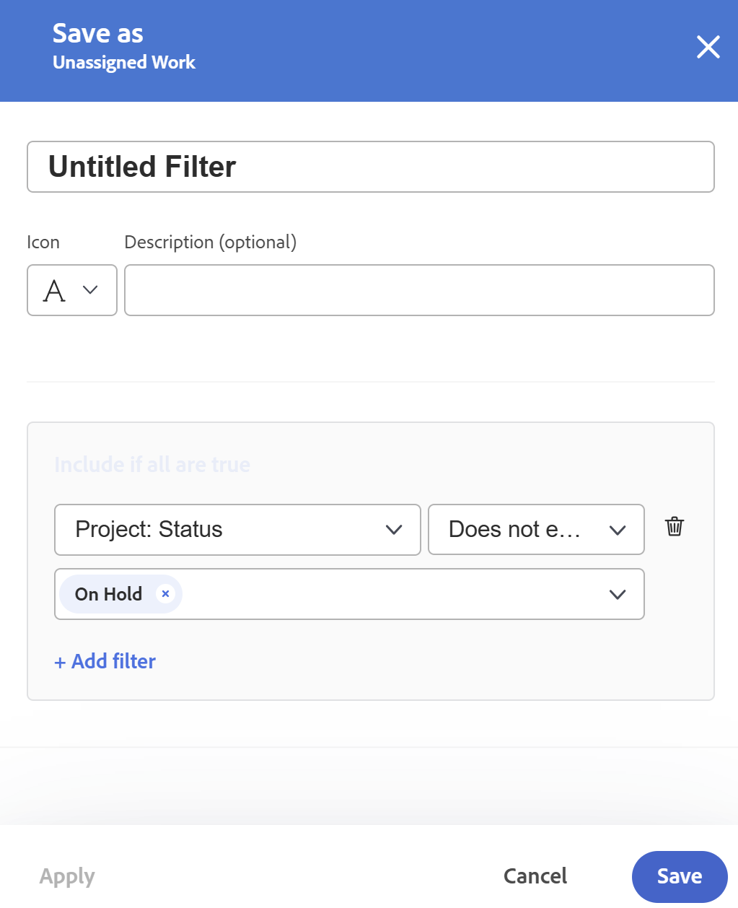
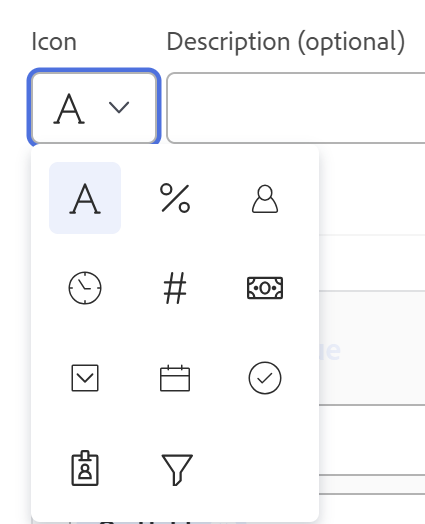
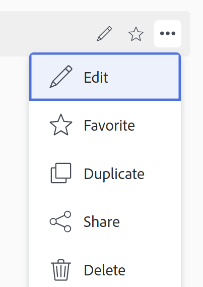

# Filtern von Informationen im Workload Balancer

<!--
(when they add custom fields to fitlering, add the caveat you added for the Resource Planner : only field NAMES and not LABELS are to be found in the drop-down >> ADD THIS IN THE STEP BELOW WHEN ADDING A FILTER)
-->

Als Ressourcen-Manager können Sie den Workload-Balancer verwenden, um den Arbeitsaufwand Ihrer Benutzer anzuzeigen und zu verwalten. Weitere allgemeine Informationen zum Workload Balancer finden Sie in den folgenden Artikeln:

* [Übersicht über den Workload Balancer](../../resource-mgmt/workload-balancer/overview-workload-balancer.md)
* [Navigieren im Workload Balancer](../../resource-mgmt/workload-balancer/navigate-the-workload-balancer.md)

>[!IMPORTANT]
>
>Um Arbeitselemente effizient zu finden und sich auf die von Ihnen verwalteten Benutzer oder Elemente zu konzentrieren, empfehlen wir dringend die Verwendung von Filtern im Workload Balancer. Auf diese Weise können Sie die richtigen Informationen anzeigen, bevor Sie mit der Verwaltung der Zuweisungen Ihrer Ressourcen beginnen.
>
>Wenn Sie einen neuen Filter speichern und anwenden und dann vom Workload-Balancer wegnavigieren, wird der Filter auch nach der Abmeldung und Anmeldung beibehalten.

Dieser Artikel enthält Informationen zu Filtern im Workload Balancer. Informationen zu Filtern in Workfront finden Sie unter [Filter - Übersicht](../../reports-and-dashboards/reports/reporting-elements/filters-overview.md).

## Zugriffsanforderungen

+++ Erweitern Sie , um die Zugriffsanforderungen für die -Funktion in diesem Artikel anzuzeigen.

Sie müssen über folgenden Zugriff verfügen, um die Schritte in diesem Artikel ausführen zu können:

<table style="table-layout:auto"> 
 <col> 
 </col> 
 <col> 
 </col> 
 <tbody> 
  <tr> 
   <td role="rowheader">Adobe Workfront-Plan</td> 
   <td> 
Beliebig
 </td> 
  </tr> 
  <tr> 
   <td role="rowheader">Adobe Workfront-Lizenz</td> 
   <td>
Neu: Standard

       
oder

       
Aktuell: Plan, wenn der Workload Balancer im Bereich „Ressourcen“ verwendet wird 
       Arbeit bei Verwendung des Workload Balancer eines Teams oder Projekts
</td>
  </tr>
  <tr> 
   <td role="rowheader">Konfigurationen der Zugriffsebene</td> 
   <td> 
Zugriff auf Folgendes anzeigen oder höher:
 
    <ul> 
     <li>Ressourcenverwaltung</li> 
     <li>Projekte</li> 
     <li>Aufgaben</li> 
     <li>Probleme</li>
     <li>Filter, Ansichten und Gruppierungen</li>
    </ul>
    
Zugriff auf Filter, Ansichten und Gruppierungen beim Erstellen oder Bearbeiten von Filtern bearbeiten 
 </td>
  </tr> 
  <tr> 
   <td role="rowheader">Objektberechtigungen</td> 
   <td> 
Anzeigen oder Erweitern von Berechtigungen für die Projekte, Aufgaben, Probleme

   
Verwalten Sie Berechtigungen für die Filter, die Sie bearbeiten oder löschen möchten

   </td> 
  </tr> 
 </tbody> 
</table>

Weitere Informationen zu den Informationen in dieser Tabelle finden Sie unter [Zugriffsanforderungen in der Dokumentation zu Workfront](/help/quicksilver/administration-and-setup/add-users/access-levels-and-object-permissions/access-level-requirements-in-documentation.md).

+++

## Übersicht über Filter im Workload Balancer

Beachten Sie beim Arbeiten mit Filtern im Workload Balancer Folgendes:

* Je nachdem, von wo aus Sie auf den Workload Balancer zugreifen, filtert Workfront möglicherweise bereits die Informationen für Sie. Informationen zu vorab angewendeten Filtern finden Sie im Abschnitt [Vorab angewendete Filter im Workload Balancer](#pre-applied-filters-in-the-workload-balancer) in diesem Artikel.
* Sie können einen Filter erstellen und anwenden, ohne ihn zu speichern, oder Sie können einen Filter speichern, um ihn zu einem späteren Zeitpunkt wiederzuverwenden.
* Wenn Sie einen Filter anwenden, ohne ihn zu speichern, können Sie die ursprünglichen Listen wiederherstellen, indem Sie Ihre Seite aktualisieren.
* Sie können die von Ihnen erstellten Filter oder die Filter anzeigen, die von anderen Benutzern erstellt und für Sie freigegeben wurden.
* Wenn Sie einen freigegebenen Filter löschen oder bearbeiten, wird der Filter auch für alle gelöscht oder bearbeitet, für die er freigegeben ist.
* Wenn Sie in einem Bereich Filter im Workload Balancer erstellen, sind diese in anderen Bereichen nicht verfügbar.

  Beispielsweise sind im Bereich Ressourcen erstellte Filter nicht im Workload-Balancer eines Projekts oder Teams verfügbar.

  Informationen dazu, wo Sie den Workload Balancer finden, finden Sie unter [Suchen des Workload Balancer](../../resource-mgmt/workload-balancer/locate-workload-balancer.md).

* Sie können nur die Elemente anzeigen, die mit den ausgewählten Filtern übereinstimmen, die auch mit den Daten in der Zeitleiste übereinstimmen, die auf dem Bildschirm des Workload Balancer angezeigt wird.

## Vordefinierte Filter im Workload Balancer {#pre-applied-filters-in-the-workload-balancer}

Der Workload Balancer zeigt Informationen in zwei separaten Bereichen an:

* **Bereich Nicht zugewiesene Arbeit**: Arbeitselemente, die noch keinen Benutzern zugewiesen sind.
* **Bereich Zugewiesene Arbeit**: Arbeitselemente, die Benutzern zugewiesen sind.

  Weitere Informationen dazu, was in den einzelnen Bereichen angezeigt wird, finden Sie unter [Navigieren im Workload-Balancer](../../resource-mgmt/workload-balancer/navigate-the-workload-balancer.md).

>[!IMPORTANT]
>
>Jeder Bereich des Workload Balancer verfügt über einen eigenen Satz von Filtern, die unabhängig voneinander arbeiten. Sie müssen beide Filter konfigurieren, um anzugeben, welche Informationen in den einzelnen Bereichen angezeigt werden sollen.

Der Workload Balancer zeigt Benutzer und deren Arbeitselemente an.
Die den Benutzern zugewiesenen Arbeitselemente werden nur angezeigt, wenn die Daten der Elemente mit dem auf dem Bildschirm angezeigten Zeitrahmen übereinstimmen.

Je nachdem, von wo aus Sie auf den Workload Balancer zugreifen, werden die Bereiche Nicht zugewiesen und Zugewiesen bereits nach bestimmten Kriterien gefiltert, wie in der folgenden Tabelle beschrieben:

<table style="table-layout:auto"> 
 <col> 
 <col> 
 <col> 
 <tbody> 
  <tr> 
   <td role="rowheader"><strong>Workfront-Bereich, in dem Sie auf den Workload Balancer zugreifen</strong></td> 
   <td><b>Elemente, die standardmäßig im Bereich Nicht zugewiesene Arbeit angezeigt werden</b> </td> 
   <td><b>Elemente, die standardmäßig im Bereich Zugewiesene Arbeit angezeigt werden</b> </td> 
  </tr> 
  <tr> 
   <td role="rowheader">Der Bereich Ressourcen</td> 
   <td>Standardmäßig werden hier keine Elemente angezeigt. Sie müssen Filter anpassen, um Arbeitselemente in diesem Bereich anzeigen zu können.</td> 
   <td>Benutzer, die Mitglieder eines Ihrer Teams sind, und deren Arbeitselemente. </td> 
  </tr> 
  <tr> 
   <td role="rowheader">Ein Team</td> 
   <td>Arbeitselemente, die dem Team oder dem Team zugewiesen sind, und ein Aufgabengebiet. </td> 
   <td> 
Benutzer, die Mitglieder des ausgewählten Teams sind, und ihre Arbeitselemente.
 </td> 
  </tr> 
  <tr> 
   <td role="rowheader">Ein Projekt</td> 
   <td> 
Nicht zugewiesene Arbeitselemente oder Elemente, die Teams oder Aufgabengebieten im ausgewählten Projekt zugewiesen sind, werden in diesem Bereich angezeigt.
 </td> 
   <td> 
Benutzer, die mindestens einem Arbeitselement des ausgewählten Projekts und ihren Arbeitselementen im Projekt zugewiesen sind, wenn der Systemstandardfilter <b>Arbeitselemente dieses Projekts</b> ausgewählt ist. 

Wenn der Systemstandardfilter <b>Arbeitselemente dieses Projekts</b> deaktiviert ist, zeigt der Bereich Zugewiesene Arbeit eines Projekts alle Arbeitselemente der Benutzer an, die mindestens einem Element im ausgewählten Projekt zugewiesen sind.  
 Dieser Filter ist standardmäßig deaktiviert.

<b>HINWEIS</b>

Sie können die Option Alle Benutzer anzeigen im Workload-Balancer eines Projekts aktivieren, um alle Benutzer im System anzuzeigen. Weitere Informationen finden Sie unter <a href="../workload-balancer/navigate-the-workload-balancer.md" class="MCXref xref">Navigieren im Workload Balancer</a>

</td> 
  </tr> 
 </tbody> 
</table>

## Erstellen von Workload-Balancer-Filtern

Der Prozess zum Erstellen von Filtern für die Bereiche Nicht zugewiesene Arbeit und Zugewiesene Arbeit im Workload-Balancer ist identisch, unabhängig davon, von wo aus Sie auf den Workload-Balancer zugreifen. Informationen zum Auffinden des Workload Balancer finden Sie unter [Auffinden des Workload Balancer](../../resource-mgmt/workload-balancer/locate-workload-balancer.md).

Sie können einen Filter von Grund auf neu erstellen oder einen der vordefinierten Filter bearbeiten. Informationen zu vorhandenen Filtern, die Sie bearbeiten können, finden Sie im Abschnitt [Bearbeiten eines vorhandenen Filters im Workload-](#edit-an-existing-filter-in-the-workload-balancer)&quot; in diesem Artikel.

1. Navigieren Sie zum Workload Balancer.

   Weitere Informationen zum Zugriff auf den Workload Balancer finden Sie unter [Navigieren im Workload Balancer](../../resource-mgmt/workload-balancer/navigate-the-workload-balancer.md).

1. Klicken Sie auf **Filter**-Symbol  in der oberen rechten Ecke der Bereiche **Nicht zugewiesene Arbeit** oder **Zugewiesene Arbeit**.

   Das Feld Filter-Builder wird auf der rechten Seite angezeigt. Der Name des Bereichs, für den Sie den Filter erstellen, wird in der Kopfzeile des Felds angezeigt.

   

1. (Optional und bedingt) Wenn Sie auf den Workload-Balancer im Bereich „Ressourcen“ zugreifen, wird der vordefinierte Standardfilter möglicherweise bereits auf den Bereich Zugewiesene Arbeit angewendet. Sie können eine Kopie des Standardfilters bearbeiten und speichern.

   >[!TIP]
   >
   >Der Standardfilter zeigt Benutzer an, die zu einem Ihrer Teams gehören, sowie deren Arbeitselemente. Eine Kopie dieses Filters kann bearbeitet werden.

   Wenn Sie über ein Projekt auf [!UICONTROL Workload ]Balancer) zugreifen, ] der Filter &quot;[!UICONTROL Arbeitselemente dieses Projekts“ möglicherweise bereits angewendet. Dadurch werden nur Arbeitselemente angezeigt, die Benutzern in diesem Projekt zugewiesen sind. Sie können eine Kopie dieses Filters duplizieren und speichern.

   Standardmäßig zeigt der [!UICONTROL Workload-Balancer] eines Projekts alle Arbeitselemente an, die allen Benutzenden im Projekt zugewiesen sind.

1. Klicken Sie auf **Neuer Filter.**

1. Gehen Sie wie folgt vor, um einen Filter zu erstellen:

   1. Wählen Sie im ersten Dropdown-Menü einen Feldnamen aus oder klicken Sie auf **Felder durchsuchen**, um den Namen eines Felds einzugeben, das standardmäßig nicht angezeigt wird.

      >[!IMPORTANT]
      >
      >Beim Verweisen auf benutzerdefinierte Felder müssen Sie den Feldnamen und nicht die Feldbezeichnung eingeben. Die Feldbezeichnung wird in einem benutzerdefinierten Formular angezeigt, das an ein Objekt angehängt ist. Informationen zum Unterschied zwischen der Bezeichnung und dem Namen eines benutzerdefinierten Felds finden Sie unter [Erstellen eines benutzerdefinierten Formulars](/help/quicksilver/administration-and-setup/customize-workfront/create-manage-custom-forms/form-designer/design-a-form/design-a-form.md).

   1. (Bedingt) Wenn Sie auf **Felder durchsuchen** geklickt haben, geben Sie den Namen eines Felds in das Feld **Suchen** ein und wählen Sie es aus, wenn es in der Liste angezeigt wird.

      

      >[!TIP]
      >
      >Sie können ein Feld aus den folgenden Abschnitten auswählen:
      >
      >* **Letzte Auswahl**: Die Felder, nach denen Sie kürzlich gefiltert haben.
      >* **Empfohlen**: Die am häufigsten verwendeten Felder.

   1. Wählen Sie im zweiten Dropdown-Menü einen Modifikator aus. Informationen zu Workfront-Filtermodifikatoren finden Sie [Filter und Bedingungsmodifikatoren](../../reports-and-dashboards/reports/reporting-elements/filter-condition-modifiers.md).
   1. Wählen Sie einen Wert für das Feld aus, nach dem Sie filtern möchten, oder geben Sie ihn ein.

      >[!NOTE]
      >
      > Wenn Sie Arbeitsobjekte aus einem bestimmten Portfolio anzeigen möchten, können Sie den folgenden Filter anwenden: &quot;Portfolio-ID ist gleich &lt; Name des Portfolios >&quot;.
      >
      >
      >
      >Um Projekte mit dem Status „Zurückgestellt“ auszuschließen, müssen Sie den folgenden Filter anwenden: „Projekt: Status ist nicht gleich „Zurückgestellt“. Dadurch wird verhindert, dass Arbeitselemente aus zurückgestellten Projekten im Workload-Balancer angezeigt werden.
      >
      >

   1. (Optional) Klicken Sie auf das Symbol **Löschen**,  ein Filterkriterium zu entfernen.

1. (Optional) Klicken Sie auf **Filter hinzufügen**, um ein weiteres Filterkriterium hinzuzufügen, und wiederholen Sie dann die Aktionen in Schritt 4.

   <!--(NOTE: ensure this stays correct)-->

1. Klicken Sie **Anwenden**, um die Ergebnisse des Filters auf den ausgewählten Workload-Balancer-Bereich anzuwenden, ohne ihn zu speichern.

   Die Liste der Arbeitselemente wird auf der linken Seite aktualisiert.

   >[!IMPORTANT]
   >
   >Die Ergebnisse werden im Workload Balancer angezeigt, wenn alle hinzugefügten Filteranweisungen gleichzeitig wahr sind.

   Der Filter wird beibehalten, bis Sie die Seite aktualisieren.

   Die Schaltfläche **Übernehmen** wird durch eine Schaltfläche **Als neu speichern** ersetzt.

1. Klicken Sie **Als neu speichern**, um den Filter für die zukünftige Verwendung zu speichern.

   

   >[!TIP]
   >
   >Wenn Sie **auf** Abbrechen“ klicken, gelangen Sie zurück zum Bereich für die Filtererstellung.

1. Klicken Sie in das **Nicht benannter Filter** und geben Sie den Namen des neuen Filters ein.
1. (Optional) Wählen Sie im Dropdown-Menü **Symbol“ ein Symbol** den neuen Filter aus.

   

1. (Optional) Fügen Sie eine Beschreibung für den Filter hinzu, um anzugeben, was eindeutig ist. Die Beschreibung wird unter dem Filternamen in der Liste der Filter angezeigt.
1. Klicken Sie auf **Speichern**.

   Gespeicherte Filter werden im Bereich Meine Filter des Felds Filter angezeigt.

   Informationen zum Anwenden gespeicherter Filter finden Sie im Abschnitt [Löschen eines gespeicherten Filters im Workload Balancer](#delete-a-saved-filter-in-the-workload-balancer) in diesem Artikel.

1. (Bedingt) Bewegen Sie den Mauszeiger über **Filtersymbol**  in der oberen rechten Ecke der Bereiche **Nicht zugewiesene Arbeit** oder **Zugewiesene Arbeit**, um eine QuickInfo mit dem Namen oder der Anzahl der aktuell angewendeten Filter anzuzeigen.

   

## Duplizieren von Filtern

Sie können einen Filter duplizieren und bearbeiten, um einen neuen zu erstellen.

1. Navigieren Sie zum Workload Balancer.

   Weitere Informationen zum Zugriff auf den Workload Balancer finden Sie unter [Navigieren im Workload Balancer](../../resource-mgmt/workload-balancer/navigate-the-workload-balancer.md).

1. Klicken Sie auf **Filter**-Symbol  in der oberen rechten Ecke der Bereiche **Nicht zugewiesene Arbeit** oder **Zugewiesene Arbeit**.

   Das Feld Filter-Builder wird auf der rechten Seite angezeigt. Der Name des Bereichs, für den Sie den Filter erstellen, wird in der Kopfzeile des Felds angezeigt.

1. Bewegen Sie den Mauszeiger über einen vorhandenen Filter, klicken Sie auf die  **Mehr** und klicken Sie dann auf **Duplizieren**.

   

   >[!TIP]
   >
   > Beim Bearbeiten eines Filters können Sie auf das Menü **Mehr** in der linken unteren Ecke des Felds Filter bearbeiten und dann auf **Duplizieren** klicken.

1. Bearbeiten Sie die folgenden Informationen für den duplizierten Filter:

   * Name

     Standardmäßig lautet der neue Filtername „Kopieren“ (Originalfiltername).

   * Symbol
   * Beschreibung
   * Beliebiges Feld, jeder Modifikator oder jeder Wert.

1. (Optional) Klicken Sie auf **Filter hinzufügen**, um dem duplizierten Filter weitere Anweisungen hinzuzufügen.
1. Klicken Sie **Speichern**, um den doppelten Filter im Bereich **Meine Filter** zu speichern.

   Der ursprüngliche Filter bleibt unverändert und der duplizierte Filter wird als neuer Filter gespeichert.

## Bearbeiten eines vorhandenen Filters im Workload Balancer {#edit-an-existing-filter-in-the-workload-balancer}

Gespeicherte Filter können im Workload Balancer bearbeitet werden.

>[!TIP]
>
>Wenn Sie einen Filter bearbeiten, der für andere freigegeben wurde, werden auch die von Ihnen vorgenommenen Änderungen angezeigt.

1. Navigieren Sie zum Workload Balancer.

   Weitere Informationen zum Zugriff auf den Workload Balancer finden Sie unter [Navigieren im Workload Balancer](../../resource-mgmt/workload-balancer/navigate-the-workload-balancer.md).

1. Klicken Sie auf **Filtersymbol**  in der oberen rechten Ecke der Bereiche **Nicht zugewiesen** oder **Zugewiesene Arbeit**.\
   Der Filter-Builder wird auf der rechten Seite angezeigt.

1. Bewegen Sie den Mauszeiger über den Filter, den Sie bearbeiten möchten, und klicken Sie dann auf die  **Bearbeiten**.

   

1. Führen Sie einen der folgenden Schritte aus:

   * Beliebige Filteranweisungen ändern
   * Klicken Sie **Filter hinzufügen**, um neue Filteranweisungen hinzuzufügen
   * Klicken Sie auf das **Löschen**-Symbol , um vorhandene Filteranweisungen zu entfernen.

1. (Optional) Klicken Sie auf **Anwenden**.

   Die Ergebnisse werden im Workload Balancer auf der linken Seite aktualisiert, um die Änderungen zu veranschaulichen, die Sie am Filter vorgenommen haben.

1. Klicken Sie auf **Speichern.**

   Die Ergebnisse werden im Workload Balancer auf der linken Seite aktualisiert und der Filter wird mit den neuen Informationen aktualisiert, die Sie ausgewählt haben.

## Löschen eines gespeicherten Filters im Workload Balancer {#delete-a-saved-filter-in-the-workload-balancer}

Beachten Sie Folgendes, bevor Sie einen Filter löschen:

* Gelöschte Filter können nicht wiederhergestellt werden.
* Vordefinierte Filter können nicht gelöscht werden.
* Nicht gespeicherte Filter können nicht gelöscht werden. Sie werden automatisch entfernt, nachdem sie sich abgemeldet und wieder bei Workfront angemeldet haben.
* Wenn Sie einen freigegebenen Filter löschen, wird er auch für alle Benutzenden gelöscht, für die er freigegeben ist.
* Nachdem Sie alle gespeicherten Filter gelöscht haben, wird der Workload Balancer gemäß den ursprünglichen Standardwerten angezeigt.

>[!NOTE]
>
>Wenn Sie einen Filter löschen, der für andere freigegeben wurde, wird er auch für diese Benutzer gelöscht.

1. Zum Workload Balancer wechseln
1. Klicken Sie auf **Filtersymbol**  in der oberen rechten Ecke der Bereiche **Nicht zugewiesene Arbeit** oder **Zugewiesene Arbeit**.\
   Das Feld Filter-Builder wird auf der rechten Seite angezeigt.

1. Bewegen Sie den Mauszeiger über einen Filter, klicken Sie dann auf die  **Mehr** und klicken Sie dann auf **Löschen**.
   

   >[!TIP]
   >
   >Beim Bearbeiten eines Filters können Sie auf das Menü **Mehr** in der linken unteren Ecke des Felds Filter bearbeiten und dann auf **Löschen** klicken.

1. (Optional) Klicken Sie auf **Abbrechen**, um das Löschen zu vermeiden, und kehren Sie zur Liste der Filter zurück.
1. Klicken Sie **Löschen**, um den Löschvorgang zu bestätigen.

   Der Filter wird für Sie und alle Benutzenden gelöscht, die über die entsprechenden Berechtigungen verfügen.

## Freigeben von Filtern im Workload Balancer

Sie können einen Filter freigeben, den Sie erstellt haben oder den andere Benutzer für Sie freigegeben haben.

Beachten Sie beim Freigeben von Filtern im Workload Balancer Folgendes:

* Sie können Filter für aktive Benutzende, Teams, Rollen und Unternehmen freigeben oder für alle Benutzenden in Ihrer Workfront-Instanz sichtbar machen.
* Filter, die Sie im Bereich Ressourcen freigeben, sind im Workload Balancer eines Projekts oder Teams nicht sichtbar.
* Workload-Balancer-Filter, die Sie für andere freigeben, sind in anderen Bereichen von Workfront nicht sichtbar.

So geben Sie einen Filter frei:

1. Zum Workload Balancer wechseln
1. Klicken Sie auf **Filtersymbol**  in der oberen rechten Ecke der Bereiche **Nicht zugewiesene Arbeit** oder **Zugewiesene Arbeit**.\
   Das Feld Filter-Builder wird auf der rechten Seite angezeigt.

1. Bewegen Sie den Mauszeiger über einen Filter, klicken Sie dann auf die  **Mehr** und klicken Sie dann auf **Freigeben.**

   

   >[!TIP]
   >
   > Beim Bearbeiten eines Filters können Sie auf das Menü **Mehr** in der linken unteren Ecke des Felds Filter bearbeiten und dann auf **Freigeben** klicken.

   Das Feld Filterfreigabe wird angezeigt.

1. Aktivieren Sie **Einstellung „Systemweit anzeigen**. Dadurch erhält jeder Benutzer in Workfront die Berechtigung, den Filter anzuzeigen.

   Oder

   Beginnen Sie mit der Eingabe der Namen von Benutzern, Teams, Rollen, Gruppen oder Unternehmen, für die Sie den Filter freigeben möchten, in das Feld **Zugriff erteilen für**.

   

1. (Optional) Klicken Sie auf den nach rechts zeigenden Pfeil neben dem Namen einer Entität, um deren Berechtigungen für den Filter zu bearbeiten, und aktivieren Sie dann entweder die Option **Anzeigen** oder **Verwalten**.

   

1. (Optional) Aktivieren oder deaktivieren Sie die zusätzlichen Berechtigungen für eine Entität, indem Sie einen der folgenden Schritte ausführen:

   1. Klicken Sie **Anzeigen** und deaktivieren Sie die Option **Freigeben**. Sie ist standardmäßig aktiviert.

   1. Klicken Sie **Verwalten** und deaktivieren Sie entweder die Option **Freigeben** oder **Löschen**. Sie sind standardmäßig aktiviert.

   >[!TIP]
   >
   >Benutzende erhalten keine höhere Berechtigung als ihre Zugriffsebene. Wenn sie in ihrer Zugriffsebene keinen Zugriff auf „Filter bearbeiten“ haben, können sie keine Berechtigungen zum Verwalten eines Filters erhalten. Workfront deaktiviert die Option Verwalten für diese Benutzenden, und die Option ist abgeblendet.

1. Klicken Sie auf **Teilen**. Der Filter wird für die angegebenen Entitäten freigegeben.

   Die von Ihnen freigegebenen Filter werden im Bereich **Für mich freigegeben** des Filterfelds angezeigt.

   

<!--   

## Add a filter to your favorites list

You can mark a filter as a favorite for quicker access to it. 

The filters that you mark as a favorite do not count towards your system Favorites list. There is no limit for how many filters you can favorite. 

1. Go to the Workload Balancer
1. Click the **Filter** icon  in the upper-right corner of the **Unassigned Work** or **Assigned Work** areas. The filter builder box displays on the right. 
1. Mouse over a filter, then click the **Favorite** . 
(NOTE: insert screen shot here with Favorite as part of this menu - same as above ones but with Favorite)
1. The filter is listed in the **Favorited** section inside the filter panel. 
1. (Optional) Click the **Favorite** icon again to remove the filter from the list of favorite filters
(I logged bugs for "Favorited" and "Unfavorite" wordings - make sure these have not updated)
-->
