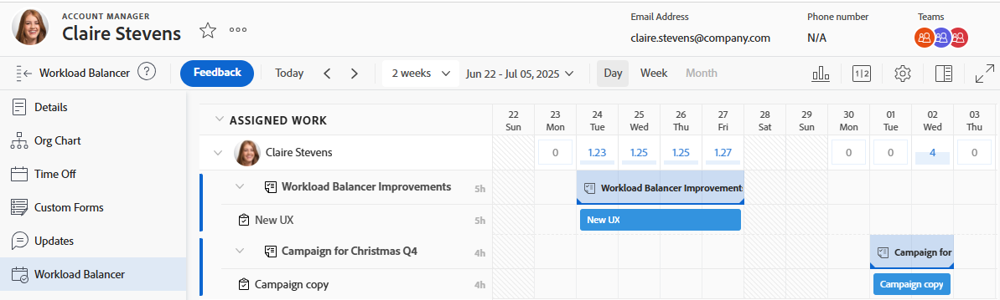

# Suchen des Workload Balancer

{{preview-fast-release-general}}

Sie können den Workload Balancer verwenden, um Ressourcen für Arbeiten zu planen oder ihre Verfügbarkeit und aktuelle Zuweisungen zu überprüfen.

Sie können auf die folgenden Arten auf den Workload-Balancer zugreifen:

* Aus mehreren von Adobe Workfront vordefinierten Bereichen
* Durch Hinzufügen zu einem benutzerdefinierten Abschnitt

In diesem Artikel werden die Bereiche beschrieben, in denen Sie auf den Workload Balancer zugreifen können.

>[!NOTE]
>
>Unabhängig von der Methode, die Sie für den Zugriff auf den Workload Balancer verwenden, ist die Navigation darin und die Verwaltung von Ressourcen identisch.
>
>Informationen zum Workload Balancer und dessen Verwendung für die Verwaltung und Planung von Ressourcen für die Arbeit finden Sie in den folgenden Artikeln:
>
>* [Übersicht über den Workload Balancer](../../resource-mgmt/workload-balancer/overview-workload-balancer.md)
>* [Navigieren im Workload Balancer](../../resource-mgmt/workload-balancer/navigate-the-workload-balancer.md)
>* [Übersicht über die Zuweisung von Arbeit im Workload Balancer](../../resource-mgmt/workload-balancer/assign-work-in-workload-balancer.md)
>* [Verwalten von Benutzerzuweisungen im Workload Balancer](../../resource-mgmt/workload-balancer/manage-user-allocations-workload-balancer.md)

## Zugriffsanforderungen

+++ Erweitern Sie , um die Zugriffsanforderungen für die -Funktion in diesem Artikel anzuzeigen.

Sie müssen über folgenden Zugriff verfügen, um die Schritte in diesem Artikel ausführen zu können:

<table style="table-layout:auto"> 
 <col> 
 <col> 
 <tbody> 
  <tr> 
   <td role="rowheader">Adobe Workfront-Plan</td> 
   <td> 
Beliebig 
 </td> 
  </tr> 
  <tr> 
   <td role="rowheader">Adobe Workfront-Lizenz</td> 
   <td>
Neu: Standard

       
oder

       
Aktuell: Plan, wenn der Workload Balancer im Bereich „Ressourcen“ verwendet wird 
       Arbeit bei Verwendung des Workload Balancer eines Teams oder Projekts

       
Hinweis: Alle Benutzer können ohne Lizenzanforderungen in ihren eigenen Benutzerprofilen auf den Workload-Balancer zugreifen.
</td>
  </tr> 
   <td role="rowheader">Konfigurationen der Zugriffsebene</td> 
   <td> 
Zugriff auf Folgendes anzeigen oder höher:
 
    <ul> 
     <li>Ressourcenverwaltung</li> 
     <li>Projekte</li> 
     <li>Aufgaben</li> 
     <li>Probleme</li> 
    </ul> </td> 
  </tr> 
  <tr> 
   <td role="rowheader">Objektberechtigungen</td> 
   <td>Anzeigen von Berechtigungen oder höher für die Projekte, Aufgaben und Probleme</td> 
  </tr> 
 </tbody> 
</table>

Weitere Informationen zu den Informationen in dieser Tabelle finden Sie unter [Zugriffsanforderungen in der Dokumentation zu Workfront](/help/quicksilver/administration-and-setup/add-users/access-levels-and-object-permissions/access-level-requirements-in-documentation.md).

+++

## Zugriff auf den Workload Balancer in vordefinierten Bereichen

In den folgenden Abschnitten wird gezeigt, wo Sie in Workfront auf den Workload Balancer zugreifen können.

### Zugriff auf den Workload Balancer für mehrere Projekte im Bereich „Ressourcen“

{{step1-to-resourcing}}

1. Klicken Sie **linken Bedienfeld** Workload Balancer“.

   

   Im Workload Balancer werden standardmäßig im Bereich Ressourcen die folgenden Informationen angezeigt:

   * **Nicht zugeordnete Arbeit**: Keine nicht zugewiesenen Arbeitselemente.
   * **Zugewiesene Arbeit**: Alle aktiven Benutzer im System.

     Es wird empfohlen, Filter zu verwenden, wenn Benutzer im Bereich Zugewiesene Arbeit angezeigt werden. Weitere Informationen finden Sie unter [Filtern von Informationen im Workload Balancer](../workload-balancer/filter-information-workload-balancer.md).

### Zugriff auf den Workload Balancer für ein Team

Weitere Informationen zu Teams in Workfront finden Sie unter [Team-Übersicht](/help/quicksilver/people-teams-and-groups/create-and-manage-teams/teams-overview.md).

{{step1-to-team}}

Die Seite Ihres Home-Teams wird angezeigt.

1. Klicken Sie **linken Bedienfeld** Workload Balancer“.

   

   Der Workload Balancer eines Teams zeigt standardmäßig die folgenden Informationen an:

   * **Nicht zugewiesene Arbeit**: Elemente, die dem Team und nicht Benutzern zugewiesen sind.
   * **Zugewiesene Arbeit**: Alle Mitglieder des Teams mit allen ihren Zuweisungen.

     >[!TIP]
     >
     >Teammitglieder können Aufgaben zugewiesen werden, die auch dem Team zugewiesen sind, oder Aufgaben, die anderen Teams oder Funktionen zugewiesen sind.

### Zugriff auf den Workload Balancer für ein Projekt

{{step1-to-projects}}

1. Klicken Sie auf den Namen eines Projekts, um die Projektseite zu öffnen.
1. Klicken Sie **linken Bedienfeld** Workload Balancer“.

   Der Workload Balancer für das Projekt wird angezeigt.

   

   Der Workload Balancer eines Projekts zeigt standardmäßig die folgenden Informationen an:

   * **Nicht zugewiesene Arbeit**: Elemente aus dem Projekt, die Aufgabengebieten oder Teams zugewiesen sind und nicht Benutzern zugewiesen sind.
   * **Zugewiesene Arbeit**: Benutzer, die Elementen im Projekt zugewiesen sind.

     >[!TIP]
     >
     >Sie können alle Benutzer im System anstelle nur der im Projekt vorhandenen Benutzer (im Bereich Zugewiesene Arbeit ) anzeigen, indem Sie die Option Alle Benutzer anzeigen aktivieren. Weitere Informationen finden Sie unter [Navigieren im Workload Balancer](../workload-balancer/navigate-the-workload-balancer.md).

### Zugriff auf den Workload Balancer für einen Benutzer

Alle Benutzer haben Zugriff darauf, den Workload-Balancer in ihren eigenen Profilen anzuzeigen. Workload-Balancer-Daten für einen Benutzer sind schreibgeschützt. Auf Benutzerebene können Sie keine Arbeit zuweisen, die Zuweisung von Arbeit aufheben oder Zuordnungen anpassen.

Alle Anzeigeeinstellungen sind für den Workload-Balancer für einen Benutzer verfügbar. Weitere Informationen finden Sie unter [Navigieren im Workload Balancer](/help/quicksilver/resource-mgmt/workload-balancer/navigate-the-workload-balancer.md).

{{step1-click-profile-pic}}

1. Klicken Sie **linken Bedienfeld** Workload Balancer“.

   Der Workload-Balancer für den Benutzer wird angezeigt.

   

   Der Workload-Balancer eines Benutzers zeigt standardmäßig die folgenden Informationen an:

   * **Zugewiesene Arbeit**: Die Aufgaben und Probleme, die dem jeweiligen Benutzer zugewiesen sind.

## Hinzufügen des Workload Balancer zu einem benutzerdefinierten Abschnitt

Sie können den Workload Balancer zu jedem benutzerdefinierten Abschnitt hinzufügen.

Die meisten Anpassungen, die Sie bereits auf den Workload Balancer angewendet haben, bleiben beim Hinzufügen zum benutzerdefinierten Abschnitt erhalten.

1. Greifen Sie auf den Workload Balancer zu, indem Sie einen der folgenden Bereiche aufrufen:

   * Der Bereich Ressourcen
   * Ein Team
   * Ein Projekt

1. Rufen Sie einen Freigabe-Link ab und kopieren Sie ihn in die Zwischenablage, wie unter [Freigeben des Workload-Balancer mit einem Link](../../resource-mgmt/workload-balancer/share-link-for-workload-balancer.md) beschrieben.
1. Erstellen Sie ein Dashboard mit einer externen Seite, wie unter [Externe Webseite in ein Dashboard einbetten](../../reports-and-dashboards/dashboards/creating-and-managing-dashboards/embed-external-web-page-dashboard.md) beschrieben. Verwenden Sie den freigabefähigen Link, den Sie in Schritt 2 für die externe Seite erhalten haben.

   <!--
      (NOTE: ensure this stays correct)
      -->

1. Erstellen Sie einen benutzerdefinierten Abschnitt wie in [Erstellen benutzerdefinierter Registerkarten oder Abschnitte](../../workfront-basics/manage-your-account-and-profile/configuring-your-user-profile/create-custom-tabs.md) beschrieben, um das Dashboard auf der benutzerdefinierten Registerkarte zu platzieren.

   Wenn Sie über den benutzerdefinierten Abschnitt auf den Workload Balancer zugreifen, können Sie ihn so anzeigen, als ob Sie direkt über einen der in Schritt 1 aufgeführten ursprünglichen Bereiche darauf zugreifen würden.

   <!--
      (NOTE: ensure this stays correct)
     -->

1. (Optional) Geben Sie die benutzerdefinierte Registerkarte in einer Layout-Vorlage frei, wie unter [Anpassen des linken Bedienfelds mithilfe einer Layout-Vorlage](../../administration-and-setup/customize-workfront/use-layout-templates/customize-left-panel.md) beschrieben.

<!--
For a team:

* From the Workload Balancer section of a team.

  You can adjust allocations and review or assign work from multiple projects to individual team members.

For a project:

  You can do the following when you use the Workload Balancer within a project:

   * Assign work on the project to users already assigned other work on the project.
   * Assign work to any user that might not be on the project.

   * View additional work that users are assigned to on other projects.
   * Adjust user allocations to work items.-->
