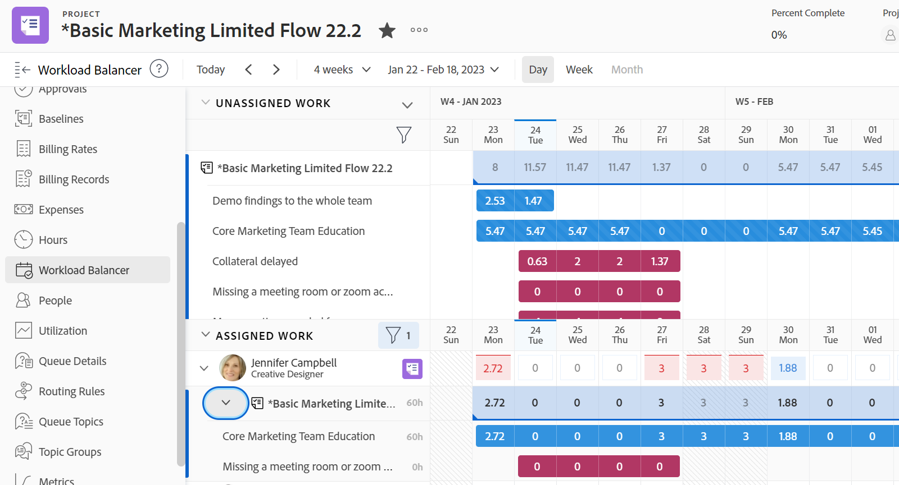

# Suchen Sie den Lastenausgleich .

Sie können den Lastenausgleich verwenden, um Ressourcen für die Arbeit zu planen oder deren Verfügbarkeit und aktuelle Zuordnungen zu überprüfen.

Sie können auf den Lastenausgleich wie folgt zugreifen:

* Aus mehreren von Adobe Workfront vordefinierten Bereichen
* Durch Hinzufügen zu einem benutzerdefinierten Abschnitt

In diesem Artikel werden die Bereiche beschrieben, in denen Sie auf den Lastenausgleich zugreifen können.

>[!NOTE]
>
>Unabhängig von der Methode, die Sie für den Zugriff auf den Lastenausgleich verwenden, ist die Navigation und Verwaltung von Ressourcen identisch.
>
>Weitere Informationen zum Arbeitslastausgleich und dessen Verwendung für die Verwaltung und Planung Ihrer Ressourcen für die Arbeit finden Sie in den folgenden Artikeln:
>
>* [Übersicht über den Lastenausgleich](../../resource-mgmt/workload-balancer/overview-workload-balancer.md)
>* [Navigieren Sie zum Lastenausgleich .](../../resource-mgmt/workload-balancer/navigate-the-workload-balancer.md)
>* [Übersicht über die Zuweisung von Aufgaben im Arbeitslastausgleich](../../resource-mgmt/workload-balancer/assign-work-in-workload-balancer.md)
>* [Verwalten von Benutzerzuordnungen im Lastenausgleich](../../resource-mgmt/workload-balancer/manage-user-allocations-workload-balancer.md)
>

## Zugriffsanforderungen

Sie müssen über folgenden Zugriff verfügen, um die Schritte in diesem Artikel ausführen zu können:

<table style="table-layout:auto"> 
 <col> 
 <col> 
 <tbody> 
  <tr> 
   <td role="rowheader">Adobe Workfront-Plan*</td> 
   <td> 
Alle 
 </td> 
  </tr> 
  <tr> 
   <td role="rowheader">Adobe Workfront-Lizenz*</td> 
   <td> 
Planen Sie bei Verwendung des Lastenausgleichs im Ressourcenbereich

   
Arbeiten bei Verwendung des Workload Balancers für ein Team oder Projekt

 </td> 
  </tr> 
  <tr> 
   <td role="rowheader">Zugriffsstufe*</td> 
   <td> 
Zeigen Sie den Zugriff auf Folgendes an oder höher:
 
    <ul> 
     <li> 
Ressourcenverwaltung
 </li> 
     <li> 
Projekte
 </li> 
     <li> 
Aufgaben
 </li> 
     <li> 
Probleme
 </li> 
    </ul> 
<b> NOTIZ</b>

Wenn Sie immer noch keinen Zugriff haben, fragen Sie Ihren Workfront-Administrator, ob er zusätzliche Zugriffsbeschränkungen für Ihre Zugriffsebene festlegt. Informationen dazu, wie ein Workfront-Administrator Ihre Zugriffsstufe ändern kann, finden Sie unter <a href="../../administration-and-setup/add-users/configure-and-grant-access/create-modify-access-levels.md" class="MCXref xref">Benutzerdefinierte Zugriffsebenen erstellen oder ändern</a>.
 </td>
</tr> 
  <tr> 
   <td role="rowheader">Objektberechtigungen</td> 
   <td> 
Anzeigen von Berechtigungen oder höher für die Projekte, Aufgaben und Probleme 
 
Informationen zum Anfordern von zusätzlichem Zugriff finden Sie unter <a href="../../workfront-basics/grant-and-request-access-to-objects/request-access.md" class="MCXref xref">Zugriff auf Objekte anfordern </a>.
 </td> 
  </tr> 
 </tbody> 
</table>

*Wenden Sie sich an Ihren Workfront-Administrator, um zu erfahren, welchen Plan, welchen Lizenztyp oder welchen Zugriff Sie haben.

## Auf den Lastenausgleich in vordefinierten Bereichen zugreifen

Die folgenden Abschnitte veranschaulichen, wo Sie auf den Lastenausgleich in Workfront zugreifen können.

### Zugriff auf den Lastenausgleich für mehrere Projekte im Bereich &quot;Ressourcen&quot;

1. Klicken Sie auf **Hauptmenü** icon Klicken Sie auf **Ressourcen**.
1. Klicks **Lastenausgleich** im linken Bereich.

   

   Der Lastenausgleich zeigt standardmäßig Folgendes anhand von Informationen im Bereich &quot;Ressourcen&quot;an:

   * **Nicht zugewiesene Arbeit**: Keine nicht zugewiesenen Arbeitselemente.
   * **Zugewiesene Arbeit**: Alle aktiven Benutzer im System.

     Es wird empfohlen, beim Anzeigen von Benutzern im Bereich &quot;Zugewiesene Arbeit&quot;Filter zu verwenden. Weitere Informationen finden Sie unter [Filtern von Informationen im Arbeitslastausgleich](../workload-balancer/filter-information-workload-balancer.md).

### Zugriff auf den Lastenausgleich für ein Team

1. Klicken Sie auf **Hauptmenü** icon und klicken Sie dann auf Teams.
Die Seite Ihres Startseiten-Teams wird angezeigt.

   Standardmäßig wird der Lastenausgleich für das Team angezeigt.

   

   Der Lastenausgleich eines Teams zeigt standardmäßig die folgenden Informationen an:

   * **Nicht zugewiesene Arbeit**: Dem Team zugewiesene Elemente, die Benutzern nicht zugewiesen sind.
   * **Zugewiesene Arbeit**: Alle Mitglieder des Teams mit allen ihren Aufgaben.

     >[!TIP]
     >
     >Team-Mitglieder können Aufgaben zugewiesen werden, die auch dem Team zugewiesen sind, oder anderen Teams oder Rollen zugewiesen werden.

### Zugriff auf den Lastenausgleich für ein Projekt

1. Klicken Sie auf **Hauptmenü** icon Klicken Sie auf **Projekte**.
1. Klicken Sie auf den Namen eines Projekts, um die Projektseite zu öffnen.
1. Klicks **Lastenausgleich** im linken Bereich. Möglicherweise müssen Sie auf **Mehr anzeigen**, dann **Lastenausgleich**.

   Der Lastenausgleich für das Projekt wird angezeigt.

   

   Der Lastenausgleich eines Projekts zeigt standardmäßig Folgendes nach Informationen an:

   * **Nicht zugewiesene Arbeit**: Elemente aus dem Projekt, die Auftragsrollen oder Teams zugewiesen sind und Benutzern nicht zugewiesen sind.
   * **Zugewiesene Arbeit**: Benutzer, die Elementen im Projekt zugewiesen sind.

     >[!TIP]
     >
     >Sie können alle Benutzer im System anstelle nur der Benutzer im Projekt (im Bereich &quot;Zugewiesene Arbeit&quot;) anzeigen, indem Sie die Option Alle Benutzer anzeigen aktivieren. Weitere Informationen finden Sie unter [Navigieren Sie zum Lastenausgleich .](../workload-balancer/navigate-the-workload-balancer.md).

## Den Lastenausgleich zu einem benutzerdefinierten Abschnitt hinzufügen

Sie können den Lastenausgleich zu jedem benutzerdefinierten Abschnitt hinzufügen.

Die meisten Anpassungen, die Sie bereits auf den Lastenausgleich angewendet haben, bleiben erhalten, wenn Sie ihn zu einem benutzerdefinierten Abschnitt hinzufügen.

1. Greifen Sie auf den Lastenausgleich zu, indem Sie einen der folgenden Bereiche aufrufen:

   * Ressourcenbereich
   * Ein Team
   * Ein Projekt

1. Rufen Sie einen freigebbaren Link ab und kopieren Sie ihn wie in [Den Lastenausgleich über einen Link freigeben](../../resource-mgmt/workload-balancer/share-link-for-workload-balancer.md).
1. Erstellen Sie ein Dashboard mit einer externen Seite, wie in [Einbetten einer externen Webseite in ein Dashboard](../../reports-and-dashboards/dashboards/creating-and-managing-dashboards/embed-external-web-page-dashboard.md). Verwenden Sie den freigebbaren Link, den Sie in Schritt 2 für die externe Seite erhalten haben.

   <!--
      (NOTE: ensure this stays correct)
      -->

1. Erstellen Sie einen benutzerspezifischen Abschnitt, wie unter [Erstellen benutzerdefinierter Registerkarten oder Abschnitte](../../workfront-basics/manage-your-account-and-profile/configuring-your-user-profile/create-custom-tabs.md) , um das Dashboard auf der benutzerdefinierten Registerkarte zu platzieren.

   Beim Zugriff auf den Lastenausgleich über den benutzerdefinierten Abschnitt können Sie ihn so anzeigen, als ob Sie direkt über einen der in Schritt 1 aufgelisteten ursprünglichen Bereiche darauf zugegriffen hätten.

   <!--
      (NOTE: ensure this stays correct)
     -->

1. (Optional) Geben Sie die benutzerdefinierte Registerkarte in einer Layout-Vorlage frei, wie unter  [Anpassen des linken Bedienfelds mithilfe einer Layoutvorlage](../../administration-and-setup/customize-workfront/use-layout-templates/customize-left-panel.md) .

<!--
For a team:

* From the Workload Balancer section of a team.

  You can adjust allocations and review or assign work from multiple projects to individual team members.

For a project:

  You can do the following when you use the Workload Balancer within a project:

   * Assign work on the project to users already assigned other work on the project.
   * Assign work to any user that might not be on the project.

   * View additional work that users are assigned to on other projects.
   * Adjust user allocations to work items.-->