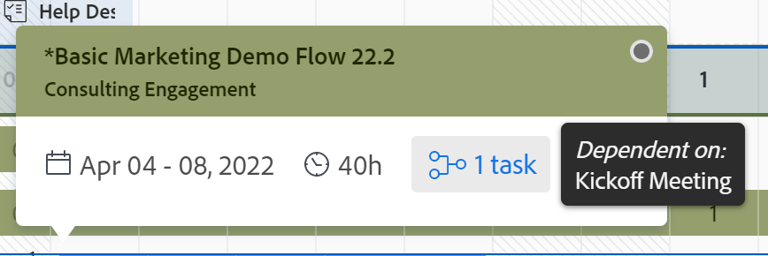

# Navigieren im Workload Balancer

<!--Audited: 12/2024-->

Verwenden Sie den Workload Balancer in Adobe Workfront, um Benutzenden je nach Verfügbarkeit Arbeit zuzuweisen. In diesem Artikel wird beschrieben, wie Sie mithilfe von Einstellungen und Optionen im Workload Balancer navigieren und die für Sie relevanten Informationen anzeigen können. In weiteren hier aufgeführten Artikeln wird beschrieben, wie Sie mit dem Workload Balancer Ihre Ressourcen und deren Arbeitszuweisung verwalten können.

Der Workload Balancer ist in mehreren Bereichen von Adobe Workfront verfügbar. Die Navigation ist in allen Bereichen ähnlich.

Weitere Informationen dazu, wo sich der Workload Balancer befindet, finden Sie unter [Suchen des Workload Balancer](https://experienceleague.adobe.com/docs/workfront/using/manage-resources/the-workload-balancer/locate-workload-balancer.html?lang=en).

## Zugriffsanforderungen

+++ Erweitern Sie , um die Zugriffsanforderungen für die -Funktion in diesem Artikel anzuzeigen.

Sie müssen über folgenden Zugriff verfügen, um die Schritte in diesem Artikel ausführen zu können:

<table style="table-layout:auto"> 
 <col> 
 <col> 
 <tbody> 
  <tr> 
   <td role="rowheader">Adobe Workfront-Plan</td> 
   <td> 
Beliebig 
 </td> 
  </tr> 
  <tr> 
   <td role="rowheader">Adobe Workfront-Lizenz*</td> 
   <td>
Neu: Standard

       
oder

       
Aktuell: Plan, wenn der Workload Balancer im Bereich „Ressourcen“ verwendet wird 
       Arbeit bei Verwendung des Workload Balancer eines Teams oder Projekts
</td>
  </tr>
  <tr> 
   <td role="rowheader">Konfigurationen der Zugriffsebene</td> 
   <td> 
Zugriff auf Folgendes anzeigen oder höher:
 
    <ul> 
     <li>Ressourcenverwaltung</li> 
     <li>Projekte</li> 
     <li>Aufgaben</li> 
     <li>Probleme</li> 
    </ul>
   </td> 
  </tr> 
  <tr> 
   <td role="rowheader">Objektberechtigungen</td> 
   <td>Anzeigen oder Erweitern von Berechtigungen für die Projekte, Aufgaben und Probleme</td> 
  </tr> 
 </tbody> 
</table>

*Weitere Informationen zu den Informationen in dieser Tabelle finden Sie unter [Zugriffsanforderungen in der Dokumentation zu Workfront](/help/quicksilver/administration-and-setup/add-users/access-levels-and-object-permissions/access-level-requirements-in-documentation.md).

+++

## Überlegungen zum Anzeigen von Elementen im Workload Balancer

Beachten Sie beim Anzeigen des Workload Balancer Folgendes:

* Der Workload Balancer zeigt Arbeitselemente je nach Zuweisungen in zwei separaten Bereichen an. Arbeitselemente und Benutzer werden in den folgenden Bereichen angezeigt:

   * **Nicht zugewiesene Arbeit**: Elemente, denen keine Zuweisungen zugewiesen sind oder die nur Aufgabengebieten oder Teams zugewiesen sind.
   * **Zugewiesene Arbeit**: Elemente, die mindestens einem Benutzer zugewiesen sind. Die zugewiesenen Elemente werden unter dem Namen des zugewiesenen Benutzers angezeigt.

  >[!NOTE]
  >
  >* Arbeitselemente, die einem Aufgabengebiet oder Team zugewiesen sind und die auch einem Benutzer zugewiesen sind, werden sowohl im Bereich Nicht zugewiesene Arbeit als auch unter dem Namen des zugewiesenen Benutzers im Bereich Zugewiesene Arbeit angezeigt.
  >* Arbeitselemente, die einem Benutzer und einem Aufgabengebiet zugewiesen sind, wobei das Aufgabengebiet als primärer Bearbeiter des Elements ausgewählt ist, werden im Bereich Nicht zugewiesene Arbeit angezeigt.
  >* Arbeitselemente, die mehr als einem Benutzer zugewiesen sind, werden unter allen Namen der zugewiesenen Benutzer im Bereich Zugewiesene Arbeit angezeigt.

  Weitere Informationen finden Sie unter „Arbeitsauftragsbereiche im Workload-Balancer“ in [Übersicht über die Zuweisung von Arbeit im Workload-Balancer](/help/quicksilver/resource-mgmt/workload-balancer/assign-work-in-workload-balancer.md).

* Wenn ein Projekt während eines bestimmten Zeitraums keine Aufgaben hat, ist der Balken auf Projektebene für diesen Zeitraum leer.

  

* Wenn Sie nicht über die Berechtigung zum Anzeigen bestimmter Elemente verfügen, werden diese als **Nicht zugängliche Arbeitselemente** oder „Nicht **Projekte** angezeigt.

  

* Die Namen der Arbeitselemente werden auf der linken Seite und ihre Zeitleiste auf der rechten Seite angezeigt.
* Die Summe der geplanten Stunden für jedes Arbeitselement wird rechts neben dem Namen des Arbeitselements und links neben dem Balken angezeigt, der die Timeline des Arbeitselements darstellt.
* Die Summe der geplanten Stunden für jedes Projekt wird rechts neben dem Namen des Projekts und links neben dem Balken angezeigt, der die Timeline des Projekts darstellt.

  Die Informationen zu den geplanten Stunden für das Projekt entsprechen der Summe der geplanten Stunden aus allen Elementen, die im Workload Balancer aufgelistet sind, und nicht der Summe der geplanten Stunden für das Projekt.

Weitere Informationen zum Anzeigen von Informationen im Workload Balancer finden Sie in den folgenden Artikeln:

* [Suchen des Workload Balancer](../workload-balancer/locate-workload-balancer.md)
* [Filtern von Informationen im Workload Balancer](../workload-balancer/filter-information-workload-balancer.md)
* [Freigeben des Workload Balancer für einen Link](../workload-balancer/share-link-for-workload-balancer.md)
* [Aktualisieren von Arbeitselementen im Workload Balancer mithilfe der Zusammenfassung](../workload-balancer/update-items-in-summary-panel-in-workload-balancer.md)

Informationen zum Verwalten von Ressourcen mit dem Workload Balancer finden Sie auch in den folgenden Artikeln:

* [Übersicht über die Zuweisung von Arbeit im Workload Balancer](https://experienceleague.adobe.com/docs/workfront/using/manage-resources/the-workload-balancer/assign-work-in-workload-balancer.html?lang=en)
* [Verwalten von Benutzerzuweisungen im Workload Balancer](https://experienceleague.adobe.com/docs/workfront/using/manage-resources/the-workload-balancer/manage-user-allocations-workload-balancer.html?lang=en)

## Navigieren im Workload Balancer für mehrere Projekte im Bereich Ressourcen

Die Navigation im Workload Balancer ist in allen Bereichen, über die Sie darauf zugreifen, ähnlich.

In den folgenden Unterabschnitten wird beschrieben, wie Sie die Informationen im Workload Balancer für mehrere Projekte anzeigen.

Sie können im Workload Balancer eine Reihe von Einstellungen und Optionen anpassen, um die Informationen anzuzeigen, auf die Sie sich konzentrieren müssen, und zwar in dem Zeitraum, der für Sie am sinnvollsten ist.

Nachdem Sie die Einstellungen ausgewählt haben, die Sie auf Ihre Ansicht anwenden möchten, speichert der Workload Balancer diese Einstellungen jedes Mal, wenn Sie über einen Browser oder ein Gerät darauf zugreifen.

### Zugriff auf den Workload Balancer für mehrere Projekte im Bereich „Ressourcen“

So navigieren Sie im Workload Balancer für mehrere Projekte:

{{step1-to-resourcing}}

1. Klicken Sie **linken Bedienfeld** Workload Balancer“.

   

   Der Workload Balancer zeigt Arbeitszuweisungsinformationen, die mit der aktuellen Woche beginnen, in den folgenden beiden Bereichen an:

   * Im **Nicht zugewiesene Arbeit** werden die folgenden Arbeitselemente angezeigt:

      * Arbeitselemente (Aufgaben und Probleme), die Rollen, Teams oder nicht zugewiesenen Benutzern zugewiesen wurden, werden nach dem Anwenden von Filtern angezeigt.
Im Bereich Nicht zugewiesene Arbeit werden standardmäßig keine Arbeitselemente angezeigt. Es wird empfohlen, Filter zu verwenden, um für Sie relevante Informationen in diesem Bereich anzuzeigen.

        Informationen zur Verwendung von Filtern finden Sie unter [Filtern von Informationen im Workload-Balancer](../workload-balancer/filter-information-workload-balancer.md).

      * Projekte werden nur angezeigt, wenn Sie die Einstellung Nach Projekt gruppieren aktivieren. Weitere Informationen finden Sie im Abschnitt [Anpassen der Ansicht](#customize-the-view) in diesem Artikel.

   * Der **Zugewiesene Arbeit** zeigt die folgenden Arbeitselemente an:

      * In diesem Bereich werden standardmäßig alle aktiven Benutzer des Systems angezeigt. Es wird empfohlen, Filter zu verwenden, um die Informationsmenge in diesem Bereich zu begrenzen. Wenn Benutzende Elementen zugewiesen sind, werden die Arbeitselemente auch unter ihrem Namen angezeigt.

      * Mindestens einem Benutzer zugewiesene Aufgaben und Probleme werden unter dem Namen des Benutzers angezeigt.

        Die Arbeitselemente unter den Namen von Benutzern im Bereich Zugewiesene Arbeit sind nach den folgenden Kriterien in dieser Reihenfolge sortiert:

         1. Geplantes Startdatum (ältestes zuerst)
         1. Geplantes Abschlussdatum (ältestes zuerst)
         1. Alphabetisch nach Projekt (nur wenn die ersten beiden Kriterien für mehrere Arbeitselemente identisch sind)

            >[!TIP]
            >
            >* Sie können die Projektsortierung anpassen, indem Sie eine Option aus der Einstellung „Projekte sortieren nach“ auswählen.
            >
            >* Projekte werden nur angezeigt, wenn Sie die Einstellung „Nach Projekt gruppieren“ aktivieren.
            > 
            >Informationen zum Anpassen der Einstellungen finden Sie im Abschnitt [Anpassen der Ansicht](#customize-the-view) in diesem Artikel.

1. (Optional) Klicken Sie auf **Filter**-Symbol  im Bereich **Zugewiesene Arbeit** und wählen Sie dann den **Standardfilter** im Bereich **Vorgeschlagen** des Filterfelds aus.

   Beim Anwenden des Standardfilters werden Benutzer, die zu einem Ihrer Teams gehören, und ihre Arbeitselemente angezeigt. Eine Kopie dieses Filters kann bearbeitet werden.

   >[!TIP]
   >
   >Der Standardfilter ist nur im Workload Balancer im Bereich Ressourcen verfügbar.

1. Fahren Sie mit den folgenden Schritten fort, um durch den Workload-Balancer zu navigieren:

   * [Einen Zeitrahmen im Workload Balancer auswählen](#select-a-time-frame-in-the-workload-balancer)
   * [Ansicht anpassen](#customize-the-view)
   * [Arbeitselemente zuweisen und Benutzerzuweisungen anpassen](#assign-work-items-and-adjust-user-allocations)
   * [Zuteilungen in einem Diagramm anzeigen](#view-allocations-in-a-chart)

### Einen Zeitrahmen im Workload Balancer auswählen

1. Greifen Sie auf den Workload-Balancer im Bereich **Ressourcen** zu, wie im Abschnitt [Zugriff auf den Workload-Balancer für mehrere Projekte im Bereich Ressourcen](#access-the-workload-balancer-for-multiple-projects-in-the-resourcing-area) in diesem Artikel beschrieben.

   Der Workload Balancer zeigt Arbeitsauftragsinformationen an, die mit der aktuellen Woche beginnen.

1. Verwenden Sie den horizontalen Bildlauf, um die Zeitleiste von Arbeitselementen anzuzeigen, die über die Bildschirmgrenzen hinausgehen.
1. Klicken Sie auf **Zurück- oder Vorwärts**-Symbole  in der oberen linken Ecke, um durch die Zeitleiste zu navigieren, und klicken Sie dann auf **Heute**, um zur aktuellen Woche zurückzukehren.
1. Klicken Sie in **Symbolleiste auf das Dropdown** Menü „Zeitrahmen“ und dann auf das Anfangsdatum des Zeitraums, den Sie anzeigen möchten. Standardmäßig ist die erste Woche, die im Kalender ausgewählt wird, die Woche, zu der Sie navigiert sind.

   

1. Wählen Sie aus den folgenden Optionen die Anzahl der Wochen aus, die gleichzeitig im Workload-Balancer angezeigt werden sollen:
   * 1 Woche
   * 2 Wochen
   * 4 Wochen. Dies ist die Standardeinstellung.
   * 6 Wochen
   * 3 Monaten

   

1. Klicken Sie auf eine der folgenden Optionen in der Symbolleiste, um Informationen nach verschiedenen Zeitrahmen anzuzeigen:
   * **Tag**: Zeigt Informationen standardmäßig nach Tag für vier Wochen an, beginnend mit dem heutigen Datum.
   * **Woche**: Zeigt Informationen nach Woche für vier Wochen an.
   * **Monat**: Zeigt Informationen nach Monat für drei Monate an.

1. Fahren Sie mit dem Navigieren im Workload Balancer wie in den folgenden Abschnitten beschrieben fort.

### Ansicht anpassen

1. Greifen Sie auf den Workload-Balancer im Bereich **Ressourcen** zu, wie im Abschnitt [Zugriff auf den Workload-Balancer für mehrere Projekte im Bereich Ressourcen](#access-the-workload-balancer-for-multiple-projects-in-the-resourcing-area) in diesem Artikel beschrieben.

   Die Namen der Arbeitselemente werden auf der linken Seite aufgeführt und durch Balken auf der rechten Seite des Workload Balancer dargestellt. Die Länge des Balkens stellt die Zeitleiste eines Arbeitselements dar.

1. (Optional und empfohlen) Verwenden Sie Filter in den Bereichen Nicht zugewiesene und Zugewiesene Arbeit , um nur Arbeitselemente oder Benutzer anzuzeigen, die für Sie relevant sind.

   Weitere Informationen finden Sie unter [Filtern von Informationen im Workload Balancer](../workload-balancer/filter-information-workload-balancer.md).

   Standardmäßig stellen blaue Balken die Timelines von Projekten und Aufgaben dar und kastanienbraune Balken stellen Probleme dar.

   Sie können die Farbe der Balken für Projekte und Aufgaben ändern, wenn Sie das gewünschte Farbmuster für das Projekt auswählen. Weitere Informationen finden Sie in diesem Verfahren.

   Arbeitselemente im Bereich Zugewiesene Arbeit werden nach Projekten anhand der folgenden Kriterien in der folgenden Reihenfolge sortiert:
   1. Geplantes Startdatum (ältestes zuerst)
   1. Geplantes Abschlussdatum (ältestes zuerst)
   1. Alphabetisch nach Projekt (nur wenn die ersten beiden Kriterien für mehrere Arbeitselemente identisch sind)

1. Klicken Sie auf den **Pfeil nach rechts** links neben dem Bereich Nicht zugewiesen oder Zugewiesen , um alle Elemente unter den Projektnamen (im Bereich Nicht zugewiesen) und unter den Benutzernamen (im Bereich Zugewiesen) zu erweitern.

   >[!TIP]
   >
   >Arbeitselemente werden nur dann unter Projektnamen im Bereich Nicht zugewiesen aufgeführt, wenn Sie die Einstellung „Nach Projekt gruppieren“ aktivieren.

1. Klicken Sie auf **Abwärtspfeil** links neben dem Bereich Nicht zugewiesen oder Zugewiesen , um alle Elemente unter den Projektnamen (im Bereich Nicht zugewiesen) und unter den Benutzernamen (im Bereich Zugewiesen) zu reduzieren.

1. Bewegen Sie den Mauszeiger darüber und ziehen Sie dann die **Trennlinie** zwischen dem linken Bedienfeld und dem Zeitleistenbereich, um die Größe des linken Bedienfelds anzupassen.

   

1. Klicken Sie auf das **Einstellungen**-Symbol .

   Das Bedienfeld Einstellungen wird auf der rechten Seite angezeigt.

   

   Wählen Sie aus den unten aufgeführten Optionen aus, um die Informationen zu aktualisieren, die Sie im Workload Balancer anzeigen, und klicken Sie dann auf das **X** Symbol oben rechts im Feld „Einstellungen“, um ihn zu schließen.

   * **Nach Projekt gruppieren**: Wenn diese Option ausgewählt ist, werden die Elemente in den Bereichen „Nicht zugewiesene Arbeit“ und „Zugewiesene Arbeit“ nach Projekt gruppiert. Dies ist standardmäßig ausgewählt.

   * **Stunden aus Problemen einbeziehen**: Wenn diese Option ausgewählt ist, werden Probleme, die Benutzern zugewiesen wurden, unter dem Namen des Benutzers im Bereich „Zugewiesene Arbeit“ angezeigt. Probleme, die Benutzern nicht zugewiesen wurden, werden im Bereich „Nicht zugewiesene Arbeit“ angezeigt. Die geplanten Stunden aus den Problemen werden für die geplanten Stunden für das Projekt und für den Benutzer im Bereich Zugewiesene Arbeit gezählt.
   * **Prognostiziertes Datum anzeigen**: Wenn diese Option ausgewählt ist, wird die projizierte Zeitleiste von Arbeitselementen zusätzlich zur geplanten Zeitleiste angezeigt. Beachten Sie Folgendes:
      * Die projizierte Zeitleiste von Projekten, Aufgaben und Problemen wird als dunkelblaue Linie über den Aufgaben-, Problem- und Projektbalken angezeigt.
      * Die projizierte Zeitleiste, die sich außerhalb der geplanten Zeitleiste befindet, wird hellblau angezeigt, auch wenn Sie das Farbschema wie unten beschrieben aktualisieren.
      * Die projizierte Zeitleiste für die Elemente, auf die Sie keinen Zugriff haben, wird hellgrau mit einer Linie darunter angezeigt.
      * Wenn eine Aufgabe oder ein Problem vor dem fälligen geplanten Abschlussdatum abgeschlossen wird, werden die Zuordnungsnummern für die verbleibenden Tage durchgestrichen und nicht auf die Zuordnung des Benutzers angerechnet. Dies wird nur angezeigt, wenn sowohl die Einstellung „Prognostiziertes Datum anzeigen“ als auch das Symbol Zuordnung anzeigen aktiviert sind.

     >[!TIP]
     >
     >Beachten Sie, dass Arbeitselemente im Workload Balancer angezeigt werden, wenn während des ausgewählten Zeitraums entweder ihre geplanten oder die projizierten Zeitpläne (nicht unbedingt beide gleichzeitig) angezeigt werden.

   * **Abgeschlossene Arbeiten anzeigen**: Wenn diese Option aktiviert ist, werden abgeschlossene Aufgaben und Probleme im Bereich Zugewiesene Arbeit angezeigt. Dies ist standardmäßig aktiviert.

     Nach Abschluss einer Aufgabe oder eines Problems wird oben rechts ein grünes Häkchensymbol angezeigt. Dasselbe Symbol wird für ein Projekt angezeigt, wenn die Aufgaben oder Probleme für den ausgewählten Zeitrahmen des Projekts abgeschlossen sind.
   * **Verbleibende Zeit anzeigen**: Wenn diese Option aktiviert ist, zeigt Workfront die Differenz zwischen der täglichen Zeit, für die der Benutzer zur Arbeit verfügbar ist, basierend auf seinen Zeitplänen, und den Stunden an, für die er im Bereich Zugewiesene Arbeit für die Benutzer zugewiesen ist. Dies ist standardmäßig deaktiviert und die zugewiesene Zeit wird standardmäßig angezeigt.
   * Wählen Sie im **Farbschema auswählen** die Farbe aus, die Sie für das Projekt und die Vorgangsbalken benötigen.

     >[!TIP]
     >
     >Die Einstellung für die Auswahl des Farbdesigns hat keinen Einfluss auf die Farbe der Problemleisten. Probleme werden immer in einem braunen Balken angezeigt.

     Wählen Sie aus den folgenden Optionen aus:
      * **Standard**: Die Balken für alle Projekte und deren Arbeitselemente werden blau angezeigt.
      * **Projekt**: Die mit jedem Projekt und seinen Aufgaben verknüpften Balken ändern sich je nach Projektname. Alle Aufgaben, die zum Projekt gehören, werden in Balken angezeigt, die der Farbe des Projekts entsprechen. Die Projektbalken werden in einem helleren Farbton angezeigt, um sie von den Aufgaben zu unterscheiden. Die Projektleisten enthalten auch ein Projektsymbol, wenn Sie festlegen, dass keine Zuordnungen angezeigt werden sollen.
      * **Projektstatus**: Die mit jedem Projekt und seinen Arbeitselementen verknüpften Balken ändern sich entsprechend der Farbe des Projektstatus.

        Der Projektstatus ist der, der der Gruppe des Projekts zugeordnet ist. Wenn die Gruppe keinen gruppenspezifischen Status hat, ist die Farbe der Arbeitselementleisten die des Projektstatus auf Systemebene. Sowohl der System- als auch der benutzerdefinierte Status werden angezeigt. Weitere Informationen zum Gruppenstatus finden Sie unter [Erstellen oder Bearbeiten eines Gruppenstatus](../../administration-and-setup/manage-groups/manage-group-statuses/create-or-edit-a-group-status.md).

   * Wählen **im Abschnitt „Benutzerzuordnung anzeigen in** eine der folgenden Optionen aus:
      * **Stunden**: Zeigt die zugewiesene Zeit als Stunden an. Dies ist der Standardwert.
      * **Prozentsatz**: Zeigt die zugewiesene Zeit als Prozentsatz der gesamten verfügbaren Zeit an
   * Wählen **im Abschnitt** Sortiereinstellungen“ aus, wie die Elemente im Workload-Balancer sortiert werden sollen. Wählen Sie aus den folgenden Optionen aus:
      * **Benutzer nach Primärer Rolle sortieren**: Benutzer werden im Bereich Zugewiesene Arbeit in der alphabetischen Reihenfolge ihrer Primären Rollen angezeigt.
      * **Benutzer alphabetisch sortieren**: Benutzer werden in der alphabetischen Reihenfolge ihrer Vornamen im Bereich Zugewiesene Arbeit angezeigt.
      * **Projekte sortieren nach**: Wählen Sie ein Projektfeld aus dem Dropdown-Menü aus, um Projekte in den Bereichen Nicht zugewiesene oder Zugewiesene Arbeit alphabetisch nach diesem Feld zu sortieren.

   >[!TIP]
   >
   >Sie können nur dann nach Projekten sortieren, wenn die Einstellung Nach Projekt gruppieren aktiviert ist. Andernfalls ist diese Einstellung abgeblendet.

1. (Optional und bedingt) Wenn Sie das Farbdesign in Projektstatus ändern, bewegen Sie den Mauszeiger über den Namen eines Projekts auf der linken Seite, um den Status des Projekts anzuzeigen.

   

### Arbeitselemente zuweisen und Benutzerzuweisungen anpassen

1. Greifen Sie auf den Workload-Balancer im Bereich Ressourcen zu, wie im Abschnitt [Zugriff auf den Workload-Balancer für mehrere Projekte im Bereich Ressourcen](#access-the-workload-balancer-for-multiple-projects-in-the-resourcing-area) in diesem Artikel beschrieben.
1. Klicken Sie auf **Zuordnungssymbol anzeigen** , um die täglichen oder wöchentlichen geplanten Stunden für Arbeitselemente anzuzeigen.

   Dadurch wird der Name in den Balken der Arbeitselemente durch die Anzahl der täglichen oder wöchentlichen geplanten Stunden in den Bereichen Nicht zugewiesene und Zugewiesene Arbeit ersetzt. Diese Einstellung ist standardmäßig deaktiviert.

   Tage mit Überallokationen werden rot angezeigt.

   >[!TIP]
   >
   >* Die Option Zuteilungen anzeigen wirkt sich nur auf die Anzeigen für Projekte, Aufgaben, Probleme und nicht zugängliche Elemente aus. Die täglichen geplanten Stunden für Benutzende werden standardmäßig angezeigt und können nicht ausgeblendet werden.
   >* Sie müssen die Einstellung Nach Projekt gruppieren aktivieren, um die täglichen geplanten Stunden für Projekte anzuzeigen.
   >* Wenn Sie den Workload Balancer nach Woche anzeigen, entsprechen die angezeigten Stunden den wöchentlich geplanten Stunden.

1. (Optional) Bewegen Sie den Mauszeiger über die zugewiesene Zeit in der Benutzerzeile, um die Kapazität und Zuordnung des Benutzers zu verstehen. Die Kapazität entspricht der Verfügbarkeit der Benutzer gemäß ihrem Zeitplan.

   

1. (Optional) Klicken Sie auf **Zuordnungssymbol ausblenden** , um den Namen der Aufgaben und Probleme in den Balken der Arbeitselemente anzuzeigen.
1. Klicken Sie auf das **Mehr Menü**-Symbol  rechts neben einem Namen einer Aufgabe oder eines Problems und klicken Sie dann auf eine der folgenden Optionen.

   

   * **Dies zuweisen** und dann beginnen Sie, den Namen eines Benutzers, einer Funktion oder eines Teams, dem bzw. dem Sie das Arbeitselement zuweisen möchten, in das Feld **Personen, Funktion oder Teams suchen** einzugeben.

     Sie können auch die folgenden Tastaturbefehle verwenden, um Aufgaben oder Probleme zuzuweisen:

      * Unter Windows: STRG+Klicken auf die Aufgaben- oder Problemleiste.
      * In Mac: Klicken Sie bei gedrückter Befehlstaste auf die Aufgaben- oder Problemleiste.

     Weitere Informationen zum Zuweisen von Arbeitselementen zu Benutzern im Workload Balancer finden Sie unter [Übersicht über die Zuweisung von Arbeit im Workload Balancer](../workload-balancer/assign-work-in-workload-balancer.md).

     >[!TIP]
     >
     >Wenn der Workfront- oder Gruppenadministrator Delegierungen in Ihrer Umgebung aktiviert hat, verwenden Sie die Registerkarte Zuweisungen , um Benutzende der Aufgabe oder dem Problem zuzuweisen. Informationen zum Delegieren von Arbeit finden Sie unter [Delegieren von Aufgaben und Problemen](../../manage-work/delegate-work/how-to-delegate-work.md).

   * **Zuteilungen bearbeiten** bearbeiten Sie dann die täglichen oder wöchentlichen Zuteilungen für den Benutzer. Informationen zum Verwalten von Benutzerzuweisungen finden Sie unter [Verwalten von Benutzerzuweisungen im Workload-Balancer](../workload-balancer/manage-user-allocations-workload-balancer.md).

   * **Zusammenfassung öffnen**. Das Bedienfeld Zusammenfassung wird auf der rechten Seite geöffnet. Klicken Sie dann auf das Feld Arbeitsaufträge und geben Sie den Namen eines Benutzers, einer Funktion oder eines Teams in das Feld **Personen, Funktion oder Teams suchen** ein, um das Element zuzuweisen. Weitere Informationen finden Sie im Abschnitt [Anzeigen weiterer Informationen zu Aufgaben und Problemen](#display-more-information-about-tasks-and-issues) in diesem Artikel.

1. (Optional) Doppelklicken Sie auf eine tägliche oder wöchentliche Zuordnung für einen Benutzer in der Leiste eines Arbeitselements, um die Anzahl der zugewiesenen Stunden zu bearbeiten, und klicken Sie dann auf das **Speichern**-Symbol , um die Zuordnungen zu speichern, oder auf das **Abbrechen**-Symbol , um die angepassten Zuordnungen zu entfernen.

   >[!TIP]
   >
   >Die Symbole Speichern und Abbrechen werden gegen Ende einer Aufgabe oder der Zeitleiste eines Problems angezeigt.
   >
   >

   Informationen zum Verwalten von Benutzerzuweisungen finden Sie unter [Verwalten von Benutzerzuweisungen im Workload-Balancer](../workload-balancer/manage-user-allocations-workload-balancer.md).

1. Klicken Sie auf **Massenzuweisungen**, um Arbeitselemente stapelweise zuzuweisen.

   Weitere Informationen finden Sie unter [Massenzuweisung von Arbeit mit dem Workload-Balancer](../workload-balancer/assign-work-in-workload-balancer-in-bulk.md).
1. Ziehen Sie Elemente aus dem Bereich **Nicht zugewiesene Arbeit** oder von einem Benutzer und legen Sie sie auf einem anderen Benutzer ab, um sie zuzuweisen.

   Weitere Informationen finden Sie unter [Zuweisen von Arbeit im Workload Balancer durch Ziehen und Ablegen](../workload-balancer/assign-work-in-workload-balancer-by-drag-and-drop.md).

### Zuteilungen in einem Diagramm anzeigen

Anstatt Zuordnungen in täglichen oder wöchentlichen Zahlen anzuzeigen, können Sie sie in einem Diagramm anzeigen.

1. Greifen Sie auf den Workload-Balancer im Bereich Ressourcen zu, wie im Abschnitt [Zugriff auf den Workload-Balancer für mehrere Projekte im Bereich Ressourcen](#access-the-workload-balancer-for-multiple-projects-in-the-resourcing-area) in diesem Artikel beschrieben.
1. Klicken Sie auf **Diagrammsymbol** , um die Benutzerzuordnung in einem Diagrammformat anzuzeigen.

   Tage, an denen der Benutzer überlastet ist, werden als rote Blöcke angezeigt, und Tage, an denen der Benutzer unterlastet ist oder die Kapazität erreicht hat, werden als blaue Blöcke angezeigt.

   Die Größe der Blöcke gibt die Höhe der Zuordnung an: Je größer das Feld, desto mehr Zeit wird dem Benutzer für Arbeitselemente für diesen Tag oder diese Woche zugewiesen.

   

### Weitere Informationen zu Aufgaben und Problemen anzeigen

Weitere Informationen zu den Aufgaben und Problemen finden Sie im Workload-Balancer.

1. Greifen Sie auf den Workload-Balancer im Bereich Ressourcen zu, wie im Abschnitt [Zugriff auf den Workload-Balancer für mehrere Projekte im Bereich Ressourcen](#access-the-workload-balancer-for-multiple-projects-in-the-resourcing-area) in diesem Artikel beschrieben.
1. Um weitere Informationen im Bedienfeld Zusammenfassung anzuzeigen, führen Sie einen der folgenden Schritte aus:

   * Klicken Sie auf den Balken einer Aufgabe oder eines Problems, um das Bedienfeld Zusammenfassung auf der rechten Seite zu öffnen.
   * Klicken Sie auf das **Zusammenfassung öffnen**-Symbol  und klicken Sie dann auf den Balken einer Aufgabe oder eines Problems, um das Bedienfeld Zusammenfassung zu öffnen.
   * Klicken Sie auf das **Mehr**-Menü rechts neben einer Aufgabe oder einem Problem und dann auf **Zusammenfassung öffnen**.

   Informationen zum Aktualisieren von Aufgabeninformationen in der Zusammenfassung im Workload Balancer finden Sie unter [Aktualisieren von Arbeitselementen im Workload Balancer mithilfe der Zusammenfassung](../workload-balancer/update-items-in-summary-panel-in-workload-balancer.md).

1. Bewegen Sie den Mauszeiger über den Namen einer Aufgabe oder eines Problems, um weitere Informationen dazu anzuzeigen. Oberhalb der Aufgabe oder des Problems wird ein Feld mit den folgenden Informationen angezeigt:

   * Der Name der Aufgabe oder des Problems.
   * Der Name des Projekts.
   * Die geplanten Start- und Abschlussdaten.
   * Die Anzahl der geplanten Stunden.
   * Für Aufgaben die Vorgängernummer.
   * Bei Aufgaben wird in der oberen Ecke des Felds ein Indikator angezeigt, der angibt, ob die Aufgabe bereit zur Bearbeitung ist.

   

1. Klicken Sie auf den Namen eines Arbeitselements auf der linken Seite, um darauf zuzugreifen. Das Arbeitselement wird in einer neuen Browser-Registerkarte geöffnet.

### Anzeigen des Workload Balancer im Vollbildmodus

1. Greifen Sie auf den Workload-Balancer im Bereich Ressourcen zu, wie im Abschnitt [Zugriff auf den Workload-Balancer für mehrere Projekte im Bereich Ressourcen](#access-the-workload-balancer-for-multiple-projects-in-the-resourcing-area) in diesem Artikel beschrieben.

1. Klicken Sie auf **Vollbildsymbol** , um den Workload-Balancer im Vollbildmodus anzuzeigen.

   Der Workload Balancer nimmt den gesamten Bildschirm ein. Browser-Fenster und Registerkarten sind von der Ansicht ausgeschlossen.

1. Klicken Sie auf das **Vollbildmodus beenden**-Symbol , um zum Standardbildschirm zurückzukehren und den Workload-Balancer in der Browser-Registerkarte anzuzeigen.

## Navigieren im Workload Balancer eines Teams

Die Navigation im Workload Balancer eines Teams ähnelt der Navigation im Workload Balancer für mehrere Projekte. Weitere Informationen finden Sie im Abschnitt [Navigieren im Workload Balancer für mehrere Projekte](#navigate-the-workload-balancer-for-multiple-projects-in-the-resourcing-area) in diesem Artikel.

{{step1-to-team}}

Die Seite Ihres Home-Teams wird standardmäßig angezeigt.

1. Klicken Sie **linken Bedienfeld** Workload Balancer“.

   

   Der Workload Balancer eines Teams zeigt standardmäßig die folgenden Informationen an:

   * Im Bereich **Nicht zugewiesene Arbeit**: Arbeitselemente, die dem Team oder dem Team und den Aufgabengebieten zugewiesen sind und die Benutzern nicht zugewiesen sind.
   * Im Bereich **Zugewiesene Arbeit** werden Arbeitselemente, die Benutzern zugewiesen sind, unter den Namen der Benutzer angezeigt.

1. Fahren Sie mit dem Navigieren im Workload-Balancer eines Teams fort, wie im Abschnitt [Navigieren im Workload-Balancer für mehrere Projekte im Bereich Ressourcen](#navigate-the-workload-balancer-for-multiple-projects-in-the-resourcing-area) dieses Artikels beschrieben.

## Navigieren im Workload Balancer eines einzelnen Projekts

{{step1-to-projects}}

1. Klicken Sie auf den Namen eines Projekts, um die Projektseite zu öffnen.
1. Klicken Sie **linken Bedienfeld** Workload Balancer“. Möglicherweise müssen Sie auf **Mehr anzeigen** und dann auf **Workload Balancer** klicken.

   

   Der Workload Balancer für das Projekt zeigt standardmäßig die folgenden Informationen an:

   * Im Bereich **Nicht zugewiesene Arbeit**: Arbeitselemente im Projekt, die Rollen oder Teams zugewiesen sind und nicht Benutzern zugewiesen sind.
   * Im Bereich **Zugewiesene Arbeit**: Arbeitselemente im Projekt, die mindestens einem Benutzer zugewiesen sind.

   Es wird empfohlen, Filter zu verwenden, um nur Benutzer anzuzeigen, die für Sie wichtig sind.

   Beispielsweise könnten Sie erwägen, nur Benutzer anzuzeigen, die zu Ihren Teams oder Gruppen gehören. Weitere Informationen finden Sie unter [Filtern von Informationen im Workload Balancer](../workload-balancer/filter-information-workload-balancer.md).

1. (Optional) Klicken Sie auf **Filter**-Symbol  im Bereich Zugewiesene Arbeit und wählen Sie die Option **Arbeitselemente dieses Projekts** im Bereich **Vorgeschlagen** des Filterbedienfelds aus. Dieser Filter ist standardmäßig deaktiviert.

   Wenn diese Option ausgewählt ist, werden nur die den Benutzenden im ausgewählten Projekt zugewiesenen Elemente angezeigt.

   Wenn die Option nicht ausgewählt ist, werden alle den Benutzenden im Projekt zugewiesenen Elemente angezeigt, unabhängig davon, zu welchen Projekten die Elemente gehören.

1. (Optional und empfohlen) Wenden Sie einen Filter im Bereich Zugewiesene Arbeit an, um Benutzer anzuzeigen, die Ihnen wichtig sind, aber möglicherweise nicht Elementen im Projekt zugewiesen sind, und klicken Sie dann auf das Symbol **Alle Benutzer anzeigen** .

   Durch die Anzeige aller Benutzenden können Sie alle Benutzenden in Workfront anzeigen, denen noch keine Arbeit oder andere Rollen im Projekt zugewiesen wurden.

   Sie können zuerst einen Filter anwenden, um die Anzahl der angezeigten Benutzer zu reduzieren.

   Beispielsweise können Sie zuerst nach Benutzern filtern, die zu Ihren Teams oder Gruppen gehören, und dann alle diese Benutzer anzeigen.

   Informationen zum Erstellen eines Filters finden Sie unter [Filtern von Informationen im Workload-Balancer](../workload-balancer/filter-information-workload-balancer.md).

   >[!NOTE]
   >
   > Die Option Alle Benutzer anzeigen ist nur für den Workload-Balancer eines Projekts verfügbar.

1. (Optional) Klicken Sie auf das Symbol **Rollenzuweisungen anzeigen** .

   Das Bedienfeld „Rollenzuweisung“ wird angezeigt.

   Sie können im Szenario-Planer Informationen zu den geplanten Stunden anzeigen, die mit den Aufgabengebieten des Projekts verknüpft sind, sowie zu den Aufgabengebieten, die mit den mit den Projekten verknüpften Initiativen verknüpft sind.

   Weitere Informationen finden Sie unter [Übersicht über die Abstimmung der Ressourcenzuweisungen zwischen Projekten und Initiativen](../../scenario-planner/overview-reconcile-allocations-between-projects-initiatives.md).

   >[!NOTE]
   >
   >Sie können keine Aufgabengebiet-Informationen für Initiativen anzeigen, wenn Ihr Unternehmen keine Lizenz für den Workfront Scenario Planner erworben hat. In diesem Fall können Sie nur die geplanten Stunden anzeigen, die mit Aufgabengebieten im Projekt verknüpft sind. Weitere Informationen finden Sie unter [Zugriff für die Verwendung des Szenario-Planers erforderlich](../../scenario-planner/access-needed-to-use-sp.md).

1. Fahren Sie mit dem Navigieren im Workload-Balancer eines Projekts fort, wie im Abschnitt [Navigieren im Workload-Balancer für mehrere Projekte](#navigate-the-workload-balancer-for-multiple-projects-in-the-resourcing-area) dieses Artikels beschrieben.

<!--old content below - this used to be a one-large-procedure article - outdated, and rewrote it above with several smaller procedures: 

# Navigate the Workload Balancer

<!-drafted note for 22.4 release: remove all production/ preview references at Prod release>

The highlighted information on this page refers to functionality not yet generally available. It is available only in the Preview environment. 

Use the Workload Balancer to understand the availability of your resources as well as to assign work to your users. This article walks you through using the icons and settings available to update the view for and navigate the Workload Balancer.

>[!NOTE]
>
>The Workload Balancer is a resource scheduling tool that will eventually replace the current resource scheduling tools which are currently deprecated. 
>
>For more information about removing the resource scheduling tools and replacing them with the Workload Balancer, see [Deprecation of Resource Scheduling tools in Adobe Workfront](../../resource-mgmt/resource-mgmt-overview/deprecate-resource-scheduling.md).
>
>We recommend that you use the Workload Balancer for scheduling your resources.

The Workload Balancer is available in multiple areas of Adobe Workfront. Navigating it is similar in all areas. This article describes how to navigate the Workload Balancer for multiple projects in the Resourcing area. For more information about where the Workload Balancer is located, see [Locate the Workload Balancer](../../resource-mgmt/workload-balancer/locate-workload-balancer.md).

For information about managing resources using the Workload Balancer, also consider reading the following articles:

* [Overview of assigning work in the Workload Balancer](../../resource-mgmt/workload-balancer/assign-work-in-workload-balancer.md)
* [Manage user allocations in the Workload Balancer](../../resource-mgmt/workload-balancer/manage-user-allocations-workload-balancer.md)

## Access requirements

You must have the following access to perform the steps in this article:

<table style="table-layout:auto"> 
 <col> 
 <col> 
 <tbody> 
  <tr> 
   <td role="rowheader">Adobe Workfront plan*</td> 
   <td> 
Any 
 </td> 
  </tr> 
  <tr> 
   <td role="rowheader">Adobe Workfront license*</td> 
   <td> 
Plan, when using the Workload Balancer in all areas in the Production environment

   
Work, when using the Workload Balancer of a project, in the Preview environment 
 </td> 
  </tr> 
  <tr> 
   <td role="rowheader">Access level configurations*</td> 
   <td> 
View or higher access to the following:
 
    <ul> 
     <li> 
Resource Management
 </li> 
     <li> 
Projects
 </li> 
     <li> 
Tasks
 </li> 
     <li> 
Issues
 </li> 
    </ul> 
If you still don't have access, ask your Workfront administrator if they set additional restrictions in your access level. For information on how a Workfront administrator can change your access level, see <a href="../../administration-and-setup/add-users/configure-and-grant-access/create-modify-access-levels.md" class="MCXref xref">Create or modify custom access levels</a>.
 </td> 
  </tr> 
  <tr> 
   <td role="rowheader">Object permissions</td> 
   <td> 
View or higher permissions to the projects, tasks, and issues 
 
For information on requesting additional access, see <a href="../../workfront-basics/grant-and-request-access-to-objects/request-access.md" class="MCXref xref">Request access to objects </a>.
 </td> 
  </tr> 
 </tbody> 
</table>

*To find out what plan, license type, or access you have, contact your Workfront administrator.

## Considerations for viewing items in the Workload Balancer

Consider the following when viewing the Workload Balancer:

* Projects display in the Workload Balancer only when the Group by Project setting is enabled. This setting is enabled by default.
* Mousing over a task or an issue displays the following additional information about the task or issue:

  * Project name

  * Task or issue name

  * Parent task

  * Planned Start and Completion Dates

  * Number of Planned Hours

  * Ready to start or Not ready status

  

* When a project has no tasks during a period of time, the bar at the project level becomes a dimmed color.

  

* When you don't have permissions to see certain items, they display as **Inaccessible work items** or **Inaccessible projects**.

  

* The names of the work items display on the left and within the timeline selected on the right. 
* The total of Planned Hours for each work item displays to the right of the name of the work items on the left. 
* The total of the Planned Hours for each project displays to the right of the name of the project on the left.

  The Planned Hours information for the project is a total of Planned Hours from all items listed in the Workload Balancer, and not a total of Planned Hours on the project.

## Overview of the Unassigned Work and Assigned Work areas

The Workload Balancer displays work items in two separate areas, depending on their assignments.

The two areas of the Workload Balancer display the following information:

<table style="table-layout:auto"> 
 <col> 
 <col> 
 <tbody> 
  <tr> 
   <td role="rowheader">Unassigned Work</td> 
   <td> 
This area displays tasks and issues unassigned to users. 
 
Projects display when the Group by Project setting is enabled.
 
This area does not display any work items by default. We recommend using filters to display relevant information for you in this area.
 
After you apply a filter, this area displays the following work items:
 
    <ul> 
     <li>unassigned</li> 
     <li>assigned to a team </li> 
     <li>assigned to a job role</li> 
     <li> 
assigned to a team and a role at the same time
 </li> 
    </ul> 
Tip: Items assigned to a user as the primary assignee do not display in the Unassigned Work area. 
 </td> 
  </tr> 
  <tr> 
   <td role="rowheader">Assigned Work</td> 
   <td> 
 All active users in the system display in this area by default. We recommend using filters to limit the amount of information in this area.  
 
Both tasks and issues display in the Assigned Work area. 
 
Projects display when the Group by Project setting is enabled.
 
The work items that the users are assigned to display under their names. 
 
If a work item is assigned to multiple users, the item displays under each assigned user. 
 </td> 
  </tr> 
 </tbody> 
</table>

For information about applying a filter in the Workload Balancer, see [Filter information in the Workload Balancer](../../resource-mgmt/workload-balancer/filter-information-workload-balancer.md).

## Navigate the Workload Balancer

You can update the view in the Workload Balancer to display exactly the information you need to focus on in the time frame that makes the most sense to you.

After selecting the settings you want to apply to your view, the Workload Balancer remembers these settings every time you access it from any browser or device.

1. Click the **Main Menu** icon  in the upper-right corner of Workfront, then click **Resourcing**.
1. Click **Workload Balancer** in the left panel.

   The Workload Balancer displays work assignment information starting with the current week. The names of work items are listed on the left side as well as represented by bars on the right side of the of the Workload Balancer within their respective timelines. By default, blue bars represent the timelines of projects and tasks and maroon bars represent issues.

   >[!TIP]
   >
   >You can change the color of the bars for projects and tasks when you select your color scheme to match the project. For more information, continue reading this procedure.

   The work items that display under the name of users in the Workload Balancer are sorted by the following criteria, in this order:

   1. Planned Start Date (oldest first)
   1. Planned Completion Date (oldest first)
   1. Alphabetical by project (only when the first two criteria are identical for multiple work items)

1. Click the right-pointing arrow to the left of the Unassigned or Assigned areas to expand all items under the project names (in the Unassigned area) and under the user names (in the Assigned area).
1. Click the down-pointing arrow to the left of the Unassigned or Assigned areas to collapse all items under the project names (in the Unassigned area) and under the user names (in the Assigned area).
1. Use the horizontal scroll to navigate the timelines of work items that extends beyond the limits of the screen. 
1. Use the vertical scroll to display additional users and work items. 
1. Drag and drop the separation line between the left panel and the timeline areas to adjust the size of the left panel.

   

1. Click the **Filter icon**  in the upper-right corner of the **Unassigned Work** or the **Assigned Work** areas to select the type of information to display in the Workload Balancer.

   For information about filtering information in the Workload Balancer, see [Manage filters in the Workload Balancer](../../resource-mgmt/workload-balancer/filter-information-workload-balancer.md). 

1. Click the right-pointing arrow next to **Unassigned Work** to expand this area or the down-pointing arrow to collapse it.

   >[!TIP]
   >
   >No items display in this area by default. You must apply a filter to view unassigned work items.

1. Drag and drop the separation line between the **Unassigned Work** and **Assigned Work** areas to adjust their size.

   

1. Click the back or forward icons  to navigate the timeline, then click **Today** to return to the current week. 

1. Click the **time frame drop-down menu** on the toolbar, then click the beginning date of the period you want to display. By default, the first week selected on the calendar is the week you navigated to.

   

1. Click one of the following options in the toolbar to display information by different time frames:

   <table style="table-layout:auto"> 
    <col> 
    <col> 
    <tbody> 
     <tr> 
      <td role="rowheader">Day</td> 
      <td>Displays information by day for four weeks starting with today's date, by default. </td> 
     </tr> 
     <tr> 
      <td role="rowheader">Week</td> 
      <td>Displays information by week for four weeks. </td> 
     </tr> 
     <tr data-mc-conditions=""> 
      <td role="rowheader">Month</td> 
      <td> 
Displays information by month for three months. 
 </td> 
     </tr> 
    </tbody> 
   </table>

1. Select the number of weeks you want to display at one time in the Workload Balancer from the following options:

   * 1 week
   * 2 weeks
   * 4 weeks. This is the default setting.
   * 6 weeks
   * 3 months
        

1. Click the **Settings** icon .

   The Settings panel displays.

   

   Select from the options listed below to update the information you view in the Workload Balancer, then click the **X icon** in the upper-right of the Settings box to close it.

   * **Group by Project**: When this is selected, the items in the Unassigned and Assigned Work areas are grouped by project. This is selected by default.

     

   * **Include hours from issues**: When this is selected, issues assigned to users display under the user's name in the Assigned Work area and issues that are not assigned to users display in the Unassigned Work area. The Planned Hours from the issues count towards the Planned Hours for the project and for the user in the Assigned Work area. 

        

   
      * **Show Projected Dates**: When this is selected, the projected timeline of work items displays in addition to the planned timeline. Notice the following:

         * The projected timeline of project, tasks, and issues displays as a dark blue line above the task, issue, and project bars.
         * The projected timeline that is outside of the planned timeline displays in light blue, even when you update the color theme, as described below.
         * The projected timeline for the items that you have no access to view displays in light gray with a line underneath.
         * When a task or issue completes before the due Planned Completion Date the allocation numbers for the remaining days are struck through and do not count towards the user's allocation. This displays only when both the Show Projected Dates setting and the Show allocation icon are enabled.

         

         >[!TIP]
         >
         >Notice that work items display in the Workload Balancer when either their planned or the projected timelines (not necessarily both at the same time) occur during the timeframe selected.

   * **Show completed work**: When this is enabled, tasks and issues that are completed display in the Assigned Work area. This is enabled by default.

     A green checkmark icon  displays to the upper-right corner of a task or issue bar when they are completed. The same icon displays for a project when the tasks or issues for the selected time frame of the project are completed. 
   
   * **Show remaining time**: When this is enabled, Workfront displays the difference between the daily time for which the user is available to work based on their schedules and the hours for which they are allocated in the Assigned Work area for the users. This is disabled by default and allocated time displays by default.

   * In the **Select color theme** section, select the color that you want for the project and task bars.  

      >[!NOTE]
      >
      >The setting for selecting the color theme  does not affect the color of the issue bars. Issues always display in a maroon-color bar. 

      Select from the following:

      * **Default**: The bars for all projects and their work items display in blue.  
      * **Project**: The bars associated with each project and its tasks change according to the name of the project. All tasks that belong to the project display in bars that match the color of the project. The project bars display in a lighter shade to distinguish them from the tasks. The project bars also include a project icon when choosing not to display allocations.
      * **Project Status**: The bars associated with each project and its work items change to the color of the status of the project.

        >[!TIP]
        >
        >* The project status is that associated with the Group of the project. If the Group does not have group-specific statuses, the color of the work item bars is that of the system-level project status. Both system as well as custom statuses display. For information about group statuses, see [Create or edit a group status](../../administration-and-setup/manage-groups/manage-group-statuses/create-or-edit-a-group-status.md).
        
   * In the **Display user allocation in** section, select from the following:

      * **Hours**: Displays allocated time as hours. This is the default. 
      * **Percentage**: Displays allocated time as a percentage of the total available time

   * In the **Sorting preferences** section, select how you want the items to be sorted in the Workload Balancer. Select from the following options: 

      * **Sort users by Primary Role**: Users display in the alphabetical order of their Primary Roles in the Assigned Work area.

      * **Sort users alphabetically**: Users display in the alphabetical order of their first names in the Assigned Work area.

      * **Sort projects by**: Select a project field from the drop-down menu to sort projects alphabetically by that field in the Unassigned or Assigned Work areas. 

      >[!TIP]
      >
      >You can sort by projects only when the Group by Project setting is enabled. Otherwise, this setting is dimmed.

1. (Optional and conditional) If you changed the color theme to Project Status, hover over the name of a project on the left to view the status of the project.

   

1. (Conditional and recommended) In the Workload Balancer of a project, apply a filter in the Assigned Work area to display users that are important to you but might not be assigned to items on the project, then click the **Show all users** icon . This displays other users in the system that are not yet assigned on the project. For information about how to build a filter, see [Manage filters in the Workload Balancer](../workload-balancer/filter-information-workload-balancer.md).

 
   >[!TIP]
   >
   >The Show all users icon is available only for the Workload Balancer of a project. 

1. Click the **Chart icon**  to display the user allocation in a chart format. Days where the user is overallocated display as red blocks, and days where the user is underallocated or at capacity display as blue blocks. The size of the blocks indicates the amount of the allocation: the larger the box, the more time the user is allocated to work items for that day or week.

   

1. Click the **Show allocations icon**  to view the daily or weekly Planned Hours for work items.

   This replaces the name in the bars of the work items with the amount of daily or weekly Planned Hours in the Unassigned and Assigned Work areas. This setting is disabled by default.

   >[!TIP]
   >
   >* The Show allocations setting only affects what displays for projects, tasks, issues and inaccessible items. Daily Planned Hours for users display by default and cannot be hidden.
   >* You must enable the Group by Project setting to display daily Planned Hours for projects. 
   >* When you view the Workload Balancer by week, the hours displayed are the weekly Planned Hours. 

   Days that show overallocations display in red. 

1. (Optional) Hover over the allocated time in the user line to understand what the capacity and allocation of the user. The capacity is the availability of the user according to their schedule.

   

1. (Optional) Click the **Hide allocations icon**  to display the name of the tasks in the bars of the work items. 
1. Click the **More menu** icon  to the right of a task or issue name, then click one of options below. 

   

      * **Assign this to**, then start typing the name of a user, role, or team you want to assign the work item to in the **Search people, role, or teams** field.
    
      >[!TIP]
      >
      >You can also use the following shortcuts to assign tasks or issues:
      >
      >* In Windows: CTRL+click the task or issue bar.
      >* In Mac: CMD+click the task or issue bar.

      For more information about assigning work items to users in the Workload Balancer, see [Overview of assigning work in the Workload Balancer](../../resource-mgmt/workload-balancer/assign-work-in-workload-balancer.md). 

      >[!TIP]
      >
      >If your Workfront or group administrator enabled delegations in your environment, use the Assignments tab to assign users to the task or issue. For information about delegating work, see [Manage task and issue delegation](../../manage-work/delegate-work/how-to-delegate-work.md).

   * **Edit allocations**, then edit the daily or weekly allocations for the user. For information about managing user allocations, see [Manage user allocations in the Workload Balancer](../../resource-mgmt/workload-balancer/manage-user-allocations-workload-balancer.md).

1. Click the bar of a task or issue to open the Summary panel on the right

   Or

   Click **Open Summary** icon , then click the bar of a task or issue to open the Summary panel

   Or

   Click the **More** menu  to the right of a task or issue, then click **Open Summary**.

   For information about updating task information in the Summary in the Workload Balancer, see [Update work items in the Workload Balancer using the Summary](../../resource-mgmt/workload-balancer/update-items-in-summary-panel-in-workload-balancer.md).

    The Summary panel opens on the right. 

1. Click **Bulk Assignments** to assign work items in bulk.

   For more information, see [Assign work in bulk using the Workload Balancer](../../resource-mgmt/workload-balancer/assign-work-in-workload-balancer-in-bulk.md). 

1. Click the **Full screen** icon  to display the Workload Balancer in full screen, then click the **Exit full screen** icon  to return to the default screen. 
1. (Optional) Double-click a daily or weekly allocation for a user inside the bar of a work item to edit the number of allocated hours, then click the **Save** icon  to save the allocations or the **Cancel** icon  to remove the allocations you adjusted.

   >[!TIP]
   >
   >The Save and Cancel icons display towards the end of a task or an issue's timeline bar.

   For information about managing user allocations, see [Manage user allocations in the Workload Balancer](../../resource-mgmt/workload-balancer/manage-user-allocations-workload-balancer.md). 

1. Click the name of a work item on the left to access it. 
1. Click the **Shareable link icon**  to copy the direct URL for the Workload Balancer to your clipboard. 
1. (Optional) Share the link with any user who does not have direct access to the Workload Balancer.

   For information about sharing the Workload Balancer with a link, see [Share the Workload Balancer with a link](../../resource-mgmt/workload-balancer/share-link-for-workload-balancer.md). 

1. (Conditional) From the Workload Balancer of a project, click the **Show role allocations** icon .

   The Role Allocation panel displays. You can view information about Planned Hours associated with job roles on the project and job roles associated with initiatives from the Scenario Planner. For more information, see [Overview of reconciling resource allocations between projects and initiatives](../../scenario-planner/overview-reconcile-allocations-between-projects-initiatives.md).

   >[!TIP]
   >
   >You cannot view initiative job role information if your organization has not purchased a license for the Workfront Scenario Planner. In this case, you can only view the planned hours associated with job roles on the project. For more information, see [Access needed to use the Scenario Planner](../../scenario-planner/access-needed-to-use-sp.md).

-->