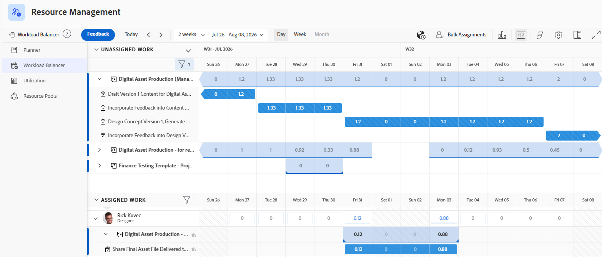
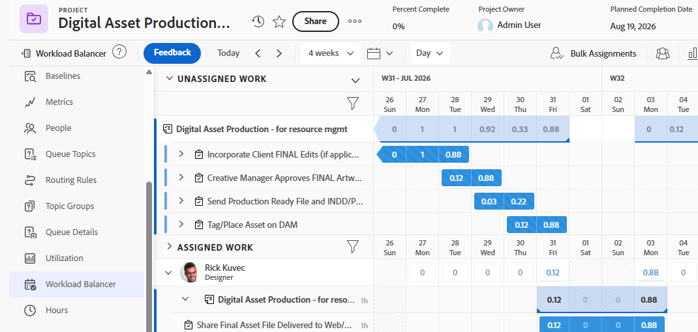
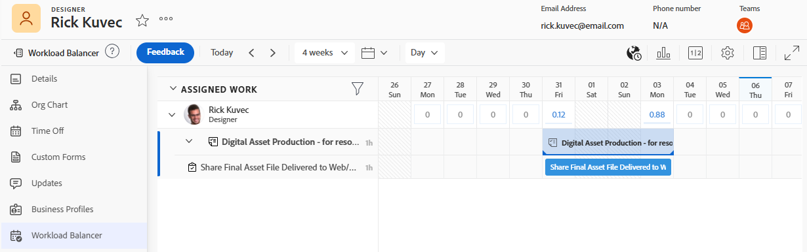

# Navigieren im Workload Balancer

<!--Audited: 12/2024-->

Verwenden Sie den Workload Balancer in Adobe Workfront, um Benutzenden je nach Verfügbarkeit Arbeit zuzuweisen. In diesem Artikel wird beschrieben, wie Sie mithilfe von Einstellungen und Optionen im Workload Balancer navigieren und die für Sie relevanten Informationen anzeigen können. In weiteren hier aufgeführten Artikeln wird beschrieben, wie Sie mit dem Workload Balancer Ihre Ressourcen und deren Arbeitszuweisung verwalten können.

Der Workload Balancer ist in mehreren Bereichen von Adobe Workfront verfügbar. Die Navigation ist in allen Bereichen ähnlich.

Weitere Informationen dazu, wo sich der Workload Balancer befindet, finden Sie unter [Suchen des Workload Balancer](https://experienceleague.adobe.com/en/docs/workfront/using/manage-resources/the-workload-balancer/locate-workload-balancer).

## Zugriffsanforderungen

+++ Erweitern, um die Zugriffsanforderungen für die in diesem Artikel beschriebene Funktionalität anzuzeigen.

<table style="table-layout:auto"> 
 <col> 
 <col> 
 <tbody> 
  <tr> 
   <td>Adobe Workfront-Paket</td> 
   <td>
Beliebig
</td>
  </tr>
  <tr> 
   <td>Adobe Workfront-Lizenz</td> 
   <td>
Standard

       
Planung, wenn der Workload Balancer im Bereich „Ressourcen“ verwendet wird; Arbeit, wenn der Workload Balancer eines Teams oder Projekts verwendet wird
</td>
  </tr>
  <tr> 
   <td>Konfigurationen der Zugriffsebene</td> 
   <td> 
Zugriff auf Folgendes anzeigen oder höher:
 
    <ul> 
     <li>Ressourcenverwaltung</li> 
     <li>Projekte</li> 
     <li>Aufgaben</li> 
     <li>Probleme</li> 
    </ul>
   </td> 
  </tr> 
  <tr> 
   <td>Objektberechtigungen</td> 
   <td>Anzeigen oder Erweitern von Berechtigungen für die Projekte, Aufgaben und Probleme</td> 
  </tr> 
 </tbody> 
</table>

Weitere Informationen finden Sie unter [Zugriffsanforderungen](/help/quicksilver/administration-and-setup/add-users/access-levels-and-object-permissions/access-level-requirements-in-documentation.md) in der Dokumentation zu Workfront.

+++

## Überlegungen zum Anzeigen von Elementen im Workload Balancer

Beachten Sie beim Anzeigen des Workload Balancer Folgendes:

* Der Workload Balancer zeigt Arbeitselemente je nach Zuweisungen in zwei separaten Bereichen an. Arbeitselemente und Benutzer werden in den folgenden Bereichen angezeigt:

  * **Nicht zugewiesene Arbeit**: Elemente, denen keine Zuweisungen zugewiesen sind oder die nur Aufgabengebieten oder Teams zugewiesen sind.
  * **Zugewiesene Arbeit**: Elemente, die mindestens einem Benutzer zugewiesen sind. Die zugewiesenen Elemente werden unter dem Namen des zugewiesenen Benutzers angezeigt.

  >[!NOTE]
  >
  >* Arbeitselemente, die einem Aufgabengebiet oder Team zugewiesen sind und die auch einem Benutzer zugewiesen sind, werden sowohl im Bereich Nicht zugewiesene Arbeit als auch unter dem Namen des zugewiesenen Benutzers im Bereich Zugewiesene Arbeit angezeigt.
  >* Arbeitselemente, die einem Benutzer und einem Aufgabengebiet zugewiesen sind, wobei das Aufgabengebiet als primärer Bearbeiter des Elements ausgewählt ist, werden im Bereich Nicht zugewiesene Arbeit angezeigt.
  >* Arbeitselemente, die mehr als einem Benutzer zugewiesen sind, werden unter allen Namen der zugewiesenen Benutzer im Bereich Zugewiesene Arbeit angezeigt.
  >* Funktionszuweisungen werden unter Arbeitselementen im Bereich Nicht zugeordnete Arbeit angezeigt, wenn die Einstellung Funktionszuweisungen anzeigen aktiviert ist. Weitere Informationen finden Sie im Abschnitt [Anpassen der Ansicht](#customize-the-view) in diesem Artikel.

  Weitere Informationen finden Sie unter [Arbeitsauftragsbereiche im Workload Balancer](/help/quicksilver/resource-mgmt/workload-balancer/assign-work-in-workload-balancer.md#assignment-areas-in-the-workload-balancer) unter [Übersicht über die Zuweisung von Arbeit im Workload Balancer](/help/quicksilver/resource-mgmt/workload-balancer/assign-work-in-workload-balancer.md).

* Wenn ein Projekt während eines bestimmten Zeitraums keine Aufgaben hat, ist der Balken auf Projektebene für diesen Zeitraum leer.

  

* Wenn Sie nicht über die Berechtigung zum Anzeigen bestimmter Elemente verfügen, werden diese als **Nicht zugängliche Arbeitselemente** oder „Nicht **Projekte** angezeigt.

  

* Die Namen der Arbeitselemente werden auf der linken Seite und ihre Zeitleiste auf der rechten Seite angezeigt.
* Die Summe der geplanten Stunden für jedes Arbeitselement wird rechts neben dem Namen des Arbeitselements und links neben dem Balken angezeigt, der die Timeline des Arbeitselements darstellt.
* Die Summe der geplanten Stunden für jedes Projekt wird rechts neben dem Namen des Projekts und links neben dem Balken angezeigt, der die Timeline des Projekts darstellt.

  Die Informationen zu den geplanten Stunden für das Projekt entsprechen der Summe der geplanten Stunden aus allen Elementen, die im Workload Balancer aufgelistet sind, und nicht der Summe der geplanten Stunden für das Projekt.

Weitere Informationen zum Anzeigen von Informationen im Workload Balancer finden Sie in den folgenden Artikeln:

* [Auffinden des Workload Balancers](../workload-balancer/locate-workload-balancer.md)
* [Filtern von Informationen im Workload Balancer](../workload-balancer/filter-information-workload-balancer.md)
* [Freigeben des Workload Balancers mit einem Link](../workload-balancer/share-link-for-workload-balancer.md)
* [Aktualisieren von Arbeitselementen im Workload Balancer mithilfe der Zusammenfassung](../workload-balancer/update-items-in-summary-panel-in-workload-balancer.md)

Informationen zum Verwalten von Ressourcen mit dem Workload Balancer finden Sie auch in den folgenden Artikeln:

* [Überblick über die Zuweisung von Arbeit im Workload Balancer](https://experienceleague.adobe.com/en/docs/workfront/using/manage-resources/the-workload-balancer/assign-work-in-workload-balancer)
* [Verwalten von Benutzerzuordnungen im Workload Balancer](https://experienceleague.adobe.com/en/docs/workfront/using/manage-resources/the-workload-balancer/manage-user-allocations-workload-balancer)

## Navigieren im Workload Balancer für mehrere Projekte im Bereich Ressourcen

Die Navigation im Workload Balancer ist in allen Bereichen, über die Sie darauf zugreifen, ähnlich.

In den folgenden Unterabschnitten wird beschrieben, wie Sie die Informationen im Workload Balancer für mehrere Projekte anzeigen.

Sie können im Workload Balancer eine Reihe von Einstellungen und Optionen anpassen, um die Informationen anzuzeigen, auf die Sie sich konzentrieren müssen, und zwar in dem Zeitraum, der für Sie am sinnvollsten ist.

Nachdem Sie die Einstellungen ausgewählt haben, die Sie auf Ihre Ansicht anwenden möchten, speichert der Workload Balancer diese Einstellungen jedes Mal, wenn Sie über einen Browser oder ein Gerät darauf zugreifen.

### Zugriff auf den Workload Balancer für mehrere Projekte im Bereich „Ressourcen“

So navigieren Sie im Workload Balancer für mehrere Projekte:

{{step1-to-resourcing}}

1. Klicken Sie **linken Bedienfeld** Workload Balancer“.

   

   Der Workload Balancer zeigt Arbeitszuweisungsinformationen, die mit der aktuellen Woche beginnen, in den folgenden beiden Bereichen an:

   * Im **Nicht zugewiesene Arbeit** werden die folgenden Arbeitselemente angezeigt:

     * Arbeitselemente (Aufgaben und Probleme), die Rollen, Teams oder nicht zugewiesenen Benutzern zugewiesen wurden, werden nach dem Anwenden von Filtern angezeigt.
       Im Bereich Nicht zugewiesene Arbeit werden standardmäßig keine Arbeitselemente angezeigt. Es wird empfohlen, Filter zu verwenden, um für Sie relevante Informationen in diesem Bereich anzuzeigen.

       Informationen zur Verwendung von Filtern finden Sie unter [Filtern von Informationen im Workload-Balancer](../workload-balancer/filter-information-workload-balancer.md).

     * Funktionszuweisungen unter Arbeitselementen werden nur angezeigt, wenn Sie die Einstellung „Funktionszuweisungen anzeigen“ aktivieren. Weitere Informationen finden Sie im Abschnitt [Anpassen der Ansicht](#customize-the-view) in diesem Artikel.

     * Projekte werden nur angezeigt, wenn Sie die Einstellung Nach Projekt gruppieren aktivieren. Weitere Informationen finden Sie im Abschnitt [Anpassen der Ansicht](#customize-the-view) in diesem Artikel.

   * Der **Zugewiesene Arbeit** zeigt die folgenden Arbeitselemente an:

     * In diesem Bereich werden standardmäßig alle aktiven Benutzer des Systems angezeigt. Es wird empfohlen, Filter zu verwenden, um die Informationsmenge in diesem Bereich zu begrenzen. Wenn Benutzende Elementen zugewiesen sind, werden die Arbeitselemente auch unter ihrem Namen angezeigt.

     * Mindestens einem Benutzer zugewiesene Aufgaben und Probleme werden unter dem Namen des Benutzers angezeigt.

       Die Arbeitselemente unter den Namen von Benutzern im Bereich Zugewiesene Arbeit sind nach den folgenden Kriterien in dieser Reihenfolge sortiert:

       1. Geplantes Startdatum (ältestes zuerst)
       1. Geplantes Abschlussdatum (ältestes zuerst)
       1. Alphabetisch nach Projekt (nur wenn die ersten beiden Kriterien für mehrere Arbeitselemente identisch sind)

          >[!TIP]
          >
          >* Sie können die Projektsortierung anpassen, indem Sie eine Option aus der Einstellung „Projekte sortieren nach“ auswählen.
          >
          >* Projekte werden nur angezeigt, wenn Sie die Einstellung „Nach Projekt gruppieren“ aktivieren.
          > 
          >Informationen zum Anpassen der Einstellungen finden Sie im Abschnitt [Anpassen der Ansicht](#customize-the-view) in diesem Artikel.

1. (Optional) Klicken Sie auf **Filter**-Symbol  im Bereich **Zugewiesene Arbeit** und wählen Sie dann den **Standardfilter** im Bereich **Vorgeschlagen** des Filterfelds aus.

   Beim Anwenden des Standardfilters werden Benutzer, die zu einem Ihrer Teams gehören, und ihre Arbeitselemente angezeigt. Eine Kopie dieses Filters kann bearbeitet werden.

   >[!TIP]
   >
   >Der Standardfilter ist nur im Workload Balancer im Bereich Ressourcen verfügbar.

1. Fahren Sie mit den folgenden Schritten fort, um durch den Workload-Balancer zu navigieren:

   * [Einen Zeitrahmen im Workload Balancer auswählen](#select-a-time-frame-in-the-workload-balancer)
   * [Ansicht anpassen](#customize-the-view)
   * [Arbeitselemente zuweisen und Benutzerzuweisungen anpassen](#assign-work-items-and-adjust-user-allocations)
   * [Zuteilungen in einem Diagramm anzeigen](#view-allocations-in-a-chart)

### Einen Zeitrahmen im Workload Balancer auswählen

1. Greifen Sie auf den Workload-Balancer im Bereich **Ressourcen** zu, wie im Abschnitt [Zugriff auf den Workload-Balancer für mehrere Projekte im Bereich Ressourcen](#access-the-workload-balancer-for-multiple-projects-in-the-resourcing-area) in diesem Artikel beschrieben.

   Der Workload Balancer zeigt Arbeitsauftragsinformationen an, die mit der aktuellen Woche beginnen.

1. Verwenden Sie den horizontalen Bildlauf, um die Zeitleiste von Arbeitselementen anzuzeigen, die über die Bildschirmgrenzen hinausgehen.
1. Klicken Sie auf **Zurück- oder Vorwärts**-Symbole  in der oberen linken Ecke, um durch die Zeitleiste zu navigieren, und klicken Sie dann auf **Heute**, um zur aktuellen Woche zurückzukehren.
1. Klicken Sie in **Symbolleiste auf das Dropdown** Menü „Zeitrahmen“ und dann auf das Anfangsdatum des Zeitraums, den Sie anzeigen möchten. Standardmäßig ist die erste Woche, die im Kalender ausgewählt wird, die Woche, zu der Sie navigiert sind.

   

1. Wählen Sie aus den folgenden Optionen die Anzahl der Wochen aus, die gleichzeitig im Workload-Balancer angezeigt werden sollen:
   * 1 Woche
   * 2 Wochen
   * 4 Wochen. Dies ist die Standardeinstellung.
   * 6 Wochen
   * 3 Monate

   

1. Klicken Sie auf eine der folgenden Optionen in der Symbolleiste, um Informationen nach verschiedenen Zeitrahmen anzuzeigen:
   * **Tag**: Zeigt Informationen standardmäßig nach Tag für vier Wochen an, beginnend mit dem heutigen Datum.
   * **Woche**: Zeigt Informationen nach Woche für vier Wochen an.
   * **Monat**: Zeigt Informationen nach Monat für drei Monate an.

1. Fahren Sie mit dem Navigieren im Workload Balancer wie in den folgenden Abschnitten beschrieben fort.

### Ansicht anpassen

1. Greifen Sie auf den Workload-Balancer im Bereich **Ressourcen** zu, wie im Abschnitt [Zugriff auf den Workload-Balancer für mehrere Projekte im Bereich Ressourcen](#access-the-workload-balancer-for-multiple-projects-in-the-resourcing-area) in diesem Artikel beschrieben.

   Die Namen der Arbeitselemente werden auf der linken Seite aufgeführt und durch Balken auf der rechten Seite des Workload Balancer dargestellt. Die Länge des Balkens stellt die Zeitleiste eines Arbeitselements dar.

1. (Optional und empfohlen) Verwenden Sie Filter in den Bereichen Nicht zugewiesene und Zugewiesene Arbeit , um nur Arbeitselemente oder Benutzer anzuzeigen, die für Sie relevant sind.

   Weitere Informationen finden Sie unter [Filtern von Informationen im Workload Balancer](../workload-balancer/filter-information-workload-balancer.md).

   Standardmäßig stellen blaue Balken die Timelines von Projekten und Aufgaben dar und kastanienbraune Balken stellen Probleme dar.

   Sie können die Farbe der Balken für Projekte und Aufgaben ändern, wenn Sie das gewünschte Farbmuster für das Projekt auswählen. Weitere Informationen finden Sie in diesem Verfahren.

   Arbeitselemente im Bereich Zugewiesene Arbeit werden nach Projekten anhand der folgenden Kriterien in der folgenden Reihenfolge sortiert:
   1. Geplantes Startdatum (ältestes zuerst)
   1. Geplantes Abschlussdatum (ältestes zuerst)
   1. Alphabetisch nach Projekt (nur wenn die ersten beiden Kriterien für mehrere Arbeitselemente identisch sind)

1. Klicken Sie auf den **Pfeil nach rechts** links neben dem Bereich Nicht zugewiesen oder Zugewiesen , um alle Elemente unter den Projektnamen (im Bereich Nicht zugewiesen) und unter den Benutzernamen (im Bereich Zugewiesen) zu erweitern.

   >[!TIP]
   >
   >Arbeitselemente werden nur dann unter Projektnamen im Bereich Nicht zugewiesen aufgeführt, wenn Sie die Einstellung „Nach Projekt gruppieren“ aktivieren.

1. Klicken Sie auf **Abwärtspfeil** links neben dem Bereich Nicht zugewiesen oder Zugewiesen , um alle Elemente unter den Projektnamen (im Bereich Nicht zugewiesen) und unter den Benutzernamen (im Bereich Zugewiesen) zu reduzieren.

1. Bewegen Sie den Mauszeiger darüber und ziehen Sie dann die **Trennlinie** zwischen dem linken Bedienfeld und dem Zeitleistenbereich, um die Größe des linken Bedienfelds anzupassen.

   

1. Klicken Sie auf das **Einstellungen**-Symbol .

   Das Bedienfeld Einstellungen wird auf der rechten Seite angezeigt.

   

   Wählen Sie aus den unten aufgeführten Optionen aus, um die Informationen zu aktualisieren, die Sie im Workload Balancer anzeigen, und klicken Sie dann auf das **X** Symbol oben rechts im Feld „Einstellungen“, um ihn zu schließen.

   * **Nach Projekt gruppieren**: Wenn diese Option ausgewählt ist, werden die Elemente in den Bereichen „Nicht zugewiesene Arbeit“ und „Zugewiesene Arbeit“ nach Projekt gruppiert. Dies ist standardmäßig ausgewählt.

   * **Stunden aus Problemen einbeziehen**: Wenn diese Option ausgewählt ist, werden Probleme, die Benutzern zugewiesen wurden, unter dem Namen des Benutzers im Bereich „Zugewiesene Arbeit“ angezeigt. Probleme, die Benutzern nicht zugewiesen wurden, werden im Bereich „Nicht zugewiesene Arbeit“ angezeigt. Die geplanten Stunden aus den Problemen werden für die geplanten Stunden für das Projekt und für den Benutzer im Bereich Zugewiesene Arbeit gezählt.
   * **Prognostiziertes Datum anzeigen**: Wenn diese Option ausgewählt ist, wird die projizierte Zeitleiste von Arbeitselementen zusätzlich zur geplanten Zeitleiste angezeigt. Beachten Sie Folgendes:
     * Die projizierte Zeitleiste von Projekten, Aufgaben und Problemen wird als dunkelblaue Linie über den Aufgaben-, Problem- und Projektbalken angezeigt.
     * Die projizierte Zeitleiste, die sich außerhalb der geplanten Zeitleiste befindet, wird hellblau angezeigt, auch wenn Sie das Farbschema wie unten beschrieben aktualisieren.
     * Die projizierte Zeitleiste für die Elemente, auf die Sie keinen Zugriff haben, wird hellgrau mit einer Linie darunter angezeigt.
     * Wenn eine Aufgabe oder ein Problem vor dem fälligen geplanten Abschlussdatum abgeschlossen wird, werden die Zuordnungsnummern für die verbleibenden Tage durchgestrichen und nicht auf die Zuordnung des Benutzers angerechnet. Dies wird nur angezeigt, wenn sowohl die Einstellung „Prognostiziertes Datum anzeigen“ als auch das Symbol Zuordnung anzeigen aktiviert sind.

     >[!TIP]
     >
     >Beachten Sie, dass Arbeitselemente im Workload Balancer angezeigt werden, wenn während des ausgewählten Zeitraums entweder ihre geplanten oder die projizierten Zeitpläne (nicht unbedingt beide gleichzeitig) angezeigt werden.

   * **Abgeschlossene Arbeiten anzeigen**: Wenn diese Option aktiviert ist, werden abgeschlossene Aufgaben und Probleme im Bereich Zugewiesene Arbeit angezeigt. Dies ist standardmäßig aktiviert.

     Nach Abschluss einer Aufgabe oder eines Problems wird oben rechts ein grünes Häkchensymbol angezeigt. Dasselbe Symbol wird für ein Projekt angezeigt, wenn die Aufgaben oder Probleme für den ausgewählten Zeitrahmen des Projekts abgeschlossen sind.

     >[!NOTE]
     >
     >Die Sichtbarkeit von Aufgaben im Workload Balancer wird durch den Abschluss von Aufgaben auf Aufgabenebene gesteuert, nicht durch den Abschluss auf Zuweisungsebene. Wenn eine Aufgabe mehrere Beauftragte hat und ein oder mehrere Beauftragte „Mit meinem Teil fertig“ auswählen, der Aufgabenstatus insgesamt jedoch nicht „Abgeschlossen“ lautet, wird die Aufgabe als nicht abgeschlossene Arbeit betrachtet. Wenn die Option **Abgeschlossene Arbeit anzeigen** deaktiviert ist, wird die Aufgabe weiterhin angezeigt, da sie nicht vollständig abgeschlossen ist.

   * **Verbleibende Zeit anzeigen**: Wenn diese Option aktiviert ist, zeigt Workfront die Differenz zwischen der täglichen Zeit, für die der Benutzer zur Arbeit verfügbar ist, basierend auf seinen Zeitplänen, und den Stunden an, für die er im Bereich Zugewiesene Arbeit für die Benutzer zugewiesen ist. Dies ist standardmäßig deaktiviert und die zugewiesene Zeit wird standardmäßig angezeigt.
   * **Funktionszuweisungen anzeigen**: Wenn diese Option aktiviert ist, werden Funktionszuweisungen im Bereich Nicht zugewiesene Arbeit unter den ihnen zugewiesenen Arbeitselementen angezeigt. Dies ist standardmäßig aktiviert.

   * Wählen Sie im **Farbschema auswählen** die Farbe aus, die Sie für das Projekt und die Vorgangsbalken benötigen.

     >[!TIP]
     >
     >Die Einstellung für die Auswahl des Farbdesigns hat keinen Einfluss auf die Farbe der Problemleisten. Probleme werden immer in einem braunen Balken angezeigt.

     Wählen Sie aus den folgenden Optionen aus:
     * **Standard**: Die Balken für alle Projekte und deren Arbeitselemente werden blau angezeigt.
     * **Projekt**: Die mit jedem Projekt und seinen Aufgaben verknüpften Balken ändern sich je nach Projektname. Alle Aufgaben, die zum Projekt gehören, werden in Balken angezeigt, die der Farbe des Projekts entsprechen. Die Projektbalken werden in einem helleren Farbton angezeigt, um sie von den Aufgaben zu unterscheiden. Die Projektleisten enthalten auch ein Projektsymbol, wenn Sie festlegen, dass keine Zuordnungen angezeigt werden sollen.
     * **Projektstatus**: Die mit jedem Projekt und seinen Arbeitselementen verknüpften Balken ändern sich entsprechend der Farbe des Projektstatus.

       Der Projektstatus ist der, der der Gruppe des Projekts zugeordnet ist. Wenn die Gruppe keinen gruppenspezifischen Status hat, ist die Farbe der Arbeitselementleisten die des Projektstatus auf Systemebene. Sowohl der System- als auch der benutzerdefinierte Status werden angezeigt. Weitere Informationen zum Gruppenstatus finden Sie unter [Erstellen oder Bearbeiten eines Gruppenstatus](../../administration-and-setup/manage-groups/manage-group-statuses/create-or-edit-a-group-status.md).

   * Wählen **im Abschnitt „Benutzerzuordnung anzeigen in** eine der folgenden Optionen aus:
     * **Stunden**: Zeigt die zugewiesene Zeit als Stunden an. Dies ist der Standardwert.
     * **Prozentsatz**: Zeigt die zugewiesene Zeit als Prozentsatz der gesamten verfügbaren Zeit an
   * Wählen **im Abschnitt** Sortiereinstellungen“ aus, wie die Elemente im Workload-Balancer sortiert werden sollen. Wählen Sie aus den folgenden Optionen aus:
     * **Benutzer nach Primärer Rolle sortieren**: Benutzer werden im Bereich Zugewiesene Arbeit in der alphabetischen Reihenfolge ihrer Primären Rollen angezeigt.
     * **Benutzer alphabetisch sortieren**: Benutzer werden in der alphabetischen Reihenfolge ihrer Vornamen im Bereich Zugewiesene Arbeit angezeigt.
     * **Projekte sortieren nach**: Wählen Sie ein Projektfeld aus dem Dropdown-Menü aus, um Projekte in den Bereichen Nicht zugewiesene oder Zugewiesene Arbeit alphabetisch nach diesem Feld zu sortieren.

   >[!TIP]
   >
   >Sie können nur dann nach Projekten sortieren, wenn die Einstellung Nach Projekt gruppieren aktiviert ist. Andernfalls ist diese Einstellung abgeblendet.

1. (Optional und bedingt) Wenn Sie das Farbdesign in Projektstatus ändern, bewegen Sie den Mauszeiger über den Namen eines Projekts auf der linken Seite, um den Status des Projekts anzuzeigen.

   

### Arbeitselemente zuweisen und Benutzerzuweisungen anpassen

1. Greifen Sie auf den Workload-Balancer im Bereich Ressourcen zu, wie im Abschnitt [Zugriff auf den Workload-Balancer für mehrere Projekte im Bereich Ressourcen](#access-the-workload-balancer-for-multiple-projects-in-the-resourcing-area) in diesem Artikel beschrieben.
1. Klicken Sie auf **Zuordnungssymbol anzeigen** , um die täglichen oder wöchentlichen geplanten Stunden für Arbeitselemente anzuzeigen.

   Dadurch wird der Name in den Balken der Arbeitselemente durch die Anzahl der täglichen oder wöchentlichen geplanten Stunden in den Bereichen Nicht zugewiesene und Zugewiesene Arbeit ersetzt. Diese Einstellung ist standardmäßig deaktiviert.

   Tage mit Überallokationen werden rot angezeigt.

   >[!TIP]
   >
   >* Die Option Zuteilungen anzeigen wirkt sich nur auf die Anzeigen für Projekte, Aufgaben, Probleme und nicht zugängliche Elemente aus. Die täglichen geplanten Stunden für Benutzende werden standardmäßig angezeigt und können nicht ausgeblendet werden.
   >* Sie müssen die Einstellung Nach Projekt gruppieren aktivieren, um die täglichen geplanten Stunden für Projekte anzuzeigen.
   >* Wenn Sie den Workload Balancer nach Woche anzeigen, entsprechen die angezeigten Stunden den wöchentlich geplanten Stunden.

1. (Optional) Bewegen Sie den Mauszeiger über die zugewiesene Zeit in der Benutzerzeile, um die Kapazität und Zuordnung des Benutzers zu verstehen. Die Kapazität entspricht der Verfügbarkeit der Benutzer gemäß ihrem Zeitplan.

   

1. (Optional) Klicken Sie auf **Zuordnungssymbol ausblenden** , um den Namen der Aufgaben und Probleme in den Balken der Arbeitselemente anzuzeigen.
1. Klicken Sie auf das **Mehr Menü**-Symbol  rechts neben dem Namen einer Aufgabe, eines Problems oder einer Rolle und klicken Sie dann auf eine der folgenden Optionen.

   

   * **Dies zuweisen** und dann beginnen Sie, den Namen eines Benutzers, einer Funktion oder eines Teams, dem bzw. dem Sie das Arbeitselement zuweisen möchten, in das Feld **Personen, Funktion oder Teams suchen** einzugeben.

     Klicken Sie **Erweitert**, um den Bildschirm Erweiterte Zuweisungen für das Arbeitselement aufzurufen. Weitere Informationen finden Sie unter [Erstellen erweiterter Zuweisungen](/help/quicksilver/manage-work/tasks/assign-tasks/create-advanced-assignments.md).

     Sie können auch die folgenden Tastaturbefehle verwenden, um Aufgaben oder Probleme zuzuweisen:

     * Unter Windows: STRG+Klicken auf die Aufgaben- oder Problemleiste.
     * In Mac: Klicken Sie bei gedrückter Befehlstaste auf die Aufgaben- oder Problemleiste.

     Weitere Informationen zum Zuweisen von Arbeitselementen zu Benutzern im Workload Balancer finden Sie unter [Übersicht über die Zuweisung von Arbeit im Workload Balancer](../workload-balancer/assign-work-in-workload-balancer.md).

     >[!NOTE]
     >
     >Funktionszuweisungen werden nur dann unter Arbeitselementen im Bereich Nicht zugewiesene Arbeit angezeigt, wenn die Einstellung Funktionszuweisungen anzeigen aktiviert ist. Weitere Informationen finden Sie im Abschnitt [Anpassen der Ansicht](#customize-the-view) in diesem Artikel. Funktionszuweisungen haben nur die Option **Diesen zuweisen** im Menü **Mehr**.

     >[!TIP]
     >
     >Wenn der Workfront- oder Gruppenadministrator Delegierungen in Ihrer Umgebung aktiviert hat, verwenden Sie die Registerkarte Zuweisungen , um Benutzende der Aufgabe oder dem Problem zuzuweisen. Informationen zum Delegieren von Arbeit finden Sie unter [Delegieren von Aufgaben und Problemen](../../manage-work/delegate-work/how-to-delegate-work.md).

   * **Zuteilungen bearbeiten** bearbeiten Sie dann die täglichen oder wöchentlichen Zuteilungen für den Benutzer. Informationen zum Verwalten von Benutzerzuweisungen finden Sie unter [Verwalten von Benutzerzuweisungen im Workload-Balancer](../workload-balancer/manage-user-allocations-workload-balancer.md).

   * **Zusammenfassung öffnen**. Das Bedienfeld Zusammenfassung wird auf der rechten Seite geöffnet. Klicken Sie dann auf das Feld Arbeitsaufträge und geben Sie den Namen eines Benutzers, einer Funktion oder eines Teams in das Feld **Personen, Funktion oder Teams suchen** ein, um das Element zuzuweisen. Weitere Informationen finden Sie im Abschnitt [Anzeigen weiterer Informationen zu Aufgaben und Problemen](#display-more-information-about-tasks-and-issues) in diesem Artikel.

1. (Optional) Doppelklicken Sie auf eine tägliche oder wöchentliche Zuordnung für einen Benutzer in der Leiste eines Arbeitselements, um die Anzahl der zugewiesenen Stunden zu bearbeiten, und klicken Sie dann auf das **Speichern**-Symbol , um die Zuordnungen zu speichern, oder auf das **Abbrechen**-Symbol , um die angepassten Zuordnungen zu entfernen.

   >[!TIP]
   >
   >Die Symbole Speichern und Abbrechen werden gegen Ende einer Aufgabe oder der Zeitleiste eines Problems angezeigt.
   >
   >

   Informationen zum Verwalten von Benutzerzuweisungen finden Sie unter [Verwalten von Benutzerzuweisungen im Workload-Balancer](../workload-balancer/manage-user-allocations-workload-balancer.md).

1. Klicken Sie auf **Massenzuweisungen**, um Arbeitselemente stapelweise zuzuweisen.

   Weitere Informationen finden Sie unter [Massenzuweisung von Arbeit im Workload Balancer](../workload-balancer/assign-work-in-workload-balancer-in-bulk.md).
1. Ziehen Sie Elemente aus dem Bereich **Nicht zugewiesene Arbeit** oder von einem Benutzer und legen Sie sie auf einem anderen Benutzer ab, um sie zuzuweisen.

   Weitere Informationen finden Sie unter [Zuweisen von Arbeit im Workload Balancer durch Ziehen und Ablegen](../workload-balancer/assign-work-in-workload-balancer-by-drag-and-drop.md).

### Zuteilungen in einem Diagramm anzeigen

Anstatt Zuordnungen in täglichen oder wöchentlichen Zahlen anzuzeigen, können Sie sie in einem Diagramm anzeigen.

1. Greifen Sie auf den Workload-Balancer im Bereich Ressourcen zu, wie im Abschnitt [Zugriff auf den Workload-Balancer für mehrere Projekte im Bereich Ressourcen](#access-the-workload-balancer-for-multiple-projects-in-the-resourcing-area) in diesem Artikel beschrieben.
1. Klicken Sie auf **Diagrammsymbol** , um die Benutzerzuordnung in einem Diagrammformat anzuzeigen.

   Tage, an denen der Benutzer überlastet ist, werden als rote Blöcke angezeigt, und Tage, an denen der Benutzer unterlastet ist oder die Kapazität erreicht hat, werden als blaue Blöcke angezeigt.

   Die Größe der Blöcke gibt die Höhe der Zuordnung an: Je größer das Feld, desto mehr Zeit wird dem Benutzer für Arbeitselemente für diesen Tag oder diese Woche zugewiesen.

   

### Weitere Informationen zu Aufgaben und Problemen anzeigen

Weitere Informationen zu den Aufgaben und Problemen finden Sie im Workload-Balancer.

1. Greifen Sie auf den Workload-Balancer im Bereich Ressourcen zu, wie im Abschnitt [Zugriff auf den Workload-Balancer für mehrere Projekte im Bereich Ressourcen](#access-the-workload-balancer-for-multiple-projects-in-the-resourcing-area) in diesem Artikel beschrieben.
1. Um weitere Informationen im Bedienfeld Zusammenfassung anzuzeigen, führen Sie einen der folgenden Schritte aus:

   * Klicken Sie auf den Balken einer Aufgabe oder eines Problems, um das Bedienfeld Zusammenfassung auf der rechten Seite zu öffnen.
   * Klicken Sie auf das **Zusammenfassung öffnen**-Symbol  und klicken Sie dann auf den Balken einer Aufgabe oder eines Problems, um das Bedienfeld Zusammenfassung zu öffnen.
   * Klicken Sie auf das **Mehr**-Menü rechts neben einer Aufgabe oder einem Problem und dann auf **Zusammenfassung öffnen**.

   Informationen zum Aktualisieren von Aufgabeninformationen in der Zusammenfassung im Workload Balancer finden Sie unter [Aktualisieren von Arbeitselementen im Workload Balancer mithilfe der Zusammenfassung](../workload-balancer/update-items-in-summary-panel-in-workload-balancer.md).

1. Bewegen Sie den Mauszeiger über den Namen einer Aufgabe oder eines Problems, um weitere Informationen dazu anzuzeigen. Oberhalb der Aufgabe oder des Problems wird ein Feld mit den folgenden Informationen angezeigt:

   * Der Name der Aufgabe oder des Problems.
   * Der Name des Projekts.
   * Die geplanten Start- und Abschlussdaten.
   * Die Anzahl der geplanten Stunden.
   * Für Aufgaben die Vorgängernummer.
   * Bei Aufgaben wird in der oberen Ecke des Felds ein Indikator angezeigt, der angibt, ob die Aufgabe bereit zur Bearbeitung ist.

   

1. Klicken Sie auf den Namen eines Arbeitselements auf der linken Seite, um darauf zuzugreifen. Das Arbeitselement wird in einer neuen Browser-Registerkarte geöffnet.

### Anzeigen des Workload Balancer im Vollbildmodus

1. Greifen Sie auf den Workload-Balancer im Bereich Ressourcen zu, wie im Abschnitt [Zugriff auf den Workload-Balancer für mehrere Projekte im Bereich Ressourcen](#access-the-workload-balancer-for-multiple-projects-in-the-resourcing-area) in diesem Artikel beschrieben.

1. Klicken Sie auf **Vollbildsymbol** , um den Workload-Balancer im Vollbildmodus anzuzeigen.

   Der Workload Balancer nimmt den gesamten Bildschirm ein. Browser-Fenster und Registerkarten sind von der Ansicht ausgeschlossen.

1. Klicken Sie auf das **Vollbildmodus beenden**-Symbol , um zum Standardbildschirm zurückzukehren und den Workload-Balancer in der Browser-Registerkarte anzuzeigen.

## Navigieren im Workload Balancer eines Teams

Die Navigation im Workload Balancer eines Teams ähnelt der Navigation im Workload Balancer für mehrere Projekte. Weitere Informationen finden Sie im Abschnitt [Navigieren im Workload Balancer für mehrere Projekte](#navigate-the-workload-balancer-for-multiple-projects-in-the-resourcing-area) in diesem Artikel.

{{step1-to-team}}

Die Seite Ihres Home-Teams wird standardmäßig angezeigt.

1. Klicken Sie **linken Bedienfeld** Workload Balancer“.

   

   Der Workload Balancer eines Teams zeigt standardmäßig die folgenden Informationen an:

   * Im Bereich **Nicht zugewiesene Arbeit**: Arbeitselemente, die dem Team oder dem Team und den Aufgabengebieten zugewiesen sind und die Benutzern nicht zugewiesen sind. Funktionszuweisungen werden unter Arbeitselementen im Bereich Nicht zugeordnete Arbeit angezeigt, wenn die Einstellung Funktionszuweisungen anzeigen aktiviert ist.
   * Im Bereich **Zugewiesene Arbeit** werden Arbeitselemente, die Benutzern zugewiesen sind, unter den Namen der Benutzer angezeigt.

1. Fahren Sie mit dem Navigieren im Workload-Balancer eines Teams fort, wie im Abschnitt [Navigieren im Workload-Balancer für mehrere Projekte im Bereich Ressourcen](#navigate-the-workload-balancer-for-multiple-projects-in-the-resourcing-area) dieses Artikels beschrieben.

## Navigieren im Workload Balancer eines einzelnen Projekts

{{step1-to-projects}}

1. Klicken Sie auf den Namen eines Projekts, um die Projektseite zu öffnen.
1. Klicken Sie **linken Bedienfeld** Workload Balancer“.

   

   Der Workload Balancer für das Projekt zeigt standardmäßig die folgenden Informationen an:

   * Im Bereich **Nicht zugewiesene Arbeit**: Arbeitselemente im Projekt, die Rollen oder Teams zugewiesen sind und nicht Benutzern zugewiesen sind. Funktionszuweisungen werden unter Arbeitselementen im Bereich Nicht zugeordnete Arbeit angezeigt, wenn die Einstellung Funktionszuweisungen anzeigen aktiviert ist.
   * Im Bereich **Zugewiesene Arbeit**: Arbeitselemente im Projekt, die mindestens einem Benutzer zugewiesen sind.

   Es wird empfohlen, Filter zu verwenden, um nur Benutzer anzuzeigen, die für Sie wichtig sind.

   Beispielsweise könnten Sie erwägen, nur Benutzer anzuzeigen, die zu Ihren Teams oder Gruppen gehören. Weitere Informationen finden Sie unter [Filtern von Informationen im Workload Balancer](../workload-balancer/filter-information-workload-balancer.md).

1. (Optional) Klicken Sie auf **Filter**-Symbol  im Bereich Zugewiesene Arbeit und wählen Sie die Option **Arbeitselemente dieses Projekts** im Bereich **Vorgeschlagen** des Filterbedienfelds aus. Dieser Filter ist standardmäßig deaktiviert.

   Wenn diese Option ausgewählt ist, werden nur die den Benutzenden im ausgewählten Projekt zugewiesenen Elemente angezeigt.

   Wenn die Option nicht ausgewählt ist, werden alle den Benutzenden im Projekt zugewiesenen Elemente angezeigt, unabhängig davon, zu welchen Projekten die Elemente gehören.

1. (Optional und empfohlen) Wenden Sie einen Filter im Bereich Zugewiesene Arbeit an, um Benutzer anzuzeigen, die Ihnen wichtig sind, aber möglicherweise nicht Elementen im Projekt zugewiesen sind, und klicken Sie dann auf das Symbol **Alle Benutzer anzeigen** .

   Durch die Anzeige aller Benutzenden können Sie alle Benutzenden in Workfront anzeigen, denen noch keine Arbeit oder andere Rollen im Projekt zugewiesen wurden.

   Sie können zuerst einen Filter anwenden, um die Anzahl der angezeigten Benutzer zu reduzieren.

   Beispielsweise können Sie zuerst nach Benutzern filtern, die zu Ihren Teams oder Gruppen gehören, und dann alle diese Benutzer anzeigen.

   Informationen zum Erstellen eines Filters finden Sie unter [Filtern von Informationen im Workload-Balancer](../workload-balancer/filter-information-workload-balancer.md).

   >[!NOTE]
   >
   > Die Option Alle Benutzer anzeigen ist nur für den Workload-Balancer eines Projekts verfügbar.

1. (Optional) Klicken Sie auf das Symbol **Rollenzuweisungen anzeigen** .

   Das Bedienfeld „Rollenzuweisung“ wird angezeigt.

   Sie können im Szenario-Planer Informationen zu den geplanten Stunden anzeigen, die mit den Aufgabengebieten des Projekts verknüpft sind, sowie zu den Aufgabengebieten, die mit den mit den Projekten verknüpften Initiativen verknüpft sind.

   Weitere Informationen finden Sie unter [Übersicht über die Abstimmung der Ressourcenzuweisungen zwischen Projekten und Initiativen](../../scenario-planner/overview-reconcile-allocations-between-projects-initiatives.md).

   >[!NOTE]
   >
   >Sie können keine Aufgabengebiet-Informationen für Initiativen anzeigen, wenn Ihr Unternehmen keine Lizenz für den Workfront Scenario Planner erworben hat. In diesem Fall können Sie nur die geplanten Stunden anzeigen, die mit Aufgabengebieten im Projekt verknüpft sind. Weitere Informationen finden Sie unter [Zugriff für die Verwendung des Szenario-Planers erforderlich](../../scenario-planner/access-needed-to-use-sp.md).

1. Fahren Sie mit dem Navigieren im Workload-Balancer eines Projekts fort, wie im Abschnitt [Navigieren im Workload-Balancer für mehrere Projekte](#navigate-the-workload-balancer-for-multiple-projects-in-the-resourcing-area) dieses Artikels beschrieben.

## Navigieren im Workload Balancer eines Benutzers

Sie können über Ihr eigenes Benutzerprofil auf den Workload-Balancer zugreifen.

{{step1-click-profile-pic}}

1. Klicken Sie **linken Bedienfeld** Workload Balancer“.

   Der Workload-Balancer für den Benutzer wird angezeigt.

   

   Der Workload-Balancer eines Benutzers zeigt standardmäßig die folgenden Informationen an:

   * **Zugewiesene Arbeit**: Die Aufgaben und Probleme, die dem jeweiligen Benutzer zugewiesen sind.

   >[!NOTE]
   >
   >Der Workload-Balancer für ein Benutzerprofil ist schreibgeschützt und Zuweisungen und Zuweisungen können nicht geändert werden.

1. Fahren Sie mit dem Navigieren im Workload-Balancer eines Benutzers fort, wie im Abschnitt [Navigieren im Workload-Balancer für mehrere Projekte](#navigate-the-workload-balancer-for-multiple-projects-in-the-resourcing-area) dieses Artikels beschrieben.

