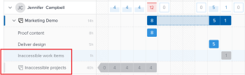

# Navigieren Sie zum Lastenausgleich .

Verwenden Sie den Lastenausgleich in Adobe Workfront, um Benutzern basierend auf ihrer Verfügbarkeit Arbeit zuzuweisen. In diesem Artikel wird beschrieben, wie Sie mithilfe von Einstellungen und Optionen in den Arbeitslastausgleich navigieren und die für Sie relevanten Informationen anzeigen können. In den hier aufgeführten zusätzlichen Artikeln wird beschrieben, wie Sie mit dem Lastenausgleich Ihre Ressourcen und deren Zuordnung verwalten können.

Der Lastenausgleich ist in mehreren Bereichen von Adobe Workfront verfügbar. Die Navigation ist in allen Bereichen ähnlich.

Weitere Informationen darüber, wo sich der Lastenausgleich befindet, finden Sie unter [Suchen Sie den Lastenausgleich .](https://experienceleague.adobe.com/docs/workfront/using/manage-resources/the-workload-balancer/locate-workload-balancer.html?lang=en).

## Zugriffsanforderungen

<!--drafted - replace table for P&P:

<table style="table-layout:auto"> 
 <col> 
 <col> 
 <tbody> 
  <tr> 
   <td role="rowheader">Adobe Workfront plan*</td> 
   <td> 
Any 
 </td> 
  </tr> 
  <tr> 
   <td role="rowheader">Adobe Workfront license*</td> 
<td>
Current license: Standard 

    Or 

Legacy license:

    <ul>
    <li>
Plan, when using the Workload Balancer for a team or in the Resourcing area 
</li>
    <li>
Work, when using the Workload Balancer of a project 
</li>
    </ul>
 </td> 
  </tr> 
  <tr> 
   <td role="rowheader">Access level configurations*</td> 
   <td> 
View or higher access to the following:
 
    <ul> 
     <li> 
Resource Management
 </li> 
     <li> 
Projects
 </li> 
     <li> 
Tasks
 </li> 
     <li> 
Issues
 </li> 
    </ul> 
If you still don't have access, ask your Workfront administrator if they set additional restrictions in your access level. For information on how a Workfront administrator can change your access level, see <a href="../../administration-and-setup/add-users/configure-and-grant-access/create-modify-access-levels.md" class="MCXref xref">Create or modify custom access levels</a>.
 </td> 
  </tr> 
  <tr> 
   <td role="rowheader">Object permissions</td> 
   <td> 
View or higher permissions to the projects, tasks, and issues 
 
For information on requesting additional access, see <a href="../../workfront-basics/grant-and-request-access-to-objects/request-access.md" class="MCXref xref">Request access to objects </a>.
 </td> 
  </tr> 
 </tbody> 
</table>
-->

Sie müssen über folgenden Zugriff verfügen, um die Schritte in diesem Artikel ausführen zu können:

<table style="table-layout:auto"> 
 <col> 
 <col> 
 <tbody> 
  <tr> 
   <td role="rowheader">Adobe Workfront-Plan*</td> 
   <td> 
Beliebig 
 </td> 
  </tr> 
  <tr> 
   <td role="rowheader">Adobe Workfront-Lizenz*</td> 
   <td> 
Planen Sie bei Verwendung des Lastenausgleichs für ein Team oder im Ressourcenbereich 

   
Arbeiten, wenn Sie den Lastenausgleich eines Projekts verwenden 

 </td> 
  </tr> 
  <tr> 
   <td role="rowheader">Konfigurationen auf Zugriffsebene*</td> 
   <td> 
Zeigen Sie den Zugriff auf Folgendes an oder höher:
 
    <ul> 
     <li> 
Ressourcenverwaltung
 </li> 
     <li> 
Projekte
 </li> 
     <li> 
Aufgaben
 </li> 
     <li> 
Probleme
 </li> 
    </ul> 
Wenn Sie immer noch keinen Zugriff haben, fragen Sie Ihren Workfront-Administrator, ob er zusätzliche Zugriffsbeschränkungen für Ihre Zugriffsebene festlegt. Informationen dazu, wie ein Workfront-Administrator Ihre Zugriffsstufe ändern kann, finden Sie unter <a href="../../administration-and-setup/add-users/configure-and-grant-access/create-modify-access-levels.md" class="MCXref xref">Benutzerdefinierte Zugriffsebenen erstellen oder ändern</a>.
 </td> 
  </tr> 
  <tr> 
   <td role="rowheader">Objektberechtigungen</td> 
   <td> 
Anzeigen von oder höheren Berechtigungen für die Projekte, Aufgaben und Probleme 
 
Informationen zum Anfordern von zusätzlichem Zugriff finden Sie unter <a href="../../workfront-basics/grant-and-request-access-to-objects/request-access.md" class="MCXref xref">Zugriff auf Objekte anfordern </a>.
 </td> 
  </tr> 
 </tbody> 
</table>

*Wenden Sie sich an Ihren Workfront-Administrator, um zu erfahren, welchen Plan, welchen Lizenztyp oder welchen Zugriff Sie haben.

## Überlegungen zum Anzeigen von Elementen im Arbeitslastausgleich

Beachten Sie Folgendes bei der Anzeige des Lastenausgleichs:

* Der Lastenausgleich zeigt Arbeitselemente in zwei separaten Bereichen an, je nach Zuweisung. Arbeitselemente und Benutzer werden in den folgenden Bereichen angezeigt:

   * **Nicht zugewiesene Arbeit**: Elemente, die keine Zuweisung aufweisen oder nur Auftrags- oder Teams zugewiesen sind.
   * **Zugewiesene Arbeit**: Elemente, die mindestens einem Benutzer zugewiesen sind. Die zugewiesenen Elemente werden unter dem Namen des zugewiesenen Benutzers angezeigt.

   >[!NOTE]
   >
   >* Elemente, die einer Job-Rolle oder einem Team zugewiesen sind und auch einem Benutzer zugewiesen sind, der der primäre Verantwortliche ist, werden nicht im Arbeitsbereich &quot;Nicht zugewiesen&quot;angezeigt.
   >
   >* Einem Benutzer zugewiesene Elemente sowie eine Auftragsrolle, bei der die Auftragsrolle als Hauptverantwortlicher des Elements ausgewählt ist, werden im Bereich Nicht zugewiesene Arbeit angezeigt.
   >* Elemente, die mehr als einem Benutzer zugewiesen sind, werden im Bereich &quot;Zugewiesene Arbeit&quot;unter den Namen aller Benutzer angezeigt.

* Wenn ein Projekt während eines Zeitraums keine Aufgaben hat, wird die Leiste auf Projektebene zu einer abgeblendeten Farbe.

   

* Wenn Sie nicht berechtigt sind, bestimmte Elemente anzuzeigen, werden sie als **Nicht verfügbare Arbeitselemente** oder **Nicht zugängliche Projekte**.

   

* Die Namen der Arbeitselemente werden links und ihre Timeline rechts angezeigt.
* Die Gesamtanzahl der geplanten Stunden für jedes Arbeitselement wird rechts neben dem Namen des Arbeitselements und links neben der Leiste angezeigt, die die Timeline des Arbeitselements darstellt.
* Die Gesamtdauer der geplanten Stunden für jedes Projekt wird rechts neben dem Namen des Projekts und links neben der Leiste angezeigt, die die Timeline des Projekts darstellt.

   Die Informationen zu den geplanten Stunden für das Projekt umfassen die Gesamtanzahl der geplanten Stunden von allen im Arbeitslastausgleich aufgelisteten Elementen und nicht die Gesamtanzahl der geplanten Stunden für das Projekt.

Weitere Informationen zum Anzeigen von Informationen im Arbeitslastausgleich finden Sie in den folgenden Artikeln:

* [Suchen Sie den Lastenausgleich .](../workload-balancer/locate-workload-balancer.md)
* [Filtern von Informationen im Arbeitslastausgleich](../workload-balancer/filter-information-workload-balancer.md)
* [Den Lastenausgleich über einen Link freigeben](../workload-balancer/share-link-for-workload-balancer.md)
* [Aktualisieren von Arbeitselementen im Arbeitslastausgleich mithilfe der Zusammenfassung](../workload-balancer/update-items-in-summary-panel-in-workload-balancer.md)

Weitere Informationen zum Verwalten von Ressourcen mithilfe des Workload Balancer finden Sie in den folgenden Artikeln:

* [Übersicht über die Zuweisung von Aufgaben im Arbeitslastausgleich](https://experienceleague.adobe.com/docs/workfront/using/manage-resources/the-workload-balancer/assign-work-in-workload-balancer.html?lang=en)
* [Verwalten von Benutzerzuordnungen im Lastenausgleich](https://experienceleague.adobe.com/docs/workfront/using/manage-resources/the-workload-balancer/manage-user-allocations-workload-balancer.html?lang=en)

## Navigieren Sie im Bereich Ressourcen zum Arbeitslastausgleich für mehrere Projekte.

Das Navigieren im Arbeitslastausgleich ist in allen Bereichen, von denen aus Sie darauf zugreifen, ähnlich.

In den folgenden Unterabschnitten wird beschrieben, wie Sie die Informationen für mehrere Projekte im Arbeitslastausgleich anzeigen.

Sie können eine Reihe von Einstellungen und Optionen im Arbeitslade-Balancer anpassen, um die Informationen anzuzeigen, auf die Sie sich im für Sie am sinnvollsten geeigneten Zeitrahmen konzentrieren müssen.

Nachdem Sie die Einstellungen ausgewählt haben, die Sie auf Ihre Ansicht anwenden möchten, werden diese Einstellungen vom Arbeitslade-Balancer jedes Mal gespeichert, wenn Sie von einem beliebigen Browser oder Gerät aus darauf zugreifen.

### Zugriff auf den Lastenausgleich für mehrere Projekte im Bereich &quot;Ressourcen&quot;

So navigieren Sie zum Arbeitslade-Balancer für mehrere Projekte:

1. Klicken Sie auf **Hauptmenü** icon  Klicken Sie oben rechts in Workfront auf **Ressourcen**.
1. Klicken **Lastenausgleich** im linken Bereich.

   

   Der Workflow-Lastenausgleich zeigt Arbeitszuweisungsinformationen an, die mit der aktuellen Woche beginnen, und zwar in den folgenden beiden Bereichen:

   * Die **Nicht zugewiesene Arbeit** -Bereich zeigt die folgenden Arbeitselemente an:

      * Arbeitselemente (Aufgaben und Probleme), die Rollen, Teams oder nicht zugewiesenen Aufgaben zugewiesen sind, werden angezeigt, nachdem Sie Filter angewendet haben.
Im Arbeitsbereich &quot;Nicht zugewiesen&quot;werden standardmäßig keine Arbeitselemente angezeigt. Es wird empfohlen, Filter zu verwenden, um für Sie relevante Informationen in diesem Bereich anzuzeigen.

         Informationen zur Verwendung von Filtern finden Sie unter [Filtern von Informationen im Arbeitslastausgleich](../workload-balancer/filter-information-workload-balancer.md).

      * Projekte werden nur angezeigt, wenn Sie die Einstellung Gruppe nach Projekt aktivieren. Weitere Informationen finden Sie im Abschnitt . [Ansicht anpassen](#customize-the-view) in diesem Artikel.
   * Die **Zugewiesene Arbeit** -Bereich zeigt die folgenden Arbeitselemente an:

      * Alle aktiven Benutzer des Systems werden standardmäßig in diesem Bereich angezeigt. Es wird empfohlen, Filter zu verwenden, um die Datenmenge in diesem Bereich zu begrenzen. Wenn Benutzer Elementen zugewiesen sind, werden die Arbeitselemente auch unter ihrem Namen angezeigt.

      * Aufgaben und Probleme, die mindestens einem Benutzer zugewiesen sind, werden unter dem Namen des Benutzers angezeigt.

         Die Arbeitselemente unter den Benutzernamen im Bereich &quot;Zugewiesene Arbeit&quot;werden nach den folgenden Kriterien in dieser Reihenfolge sortiert:

         1. Geplantes Startdatum (ältestes zuerst)
         1. Geplantes Abschlussdatum (ältestes zuerst)
         1. Alphabetisch nach Projekt (nur, wenn die ersten beiden Kriterien für mehrere Arbeitselemente identisch sind)

            >[!TIP]
            >
            >* Sie können die Projektsortierung anpassen, indem Sie eine Option aus der Einstellung &quot;Projekte sortieren nach&quot;auswählen.
            >
            >* Projekte werden nur angezeigt, wenn Sie die Einstellung &quot;Gruppe nach Projekt&quot;aktivieren.

            > 
            >Informationen zum Anpassen von Einstellungen finden Sie im Abschnitt . [Ansicht anpassen](#customize-the-view) in diesem Artikel.

1. (Optional) Klicken Sie auf die **Filter** icon  im **Zugewiesene Arbeit** Bereich, und wählen Sie dann die **Standardfilter** im **Vorgeschlagen** Bereich des Filterfelds.

   Beim Anwenden des Standardfilters werden Benutzer angezeigt, die zu einem Ihrer Teams und dessen Arbeitselementen gehören. Sie können eine Kopie dieses Filters bearbeiten.

   >[!TIP]
   >
   >Der Filter Standard ist nur im Arbeitslastausgleich im Bereich Ressourcen verfügbar.

1. Fahren Sie mit den folgenden Schritten fort, um in den Lastenausgleich zu navigieren:

   * [Wählen Sie einen Zeitrahmen im Lastenausgleich aus.](#select-a-time-frame-in-the-workload-balancer)
   * [Ansicht anpassen](#customize-the-view)
   * [Zuweisen von Arbeitselementen und Anpassen der Benutzerzuordnungen](#assign-work-items-and-adjust-user-allocations)
   * [Anzeigen von Zuordnungen in einer Grafik](#view-allocations-in-a-chart)

### Wählen Sie einen Zeitrahmen im Lastenausgleich aus.

1. Auf den Lastenausgleich im **Ressourcen** -Bereich, wie im Abschnitt beschrieben [Zugriff auf den Lastenausgleich für mehrere Projekte im Bereich &quot;Ressourcen&quot;](#access-the-workload-balancer-for-multiple-projects-in-the-resourcing-area) in diesem Artikel.

   Der Arbeitslastausgleich zeigt Arbeitszuweisungsinformationen an, die mit der aktuellen Woche beginnen.

1. Verwenden Sie den horizontalen Bildlauf, um die Zeitleiste der Arbeitselemente anzuzeigen, die über die Bildschirmgrenzen hinausgehen.
1. Klicken Sie auf **zurück oder vorwärts** icons  in der oberen linken Ecke, um in der Timeline zu navigieren, und klicken Sie dann auf **Heute** , um zur aktuellen Woche zurückzukehren.
1. Klicken Sie auf **Dropdown-Menü für Zeitrahmen** Klicken Sie in der Symbolleiste auf das Anfangsdatum des Zeitraums, der angezeigt werden soll. Standardmäßig ist die erste im Kalender ausgewählte Woche die Woche, zu der Sie navigiert sind.

   

1. Wählen Sie aus den folgenden Optionen die Anzahl der Wochen aus, die gleichzeitig im Arbeitslade-Balancer angezeigt werden sollen:
   * 1 Woche
   * 2 Wochen
   * 4 Wochen. Dies ist die Standardeinstellung.
   * 6 Wochen
   * 3 Monaten

   

1. Klicken Sie auf eine der folgenden Optionen in der Symbolleiste, um Informationen nach verschiedenen Zeitrahmen anzuzeigen:
   * **Tag**: Zeigt Informationen standardmäßig für einen Zeitraum von vier Wochen an, beginnend mit dem heutigen Datum.
   * **Woche**: Zeigt Informationen wöchentlich für vier Wochen an.
   * **Monat**: Zeigt Informationen für einen Zeitraum von drei Monaten nach Monat an.

1. Fahren Sie mit dem Arbeitslastausgleich fort, wie in den folgenden Abschnitten beschrieben.

### Ansicht anpassen

1. Auf den Lastenausgleich im **Ressourcen** -Bereich, wie im Abschnitt beschrieben [Zugriff auf den Lastenausgleich für mehrere Projekte im Bereich &quot;Ressourcen&quot;](#access-the-workload-balancer-for-multiple-projects-in-the-resourcing-area) in diesem Artikel.

   Die Namen der Arbeitselemente werden auf der linken Seite aufgelistet und durch Balken auf der rechten Seite des Workload Balancer dargestellt. Die Länge des Balkens stellt die Timeline eines Arbeitselements dar.

1. (Optional und empfohlen) Verwenden Sie Filter in den Bereichen Nicht zugewiesene und zugewiesene Arbeit , um nur für Sie relevante Arbeitselemente oder Benutzer anzuzeigen.

   Weitere Informationen finden Sie unter [Filtern von Informationen im Arbeitslastausgleich](../workload-balancer/filter-information-workload-balancer.md).

   Standardmäßig stellen blaue Balken die Zeitpläne von Projekten und Aufgaben dar, während Maronleisten Probleme darstellen.

   Sie können die Farbe der Balken für Projekte und Aufgaben ändern, wenn Sie Ihr Farbdesign auswählen, um es an das Projekt anzupassen. Lesen Sie für weiterführende Informationen dieses Verfahren.

   Arbeitselemente im Bereich &quot;Zugewiesene Arbeit&quot;werden nach Projekten nach den folgenden Kriterien in dieser Reihenfolge sortiert:
   1. Geplantes Startdatum (ältestes zuerst)
   1. Geplantes Abschlussdatum (ältestes zuerst)
   1. Alphabetisch nach Projekt (nur, wenn die ersten beiden Kriterien für mehrere Arbeitselemente identisch sind)

1. Klicken Sie auf **Rechtspfeil** links neben den Bereichen &quot;Nicht zugewiesen&quot;oder &quot;Zugeordnet&quot;klicken, um alle Elemente unter den Projektnamen (im Bereich &quot;Nicht zugewiesen&quot;) und unter den Benutzernamen (im Bereich &quot;Zugeordnet&quot;) zu erweitern.

   >[!TIP]
   >
   >Arbeitselemente werden nur dann unter den Projektnamen im nicht zugewiesenen Bereich aufgelistet, wenn Sie die Einstellung &quot;Gruppe nach Projekt&quot;aktivieren.

1. Klicken Sie auf **Nach-unten-Taste** links neben den Bereichen &quot;Nicht zugewiesen&quot;oder &quot;Zugeordnet&quot;klicken, um alle Elemente unter den Projektnamen (im Bereich &quot;Nicht zugewiesen&quot;) und unter den Benutzernamen (im Bereich &quot;Zugeordnet&quot;) zu reduzieren.

1. Ziehen Sie die **Trennlinie** zwischen dem linken Bereich und dem Zeitleistenbereich, um die Größe des linken Bedienfelds anzupassen.

   

1. Klicken Sie auf **Einstellungen** icon .

   Das Bedienfeld Einstellungen wird rechts angezeigt.

   

   Wählen Sie aus den unten aufgeführten Optionen aus, um die Informationen zu aktualisieren, die Sie im Lastenausgleich anzeigen, und klicken Sie dann auf das **X-Symbol** oben rechts im Feld Einstellungen , um es zu schließen.

   * **Gruppe nach Projekt**: Wenn diese Option ausgewählt ist, werden die Elemente in den Bereichen Nicht zugewiesen und Zugewiesene Arbeit nach Projekt gruppiert. Diese Option ist standardmäßig aktiviert.

   * **Stunden aus Problemen einschließen**: Wenn diese Option ausgewählt ist, werden den Benutzern zugewiesene Probleme im Bereich Zugewiesene Arbeit unter dem Namen des Benutzers und Probleme, die Benutzern nicht zugewiesen sind, im Bereich Nicht zugewiesene Arbeit angezeigt. Die geplanten Stunden von den Problemen zählen zu den geplanten Stunden für das Projekt und für den Benutzer im Bereich &quot;Zugewiesene Arbeit&quot;.
   * **Vorgeschlagene Daten anzeigen**: Wenn diese Option ausgewählt ist, wird zusätzlich zur geplanten Timeline die projizierte Timeline der Arbeitselemente angezeigt. Beachten Sie Folgendes:
      * Die projizierte Zeitleiste von Projekt, Aufgaben und Problemen wird als dunkelblaue Linie über der Aufgaben-, Ausgabe- und Projektarcha angezeigt.
      * Die projizierte Timeline, die sich außerhalb der geplanten Timeline befindet, wird hellblau angezeigt, auch wenn Sie das Farbdesign wie unten beschrieben aktualisieren.
      * Die projizierte Zeitleiste für die Elemente, auf die Sie keinen Zugriff haben, wird hellgrau mit einer darunter liegenden Linie angezeigt.
      * Wenn eine Aufgabe oder ein Problem vor dem Fälligkeitsdatum des geplanten Abschlusses abgeschlossen wird, werden die Zuordnungsnummern für die verbleibenden Tage durchlaufen und nicht auf die Zuordnung des Benutzers angerechnet. Dies wird nur angezeigt, wenn sowohl die Einstellung Vorgeschlagene Daten anzeigen als auch das Zuordnungssymbol anzeigen aktiviert sind.

      >[!TIP]
      >
      >Beachten Sie, dass Arbeitselemente im Arbeitslastausgleich angezeigt werden, wenn während des ausgewählten Zeitrahmens entweder ihre geplanten oder die prognostizierten Zeitpläne (nicht unbedingt beide gleichzeitig) eintreten.

   * **Fertige Arbeiten anzeigen**: Wenn diese Option aktiviert ist, werden abgeschlossene Aufgaben und Probleme im Bereich &quot;Zugewiesene Arbeit&quot;angezeigt. Dies ist standardmäßig aktiviert.

      Ein grünes Häkchen-Symbol wird in der oberen rechten Ecke einer Aufgabe oder einer Problemleiste angezeigt, wenn sie abgeschlossen sind. Dasselbe Symbol wird für ein Projekt angezeigt, wenn die Aufgaben oder Probleme für den ausgewählten Zeitraum des Projekts abgeschlossen sind.
   * **Restzeit anzeigen**: Wenn diese Option aktiviert ist, zeigt Workfront den Unterschied zwischen der täglichen Arbeitszeit, für die der Benutzer verfügbar ist, basierend auf seinem Zeitplan und den Arbeitszeiten an, für die er im Bereich &quot;Zugewiesene Arbeit&quot;zugewiesen ist. Dies ist standardmäßig deaktiviert und die zugewiesene Zeit wird standardmäßig angezeigt.
   * Im **Farbschema auswählen** wählen Sie die gewünschte Farbe für das Projekt und die Aufgabenleisten aus.

      >[!TIP]
      >
      >Die Einstellung für die Auswahl des Farbdesigns wirkt sich nicht auf die Farbe der Problembalken aus. Probleme werden immer in einer Farbleiste angezeigt.

      Wählen Sie aus den folgenden Optionen aus:
      * **Standard**: Die Balken für alle Projekte und ihre Arbeitselemente werden blau angezeigt.
      * **Projekt**: Die mit jedem Projekt verknüpften Balken und die zugehörigen Aufgaben ändern sich entsprechend dem Namen des Projekts. Alle Aufgaben, die zum Projekt gehören, werden in Balken angezeigt, die mit der Farbe des Projekts übereinstimmen. Die Projektanlagen werden in einer helleren Schattierung angezeigt, um sie von den Aufgaben zu unterscheiden. Die Projektleisten enthalten auch ein Projektsymbol, wenn Sie festlegen, dass keine Zuordnungen angezeigt werden.
      * **Projektstatus**: Die mit jedem Projekt verknüpften Balken und die zugehörigen Arbeitselemente ändern sich in die Farbe des Status des Projekts.

         Der Projektstatus ist der mit der Gruppe des Projekts verknüpfte Projektstatus. Wenn die Gruppe keine gruppenspezifischen Status aufweist, ist die Farbe der Arbeitselementbalken die des Projekstatus auf Systemebene. Sowohl das System als auch benutzerdefinierte Status werden angezeigt. Informationen zum Gruppenstatus finden Sie unter [Erstellen oder Bearbeiten eines Gruppenstatus](../../administration-and-setup/manage-groups/manage-group-statuses/create-or-edit-a-group-status.md).
   * Im **Anzeigen der Benutzerzuordnung in** Wählen Sie aus den folgenden Optionen aus:
      * **Stunden**: Zeigt zugewiesene Zeit als Stunden an. Dies ist die Standardeinstellung.
      * **Prozentsatz**: Zeigt die zugewiesene Zeit als Prozentsatz der gesamten verfügbaren Zeit an
   * Im **Sortierungseinstellungen** wählen Sie aus, wie die Elemente im Lastenausgleich sortiert werden sollen. Wählen Sie aus den folgenden Optionen aus:
      * **Benutzer nach Primärer Rolle sortieren**: Die Benutzer werden im Bereich &quot;Zugewiesene Arbeit&quot;in alphabetischer Reihenfolge ihrer Primären Rollen angezeigt.
      * **Benutzer alphabetisch sortieren**: Benutzer werden im Bereich Zugewiesene Arbeit in alphabetischer Reihenfolge ihrer Vornamen angezeigt.
      * **Projekte nach sortieren**: Wählen Sie ein Projektfeld aus dem Dropdown-Menü aus, um Projekte in den Bereichen Nicht zugewiesene oder Zugewiesene Arbeit alphabetisch nach diesem Feld zu sortieren.

   >[!TIP]
   >
   >Sie können Projekte nur sortieren, wenn die Einstellung Gruppe nach Projekt aktiviert ist. Andernfalls ist diese Einstellung abgeblendet.

1. (Optional und bedingt) Wenn Sie das Farbdesign in Projektstatus ändern, bewegen Sie den Mauszeiger auf der linken Seite über den Namen eines Projekts, um den Status des Projekts anzuzeigen.

   

### Zuweisen von Arbeitselementen und Anpassen der Benutzerzuordnungen

1. Greifen Sie auf den Lastenausgleich im Bereich Ressourcen zu, wie im Abschnitt beschrieben. [Zugriff auf den Lastenausgleich für mehrere Projekte im Bereich &quot;Ressourcen&quot;](#access-the-workload-balancer-for-multiple-projects-in-the-resourcing-area) in diesem Artikel.
1. Klicken Sie auf **Symbol &quot;Zuordnungen anzeigen&quot;**  um die täglichen oder wöchentlichen geplanten Stunden für Arbeitselemente anzuzeigen.

   Dadurch wird der Name der Arbeitselemente in den Balken durch die Anzahl der täglichen oder wöchentlichen geplanten Stunden in den Arbeitsbereichen &quot;Nicht zugewiesen&quot;und &quot;Zugewiesene Arbeit&quot;ersetzt. Diese Einstellung ist standardmäßig deaktiviert.

   Tage, die Überallokationen anzeigen, werden rot angezeigt.

   >[!TIP]
   >
   >* Die Option Zuordnungen anzeigen wirkt sich nur darauf aus, was für Projekte, Aufgaben, Probleme und nicht zugängliche Elemente angezeigt wird. Täglich geplante Stunden für Benutzer werden standardmäßig angezeigt und können nicht ausgeblendet werden.
   >* Sie müssen die Einstellung Gruppe nach Projekt aktivieren, um tägliche geplante Stunden für Projekte anzuzeigen.
   >* Wenn Sie den Lastenausgleich nach Woche anzeigen, sind die angezeigten Stunden die wöchentlich geplanten Stunden.

1. (Optional) Bewegen Sie den Mauszeiger über die zugewiesene Zeit in der Benutzerzeile, um die Kapazität und Zuordnung des Benutzers zu verstehen. Die Kapazität ist die Verfügbarkeit des Benutzers nach seinem Zeitplan.

   

1. (Optional) Klicken Sie auf die **Symbol &quot;Zuordnungen ausblenden&quot;**  , um den Namen der Aufgaben und Probleme in den Balken der Arbeitselemente anzuzeigen.
1. Klicken Sie auf **Mehr Menü** icon  rechts neben dem Namen einer Aufgabe oder eines Problems klicken Sie auf eine der folgenden Optionen.

   

   * **Weisen Sie dies zu** und geben Sie dann den Namen eines Benutzers, einer Rolle oder eines Teams ein, dem Sie das Arbeitselement im **Suchen nach Personen, Rollen oder Teams** -Feld.

      Sie können auch die folgenden Verknüpfungen verwenden, um Aufgaben oder Probleme zuzuweisen:

      * Windows: Klicken Sie bei gedrückter Strg-Taste auf die Aufgaben- oder Problemleiste.
      * In Mac: Klicken Sie bei gedrückter CMD-Taste auf die Aufgaben- oder Problemleiste.

      Weitere Informationen zum Zuweisen von Arbeitselementen zu Benutzern im Workload Balancer finden Sie unter [Übersicht über die Zuweisung von Aufgaben im Arbeitslastausgleich](../workload-balancer/assign-work-in-workload-balancer.md).

      >[!TIP]
      >
      >Wenn Ihr Workfront- oder Gruppenadministrator Delegationen in Ihrer Umgebung aktiviert hat, verwenden Sie die Registerkarte Zuweisungen , um Benutzer der Aufgabe oder dem Problem zuzuweisen. Informationen zur Delegierung von Aufgaben finden Sie unter [Verwalten der Zuweisung von Aufgaben und Ausgaben](../../manage-work/delegate-work/how-to-delegate-work.md).

   * **Zuordnungen bearbeiten** und bearbeiten Sie dann die täglichen oder wöchentlichen Zuordnungen für den Benutzer. Informationen zur Verwaltung der Benutzerzuordnungen finden Sie unter [Verwalten von Benutzerzuordnungen im Lastenausgleich](../workload-balancer/manage-user-allocations-workload-balancer.md).

   * **Zusammenfassung öffnen**. Das Bedienfeld &quot;Zusammenfassung&quot;wird rechts geöffnet. Klicken Sie dann auf das Feld &quot;Zuweisungen&quot;und geben Sie den Namen eines Benutzers, einer Rolle oder eines Teams im **Suchen nach Personen, Rollen oder Teams** -Feld, um das Element zuzuweisen. Weitere Informationen finden Sie im Abschnitt . [Weitere Informationen zu Aufgaben und Problemen anzeigen](#display-more-information-about-tasks-and-issues) in diesem Artikel.

1. (Optional) Doppelklicken Sie auf eine tägliche oder wöchentliche Zuordnung für einen Benutzer in der Leiste eines Arbeitselements, um die Anzahl der zugewiesenen Stunden zu bearbeiten, und klicken Sie dann auf die **Speichern** icon  , um die Zuordnungen oder die **Abbrechen** icon   um die von Ihnen angepassten Zuordnungen zu entfernen.

   >[!TIP]
   >
   >Die Symbole Speichern und Abbrechen werden am Ende einer Aufgabe oder der Timeline-Leiste eines Problems angezeigt.
   >
   >

   Informationen zur Verwaltung der Benutzerzuordnungen finden Sie unter [Verwalten von Benutzerzuordnungen im Lastenausgleich](../workload-balancer/manage-user-allocations-workload-balancer.md).

1. Klicken **Massenzuweisungen** , um Arbeitselemente stapelweise zuzuweisen.

   Weitere Informationen finden Sie unter [Stapelweises Zuweisen von Arbeiten mithilfe des Lastenausgleichs](../workload-balancer/assign-work-in-workload-balancer-in-bulk.md).
1. Ziehen Sie Elemente aus dem **Nicht zugewiesene Arbeit** -Bereich oder von einem Benutzer ablegen und auf einen anderen Benutzer ablegen, um ihn zuzuweisen.

   Weitere Informationen finden Sie unter [Zuweisen von Arbeiten im Arbeitslastausgleich durch Ziehen und Ablegen](../workload-balancer/assign-work-in-workload-balancer-by-drag-and-drop.md).

### Anzeigen von Zuordnungen in einer Grafik

Anstatt Zuordnungen in täglichen oder wöchentlichen Zahlen anzuzeigen, können Sie sie in einer Grafik anzeigen.

1. Greifen Sie auf den Lastenausgleich im Bereich Ressourcen zu, wie im Abschnitt beschrieben. [Zugriff auf den Lastenausgleich für mehrere Projekte im Bereich &quot;Ressourcen&quot;](#access-the-workload-balancer-for-multiple-projects-in-the-resourcing-area) in diesem Artikel.
1. Klicken Sie auf **Diagrammsymbol**  , um die Benutzerzuordnung in einem Diagrammformat anzuzeigen.

   Die Tage, an denen der Benutzer übergeordnet ist, werden als rote Blöcke angezeigt, die Tage, an denen der Benutzer unterzugeordnet ist, oder die Tage, an denen die Kapazität nicht ausgeschöpft ist, werden als blaue Blöcke angezeigt.

   Die Größe der Blöcke gibt die Menge der Zuordnung an: Je größer das Feld, desto mehr Zeit wird dem Benutzer Arbeitselementen für diesen Tag oder diese Woche zugewiesen.

   

### Weitere Informationen zu Aufgaben und Problemen anzeigen

Weitere Informationen zu den Aufgaben und Problemen finden Sie im Workload Balancer.

1. Greifen Sie auf den Lastenausgleich im Bereich Ressourcen zu, wie im Abschnitt beschrieben. [Zugriff auf den Lastenausgleich für mehrere Projekte im Bereich &quot;Ressourcen&quot;](#access-the-workload-balancer-for-multiple-projects-in-the-resourcing-area) in diesem Artikel.
1. Führen Sie einen der folgenden Schritte aus, um weitere Informationen im Bedienfeld &quot;Zusammenfassung&quot;anzuzeigen:

   * Klicken Sie auf die Leiste einer Aufgabe oder eines Problems, um das Bedienfeld Zusammenfassung auf der rechten Seite zu öffnen.
   * Klicken Sie auf **Zusammenfassung öffnen** icon und klicken Sie dann auf die Leiste einer Aufgabe oder eines Problems, um das Bedienfeld &quot;Zusammenfassung&quot;zu öffnen.
   * Klicken Sie auf **Mehr** Menü rechts neben einer Aufgabe oder einem Problem und klicken Sie auf **Zusammenfassung öffnen**.

   Informationen zum Aktualisieren von Aufgabeninformationen in der Zusammenfassung im Arbeitslastausgleich finden Sie unter [Aktualisieren von Arbeitselementen im Arbeitslastausgleich mithilfe der Zusammenfassung](../workload-balancer/update-items-in-summary-panel-in-workload-balancer.md).

1. Bewegen Sie den Mauszeiger über den Namen einer Aufgabe oder eines Problems, um weitere Informationen dazu anzuzeigen. Oberhalb der Aufgabe oder des Problems wird ein Feld mit den folgenden Informationen angezeigt:

   * Der Name der Aufgabe oder des Problems.
   * Der Name des Projekts.
   * Die geplanten Start- und Abschlussdaten.
   * Die Anzahl der geplanten Stunden.
   * Bei Aufgaben die Vorgängernummer.
   * Bei Aufgaben ein Indikator in der oberen Ecke des Felds, der anzeigt, ob die Aufgabe bereit für die Bearbeitung ist oder nicht.

   

1. Klicken Sie links auf den Namen eines Arbeitselements, um darauf zuzugreifen. Das Arbeitselement wird in einer neuen Browser-Registerkarte geöffnet.

### Anzeigen des Workload-Balancers im Vollbildmodus

1. Greifen Sie auf den Lastenausgleich im Bereich Ressourcen zu, wie im Abschnitt beschrieben. [Zugriff auf den Lastenausgleich für mehrere Projekte im Bereich &quot;Ressourcen&quot;](#access-the-workload-balancer-for-multiple-projects-in-the-resourcing-area) in diesem Artikel.

1. Klicken Sie auf **Vollbild** icon  , um den Lastenausgleich im Vollbildmodus anzuzeigen.

   Der Lastenausgleich nimmt den gesamten Bildschirm ein. Browserfenster und Registerkarten werden aus der Ansicht ausgeschlossen.

1. Klicken Sie auf **Vollbildmodus beenden** icon  , um zum Standardbildschirm zurückzukehren und den Lastenausgleich in der Browser-Registerkarte anzuzeigen.

## Navigieren Sie zum Arbeitslastausgleich eines Teams.

Das Navigieren in den Arbeitslastausgleich eines Teams ähnelt dem Navigieren im Arbeitslastausgleich für mehrere Projekte. Weitere Informationen finden Sie im Abschnitt . [Navigieren Sie zum Arbeitslastausgleich für mehrere Projekte.](#navigate-the-workload-balancer-for-multiple-projects-in-the-resourcing-area) in diesem Artikel.

1. Klicken Sie auf **Hauptmenü** icon Klicken Sie auf **Teams**.
Die Seite Ihres Home-Teams wird standardmäßig angezeigt.
1. Klicken **Lastenausgleich** im linken Bereich. Der Lastenausgleich eines Teams sollte standardmäßig angezeigt werden.

   

   Der Lastenausgleich eines Teams zeigt standardmäßig die folgenden Informationen an:

   * Im **Nicht zugewiesene Arbeit** Bereich: Arbeitselemente, die dem Team oder den Team- und Jobrollen zugewiesen sind und die Benutzern nicht zugewiesen sind.
   * Im **Zugewiesene Arbeit** Bereich: Den Benutzern zugewiesene Arbeitselemente werden unter den Benutzernamen angezeigt.

1. Fahren Sie weiter mit dem Arbeitslastausgleich eines Teams, wie im Abschnitt [Navigieren Sie im Bereich Ressourcen zum Arbeitslastausgleich für mehrere Projekte.](#navigate-the-workload-balancer-for-multiple-projects-in-the-resourcing-area) Abschnitt dieses Artikels.

## Navigieren Sie zum Arbeitslastausgleich eines einzelnen Projekts.

1. Klicken Sie auf **Hauptmenü** icon Klicken Sie auf **Projekte**.
1. Klicken Sie auf den Namen eines Projekts, um die Projektseite zu öffnen.
1. Klicken **Lastenausgleich** im linken Bereich. Möglicherweise müssen Sie auf **Mehr anzeigen**, dann **Lastenausgleich**.

   

   Der Lastenausgleich für das Projekt zeigt standardmäßig die folgenden Informationen an:

   * Im **Nicht zugewiesene Arbeit** Bereich: Arbeitselemente am Projekt, die Rollen oder Teams zugewiesen sind und Benutzern nicht zugewiesen sind.
   * Im **Zugewiesene Arbeit** Bereich: Arbeitselemente für das Projekt, die mindestens einem Benutzer zugewiesen sind.

   Es wird empfohlen, Filter zu verwenden, um nur Benutzer anzuzeigen, die für Sie wichtig sind.

   Sie können beispielsweise erwägen, nur Benutzer anzuzeigen, die zu Ihren Teams oder Gruppen gehören. Weitere Informationen finden Sie unter [Filtern von Informationen im Arbeitslastausgleich](../workload-balancer/filter-information-workload-balancer.md).

1. (Optional) Klicken Sie auf die **Filter** icon  im Bereich &quot;Zugewiesene Arbeit&quot;und wählen Sie die **Die Arbeitselemente dieses Projekts** -Option **Vorgeschlagen** Bereich des Filterbereichs. Dieser Filter ist standardmäßig deaktiviert.

   Wenn diese Option ausgewählt ist, werden nur die Elemente angezeigt, die Benutzern im ausgewählten Projekt zugewiesen sind.

   Wenn die Option nicht ausgewählt ist, werden alle den Benutzern im Projekt zugewiesenen Elemente angezeigt, unabhängig davon, zu welchen Projekten die Elemente gehören.

1. (Optional und empfohlen) Wenden Sie einen Filter im Bereich &quot;Zugewiesene Arbeit&quot;an, um Benutzer anzuzeigen, die für Sie wichtig sind, aber möglicherweise nicht Elementen im Projekt zugewiesen sind, und klicken Sie dann auf das **Alle Benutzer anzeigen** icon .

   Durch die Anzeige aller Benutzer können Sie alle Benutzer in Workfront anzeigen, die noch keiner Arbeit oder anderen Rollen im Projekt zugewiesen sind.

   Sie können zuerst einen Filter anwenden, um die Anzahl der angezeigten Benutzer zu reduzieren.

   Sie können beispielsweise zuerst nach Benutzern filtern, die zu Ihren Teams oder Gruppen gehören, und dann alle diese Benutzer anzeigen.

   Informationen zum Erstellen eines Filters finden Sie unter [Filtern von Informationen im Arbeitslastausgleich](../workload-balancer/filter-information-workload-balancer.md).

   >[!NOTE]
   >
   > Die Option Alle Benutzer anzeigen ist nur für den Lastenausgleich eines Projekts verfügbar.

1. (Optional) Klicken Sie auf die **Rollenzuweisungen anzeigen** icon .

   Das Bedienfeld Rollenzuordnung wird angezeigt.

   Informationen zu geplanten Stunden, die mit den Stellenrollen im Projekt verknüpft sind, sowie zu den mit den Projekten verknüpften Stellenrollen finden Sie im Szenario-Planer.

   Weitere Informationen finden Sie unter [Übersicht über die Abstimmung der Ressourcenzuweisungen zwischen Projekten und Initiativen](../../scenario-planner/overview-reconcile-allocations-between-projects-initiatives.md).

   >[!NOTE]
   >
   >Sie können keine Informationen zur Rolle von Initiativaufgaben anzeigen, wenn Ihr Unternehmen keine Lizenz für den Workfront-Szenario-Planer erworben hat. In diesem Fall können Sie nur die geplanten Stunden anzeigen, die mit den Stellenrollen im Projekt verknüpft sind. Weitere Informationen finden Sie unter [Für die Verwendung des Szenario-Planers benötigter Zugriff](../../scenario-planner/access-needed-to-use-sp.md).

1. Fahren Sie mit dem Arbeitslastausgleich eines Projekts fort, wie im Abschnitt [Navigieren Sie zum Arbeitslastausgleich für mehrere Projekte.](#navigate-the-workload-balancer-for-multiple-projects-in-the-resourcing-area) Abschnitt dieses Artikels.

<!--old content below - this used to be a one-large-procedure article - outdated, and rewrote it above with several smaller procedures: 

# Navigate the Workload Balancer

<!-drafted note for 22.4 release: remove all production/ preview references at Prod release>

The highlighted information on this page refers to functionality not yet generally available. It is available only in the Preview environment. 

Use the Workload Balancer to understand the availability of your resources as well as to assign work to your users. This article walks you through using the icons and settings available to update the view for and navigate the Workload Balancer.

>[!NOTE]
>
>The Workload Balancer is a resource scheduling tool that will eventually replace the current resource scheduling tools which are currently deprecated. 
>
>For more information about removing the resource scheduling tools and replacing them with the Workload Balancer, see [Deprecation of Resource Scheduling tools in Adobe Workfront](../../resource-mgmt/resource-mgmt-overview/deprecate-resource-scheduling.md).
>
>We recommend that you use the Workload Balancer for scheduling your resources.

The Workload Balancer is available in multiple areas of Adobe Workfront. Navigating it is similar in all areas. This article describes how to navigate the Workload Balancer for multiple projects in the Resourcing area. For more information about where the Workload Balancer is located, see [Locate the Workload Balancer](../../resource-mgmt/workload-balancer/locate-workload-balancer.md).

For information about managing resources using the Workload Balancer, also consider reading the following articles:

* [Overview of assigning work in the Workload Balancer](../../resource-mgmt/workload-balancer/assign-work-in-workload-balancer.md)
* [Manage user allocations in the Workload Balancer](../../resource-mgmt/workload-balancer/manage-user-allocations-workload-balancer.md)

## Access requirements

You must have the following access to perform the steps in this article:

<table style="table-layout:auto"> 
 <col> 
 <col> 
 <tbody> 
  <tr> 
   <td role="rowheader">Adobe Workfront plan*</td> 
   <td> 
Any 
 </td> 
  </tr> 
  <tr> 
   <td role="rowheader">Adobe Workfront license*</td> 
   <td> 
Plan, when using the Workload Balancer in all areas in the Production environment

   
Work, when using the Workload Balancer of a project, in the Preview environment 
 </td> 
  </tr> 
  <tr> 
   <td role="rowheader">Access level configurations*</td> 
   <td> 
View or higher access to the following:
 
    <ul> 
     <li> 
Resource Management
 </li> 
     <li> 
Projects
 </li> 
     <li> 
Tasks
 </li> 
     <li> 
Issues
 </li> 
    </ul> 
If you still don't have access, ask your Workfront administrator if they set additional restrictions in your access level. For information on how a Workfront administrator can change your access level, see <a href="../../administration-and-setup/add-users/configure-and-grant-access/create-modify-access-levels.md" class="MCXref xref">Create or modify custom access levels</a>.
 </td> 
  </tr> 
  <tr> 
   <td role="rowheader">Object permissions</td> 
   <td> 
View or higher permissions to the projects, tasks, and issues 
 
For information on requesting additional access, see <a href="../../workfront-basics/grant-and-request-access-to-objects/request-access.md" class="MCXref xref">Request access to objects </a>.
 </td> 
  </tr> 
 </tbody> 
</table>

*To find out what plan, license type, or access you have, contact your Workfront administrator.

## Considerations for viewing items in the Workload Balancer

Consider the following when viewing the Workload Balancer:

* Projects display in the Workload Balancer only when the Group by Project setting is enabled. This setting is enabled by default.
* Mousing over a task or an issue displays the following additional information about the task or issue:

  * Project name

  * Task or issue name

  * Parent task

  * Planned Start and Completion Dates

  * Number of Planned Hours

  * Ready to start or Not ready status

  

* When a project has no tasks during a period of time, the bar at the project level becomes a dimmed color.

  

* When you don't have permissions to see certain items, they display as **Inaccessible work items** or **Inaccessible projects**.

  

* The names of the work items display on the left and within the timeline selected on the right. 
* The total of Planned Hours for each work item displays to the right of the name of the work items on the left. 
* The total of the Planned Hours for each project displays to the right of the name of the project on the left.

  The Planned Hours information for the project is a total of Planned Hours from all items listed in the Workload Balancer, and not a total of Planned Hours on the project.

## Overview of the Unassigned Work and Assigned Work areas

The Workload Balancer displays work items in two separate areas, depending on their assignments.

The two areas of the Workload Balancer display the following information:

<table style="table-layout:auto"> 
 <col> 
 <col> 
 <tbody> 
  <tr> 
   <td role="rowheader">Unassigned Work</td> 
   <td> 
This area displays tasks and issues unassigned to users. 
 
Projects display when the Group by Project setting is enabled.
 
This area does not display any work items by default. We recommend using filters to display relevant information for you in this area.
 
After you apply a filter, this area displays the following work items:
 
    <ul> 
     <li>unassigned</li> 
     <li>assigned to a team </li> 
     <li>assigned to a job role</li> 
     <li> 
assigned to a team and a role at the same time
 </li> 
    </ul> 
Tip: Items assigned to a user as the primary assignee do not display in the Unassigned Work area. 
 </td> 
  </tr> 
  <tr> 
   <td role="rowheader">Assigned Work</td> 
   <td> 
 All active users in the system display in this area by default. We recommend using filters to limit the amount of information in this area.  
 
Both tasks and issues display in the Assigned Work area. 
 
Projects display when the Group by Project setting is enabled.
 
The work items that the users are assigned to display under their names. 
 
If a work item is assigned to multiple users, the item displays under each assigned user. 
 </td> 
  </tr> 
 </tbody> 
</table>

For information about applying a filter in the Workload Balancer, see [Filter information in the Workload Balancer](../../resource-mgmt/workload-balancer/filter-information-workload-balancer.md).

## Navigate the Workload Balancer

You can update the view in the Workload Balancer to display exactly the information you need to focus on in the time frame that makes the most sense to you.

After selecting the settings you want to apply to your view, the Workload Balancer remembers these settings every time you access it from any browser or device.

1. Click the **Main Menu** icon  in the upper-right corner of Workfront, then click **Resourcing**.
1. Click **Workload Balancer** in the left panel.

   The Workload Balancer displays work assignment information starting with the current week. The names of work items are listed on the left side as well as represented by bars on the right side of the of the Workload Balancer within their respective timelines. By default, blue bars represent the timelines of projects and tasks and maroon bars represent issues.

   >[!TIP]
   >
   >You can change the color of the bars for projects and tasks when you select your color scheme to match the project. For more information, continue reading this procedure.

   The work items that display under the name of users in the Workload Balancer are sorted by the following criteria, in this order:

   1. Planned Start Date (oldest first)
   1. Planned Completion Date (oldest first)
   1. Alphabetical by project (only when the first two criteria are identical for multiple work items)

1. Click the right-pointing arrow to the left of the Unassigned or Assigned areas to expand all items under the project names (in the Unassigned area) and under the user names (in the Assigned area).
1. Click the down-pointing arrow to the left of the Unassigned or Assigned areas to collapse all items under the project names (in the Unassigned area) and under the user names (in the Assigned area).
1. Use the horizontal scroll to navigate the timelines of work items that extends beyond the limits of the screen. 
1. Use the vertical scroll to display additional users and work items. 
1. Drag and drop the separation line between the left panel and the timeline areas to adjust the size of the left panel.

   

1. Click the **Filter icon**  in the upper-right corner of the **Unassigned Work** or the **Assigned Work** areas to select the type of information to display in the Workload Balancer.

   For information about filtering information in the Workload Balancer, see [Manage filters in the Workload Balancer](../../resource-mgmt/workload-balancer/filter-information-workload-balancer.md). 

1. Click the right-pointing arrow next to **Unassigned Work** to expand this area or the down-pointing arrow to collapse it.

   >[!TIP]
   >
   >No items display in this area by default. You must apply a filter to view unassigned work items.

1. Drag and drop the separation line between the **Unassigned Work** and **Assigned Work** areas to adjust their size.

   

1. Click the back or forward icons  to navigate the timeline, then click **Today** to return to the current week. 

1. Click the **time frame drop-down menu** on the toolbar, then click the beginning date of the period you want to display. By default, the first week selected on the calendar is the week you navigated to.

   

1. Click one of the following options in the toolbar to display information by different time frames:

   <table style="table-layout:auto"> 
    <col> 
    <col> 
    <tbody> 
     <tr> 
      <td role="rowheader">Day</td> 
      <td>Displays information by day for four weeks starting with today's date, by default. </td> 
     </tr> 
     <tr> 
      <td role="rowheader">Week</td> 
      <td>Displays information by week for four weeks. </td> 
     </tr> 
     <tr data-mc-conditions=""> 
      <td role="rowheader">Month</td> 
      <td> 
Displays information by month for three months. 
 </td> 
     </tr> 
    </tbody> 
   </table>

1. Select the number of weeks you want to display at one time in the Workload Balancer from the following options:

   * 1 week
   * 2 weeks
   * 4 weeks. This is the default setting.
   * 6 weeks
   * 3 months
        

1. Click the **Settings** icon .

   The Settings panel displays.

   

   Select from the options listed below to update the information you view in the Workload Balancer, then click the **X icon** in the upper-right of the Settings box to close it.

   * **Group by Project**: When this is selected, the items in the Unassigned and Assigned Work areas are grouped by project. This is selected by default.

     

   * **Include hours from issues**: When this is selected, issues assigned to users display under the user's name in the Assigned Work area and issues that are not assigned to users display in the Unassigned Work area. The Planned Hours from the issues count towards the Planned Hours for the project and for the user in the Assigned Work area. 

        

   
      * **Show Projected Dates**: When this is selected, the projected timeline of work items displays in addition to the planned timeline. Notice the following:

         * The projected timeline of project, tasks, and issues displays as a dark blue line above the task, issue, and project bars.
         * The projected timeline that is outside of the planned timeline displays in light blue, even when you update the color theme, as described below.
         * The projected timeline for the items that you have no access to view displays in light gray with a line underneath.
         * When a task or issue completes before the due Planned Completion Date the allocation numbers for the remaining days are struck through and do not count towards the user's allocation. This displays only when both the Show Projected Dates setting and the Show allocation icon are enabled.

         

         >[!TIP]
         >
         >Notice that work items display in the Workload Balancer when either their planned or the projected timelines (not necessarily both at the same time) occur during the timeframe selected.

   * **Show completed work**: When this is enabled, tasks and issues that are completed display in the Assigned Work area. This is enabled by default.

     A green checkmark icon  displays to the upper-right corner of a task or issue bar when they are completed. The same icon displays for a project when the tasks or issues for the selected time frame of the project are completed. 
   
   * **Show remaining time**: When this is enabled, Workfront displays the difference between the daily time for which the user is available to work based on their schedules and the hours for which they are allocated in the Assigned Work area for the users. This is disabled by default and allocated time displays by default.

   * In the **Select color theme** section, select the color that you want for the project and task bars.  

      >[!NOTE]
      >
      >The setting for selecting the color theme  does not affect the color of the issue bars. Issues always display in a maroon-color bar. 

      Select from the following:

      * **Default**: The bars for all projects and their work items display in blue.  
      * **Project**: The bars associated with each project and its tasks change according to the name of the project. All tasks that belong to the project display in bars that match the color of the project. The project bars display in a lighter shade to distinguish them from the tasks. The project bars also include a project icon when choosing not to display allocations.
      * **Project Status**: The bars associated with each project and its work items change to the color of the status of the project.

        >[!TIP]
        >
        >* The project status is that associated with the Group of the project. If the Group does not have group-specific statuses, the color of the work item bars is that of the system-level project status. Both system as well as custom statuses display. For information about group statuses, see [Create or edit a group status](../../administration-and-setup/manage-groups/manage-group-statuses/create-or-edit-a-group-status.md).
        
   * In the **Display user allocation in** section, select from the following:

      * **Hours**: Displays allocated time as hours. This is the default. 
      * **Percentage**: Displays allocated time as a percentage of the total available time

   * In the **Sorting preferences** section, select how you want the items to be sorted in the Workload Balancer. Select from the following options: 

      * **Sort users by Primary Role**: Users display in the alphabetical order of their Primary Roles in the Assigned Work area.

      * **Sort users alphabetically**: Users display in the alphabetical order of their first names in the Assigned Work area.

      * **Sort projects by**: Select a project field from the drop-down menu to sort projects alphabetically by that field in the Unassigned or Assigned Work areas. 

      >[!TIP]
      >
      >You can sort by projects only when the Group by Project setting is enabled. Otherwise, this setting is dimmed.

1. (Optional and conditional) If you changed the color theme to Project Status, hover over the name of a project on the left to view the status of the project.

   

1. (Conditional and recommended) In the Workload Balancer of a project, apply a filter in the Assigned Work area to display users that are important to you but might not be assigned to items on the project, then click the **Show all users** icon . This displays other users in the system that are not yet assigned on the project. For information about how to build a filter, see [Manage filters in the Workload Balancer](../workload-balancer/filter-information-workload-balancer.md).

 
   >[!TIP]
   >
   >The Show all users icon is available only for the Workload Balancer of a project. 

1. Click the **Chart icon**  to display the user allocation in a chart format. Days where the user is overallocated display as red blocks, and days where the user is underallocated or at capacity display as blue blocks. The size of the blocks indicates the amount of the allocation: the larger the box, the more time the user is allocated to work items for that day or week.

   

1. Click the **Show allocations icon**  to view the daily or weekly Planned Hours for work items.

   This replaces the name in the bars of the work items with the amount of daily or weekly Planned Hours in the Unassigned and Assigned Work areas. This setting is disabled by default.

   >[!TIP]
   >
   >* The Show allocations setting only affects what displays for projects, tasks, issues and inaccessible items. Daily Planned Hours for users display by default and cannot be hidden.
   >* You must enable the Group by Project setting to display daily Planned Hours for projects. 
   >* When you view the Workload Balancer by week, the hours displayed are the weekly Planned Hours. 

   Days that show overallocations display in red. 

1. (Optional) Hover over the allocated time in the user line to understand what the capacity and allocation of the user. The capacity is the availability of the user according to their schedule.

   

1. (Optional) Click the **Hide allocations icon**  to display the name of the tasks in the bars of the work items. 
1. Click the **More menu** icon  to the right of a task or issue name, then click one of options below. 

   

      * **Assign this to**, then start typing the name of a user, role, or team you want to assign the work item to in the **Search people, role, or teams** field.
    
      >[!TIP]
      >
      >You can also use the following shortcuts to assign tasks or issues:
      >
      >* In Windows: CTRL+click the task or issue bar.
      >* In Mac: CMD+click the task or issue bar.

      For more information about assigning work items to users in the Workload Balancer, see [Overview of assigning work in the Workload Balancer](../../resource-mgmt/workload-balancer/assign-work-in-workload-balancer.md). 

      >[!TIP]
      >
      >If your Workfront or group administrator enabled delegations in your environment, use the Assignments tab to assign users to the task or issue. For information about delegating work, see [Manage task and issue delegation](../../manage-work/delegate-work/how-to-delegate-work.md).

   * **Edit allocations**, then edit the daily or weekly allocations for the user. For information about managing user allocations, see [Manage user allocations in the Workload Balancer](../../resource-mgmt/workload-balancer/manage-user-allocations-workload-balancer.md).

1. Click the bar of a task or issue to open the Summary panel on the right

   Or

   Click **Open Summary** icon , then click the bar of a task or issue to open the Summary panel

   Or

   Click the **More** menu  to the right of a task or issue, then click **Open Summary**.

   For information about updating task information in the Summary in the Workload Balancer, see [Update work items in the Workload Balancer using the Summary](../../resource-mgmt/workload-balancer/update-items-in-summary-panel-in-workload-balancer.md).

    The Summary panel opens on the right. 

1. Click **Bulk Assignments** to assign work items in bulk.

   For more information, see [Assign work in bulk using the Workload Balancer](../../resource-mgmt/workload-balancer/assign-work-in-workload-balancer-in-bulk.md). 

1. Click the **Full screen** icon  to display the Workload Balancer in full screen, then click the **Exit full screen** icon  to return to the default screen. 
1. (Optional) Double-click a daily or weekly allocation for a user inside the bar of a work item to edit the number of allocated hours, then click the **Save** icon  to save the allocations or the **Cancel** icon  to remove the allocations you adjusted.

   >[!TIP]
   >
   >The Save and Cancel icons display towards the end of a task or an issue's timeline bar.

   For information about managing user allocations, see [Manage user allocations in the Workload Balancer](../../resource-mgmt/workload-balancer/manage-user-allocations-workload-balancer.md). 

1. Click the name of a work item on the left to access it. 
1. Click the **Shareable link icon**  to copy the direct URL for the Workload Balancer to your clipboard. 
1. (Optional) Share the link with any user who does not have direct access to the Workload Balancer.

   For information about sharing the Workload Balancer with a link, see [Share the Workload Balancer with a link](../../resource-mgmt/workload-balancer/share-link-for-workload-balancer.md). 

1. (Conditional) From the Workload Balancer of a project, click the **Show role allocations** icon .

   The Role Allocation panel displays. You can view information about Planned Hours associated with job roles on the project and job roles associated with initiatives from the Scenario Planner. For more information, see [Overview of reconciling resource allocations between projects and initiatives](../../scenario-planner/overview-reconcile-allocations-between-projects-initiatives.md).

   >[!TIP]
   >
   >You cannot view initiative job role information if your organization has not purchased a license for the Workfront Scenario Planner. In this case, you can only view the planned hours associated with job roles on the project. For more information, see [Access needed to use the Scenario Planner](../../scenario-planner/access-needed-to-use-sp.md).

-->