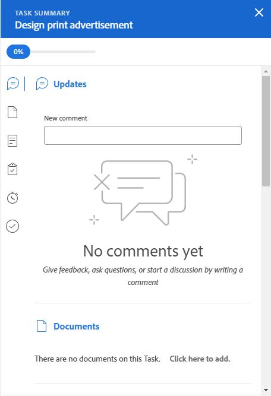

# Aktualisieren von Arbeitselementen im Workload Balancer mithilfe der Zusammenfassung

Sie können das Bedienfeld Zusammenfassung einer Aufgabe oder eines Problems verwenden, um wichtige Informationen für dieses Element zu aktualisieren. im Workload Balancer.

Das Bedienfeld Zusammenfassung ist für Aufgaben und Probleme sowohl im Bereich Zugewiesene als auch Nicht zugewiesene Arbeit des Workload-Balancer verfügbar.

## Zugriffsanforderungen

+++ Erweitern Sie , um die Zugriffsanforderungen für die -Funktion in diesem Artikel anzuzeigen.

Sie müssen über folgenden Zugriff verfügen, um die Schritte in diesem Artikel ausführen zu können:

<table style="table-layout:auto"> 
 <col> 
 <col> 
 <tbody> 
  <tr> 
   <td role="rowheader">Adobe Workfront-Plan</td> 
   <td> 
Beliebig 
 </td> 
  </tr> 
  <tr> 
   <td role="rowheader">Adobe Workfront-Lizenz</td> 
   <td>
Neu: Standard

       
oder

       
Aktuell: Plan, wenn der Workload Balancer im Bereich „Ressourcen“ verwendet wird 
       Arbeit bei Verwendung des Workload Balancer eines Teams oder Projekts
</td>
  </tr>
  <tr> 
   <td role="rowheader">Konfigurationen der Zugriffsebene</td> 
   <td> 
Zugriff auf Folgendes bearbeiten:
 
    <ul> 
     <li>Ressourcenverwaltung</li> 
     <li>Projekte</li> 
     <li>Aufgaben</li> 
     <li>Probleme</li> 
    </ul>
   </td> 
  </tr> 
  <tr> 
   <td role="rowheader">Objektberechtigungen</td> 
   <td>Contribute-Berechtigungen oder höher für die Projekte, Aufgaben und Probleme</td> 
  </tr> 
 </tbody> 
</table>

Weitere Informationen zu den Informationen in dieser Tabelle finden Sie unter [Zugriffsanforderungen in der Dokumentation zu Workfront](/help/quicksilver/administration-and-setup/add-users/access-levels-and-object-permissions/access-level-requirements-in-documentation.md).

+++

## Aktualisieren von Aufgaben und Problemen im Zusammenfassungsbereich des Workload-Balancer

1. Navigieren Sie zum Workload Balancer.

   Der Workload Balancer zeigt Arbeitsauftragsinformationen an, die mit der aktuellen Woche beginnen.

1. Wechseln Sie zum Bereich **Nicht zugeordnete Arbeit** und suchen Sie ein Arbeitselement.

   Oder

   Wechseln Sie zum Bereich **Zugewiesene Arbeit**, erweitern Sie einen Benutzer und suchen Sie ein Arbeitselement.

1. Klicken Sie auf den Balken einer Aufgabe oder eines Problems, um das Bedienfeld Zusammenfassung auf der rechten Seite zu öffnen.

   Oder

   Klicken Sie **das Symbol** Zusammenfassung öffnen und dann auf den Balken einer Aufgabe oder eines Problems, um das Bedienfeld Zusammenfassung zu öffnen.

   Oder

   Klicken Sie auf das **Mehr**-Menü  rechts neben einer Aufgabe oder einem Problem und klicken Sie dann auf **Zusammenfassung öffnen**.

   Das Bedienfeld Zusammenfassung wird auf der rechten Seite geöffnet.

   

1. Ändern Sie eine Reihe von Feldern für das Arbeitselement, geben Sie eine Aktualisierung ein oder gehen Sie von hier zu anderen Bereichen von Workfront, um Dokumente oder andere Informationen zum Arbeitselement hinzuzufügen.

   >[!CAUTION]
   >
   >Durch die Navigation vom Abschnitt Zusammenfassung zum Abschnitt Teilaufgaben zum Hinzufügen von Teilaufgaben wird die ursprüngliche Aufgabe entfernt, da übergeordnete Aufgaben im Workload Balancer nicht angezeigt werden.

   Weitere Informationen zum Aktualisieren von Informationen mithilfe der Zusammenfassung finden Sie unter [Übersicht](../../workfront-basics/the-new-workfront-experience/summary-overview.md).

1. (Bedingt) Wenn Sie einen der Abschnitte des Arbeitselements geöffnet haben, klicken Sie im Browser auf die Schaltfläche **Zurück**, um zum Workload-Balancer zurückzukehren.
1. Klicken Sie auf **Schließen**-Symbol  in der oberen rechten Ecke der Zusammenfassung, um sie zu schließen.
