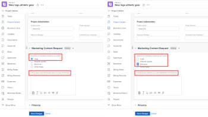

# Hinzufügen einer Anzeigelogik und Überspringen einer Logik zu einem benutzerdefinierten Formular

Sie können intelligente Regeln verwenden, um ein benutzerdefiniertes Formular dynamisch und für die Benutzer relevanter zu gestalten, die es ausfüllen. Wenn ein(e) Benutzende(r) auf eine bestimmte Weise auf ein Feld mit Mehrfachauswahl in einem Formular reagiert, zeigt ihm/ihr eine intelligente Regel basierend auf dieser Antwort an, was als Nächstes zu sehen ist.

Die Feldtypen mit Mehrfachauswahl sind Dropdown, Kontrollkästchen und Optionsfelder.

* **Anzeigelogik**: Sie konfigurieren eine Anzeigelogik-Regel für das Feld, das Widget oder den Abschnitt, die Benutzende erst sehen sollen, nachdem sie eine bestimmte Auswahl in einem vorangehenden Feld mit Mehrfachauswahl ausgewählt haben.

  **Beispiel:** Sie erstellen ein Anfrageformular für Marketing-Inhalte, über das Personen in Ihrem Unternehmen ein neues Logo, eine Aktualisierung der Website, eine Broschüre oder andere Arten von Marketing-Inhalten anfordern können. Je nach Art des Inhalts, den der Benutzer möchte, müssen Sie ihn nach verschiedenen Arten von Details auffordern, z. B. Farben und Design-Ideen, wenn er ein Logo benötigt, oder eine Liste von Produktfunktionen, wenn er eine Broschüre benötigt.

  Auf dem Feld, das Sie nach Farben und Details für ein neues Logo fragt, können Sie eine Anzeigelogik-Regel hinzufügen, die dieses Feld erst anzeigt, nachdem der Benutzer im ersten Feld auf das Optionsfeld Logo geklickt hat.

  Ebenso können Sie auf dem Feld, das nach Produktfunktionen fragt, eine Anzeigelogikregel hinzufügen, die dieses Feld erst anzeigt, nachdem ein Benutzer im ersten Feld auf das Optionsfeld Broschüre geklickt hat.

  

  Sie können Regeln für die Anzeigelogik für benutzerdefinierte Felder, Widgets oder Abschnittsumbrüche konfigurieren, die einem Multiple-Choice-Feld folgen.

* **Logikregel überspringen**: Sie konfigurieren diese Regel so, dass Teile eines Formulars ausgeblendet werden, die der Benutzer nicht benötigt. Wenn Benutzende ein bestimmtes Element in einem vorangehenden Feld mit Mehrfachauswahl auswählen, überspringt die Regel zum Überspringen sie an das Ende des Formulars oder an ein benutzerdefiniertes Feld, Widget oder einen benutzerdefinierten Abschnitt, das bzw. den sie sehen sollen.

  **Beispiel:** Das obige Formular zur Anfrage von Marketing-Inhalten wird verwendet, um nach einem Whitepaper zu fragen, das vom Vertrieb und nicht vom Marketing bereitgestellt wird. Für diesen Benutzer kann eine Regel zum Überspringen der Logik die Frage ausblenden, wobei Details abgefragt und zu einer Textzeile übersprungen werden, die ihn an die benötigte Abteilung verweist.

  

  In diesem Fall können Sie ein beschreibendes Textfeld hinzufügen, das den Benutzer an die Verkaufsabteilung verweist. Im ersten benutzerdefinierten Feld, das fragt, welche Art von Marketing-Inhalt der Benutzer benötigt, können Sie eine Logikregel zum Überspringen hinzufügen, die nur die Textzeile anzeigt, wenn ein Benutzer im ersten Feld auf das Optionsfeld „Whitepaper“ klickt.

  Dies wäre besonders nützlich, wenn Sie viele andere Felder über Logos, Website-Updates und Broschüren hinzufügen würden, die dieser Benutzer nicht sehen muss.
Sie können eine Regel zum Überspringen einer Logik nur auf ein benutzerdefiniertes Feld anwenden, nicht auf ein Widget oder einen Abschnitt.

## Zugriffsanforderungen

Sie müssen über Folgendes verfügen, um die Schritte in diesem Artikel auszuführen:

<table style="table-layout:auto"> 
 <col> 
 <col> 
 <tbody> 
  <tr data-mc-conditions=""> 
   <td role="rowheader"> 
Adobe Workfront-Plan*
 </td> 
   <td>Beliebig</td> 
  </tr> 
  <tr> 
   <td role="rowheader">Adobe Workfront-Lizenz*</td> 
   <td> 
Plan 
 </td> 
  </tr> 
  <tr data-mc-conditions=""> 
   <td role="rowheader">Konfigurationen der Zugriffsebene*</td> 
   <td> 
Administrativer Zugriff auf benutzerdefinierte Formulare
 
Informationen dazu, wie Workfront-Administratoren diesen Zugriff gewähren, finden Sie unter <a href="../../administration-and-setup/add-users/configure-and-grant-access/grant-users-admin-access-certain-areas.md" class="MCXref xref">Gewähren von administrativem Zugriff für Benutzer auf bestimmte Bereiche</a>.
 </td> 
  </tr>  
 </tbody> 
</table>

&#42;Wenden Sie sich an Ihren Workfront-Administrator, um herauszufinden, welchen Plan, Lizenztyp oder welche Zugriffsebenen Sie haben.

## Erstellen eines benutzerdefinierten Beispielformulars mit einer Anzeige- und Überspringen-Logik

Am einfachsten erfahren Sie, wie Sie einem benutzerdefinierten Formular eine Anzeige- und Überspringen-Logik hinzufügen können, indem Sie sich das in den beiden folgenden Abschnitten beschriebene praktische Beispiel ansehen:

* [Anzeigelogik - Praxisbeispiel](#display-logic-practical-example)
* [Logik überspringen - praktisches Beispiel](#skip-logic-practical-example)

### Anzeigelogik - Praxisbeispiel {#display-logic-practical-example}

In diesem Beispiel erstellen Sie ein benutzerdefiniertes Formular mit einem Optionsfeld mit mehreren Auswahlmöglichkeiten. Anschließend fügen Sie eine Anzeigelogik hinzu, die dieses Feld mit einem zweiten Feld verbindet.

1. Klicken Sie auf **Hauptmenü** Symbol  oben rechts in Adobe Workfront und dann auf **Setup** .

1. Wählen Sie im linken Bedienfeld die Option **Benutzerdefinierte Forms** .

1. Klicken Sie auf **Neues benutzerdefiniertes Formular**, wählen Sie **Projekt** in dem angezeigten Feld aus und klicken Sie dann auf **Weiter**.

1. Geben Sie im Textfeld **Formulartitel** den Text **Beispiel für ein benutzerdefiniertes Formular - Anzeigelogik lernen und Logik überspringen** ein, um das Formular zu benennen.

   

1. So fügen Sie das erste Feld zum Formular hinzu:

   1. Öffnen Sie die **Feld hinzufügen**.

      

   1. Wählen Sie **Feldtyp** Optionsschaltflächen) aus und geben Sie dann *Welchen Typ von Marketing-Inhalt benötigen Sie?* als **Beschriftung** für das Feld.

   1. Ersetzen Sie **Wahlen** durch **Wahl 1** und **Wahl 2** durch folgenden Text, um zwei Optionen zu erstellen, die Benutzende im Feld auswählen können:

      *Website-Update*

      *Logo-Design*

1. So fügen Sie das nächste benutzerdefinierte Feld hinzu und fügen eine Anzeigelogikregel hinzu:

   1. Öffnen Sie erneut **Registerkarte** Feld hinzufügen“ und fügen Sie ein neues **Optionsfelder“** hinzu: *Welche Art von Website-Update benötigen Sie?*

      Die Auswahlmöglichkeiten für dieses Feld werden später hinzugefügt.

   1. Wählen **Abschnitt „Zusätzliche**&quot; **Logik hinzufügen** aus.

      

1. Konfigurieren Sie im angezeigten Feld bei geöffneter Registerkarte **Anzeigelogik** das zweite Feld so, dass es nur für Benutzer angezeigt wird, die *Website-Design* im ersten Feld ausgewählt haben:

   1. Wählen Sie im ersten Dropdown-Menü **Welche Art von Marketing-Inhalten benötigen Sie?**
   1. Wählen Sie im zweiten Dropdown-Menü **Website-Design**.
   1. Wählen Sie aus der dritten Dropdown-Liste **Ausgewählt** die Option **Speichern**.

   Beachten Sie die kleinen farbigen Quadrate mit einem D, was anzeigt, dass das zweite Feld mit der Anzeigelogik mit der Auswahl des Benutzers im ersten Feld verbunden ist:

   

1. Wählen Sie **Vorschau**, um sicherzustellen, dass die Logik so funktioniert, wie Sie es für das Formular wünschen, und wählen Sie dann **Vorschau beenden**.

1. Klicken Sie **Speichern + Schließen** speichern Sie das Formular und fahren Sie dann [Logik überspringen - praktisches Beispiel](#skip-logic-practical-example) fort.

### Logik überspringen - praktisches Beispiel {#skip-logic-practical-example}

Logik überspringen funktioniert ähnlich wie Anzeigelogik, fungiert jedoch als Umkehrung: Anstatt bestimmte benutzerdefinierte Felder mit Mehrfachauswahl basierend auf früheren Benutzerauswahlen anzuzeigen, legen Sie fest, welche ausgeblendet (übersprungen) werden sollen, da sie für den Benutzer nicht relevant sind.

Um mehr darüber zu erfahren, arbeiten Sie weiter an dem benutzerdefinierten Beispielformular, das Sie im Abschnitt [Anzeigelogik - praktisches Beispiel](#display-logic-practical-example) in diesem Artikel erstellt haben.

1. Klicken Sie auf **Hauptmenü** Symbol  oben rechts in Adobe Workfront und dann auf **Setup** .

1. Klicken Sie **Benutzerdefinierte Forms**.
1. Klicken Sie auf den Namen des Formulars **Benutzerdefiniertes Beispielformular - Anzeigelogik lernen und Logik überspringen** das Sie in den obigen Schritten erstellt haben, um es zur Bearbeitung zu öffnen.
1. Wählen Sie das von Ihnen erstellte Dropdown-Feld *Welche Art von Website benötigen Sie?Fügen Sie* die folgenden Optionen für das Feld hinzu und klicken Sie dann auf **Übernehmen**:

   *E-Commerce*

   *Broschüre*

   *Mitgliedschaft*

1. Öffnen Sie die Registerkarte **Feld hinzufügen** und erstellen Sie ein Feld **Textfeld mit Formatierung** mit dem Namen *Was ist das Ziel der Website?* und klicken Sie dann auf **Übernehmen**.

   In dieser Organisation wird eine Dokumentations-Site für Hilfe vom technischen Redaktionsteam und nicht von der Marketing-Abteilung erstellt. Von einem Benutzer, der im zweiten Feld Hilfedokumentation auswählt, sind also keine weiteren Informationen erforderlich. Wir erstellen eine Textzeile (ein beschreibendes Textfeld), in der der Benutzer aufgefordert wird, stattdessen das Team für technische Texte zu sehen. Und wir verwenden eine Regel vom Typ Logik überspringen , die diesen Benutzer zu dieser Textzeile überspringt.

1. So erstellen Sie die Textzeile:

   1. Öffnen Sie die **Feld hinzufügen** und erstellen Sie ein **beschreibendes Textfeld**.

   1. Geben Sie für **label** den Wert *Siehe Team für technische Dokumentation* ein.

   1. Geben Sie als **beschreibenden Text** ein *Bitte wenden Sie sich an das technische Schreib-Team zum Erstellen der Online-Hilfedokumentation*.

   1. Wählen Sie **Anwenden** aus.

1. So erstellen Sie die Regel zum Überspringen einer Logik:

   1. Wählen Sie das zweite Dropdown-Feld *Welche Art von Website benötigen Sie?*
   1. Wählen Sie **Abschnitt** Zusätzliche Einstellungen“ **Logik bearbeiten**.
   1. Öffnen Sie in dem angezeigten Feld die Registerkarte **Logik überspringen**.
   1. Legen Sie die erste Dropdown-Liste auf **Hilfedokumentation** fest, lassen Sie die zweite Dropdown-Liste auf **Ausgewählt** und legen Sie die dritte Dropdown-Liste auf **Siehe das Team für technische Texte** fest.
   1. Wählen Sie **Speichern** aus.

   Beachten Sie die kleine Überspringungslogik, die mit einem S quadriert ist, was anzeigt, dass der Benutzer etwas überspringt, nachdem er eine bestimmte Auswahl im zweiten Feld ausgewählt hat.

   

1. Klicken Sie auf **Vorschau**  um sicherzustellen, dass die Logik Ihren Vorstellungen entspricht.
1. Klicken Sie **Speichern +Schließen**.

Bei der Erstellung eines solchen Formulars können Sie weitere Textfelder hinzufügen, um Benutzer zur Eingabe von Informationen aufzufordern, die im zweiten Feld E-Commerce oder Broschüre auswählen. In diesen Feldern kann u. a. nachgefragt werden, wer die Zielgruppe der Website ist, welches Ziel mit der Erstellung der Website verfolgt wird und welches Budget zur Verfügung steht.

Und mit logischen Regeln könnten Sie verzweigende Fragepfade erstellen.

Für Benutzende, die sich für E-Commerce entscheiden, können Sie beispielsweise Felder erstellen, in denen Fragen zu Produktfotos, Beschreibungen, Preisen und Zahlungsoptionen gestellt werden. Für Benutzer, die die Option Broschüre auswählen, können Sie Felder erstellen, in denen nach Inhalten gefragt wird.

Benutzende, die die Hilfedokumentation ausgewählt haben, werden niemals diese zusätzlichen Felder sehen, die für sie irrelevant sind.

>[!TIP]
>
>Sie können sowohl Anzeigelogik als auch Überspringen-Logik zu einem benutzerdefinierten Feld hinzufügen, wenn Folgendes für das Feld zutrifft:
>
>* Es handelt sich um ein Feld mit Mehrfachauswahl (Optionsfelder, Dropdown oder Kontrollkästchen)
>* Ihm geht ein Multiple-Choice-Feld voran
>* Darauf folgt ein weiteres benutzerdefiniertes Feld
>

<!--
<h2 data-mc-conditions="QuicksilverOrClassic.Draft mode">Multi-field display logic statements</h2>
-->

