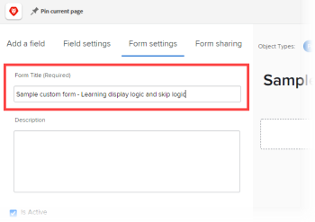

# Anzeigenlogik hinzufügen und Logik zu einem benutzerdefinierten Formular überspringen

Sie können Smart-Regeln verwenden, um ein benutzerdefiniertes Formular dynamischer und für die Benutzer relevanter zu machen, die es ausfüllen. Wenn ein Benutzer auf eine bestimmte Weise auf ein Multiple-Choice-Feld in einem Formular antwortet, zeigt eine Smart-Regel ihm, was er als Nächstes sehen soll, basierend auf dieser Antwort.

Die Feldtypen mit Mehrfachauswahl sind Dropdown, Kontrollkästchen und Optionsfelder.

* **Anzeigelogik**: Sie konfigurieren eine Logikregel zur Anzeige für das Feld, Widget oder den Abschnitt, das bzw. den der Benutzer erst sehen soll, nachdem er in einem vorherigen Multiple-Choice-Feld eine bestimmte Auswahl ausgewählt hat.

   **Beispiel:** Sie erstellen ein Formular für die Anforderung von Marketing-Inhalten, in dem Personen in Ihrem Unternehmen ein neues Logo, eine Website-Aktualisierung, eine Broschüre oder andere Arten von Marketing-Inhalten anfordern können. Je nach Art des Inhalts, den der Benutzer benötigt, müssen Sie ihn auffordern, verschiedene Arten von Details anzuzeigen, z. B. Farben und Design-Ideen, wenn er ein Logo benötigt, oder eine Liste von Produktfunktionen, wenn er eine Broschüre benötigt.

   Im Feld mit der Frage zu Farben und Details für ein neues Logo können Sie eine Logikregel hinzufügen, die dieses Feld nur anzeigt, wenn der Benutzer im ersten Feld das Optionsfeld Logo auswählt.

   Ebenso können Sie im Feld mit der Frage zu Produktfunktionen eine Logikregel hinzufügen, die dieses Feld nur anzeigt, nachdem ein Benutzer im ersten Feld das Optionsfeld &quot;Broschüre&quot;ausgewählt hat.

   

   Sie können Logikregeln für benutzerdefinierte Felder, Widgets oder Abschnittsumbrüche konfigurieren, die einem Multiple-Choice-Feld folgen.

* **Logikregel überspringen**: Sie konfigurieren diese Regel, um Teile eines Formulars auszublenden, die der Benutzer nicht benötigt. Wenn der Benutzer ein bestimmtes Element in einem vorherigen Multiple-Choice-Feld auswählt, überspringt die Logikregel diese an das Ende des Formulars oder an ein benutzerdefiniertes Feld, Widget oder einen Abschnitt, das bzw. den sie sehen sollen.

   **Beispiel:** Jemand verwendet das obige Formular zur Anforderung von Marketing-Inhalten, um nach einem Whitepaper zu fragen, das vom Vertrieb und nicht vom Marketing bereitgestellt wird. Für diesen Benutzer kann eine Logikregel zum Überspringen die Frage ausblenden, in der zur Eingabe von Details aufgefordert wird, und zu einer Textzeile überspringen, in der sie auf die benötigte Abteilung verweisen.

   

   In diesem Fall können Sie ein Feld mit beschreibendem Text hinzufügen, das den Benutzer zur Vertriebsabteilung weiterleitet. Im ersten benutzerdefinierten Feld, das fragt, welchen Marketing-Inhaltstyp der Benutzer benötigt, können Sie eine Logikregel zum Überspringen hinzufügen, die nur die Textzeile anzeigt, wenn der Benutzer im ersten Feld das Optionsfeld &quot;Weißbuch&quot;auswählt.

   Dies wäre besonders nützlich, wenn Sie viele weitere Felder zu Logos, Website-Updates und Broschüren hinzufügen, die dieser Benutzer nicht sehen muss.
Sie können eine Logikregel zum Überspringen nur auf ein benutzerdefiniertes Feld anwenden, nicht auf ein Widget oder einen Abschnitt.

Informationen zu benutzerdefinierten Feldern und Widgets in benutzerdefinierten Formularen finden Sie unter [Benutzerdefiniertes Feld zu einem benutzerdefinierten Formular hinzufügen](../../administration-and-setup/customize-workfront/create-manage-custom-forms/add-a-custom-field-to-a-custom-form.md) und [Hinzufügen oder Bearbeiten eines Asset-Widgets in einem benutzerdefinierten Formular](../../administration-and-setup/customize-workfront/create-manage-custom-forms/add-widget-or-edit-its-properties-in-a-custom-form.md).

## Zugriffsanforderungen

Sie müssen über Folgendes verfügen, um die Schritte in diesem Artikel durchzuführen:

<table style="table-layout:auto"> 
 <col> 
 <col> 
 <tbody> 
  <tr data-mc-conditions=""> 
   <td role="rowheader"> 
Adobe Workfront-Plan*
 </td> 
   <td>Beliebig</td> 
  </tr> 
  <tr> 
   <td role="rowheader">Adobe Workfront-Lizenz*</td> 
   <td> 
Plan 
 </td> 
  </tr> 
  <tr data-mc-conditions=""> 
   <td role="rowheader">Konfigurationen auf Zugriffsebene*</td> 
   <td> 
Administratorzugriff auf benutzerdefinierte Formulare
 
Informationen dazu, wie Workfront-Administratoren diesen Zugriff gewähren, finden Sie unter <a href="../../administration-and-setup/add-users/configure-and-grant-access/grant-users-admin-access-certain-areas.md" class="MCXref xref">Benutzern administrativen Zugriff auf bestimmte Bereiche gewähren</a>.
 </td> 
  </tr>  
 </tbody> 
</table>

&#42;Wenden Sie sich an Ihren Workfront-Administrator, um zu erfahren, welche Konfigurationen für Plan, Lizenztyp oder Zugriffsstufe Sie verwenden.

## Erstellen eines benutzerdefinierten Beispielformulars mit Anzeige- und Übersprunglogik

Am besten erfahren Sie, wie Sie einem benutzerdefinierten Formular eine Anzeige- und Auslassungslogik hinzufügen, indem Sie das praktische Beispiel lesen, das in den beiden folgenden Abschnitten erläutert wird:

* [Logik anzeigen - praktisches Beispiel](#display-logic-practical-example)
* [Logik überspringen - praktisches Beispiel](#skip-logic-practical-example)

### Logik anzeigen - praktisches Beispiel {#display-logic-practical-example}

In diesem Beispiel erstellen Sie ein benutzerdefiniertes Formular mit einem Optionsfeld mit Mehrfachauswahl. Anschließend fügen Sie eine Anzeigereihenfolge hinzu, die dieses Feld mit einem zweiten Feld verbindet.

1. Klicken Sie auf **Hauptmenü** icon  Klicken Sie oben rechts in Adobe Workfront auf **Einrichtung** .

1. Wählen Sie im linken Bereich die Option **Benutzerdefinierte Forms** .

1. Klicken **Neues benutzerdefiniertes Formular** auswählen **Projekt** in dem angezeigten Feld und wählen Sie **Weiter**.

1. Im **Formulartitel** Textfeld, Typ **Beispiel für ein benutzerdefiniertes Formular - Erlernen der Anzeigenlogik und Logik überspringen** , um das Formular zu benennen.

   

1. So fügen Sie das erste Feld zum Formular hinzu:

   1. Öffnen Sie die **Feld hinzufügen** Registerkarte.

      

   1. Wählen Sie die **Optionsfelder** Feldtyp und geben Sie *Welche Art von Marketing-Inhalten benötigen Sie?* als **Titel** für das Feld.

   1. under **Auswahlmöglichkeiten**, ersetzen **Wahl 1** und **Wahl 2** mit dem folgenden Text, um zwei Optionen zu erstellen, die Benutzer im Feld auswählen können:

      *Website-Update*

      *Logo-Design*

1. Fügen Sie das nächste benutzerdefinierte Feld hinzu und fügen Sie ihm eine Logikregel zur Anzeige hinzu:

   1. Öffnen Sie die **Feld hinzufügen** erneut ein und fügen Sie eine neue **Optionsfelder** Feld namens *Welche Art von Website-Update benötigen Sie?*

      Wir werden die Optionen für dieses Feld später hinzufügen.

   1. Im **Zusätzliche Einstellungen** Bereich, wählen Sie **Logik hinzufügen**.

      

1. In dem sich öffnenden Feld wird mit dem **Anzeigelogik** öffnen, konfigurieren Sie das zweite Feld so, dass es nur für die ausgewählten Benutzer angezeigt wird *Website-Design* im ersten Feld:

   1. Wählen Sie im ersten Dropdown-Menü **Welche Art von Marketing-Inhalten benötigen Sie?**
   1. Wählen Sie im zweiten Dropdown-Menü **Website-Design**.
   1. Lassen Sie die dritte Dropdown-Liste auf **Ausgewählt** auswählen **Speichern**.

   Beachten Sie die kleinen farbigen Quadrate mit einem &quot;D&quot;, was bedeutet, dass das zweite Feld mit der Anzeigerlogik mit der Auswahl des Benutzers im ersten Feld verbunden ist:

   

1. Auswählen **Vorschau** , um sicherzustellen, dass die Logik auf die gewünschte Weise im Formular funktioniert, wählen Sie **Endvorschau**.

1. Klicken **Speichern und schließen** Speichern Sie das Formular und fahren Sie dann mit [Logik überspringen - praktisches Beispiel](#skip-logic-practical-example) unten.

### Logik überspringen - praktisches Beispiel {#skip-logic-practical-example}

Die Logik zum Überspringen funktioniert ähnlich wie die Anzeigelogik, fungiert jedoch als umgekehrt: Anstatt bestimmte benutzerdefinierte Multiple-Choice-Felder basierend auf früheren Benutzerauswahlen anzuzeigen, legen Sie fest, welche ausgeblendet (übersprungen) werden sollen, da sie für den Benutzer nicht relevant sind.

Um mehr darüber zu erfahren, fahren Sie mit der Arbeit an dem benutzerdefinierten Beispielformular fort, das Sie im Abschnitt erstellt haben [Logik anzeigen - praktisches Beispiel](#display-logic-practical-example) in diesem Artikel.

1. Klicken Sie auf **Hauptmenü** icon  Klicken Sie oben rechts in Adobe Workfront auf **Einrichtung** .

1. Klicken **Benutzerdefinierte Forms**.
1. Klicken Sie auf den Namen des Formulars **Beispiel für ein benutzerdefiniertes Formular - Erlernen der Anzeigenlogik und Logik überspringen** die Sie in den obigen Schritten erstellt haben, um sie zur Bearbeitung zu öffnen.
1. Wählen Sie das von Ihnen erstellte Dropdown-Feld namens *Was für eine Website brauchst du?*, fügen Sie die folgenden Auswahlmöglichkeiten für das Feld hinzu und klicken Sie auf **Anwenden**:

   *E-Commerce*

   *Broschüre*

   *Mitgliedschaft*

1. Öffnen Sie die **Feld hinzufügen** erstellen Sie ein &quot;Textfeld mit Formatierung&quot;-Feld namens *Was ist das Ziel der Website?* Klicken Sie auf **Anwenden**.

   In dieser Organisation wird eine Hilfe-Dokumentations-Website vom technischen Team und nicht von der Marketing-Abteilung erstellt. Daher sind keine weiteren Informationen von einem Benutzer erforderlich, der im zweiten Feld die Hilfedokumentation auswählt. Wir werden eine Textzeile (ein beschreibendes Textfeld) erstellen, die sie auffordert, stattdessen das Team für die technische Erstellung anzuzeigen. Und wir verwenden eine Logikregel zum Überspringen, die diesen Benutzer zu dieser Textzeile überspringt.

1. So erstellen Sie die Textzeile:

   1. Öffnen Sie die **Feld hinzufügen** und erstellen Sie eine **Beschreibende Textfelder**.

   1. Für **Titel**, Typ *Siehe Technical Writing-Team*.

   1. Für **Beschreibender Text**, Typ *Weitere Informationen zum Erstellen der Onlinehilfe finden Sie im Technical-Writing-Team .*.

   1. Auswählen **Anwenden**.

1. So erstellen Sie die Logikregel zum Überspringen:

   1. Wählen Sie das zweite Dropdown-Feld aus. *Was für eine Website brauchst du?*
   1. Im **Zusätzliche Einstellung** s -Abschnitt, wählen Sie **Logik bearbeiten**.
   1. Öffnen Sie in dem angezeigten Feld die **Logik überspringen** Registerkarte.
   1. Setzen Sie das erste Dropdown-Menü auf **Hilfedokumentation**, lassen Sie die zweite Dropdown-Liste auf **Ausgewählt** und setzen Sie die dritte Dropdown-Liste auf **Weitere Informationen finden Sie im Technical-Writing-Team**.
   1. Auswählen **Speichern**.

   Beachten Sie, dass die kleine Logik zum Überspringen mit einem S quadriert ist, was bedeutet, dass der Benutzer etwas überspringt, nachdem er im zweiten Feld eine bestimmte Auswahl ausgewählt hat.

   

1. Klicken **Vorschau**  , um sicherzustellen, dass die Logik die gewünschte Anwendung findet.
1. Klicken **Speichern +Schließen**.

Wenn Sie ein Formular wie dieses erstellen, können Sie weitere Textfelder hinzufügen, um Benutzer aufzufordern, die E-Commerce oder Broschüre im zweiten Feld auswählen. Diese Felder könnten fragen, wer die Zielgruppe für die Website ist, was das Ziel für ihre Erstellung ist, was das Budget ist und so weiter.

Und mit Logikregeln können Sie verzweigte Fragepfade erstellen.

Für Benutzer, die E-Commerce auswählen, können Sie beispielsweise Felder erstellen, in denen Fragen zu Produktfotos, Beschreibungen, Preisen und Zahlungsoptionen gestellt werden. Für Benutzer, die &quot;Broschüre&quot;auswählen, können Sie Felder erstellen, die nach Inhalten fragen.

Benutzer, die die Hilfedokumentation ausgewählt haben, sehen nie diese zusätzlichen Felder, die für sie irrelevant sind.

>[!TIP]
>
>Sie können sowohl die Anzeigelogik als auch die Logik zu einem benutzerdefinierten Feld hinzufügen, wenn Folgendes in Bezug auf das Feld zutrifft:
>
>* Es handelt sich um ein Multiple-Choice-Feld (Optionsfelder, Dropdown-Listen oder Kontrollkästchen).
>* Dem Feld wird ein Multiple-Choice-Feld vorangestellt
>* Danach folgt ein weiteres benutzerdefiniertes Feld
>

<!--
<h2 data-mc-conditions="QuicksilverOrClassic.Draft mode">Multi-field display logic statements</h2>
-->

