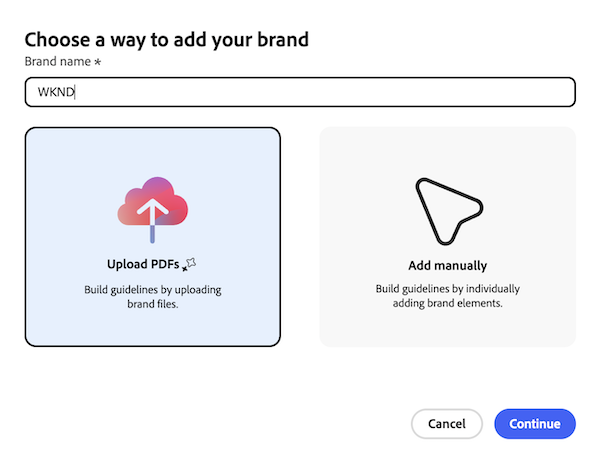

# Erstellen und Verwalten von Marken für Inhaltsvalidierer

{{highlighted-preview-article-level}}

Der Content Reviewer verwendet Markenrichtlinien, um Inhalte während des Überprüfungsprozesses zu bewerten. Sie können in Workfront Marken erstellen, indem Sie PDF-Dateien mit Ihren Markenrichtlinien hochladen oder manuell Markenelemente eingeben.

## Zugriffsanforderungen

+++ Erweitern, um die Zugriffsanforderungen für die in diesem Artikel beschriebene Funktionalität anzuzeigen.

<table style="table-layout:auto"> 
 <col> 
 <col> 
 <tbody> 
  <tr> 
   <td role="rowheader">Adobe Workfront-Paket</td> 
   <td> 
Beliebig
 </td> 
  </tr> 
  <tr> 
   <td role="rowheader">Adobe Workfront-Lizenz</td> 
   <td> 
Standard
 </td> 
  </tr> 
  <tr> 
   <td role="rowheader">Konfigurationen der Zugriffsebene</td> 
   <td> 
Sie müssen Systemadministrator sein.
</td> 
  </tr> 
  <tr> 
   <td role="rowheader">Berechtigungen für Admin Console*</td> 
   <td> 
Sie müssen ein GenStudio Brand Manager sein.

   </td> 
  </tr> 
 </tbody> 
</table>

Weitere Details zu den Informationen in dieser Tabelle finden Sie unter [Zugriffsanforderungen in der Dokumentation zu Workfront](/help/quicksilver/administration-and-setup/add-users/access-levels-and-object-permissions/access-level-requirements-in-documentation.md).

+++

## Anforderungen

* Für Ihre Workfront-Instanz müssen einheitliche Genehmigungen aktiviert sein.

* Ihr Unternehmen muss über GenStudio Foundation verfügen.
   * Content Reviewer in Workfront bietet die in GenStudio Foundation verfügbaren Funktionen für Asset-Prüfungs- und Genehmigungs-Workflows. Sie müssen nicht direkt auf GenStudio Foundation zugreifen, um Ihre Arbeit abzuschließen. Ihr Zugriff auf GenStudio Foundation-Funktionen über Content Reviewer fällt unter die Bedingungen Ihres Workfront-Vertrags.
* Adobe muss eine unterzeichnete Adobe Gen AI-Vereinbarung in der Datei haben.
Weitere Informationen zur Unterzeichnung des Abkommens finden Sie unter [Unterzeichnung des Adobe Gen AI-Abkommens](/help/quicksilver/workfront-basics/ai-assistant/ai-assistant-overview.md#sign-the-adobe-gen-ai-agreement).

## Voraussetzungen

1. Sie müssen Zugriff auf Markenberechtigungen auf den Zugriffsebenen von Admin Console und Workfront gewähren, bevor Sie Marken erstellen können. Anweisungen finden Sie unter [Zugriff auf Markenberechtigungen gewähren](/help/quicksilver/administration-and-setup/add-users/configure-and-grant-access/grant-access-brands.md).

## Erstellen einer Marke mit einer PDF

{{step-1-to-setup}}

1. Navigieren Sie im linken Bereich zu **Überprüfen und**) > **Marken**.
1. Klicken **oben rechts** Bildschirm auf „Marke hinzufügen“.
1. Benennen Sie die Marke.
1. Klicken Sie auf **PDF hochladen**, um Markendateien hochzuladen.
   
1. Klicken Sie auf **Fortfahren**.
1. Laden Sie eine oder mehrere PDF-Dateien hoch, die Ihre Markenrichtlinien enthalten, und klicken Sie dann auf **Marke hinzufügen**.
1. Überprüfen Sie nach dem Hochladen der Dateien die extrahierten Markenelemente, um sicherzustellen, dass sie mit Ihren Markenrichtlinien übereinstimmen.

   >[!IMPORTANT]
   >
   >Richtlinien werden mithilfe Ihrer -Dateien und der Technologie der generativen KI generiert und können ungenau sein. Lesen Sie die extrahierten Richtlinien auf fehlende oder falsche Details und bearbeiten Sie sie, bevor Sie diese Marke veröffentlichen.

1. Klicken Sie abschließend auf **Veröffentlichen**, um die Marke für den Inhaltsvalidierer verfügbar zu machen.

## Manuelles Erstellen einer Marke

{{step-1-to-setup}}

1. Navigieren Sie im linken Bereich zu **Überprüfen und**) > **Marken**.
1. Klicken **oben rechts** Bildschirm auf „Marke hinzufügen“.
1. Benennen Sie die Marke.
1. Klicken Sie **Manuell hinzufügen**, um eine Marke mit einzelnen Elementen zu erstellen.
1. Füllen Sie die Markendetails nach Bedarf aus. Sie können die folgenden Elemente hinzufügen:

   <table>
    <tr>
        <td>Verwendungszeitpunkt</td>
        <td>Informieren Sie die Marketing-Fachleute darüber, wann diese Marke verwendet werden sollte.</td>
    </tr>
    <tr>
        <td>Sprachrichtlinien</td>
        <td>Geben Sie Anleitungen zu Ton und Stil der Markenstimme.</td>
    </tr>
    <tr>
        <td>Bildrichtlinien</td>
        <td>Geben Sie die Arten von Bildern an, die mit der Identität der Marke übereinstimmen.</td>
    </tr>
    <tr>
        <td>Kanalrichtlinien</td>
        <td>Beschreiben Sie die geeigneten Kanäle für die Markenkommunikation.</td>
    </tr>
    <tr>
        <td>Logos</td>
        <td>Fügen Sie die offiziellen Logos der Marke hinzu.</td>
    </tr>
    <tr>
        <td>Farben</td>
        <td>Geben Sie die Farbpalette der Marke an.</td>
    </tr>
    </table>

   

1. Klicken Sie abschließend auf **Veröffentlichen**, um die Marke für den Inhaltsvalidierer verfügbar zu machen.

## Best Practices für das Schreiben von Markenrichtlinien

*  Schreiben Sie Markenrichtlinien, die messbare Kriterien beschreiben. Der Content Reviewer bewertet Inhalte wörtlich, sodass objektive Regeln konsistentere Ergebnisse liefern als subjektive.

* Suchen Sie in Ihren Richtlinien nach Wörtern wie „vermeiden“, „beibehalten“ oder „sicherstellen“. Diese signalisieren oft eine Regel, die man verschärfen kann. Ersetzen Sie die vage Anweisung durch eine bestimmte Liste von Wörtern, Formaten oder Beschränkungen. Ersetzen Sie zum Beispiel „Vermeiden Sie gängige Skiklischees“ durch „Verwenden Sie nicht „Gnar“, „Pow“ oder „Shred“.“

* Wenn Sie die Subjektivität nicht entfernen können, schränken Sie sie ein. Ersetzen Sie allgemeine Adjektive durch spezifische Einschränkungen. Zum Beispiel wird „Direkt und handlungsorientiert“ zu „Direkt und handlungsorientiert; weglassen von Füllwörtern und Hedging-Sprache.“