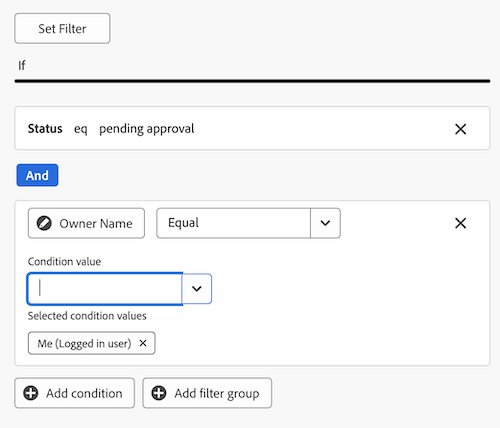

# Erstellen eines Berichts-Dashboards zur Überprüfung und Genehmigung

Sie können im Bereich der Arbeitsflächen-Dashboards ein Berichts-Dashboard erstellen, um sowohl allgemeine als auch detaillierte Informationen zu Überprüfungen und Genehmigungen mit der Funktion „Einheitliche Genehmigungen“ anzuzeigen.

>[!IMPORTANT]
>
>Diese Funktion ist nur für Kunden verfügbar, die den Service „Einheitliche Genehmigungen“ verwenden und in der Beta-Version der Arbeitsflächen-Dashboards registriert sind. Weitere Informationen finden Sie unter [Beta-Informationen zu Canvas-Dashboards](/help/quicksilver/product-announcements/betas/canvas-dashboards-beta/canvas-dashboards-beta-information.md).

## Dashboard erstellen

{{step1-to-dashboards}}

1. Klicken Sie im linken Bedienfeld auf **Arbeitsflächen-Dashboards**.
1. Klicken Sie auf **Neues Dashboard**.
1. Benennen Sie Ihr Dashboard.
1. (Optional) Fügen Sie eine Beschreibung hinzu.
1. Klicken Sie auf **Erstellen**.
   

Nachdem Sie ein Dashboard erstellt haben, können Sie mit dem Hinzufügen von KPIs, Diagrammen und Tabellen beginnen. Weitere Informationen finden Sie in den folgenden Abschnitten:

* [Hinzufügen von allgemeinen Prüf- und Genehmigungsinformationen mit KPIs und Diagrammen](#add-high-level-review-and-approval-information-with-kpis-and-charts)
* [Hinzufügen detaillierter Prüf- und Genehmigungsinformationen mit Tabellen](#add-detailed-review-and-approval-information-with-tables)

## Hinzufügen von allgemeinen Prüf- und Genehmigungsinformationen mit KPIs und Diagrammen

Sie können allgemeine Informationen zu Dokumentgenehmigungen mit KPIs und Diagrammen anzeigen.

Weitere Informationen finden Sie unter [Erstellen eines KPI-](/help/quicksilver/reports-and-dashboards/canvas-dashboards/add-reports/build-kpi-report.md) und [Erstellen eines Diagrammberichts](/help/quicksilver/reports-and-dashboards/canvas-dashboards/add-reports/build-chart-report.md).

### KPIs

#### Ausstehende Genehmigungen

1. [Erstellen Sie ein ](#create-a-dashboard), wie im obigen Abschnitt beschrieben.
1. Klicken Sie oben rechts auf der Detailseite des Dashboards auf **Bericht hinzufügen**.

1. Wählen Sie im **Bericht hinzufügen** die Option **Bericht erstellen** aus.

1. Wählen Sie auf der linken Seite &quot;**&quot;**.

1. Klicken Sie oben rechts auf **Bericht erstellen**.

1. Gehen Sie wie folgt vor, um den Abschnitt **Details** zu konfigurieren:

   1. Geben Sie *Ausstehend* in das Feld **Name** ein.
   1. Geben Sie *Feld* Beschreibung **„Ausstehende Genehmigungen** ein. Wird als Beschriftung unterhalb des KPI-Werts angezeigt.

1. Gehen Sie wie folgt vor, um den Abschnitt **KPI erstellen** zu konfigurieren:

   1. Klicken Sie im linken Bedienfeld auf das Symbol **KPI erstellen** .

   1. Klicken Sie **Feld auswählen**.

   1. Suchen Sie den Ordner **Dokumentengenehmigung** und wählen Sie ihn aus.

   1. Wählen Sie **Status** aus.

   1. Wählen **in der Dropdown** Liste Aggregationstyp die Option **Anzahl** aus.

1. Gehen Sie wie folgt vor, um den Abschnitt **Filter** zu konfigurieren:

   1. Klicken Sie im linken Bedienfeld auf das Symbol **Filter** .

   1. Wählen Sie **Filter bearbeiten** aus.

   1. Klicken Sie **Bedingung hinzufügen**.

   1. Klicken Sie in den leeren Bedingungsfilter, klicken Sie auf **Feld auswählen** und wählen Sie dann **Status** aus.
   1. Belassen Sie den Operator **Gleich** und geben Sie dann _Überprüfung ausstehend_ in das Textfeld ein.

      
1. Klicken **oben** auf dem Bildschirm auf „Speichern“.

#### Überfällige Genehmigungen

1. [Erstellen Sie ein ](#create-a-dashboard), wie im obigen Abschnitt beschrieben.
1. Klicken Sie oben rechts auf der Detailseite des Dashboards auf **Bericht hinzufügen**.

1. Wählen Sie im **Bericht hinzufügen** die Option **Bericht erstellen** aus.

1. Wählen Sie auf der linken Seite &quot;**&quot;**.

1. Klicken Sie oben rechts auf **Bericht erstellen**.

1. Gehen Sie wie folgt vor, um den Abschnitt **Details** zu konfigurieren:

   1. Geben Sie _Überfällig_ in das Feld **Name** ein.
   1. Geben Sie _Feld_ Beschreibung **„Genehmigungsphase**&quot; ein. Diese Beschreibung wird als Beschriftung unter dem KPI-Wert angezeigt.

1. Gehen Sie wie folgt vor, um den Abschnitt **KPI erstellen** zu konfigurieren:

   1. Klicken Sie im linken Bedienfeld auf das Symbol **KPI erstellen** .

   1. Klicken Sie **Feld auswählen**.

   1. Suchen Sie den Ordner **Dokumentengenehmigung** und wählen Sie ihn aus.

   1. Wählen Sie **Status** aus.

   1. Wählen **in der Dropdown** Liste Aggregationstyp die Option **Anzahl** aus.

1. Gehen Sie wie folgt vor, um den Abschnitt **Filter** zu konfigurieren:

   1. Klicken Sie im linken Bedienfeld auf das Symbol **Filter** .

   1. Wählen Sie **Filter bearbeiten** aus.

   1. Klicken Sie **Bedingung hinzufügen**.

   1. Klicken Sie auf den leeren Bedingungsfilter und dann auf **Feld auswählen**.

   1. Wählen Sie **Genehmigungsphase** > **Frist** aus.
   1. Ändern Sie den Operator in **Kleiner als**.
   1. Schalten Sie **Relatives Datum festlegen** auf **EIN** und geben Sie dann _$$TODAY_ in das Textfeld ein.

      
   1. Klicken Sie **Bedingung hinzufügen**.
   1. Klicken Sie auf den leeren Bedingungsfilter und dann auf **Feld auswählen**.
   1. Wählen Sie **Status** aus.
   1. Ändern Sie den Operator in **Nicht enthält** und geben Sie dann _Genehmigt_ in das Textfeld ein.

      
1. Klicken **oben** auf dem Bildschirm auf „Speichern“.

#### Abgeschlossene Genehmigungen

1. [Erstellen Sie ein ](#create-a-dashboard), wie im obigen Abschnitt beschrieben.
1. Klicken Sie oben rechts auf der Detailseite des Dashboards auf **Bericht hinzufügen**.

1. Wählen Sie im **Bericht hinzufügen** die Option **Bericht erstellen** aus.

1. Wählen Sie auf der linken Seite &quot;**&quot;**.

1. Klicken Sie oben rechts auf **Bericht erstellen**.

1. Gehen Sie wie folgt vor, um den Abschnitt **Details** zu konfigurieren:

   1. Geben Sie _Feld_ Name **den Wert** Completed“ ein.
   1. Geben Sie _Feld_ Beschreibung **„Anzahl** Validierungsstatus“ ein. Diese Beschreibung wird als Beschriftung unter dem KPI-Wert angezeigt.

1. Gehen Sie wie folgt vor, um den Abschnitt **KPI erstellen** zu konfigurieren:

   1. Klicken Sie im linken Bedienfeld auf das Symbol **KPI erstellen** .

   1. Klicken Sie **Feld auswählen**.

   1. Suchen Sie den Ordner **Dokumentengenehmigung** und wählen Sie ihn aus.

   1. Wählen Sie **Status** aus.

   1. Wählen **in der Dropdown** Liste Aggregationstyp die Option **Anzahl** aus.

1. Gehen Sie wie folgt vor, um den Abschnitt **Filter** zu konfigurieren:

   1. Klicken Sie im linken Bedienfeld auf das Symbol **Filter** .

   1. Wählen Sie **Filter bearbeiten** aus.

   1. Klicken Sie **Bedingung hinzufügen**.

   1. Klicken Sie auf den leeren Bedingungsfilter und dann auf **Feld auswählen**.

   1. Wählen Sie **Status** aus.

   1. Ändern Sie den Operator in **Enthält** und geben Sie _Genehmigt_ in das Textfeld ein.

      
   1. Klicken Sie **Bedingung hinzufügen**.
   1. Klicken Sie auf **Und**, um sie in **Oder** zu ändern.
   1. Klicken Sie auf den leeren Bedingungsfilter und dann auf **Feld auswählen**.
   1. Wählen Sie **Status** aus.
   1. Ändern Sie den Operator in **Gleich** und geben Sie _Überprüft_ in das Textfeld ein.

      
1. Klicken **oben** auf dem Bildschirm auf „Speichern“.

#### Abgebrochene Genehmigungen

1. [Erstellen Sie ein ](#create-a-dashboard), wie im obigen Abschnitt beschrieben.
1. Klicken Sie oben rechts auf der Detailseite des Dashboards auf **Bericht hinzufügen**.

1. Wählen Sie im **Bericht hinzufügen** die Option **Bericht erstellen** aus.

1. Wählen Sie auf der linken Seite &quot;**&quot;**.

1. Klicken Sie oben rechts auf **Bericht erstellen**.

1. Gehen Sie wie folgt vor, um den Abschnitt **Details** zu konfigurieren:

   1. Geben Sie _Abgebrochen_ in das Feld **Name** ein.
   1. Typ _Genehmigungsfrist von mehr als 2 Wochen_ im Feld **Beschreibung**. Diese Beschreibung wird als Beschriftung unter dem KPI-Wert angezeigt.

1. Gehen Sie wie folgt vor, um den Abschnitt **KPI erstellen** zu konfigurieren:

   1. Klicken Sie im linken Bedienfeld auf das Symbol **KPI erstellen** .

   1. Klicken Sie **Feld auswählen**.

   1. Suchen Sie den Ordner **Dokumentzulassungsphase** und wählen Sie ihn aus.

   1. Wählen Sie **Frist** aus.

   1. Wählen **in der Dropdown** Liste Aggregationstyp die Option **Anzahl** aus.

1. Gehen Sie wie folgt vor, um den Abschnitt **Filter** zu konfigurieren:

   1. Klicken Sie im linken Bedienfeld auf das Symbol **Filter** .

   1. Wählen Sie **Filter bearbeiten** aus.

   1. Klicken Sie **Bedingung hinzufügen**.

   1. Klicken Sie in den leeren Bedingungsfilter und klicken Sie auf **Feld auswählen**.

   1. Wählen Sie **Status** aus.

   1. Ändern Sie den Operator in **Nicht enthält** und geben Sie _Genehmigt_ in das Textfeld ein.

      
   1. Klicken Sie **Bedingung hinzufügen**.
   1. Klicken Sie auf den leeren Bedingungsfilter und dann auf **Feld auswählen**.
   1. Wählen Sie **Frist** aus.
   1. Ändern Sie den Operator in **kleiner als** und schalten Sie dann **Relatives Datum festlegen** auf **EIN**.
   1. Geben Sie _$$TODAY-2w_ in das Textfeld ein.

      
1. Klicken **oben** auf dem Bildschirm auf „Speichern“.

### Diagramme

#### Validierungen nach Entscheidungsbalkendiagramm

1. [Erstellen Sie ein ](#create-a-dashboard), wie im obigen Abschnitt beschrieben.
1. Klicken Sie oben rechts auf der Detailseite des Dashboards auf **Bericht hinzufügen**.

1. Wählen Sie im **Bericht hinzufügen** die Option **Bericht erstellen** aus.

1. Klicken Sie auf der linken Seite auf **Diagramm**.

1. Klicken Sie oben rechts auf **Bericht erstellen**.

1. Gehen Sie wie folgt vor, um den Abschnitt **Details** zu konfigurieren:

   1. Geben Sie _Genehmigungen durch Entscheidung_ in das Feld **Name** ein.
   1. (Optional) Geben Sie eine Beschreibung in das Feld **Beschreibung** ein. Dieser Text wird als QuickInfo neben dem Diagrammnamen angezeigt.
1. Gehen Sie wie folgt vor, um den Abschnitt **Diagramm erstellen** zu konfigurieren:

   1. Klicken Sie im linken Bereich auf das Symbol **Diagramm erstellen**  .

   1. Lassen Sie **Dropdown-Menü** Diagrammtyp“ **Balken** ausgewählt.
   1. Lassen Sie **Dropdown-Menü** Balkentyp“ **Einfach** ausgewählt.
   1. Klicken Sie auf **Feld aktualisieren** für die Achse **Unten (X)** und wählen Sie dann **Dokumentengenehmigung** > **Status**.
   1. Legen Sie den **Aggregationstyp** auf &quot;**&quot;**.
   1. Klicken Sie auf **Feld aktualisieren** für die **linke (Y) Achse** und wählen Sie dann **Status**.
1. Gehen Sie wie folgt vor, um den Abschnitt **Filter** zu konfigurieren:
   1. Klicken Sie im linken Bedienfeld auf das Symbol **Filter** &quot;.
   1. Klicken Sie **Filter bearbeiten** und dann **Bedingung hinzufügen**.
   1. Klicken Sie auf den leeren Bedingungsfilter und dann auf **Feld auswählen**.
   1. Wählen Sie **Dokumentversion** > **Version** aus.
   1. Ändern Sie den Operator in **Ist nicht null**.

      
1. Klicken **oben** auf dem Bildschirm auf „Speichern“.

#### Überarbeitungen Balkendiagramm

1. [Erstellen Sie ein ](#create-a-dashboard), wie im obigen Abschnitt beschrieben.
1. Klicken Sie oben rechts auf der Detailseite des Dashboards auf **Bericht hinzufügen**.

1. Wählen Sie im **Bericht hinzufügen** die Option **Bericht erstellen** aus.

1. Klicken Sie auf der linken Seite auf **Diagramm**.

1. Klicken Sie oben rechts auf **Bericht erstellen**.

1. Gehen Sie wie folgt vor, um den Abschnitt **Details** zu konfigurieren:

   1. Geben Sie _Revisions_ in das Feld **Name** ein.
   1. Geben Sie _Anzahl der geplanten Revisionen von Dokumenten mit unvollständigen Entscheidungen vor Ende dieses Monats_ in das Feld **Beschreibung** ein. Dieser Text wird als QuickInfo neben dem Diagrammnamen angezeigt.

1. Gehen Sie wie folgt vor, um den Abschnitt **Diagramm erstellen** zu konfigurieren:

   1. Klicken Sie im linken Bereich auf das Symbol **Diagramm erstellen**  .

   1. Lassen Sie **Dropdown-Menü** Diagrammtyp“ **Balken** ausgewählt.
   1. Lassen Sie **Dropdown-Menü** Balkentyp“ **Einfach** ausgewählt.
   1. Klicken Sie **Feld aktualisieren** für die Achse **Unten (X)** und wählen Sie dann **Dokumentgenehmigung** > **Dokumentversion** > **Version**.
   1. Legen Sie den **Aggregationstyp** auf &quot;**&quot;**.
   1. Klicken Sie auf **Feld aktualisieren** für die Achse **links (Y)** und wählen Sie dann **Dokumentgenehmigung** > **Dokumentversion** > **Dokument** > **Name**.

1. Gehen Sie wie folgt vor, um den Abschnitt **Filter** zu konfigurieren:
   1. Klicken Sie im linken Bedienfeld auf das Symbol **Filter** &quot;.
   1. Klicken Sie **Filter bearbeiten** und dann **Bedingung hinzufügen**.
   1. Klicken Sie auf den leeren Bedingungsfilter und dann auf **Feld auswählen**.

   1. Wählen Sie **Genehmigungsphase** > **Teilnehmer der Genehmigungsphase** > **Entscheidungsdatum**.

   1. Ändern Sie den Operator in **Ist Null**.

      
   1. Klicken Sie **Bedingung hinzufügen**.
   1. Klicken Sie auf den leeren Bedingungsfilter und dann auf **Feld auswählen**.
   1. Wählen Sie **Genehmigungsphase** > **Frist** aus.
   1. Ändern Sie den Operator in **Kleiner oder gleich** und schalten Sie **Relatives Datum festlegen** auf **EIN**.
   1. Geben Sie _$$TODAYem_ in das Textfeld ein.

      
1. Klicken **oben** auf dem Bildschirm auf „Speichern“.

## Hinzufügen detaillierter Prüf- und Genehmigungsinformationen mit Tabellen

Weitere Informationen zum Erstellen eines Tabellenberichts finden Sie unter [Erstellen eines Tabellenberichts](/help/quicksilver/reports-and-dashboards/canvas-dashboards/add-reports/build-table-report.md).

### Liste der ausstehenden Genehmigungen

1. [Erstellen Sie ein ](#create-a-dashboard), wie im obigen Abschnitt beschrieben.
1. Klicken Sie oben rechts auf der Detailseite des Dashboards auf **Bericht hinzufügen**.

1. Wählen Sie im **Bericht hinzufügen** die Option **Bericht erstellen** aus.

1. Klicken Sie auf der linken Seite auf **Tabelle**.

1. Klicken Sie oben rechts auf **Bericht erstellen**.

1. Gehen Sie wie folgt vor, um den Abschnitt **Details** zu konfigurieren:

   1. Geben Sie _Ausstehende_) in das Feld **Name** ein.
   1. Geben Sie eine Beschreibung in das Feld **Beschreibung** ein. Dieser Text wird als QuickInfo neben dem Diagrammnamen angezeigt.

1. Gehen Sie wie folgt vor, um den Abschnitt **Tabelle erstellen** zu konfigurieren:

   1. Klicken Sie im linken Bereich auf das Symbol **Tabellenspalten**  .
   1. Klicken Sie **Spalte hinzufügen**.
   1. Scrollen Sie nach unten und wählen Sie **Dokumentgenehmigungen** > **Status** aus.
   1. Die folgenden Spalten hinzufügen:

   <table>
    <tr>
    <td><strong>Projektname</strong></td>
    <td>Dokumentversion &gt; Dokument &gt; Projekt &gt; Name</td>
    </tr>
    <tr>
    <td><strong>Dokumentname</strong></td>
    <td>Dokumentversion &gt; Dokument &gt; Typ <em>Name</em> in das Suchfeld.</td>
    </tr>
    <tr>
    <td><strong>Dokumentversion</strong></td>
    <td>Dokumentversion &gt; Dokument &gt; Version</td>
    </tr>
    <tr>
    <td><strong>Frist</strong></td>
    <td>Dokumentengenehmigung &gt; Genehmigungsphase &gt; Frist</td>
    </tr>
    <tr>
    <td><strong>Anfrage von</strong></td>
    <td>Dokumentgenehmigung &gt; Genehmigungsphase &gt; Teilnehmer der Genehmigungsphase* &gt; Anforderer &gt; Typ <em>Name</em> im Suchfeld.</td>
    </tr>
    <tr>
    <td><strong>Angefordertes Datum</strong></td>
    <td>Dokumentengenehmigung &gt; Genehmigungsphase &gt; Genehmigungsphase &gt; Teilnehmer der Genehmigungsphase* &gt; Erstellt in</td>
    </tr>
    <tr>
    <td><strong>Genehmigende Person</strong></td>
    <td>Dokumentgenehmigung &gt; Genehmigungsphase &gt; Teilnehmer an Genehmigungsphase* &gt; Teilnehmer &gt; Typ <em>Name</em> im Suchfeld.</td>
    </tr>
    </table>

   *Teilnehmer der Genehmigungsphase werden auf _Genehmigungsphase PA.._ gekürzt

1. Gehen Sie wie folgt vor, um den Abschnitt **Filter** zu konfigurieren:
   1. Klicken Sie im linken Bedienfeld auf das Symbol **Filter** &quot;.
   1. Klicken Sie **Filter bearbeiten** und dann **Bedingung hinzufügen**.
   1. Klicken Sie auf den leeren Bedingungsfilter und dann auf **Feld auswählen**.
   1. Wählen Sie **Status** aus.
   1. Ändern Sie den Operator in **Gleich** und geben Sie dann _Ausstehende_) in das Textfeld ein.

      
   1. (Optional) Fügen Sie zusätzliche Filter hinzu, wie im Abschnitt **Optionale Filter** unten beschrieben.
1. Klicken **oben** auf dem Bildschirm auf „Speichern“.

**Optionale Filter**

Um spezifischere Informationen je nach Anwendungsfall anzuzeigen, können Sie zusätzliche Filterbedingungen hinzufügen. Sie können die Tabelle neu erstellen und neue Filterbedingungen pro Anwendungsfall hinzufügen.

+++ Erweitern , um zusätzliche Filteroptionen anzuzeigen

**Meine Projekte**

1. Klicken Sie **Filter bearbeiten** > **Bedingung hinzufügen**:
   1. Klicken Sie auf den leeren Bedingungsfilter und dann auf **Feld auswählen**.
   1. Wählen Sie **Dokumentversion** > **Dokument** > **Projekt** > **Inhaber** > Typ _Name_ im Suchfeld aus.
   1. Ändern Sie den Operator in **Gleich** und wählen Sie dann **Ich (angemeldeter Benutzer)**, um Projekte in Workfront anzuzeigen, bei denen Sie als Projektbesitzer markiert sind.

      
1. Klicken **oben** auf dem Bildschirm auf „Speichern“.

**Von mir übermittelte Genehmigungen**

1. Klicken Sie **Filter bearbeiten** > **Bedingung hinzufügen**:
   1. Klicken Sie in den leeren Bedingungsfilter und klicken Sie auf **Feld auswählen**.
   1. Wählen **im Suchfeld** Genehmigungsphase **> Genehmigungsphase Teilnehmer** > **Anforderer** > Typ _Name_ aus.
   1. Ändern Sie den Operator in **Gleich** und wählen Sie dann **Ich (angemeldeter Benutzer)**, um Projekte in Workfront anzuzeigen, bei denen Sie als Projektbesitzer markiert sind.

      
1. Klicken **oben** auf dem Bildschirm auf „Speichern“.

+++

### Liste der überfälligen Genehmigungen

1. [Erstellen Sie ein ](#create-a-dashboard), wie im obigen Abschnitt beschrieben.

1. Klicken Sie oben rechts auf der Detailseite des Dashboards auf **Bericht hinzufügen**.

1. Wählen Sie im **Bericht hinzufügen** die Option **Bericht erstellen** aus.

1. Klicken Sie auf der linken Seite auf **Tabelle**.

1. Klicken Sie oben rechts auf **Bericht erstellen**.

1. Gehen Sie wie folgt vor, um den Abschnitt **Details** zu konfigurieren:

   1. Geben Sie _Überfällige Genehmigungen_ in das Feld **Name** ein.
   1. (Optional) Geben Sie eine Beschreibung in das Feld **Beschreibung** ein. Dieser Text wird als QuickInfo neben dem Diagrammnamen angezeigt.

1. Gehen Sie wie folgt vor, um den Abschnitt **Tabelle erstellen** zu konfigurieren:

   1. Klicken Sie im linken Bereich auf das Symbol **Tabellenspalten**  .
   1. Klicken Sie **Spalte hinzufügen**.
   1. Scrollen Sie nach unten und wählen Sie **Dokumentgenehmigungen** > **Status** aus.
   1. Die folgenden Spalten hinzufügen:

      <table>
        <tr>
        <td><strong>Projektname</strong></td>
        <td>Dokumentversion &gt; Dokument &gt; Projekt &gt; Name</td>
        </tr>
        <tr>
        <td><strong>Dokumentname</strong></td>
        <td>Dokumentversion &gt; Dokument &gt; Typ <em>Name</em> in das Suchfeld.</td>
        </tr>
        <tr>
        <td><strong>Dokumentversion</strong></td>
        <td>Dokumentversion &gt; Dokument &gt; Version</td>
        </tr>
        <tr>
        <td><strong>Frist</strong></td>
        <td>Dokument &gt; Genehmigungsphase &gt; Frist</td>
        </tr>
        <tr>
        <td><strong>Anfrage von</strong></td>
        <td>Dokument &gt; Genehmigungsphase &gt; Teilnehmer der Genehmigungsphase* &gt; Anforderer &gt; Typ <em>Name</em> im Suchfeld.</td>
        </tr>
        <tr>
        <td><strong>Angefordertes Datum</strong></td>
        <td>Dokument &gt; Genehmigungsphase &gt; Teilnehmer der Genehmigungsphase* &gt; Erstellt in</td>
        </tr>
        <tr>
        <td><strong>Genehmigende Person</strong></td>
        <td>Dokument &gt; Genehmigungsphase &gt; Teilnehmer der Genehmigungsphase* &gt; Teilnehmer-Benutzer &gt; <em>Name</em> in das Suchfeld.</td>
        </tr>
        </table>

      *Teilnehmer der Genehmigungsphase werden auf _Genehmigungsphase PA.._ gekürzt

1. Gehen Sie wie folgt vor, um den Abschnitt **Filter** zu konfigurieren:
   1. Klicken Sie im linken Bedienfeld auf das Symbol **Filter** &quot;.
   1. Klicken Sie **Filter bearbeiten** und dann **Bedingung hinzufügen**.
   1. Klicken Sie auf den leeren Bedingungsfilter und dann auf **Feld auswählen**.
   1. Wählen Sie **Genehmigungsphase** > **Frist** aus.
   1. Ändern Sie den Operator in **Kleiner als** und schalten Sie dann **Relatives Datum festlegen** auf **EIN**.
   1. Geben Sie _$$TODAY_ in das Textfeld ein.

      
   1. (Optional) Fügen Sie zusätzliche Filter hinzu, wie im Abschnitt **Optionale Filter** unten beschrieben.
1. Klicken **oben** auf dem Bildschirm auf „Speichern“.

**Optionale Filter**

Um spezifischere Informationen je nach Anwendungsfall anzuzeigen, können Sie zusätzliche Filterbedingungen hinzufügen. Sie können die Tabelle neu erstellen und neue, optionale Filterbedingungen pro Anwendungsfall hinzufügen.

+++ Erweitern , um zusätzliche Filteroptionen anzuzeigen

**Meine Projekte**

1. Klicken Sie **Filter bearbeiten** > **Bedingung hinzufügen**:
   1. Klicken Sie in den leeren Bedingungsfilter und klicken Sie auf **Feld auswählen**.
   1. Wählen Sie **Dokumentversion** > **Dokument** > **Projekt** > **Inhaber** > Typ _Name_ im Suchfeld aus.
   1. Ändern Sie den Operator in **Gleich** und wählen Sie dann **Ich (angemeldeter Benutzer)**, um Projekte in Workfront anzuzeigen, in denen Sie als Projektbesitzer markiert sind.

      
1. Klicken **oben** auf dem Bildschirm auf „Speichern“.

**Von mir übermittelte Genehmigungen**

1. Klicken Sie **Filter bearbeiten** > **Bedingung hinzufügen**:
   1. Klicken Sie in den leeren Bedingungsfilter und klicken Sie auf **Feld auswählen**.
   1. Wählen **im Suchfeld** Genehmigungsphase **> Genehmigungsphase Teilnehmer** > **Anforderer** > Typ _Name_ aus.
   1. Ändern Sie den Operator in **Gleich** und wählen Sie dann **Ich (angemeldeter Benutzer)**, um Projekte in Workfront anzuzeigen, in denen Sie als Projektbesitzer markiert sind.

      
1. Klicken **oben** auf dem Bildschirm auf „Speichern“.

**Mein Team**

1. Klicken Sie **Filter bearbeiten** > **Bedingung hinzufügen**:
   1. Klicken Sie in den leeren Bedingungsfilter und klicken Sie auf **Feld auswählen**.
   1. Wählen Sie **Genehmigungsphase** > **Genehmigungsphase Teilnehmer** > **Teilnehmer-Team** > Typ _Name_ im Suchfeld.
   1. Ändern Sie den Operator in **Gleich** und wählen Sie dann **Meine Standard-Teams (angemeldeter Benutzer)** oder **Meine anderen Teams (angemeldeter Benutzer)**, um Projekte anzuzeigen, die Ihrem Standard-Team oder anderen Teams, denen Sie angehören, zugewiesen sind.

      
1. Klicken **oben** auf dem Bildschirm auf „Speichern“.
+++
