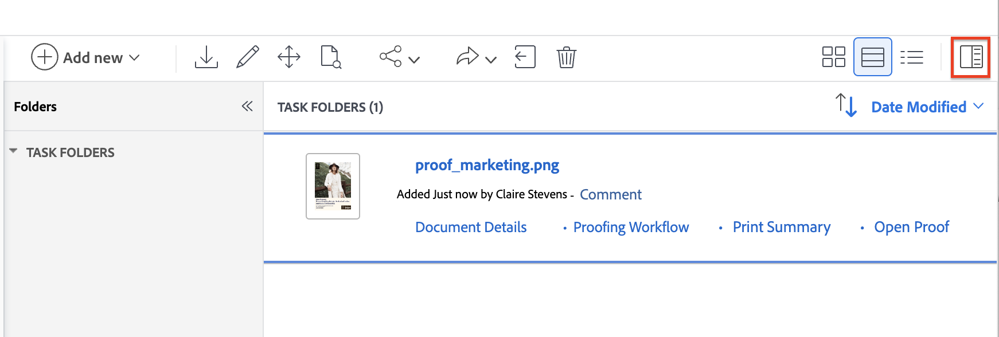

# Einheitliche Genehmigungen und Proofing gemeinsam verwenden

Einheitliche Genehmigungen in Workfront beinhalten jetzt eine Reihe neuer Funktionen, mit denen Sie Dokumente überprüfen und genehmigen können. Sie können einen einheitlichen Genehmigungs-Workflow mit dem vorhandenen Proofing Viewer verwenden, um Kommentare und Markups zu überprüfenden Dokumenten hinzuzufügen.

Es gibt einige wichtige Unterschiede im Workflow bei der gemeinsamen Verwendung von einheitlichen Genehmigungen und Proofing:

* Entscheidungsschaltflächen werden nicht in der Korrekturabzugsansicht angezeigt

* Die Teilnehmer werden in der Dokumentzusammenfassung und nicht im Proofing-Workflow angezeigt

* Die Details „Gesendet“, „Geöffnet“, „Kommentar“, „Entscheidung (SOCD)“ in der Dokumentliste sind mit Proofing verbunden und spiegeln den Entscheidungsstatus des Dokuments nicht wider.

## Dokument hochladen und Korrekturabzug erstellen

1. Navigieren Sie zum Projekt, zur Aufgabe oder zum Problem, dem bzw. dem Sie ein neues Dokument hinzufügen möchten.
1. Klicken Sie auf **Registerkarte** Dokumente“ und dann auf das **Neu hinzufügen** Dropdown-Menü.
oder
Ziehen Sie das Dokument per Drag-and-Drop in die Dokumentliste.

   >[!NOTE]
   >
   >Wenn Sie in **Benutzerprofil „Korrekturabzüge beim Hochladen von Dokumenten automatisch generieren** aktiviert haben, erstellt das System automatisch einen einfachen Korrekturabzug.

1. Bewegen Sie den Mauszeiger über das Dokument und klicken Sie dann auf den **Korrekturabzug erstellen** Link, der unter dem Dokumentnamen angezeigt wird, und wählen Sie **Einfacher Korrekturabzug** aus. Sie müssen einen einfachen Korrekturabzug erstellen, da Sie den Proofing-Workflow nicht für Genehmigungen verwenden werden.

Benutzende, die als Teilnehmer zugewiesen sind, können die Proofing Viewer verwenden, um Kommentare und Markups zu dem Dokument hinzuzufügen. Fahren Sie mit dem nächsten Abschnitt fort, um zu erfahren, wie Sie Reviewer hinzufügen.

## Öffnen Sie die Dokumentzusammenfassung und weisen Sie Teilnehmer zu

Sie haben die Möglichkeit, Prüfer, genehmigende Personen oder eine Mischung aus beidem zuzuweisen:

* **Reviewer** können Kommentare hinzufügen und Assets markieren. Nach Abschluss können sie ihre Überprüfung als abgeschlossen markieren. Die Überprüfung als abgeschlossen zu markieren ist nicht erforderlich, damit das Dokument im Genehmigungsprozess fortgesetzt werden kann.
* **Genehmigende Personen** können Kommentare hinzufügen und Assets markieren. Sie müssen eine Entscheidung treffen, um den Genehmigungsprozess voranzubringen.

So weisen Sie Teilnehmer zu:

1. Wählen Sie das hochgeladene Dokument aus und öffnen Sie die Dokumentzusammenfassung.
   

1. Scrollen Sie nach unten zum Abschnitt Genehmigungen und klicken Sie dann auf **Hinzufügen**.

1. (Optional) Wählen Sie eine vorhandene Validierungsvorlage aus. Benutzer mit einer Standardlizenz können im Bereich „Setup“ wiederverwendbare Genehmigungsvorlagen erstellen. Weitere Informationen finden Sie unter [Erstellen einer Genehmigungsvorlage für Assets und Dokumente](/help/quicksilver/review-and-approve-work/document-reviews-and-approvals/manage-document-approvals/create-approval-template.md).

1. (Optional) Legen Sie eine Frist für die Genehmigung fest. Benutzer und Teams werden 72 Stunden und dann 24 Stunden vor dem angegebenen Termin per E-Mail benachrichtigt.

1. Um einen Genehmiger hinzuzufügen, klicken Sie auf die Schaltfläche Genehmiger und geben Sie einen Benutzer- oder Teamnamen ein.

1. Um einen Reviewer hinzuzufügen, klicken Sie auf die Schaltfläche Reviewer und geben Sie einen Benutzer- oder Teamnamen ein.

   

1. Nachdem Sie alle validierungsverantwortlichen Personen und genehmigenden Personen hinzugefügt haben, klicken Sie auf **Senden**. Die Teilnehmer werden per E-Mail benachrichtigt.

## Erstellen Sie nach Bedarf eine neue Version

Wenn Sie eine weitere Überprüfungs- und Genehmigungsrunde benötigen, können Sie eine neue Korrekturabzugsversion erstellen.  <!-- and add the previous participants, new participants, or a mix of both. --> Informationen zu früheren Versionen und Teilnehmern finden Sie in der Dokumentzusammenfassung.

Hinzufügen einer neuen Version:

1. Ziehen Sie die neue Datei per Drag-and-Drop auf das vorherige Dokument in Workfront. Dadurch wird automatisch eine neue Version erstellt.

1. Nachdem das Dokument hochgeladen wurde, wählen Sie das Dokument aus und klicken Sie auf **Korrekturabzug erstellen** > **Einfacher Korrekturabzug**.

1. Wählen Sie das Dokument erneut aus und öffnen Sie die Dokumentzusammenfassung.
   

1. Scrollen Sie nach unten zum Abschnitt Genehmigungen und klicken Sie dann auf **Hinzufügen**.

1. (Optional) Wählen Sie eine vorhandene Validierungsvorlage aus. Benutzer mit einer Standardlizenz können im Bereich „Setup“ wiederverwendbare Genehmigungsvorlagen erstellen. Weitere Informationen finden Sie unter [Erstellen einer Genehmigungsvorlage für Assets und Dokumente](/help/quicksilver/review-and-approve-work/document-reviews-and-approvals/manage-document-approvals/create-approval-template.md).

1. (Optional) Legen Sie eine Frist für die Genehmigung fest. Benutzer und Teams werden 72 Stunden und dann 24 Stunden vor dem angegebenen Termin per E-Mail benachrichtigt.

1. Um eine genehmigende Person hinzuzufügen, klicken Sie auf die Schaltfläche Genehmigende Person und beginnen Sie mit der Eingabe eines Benutzer- oder Team-Namens  wählen Sie eine genehmigende Person aus der vorherigen Version aus.

1. Um einen Reviewer hinzuzufügen, klicken Sie auf die Schaltfläche Reviewer und geben Sie einen Benutzer- oder Teamnamen ein oder wählen Sie einen Reviewer aus der vorherigen Version aus. 

   

1. Nachdem Sie alle validierungsverantwortlichen Personen und genehmigenden Personen hinzugefügt haben, klicken Sie auf **Senden**. Die Teilnehmer werden per E-Mail benachrichtigt.

<!-- add info about reusing previous participants once released -->

## Korrekturabzug prüfen und eine Entscheidung treffen

Das Dokument wechselt erst dann in den Status Genehmigt , wenn alle zugewiesenen genehmigenden Personen „Genehmigt“ auswählen.

Wenn eine genehmigende Person „Arbeit erforderlich“ auswählt, ändert sich der Status des Dokuments sofort in „Arbeit erforderlich“. Das Dokument muss überarbeitet und als neue Version mit einem neuen Genehmigungs-Workflow hochgeladen werden.

>[!IMPORTANT]
>
>Schaltflächen für Dokumententscheidungen werden nicht in der Korrekturabzugsansicht angezeigt. Sie müssen zurück zur Seite mit der Dokumentzusammenfassung oder den Dokumentdetails navigieren, um Ihre Entscheidung zu treffen oder Ihre Überprüfung als abgeschlossen zu markieren.

So überprüfen und genehmigen Sie ein Dokument:

1. Gehen Sie zu Ihrer E-Mail-Benachrichtigung und klicken Sie auf **Zum Überprüfen gehen**.

1. Wenn Sie sich in Workfront befinden, klicken Sie auf **Zum Korrekturabzug gehen**.

1. Überprüfen Sie den Inhalt und fügen Sie Kommentare oder Markup hinzu. Weitere Informationen zur Verwendung der Proofing-Anzeige finden Sie unter [Testsendungen in Adobe Workfront überprüfen: Artikelindex](/help/quicksilver/review-and-approve-work/proofing/reviewing-proofs-within-workfront/review-proofs-in-wf.md).

1. Wenn Sie mit der Überprüfung fertig sind, schließen Sie die Korrekturabzugsansicht.

1. Wenn Sie sich auf der Seite Dokumentdetails befinden, befinden sich die Entscheidungsschaltflächen in der oberen rechten Ecke des Bildschirms.

1. Wählen Sie eine der folgenden Entscheidungen:

   * **Genehmigen**: Das Dokument muss nicht geändert werden und ist einsatzbereit.
   * **Mit Änderungen genehmigen**: Das Dokument benötigt Änderungen und ist nach deren Vornahme zur Verwendung bereit. Eine zusätzliche Genehmigung ist nicht erforderlich.
   * **Muss überarbeitet werden**: Das Dokument muss geändert werden und ist nicht einsatzbereit. Sobald die angegebenen Änderungen vorgenommen wurden, muss das Dokument als neue Version hochgeladen werden und eine weitere Genehmigungsrunde durchlaufen. Weitere Informationen zum Hochladen einer neuen Version finden Sie unter [Erstellen einer neuen Version nach Bedarf](#create-a-new-version-as-needed) in diesem Artikel.

Sobald Sie eine Entscheidung treffen, wird der Dokumentverantwortliche per E-Mail benachrichtigt.
