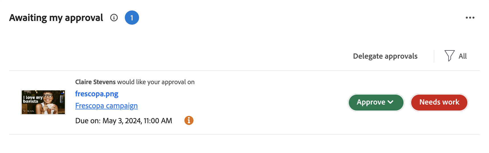

# Erste Schritte mit Asset-Überprüfung und -Genehmigung mit Frame.io

Der neue Workflow zur Überprüfung und Genehmigung von Assets basiert auf einer engen Integration zwischen Workfront und Frame.io. Diese Integration nutzt das Beste aus dem, was jedes Produkt anbieten muss, und kombiniert sie zu einem Erlebnis, das es jedem, der an der Inhaltserstellung beteiligt ist, ermöglicht, in seinen bevorzugten Tools zu arbeiten, während er gleichzeitig Zugriff auf Kommentare, Dateien und Statusaktualisierungen hat - die alle in beiden Systemen in Echtzeit synchronisiert werden.

Weitere Informationen zu Frame.io finden Sie unter [Erste Schritte mit Frame.io](https://support.frame.io/en/collections/49298-getting-started).

## Beginn und Planung von Arbeiten in Workfront

Der Workfront-Administrator aktiviert die Integration zwischen Workfront und Frame.io, indem er das standardmäßige Frame.io-Konto im Setup-Bereich konfiguriert und dann Frame.io-Benutzer in Workfront benennt. Dadurch kann der Koordinator die Arbeit mithilfe von Workfront-Projekten und formellen Prüfungs- und Genehmigungs-Workflows planen und starten.

### Standard-Frame.io-Konto konfigurieren [!BADGE In Kürze verfügbar]{type=Informative}

Workfront-Administratoren initiieren die Integration von Workfront und Frame.io, indem sie im Setup-Bereich von Workfront ein standardmäßiges Frame.io-Konto hinzufügen. Sobald das standardmäßige Frame.io-Konto eingerichtet ist, wird bei allen in Workfront erstellten Projekten ein Spiegelprojekt in Frame.io erstellt.

>[!IMPORTANT]
>
>Diese Funktion wird in Kürze verfügbar sein. Derzeit werden Frame.io-Konten manuell vom Workfront-Team hinzugefügt. Wenden Sie sich an Ihren Adobe-Kundenbetreuer, um Hilfe zu erhalten.

<!--For more information, see [Configure the [!DNL Workfront] and [!DNL Frame.io] integration](/help/quicksilver/administration-and-setup/configure-integrations/configure-wf-and-frame.md).

 in procedure article we need to cover how groups work with projects and how the frame account is associated with a group. And that accounts other than the default can be added on a 1:1 basis using the dev token. -->

### Frame.io-Benutzer jetzt aktivieren

Workfront-Benutzer, die regelmäßig Frame.io verwenden, sollten als Frame.io-Benutzer markiert werden. Workfront-Administratoren können Frame.io-Benutzer im Workfront-Benutzerprofil bestimmen.

>[!TIP]
>
>Es wird empfohlen, Benutzern, die regelmäßig mit Kreativ-Tools arbeiten und Assets zur Überprüfung und Genehmigung hochladen, die Verwendung von Frame.io-Benutzern zu ermöglichen.

Wenn ein Benutzer in Workfront als Frame.io-Benutzer markiert und zu einem Projekt hinzugefügt wird:

* Sie werden als Mitwirkender in Frame.io hinzugefügt.
* Sie können Assets von Frame.io zur formalen Überprüfung und Genehmigung an Workfront senden.
* Sie können Informationen im unidirektionalen Synchronisierungsordner von Workfront aus anzeigen. [!BADGE In Kürze verfügbar]{type=Informative}

Weitere Informationen finden Sie unter [Konfigurieren Sie die [!DNL Workfront] und [!DNL Frame.io] Integration](/help/quicksilver/administration-and-setup/configure-integrations/configure-wf-and-frame.md).

### Erstellen Sie ein Projekt, das mit Frame.io verbunden ist

Sobald das standardmäßige Frame.io-Konto hinzugefügt und Frame.io-Benutzer bestimmt wurden, können Projektkoordinatoren Workfront-Projekte erstellen, die mit Frame.io verbunden sind. Wenn Sie ein verbundenes Projekt erstellen, können Sie

* **Weisen Sie den Aufgaben Frame.io-Benutzer zu**: Benutzer, die für Frame.io aktiviert sind, werden per E-Mail benachrichtigt, wenn sie einer Workfront-Aufgabe zugewiesen werden. Dies signalisiert, dass die Arbeit abgeschlossen ist.
* **Projekt für Frame.io-Benutzer freigeben**: Wenn ein Projekt für Benutzer freigegeben wird, die mit Frame.io aktiviert sind, haben sie sowohl in Workfront als auch in Frame.io Zugriff auf das Projekt.
* **Geben Sie kreative Materialien mit Frame.io frei**: Projektkoordinatoren können Anweisungen und Materialien von Workfront direkt an den kreativen Benutzer in Frame.io senden, indem sie einen unidirektionalen Synchronisierungsprojektordner verwenden. [!BADGE In Kürze verfügbar]{type=Informative}
* **Fortschritt der Aufgabe verfolgen**: Kreative Benutzer können fertige Assets senden und Aufgaben als abgeschlossen markieren - alles ohne Frame.io zu verlassen.

Weitere Informationen finden Sie unter [Erstellen Sie ein Projekt, das mit Frame.io verbunden ist](/help/quicksilver/manage-work/projects/create-projects/create-frame-connected-project.md).

## Inhaltserstellung und -zusammenarbeit in Frame.io

Kreative können in ihren Tools ihrer Wahl bleiben und können in Frame.io Peer Reviews erstellen, durchlaufen und durchführen.

Wenn einem verbundenen Projekt ein kreatives Element hinzugefügt wird, können sie Folgendes in Frame.io tun:

<!--* Access instructions from the project coordinator -->
* Durchführung informeller Peer Reviews
* Senden fertiger Assets an Workfront zur formalen Überprüfung und Genehmigung
* Status einer Aufgabe ändern oder sie als abgeschlossen kennzeichnen
* Hochladen neuer Versionen und anschließendes erneutes Übermitteln zur Genehmigung <!--do they have to send to frame.io again?-->

Weitere Informationen zu Frame.io finden Sie unter [Ich wurde eingeladen, an einem Projekt mitzuarbeiten](https://support.frame.io/en/articles/11125-i-ve-been-invited-to-collaborate-on-a-project).

## Überprüfen und Genehmigen von Assets

Sobald ein Kreativelement ein fertiges Asset von Frame.io an Workfront sendet, kann der Projektkoordinator den formalen Review- und Genehmigungsprozess in Workfront starten.

Nachdem der Genehmigungs-Workflow erstellt wurde, kehren Prüfer und Genehmiger zu Frame.io zurück, um Kommentare hinzuzufügen und das Asset zu markieren. Sie können die Genehmigungsentscheidung auch im Frame.io-Viewer treffen.

### Einleitung förmlicher Prüfungen und Genehmigungen in Workfront

Projektkoordinatoren können einmalige Prüfungs- und Validierungsvorlagen oder wiederverwendbare Validierungsvorlagen erstellen. Alle Review- und Genehmigungsaktivitäten in Frame.io werden ebenfalls in Workfront aufgezeichnet.

Projektkoordinatoren haben die Möglichkeit, Prüfer, Genehmiger oder eine Mischung aus beiden zuzuweisen:

* **Überprüfer** kann Kommentare hinzufügen und Assets markieren. Nach Abschluss können sie ihre Überprüfung als abgeschlossen markieren. Das Markieren der Überprüfung als abgeschlossen ist nicht erforderlich, damit das Asset im Genehmigungsprozess vorankommt.
* **Genehmiger** kann Kommentare hinzufügen und Assets markieren. Sie müssen eine Entscheidung treffen, um den Genehmigungsprozess voranzubringen.

#### Erstellen eines Arbeitsablaufs für Überprüfung und Genehmigung

Validierungsverantwortliche und Validierungsverantwortliche können zu einem einmaligen oder wiederverwendbaren Validierungsarbeitsablauf hinzugefügt werden:

* **Einzelanwendungsgenehmigungen**: Im Projekt oder in der Aufgabe, in dem sich das Asset befindet, kann der Projektkoordinator Prüfer und Genehmiger zuweisen und einen Abschlusszeitpunkt festlegen. Validierungsverantwortliche und validierungsverantwortliche Benutzer werden per E-Mail an 72 und 24 Stunden vor Ablauf der Frist sowie an die Frist selbst erinnert.

  Weitere Informationen finden Sie unter [Erstellen von Dokumentüberprüfungs- oder Genehmigungsanfragen](/help/quicksilver/review-and-approve-work/document-reviews-and-approvals/manage-document-approvals/create-a-document-approval.md). <!--I think this needs to be renamed? -->

* **Validierungsvorlagen**: Im Workfront-Setup-Bereich können Projektkoordinatoren wiederverwendbare Genehmigungsvorlagen erstellen. In einer Vorlage können Benutzer Überprüfer und Genehmiger hinzufügen und einen Abschlusszeitrahmen festlegen. Wenn die Validierungsvorlage auf ein Asset angewendet wird, wird der Termin aus dem festgelegten Zeitraum berechnet.

  Nachdem eine Vorlage erstellt wurde, kann sie auf Assets angewendet werden, die von Frame.io gesendet werden, um den formalen Review- und Genehmigungsprozess in Workfront zu starten.

  Weitere Informationen finden Sie unter [Erstellen einer Validierungsvorlage](/help/quicksilver/review-and-approve-work/document-reviews-and-approvals/manage-document-approvals/create-approval-template.md)

#### Zugriff auf den Viewer Frame.io

Benutzer können wie folgt auf den Frame.io-Viewer zugreifen:

* Workfront-E-Mail-Benachrichtigungen
* Das Erwartungswidget für meine Genehmigung im neuen Workfront-Startbereich
  

>[!NOTE]
>
>Externe Workfront-Benutzer werden per E-Mail benachrichtigt und aufgefordert, eine Frame.io-Anmeldung zur Überprüfung und Genehmigung von Assets zu erstellen.

#### Kommentare hinzufügen und Assets markieren

Alle im Frame.io-Viewer abgegebenen Kommentare werden auch auf der Registerkarte Workfront-Updates aufgezeichnet. In Workfront vorgenommene Antworten werden nicht in Frame.io angezeigt. Wenn Kommentare im Frame.io-Viewer als &quot;Nur Team&quot;markiert sind, werden sie nicht auf der Registerkarte Workfront-Updates angezeigt.

#### Entscheidungsfindung

Sobald alle Überprüfungsaktivitäten abgeschlossen sind, müssen Genehmiger eine der folgenden Entscheidungen treffen:

* **Genehmigen**: Das Asset muss nicht geändert werden und kann verwendet werden.
* **Mit Änderungen genehmigen**: Das Asset muss geändert werden und kann verwendet werden, sobald es erstellt wurde. Eine zusätzliche Genehmigung ist nicht erforderlich.
* **Arbeiten erforderlich**: Das Asset muss geändert werden und kann nicht verwendet werden. Sobald die angegebenen Änderungen vorgenommen wurden, muss das Asset als neue Version hochgeladen werden und eine weitere Genehmigungsrunde durchlaufen. <!--is the same approval workflow automatically applied? Does the coordinator have to do anything to get the approval going? -->

Überprüfer können ihre Überprüfung als abgeschlossen im Frame.io-Viewer markieren. Dies ist jedoch nicht erforderlich, damit das Asset im Genehmigungsprozess vorankommt.

Weitere Informationen zu Entscheidungen in Workfront finden Sie unter [Übersicht über den Entscheidungsstatus von Dokumenten](/help/quicksilver/review-and-approve-work/document-reviews-and-approvals/manage-document-approvals/document-approval-status.md).

<!-- upload assets directly to workfront to be reviewed in Frame.io/ Will have to send manually at first

Reviewer/approver needs to go through email to get to frame vier
-->

### Metriken für Überprüfung und Genehmigung verfolgen

Projektkoordinatoren können den Fortschritt aller Genehmigungen während des Fluges im Workfront-Startbereich mit dem folgenden Widget überwachen:

* **Alle Genehmigungen**: Zeigt zwei Diagramme mit Informationen über die durchschnittliche Genehmigungszeit und -entscheidungen sowie Listenansichten ausstehender und überfälliger Genehmigungen an.
  