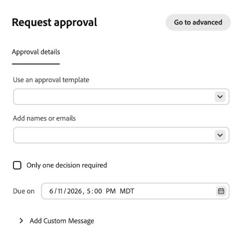

# Erstellen eines Workflows für die Dokumentvalidierung

Sie können die Genehmigung anderer Benutzer oder Teams für ein Dokument in Adobe Workfront anfordern oder diese auffordern, ein Dokument zu überprüfen, ohne es genehmigen zu müssen.

>[!IMPORTANT]
>
>Der Inhalt dieses Artikels bezieht sich auf aktualisierte Dokumentgenehmigungsfunktionen, die nur für bestimmte Konten verfügbar sind. Informationen zu standardmäßigen Genehmigungsprozessen finden Sie in den Artikeln, die unter [Arbeitsgenehmigungen“ aufgeführt ](/help/quicksilver/review-and-approve-work/manage-approvals/manage-approvals.md).

## Zugriffsanforderungen

+++ Erweitern, um die Zugriffsanforderungen für die in diesem Artikel beschriebene Funktionalität anzuzeigen.

<table style="table-layout:auto"> 
 <col> 
 <col> 
 <tbody> 
  <tr> 
   <td role="rowheader">Adobe Workfront-Paket</td> 
   <td> 
Jedes Workfront-Paket zur Verwaltung von Genehmigungen unter Verwendung des alten Workfront-Speichers

Beliebiges Workflow-Paket zum Verwalten von Genehmigungen mithilfe des Adobe-Cloud-Speichers
 </td> 
  </tr> 
  <tr> 
   <td role="rowheader">Adobe Workfront-Lizenz</td>  
   <td>
   
Mitwirkende oder höher

   
Überprüfen oder höher

   
Wenn Sie die Frame.io-Integration verwenden, benötigen Sie eine Standardlizenz zum Erstellen von Genehmigungs-Workflows.

   </td> 
  </tr> 
  <tr> 
   <td role="rowheader">Konfigurationen der Zugriffsebene</td> 
   <td> 
Anzeigen oder Erweitern des Zugriffs auf Projekte, Aufgaben, Probleme, Vorlagen, Portfolios, Programme, Berichte, Dashboards, Kalender und Dokumente
 </td> 
  </tr>
  <tr> 
   <td role="rowheader">Objektberechtigungen</td> 
   <td> 
Verwalten des Zugriffs auf das Objekt, das mit der Zugriffsanforderung oder Genehmigung verknüpft ist 
 </td> 
  </tr> 
 </tbody> 
</table>

Weitere Informationen finden Sie unter [Zugriffsanforderungen](/help/quicksilver/administration-and-setup/add-users/access-levels-and-object-permissions/access-level-requirements-in-documentation.md) in der Dokumentation zu Workfront.

+++

<!--

## Create an approval workflow in the legacy documents area in Production

If your organization is on Workfront storage, you will see the legacy documents area when you access documents in Workfront. For more information about Workfront storage, see [Differences between Adobe cloud storage and legacy Workfront storage](/help/quicksilver/review-and-approve-work/esm-overview.md#differences-between-adobe-cloud-storage-and-legacy-workfront-storage).

To create an approval workflow:

1. Go to the project, task, or issue that contains the document, then select **Documents** in the left panel.

1. Click on the document you need and the Document Summary panel for that document opens.

1. Select the version of the document you would like to create an approval for in the version dropdown. The latest version is selected by default.

1. Scroll down to the **Approvals** section, then click **Create workflow**.

1. Fill in the following details:

   <table>
   <tr>
   <td><strong>Stage name</strong></td>
   <td>Add a stage name. You can change the name to something more descriptive, such as <em>Initial Review</em> or <em>Final Approval</em>.</td>
   </tr>
   <tr>
   <td><strong>Add names or emails</strong></td>
   <td>Begin typing a user or team name to add as an approver or reviewer. If you only have reviewers, they will be notified and have the option to complete the review but no decision will be required or made.</td>
   </tr>
   <tr>
   <td><strong>One decision required (optional)</strong></td>
   <td>The first person who makes a decision completes the stage.</td>
   </tr>
   <tr>
   <td><strong>Due date (optional)</strong></td>
   <td>Set a due date for the approval. Users and teams are notified by email 72 hours, then 24 hours before the specified due date.</td>
   </tr>
   </table>

1. (Optional) Repeat the previous step to add additional stages as needed.

   >[!NOTE]
   >
   >If you add multiple stages, the approval workflow proceeds in the order the stages are listed. When all required decisions are made, the next stage begins and the previous stage is locked.

   

-->

## Erstellen eines Validierungs-Workflows im Bereich „Alte Dokumente“

Wenn sich Ihr Unternehmen im Workfront-Speicher befindet, wird der Bereich für veraltete Dokumente angezeigt, wenn Sie auf Dokumente in Workfront zugreifen. Weitere Informationen zu Workfront-Speicher finden Sie unter [Unterschiede zwischen Adobe-Cloud-Speicher und Legacy-Workfront-Speicher](/help/quicksilver/review-and-approve-work/esm-overview.md#differences-between-adobe-cloud-storage-and-legacy-workfront-storage).

### Erstellen eines einfachen Validierungs-Workflows

So erstellen Sie einen einstufigen Validierungs-Workflow:

1. Gehen Sie zu dem Projekt, der Aufgabe oder dem Problem, das/das das Dokument enthält, und wählen **Dokumente** im linken Bereich aus.

1. Klicken Sie auf das gewünschte Dokument, und das Bedienfeld Dokumentzusammenfassung für dieses Dokument wird geöffnet.

1. Wählen Sie im Dropdown-Menü Version die Version des Dokuments aus, für das Sie eine Genehmigung erstellen möchten. Standardmäßig ist die neueste Version ausgewählt.

1. Scrollen Sie nach unten zum Abschnitt **Genehmigungen** und klicken Sie dann auf **Workflow erstellen**. Das **„Genehmigung anfordern** wird im Standardmodus geöffnet.

1. Füllen Sie die folgenden Details aus:

   <table>
   <tr>
   <td><strong>Verwenden einer Validierungsvorlage (optional)</strong></td>
   <td>Wählen Sie eine Vorlage aus dem Dropdown-Menü aus. Wenn die Vorlage über einen Pfad und ein Stadium verfügt, wird sie im Standardmodus angewendet. Wenn die Vorlage mehr als ein Stadium oder mehr als einen Pfad enthält, wechselt das Dialogfeld automatisch in den erweiterten Modus und alle Eingaben, die Sie im Standardmodus eingegeben haben, werden durch den Inhalt der Vorlage ersetzt.</td>
   </tr>
   <tr>
   <td><strong>Namen oder E-Mails hinzufügen</strong></td>
   <td>Beginnen Sie mit der Eingabe eines Benutzer- oder Team-Namens, der als genehmigende Person oder Prüfende Person hinzugefügt werden soll. Wenn Sie nur über Validierungsverantwortliche verfügen, werden diese benachrichtigt und haben die Möglichkeit, die Überprüfung abzuschließen. Es ist jedoch keine Entscheidung erforderlich oder getroffen.</td>
   </tr>
   <tr>
   <td><strong>Nur eine Entscheidung erforderlich (optional)</strong></td>
   <td>Die erste Person, die eine Entscheidung trifft, schließt die Phase ab.</td>
   </tr>
   <tr>
   <td><strong>Fällig am (optional)</strong></td>
   <td>Legen Sie ein Fälligkeitsdatum für die Genehmigung fest. Benutzer und Teams werden 72 Stunden und dann 24 Stunden vor dem angegebenen Fälligkeitsdatum per E-Mail benachrichtigt.</td>
   </tr>
   <tr>
   <td><strong>Benutzerdefinierte Nachricht hinzufügen (optional)</strong></td>
   <td>Geben Sie eine Nachricht in das Textfeld <strong>Benutzerdefinierte Nachricht hinzufügen</strong> ein. Die Meldung wird in der E-Mail-Benachrichtigung über die Genehmigung und auf der Registerkarte Genehmigungen in Workfront angezeigt.
   
Hinweis: Wenn Sie eine benutzerdefinierte Nachricht bearbeiten, nachdem der Genehmigungs-Workflow erstellt wurde, wird eine aktualisierte E-Mail-Benachrichtigung an alle vorhandenen Teilnehmer gesendet. Wenn Sie einen Teilnehmer später hinzufügen, wird die benutzerdefinierte Nachricht in die E-Mail-Benachrichtigung aufgenommen.

   </td>
   </tr>
   </table>

1. Klicken Sie **Genehmigung anfordern**.

   

### Erstellen eines erweiterten Validierungs-Workflows

Der erweiterte Modus unterstützt mehrere Phasen sowie parallele Pfade. Jeder Pfad wird unabhängig voneinander ausgeführt und enthält eine oder mehrere sequenzielle Phasen. Wenn alle erforderlichen Entscheidungen in einem Schritt getroffen werden, beginnt die nächste Phase in diesem Pfad, die vorherige Phase wird gesperrt und die Prüfer und genehmigenden Personen des neuen Schritts erhalten eine E-Mail-Benachrichtigung.

Eine Entscheidung bezüglich „Arbeit erforderlich“ stoppt den Pfad, hat jedoch keine Auswirkungen auf den Genehmigungs-Workflow in anderen Pfaden. Sie können bis zu 30 Pfade und insgesamt 100 Phasen konfigurieren.

So erstellen Sie einen erweiterten Validierungs-Workflow:

1. Gehen Sie zu dem Projekt, der Aufgabe oder dem Problem, das/das das Dokument enthält, und wählen **Dokumente** im linken Bereich aus.

1. Klicken Sie auf das gewünschte Dokument, und das Bedienfeld Dokumentzusammenfassung für dieses Dokument wird geöffnet.

1. Wählen Sie im Dropdown-Menü Version die Version des Dokuments aus, für das Sie eine Genehmigung erstellen möchten. Standardmäßig ist die neueste Version ausgewählt.

1. Scrollen Sie nach unten zum Abschnitt **Genehmigungen** und klicken Sie dann auf **Workflow erstellen**.

1. Klicken Sie oben rechts im Dialogfeld **Genehmigung anfordern** auf **Zu Erweitert wechseln**. Jede Eingabe, die Sie im Standardmodus eingegeben haben, wird beibehalten und auf **Pfad 1**, **Schritt 1** angewendet.

   >[!TIP]
   >
   >Während Sie die Genehmigung erstellen, können Sie zum Standardmodus zurückkehren, indem Sie oben rechts auf **Zum** wechseln klicken. Nachdem Sie auf **Genehmigung anfordern** geklickt haben, ist die Option **Zur** wechseln“ nicht mehr verfügbar.

1. Füllen Sie die Details für Schritt 1 von Pfad 1 aus:

   <table>
   <tr>
   <td><strong>Name der Phase</strong></td>
   <td>Stadien werden standardmäßig <em>Stadium 1</em>, <em>Stadium 2</em> usw. benannt. Benennen Sie die Phase in eine aussagekräftigere Bezeichnung um, z. B<em> „Erstprüfung</em> oder "<em> Genehmigung</em>.</td>
   </tr>
   <tr>
   <td><strong>Namen oder E-Mails hinzufügen</strong></td>
   <td>Beginnen Sie mit der Eingabe eines Benutzer- oder Team-Namens, der als genehmigende Person oder Prüfende Person hinzugefügt werden soll. Wenn Sie nur über Validierungsverantwortliche verfügen, werden diese benachrichtigt und haben die Möglichkeit, die Überprüfung abzuschließen. Es ist jedoch keine Entscheidung erforderlich oder getroffen.
Hinweis: Ein Reviewer oder eine genehmigende Person kann jeweils nur einem offenen Schritt im selben Asset zugewiesen werden. Wenn mehrere parallele Stadien gleichzeitig geöffnet sind, kann dieselbe Person nicht zu mehr als einer hinzugefügt werden.
</td>
   </tr>
   <tr>
   <td><strong>Nur eine Entscheidung erforderlich (optional)</strong></td>
   <td>Die erste Person, die eine Entscheidung trifft, schließt die Phase ab.</td>
   </tr>
   <tr>
   <td><strong>Fällig am (optional)</strong></td>
   <td>Die erste Phase jedes Pfads unterstützt ein absolutes Fälligkeitsdatum. Jede nachfolgende Phase im Pfad unterstützt ein relatives Fälligkeitsdatum - die Anzahl der Tage ab dem Zeitpunkt, zu dem diese Phase geöffnet wird. Benutzer und Teams werden 72 Stunden und dann 24 Stunden vor dem Fälligkeitsdatum per E-Mail benachrichtigt.</td>
   </tr>
   <tr>
   <td><strong>Benutzerdefinierte Nachricht hinzufügen (optional)</strong></td>
   <td>Geben Sie eine Nachricht in das Textfeld <strong>Benutzerdefinierte Nachricht hinzufügen</strong> ein. Die Meldung wird in der E-Mail-Benachrichtigung über die Genehmigung und auf der Registerkarte Genehmigungen in Workfront angezeigt.
Wenn Sie ein zweites Stadium hinzufügen<strong> wird „Diese Nachricht auf allen Stadien anzeigen</strong> standardmäßig ausgewählt. Lassen Sie die Option aktiviert, damit in jedem Schritt dieselbe Nachricht verwendet wird. Um für jede Phase eine andere Nachricht zu verwenden, deaktivieren Sie <strong>Diese Nachricht in allen Phasen anzeigen</strong> und geben Sie dann die phasenspezifische Nachricht in das Textfeld <strong>Benutzerdefinierte Nachricht hinzufügen</strong> für jede Phase ein.
</td>
   </tr>
   </table>

1. (Optional) Klicken Sie auf **Phase hinzufügen**, um dem Pfad eine weitere Phase hinzuzufügen. Die Phasen innerhalb eines Pfads werden nacheinander in der angegebenen Reihenfolge ausgeführt. Sie können Stadien innerhalb eines Pfads neu anordnen, aber Sie können eine Phase nicht von einem Pfad in einen anderen verschieben. Jeder Pfad kann eine andere Anzahl von Phasen aufweisen.

1. (Optional) Klicken Sie unter **Parallele Pfade** auf **Pfad hinzufügen**, um einen weiteren Pfad hinzuzufügen. Der neue Pfad beginnt mit einem leeren Schritt und wird zum ausgewählten Pfad. Um einen Pfad umzubenennen, bewegen Sie den Mauszeiger über die Pfadbeschriftung, klicken Sie auf das Stiftsymbol und geben Sie dann einen neuen Namen ein.

1. (Optional) Um einen Pfad zu entfernen, bewegen Sie den Mauszeiger über die Pfadbeschriftung und klicken Sie auf das Papierkorbsymbol. **Pfad 1** kann nicht entfernt werden und Pfade können nicht neu angeordnet werden. Andere Pfade können nur entfernt werden, wenn kein Schritt innerhalb des Pfades gesperrt oder abgeschlossen ist.

   

1. (Optional) Um alle Pfade und Phasen zu löschen und von vorne zu beginnen, klicken **oben** auf „Zurücksetzen“.

1. Klicken Sie **Genehmigung anfordern**.

<!--

## Create an approval workflow in the new Documents area in Production

If your organization uses Adobe cloud storage, you will see the new Documents area when you access documents in Workfront. For more information about Adobe cloud storage, see [Adobe cloud storage overview](/help/quicksilver/review-and-approve-work/esm-overview.md).

To create an approval workflow:

1. Go to the project, task, or issue that contains the document, then select **Documents** in the left panel.

1. Click on the document, then click the **Approvals** icon on the right side of the page.

   

1. Click **Create workflow**, then fill in the following details:

   <table>
   <tr>
   <td><strong>Stage name</strong></td>
   <td>Add a stage name. You can change the name to something more descriptive, such as <em>Initial Review</em> or <em>Final Approval</em>.</td>
   </tr>
   <tr>
   <td><strong>Add names or emails</strong></td>
   <td>Begin typing a user or team name to add as an approver or reviewer. If you only have reviewers, they will be notified and have the option to complete the review but no decision will be required or made.</td>
   </tr>
   <tr>
   <td><strong>One decision required (optional)</strong></td>
   <td>The first person who makes a decision completes the stage.</td>
   </tr>
   <tr>
   <td><strong>Due date (optional)</strong></td>
   <td>Set a due date for the approval. Users and teams are notified by email 72 hours, then 24 hours before the specified due date.</td>
   </tr>
   </table>

1. (Optional) Repeat the previous step to add additional stages as needed.

   >[!NOTE]
   >
   >If you add multiple stages, the approval workflow proceeds in the order the stages are listed. When all required decisions are made, the next stage begins and the previous stage is locked.

   
   
-->

## Erstellen eines Validierungs-Workflows im Bereich „Neue Dokumente“

Wenn Ihr Unternehmen Adobe Cloud Storage verwendet, wird der Bereich Neue Dokumente angezeigt, wenn Sie auf Dokumente in Workfront zugreifen. Weitere Informationen zu Adobe Cloud-Speicher finden Sie unter [Übersicht über Adobe Cloud-Speicher](/help/quicksilver/review-and-approve-work/esm-overview.md).

Das **Genehmigung anfordern** wird standardmäßig im **Standard** Modus geöffnet. Der Standardmodus ist ein einzelner Schritt mit einer Gruppe von genehmigenden Personen oder Prüfenden. Wechseln Sie in **Erweitert**-Modus, um mehrstufige Genehmigungen oder parallele Pfade zu konfigurieren.

### Erstellen eines einfachen Validierungs-Workflows

So erstellen Sie einen einstufigen Validierungs-Workflow:

1. Gehen Sie zu dem Projekt, der Aufgabe oder dem Problem, das/das das Dokument enthält, und wählen **Dokumente** im linken Bereich aus.

1. Klicken Sie auf das Dokument und dann auf **Genehmigungen** rechts auf der Seite.

   

1. Klicken Sie **Workflow erstellen**. Das **„Genehmigung anfordern** wird im Standardmodus geöffnet.

1. Füllen Sie die folgenden Details aus:

   <table>
   <tr>
   <td><strong>Verwenden einer Validierungsvorlage (optional)</strong></td>
   <td>Das Feld Vorlagen ist standardmäßig reduziert. Klicken Sie auf das Feld, um es zu erweitern, und wählen Sie dann eine Vorlage aus dem Dropdown-Menü aus. Wenn die Vorlage über einen Pfad und ein Stadium verfügt, wird sie im Standardmodus angewendet. Wenn die Vorlage mehr als ein Stadium oder mehr als einen Pfad enthält, wechselt das Dialogfeld automatisch in den erweiterten Modus und alle Eingaben, die Sie im Standardmodus eingegeben haben, werden durch den Inhalt der Vorlage ersetzt.</td>
   </tr>
   <tr>
   <td><strong>Namen oder E-Mails hinzufügen</strong></td>
   <td>Beginnen Sie mit der Eingabe eines Benutzer- oder Team-Namens, der als genehmigende Person oder Prüfende Person hinzugefügt werden soll. Wenn Sie nur über Validierungsverantwortliche verfügen, werden diese benachrichtigt und haben die Möglichkeit, die Überprüfung abzuschließen. Es ist jedoch keine Entscheidung erforderlich oder getroffen.</td>
   </tr>
   <tr>
   <td><strong>Nur eine Entscheidung erforderlich (optional)</strong></td>
   <td>Die erste Person, die eine Entscheidung trifft, schließt die Phase ab.</td>
   </tr>
   <tr>
   <td><strong>Fällig am (optional)</strong></td>
   <td>Legen Sie ein Fälligkeitsdatum für die Genehmigung fest. Benutzer und Teams werden 72 Stunden und dann 24 Stunden vor dem angegebenen Fälligkeitsdatum per E-Mail benachrichtigt.</td>
   </tr>
   <tr>
   <td><strong>Benutzerdefinierte Nachricht hinzufügen (optional)</strong></td>
   <td>Geben Sie eine Nachricht in das Textfeld <strong>Benutzerdefinierte Nachricht hinzufügen</strong> ein. Die Meldung wird in der E-Mail-Benachrichtigung über die Genehmigung und auf der Registerkarte Genehmigungen in Workfront angezeigt.</td>
   </tr>
   </table>

1. Klicken Sie **Genehmigung anfordern**.

   

>[!NOTE]
>
>* Das **Genehmigung anfordern** wird unabhängig von Ihrer vorherigen Sitzung jedes Mal im Standardmodus geöffnet.
>* Wenn Sie eine benutzerdefinierte Nachricht bearbeiten, nachdem der Genehmigungs-Workflow erstellt wurde, wird eine aktualisierte E-Mail-Benachrichtigung an alle vorhandenen Teilnehmer gesendet. Wenn Sie einen Teilnehmer später hinzufügen, wird die benutzerdefinierte Nachricht in die E-Mail-Benachrichtigung aufgenommen.
>* Nachdem eine Genehmigung gespeichert wurde, kann sie nicht mehr in den Standardmodus zurückgeschaltet werden. Sie können eine laufende Genehmigung von „Einfach“ in „Erweitert“ wechseln, solange die Genehmigung nicht gesperrt oder abgeschlossen ist.

### Erstellen eines erweiterten Validierungs-Workflows

Der erweiterte Modus unterstützt parallele Pfade. Jeder Pfad wird unabhängig voneinander ausgeführt und enthält eine oder mehrere sequenzielle Phasen. Wenn alle erforderlichen Entscheidungen in einem Schritt getroffen werden, beginnt die nächste Phase in diesem Pfad, die vorherige Phase wird gesperrt und die Prüfer und genehmigenden Personen des neuen Schritts erhalten eine E-Mail-Benachrichtigung.

Eine Entscheidung bezüglich „Arbeit erforderlich“ stoppt den Pfad, hat jedoch keine Auswirkungen auf den Genehmigungs-Workflow in anderen Pfaden. Sie können bis zu 30 Pfade und insgesamt 100 Phasen konfigurieren.

So erstellen Sie einen erweiterten Validierungs-Workflow:

1. Gehen Sie zu dem Projekt, der Aufgabe oder dem Problem, das/das das Dokument enthält, und wählen **Dokumente** im linken Bereich aus.

1. Klicken Sie auf das Dokument und dann auf **Genehmigungen** rechts auf der Seite.

   

1. Klicken Sie **Workflow erstellen**.

1. Klicken Sie oben rechts im Dialogfeld **Genehmigung anfordern** auf **Zu Erweitert wechseln**. Jede Eingabe, die Sie im Standardmodus eingegeben haben, wird beibehalten und auf **Pfad 1**, **Schritt 1** angewendet.

   >[!TIP]
   >
   >Während Sie die Genehmigung erstellen, können Sie zum Standardmodus zurückkehren, indem Sie oben rechts auf **Zum** wechseln klicken. Nachdem Sie auf **Genehmigung anfordern** geklickt haben, ist die Option **Zur** wechseln“ nicht mehr verfügbar.

1. Füllen Sie die Details für Schritt 1 von Pfad 1 aus:

   <table>
   <tr>
   <td><strong>Name der Phase</strong></td>
   <td>Stadien werden standardmäßig <em>Stadium 1</em>, <em>Stadium 2</em> usw. benannt. Benennen Sie die Phase in eine aussagekräftigere Bezeichnung um, z. B<em> „Erstprüfung</em> oder "<em> Genehmigung</em>.</td>
   </tr>
   <tr>
   <td><strong>Namen oder E-Mails hinzufügen</strong></td>
   <td>Beginnen Sie mit der Eingabe eines Benutzer- oder Team-Namens, der als genehmigende Person oder Prüfende Person hinzugefügt werden soll. Wenn Sie nur über Validierungsverantwortliche verfügen, werden diese benachrichtigt und haben die Möglichkeit, die Überprüfung abzuschließen. Es ist jedoch keine Entscheidung erforderlich oder getroffen.
Hinweis: Ein Reviewer oder eine genehmigende Person kann jeweils nur einem offenen Schritt im selben Asset zugewiesen werden. Wenn mehrere parallele Stadien gleichzeitig geöffnet sind, kann dieselbe Person nicht zu mehr als einer hinzugefügt werden.
</td>
   </tr>
   <tr>
   <td><strong>Nur eine Entscheidung erforderlich (optional)</strong></td>
   <td>Die erste Person, die eine Entscheidung trifft, schließt die Phase ab.</td>
   </tr>
   <tr>
   <td><strong>Fällig am (optional)</strong></td>
   <td>Die erste Phase jedes Pfads unterstützt ein absolutes Fälligkeitsdatum. Jede nachfolgende Phase im Pfad unterstützt ein relatives Fälligkeitsdatum - die Anzahl der Tage ab dem Zeitpunkt, zu dem diese Phase geöffnet wird. Benutzer und Teams werden 72 Stunden und dann 24 Stunden vor dem Fälligkeitsdatum per E-Mail benachrichtigt.</td>
   </tr>
   <tr>
   <td><strong>Benutzerdefinierte Nachricht hinzufügen (optional)</strong></td>
   <td>Geben Sie eine Nachricht in das Textfeld <strong>Benutzerdefinierte Nachricht hinzufügen</strong> ein. Die Meldung wird in der E-Mail-Benachrichtigung über die Genehmigung und auf der Registerkarte Genehmigungen in Workfront angezeigt.
Wenn Sie ein zweites Stadium hinzufügen<strong> wird „Diese Nachricht auf allen Stadien anzeigen</strong> standardmäßig ausgewählt. Lassen Sie die Option aktiviert, damit in jedem Schritt dieselbe Nachricht verwendet wird. Um für jede Phase eine andere Nachricht zu verwenden, deaktivieren Sie <strong>Diese Nachricht in allen Phasen anzeigen</strong> und geben Sie dann die phasenspezifische Nachricht in das Textfeld <strong>Benutzerdefinierte Nachricht hinzufügen</strong> für jede Phase ein.
</td>
   </tr>
   </table>

1. (Optional) Klicken Sie auf **Phase hinzufügen**, um dem Pfad eine weitere Phase hinzuzufügen. Die Phasen innerhalb eines Pfads werden nacheinander in der angegebenen Reihenfolge ausgeführt. Sie können Stadien innerhalb eines Pfads neu anordnen, aber Sie können eine Phase nicht von einem Pfad in einen anderen verschieben. Jeder Pfad kann eine andere Anzahl von Phasen aufweisen.

1. (Optional) Klicken Sie unter **Parallele Pfade** auf **Pfad hinzufügen**, um einen weiteren Pfad hinzuzufügen. Der neue Pfad beginnt mit einem leeren Schritt und wird zum ausgewählten Pfad. Um einen Pfad umzubenennen, bewegen Sie den Mauszeiger über die Pfadbeschriftung, klicken Sie auf das Stiftsymbol und geben Sie dann einen neuen Namen ein.

1. (Optional) Um einen Pfad zu entfernen, bewegen Sie den Mauszeiger über die Pfadbeschriftung und klicken Sie auf das Papierkorbsymbol. **Pfad 1** kann nicht entfernt werden und Pfade können nicht neu angeordnet werden. Andere Pfade können nur entfernt werden, wenn kein Schritt innerhalb des Pfades gesperrt oder abgeschlossen ist.

   

1. (Optional) Um alle Pfade und Phasen zu löschen und von vorne zu beginnen, klicken **oben** auf „Zurücksetzen“.

1. Klicken Sie **Genehmigung anfordern**.

<!--
## Resubmit an approval on a new version

Document approval decisions are not automatically reset when you upload a new version. For example, if your document is approved with changes, the decision will show "changes" as the decision, even if you upload a new version with the specified changes. You can clear the decision on a new version if you manually resubmit the approval.

1. Go to the project, task, or issue that contains the document, then select **Documents**.
1. Find the document you need.

1. Scroll down to the **Approvals** section in the Summary, click the More icon, then click Resubmit.

   
-->