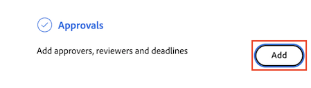

# Erstellen eines Workflows für die Dokumentvalidierung

Die hervorgehobenen Informationen auf dieser Seite beziehen sich auf Funktionen, die noch nicht allgemein verfügbar sind. Sie ist nur in der Sandbox-Vorschau-Umgebung verfügbar.

Sie können die Genehmigung anderer Benutzer oder Teams für ein Dokument in Adobe Workfront anfordern oder diese auffordern, ein Dokument zu überprüfen, ohne es genehmigen zu müssen.

>[!IMPORTANT]
>
>Der Inhalt dieses Artikels bezieht sich auf aktualisierte Dokumentgenehmigungsfunktionen, die nur für bestimmte Konten verfügbar sind. Informationen zu standardmäßigen Genehmigungsprozessen finden Sie in den Artikeln, die unter [Arbeitsgenehmigungen“ aufgeführt ](/help/quicksilver/review-and-approve-work/manage-approvals/manage-approvals.md).

## Zugriffsanforderungen

+++ Erweitern, um die Zugriffsanforderungen für die in diesem Artikel beschriebene Funktionalität anzuzeigen.

<table style="table-layout:auto"> 
 <col> 
 <col> 
 <tbody> 
  <tr> 
   <td role="rowheader">Adobe Workfront-Paket</td> 
   <td> 
Beliebig
 </td> 
  </tr> 
  <tr> 
   <td role="rowheader">Adobe Workfront-Lizenz</td>  
   <td>
   
Mitwirkende oder höher

   
Überprüfen oder höher

   
Wenn Sie die Frame.io-Integration verwenden, benötigen Sie eine Standardlizenz zum Erstellen von Genehmigungs-Workflows.

   </td> 
  </tr> 
  <tr> 
   <td role="rowheader">Konfigurationen der Zugriffsebene</td> 
   <td> 
Anzeigen oder Erweitern des Zugriffs auf Projekte, Aufgaben, Probleme, Vorlagen, Portfolios, Programme, Berichte, Dashboards, Kalender und Dokumente
 </td> 
  </tr>
  <tr> 
   <td role="rowheader">Objektberechtigungen</td> 
   <td> 
Verwalten des Zugriffs auf das Objekt, das mit der Zugriffsanforderung oder Genehmigung verknüpft ist 
 </td> 
  </tr> 
 </tbody> 
</table>

Weitere Informationen finden Sie unter [Zugriffsanforderungen](/help/quicksilver/administration-and-setup/add-users/access-levels-and-object-permissions/access-level-requirements-in-documentation.md) in der Dokumentation zu Workfront.

+++

## Erstellen Sie auf der Dokumentseite in Ihrer Produktionsumgebung eine Anfrage zur Überprüfung oder Genehmigung eines Dokuments

1. Bewegen Sie den Mauszeiger über das Dokument und klicken Sie dann auf Dokumentdetails.
   

1. Wählen Sie in der Nähe des Dokumentnamens in der Dropdown-Liste Version die Version des Dokuments aus, für das Sie eine Genehmigung erstellen möchten. Standardmäßig ist die neueste Version ausgewählt.

1. Klicken Sie **linken** auf „Genehmigungen“.

1. (Optional) Legen Sie eine Frist für die Genehmigung fest. Benutzer und Teams werden 72 Stunden und dann 24 Stunden vor dem angegebenen Termin per E-Mail benachrichtigt.

1. Um eine genehmigende Person hinzuzufügen, klicken Sie auf **genehmigende Person** und geben Sie einen Benutzer- oder Teamnamen ein.

1. Um einen Reviewer hinzuzufügen, aktivieren Sie das **Reviewer** und geben Sie einen Benutzer- oder Teamnamen ein.

   

1. Wiederholen Sie den vorherigen Schritt, um weitere genehmigende Personen oder Prüfer hinzuzufügen.

## Erstellen Sie eine Anfrage zur Überprüfung oder Genehmigung eines Dokuments über das Bedienfeld Dokumentzusammenfassung in Ihrer Produktionsumgebung

1. Gehen Sie zu dem Projekt, der Aufgabe oder dem Problem, das/das das Dokument enthält, und wählen Sie dann **Dokumente**.

1. Klicken Sie auf das gewünschte Dokument. Daraufhin wird das linke Bedienfeld Dokumentzusammenfassung für dieses Dokument geöffnet.

1. Wählen Sie in der Dropdown-Liste Version die Version des Dokuments aus, für das Sie eine Genehmigung erstellen möchten. Standardmäßig ist die neueste Version ausgewählt.

1. Scrollen Sie nach unten zum Abschnitt **Genehmigungen** im Bereich Dokumentzusammenfassung und klicken Sie dann auf **Hinzufügen**.

1. (Optional) Legen Sie eine Frist für die Genehmigung fest. Benutzer und Teams werden 72 Stunden und dann 24 Stunden vor dem angegebenen Termin per E-Mail benachrichtigt.

1. Um eine genehmigende Person hinzuzufügen, klicken Sie auf **genehmigende Person** und geben Sie einen Benutzer- oder Teamnamen ein.

1. Um einen Reviewer hinzuzufügen, aktivieren Sie das **Reviewer** und geben Sie einen Benutzer- oder Teamnamen ein.

   

1. Wiederholen Sie den vorherigen Schritt, um weitere genehmigende Personen oder Prüfer hinzuzufügen.

## Erstellen Sie einen Validierungs-Workflow über das Bedienfeld Zusammenfassung in Ihrer Vorschau-Umgebung im Bereich „Alte Dokumente“

Wenn sich Ihr Unternehmen im Workfront-Speicher befindet, wird der Bereich für veraltete Dokumente angezeigt, wenn Sie auf Dokumente in Workfront zugreifen. Weitere Informationen zu Workfront-Speicher finden Sie unter [Workfront-Speicher im Vergleich zu Adobe Enterprise-Speicher](/help/quicksilver/review-and-approve-work/esm-overview.md#workfront-storage-vs-adobe-enterprise-storage).

So erstellen Sie einen Validierungs-Workflow:

1. Gehen Sie zu dem Projekt, der Aufgabe oder dem Problem, das/das das Dokument enthält, und wählen **Dokumente** im linken Bereich aus.

1. Klicken Sie auf das gewünschte Dokument, und das Bedienfeld Dokumentzusammenfassung für dieses Dokument wird geöffnet.

1. Wählen Sie in der Dropdown-Liste Version die Version des Dokuments aus, für das Sie eine Genehmigung erstellen möchten. Standardmäßig ist die neueste Version ausgewählt.

1. Scrollen Sie nach unten zum Abschnitt **Genehmigungen** und klicken Sie dann auf **Workflow erstellen**.

1. Füllen Sie die folgenden Details aus:

   <table>
   <tr>
   <td><strong>Name der Phase</strong></td>
   <td>Einen Namen für das Stadium hinzufügen. Sie können den Namen in einen aussagekräftigeren Namen ändern, z. B<em> „Erstprüfung</em> oder "<em> Genehmigung</em>.</td>
   </tr>
   <tr>
   <td><strong>Namen oder E-Mails hinzufügen</strong></td>
   <td>Beginnen Sie mit der Eingabe eines Benutzer- oder Team-Namens, der als genehmigende Person oder Prüfende Person hinzugefügt werden soll. Wenn Sie nur über Validierungsverantwortliche verfügen, werden diese benachrichtigt und haben die Möglichkeit, die Überprüfung abzuschließen. Es ist jedoch keine Entscheidung erforderlich oder getroffen.</td>
   </tr>
   <tr>
   <td><strong>Eine Entscheidung erforderlich (optional)</strong></td>
   <td>Die erste Person, die eine Entscheidung trifft, schließt die Phase ab.</td>
   </tr>
   <tr>
   <td><strong>Fälligkeitsdatum (optional)</strong></td>
   <td>Legen Sie ein Fälligkeitsdatum für die Genehmigung fest. Benutzer und Teams werden 72 Stunden und dann 24 Stunden vor dem angegebenen Fälligkeitsdatum per E-Mail benachrichtigt.</td>
   </tr>
   </table>

1. (Optional) Wiederholen Sie den vorherigen Schritt, um weitere Schritte nach Bedarf hinzuzufügen.

   >[!NOTE]
   >
   >Wenn Sie mehrere Phasen hinzufügen, wird der Genehmigungs-Workflow in der Reihenfolge fortgesetzt, in der die Phasen aufgelistet sind. Wenn alle erforderlichen Entscheidungen getroffen werden, beginnt die nächste Phase und die vorherige Phase wird gesperrt.

   

## Erstellen eines Validierungs-Workflows über das Bedienfeld Zusammenfassung im neuen Dokumentbereich

Wenn Ihr Unternehmen Enterprise-Speicher verwendet, wird der Bereich „Neue Dokumente“ angezeigt, wenn Sie auf Dokumente in Workfront zugreifen. Weitere Informationen zu Massenspeicher für Unternehmen finden Sie unter [Übersicht über Massenspeicher für Unternehmen](/help/quicksilver/review-and-approve-work/esm-overview.md).

So erstellen Sie einen Validierungs-Workflow:

1. Gehen Sie zu dem Projekt, der Aufgabe oder dem Problem, das/das das Dokument enthält, und wählen **Dokumente** im linken Bereich aus.

1. Klicken Sie auf das Dokument und dann auf das Symbol Genehmigungen rechts auf der Seite.

   

1. Klicken Sie **Workflow erstellen** und geben Sie dann die folgenden Details ein:

   <table>
   <tr>
   <td><strong>Name der Phase</strong></td>
   <td>Einen Namen für das Stadium hinzufügen. Sie können den Namen in einen aussagekräftigeren Namen ändern, z. B<em> „Erstprüfung</em> oder "<em> Genehmigung</em>.</td>
   </tr>
   <tr>
   <td><strong>Namen oder E-Mails hinzufügen</strong></td>
   <td>Beginnen Sie mit der Eingabe eines Benutzer- oder Team-Namens, der als genehmigende Person oder Prüfende Person hinzugefügt werden soll. Wenn Sie nur über Validierungsverantwortliche verfügen, werden diese benachrichtigt und haben die Möglichkeit, die Überprüfung abzuschließen. Es ist jedoch keine Entscheidung erforderlich oder getroffen.</td>
   </tr>
   <tr>
   <td><strong>Eine Entscheidung erforderlich (optional)</strong></td>
   <td>Die erste Person, die eine Entscheidung trifft, schließt die Phase ab.</td>
   </tr>
   <tr>
   <td><strong>Fälligkeitsdatum (optional)</strong></td>
   <td>Legen Sie ein Fälligkeitsdatum für die Genehmigung fest. Benutzer und Teams werden 72 Stunden und dann 24 Stunden vor dem angegebenen Fälligkeitsdatum per E-Mail benachrichtigt.</td>
   </tr>
   </table>

1. (Optional) Wiederholen Sie den vorherigen Schritt, um weitere Schritte nach Bedarf hinzuzufügen.

   >[!NOTE]
   >
   >Wenn Sie mehrere Phasen hinzufügen, wird der Genehmigungs-Workflow in der Reihenfolge fortgesetzt, in der die Phasen aufgelistet sind. Wenn alle erforderlichen Entscheidungen getroffen werden, beginnt die nächste Phase und die vorherige Phase wird gesperrt.

   

<!--
## Resubmit an approval on a new version

Document approval decisions are not automatically reset when you upload a new version. For example, if your document is approved with changes, the decision will show "changes" as the decision, even if you upload a new version with the specified changes. You can clear the decision on a new version if you manually resubmit the approval.

1. Go to the project, task, or issue that contains the document, then select **Documents**.
1. Find the document you need.

1. Scroll down to the **Approvals** section in the Summary, click the More icon, then click Resubmit.

   
-->
