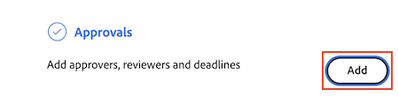

# Erstellen von Dokumentüberprüfungs- oder Genehmigungsanfragen

Sie können die Genehmigung von anderen Benutzern oder Teams für ein Dokument in Adobe Workfront anfordern oder anfordern, dass diese ein Dokument überprüfen, ohne es genehmigen zu müssen.

>[!IMPORTANT]
>
>Der Inhalt dieses Artikels bezieht sich auf die aktualisierte Funktion zur Dokumentgenehmigung, die nur für bestimmte Konten verfügbar ist. Informationen zu Standardgenehmigungsverfahren finden Sie in den Artikeln unter [Arbeitsgenehmigungen](/help/quicksilver/review-and-approve-work/manage-approvals/manage-approvals.md).

## Zugriffsanforderungen

+++ Erweitern Sie , um die Zugriffsanforderungen für die Funktionalität in diesem Artikel anzuzeigen.

Sie müssen über folgenden Zugriff verfügen, um die Schritte in diesem Artikel ausführen zu können:

<table style="table-layout:auto"> 
 <col> 
 <col> 
 <tbody> 
  <tr> 
   <td role="rowheader">Adobe Workfront-Plan*</td> 
   <td> 
Alle
 </td> 
  </tr> 
  <tr> 
   <td role="rowheader">Adobe Workfront-Lizenz*</td>  
   <td> 
Überprüfen oder höher
 </td> 
  </tr> 
  <tr> 
   <td role="rowheader">Konfigurationen auf Zugriffsebene*</td> 
   <td> 
Zugriff auf Projekte, Aufgaben, Probleme, Vorlagen, Portfolios, Programme, Berichte, Dashboards und Kalender, Dokumente anzeigen oder höher
 
Hinweis: Wenn Sie immer noch keinen Zugriff haben, fragen Sie Ihren Workfront-Administrator, ob er zusätzliche Zugriffsbeschränkungen für Ihre Zugriffsebene festlegt. Informationen dazu, wie ein Workfront-Administrator Ihre Zugriffsebene ändern kann, finden Sie unter <a href="/help/quicksilver/administration-and-setup/add-users/configure-and-grant-access/create-modify-access-levels.md" class="MCXref xref">Benutzerdefinierte Zugriffsebenen erstellen oder ändern</a>.
 </td> 
  </tr>
  <tr> 
   <td role="rowheader">Objektberechtigungen</td> 
   <td> 
Zugriff auf das Objekt verwalten, das mit dem Anforderungszugriff oder der Genehmigung verknüpft ist 
 
Weitere Informationen zum Anfordern von zusätzlichem Zugriff finden Sie unter <a href="/help/quicksilver/workfront-basics/grant-and-request-access-to-objects/request-access.md" class="MCXref xref">Anfordern des Zugriffs auf Objekte </a>.
 </td> 
  </tr> 
 </tbody> 
</table>

&#42;Wenden Sie sich an Ihren Workfront-Administrator, um zu erfahren, welchen Plan, welchen Lizenztyp oder welchen Zugriff Sie haben.

+++

## Erstellen einer Dokumentüberprüfung- oder Genehmigungsanforderung über die Dokumentseite

1. Bewegen Sie den Mauszeiger über das Dokument und klicken Sie auf Dokumentdetails.
   

1. Wählen Sie in der Nähe des Dokumentnamens die Version des Dokuments aus, für die Sie im Dropdown-Menü Version eine Genehmigung erstellen möchten. Standardmäßig wird die neueste Version ausgewählt.

1. Klicken Sie im linken Bereich auf **Genehmigungen** .

1. (Optional) Legen Sie einen Termin für die Genehmigung fest. Benutzer und Teams werden per E-Mail 72 Stunden und 24 Stunden vor Ablauf der angegebenen Frist benachrichtigt.

1. Um einen Genehmiger hinzuzufügen, klicken Sie auf den **Genehmiger** und beginnen Sie mit der Eingabe eines Benutzer- oder Teamnamens.

1. Um einen Überprüfer hinzuzufügen, klicken Sie auf das Kontrollkästchen **Überprüfer** und beginnen Sie mit der Eingabe des Namens eines Benutzers oder Teams.

   

1. Wiederholen Sie den vorherigen Schritt, um weitere Genehmiger oder Validierer hinzuzufügen.

## Erstellen Sie im Bedienfeld &quot;Dokumentzusammenfassung&quot;eine Anforderung zur Überprüfung oder Genehmigung von Dokumenten.

1. Wechseln Sie zum Projekt, zur Aufgabe oder zum Problem, das/das das Dokument enthält, und wählen Sie dann **Dokumente** aus.

1. Klicken Sie auf das benötigte Dokument. Daraufhin wird der Bereich Dokumentzusammenfassung für dieses Dokument geöffnet.

1. Wählen Sie im Versions-Dropdown-Menü die Version des Dokuments aus, für das Sie eine Genehmigung erstellen möchten. Standardmäßig wird die neueste Version ausgewählt.

1. Scrollen Sie nach unten zum Abschnitt **Genehmigungen** im Bereich &quot;Dokumentzusammenfassung&quot;und klicken Sie dann auf **Hinzufügen**.

1. (Optional) Legen Sie einen Termin für die Genehmigung fest. Benutzer und Teams werden per E-Mail 72 Stunden und 24 Stunden vor Ablauf der angegebenen Frist benachrichtigt.

1. Um einen Genehmiger hinzuzufügen, klicken Sie auf den **Genehmiger** und beginnen Sie mit der Eingabe eines Benutzer- oder Teamnamens.

1. Um einen Überprüfer hinzuzufügen, klicken Sie auf das Kontrollkästchen **Überprüfer** und beginnen Sie mit der Eingabe des Namens eines Benutzers oder Teams.

   

1. Wiederholen Sie den vorherigen Schritt, um weitere Genehmiger oder Validierer hinzuzufügen.

<!--
## Resubmit an approval on a new version

Document approval decisions are not automatically reset when you upload a new version. For example, if your document is approved with changes, the decision will show "changes" as the decision, even if you upload a new version with the specified changes. You can clear the decision on a new version if you manually resubmit the approval.

1. Go to the project, task, or issue that contains the document, then select **Documents**.
1. Find the document you need.

1. Scroll down to the **Approvals** section in the Summary, click the More icon, then click Resubmit.

   
-->
