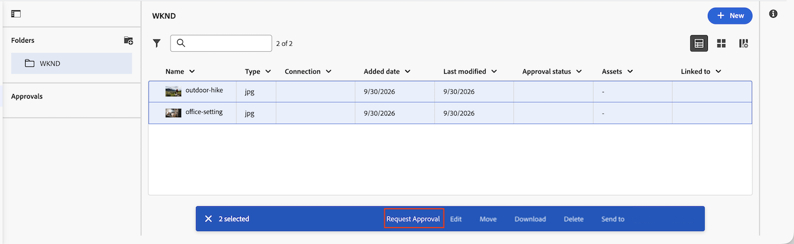

# Erstellen einer gruppierten Genehmigung

Die Informationen auf dieser Seite sind in der Sandbox-Vorschau-Umgebung nicht verfügbar, da die Frame.io-Integration dort nicht verfügbar ist. Diese Funktion ist ab dem 14. und 15. Oktober 2026 in Produktionsumgebungen verfügbar.

Bei einer gruppierten Genehmigung werden mehrere Assets unter einem einzigen Genehmigungs-Workflow gebündelt. Sie können den einfachen und erweiterten Modus, mehrere Phasen und parallele Pfade mit gruppierten Genehmigungen verwenden, genau wie Sie es mit Genehmigungen für einzelne Assets tun können.

Gruppierte Validierungen sind nur im Bereich Neue Dokumente verfügbar, der angezeigt wird, wenn Ihr Unternehmen den Adobe Cloud-Speicher verwendet. Weitere Informationen finden Sie unter [Übersicht über den Adobe-Cloud-Speicher](/help/quicksilver/review-and-approve-work/esm-overview.md).

## Zugriffsanforderungen

+++ Erweitern, um die Zugriffsanforderungen für die in diesem Artikel beschriebene Funktionalität anzuzeigen.

<table style="table-layout:auto">
 <col>
 <col>
 <tbody>
  <tr>
   <td role="rowheader">Adobe Workfront-Paket</td>
   <td> 
Beliebiges Workflow-Paket zum Verwalten von Genehmigungen mithilfe des Adobe-Cloud-Speichers
 </td>
  </tr>
  <tr>
   <td role="rowheader">Adobe Workfront-Lizenz</td>
   <td>
   
Mitwirkende oder höher

   
Überprüfen oder höher

   
Für Objekte, die den Adobe-Cloud-Speicher verwenden, benötigen Sie eine Standardlizenz, um Genehmigungs-Workflows zu erstellen.

   </td>
  </tr>
  <tr>
   <td role="rowheader">Konfigurationen der Zugriffsebene</td>
   <td> 
Anzeigen oder Erweitern des Zugriffs auf Projekte, Aufgaben, Probleme, Vorlagen, Portfolios, Programme, Berichte, Dashboards, Kalender und Dokumente
</td>
  </tr>
  <tr>
   <td role="rowheader">Objektberechtigungen</td>
   <td> 
Verwalten des Zugriffs auf das mit der Anfrage oder Genehmigung verknüpfte Objekt
</td>
  </tr>
 </tbody>
</table>

Weitere Informationen finden Sie unter [Zugriffsanforderungen](/help/quicksilver/administration-and-setup/add-users/access-levels-and-object-permissions/access-level-requirements-in-documentation.md) in der Dokumentation zu Workfront.

+++

## Erstellen einer einfachen gruppierten Genehmigung

So erstellen Sie eine einstufige gruppierte Genehmigung:

1. Gehen Sie zu dem Projekt, der Aufgabe oder dem Problem, das/das die Dokumente enthält, und wählen Sie **Dokumente** im linken Bereich aus.

1. Klicken Sie auf das erste Asset, das Sie einbeziehen möchten, und dann bei gedrückter Umschalttaste auf die zusätzlichen Assets, um mehrere Assets auszuwählen.

1. Klicken Sie bei ausgewählten Assets **unteren Menü auf** Genehmigung anfordern“. Das **„Genehmigung anfordern** wird im Standardmodus geöffnet.

   

1. Füllen Sie die folgenden Details aus:

   <table>
   <tr>
   <td><strong>Verwenden einer Validierungsvorlage (optional)</strong></td>
   <td>Das Feld Vorlagen ist standardmäßig reduziert. Klicken Sie auf das Feld, um es zu erweitern, und wählen Sie dann eine Vorlage aus dem Dropdown-Menü aus. Wenn die Vorlage über einen Pfad und ein Stadium verfügt, wird sie im Standardmodus angewendet. Wenn die Vorlage mehr als ein Stadium oder mehr als einen Pfad enthält, wechselt das Dialogfeld automatisch in den erweiterten Modus und alle Eingaben, die Sie im Standardmodus eingegeben haben, werden durch den Inhalt der Vorlage ersetzt.</td>
   </tr>
   <tr>
   <td><strong>Personen oder Teams in der Vorschau hinzufügen</strong></td>
   <td>
Beginnen Sie mit der Eingabe eines Benutzernamens, Teams oder einer E-Mail-Adresse und wählen Sie aus, ob es sich um einen <strong>Genehmiger</strong> oder <strong>Prüfer</strong> handelt. Workfront fügt jedes aktive Mitglied eines Teams einzeln hinzu.

   
Hinweis: Wenn ein(e) Benutzende(r) bereits hinzugefügt wurde oder zu mehr als einem Team gehört, das Sie hinzufügen, wird er/sie einmal einbezogen.
</td>
   </tr>
   <tr>
   <td><strong>Nur eine Entscheidung erforderlich (optional)</strong></td>
   <td>Die erste Person, die eine Entscheidung trifft, schließt die Phase ab.</td>
   </tr>
   <tr>
   <td><strong>Fällig am (optional)</strong></td>
   <td>Legen Sie ein Fälligkeitsdatum für die Genehmigung fest. Benutzer werden 72 Stunden und dann 24 Stunden vor dem angegebenen Fälligkeitsdatum per E-Mail benachrichtigt.</td>
   </tr>
   <tr>
   <td><strong>Benutzerdefinierte Nachricht hinzufügen (optional)</strong></td>
   <td>Geben Sie eine Nachricht in das Textfeld <strong>Benutzerdefinierte Nachricht hinzufügen</strong> ein. Die Meldung wird in der E-Mail-Benachrichtigung über die Genehmigung und auf der Registerkarte Genehmigungen in Workfront angezeigt.</td>
   </tr>
   </table>

1. (Optional) Klicken Sie auf die Registerkarte **Dokumente**, um die in dieser Genehmigung enthaltenen Assets zu überprüfen.

1. Klicken Sie **Genehmigung anfordern**.

   

## Erweiterte gruppierte Validierung erstellen

Der erweiterte Modus unterstützt parallele Pfade. Jeder Pfad wird unabhängig voneinander ausgeführt und enthält eine oder mehrere sequenzielle Phasen. Wenn alle erforderlichen Entscheidungen in einem Schritt getroffen werden, beginnt die nächste Phase in diesem Pfad, die vorherige Phase wird gesperrt und die Prüfer und genehmigenden Personen des neuen Schritts erhalten eine E-Mail-Benachrichtigung.

Eine Entscheidung bezüglich „Arbeit erforderlich“ stoppt den Pfad, in dem sie sich befindet, hat aber keine Auswirkungen auf den Genehmigungs-Workflow in anderen Pfaden.

<!--
You can configure up to 30 paths and 100 stages total.
-->

So erstellen Sie eine erweiterte gruppierte Genehmigung:

1. Gehen Sie zu dem Projekt, der Aufgabe oder dem Problem, das/das die Dokumente enthält, und wählen Sie **Dokumente** im linken Bereich aus.

1. Klicken Sie auf das erste Asset, das Sie einbeziehen möchten, und dann bei gedrückter Umschalttaste auf die zusätzlichen Assets, um mehrere Assets auszuwählen.

1. Klicken Sie bei ausgewählten Assets **unteren Menü auf** Genehmigung anfordern“.

   

1. Klicken Sie oben rechts im Dialogfeld **Genehmigung anfordern** auf **Zu Erweitert wechseln**. Jede Eingabe, die Sie im Standardmodus eingegeben haben, wird beibehalten und auf **Pfad 1**, **Schritt 1** angewendet.

   >[!TIP]
   >
   >Während Sie die Genehmigung erstellen, können Sie zum Standardmodus zurückkehren, indem Sie oben rechts auf **Zum** wechseln klicken. Nachdem Sie die Genehmigungsanfrage gesendet haben, **die Option** Zur Basis wechseln“ nicht mehr verfügbar.

1. Füllen Sie die Details für Schritt 1 von Pfad 1 aus:

   <table>
   <tr>
   <td><strong>Name der Phase</strong></td>
   <td>Stadien werden standardmäßig <em>Stadium 1</em>, <em>Stadium 2</em> usw. benannt. Benennen Sie die Phase in eine aussagekräftigere Bezeichnung um, z. B<em> „Erstprüfung</em> oder "<em> Genehmigung</em>.</td>
   </tr>
   <tr>
   <td><strong>Personen oder Teams in der Vorschau hinzufügen</strong></td>
   <td>
Beginnen Sie mit der Eingabe eines Benutzernamens, Teams oder einer E-Mail-Adresse und wählen Sie aus, ob es sich um einen <strong>Genehmiger</strong> oder <strong>Prüfer</strong> handelt. Workfront fügt jedes aktive Mitglied eines Teams einzeln hinzu.

   
Hinweis: Wenn ein(e) Benutzende(r) bereits hinzugefügt wurde oder zu mehr als einem Team gehört, das Sie hinzufügen, wird er/sie einmal einbezogen.
</td>
   </tr>
   <tr>
   <td><strong>Nur eine Entscheidung erforderlich (optional)</strong></td>
   <td>Die erste Person, die eine Entscheidung trifft, schließt die Phase ab.</td>
   </tr>
   <tr>
   <td><strong>Fällig am (optional)</strong></td>
   <td>Die erste Phase jedes Pfads unterstützt ein absolutes Fälligkeitsdatum. Jede nachfolgende Phase im Pfad unterstützt ein relatives Fälligkeitsdatum (die Anzahl der Tage ab dem Zeitpunkt, zu dem diese Phase geöffnet wird). Benutzer werden 72 Stunden und dann 24 Stunden vor dem Fälligkeitsdatum per E-Mail benachrichtigt.</td>
   </tr>
   <tr>
   <td><strong>Benutzerdefinierte Nachricht hinzufügen (optional)</strong></td>
   <td>Geben Sie eine Nachricht in das Textfeld <strong>Benutzerdefinierte Nachricht hinzufügen</strong> ein. Die Meldung wird in der E-Mail-Benachrichtigung über die Genehmigung und auf der Registerkarte Genehmigungen in Workfront angezeigt.
Wenn Sie ein zweites Stadium hinzufügen<strong> wird „Diese Nachricht auf allen Stadien anzeigen</strong> standardmäßig ausgewählt. Lassen Sie die Option aktiviert, damit in jedem Schritt dieselbe Nachricht verwendet wird. Um für jede Phase eine andere Nachricht zu verwenden, deaktivieren Sie <strong>Diese Nachricht in allen Phasen anzeigen</strong> und geben Sie dann die phasenspezifische Nachricht in das Textfeld <strong>Benutzerdefinierte Nachricht hinzufügen</strong> für jede Phase ein.
</td>
   </tr>
   </table>

1. (Optional) Fügen Sie zusätzliche Schritte zu Pfad 1 hinzu:
   1. Klicken Sie **Phase hinzufügen**, um dem aktuellen Pfad eine weitere Phase hinzuzufügen. Die Phasen innerhalb eines Pfads werden nacheinander in der angegebenen Reihenfolge ausgeführt.
   1. Geben Sie Details für die neue Phase ein und wiederholen Sie diesen Schritt, um bei Bedarf weitere Phasen hinzuzufügen.

      >[!NOTE]
      >
      >Sie können Stadien innerhalb eines Pfads neu anordnen, aber Sie können eine Phase nicht von einem Pfad in einen anderen verschieben. Jeder Pfad kann eine andere Anzahl von Phasen aufweisen.

1. (Optional) Fügen Sie einen parallelen Pfad hinzu:
   1. Klicken Sie **Parallele Pfade** auf der linken Bildschirmseite auf **Pfad hinzufügen**, um einen weiteren Pfad hinzuzufügen.
   1. Gehen Sie ebenso vor, um dem neuen Pfad Stadien und Teilnehmer hinzuzufügen. Jeder Pfad wird unabhängig voneinander ausgeführt, sodass Sie in jedem Pfad eine unterschiedliche Anzahl von Stadien und unterschiedliche Teilnehmer haben können.

1. (Optional) Um einen Pfad zu entfernen, bewegen Sie den Mauszeiger über die Pfadbeschriftung und klicken Sie auf das Papierkorbsymbol. **Pfad 1** kann nicht entfernt werden und Pfade können nicht neu angeordnet werden. Andere Pfade können nur entfernt werden, wenn kein Schritt innerhalb des Pfades gesperrt oder abgeschlossen ist.

1. (Optional) Um alle Pfade und Phasen zu löschen und von vorne zu beginnen, klicken **oben** auf „Zurücksetzen“.

1. (Optional) Klicken Sie auf die Registerkarte **Dokumente**, um die in dieser Genehmigung enthaltenen Assets zu überprüfen.

1. Klicken Sie **Genehmigung anfordern**.

   

<!--

## Add additional documents to a grouped approval

You can add additional documents to a grouped approval after the approval has been created as long as the first stage has not been completed. 

To add an additional document to a grouped approval:

1. Click any document in the grouped approval, then click **Manage Approval** in the bottom menu.
1. Click **Documents on this approval**, then click **Add**.

   
1. Choose the documents you want to add, then click **Add to approval**. 
1. Once you add all of the documents, click **Edit approval**. The new documents are added to the grouped approval and all participants are notified of the change.

-->

## Bekannte Einschränkungen

* Derzeit können Sie einem gruppierten Genehmigungs-Workflow keine Dokumente hinzufügen oder daraus entfernen, nachdem er einmal erstellt wurde. Diese Funktion ist für eine künftige Version geplant.
* Gruppierte Genehmigungen sind vorübergehend auf 3 Pfade und 25 Assets pro Gruppe beschränkt.