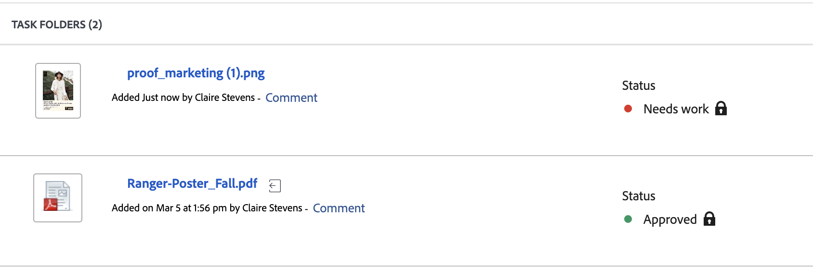

# Überblick über den Entscheidungsstatus eines Dokuments

Sie können den Status des Dokuments direkt in der Dokumentliste einsehen:

Die folgenden Status sind verfügbar:

<table>
            <col style="width: 50%;" />
            <col style="width: 50%;" />
            <tbody>
                 <tr>
                    <td>
                        Überprüfung ausstehend

                    </td>
                    <td>
                        <ul>
                            <li>
                                Prüfer und genehmigende Personen wurden benachrichtigt, haben das Asset jedoch noch nicht geöffnet.
                            </li>
                        </ul>
                    </td>
                </tr>
                 <tr>
                    <td>
                        Wird geprüft

                    </td>
                    <td>
                        <ul>
                            <li>
                                
Mindestens ein Reviewer hat das Asset angezeigt

                            </li>
                            <li>
                                
Mindestens ein Reviewer hat die Überprüfung nicht abgeschlossen

                            </li>
                            <li>
                                
Diesem Asset wurden keine genehmigenden Personen zugewiesen

                            </li>
                        </ul>
                    </td>
                </tr>
                 <tr>
                    <td>
                        Überprüft

                    </td>
                    <td>
                        <ul>
                            <li>
                                
Alle Reviewer haben ihre Überprüfung abgeschlossen

                            </li>
                            <li>
                                
Diesem Asset wurden keine genehmigenden Personen zugewiesen

                            </li>
                        </ul>
                    </td>
                </tr>
                 <tr>
                    <td>Muss bearbeitet werden

                    </td>
                    <td>
                        <ul>
                            <li>
                                
Alle Genehmigungen und Prüfungen sind abgeschlossen

                            </li>
                            <li>
                                
Mindestens eine genehmigende Person hat eine Entscheidung mit dem Hinweis „Arbeit erforderlich“ getroffen

                                
Andere genehmigende Personen haben möglicherweise Entscheidungen von „Genehmigt mit Änderungen“ oder „Genehmigt“ erteilt.
                            </li>
                        </ul>
                    </td>
                </tr>
                  <tr>
                    <td>Mit Änderungen genehmigt

                    </td>
                    <td>
                        <ul>
                            <li>
                                
Alle Genehmigungen und Prüfungen sind abgeschlossen

                            </li>
                            <li>
                                
Mindestens eine genehmigende Person hat eine Entscheidung mit dem Status „Genehmigt mit Änderungen“ getroffen

                                
Andere genehmigende Personen haben möglicherweise Entscheidungen vom Typ „Genehmigt“ getroffen.
                            </li>
                            
Hinweis: Diese Option steht nicht zur Verfügung, wenn Sie die Frame.io-Integration zur Überprüfung und Genehmigung verwenden.

                        </ul>
                    </td>
                </tr>
                 <tr>
                    <td>Genehmigt

                    </td>
                    <td>
                        <ul>
                           <!--
                           <li>
                                
All approvals and reviews are complete

                            </li>
                            -->
                            <li>
                                
Alle genehmigenden Personen haben möglicherweise Entscheidungen vom Typ „Genehmigt“ getroffen.
                            </li>
                        </ul>
                    </td>
                </tr>
           </tbody>
        </table>

<!--

<table>
            <col style="width: 50%;" />
            <col style="width: 50%;" />
            <tbody>
                 <tr>
                    <td>
                        Pending review

                    </td>
                    <td>
                        <ul>
                            <li>
                                Reviewers and approvers have been notified, but have not yet opened the asset.
                            </li>
                        </ul>
                    </td>
                </tr>
                 <tr>
                    <td>
                        In review

                    </td>
                    <td>
                        <ul>
                            <li>
                                
At least one reviewer or approver has viewed the asset

                            </li>
                            <li>
                                
At least one reviewer has not completed their review

Or

                                
At least one approver has not made an approval decision

                            </li>
                        </ul>
                    </td>
                </tr>
                 <tr>
                    <td>
                        Reviewed

                    </td>
                    <td>
                        <ul>
                            <li>
                                All reviews are complete
                            </li>
                            <li>
                                There are no approvers
                            </li>
                        </ul>
                    </td>
                </tr>
                 <tr>
                    <td>Needs work

                    </td>
                    <td>
                        <ul>
                            <li>
                                
All approvals and reviews are complete

                            </li>
                            <li>
                                
At least one approver has made a decision of "Needs work"

                                
Other approvers may have given decisions of "Approved with changes" or "Approved"
                            </li>
                        </ul>
                    </td>
                </tr>
                  <tr>
                    <td>Approved with changes

                    </td>
                    <td>
                        <ul>
                            <li>
                                
All approvals and reviews are complete

                            </li>
                            <li>
                                
At least one approver has made a decision of "Approved with changes"

                                
Other approvers may have given decisions of "Approved"
                            </li>
                        </ul>
                    </td>
                </tr>
                 <tr>
                    <td>Approved

                    </td>
                    <td>
                        <ul>
                            <li>
                                
All approvals and reviews are complete

                            </li>
                            <li>
                                
All approvers may have given decisions of "Approved"
                            </li>
                        </ul>
                    </td>
                </tr>
           </tbody>
        </table>

-->
