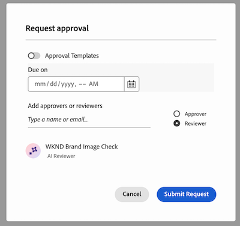

# Erste Schritte mit dem Workfront AI Reviewer

>[!IMPORTANT]
>
>Diese Funktion befindet sich derzeit in der Betaphase.

Mit dem Workfront AI Reviewer können Sie die Inhaltsgeschwindigkeit erhöhen und die Markenkonformität im Prüfungs- und Genehmigungs-Workflow optimieren. Sie können in Workfront KI-Reviewer zu Genehmigungsvorlagen oder individuellen Prüfungs- und Genehmigungsanfragen hinzufügen.

## Zugriffsanforderungen

Um KI-Reviewer in Workfront einzurichten, müssen Sie Systemadministrator sein.

Jeder Benutzer kann den KI-Reviewer zu einer Überprüfungs- und Genehmigungsanfrage hinzufügen.

## Voraussetzungen

* Ihr Unternehmen muss zu Adobe IMS (Identity Management System) migriert sein.
* Für Ihre Workfront-Instanz müssen einheitliche Genehmigungen aktiviert sein.
* Ihr Unternehmen muss über GenStudio Foundation verfügen.
* Adobe muss eine unterzeichnete Adobe Gen AI-Vereinbarung in der Datei haben.
Weitere Informationen zur Unterzeichnung des Abkommens finden Sie unter [Unterzeichnung des Adobe Gen AI-Abkommens](/help/quicksilver/workfront-basics/ai-assistant/ai-assistant-overview.md#sign-the-adobe-gen-ai-agreement).

## Beta-Version

Um an der Beta teilzunehmen, gehen Sie zu **Setup** > **Überprüfung und Genehmigung** > **KI-Prüfer** und klicken Sie auf **Bedingungen akzeptieren**.

## Unterstützte Dateitypen {#supported-file-types-ai-reviewer}

>[!CONTEXTUALHELP]
>id="wf_document_approvals_ai_supported_files"
>title="Nicht unterstützter Dateityp"
>abstract="Dieser KI-Prüfer unterstützt den ausgewählten Dateityp nicht. Laden Sie einen unterstützten Dateityp hoch oder entfernen Sie den KI-Prüfer, um die Anfrage zu senden."

Der KI-Reviewer kann die folgenden Dateitypen überprüfen:

* PNG (.png)
* JPEG (.jpeg, .jpg)
* WEBP (.webp)
* Nicht animierte GIF (.gif)

Wenn Sie einen nicht unterstützten Dateityp hochladen, wird die Option „KI-Reviewer“ beim Erstellen einer Genehmigung nicht angezeigt.

## Einrichten von Markenrichtlinien

Der Workfront AI Reviewer verwendet bei der Überprüfung Ihrer Inhalte die Markenrichtlinien. Workfront-Administratoren können im Bereich &quot;Workfront-Setup“ Markenrichtlinien einrichten. In GenStudio Foundation erstellte Marken sind auch in Workfront verfügbar.

Weitere Informationen finden Sie unter [Einrichten von Marken für den KI-Reviewer](/help/quicksilver/review-and-approve-work/document-reviews-and-approvals/create-a-brand.md).

## KI-Reviewer erstellen

Sobald mindestens eine Marke eingerichtet ist, können Workfront-Administratoren im Bereich „Setup“ mit der Erstellung von KI-Reviewern beginnen. Diese KI-Reviewer können dann Genehmigungsvorlagen und individuellen Prüfungs- und Genehmigungsanfragen zugewiesen werden. Zurzeit können KI-Prüfer nur anhand von Richtlinien für Bild- und Markenbezeichnungen überprüfen.

Weitere Informationen finden Sie unter [KI-Reviewer erstellen](/help/quicksilver/review-and-approve-work/document-reviews-and-approvals/set-up-ai-reviewer.md).

## Hinzufügen von KI-Reviewern zu Prüfungs- und Genehmigungsanfragen

Benutzer können KI-Reviewer zu vorhandenen Genehmigungsvorlagen oder zu individuellen Prüfungs- und Genehmigungsanfragen hinzufügen.

### Genehmigungsvorlagen

Wenn in Ihrem Unternehmen häufig dieselben Personen an Prüfungs- und Genehmigungsanfragen beteiligt sind, können Benutzer von Standardlizenzen im Bereich &quot;Workfront-Setup“ Genehmigungsvorlagen erstellen.

Benutzer können KI-Reviewer zu Genehmigungsvorlagen hinzufügen, um automatisch die Markenkonformität zu überprüfen, wenn eine Vorlage zum Erstellen einer Anfrage verwendet wird.

Nach der Erstellung können Validierungsvorlagen auf Assets im Dokumentbereich eines Projekts, einer Aufgabe oder eines Problems angewendet werden.

Weitere Informationen finden Sie unter [Erstellen einer Genehmigungsvorlage für Assets und Dokumente](/help/quicksilver/review-and-approve-work/document-reviews-and-approvals/manage-document-approvals/create-approval-template.md).

### Individuelle Prüfung und Genehmigung

Wenn Benutzer einzelne Prüfungs- und Genehmigungsanfragen erstellen, können sie einen KI-Reviewer in mit anderen Teilnehmern hinzufügen oder sie können eine einzelne Anfrage mit nur dem KI-Reviewer erstellen, um die Markenkonformität zu überprüfen.

Weitere Informationen finden Sie unter [Erstellen einer Dokumentüberprüfungs- oder Genehmigungsanfrage](/help/quicksilver/review-and-approve-work/document-reviews-and-approvals/manage-document-approvals/create-a-document-approval.md).

## KI-Reviewer-Punktzahl und -Feedback anzeigen

Sekunden nach der Übermittlung der Prüfungs- und Genehmigungsanfrage mit einem KI-Reviewer sind die Punktzahl und das Feedback vom KI-Reviewer im Bedienfeld Dokumentzusammenfassung verfügbar - auch wenn andere Teilnehmer noch immer Prüfungs- und Entscheidungsfindungsprozesse durchführen.

Genehmigungsinhaber erhalten außerdem eine E-Mail, die sie darüber informiert, dass eine Überprüfung des Assets abgeschlossen wurde. Klicken Sie in der E **Mail auf Zum Überprüfen wechseln** die Punktzahl und das Feedback in Workfront anzeigen.

Der KI-Reviewer ist nicht als Entscheidungsträger im Überprüfungs- und Genehmigungs-Workflow vorgesehen. Es werden nur eine Bewertung und Empfehlungen bereitgestellt, um das Asset an den festgelegten Markenanforderungen auszurichten.

Wenn das Bild lange den Markenrichtlinien entspricht, kann der Kreative eine neue Version hochladen und der Genehmigungsinhaber kann eine zweite Überprüfungs- und Genehmigungsanfrage mit dem KI-Reviewer erstellen, sodass Sie zwischen Versionen wechseln und Feedback vergleichen können.

Weitere Informationen zum Anzeigen von Bewertungen und Feedback finden Sie unter [Anzeigen von Bewertungen und Feedback von KI-Prüfern](/help/quicksilver/review-and-approve-work/document-reviews-and-approvals/view-ai-reviewer-feedback.md).

<!--## Video Walkthrough

>[!VIDEO](https://video.tv.adobe.com/v/3470847/)-->