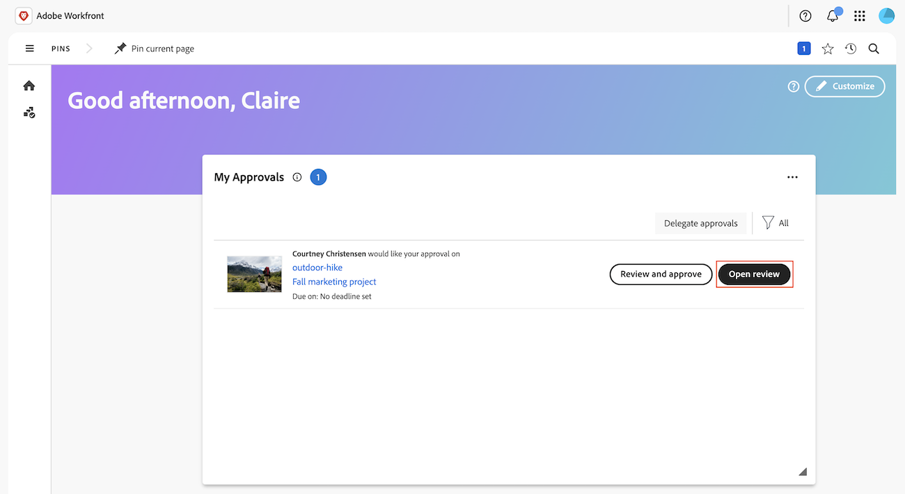
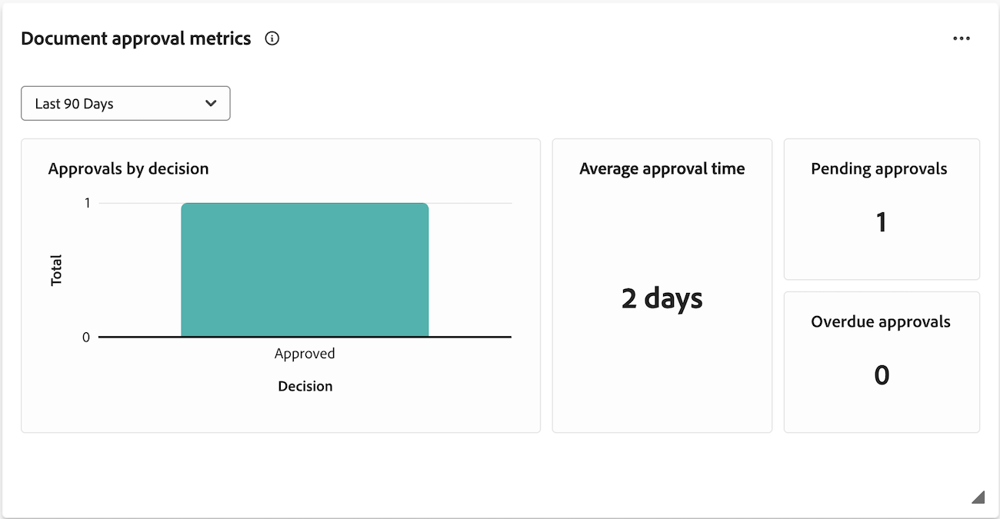

# Erste Schritte mit der einheitlichen Überprüfung und Genehmigung

Einheitliche Prüfung und Genehmigung führt Adobe Workfront und Adobe Frame.io zu einem einheitlichen, eng miteinander verbundenen Erlebnis zusammen und schließt die Lücken zwischen Marketing-Management, kreativer Überprüfung und Bereitstellung von Inhalten. Projektkoordinatoren verwalten die Arbeit in Workfront, während Kreative, Marketingexperten und Stakeholder Assets im professionellen Frame.io-Viewer überprüfen und genehmigen, ohne Dateien zwischen getrennten Tools zu verschieben.

Weitere Informationen zu Frame.io finden Sie unter [Erste Schritte mit Frame.io](https://support.frame.io/en/collections/49298-getting-started).

## Übersichtsvideo

>[!VIDEO](https://video.tv.adobe.com/v/3471078)

## Zugriffsanforderungen

* Ihr Workfront-Vertrag muss eine v2 Workfront SKU enthalten, damit der Frame.io-Viewer und Adobe Enterprise Storage verwendet werden können. Weitere Informationen finden Sie in den häufig gestellten Fragen unter [Einheitliche Überprüfung und Genehmigung - Übersicht](/help/quicksilver/review-and-approve-work/document-reviews-and-approvals/document-approvals-overview.md#getting-started-with-unified-review-and-approval).

## Arbeitsaufnahme und -planung in Workfront

Projektkoordinatoren können in Workfront Projekte erstellen und Arbeiten planen. Projekte, die in einer -Instanz mit aktivierter Frame.io-Integration erstellt wurden, nutzen den Adobe Enterprise-Speicher, mit dem Assets im Adobe-Ökosystem gespeichert und verwaltet werden können.

Wenn Ihr Unternehmen über eine Frame.io Enterprise-Lizenz verfügt, sind in Workfront erstellte Projekte auch in Frame.io sichtbar, sodass Benutzende mit beiden Produkten interagieren und Assets hochladen können.

Informationen zu Adobe Enterprise Storage oder Projekten in Frame.io finden Sie unter

* [Übersicht über Workspace: Projekte](https://help.frame.io/en/articles/9101001-workspace-overview#h_d9f8654895)
* [Überblick über Adobe-Unternehmensspeicher](/help/quicksilver/review-and-approve-work/esm-overview.md)

## Überprüfen und Genehmigen von Assets

Sobald ein Asset abgeschlossen ist, kann der Projektkoordinator den formalen Prüfungs- und Genehmigungsprozess in Workfront einleiten.

Nachdem der Genehmigungs-Workflow erstellt wurde, können Validierungsverantwortliche und genehmigende Personen den Viewer Frame.io verwenden, um Kommentare hinzuzufügen und das Asset zu markieren. Sie können die Genehmigungsentscheidung auch im Frame.io-Viewer treffen.

Weitere Informationen zum Einrichten von Projekten finden Sie unter

* [Projekt erstellen](/help/quicksilver/manage-work/projects/create-projects/create-project.md)

### Starten von formellen Überprüfungen und Genehmigungen in Workfront

Projektkoordinatoren können einmalige Prüfungs- und Genehmigungsvorlagen oder wiederverwendbare Genehmigungsvorlagen erstellen. Sie können Validierungsverantwortliche oder genehmigende Personen bzw. eine Mischung aus beidem zuweisen:

* **Reviewer** können Kommentare hinzufügen und Assets markieren. Nach Abschluss können sie ihre Überprüfung als abgeschlossen markieren. Das Markieren der Überprüfung als abgeschlossen ist nicht erforderlich, damit das Asset im Genehmigungsprozess fortfahren kann.
* **Genehmigende Personen** können Kommentare hinzufügen und Assets markieren. Sie müssen eine Entscheidung treffen, um den Genehmigungsprozess voranzubringen.

#### Erstellen eines Prüfungs- und Genehmigungs-Workflows

Reviewer und genehmigende Personen können einem Genehmigungs-Workflow für den einmaligen Gebrauch oder einer wiederverwendbaren Genehmigungsvorlage hinzugefügt werden:

* **Einmalgenehmigungen**: In dem Projekt oder der Aufgabe, in dem bzw. der sich das Asset befindet, kann der Projektkoordinator Validierungsverantwortliche und genehmigende Personen zuweisen und eine Abschlussfrist festlegen. Validierungsverantwortliche und genehmigende Personen werden 72 Stunden vor Fristablauf, 24 Stunden vor Fristablauf und anschließend innerhalb der Frist per E-Mail daran erinnert.

  Weitere Informationen finden Sie unter [Erstellen eines Dokumentgenehmigungs-Workflows](/help/quicksilver/review-and-approve-work/document-reviews-and-approvals/manage-document-approvals/create-a-document-approval.md#create-an-approval-workflow-from-the-summary-panel-in-the-new-document-area).

* **Validierungsvorlagen**: Im Bereich &quot;Workfront Setup“ können Projektkoordinatoren wiederverwendbare Validierungsvorlagen erstellen. Innerhalb einer Vorlage können Benutzer Validierungsverantwortliche und genehmigende Personen hinzufügen und einen Fertigstellungszeitraum festlegen. Wenn die Validierungsvorlage auf ein Asset angewendet wird, wird die Frist aus dem angegebenen Zeitrahmen berechnet.

  Nachdem eine Vorlage erstellt wurde, kann sie auf ein Asset angewendet werden, um den formellen Prüfungs- und Genehmigungsprozess in Workfront zu starten.

  Weitere Informationen finden Sie unter [Erstellen einer Workflow-Vorlage für Genehmigungen für Dokumente](/help/quicksilver/review-and-approve-work/document-reviews-and-approvals/manage-document-approvals/create-approval-template.md).

### Überprüfen und Genehmigen von Assets im Frame.io-Viewer

Sobald der Prüfungs- und Genehmigungs-Workflow in Workfront initiiert wurde, können Prüfer und genehmigende Personen auf den Viewer Frame.io zugreifen, um Kommentare hinzuzufügen, das Asset zu markieren und eine Entscheidung zu treffen.

Weitere Informationen finden Sie unter [Überprüfen und Genehmigen mit dem Frame.io-Viewer](/help/quicksilver/review-and-approve-work/document-reviews-and-approvals/review-with-frame.md).

#### Zugriff auf den Frame.io-Viewer

Benutzer können auf folgende Weise auf den Viewer Frame.io zugreifen:

* Workfront-E-Mail-Benachrichtigungen
* Das Widget „Meine Genehmigung“ im Workfront-Startbereich

>[!NOTE]
>
>Externe Workfront-Benutzer werden per E-Mail benachrichtigt und aufgefordert, eine Frame.io-Anmeldung zu erstellen, um Assets zu überprüfen und zu genehmigen.

#### Hinzufügen von Kommentaren und Markieren von Assets

Kommentare und Asset-Markup sind im Frame.io-Viewer sichtbar. Weitere Informationen zur Verwendung des Frame.io-Viewers finden Sie unter [Kommentieren von Medien](https://help.frame.io/en/articles/9105251-commenting-on-your-media).

#### Entscheidung treffen

Sobald alle Prüfungsaktivitäten abgeschlossen sind, müssen genehmigende Personen eine der folgenden Entscheidungen treffen:

* **Genehmigen**: Das Asset benötigt keine Änderungen und ist einsatzbereit.
* **Mit Änderungen genehmigt**: Das Asset ist größtenteils abgeschlossen, erfordert jedoch kleinere Änderungen, bevor es verwendet werden kann. Sobald die angegebenen Änderungen vorgenommen wurden, ist das Asset bereit und muss keine weitere Genehmigungsrunde durchlaufen.
* **Muss bearbeitet**: Das Asset muss geändert werden und ist nicht einsatzbereit. Sobald die angegebenen Änderungen vorgenommen wurden, muss das Asset als neue Version hochgeladen werden und eine weitere Genehmigungsrunde durchlaufen. <!--is the same approval workflow automatically applied? Does the coordinator have to do anything to get the approval going? -->

Validierungsverantwortliche können ihre Überprüfung in Workfront als abgeschlossen markieren. Dies ist jedoch nicht erforderlich, damit das Asset im Genehmigungsprozess fortfahren kann.

Weitere Informationen zu Entscheidungen in Workfront finden Sie unter [Übersicht über den &#x200B;](/help/quicksilver/review-and-approve-work/document-reviews-and-approvals/manage-document-approvals/document-approval-status.md).

### Nachverfolgen von Prüfungs- und Genehmigungsmetriken

Projektkoordinatoren können den Fortschritt bei allen während des Fluges durchgeführten Genehmigungen im Bereich Workfront Home oder mit benutzerdefinierten Berichten in den Arbeitsflächen-Dashboards überwachen:

* **Benutzerdefiniertes Dashboard**: Erstellen Sie ein Berichts-Dashboard im Bereich der Arbeitsflächen-Dashboards, um sowohl allgemeine als auch detaillierte Informationen zu Überprüfungen und Genehmigungen mit der Funktion „Einheitliche Genehmigungen“ anzuzeigen. Informationen zu den ersten Schritten finden Sie unter [Erstellen eines Berichts-Dashboards zur Überprüfung und Genehmigung](/help/quicksilver/review-and-approve-work/document-reviews-and-approvals/create-review-and-approval-dashboard.md).
* **Start-Widget für Metriken der Dokumentvalidierung**: Zeigt zwei Diagramme mit Informationen über die durchschnittliche Validierungszeit und Entscheidungen sowie Listenansichten mit ausstehenden und überfälligen Genehmigungen an.
  

## Senden fertiger Assets an Adobe Experience Manager

Sie können die [!DNL Experience Manager Assets]&#x200B; verwenden, um Ihre digitalen Assets zu verwalten und zu speichern, die den Überprüfungs- und Genehmigungszyklus durchlaufen haben. Durch diese Integration können Sie die Funktionen von Adobe Experience Manager, Frame.io und Workfront nutzen, um Ihr Content-Management und Ihre Zusammenarbeitsprozesse zu optimieren.

Weitere Informationen finden Sie unter [Verwenden von Adobe Experience Manager mit der Frame.io-Integration](/help/quicksilver/review-and-approve-work/native-integrations/frame-io/use-aem-with-frame.md).

